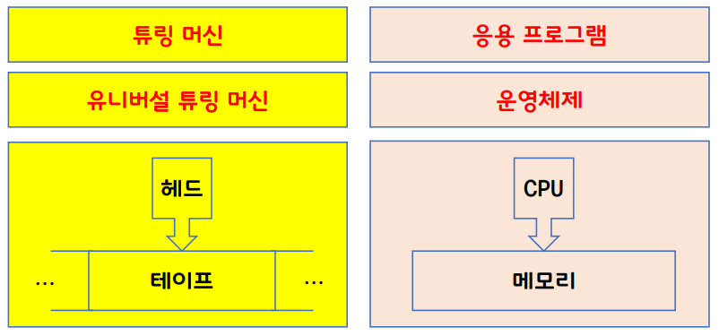
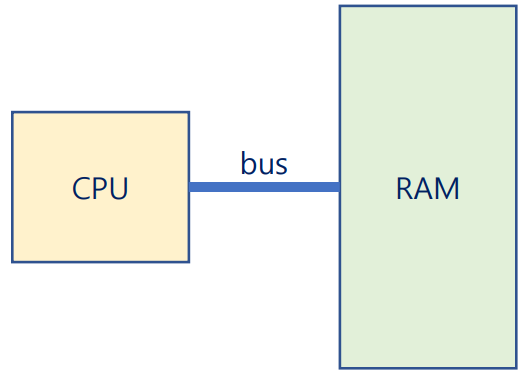

# 운영체제란
* An **operating system** is a software that operates a *computer* system.
* A **computer** is a machine that processes the *information*.
* An **information** can be defined as a *quantitative* representation that *measures* the *uncertainty*.

## 컴퓨터의 정보 처리
* 정보의 최소 단위: bit(*binary digit*)
* 정보의 처리: 정보의 상태 변환 (0 -> 1 or 1 -> 0)
* Boolean Algebra: NOT, AND, OR
* 논리 게이트: NOT, AND, OR, XOR, NAND, NOR
* 논리회로: IC, LSI, SoC, ...
    * [Moore's law](https://en.wikipedia.org/wiki/Moore%27s_law)
* 정보의 저장과 전송: Flip-Flop, Data Bus

### 컴퓨터의 연산 처리 방식
* 덧셈: 반가산기, 전가산기
* 뺄셈: 2의 보수 표현법
* 곱셈 & 나눗셈: 덧셈과 뺼셈의 반복
* 실수 연산: 부동 소수점
* 함수: GOTO
* 이를 기반으로 다양한 작업을 수행

## 컴퓨터는 다음 조건을 충족해야 한다
* Universality(범용성)
    * NOT, AND, OR 게이트만으로 모든 계산을 할 수 있다.
    * NAND 게이트만으로 모든 계산을 할 수 있다.
    * General-purpose computer(범용 컴퓨터)

* Computability(계산가능성)
    * Turing-computable: 튜링 머신으로 계산가능한 것.
    * Halting Problem: 튜링 머신으로 풀 수 없는 문제.

## 컴퓨터의 탄생
* Alan Turing - Turing Machine
* John von Neumann - ISA(Instruction Set Architecture)

### Turing Machine
* Alan Turing이 현대 컴퓨터의 원형을 제시함
{: w="600" h = "300"}

### ISA
* Neumann이 stored-program 방식을 처음으로 제시
    * A **stored-program** computer is a computer that stores *programs* in a memory.
    * Memory에서 Instruction을 fetch를 해오고 CPU에서 Execute하는 구조

{: w="400" h = "400"}

* 따라서, a program is a set of *instructions* that tells a computer's hardware to perform a task.

## 운영체제도 프로그램의 일종
* Operating System
    * is a program *running at all times* on the computer
    * to provide *system services* to application programs
    * to manage *process, resources, user interfaces*, and so on.
