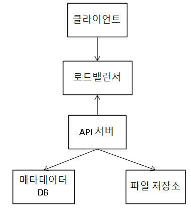
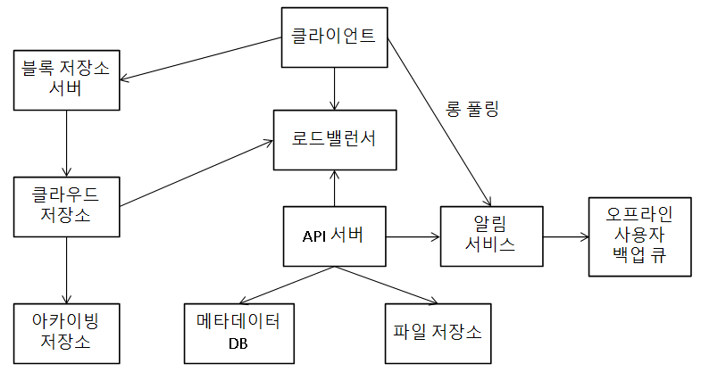

# 구글 드라이브 설계
## 가정
* 주요 기능은 파일 업로드/다운로드, 파일 동기화, 알림
* 모바일 앱, 웹 지원
* 파일 암호화
* 파일 크기 제한은 10GB
* DAU는 10M
* 기능적 요구사항
    * 파일 추가. 가장 쉬운 방법은 드라이브에 drag-and-drop
    * 파일 다운로드
    * 여러 단말에 파일 동기화
    * 파일 갱신 이력 조회
    * 파일 공유
    * 파일이 편집되거나 삭제되거나 새롭게 공유됐을 때 알림
* 비기능적 요구사항
    * 안정성
    * 빠른 동기화 속도
    * 네트워크 대역폭
    * 규모 확장성

### 개략적 규모 추정
* 한 대의 서버로 시작
    * 파일 업로드/다운로드 처리용 웹 서버
    * 사용자 데이터, 로그인 정보, 파일 정보 등의 메타데이터를 보관할 DB
    * 파일을 저장할 저장소 시스템 1TB
        * dirve/ 디렉터리 하위에 네임스페이스 디렉터리들을 둬 특정 사용자가 올린 파일을 보관
            * 파일과 폴더는 상대 경로를 네임스페이스와 파일 이름을 결합해 유추 가능

### API
* 파일 업로드 API
    * 단순 업로드: 파일 크기가 작을 때
    * 이어 올리기(resumable upload): 파일 사이즈가 크고 네트워크 문제로 업로드가 중단될 가능성이 높을 때
        * 인자: 업로드타입, 업로드할 로컬 파일
        * 이어 올리기 URL을 받기 위한 최초 요청 전송
        * 데이터를 업로드하고 업로드 상태 모니터링
        * 장애가 발생하면 장애 발생시점부터 업로드 재시작
* 파일 다운로드 API
    * 인자: 다운로드할 파일의 경로
* 파일 갱신 히스토리 API
    * 인자: 갱신 히스토리를 가져올 파일의 경로, 히스토리 길이의 최대치
* 위 API 들은 사용자 인증을 필요로 하고 HTTPS 프로토콜을 사용해야 함
    * 클라이언트와 백엔드 서버가 주고받는 데이터를 보호하기 위해 SSL(Secure Socket Layer) 사용

### 한 대의 서버 극복
* 파일 시스템이 가득 차게 됐을 때
    * 우선 데이터를 샤딩(sharding)해볼 수 있음
    * 또는 AWS S3와 같은 서비스 도입
        * 규모 확장성, 가용성, 보안, 성능 등을 제공하는 객체 저장소 서비스
        * 같은 지역 또는 여러 지역에 걸쳐 다중화 지원
            * 데이터 손실을 막고 가용성을 최대한 보장 가능
* 또 다른 고려점
    * 로드밸런서
        * 네트워크 트래픽 분산과 특정 웹 서버에 장애가 발생시 해당 서버 우회에 사용
    * 웹 서버
        * 로드밸런서로 인해 더 많은 웹 서버를 쉽게 추가 가능해 트래픽 폭증에 쉽게 대응
    * 메타데이터 DB
        * DB를 파일 저장 서버에서 분리해 SPOF 회피
        * 다중화 및 샤딩 적용해 가용성과 규모 확장성 확보
    * 파일 저장소
        * S3를 파일 저장소로 사용하고 가용성과 데이터 무손실 보장하기 위해 두 개 이상의 지역에 데이터 다중화

{: w="25%"}

### 동기화 충돌
* 두 명 이상의 사용자가 같은 파일이나 폴더를 동시에 업데이트하려고 할 때
    * 먼저 처리되는 변경은 성공, 나중에 처리되는 변경은 충돌이 발생한 것으로 볼 수 있음
* 동기화 충돌 오류가 발생한 시점에 시스템에는 같은 파일의 두 가지 버젼이 존재
    * 사용자가 가진 로컬 사본과 서버에 있는 최신 버전

### 개략적인 설계안

{: w="31.67%"}

* 사용자 단말: 클라이언트
* 블록 저장소 서버(block server): 파일 블록을 클라우드 저장소에 업로드하는 서버
    * 파일을 여러 블록으로 나눠 저장하며, 각 블록은 고유 해시값이 할당됨
        * 해시값은 메타데이터 DB에 저장
        * 각 블록은 독립적인 객체로 취급돼 클라우드 저장소 시스템에 보관
        * 파일을 재구성하려면 블록을 원래 순서대로 합쳐야 함
* 클라우드 저장소: 파일은 블록 단위로 나눠져 클라우드 저장소에 보관
* 아카이빙 저장소(cold storage): 오랫동안 사용되지 않은 비활성 데이터를 저장
* 로드밸런서: 요청을 모든 API 서버로 고르게 분산
* API 서버: 파일 업로드 외에 거의 모든 것을 담당
    * 사용자 인증, 사용자 프로파일 관리, 파일 메타데이터 갱신 등
* 메타데이터 DB: 사용자, 파일, 블록, 버전 등 메타데이터 정보를 관리
    * 실제 파일은 클라우드에 보관하며, 이 DB는 오직 메타데이터만 보관
* 메타데이터 캐시: 성능을 높이기 위해 자주 쓰이는 메타데이터 캐시
* 알림 서비스: 특정 이벤트가 발생헀음을 클라이언트에게 알리는 발생/구독 프로토콜 기반 시스템
* 오프라인 사용자 백업 큐(offline backup queue): 클라이언트가 접속 중이 아니라서 파일의 최신 상태를 확인할 수 없을 때 해당 정보를 보관해 나중에 클라이언트가 접속했을 때 동기화될 수 있게 함

## 상세 설계
### 블록 저장소 서버
* 정기적으로 갱신되는 큰 파일들은 업데이트가 일어날 때마다 전체 파일을 서버로 보내면 네트워크 대역폭을 많이 차지
* 최적화 기법
    * 델타 동기화(delta sync)
        * 전체 파일 대신 수정된 블록만 동기화
    * 압축(compression)
        * 블록 단위로 압축해 두면 데이터 크기를 많이 줄일 수 있음
        * 압축 알고리즘은 파일 유형에 따라 지정
            * 텍스트 - gzip, bzip2
* 블록 저장소는 파일 업로드에 관계된 힘든 일을 처리하는 컴포넌트
    * 파일을 블록 단위로 나누고, 각 블록에 압축 알고리즘을 적용하고, 암호화 등
    * 전체 파일을 저장소 시스템으로 보내는 대신 수정된 블록만 전송해야 함
    * 새 파일 추가 시
        * 주어진 파일을 작은 블록들로 분할
        * 각 블록을 압축
        * 클라우드 저장소로 보내기 전 암호화
        * 클라우드 저장소로 전송

### 높은 일관성 요구사항
* 강한 일관성(strong consistency) 모델을 지원해야 함
    * 같은 파일이 단말이나 사용자에 따라 다르게 보여서는 안 된다는 것
    * 메타데이터 캐시와 DB 계층에도 같은 원칙이 적용돼야 함
    * 메모리 캐시는 보통 결과적 일관성(eventual consistency) 모델을 지원
* 강한 일관성 달성을 위해 보장해야 할 것
    * 캐시에 보관된 사본과 DB에 있는 원본(master)이 일치
    * DB에 보관된 원본이 변경되면 캐시에 있는 사본을 무효화
* RDB는 ACID를 지원하므로 강한 일관성을 보장하기 쉬우나 NoSQL은 동기화 로직 안에 프로그램을 넣어야 함

### 메타데이터 DB
* 테이블 목록
    * user: 이름, 이메일, 프로파일 사진 등 사용자와 관계된 기본 정보
    * device: 단말 정보. 한 사용자가 여러 단말을 가질 수 있음에 유의
    * namespace: 사용자의 루트 디렉터리 정보
    * file: 파일의 최신 정보
    * file_version: 파일의 갱신 이력
        * 모든 레코드는 이력 훼손을 방지하기 위해 읽기 전용
    * block: 파일 블록에 대한 정보 보관
        * 특정 버전의 파일은 파일 블록을 올바른 순서로 조합하면 복원 가능

### 업로드 절차
* 파일 메타데이터를 추가하기 위한 요청과 파일을 클라우드 저장소로 업로드하기 위한 요청이 한 클라이언트로부터 병렬적으로 전송된 상황
    * 파일 메타데이터 추가
        * 클라이언트가 새 파일의 메타데이터를 추가하기 위한 요청 전송
        * 새 파일의 메타데이터를 DB에 저장하고 업로드 상태를 대기 중(peding)으로 변경
        * 새 파일이 추가됐음을 알림 서비스에 통지
        * 알림 서비스는 관련 클라이언트에 파일이 업로드되고 있음을 알림
    * 파일을 클라우드 저장소에 업로드
        * 클라이언트가 파일을 블록 저장소 서버에 업로드
        * 블록 저장소 서버는 파일을 블록 단위로 쪼갠 다음 압축하고 암호화해 클라우드 저장소에 전송
        * 업로드가 끝나면 클라우드 저장소는 완료 콜백을 호출
            * 콜백은 API 서버로 전송
        * 메타데이터 DB에 기록된 해당 파일의 상태를 완료(uploaded)로 변경
        * 알림 서비스에 파일 업로드가 끝났음을 통지
        * 알림 서비스는 관련 클라이언트에게 파일 업로드가 끝났음을 알림

### 다운로드 절차
* 파일이 새로 추가되거나 편집되면 자동으로 시작
* 다른 클라이언트가 파일을 편집하거나 추가헀다는 것을 감지하는 방법
    * A가 접속 중이고 다른 클라이언트가 파일을 변경하면 알림 서비스가 A에게 변경이 발생했으니 새 버전을 끌어가야 한다고 알림
    * A가 오프라인일 경우 데이터는 캐시에 보관
        * A가 접속 중 상태가 되면 그때 클라이언트가 새 버전을 가져감
* 파일 변경을 감지한 클라이언트는 API 서버를 통해 메타데이터를 새로 가져가고, 그 다음 블록들을 다운받아 파일을 재구성해야함
    * 알림 서비스가 클라이언트에게 파일이 변경됐음을 알림
    * 클라이언트는 새 메타데이터를 요청
    * API 서버는 메타데이터 DB에 새 메타데이터 요청
    * API 서버에게 새 메타데이터 반환
    * 클라이언트에 새 메타데이터 반환
    * 클라이언트는 새 메타데이터를 받는 즉시 블록 다운로드 요청
    * 블록 저장소 서버는 클라우드 저장소에서 블록 다운로드
    * 클라우드 저장소는 블록 서버에 요청된 블록 반환
    * 블록 저장소 서버는 클라이언트에게 요청된 블록 반환
        * 클라이언트는 전송된 블록으로 파일 재구성

### 알림 서비스
* 선택지
    * 롱 폴링(long polling)
    * 웹 소켓(WebSocket)
* 이번 설계에서 롱 폴링을 선택한 이유
    * 채팅과 달리 양방향 통신이 필요하지 않음
    * 드라이브의 경우 알림을 보낼 일이 그렇게 자주 있지 않고, 보내는 경우에도 단시간에 많은 양의 데이터를 보낼 일은 없음
* 클라이언트는 알림 서버와 롱 폴링용 연결을 유지하다 특정 파일에 대한 변경을 감지하면 연결을 끊음
    * 이때 클라이언트는 반드시 메타데이터 서버와 연결해 파일의 최신 내역을 다운로드해야 함
    * 해당 다운로드가 끝났거나 연결 타임아웃에 도달하면 즉시 새 요청을 보내 롱 폴링 연결을 복원하고 유지

### 저장소 공간 절약
* 파일의 갱신 이력 보존과 안전성 보장을 위해 파일의 여러 버전을 여러 데이터센터에 보관해야 하나, 모든 버전을 자주 백업하면 저장용량이 부족함
* 해결방안
    * 중복 제거(de-dupe): 중복된 파일 블록을 계정 차원에서 제거
        * 블록의 해시 값을 비교해 판단
    * 지능적 백업 전략
        * 한도 설정: 보관해야 하는 파일 버전 개수에 상한을 두고, 상한에 도달하면 제일 오래된 버전 삭제
        * 중요한 버저만 보관: 불필요한 버전과 사본이 만들어지는 것을 피하려면, 여러 버전들 중 중요한 것만 골라냄
    * 자주 쓰이지 않는 데이터는 아카이빙 저장소(cold storage)로 이관
        * S3 글래시어 같은 저장소는 S3보다 저렴

### 장애 처리
* 로드밸런서 장애
    * 부(secondary) 로드밸런서를 활성화해 트래픽을 이어 받음
    * 로드밸런서 끼리는 박동(heartbeat) 신호를 주기적으로 보내 상태를 모니터링
        * 일정 시간동안 박동 신호에 응답하지 않은 로드밸런서는 장애가 발생한 것으로 간주
* 블록 저장소 서버 장애
    * 다른 서버가 미완료 상태 또는 대기 상태인 작업을 이어 받음
* 클라우드 저장소 장애
    * S3를 여러 지역에 다중화해 다른 지역에서 파일을 가져옴
* API 서버 장애
    * 무상태 서버이므로 로드밸런서가 장애가 발생한 서버로 트래픽을 보내지 않음
* 메타데이터 캐시 장애
    * 캐시 서버 다중화로 다른 노드에서 데이터를 가져옴
* 메타데이터 DB 장애
    * 주 DB 장애 시 부 DB 중 하나를 주 DB로 바꾸고 부 DB 새로 추가
    * 부 DB 장애 시 다른 부 DB가 읽기 연산을 처리하고 장애 서버 교체
* 알림 서비스 장애
    * 알림 서비스는 모든 사용자와 롱 폴링 연결을 하나씩 유지하므로 많은 연결을 유지하고 관리해야 함
    * 한 대의 서버로 백만 개 이상의 접속을 유지하는 것은 가능하나, 동시에 백만 개의 접속을 시작하는 것은 불가
        * 롱 폴링 연결 복구는 상대적으로 느림
* 오프라인 사용자 백업 큐 장애
    * 큐 다중화
    * 큐에 장애가 발생하면 구독 중인 클라이언트들은 백업 큐로 구독 관계 재설정

## 추가로 논의해볼 부분
* 블록 저장소 서버럴 거치지 않고 파일을 클라우드 저장소에 직접 업로드
    * 파일 전송을 클라우드 저장소가 직접 하므로 업로드 시간이 단축됨
    * 단점
        * 분할, 압축, 암호화 로직을 클라이언트에 둬야 하므로 플랫폼별로 따로 구현해야 함
        * 클라이언트가 해킹 당할 가능성이 있으므로 암호화 로직을 클라이언트에 두는 것은 위험
* 접속상태 관리 로직을 별도의 서비스로 분리

