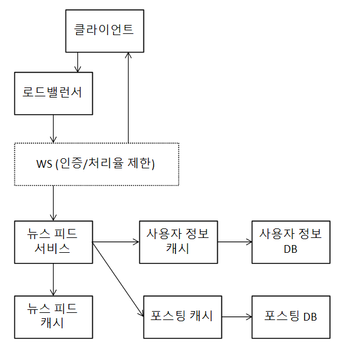

# 뉴스 피드 시스템 설계
## 가정
* 모바일 앱, 웹 둘 다 지원
* 사용자는 뉴스 피드에 새로운 스토리를 올릴 수 있어야 하고, 친구들이 올리는 스토리를 볼 수 있어야 함
* 스토리는 시간 흐름 역순으로 표시
* 친구는 최대 5000명
* DAU는 1000만
* 스토리에는 이미지나 비디오 등의 미디어 파일이 포함될 수 있음

## 개략적인 설계
* 피드 발행과 뉴스 피드 생성으로 구분
    * 피드 발행: 사용자가 스토리를 포스팅하면 해당 데이터를 캐시와 DB에 기록하고 친구의 뉴스 피드에 전송
    * 뉴스 피드 생성: 모든 친구의 포스팅을 시간 흐름 역순으로 모아 생성

### 뉴스 피드 API
* HTTP 기반
* 피드 발행 API
    * 새 스토리를 포스팅하기 위한 API
    * POST
* 피드 읽기 API
    * 뉴스 피드를 가져오는 API

### 피드 발행
* 사용자는 POST API로 새 포스팅을 올림
* 로드밸런서가 트래픽을 WS들로 분산
* WS는 HTTP 요청을 내부 서비스로 중개
* 포스팅 저장 서비스는 새 포스팅을 DB와 캐시에 저장
* 포스팅 전송 서비스는 새 포스팅을 친구의 뉴스 피드에 푸시
    * 캐시 활용
* 알림 서비스는 친구들에게 새 포스팅이 올라왔음을 알리거나, 푸시 알림을 보냄 

### 뉴스 피드 생성
* 사용자가 GET API로 뉴스 피드를 읽음
* 로드 밸런서가 트래픽을 WS들로 분산
* WS는 트래픽을 뉴스 피드 서비스로 보냄
* 뉴스 피드 서비스는 캐시에서 뉴스 피드를 가져옴
* 뉴시 피드 캐시는 뉴스 피드를 랜더링할 때 필요한 피드ID 보관

## 상세 설계
### 피드 발행 흐름 설계
* 웹 서버
    * 클라이언트와 통신 뿐 아니라 인증이나 처리율 제한도 담당
        * 인증 토큰을 Authorization 헤더에 넣고 API 호출해야 포스팅 가능
    * 특정 기간 동안 사용자가 올릴 수 있는 포스팅의 수 제한
        * 스팸을 막고 유해한 컨텐츠가 자주 올라오는 것을 방지
* 포스팅 전송(팬아웃) 서비스
    * 팬아웃(fanout)은 사용자의 새 포스팅을 친구 관계에 있는 모든 사용자에게 전달하는 과정
    * 쓰기 시점에 팬아웃(fanout-on-write)
        * 푸시 모델이라고도 함
        * 포스팅이 완료되면 바로 해당 사용자의 캐시에 포스팅을 기록
        * 장점
            * 뉴스 피드가 실시간으로 갱신돼 친구들에게 즉시 전송
            * 포스팅이 기록되는 순간 뉴스 피드가 이미 갱신되므로 뉴스 피드를 읽는 시간이 감소
        * 단점
            * 친구가 많을 경우 모든 친구들의 뉴스 피드를 갱신하는 데 많은 시간 필요(핫키 문제)
            * 서비스를 자주 이용하지 않는 사용자의 피드까지 갱신해야 하므로 컴퓨팅 자원 낭비
    * 읽기 시점에 팬아웃(fanout-on-read)
        * 풀 모델이라고도 함
        * 피드를 읽어야 하는 시점에서 갱신하는 요청 기반 모델
        * 장점
            * 비활성화된 사용자의 경우, 로그인하기전까지 컴퓨팅 자원을 소모하지 않음
            * 핫키 문제가 생기지 않음
        * 단점
            * 뉴스 피드를 읽는 데 많은 시간이 소요될 수 있음
    * 절충안
        * 그래프 DB에서 친구 ID 목록을 가져옴
        * 사용자 정보 캐시에서 친구들의 정보 가져옴
        * 설정에 따라 일부를 걸러냄
            * 피드 업데이트를 무시하기로 설정한 유저 등
        * 친구 목록과 새 스토리의 포스팅 ID를 메시지 큐에 넣음
        * 팬아웃 작업 서버가 메시지 큐에서 데이터를 꺼내 뉴스 피드 데이터를 뉴스 피드 캐시에 넣음
            * 뉴스 피드 캐시는 <포스팅 ID, 사용자 ID> 매핑 테이블
            * 새로운 포스팅이 만들어질 때마다 레코드들이 추가

### 피드 읽기 흐름 상세 설계

{: w="28.33%"}

* 사용자가 뉴스 피드를 읽으려는 요청을 보냄
* 로드밸런서가 요청을 WS 중 하나로 전달
* WS가 뉴스 피드 서비스 호출
* 뉴스 피드 서비스는 뉴스 피드 캐시에서 포스팅 ID 목록을 가져옴
* 사용자 이름, 사진, 컨텐츠, 이미지 등을 사용자 캐시와 포스팅 캐시에서 가져와 뉴스 피드 생성
* 생성된 뉴스 피드를 JSON 형태로 클라이언트에 전송

### 캐시 구조
* 다섯 계층으로 구분
* 뉴스 피드: 뉴스 피드의 ID 보관
* 컨텐츠: 포스팅 데이터 보관
    * 인기 컨텐츠는 따로 보관
* 소셜 그래프: 사용자 간 관계 정보 보관
* 행동(action): 포스팅에 대한 사용자의 행위 정보 보관
    * 좋아요, 답글 등
* 횟수(counter): 좋아요, 응답, 팔로어, 팔로잉 수 등의 정보 보관

## 추가로 논의해볼 부분
* DB 규모 확장
    * 수직적 VS 수평적
    * SQL VS NoSQL
    * master-slave 다중화
    * replica에 대한 읽기 연산
    * consistency model, sharding 등
* 기타
    * 웹 계층을 무상태로 운영
    * 가능한 많은 데이터 캐시
    * 여러 데이터 센터 지원
    * 메시지 큐 활용
    * 핵심 메트릭에 대한 모니터링 등

