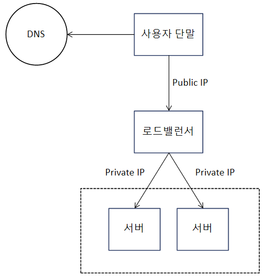
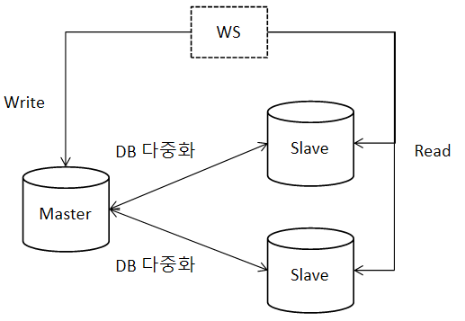
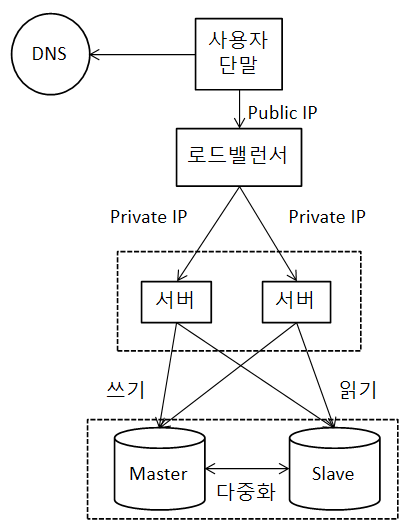
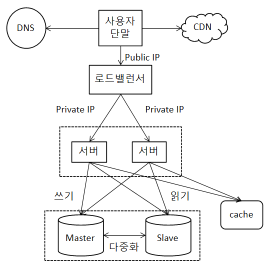
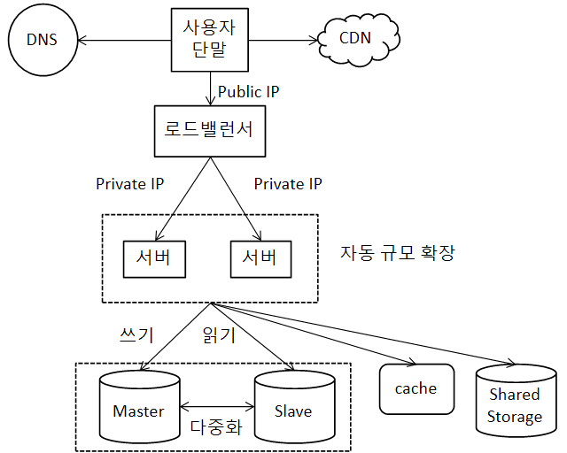
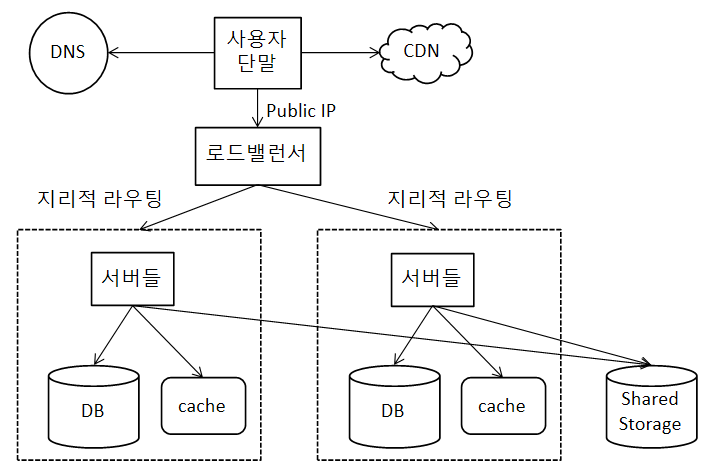

# 사용자 수에 따른 규모 확장성
## 단일 서버
* **한 대의 서버**에서 모든 컴포넌트가 실행되는 시스템의 경우
    * 웹 앱, DB, 캐시 등
* 사용자 단말, 웹 서버, DNS로 구성될 수 있다
    * 엄밀히 따지자면, DNS는 제3 자가 제공하는 서비스이다
    * 단말은 웹 애플리케이션이 될 수도 있고, 모바일 앱이 될 수도 있다
* 요청 처리 흐름
    * 사용자가 URL을 이용해 웹사이트에 접속
        * DNS를 통해 URL을 IP 주소로 변환
    * IP 주소로 HTTP 요청 전달
    * 웹 서버는 HTML이나 JSON 형태로 응답

## 데이터베이스
* 사용자가 늘면 단일 서버로는 충분하지 않아 서버를 분리하게 된다
    * **웹/모바일 트래픽 처리 서버**(웹 계층)과 **데이터베이스 서버**(데이터 계층)으로 분리
    * 이를 통해 각각을 독립적으로 확장해 나갈 수 있게 됨

### 어떤 DB를 사용할 것인가
* RDBMS: 자료를 테이블과 열, 컬럼으로 표현하고 SQL을 사용해 여러 테이블에 있는 데이터를 그 *관계*에 따라 join할 수 있음
* NoSQL: 비 관계형 데이터베이스. 세부적으로 *key-value store*, *graph store*, *column store*, *document store*로 구분
* 일반적으로 RDBMS 도입을 시도하는 경우가 많은데, 아래와 같은 경우 NoSQL 도입이 더 적합할 수 있음
    * 아주 낮은 응답 지연시간(Latency)이 요구됨
    * 다루는 데이터가 비정형(unstructured)라 관계형 데이터가 아님
    * 데이터(JSON, XML 등)를 직렬화(serialize)하거나 역직렬화(deserialize)할 수 있기만 하면 됨
    * 아주 많은 양의 데이터를 저장할 필요가 있음

## 수직적 규모 확장 vs 수평적 규모 확장
* 수직적 규모 확장: scale up. 서버에 고사양 자원(CPU, RAM 증설 등)을 추가하는 행위
* 수평적 규모 확장: scale out. 더 많은 서버를 추가해 성능을 개선하는 행위
* 방법의 단순함 때문에 트래픽의 절대치가 작을 때는 scale up도 좋은 선택지이다.
* 그러나 scale up은 몇 가지 단점이 있다
    * scale up읜 한계치가 있음(CPU나 RAM을 무한대로 증설할 수 없기 때문)
    * 장애에 대한 자동복구(failover)나 다중화(redundancy) 방안을 제시하지 않아, 서버에 장애가 발생하면 웹사이트가 완전히 중단됨
* 따라서 **대규모 에플리케이션**에는 **scale out**이 더 적절하다

### 로드밸런서
* 앞선 설계에서, 웹 서버가 다운되거나, 너무 많은 사용자가 접속하여 웹 서버가 한계 상황에 도달하면 응답 속도가 느려지거나 서버 접속이 불가능해짐
* 이런 문제를 해결하기 위해 **로드밸런서**(load balancer)를 도입
    * 부하 분산 집합(load balancing set)에 속한 웹 서버들에 트래픽 부하를 고르게 분산

{: w="320" h = "360"}
*load balancing example*

* 사용자는 로드밸런서의 public IP로 접속하므로 웹 서버가 클라이언트의 접속을 직접 처리하지 않음
* 로드밸런서와 웹 서버는 private IP로 통신
* 부하 분산 집합에 웹 서버를 추가해 장애를 자동복구하지 못하는 문제를 해소
* 웹 계층 가용성은 아래와 같은 이유로 향상
    * 특정 서버가 다운되면, 해당 서버의 트래픽은 모두 다른 서버로 전송되므로 사이트 전체가 다운되는 일 방지
    * 시스템 전체 트래픽이 증가하면, 웹서버를 증설하고 그러면 로드밸런서가 부하 분산 집합내에서 자동으로 트래픽을 분산해줌

### 데이터베이스 다중화
* DB의 장애 자동복구나 다중화를 해결하기 위해 다중화를 도입
* 보통은 서버 사이에 **주(mater)-부(slave) 관계**를 설정
    * 데이터 원본은 master
    * 사본은 slave
* 쓰기 연산(write operation)은 마스터에만 지원하고 slave는 master로부터 사본을 전달받아 읽기 연산(read operation)만 지원
    * insert, delete, update 등은 master로만
* 애플리케이션은 일반적으로 read가 write 보다 많으므로, 보통 slave의 수가 master보다 많이 구성됨

{: w="320" h = "300"}

* 얻을 수 있는 이점
    * 성능: 변경 연산은 master로만 전달되고, 읽기 연산은 여러 DB로 분산되므로 병렬로 처리될 수 있는 query의 수가 늘어나 성능이 좋아짐
    * 안정성(reliability): DB를 물리적으로 떨어진 여러 장소에 다중화 시켜놓으면 DB 서버 중 일부가 손실돼도 데이터는 보존될 수 있음
    * 가용성(availability): 하나의 DB에서 장애가 발생하더라도 다른 서버의 데이터를 가져와 계속 서비스할 수 있음
* DB 서버가 다운될 경우 발생할 수 있는 경우
    * slave가 다운되는 경우
        * slave가 한 대: 읽기 연산은 한시적으로 master로 전달
        * slave가 여러 대: 읽기 연산은 나머지 slave로 분산
    * master가 다운되는 경우
        * slave 중 하나가 임시적으로 master 역할을 담당
        * slave에 보관된 데이터가 최신 상태가 아닐 수 있음
            * 데이터 복구 스크립트(recovery script)로 추가해야 함
            * 다중 마스터(multi masters)나 원형 다중화(circular replication) 방식으로 도입하면 도움이 될 수 있음

## System Overview

{: w="320" h = "400"}

* 사용자는 DNS로부터 로드밸런서의 IP를 받음
* 사용자는 IP를 통해 로드밸런서에 접속
* 로드밸런서는 HTTP 요청을 부하 분산 집합내 서버로 전달
* 웹 서버는 데이터를 slave DB 서버에서 읽음
* 웹 서버는 데이터 변경 연산을 master DB 서버로 전달 

## 캐시
* 캐시는 값비싼 연산 결과 또는 자주 참조되는 데이터를 메모리에 적재하여, 해당 데이터를 필요로 하는 요청이 빠르게 처리될 수 있도록 하는 저장소

### 캐시 계층
* 캐시 계층(cache tier)는 데이터가 잠시 보관 되는 곳으로, DB보다 훨씬 빠름
    * 성능 개선, DB 부하 감소의 효과가 있고, 캐시 계층의 규모를 독립적으로 확장시키는 것도 가능
* 동작 방식
    * 웹 서버는 캐시에 데이터가 있는지 확인
    * 만약 있다면 해당 데이터를 클라이언트로 반환
    * 만약 없다면 DB에서 데이터를 찾아 캐시에 저장한 후 클라이언트에 반환
* 위와 같은 캐시 전략을 *읽기 주도형 캐시 전략(read through caching strategy)*라고 함

### 캐시 사용 시 유의할 점
* 캐시를 사용하면 좋은 상황
    * 데이터 갱신은 자주 일어나지 않지만 참조는 빈번하게 일어나는 경우
* 캐시에 저장하면 좋은 데이터
    * 휘발성 메모리를 사용하므로 영속적으로 보관할 데이터는 부적합
* 데이터 만료(expire) 관리
    * 만료 정책이 없으면 데이터는 계속 캐시에 남게 되므로 만료 기한을 설정
    * 만료 기한
        * 너무 짧으면 DB 조회가 빈번해짐
        * 너무 길면 원본과 차이가 생길 가능성 높아짐
* 일관성(consistency) 유지
    * 여기서 일관성은 DB의 원본 데이터와 캐시 데이터의 일치성 여부
        * 원본 갱신 연산과 캐시 갱신 연산이 단일 트랜잭션이 아닐 경우 일관성이 깨질 수 있음
    * *Scaling Memcache at Facebook* 논문 참고
* 장애 대처
    * 캐시 서버가 한 대일 경우, 해당 서버가 단일 장애 지점(Single Point of Failure, SPOF)가 될 수 있음
* 캐시 메모리 용량
    * 너무 작으면, 엑세스 패턴에 따라 데이터가 캐시에서 너무 자주 밀려나(eviction) 캐시 성능 저하
    * 캐시 메모리를 과할당(overprovision)하는 것도 방법
* 데이터 방출(eviction) 정책
    * 캐시가 꽉 차버렸는데 캐시에 데이터를 추가해야 하는 경우, 기존 데이터를 내보내는 정책
    * LRU가 가장 널리 쓰이며, LFU나 FIFO도 활용 가능

## 콘텐츠 전송 네트워크(CDN)
* CDN는 **정적 컨텐츠**를 전송하는 데 쓰이는, 지리적으로 분산된 서버의 네트워크
    * 이미지, 비디오, CSS, JS 등을 캐싱
    * 참고로, 동적 컨텐츠 캐싱은 request path, query string, cookie, request header 등의 정보에 기반해 HTML을 캐싱하는 것
* 동작 방식
    * 사용자가 이미지 URL을 통해 이미지에 접근(URL 도메인은 CDN 서비스 사업자가 제공한 것)
    * CDN 서버의 캐시에 해당 이미지가 없는 경우, 원본 서버에 요청을 보내 해당 파일을 가져옴
        * 이미지를 가져올 때, HTTP 헤더에 TTL을 포함하고 있어 TTL 만큼만 캐시됨
    * CDN는 파일을 캐시하고 이미지를 사용자에게 반환
    * 이미지가 만료되지 않았을 때 요청이 들어오면, 캐시를 통해 처리

### CDN 사용 시 고려해야 할 사항
* 비용
    * 제3 사업자(third party providers)가 운영하므로 사용량에 대한 비용을 지불해야 함
    * 자주 사용되지 않아 캐싱하는 이득이 작은 컨텐츠는 CDN에서 제외할 것
* 적절한 만료 시한 설정
    * 시의성이 중요한(time sensitive) 컨텐츠는 만료 시점을 잘 설정해야 함
    * 너무 길면 컨텐츠가 최신 정보가 아닐 수 있게 됨
    * 너무 짧으면 원본 서버 접속량이 많아짐
* CDN 장애 대처
    * CDN이 동작하지 않는 경우, 원본 서버에서 컨텐츠를 가져올 수 있게 클라이언트를 구성할 필요
* 컨텐츠 무효화(invalidation)
    * 아직 만료되지 않는 컨텐츠를 CDN에서 제거하는 방법
        * CDN에서 제공하는 API를 활용
        * 컨텐츠의 다른 버전을 서비스하도록 오브젝트 버저닝(object versioning) 이용
            * URL 마지막에 버전 번호를 인자로 주는 방식

{: w="320" h = "400"}
*CDN & Cache*

## 무상태(Stateless) 웹 계층
* 웹 계층의 수평적 확장을 위해서 상태 정보(e.g. 사용자 세션 데이터)를 웹 계층에서 제거해야 함
    * 상태 정보는 RDB나 NoSQL에 보관하고, 필요할 때 가져옴
* 위와 같이 구성된 웹 계층을 *무상태 웹 계층*이라 부름

### 상태 정보 의존적 아키텍처
* 상태 정보 의존적 아키텍처에서는 사용자에 대한 상태 정보가 서버에 저장됨
    * 세션 데이터나 프로필 이미지 등
* 서버가 여러개인 시스템에서, 만약 특정 사용자에 대한 정보가 특정 서버에 저장됐다고 가정
    * 그럼 해당 사용자 인증을 위해서 모든 HTTP 요청은 반드시 동일 서버로만 전송돼야 함
    * 만약 다른 서버로 전송된다면, 해당 사용자에 대한 정보가 저장되지 않은 서버이기 때문에 인증 실패로 요청이 실패할 것
* 같은 클라이언트로부터의 요청은 항상 같은 서버로 전송돼야 한다는 문제점
    * 로드밸런서가 이를 지원하기 위해 고정 세션(sticky session)이라는 기능 제공
        * 로드밸런서에게 부담
        * 로드밸런서 뒤에 서버를 추가하거나 제거하기 까다로워짐
        * 서버의 장애 처리가 복잡해짐

### 무상태 아키텍처
* 무상태 아키텍처에서 사용자의 HTTP 요청은 어떤 웹 서버로도 전달될 수 있음
    * 상태 정보의 경우, 공유 저장소(shared storage)로부터 가져옴
    * 웹 서버와 물리적으로 분리돼 단순하고, 안정적이며, 확장이 쉬운 구조

{: w="380" h = "400"}
*Staless Architecture*

* 자동 규모 확장(autoscaling)은 트래픽 양에 따라 웹 서버를 자동으로 추가하거나 삭제하는 기능

## 데이터센터
* 서비스의 가용성을 높이고, 전 세계 어디서도 쾌적하게 사용할 수 있도록 하기 위해서 여러 데이터센터(data center)를 지원하는 것이 필수

{: w="420" h = "380"}
*Multi Datacenters*

* 장애가 없는 상황에서 사용자는 가장 가까운 데이터센터로 안내되는데, 이를 지리적 라우팅(geoDNS routing or geo routing)이라 함
    * 지리적 라우팅에서 getDNS는 사용자의 위치에 따라 도메인 이름을 어떤 IP 주소로 변환활지 결정할 수 있도록 해주는 DNS 서비스
* 특정 데이터센터에 심각한 장애가 발생하면, 모든 트래픽은 장애가 없는 데이터센터로 전송
* 다중 데이터센터 아키텍처의 기술적 난제
    * 트래픽 우회
        * 올바른 데이터센터로 트래픽을 보내는 효과적인 방법을 찾아야 함
        * GeoDNS는 사용자에게 가장 가까운 데이터센터로 트래픽을 전송하게 도와줌
    * 데이터 동기화
        * 데이터센터마다 별도의 DB를 사용한다면, 장애가 자동으로 복구돼 트래픽이 다른 DB로 우회된다고 해도, 해당 데이터센터에는 찾는 데이터가 없을 수 있음
        * 데이터를 여러 데이터센터에 걸쳐 다중화할 필요 있음
    * 테스트와 배포
        * 여러 데이터센터를 사용하고 있다면, 애플리케이션을 여러 위치에서 테스트해보는 것이 중요
        * 자동화된 배포 도구를 활용하면 모든 데이터센터에 동일한 서비스가 설치되도록 할 수 있음

## 메시지 큐
* 시스템의 규모를 확장하기 위해서는 시스템의 컴포넌트를 분리하여, 각기 독립적으로 확장할 수 있도록 해야 함
* 메시지 큐(message queue)를 통해 서비스 또는 서버 간의 결합을 느슨하게 구성해 규모 확장성을 도모할 수 있음
* 메시지 큐는 메시지의 무손실(durability)를 보장하는 비동기 통신(asynchronous communication)을 지원하는 컴포넌트
    * 큐에 보관된 메시지는 소비자가 꺼낼 때까지 안전히 보관되기에 무손실을 보장
    * 메시지 버퍼 역할을 하며, 비동기적으로 전송
* 기본 아키텍처
    * 생산자 또는 발행자(producer/publisher)인 입력 서비스가 메시지를 만들어 메시지 큐에 발행(publish)
    * 큐에는 소비자 또는 구독자(consumer/subscriber)인 서비스 또는 서버가 연결돼, 메시지를 수신해 그에 맞는 동작 수행
    * 생산자는 소비자가 다운돼 있어도 메시지를 발행할 수 있고, 소비자는 생산자가 가용한 상태가 아니더라도 메시지 수신 가능
* 예시
    * 사진 보정 애플리케이션의 경우
        * 이미지 보정은 시간이 오래 걸리는 프로세스이므로 비동기로 처리하면 편리
    * 웹 서버는 사진 보정 작업(job)을 메시지 큐에 넣음
    * 보정 작업(worker) 프로세스들은 메시지 큐에서 작업을 꺼내 비동기적으로 완료
* 생산자와 소비자 서비스의 규모는 각기 독립적으로 확장될 수 있음
    * 큐의 크기가 커지면 작업 프로세스를 많이 추가
    * 큐가 비어있다면 작업 프로세스 제거

## 로그, 메트릭 그리고 자동화
* 로그
    * 에러 로그를 모니터링해 시스템의 오류와 문제들을 식별
    * 서버 단위 또는 로그를 단일 서비스로 모아주는 도구 등을 활용
* 메트릭
    * 시스템의 현재 상태를 파악해 사업 현황에 관한 유용한 정보 획득 가능
        * 호스트 단위 메트릭: CPU, 메모리, 디스크 I/O 관련
        * 종합(aggregated) 메트릭: DB 게층의 성능, 캐시 계층의 성능 등
        * 핵심 비즈니스 메트릭: 일별 능동 사용자(DAU), 수익(revenue), 재방문(retension) 등
* 자동화
    * 크고 복잡한 시스템의 생산성을 높이기 위한 자동화 도구를 활용
    * CI/CD 자동화 등

## 데이터베이스의 규모 확장
### 수직적 확장
* 스케일 업. 기존 서버에 더 많은, 고성능의 자원(CPU 등)을 증설
* 약점
    * DB 서버 하드웨어는 한계가 있으므로 자원을 무한 증설할 수는 없음
    * SPOF 위험성
    * 비용이 많이 듦

### 수평적 확장
* **샤딩(sharding)**. 더 많은 서버를 추가해 성능을 향상
* 대규모 DB를 샤드(shard)라고 부르는 작은 단위로 분할
    * 샤드는 같은 스키마를 쓰지만, 샤드에 보관되는 데이터 사이 중복은 없음
        * e.g. user_id 컬럼에 대한 % 연산 결과를 기준으로 4개의 샤드로 회원 정보 분할
* 샤딩에서 중요한 것은 **샤딩 키(sharding key)** 설정
    * 파티션 키(partition key)라고도 함
    * 데이터 분산 기준은 하나 이상의 컬럼으로 구성
        * 위의 예시에서는 user_id가 샤딩 키
* 샤딩 키를 통해 올바른 DB에 질의를 보내 데이터 조회나 변경을 처리하므로 효율을 높일 수 있음 
* 샤딩 키 지정에서 핵심은 데이터를 고르게 분할할 수 있도록 설정하는 것
* 문제점
    * 데이터의 재샤딩(resharding)
        * 필요한 경우
            * 데이터가 너무 많아 하나의 샤드로 감당하기 어려움
            * 샤드 간 데이터 분포가 불균등해 특정 샤드에 할당된 공간 소모가 다른 샤드에 비해 빠를 때
                * 샤드 소진(shard exhaustion)이라고 부름
        * 샤드 키를 계산하는 함수를 변경하고, 데이터를 재배치해야 함
        * 안정 해시(consistent hashing) 활용 가능
    * 유명인사(celebrity) 문제
        * 핫스팟 키(hotspot key) 문제라고도 함
        * 특정 샤드에 질의가 집중돼 서버에 부하가 걸리는 경우
        * 샤드 내에 질의가 많은 데이터 각각에 샤드를 할당해야 할 수도 있고, 더 잘게 쪼개야할 수도 있음
    * 조인과 비정규화(join and denormalization)
        * 샤드로 쪼개진 데이터들은 조인하기 힘들어짐
        * DB를 비정규화하거나 하나의 테이블에서 질의가 수행될 수 있도록 할 필요가 있음

## 정리
* 웹 계층은 무상태 계층으로
* 모든 계층에 다중화 도입
* 가능한 많은 데이터를 캐싱
* 복수의 데이터센터 지원
* 정적 컨텐츠는 CDN을 통해서
* 데이터 계층은 샤딩으로 규모 확장
* 각 계층은 독립적 서비스로 분할
* 시스템을 지속적으로 모니터링하고, 자동화 도구 활용
