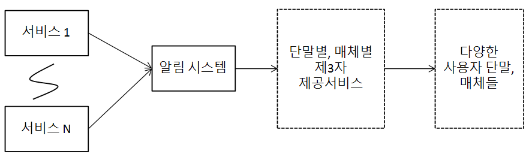
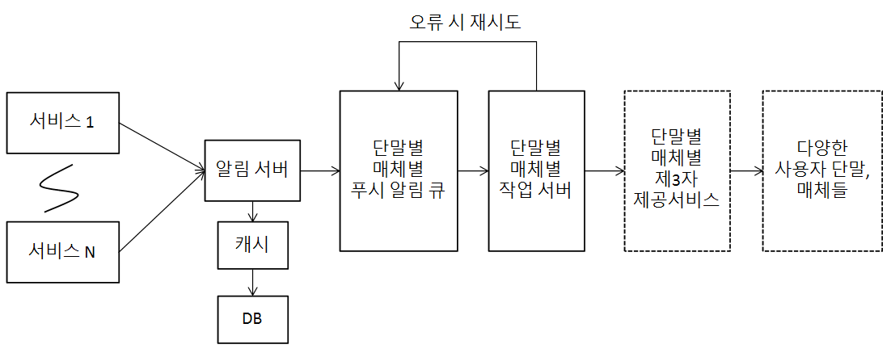

# 알림 시스템 설계
## 가정
* 푸시 알림, SMS 메시지, 이메일 알림 지원
* 연성 실시간(soft real-time)
    * 가능한 한 빨리 전달돼야 하지만, 높은 부하가 걸렸을 때 약간의 딜레이 허용
* iOS, 안드로이드, 랩톱/데스크톱 지원
* 알림은 클라이언트 애플리케이션 프로그램이 생성할 수도 있고 서버 측에서 스케줄링 할 수도 있음
* 사용자는 알림을 받지 않도록 설정 가능
* 하루에 천만 건의 모바일 푸시 알림, 백만 건의 SMS, 5백만 건의 이메일을 보낼 수 있어야 함

## 개략적인 설계
### 알림 유형별 지원 방안
* iOS 푸시 알림
    * 알림 제공자
        * 알림 요청을 만들어 APNS로 보내는 주체
        * 요청 생성에 필요한 데이터
            * 단말 토큰(device token): 알림 요청을 보내는 데 필요한 고유 식별자
            * 페이로드(payload): 알림 내용을 담은 JSON 딕셔너리
    * APNS(Apple Push Notification Service)
        * 애플이 제공하는 원격 서비스로 푸시 알림을 iOS 장치로 보내는 역할
    * iOS 단말
* 안드로이드 푸시 알림
    * iOS와 유사하나, APNS 대신 FCM(Firebase Cloud Messaging) 사용
* SMS 메시지
    * 제3 사업자 서비스를 이용해 SMS 메시지 전송
* 이메일
    * 상용 이메일 서비스 활용

### 연락처 정보 수집 절차
* 앱을 설치하거나 처음 계정을 등록할 때, 해당 사용자의 정보를 수집해 DB에 저장
    * 모바일 단말 토큰, 전화번호, 이메일 주소 등

### 개략적 설계안
* 1부터 N까지의 서비스
    * 서비스 각각은 마이크로서비스일 수도 있고, 크론잡일 수도 있고, 분산 시스템 컴포넌트일 수도 있음
* 알림 시스템
    * 1~N에 알림 전송을 위한 API를 제공하고, 제3자 서비스에 전달할 알림 페이로드 생성
* 제3자 서비스
    * 사용자에게 알림을 실제로 전달
    * 새로운 서비스르 통합하거나 기존 서비스를 제거하기 용이하도록 확장성(extensibility)가 중요
    * 어떤 서비스들은 특정 시장에서 사용할 수 있음
* 사용자 단말

{: w="28.33%"}

* 문제점
    * SPOF
        * 알림 서비스의 장애는 전체 서비스의 장애
    * 규모 확장성
        * 하나의 서비스로 푸시 알림의 모든 것을 처리하므로, DB나 캐시 등 중요 컴포넌트의 규모를 개별적으로 늘릴 수 없음
    * 성능 병목
        * 트래픽이 많이 몰리면 시스템이 과부하

### 개선된 설계안
* DB와 캐시를 알림 시스템의 주 서버에서 분리
* 알림 서버를 증설하고 자동으로 수평적 규모 확장이 이뤄질 수 있도록 설정
* 메시지 큐로 컴포넌트 사이의 강한 결합을 끊음

{: w="33.33%"}

* 1~N까지의 서비스
    * 알림 시스템 서버의 API를 통해 알림을 보낼 서비스들
* 알림 서버
    * 알림 전송 API: 스팸 방지를 위해 사내 서비스 또는 인증된 클라이언트만 이용 가능
    * 알림 검증: 이메일 주소, 전화번호 등에 대한 기본 검증
    * DB 또는 캐시 질의: 알림에 포함시킬 데이터를 가져옴
    * 알림 전송: 알림 데이터를 메시지 큐에 넣음
        * 여러 메시지 큐가 알림을 병렬적으로 처리 가능
* DB
    * 사용자, 알림, 설정 등 정보 저장
* 메시지 큐
    * 시스템 컴포넌트 간 의존성 제거를 위해 사용
    * 다량의 알림이 전송돼야 하는 경우를 대비한 버퍼 역할도 수행
    * 알림 종류별로 구성해 제3자 서비스 중 하나에 장애가 발생해도 다른 종류의 알림들은 정상 동작
* 작업 서버
    * 메시지 큐에서 전송한 알림을 꺼내 제3자 서비스로 전달
* 동작 과정
    * API를 호출해 알림 서버로 알림을 보냄
    * 알림 서버는 사용자 정보, 단말 토큰, 알림 설정 같은 메타데이터를 캐시나 DB에서 가져옴 
    * 알림 서버는 전송할 알림에 맞는 이벤트를 만들어 적절한 큐에 추가
    * 작업 서버는 큐에서 알림 이벤트를 꺼내 제3자 서비스로 전송
    * 제3자 서비스가 단말로 알림 전송

## 상세 설계
### 안정성
* 데이터 손실 방지
    * 알림 지연이나 순서 오류는 괜찮지만 손실은 곤란함
        * 알림 데이터를 DB에 보관하고 재시도 매커니즘을 구현해야 함
    * 알림 로그 DB를 유지하는 것도 방법
* 알림 중복 전송 방지
    * 분산 시스템 특성상 같은 알림이 중복 전송될 수 있음
    * 중복 탐지 매커니즘 필요
        * 보낼 알림이 도착하면, 이벤트 ID를 검사해 중복 이벤트가 아닐 경우에만 발송

### 추가로 필요한 컴포넌트 및 고려사항
* 알림 템플릿
    * 알림 메시지 대부분의 형식은 비슷하므로, 유사성을 고려한 템플릿을 만들어 두면 알림 메시지의 모든 부분을 매번 다시 만들지 않아도 됨
        * 인자(parameter), 스타일, 추적 링크(tracking link)를 조정해 사전에 지정한 형식에 맞춰 알람을 만들어내는 틀
        * 알림의 일관성 유지, 오류 및 작성 시간 감소
    * 예시
        ```text
        여러분이 꿈꿔온 그 상품을 우리가 준비했습니다 . [item_name］이 다시 입고되었습니다！ [date］까지만 주문 가능합니다！ 
        타이틀（ETA: Call to Action): 
        지금 [item_name］을 주문 또는 예약하세요！ 
        ```
* 알림 설정
    * 사용자가 특정 채널로 알림을 받을지 말지 조정할 수 있는 설정 제공
* 전송률 제한
    * 사용자가 받을 수 있는 알림 빈도를 제한해, 너무 많은 알림을 보내지 않도록 함
        * 알림을 너무 많이 보내면 사용자가 기능을 꺼 버릴 수도 있음
* 재시도 방법
    * 제3자 서비스가 전송에 실패하면, 재시도 전용 큐에 넣음
    * 같은 문제가 계속 발생하면, 개발자에게 통지(alert)
* 푸시 알림과 보안
    * iOS나 안드로이드앱의 경우, 알림 전송 API는 appKey와 appSecret을 사용함
        * 인증(authenticated), 또는 승인(verified)된 클라이언트만 해당 API를 사용할 수 있음
* 큐 모니터링
    * 큐에 쌓인 알림의 개수는 중요한 메트릭(metric)
        * 너무 크면, 작업 서버들이 이벤트를 빠르게 처리하고 있지 못하다는 의미
        * 상황에 따른 작업 서버 조절에 활용
* 이벤트 추적
    * 알림 확인율, 클릭율, 실제 앱 사용으로 이어지는 비율 등은 중요한 메트릭
    * 데이터 분석 서비스와 통합해 이런 정보를 파악해야 함

