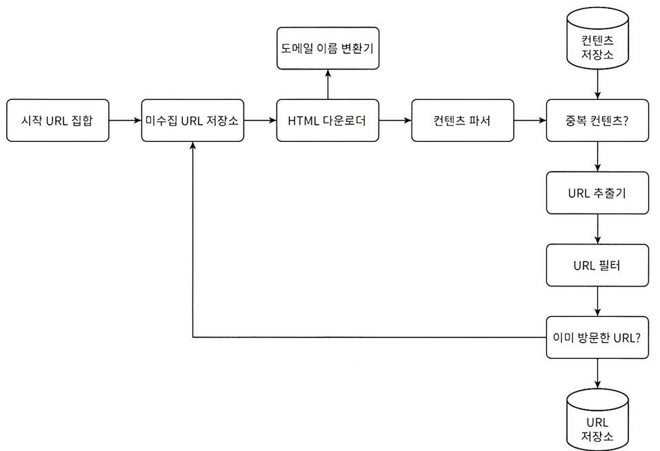

# 웹 크롤러 설계
## 가정
* 검색 엔진 인덱싱 목적
* 매달 10억 개의 웹 페이지 수집
    * 새로 만들어지거나 수정된 웹 페이지도 고려
* 수집된 페이지는 5년간 저장
* 중복 컨텐츠를 갖는 페이지는 무시
* 기본 고려 사항
    * 규모 확장성
        * 병행성(parallelism) 활용
    * 안정성(robustness): 비정상적인 입력이나 환경에 잘 대응
    * 예절(politeness): 수집 대상 웹 사이트에 짧은 시간 동안 너무 많은 요청을 보내면 안 됨
    * 확장성
        * 새로운 형태의 컨텐츠(e.g. 이미지)를 지원하기 위해 전체 시스템을 바꾸면 안 됨

### 개략적 추정
* QPS = 10억/30일/24시간/ 3600초 = 대략 400페이지
* Peak QPS = 2 x QPS = 800
* 웹 페이지의 크기 평균: 500kb
* 저장 용량 요구량은 500TB/월, 총 30PB

## 개략적인 설계
{: w="400" h = "350"}

### 시작 URL 집합
* 웹 크롤러가 크롤링을 시작하는 출발점
* 전체 웹을 크롤링해야 할 경우, 크롤러가 가능한 한 많은 링크를 탐색할 수 있도록 하는 URL을 고르는 것이 좋음
    * 전체 URL 공간을 작은 부분집합으로 나누기
    * 주제별로 다른 시작 URL 사용

### 미수집 URL 저장소
* *다운로드 할 URL*을 저장 관리하는 컴포넌트
* FIFO큐

### HTML 다운로더
* 인터넷에서 웹 페이지를 다운로드하는 컴포넌트
    * 다운로드할 페이지 URL은 미수집 URL 저장소가 제공

### 도메인 이름 변환기
* HTML 다운로더가 URL에 대응되는 IP 주소를 알아낼 때 사용되는 컴포넌트

### 컨텐츠 파서
* 웹 페이지를 다운로드하면 파싱(parsing)과 검증(validation) 절차를 거쳐야 함
    * 이상한 웹 페이지는 문제를 일으킬 수 있음 + 저장 공간 낭비
* 크롤링 서버 안에 구현하면 크롤링 과정이 느려지므로 독립된 컴포넌트로 설정

### 중복 컨텐츠 검증
* 중복 컨텐츠를 처리하기 위한 자료 구조를 도입해 데이터 중복과 처리에 소요되는 시간을 줄임
* HTML 문서를 문자열 비교해도 되지만, 문서 수가 너무 많기 때문에 웹 페이지의 해시 값을 비교하는 것이 더 나음

### 컨텐츠 저장소
* HTML 문서를 보관하는 시스템
* 디스크와 메모리를 동시에 사용
    * 대부분의 컨텐츠는 디스크에 저장
    * 인기 있는 컨텐츠는 메모리에 저장

### URL 추출기
* HTML 페이지를 파싱해 링크들을 골라내는 역할
* 상대 경로를 전부 절대 경로로 변환

### URL 필터
* 특정 컨텐츠 타입이나 파일 확장자를 갖는 URL, 접속 시 오류가 발생하는 URL, 접근 제외 목록에 포함된 URL 등을 크롤링 대상에서 배제

### 이미 방문한 URL 체크
* 이미 방문한 URL이나 미수집 URL 저장소에 보관한 URL을 추적할 수 있는 자료 구조 사용
* 블룸 필터(bloom filter)나 해시 테이블이 많이 쓰임

### URL 저장소
* 이미 방문한 URL을 보관하는 저장소

### 작업 흐름
* 시작 URL들을 미수집 URL 저장소에 저장
* HTML 다운로더는 미수집 URL 저장소에서 URL 목록 로드
* HTML 다운로드는 도메인 이름 변환기를 사용해 URL의 IP 주소를 알아내고, 해당 IP 주소로 접속해 웹 페이지 다운
* 컨텐츠 파서는 다운된 HTML 페이지를 파싱해 올바른 형식을 갖춘 페이지인지 검증
* 컨텐츠 파싱과 검증이 끝나면 중복 컨텐츠인지 확인
    * 해당 페이지가 이미 저장소에 있는지 확인
        * 이미 있는 컨텐츠인 경우, 저장하지 않고 버림
        * 없는 컨텐츠는 저장소에 저장한 뒤 URL 추출기로 전달
* URL 추출기는 해당 HTML 페이지에서 링크를 골라냄
* 골라낸 링크를 URL 필터로 전달
* 필터링이 끝나고 남은 URL만 중복 URL 판별 단계로 이동
    * URL 저장소에 보관된 URL일 경우 버림
    * 없는 URL일 경우, URL 저장소에 저장하고 미수집 URL 저장소에도 전달

## 상세 설계
### DFS vs BFS
* 페이지를 노드, 하이퍼링크(URL)을 간선으로 볼 때, 웹은 유향 그래프라고 할 수 있음
* 크롤링은 이 유향 그래프를 간선을 따라 탐색하는 과정
* DFS는 좋은 선택이 아닐 수 있음
    * 그래프 크기가 클 경우, 얼마나 깊숙이 탐색을 하게 될지 가늠하기 어렵기 때문
* 따라서 보통 BFS를 사용
* 문제점
    * 한 페이지에서 나오는 링크의 상당수는 같은 서버로 되돌아감
    * BFS는 URL 간에 우선순위를 두지 않음
        * 웹 페이지가 같은 수준의 품질, 중요성을 갖지 않음
            * 크롤러가 같은 호스트에 속한 많은 링크를 다운받느라 바빠지게 됨
            * 이 링크들을 병렬 처리하면, 호스트 서버는 많은 요청으로 과부하가 걸리게 됨(impolite crawler)
        * 페이지 순위, 사용자 트래픽의 양, 업데이트 빈도 등을 바탕으로 우선순위를 구별하는 것이 바람직

### 미수집 URL 저장소
* 예의
    * 크롤러가 수집 대상 서버로 짧은 시간에 많은 요청을 보내는 것은 삼가야 하고, 때로는 DoS(Dential-of-Service) 공격으로 간주될 수 있음
    * 예의 바른 크롤러를 만드는 원칙은 '동일 웹 사이트에 대해서는 한 번에 한 페이지만 요청한다는 것'
        * 같은 사이트의 페이지를 다운받는 태스크는 시간차를 두고 실행
    * 웹 사이트의 호스명과 다운로드를 수행하는 작업 스레드 사이의 관계 설정
        * 각 다운로드 스레드는 별도의 FIFO 큐를 가지고, 해당 큐에서 꺼낸 URL만 다운로드
        * 같은 호스트에 속한 URL은 같은 큐에 보관
    * 큐 선택기: 큐들을 순회하면서 큐에서 URL을 꺼내 작업 스레드에 전달
    * 작업 스레드: 전달된 URL을 다운로드하는 작업 수행
        * 작업들 사이에는 delay를 둘 수도 있음
* 우선순위
    * 페이지랭크, 트래픽 양, 갱신 빈도 등 다양한 척도로 URL의 우선순위를 나눌 수 있음
    * 순위결정장치(prioritizer): URL을 입력 받아 우선순위 계산
    * 큐 선택기: 임의 큐에서 처리할 URL을 꺼내는 역할
* 신선도
    * 웹페이지는 수시로 추가/삭제/변경되므로 다운로드한 페이지라고 해도 주기적으로 재수집(recrawl)할 필요가 있음
        * 모든 URL을 재수집하는 것은 비효율적
    * 웹 페이지의 변경 이력이나 우선순위가 높은 페이지는 좀 더 자주 재수집하거나 할 수 있음
* 미수집 URL 저장소를 위한 지속성 저장장치
    * 처리할 URL이 많아 모두 메모리에 보관하는 것은 안정성/규모 확장성 측면에서 부적합
    * 모두 디스크에 저장하는 것은 성능 병목지점이 될 수 있음
    * 대부분의 URL은 디스크에 저장하되, IO비용을 줄이기 위해 메모리 버퍼에 큐를 둘 수 있음

### HTML 다운로더
* 로봇 제외 프로토콜(Robot Exclusion Protocl, a.k.a Robots.txt)
    * 크롤러가 수집해도 되는 페이지 목록이 들어있는 파일
    * 이 파일을 매번 다운로드하지 않기 위해, 주기적으로 다시 다운해 캐시에 보관
* 성능 최적화
    * 분산 크롤링
        * 크롤링 작업을 여러 서버에 분산
            * 각 서버는 멀티 스레드로 다운로드 작업
        * URL 공간은 작은 단위로 분할해, 그 중 일부의 다운로드를 담당하게 함
    * 도메인 이름 변환 결과 캐시
        * DNS는 크롤러 성능 병목임 - DNS 요청/응답이 동기여서
            * 크롤러 스레드 중 하나라도 DNS 요청을 보내면 다른 스레드들의 요청은 전부 Block
        * DNS 조회 결과를 캐시하고 크론 잡(cron job) 등으로 주기적으로 갱신
    * 지역성
        * 크롤링 서버를 지역별로 분산 - 대상 서버와 지역적으로 가까우면 다운로드 시간이 줄어들 것이므로
    * 짧은 타임아웃
        * 응답하지 않는 웹 서버가 있으면, 다운로드를 중단하고 다음 페이지로 넘어가기
* 안정성
    * 안정 해시
        * 다운로더 서버들에 부하를 분산할 때 적용 가능
    * 크롤링 상태 및 수집 데이터 저장
        * 장애 복구를 위해 크롤링 상태와 수집 데이터를 지속적으로 저장장치에 기록
    * 예외 처리
        * 예외가 발생해도 전체 시스템이 중단되지 않도록
    * 데이터 검증
* 확장성
* 문제 있는 컨텐츠 감지 및 회피
    * 중복 컨텐츠
        * 해시나 체크섬
    * 거미 덫(spider web)
        * 크롤러를 무한 루프에 빠뜨리도록 설계한 웹 페이지
            * spidertrapexample.com/foo/bar/foo/bar/foo/bar/...
                * URL 최대 길이 제한
        * 모든 덫을 피할 알고리즘을 만들 순 없음
        * 덫이 있는 사이트를 수작업으로 크롤러 탐색 대상에서 제외하거나 URL 필터 목록에 걸어둘 수 있음
    * 데이터 노이즈
        * 광고, 스크립트 코드, 스팸 URL 등을 제외

## 추가로 생각해볼 부분
* 서버 측 렌더링(server-side-rendering)
    * JS, AJAX를 사용해 링크를 즉석에서 만들어내는 사이트는 다운받아 파싱해보면 동적으로 생성되는 링크를 발결할 수 없음
    * 페이지 파싱 전 서버 측 렌더링(동적 렌더링)을 적용
* 원치 않는 페이지 필터링
    * 스팸 방지 컴포넌트로 스팸성 페이지 필터링
* 데이터베이스 다중화 및 샤딩
* 수평적 규모 확장성
    * 서버가 상태정보를 유지하지 않도록 무상태 서버로 설계
* 가용성, 일관성, 안정성
* 데이터 분석 솔루션
