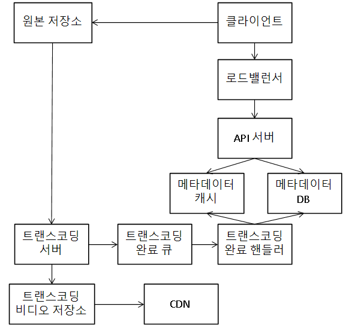
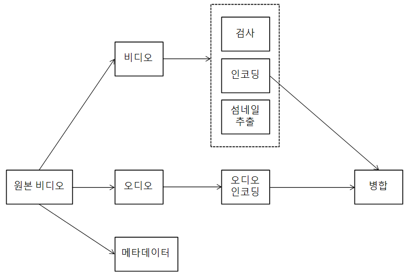
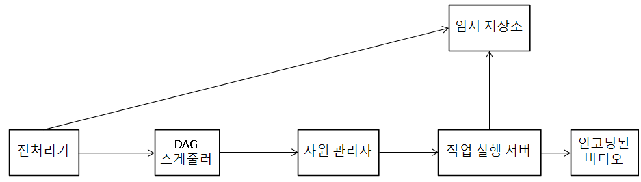

# 유튜브 설계
## 가정
* 주요 기능은 비디오 업로드 및 시청
* 모바일 앱, 웹 브라우저, 스마트 TV 지원
* DAU는 5M
    * 인당 평균 30분 이용
* 다국어 지원
* 다양한 종류의 비디오와 해상도 지원
* 암호화 필요
* 비디오 크기는 1GB 이하
* 클라우드 서비스 활용 가능

### 개략적 규모 추정
* DAU는 5M
    * 한 사용자가 하루에 평균 5개 시청
    * 10%가 하루에 1비디오 업로드
* 비디오 평균 크기는 300MB
    * 매일 새로운 비디오를 위한 용량 = 150TB
* CDN 비용
    * 트래픽이 100% 미국에서 발생한다고 가정할 때, AWS CloudFront 기준 1GB당 $0.02
    * 매일 $150,000

## 개략적인 설계
* CDN과 BLOB 스토리지는 기존 클라우드 서비스 활용
    * 모든 것을 밑바닥부터 만들 필요 없음
    * 규모 확장이 용이한 BLOB과 CDN을 만들긴 어려움
* 시스템 구성 요소
    * 클라이언트: 컴퓨터, 모바일, 스마트 TV 등
    * CDN: 비디오가 저장되며, CDN으로부터 스트리밍이 이뤄짐
    * API 서버: 스트리밍을 제외한 모든 요청 처리
        * 피드 추천, 비디오 업로드 URL 생성, 메타데이터 DB와 캐시 갱신, 사용자 가입 등

### 비디오 업로드 절차
* 구성요소
    * 사용자
    * 로드밸런서: 각 API 서버로 요청을 분산
    * API 서버: 스트리밍을 제외한 다른 모든 요청 처리
    * 메타데이터 DB: 비디오 메타데이터 보관
        * 샤딩(sharding)과 다중화(replication) 적용해 성능 및 가용성 요구사항 충족
    * 메타데이터 캐시: 성능 향상을 위해 비디오 메타데이터와 사용자 객체 캐시
    * 원본 저장소: 원본 비디오를 보관하기 위한 대형 이진 파일 저장소(BLOB)
    * 트랜스코딩 서버(transcoding server): 비디오의 포맷을 변환하는 절차
        * 비디오 인코딩이라고도 함
        * 단말이나 대역폭 요구사항에 맞는 최적의 비디오 스트림 제공
    * 트랜스코딩 비디오 저장소: 트랜스코딩이 완료된 비디오를 저장하는 BLOB 저장소
    * CDN: 비디오 캐시 및 비디오 스트리밍 담당
    * 트랜스코딩 큐: 비디오 트랜스코딩 완료 이벤트들을 보관할 메시지 큐
    * 트랜스코딩 완료 핸들러: 트랜스코딩 완료 큐에서 이벤트 데이터를 꺼내 메타데이터 캐시와 DB를 갱신할 작업 서버

{: w="380" h = "380"}

* 비디오 업로드
    * 비디오를 원본 저장소에 업로드
    * 트랜스코딩 서버는 원본 저장소에서 해당 비디오를 가져와 트랜스코딩
    * 트랜스코딩 완료시, 아래 절차가 병렬적으로 수행
        * 완료된 비디오를 트랜스코딩 비디오 저장소에 업로드
        * 트랜스코딩 완료 이벤트를 트랜스코딩 완료 큐에 넣음
            * 트랜스코딩이 끝난 비디오를 CDN에 올림
            * 완료 핸들러가 이벤트 데이터를 큐에서 꺼냄
            * 완료 핸들러가 메타데이터 DB와 캐시를 갱신
    * API 서버가 단말에 비디오 업로드가 끝나 스트리밍 준비가 됐음을 알림
* 메타데이터 갱신
    * 원본 저장소에 파일이 업로드되는 동안, 단말은 병렬적으로 비디오 메타데이터 갱신 요청을 API 서버에 보냄
        * 파일 이름, 크기, 포맷 등
        * API 서버는 해당 정보로 메타데이터 캐시와 DB 업데이트

### 비디오 스트리밍 절차
* 스트리밍은 단말이 원격지의 비디오로부터 지속적으로 비디오 스트림을 전송 받아 영상을 재생하는 것
* 스트리밍 프로토콜
    * MPEG-DASH
        * Moving Picture Experts Group, Dynamic Adaptive Streaming HTTP
    * Apple HLS
        * HTTP Live Streaming
    * Microsoft Smooth Streaming
    * Adobe HTTP Dynamic Streaming, HDS
* 비디오 전송은 사용자의 단말에서 가장 가까운 CDN 에지 서버(edge server)가 담당

## 상세 설계
### 비디오 트랜스코딩
* 비디오가 다른 단말에서도 순조롭게 재생되려면 다른 단말과 호환되는 비트레이트(bitreate)와 포맷으로 저장돼야 함
    * 비트레이트는 비디오를 구성하는 비트가 얼마나 빨리 처리돼야 하는지를 나타내는 단위
    * 일반적으로 고화질 비디오가 높음
    * 비트레이트가 높은 비디오 스트림을 재생하려면 높은 컴퓨팅 파워와 빠른 인터넷 회선이 필요
* 트랜스코딩이 중요한 이유
    * 가공되지 않은 원본 비디오(raw video)는 용량을 매우 많이 차지
        * 초당 60프레임의 HD 비디오는 수백GB까지 차지
    * 상당수 단말과 브라우저는 특정 종류의 비디오 포맷만 지원
        * 호환성 문제를 해결하기 위해 한 비디오를 여러 포맷으로 인코딩해 두는 것이 좋음
    * 사용자에게 끊김 없는 고화질 비디오 재생을 보장하려면, 대역폭이 충분치 않은 사용자에게는 저화질, 충분한 사용자에게는 고화질 비디오를 보내야 함
    * 모바일의 경우 네트워크 상황이 수시로 달라짐
        * 상황에 따라 비디오 화질이 자동 변경되거나 수동으로 변경할 수 있도록 해야함
* 인코딩 포맷
    * 컨테이너(container)
        * 비디오 파일, 오디오, 메타데이터를 담는 바구니 같은 것
        * .avi, .mov, .mp4
    * 코덱(codec)
        * 화질은 보존하면서 파일 크기를 줄일 목적으로 고안된 압축 및 압축 해제 알고리즘
        * H.264, VP9, HEVC

### 유향 비순환 그래프(DAG) 모델
* 트랜스코딩은 시간도 오래 걸리고 많은 컴퓨팅 자원 소모
    * 컨텐츠 창작자는 각자 자기만의 비디오 프로세싱 요구사항을 갖고 있음
        * 워터마크 표시, 커스텀 섬네일 이미지, 다양한 화질 선호도 등
* 여러 유형의 비디오 프로세싱 파이프라인을 지원하면서 처리 과정의 병렬성을 높이기 위해 적절한 수준의 추상화를 통해 클라이언트 프로그래머로 하여금 실행할 작업(task)를 손수 정의할 수 있도록 해야 함
    * 페이스북의 스트리밍 비디오 엔진은 DAG 프로그래밍 모델을 통해 작업을 단계별로 배열할 수 있도록 해 작업들이 순차적으로 또는 병렬적으로 실행될 수 있게 함

{: w="380" h = "340"}

* 비디오 부분에 적용되는 작업
    * 검사(inspection): 좋은 품질의 비디오인지, 손상은 없는지 확인
    * 비디오 인코딩(encoding): 비디오를 다양한 해상도, 코덱, 비트레이트 조합으로 인코딩
    * 섬네일(thumbnail): 사용자가 업로드한 이미지나 비디오에서 자동 추출된 이미지로 섬네일 제작
    * 워터마크(watermark): 비디오에 대한 식별정보를 이미지 위에 오버레이 형태로 표시

### 비디오 트랜스코딩 아키텍처

{: w="380" h = "300"}

* 전처리기
    * 비디오 분할
        * 비디오 스트림을 GOP(Group of Pictures) 단위로 쪼갬
            * GOP는 특정 순서로 배열된 프레임 그룹
            * 하나의 GOP는 독립적으로 재생 가능하며, 길이는 몇 초 정도
        * GOP 단위의 비디오 분할을 지원하지 않는 단말에 대해서는 전처리기가 비디오 분할을 대신함
    * DAG 생성
        * 클라이언트 프로그래머가 작성한 설정 파일에 따라 DAG 생성
    * 데이터 캐시
        * 전처리기는 분할된 비디오의 캐시 역할도 수행
        * 안정성을 높이기 위해 GOP와 메타데이터를 임시저장소(temporary storage)에 보관
            * 인코딩이 실패하면 보관된 데이터를 활용해 인코딩 재개
* DAG 스케줄러
    * DAG 그래프를 몇 개 단계로 분할한 다음 각각을 자원 관리자의 작업 큐에 넣음
    * 예를 들어, 하나의 DAG 그래프를 아래와 같은 2단계로 쪼갤 수 있음
        * 비디오, 오디오, 메타데이터 분리
        * 해당 비디오 파일과 오디오 파일을 인코딩하고 섬네일을 추출
* 자원 관리자
    * 자원 배분을 효과적으로 수행하는 역할 담당
    * 3개의 큐와 작업 스케줄러로 구성
        * 작업 큐: 실행할 작업이 보관된 우선순위 큐
        * 작업 서버 큐: 작업 서버의 가용 상태 정보가 보관된 우선순위 큐
        * 실행 큐: 현재 실행 중인 작업 및 작업 서버 정보가 보관된 큐
        * 작업 스케줄러: 최적의 작업/서버 조합을 골라, 해당 작업 서버가 작업을 수행하도록 지시
    * 작업 관리자의 동작 방식
        * 작업 큐에서 가장 높은 우선순위의 작업 꺼냄
        * 적합에 적합한 작업 서버 고름
        * 해당 작업 서버에 작업 실행 지시
        * 해당 작업이 어떤 서버에 할당됐는지에 대한 정보를 실행 큐에 넣음
        * 작업이 완료되면 해당 작업을 실행 큐에서 제거
* 작업 서버
    * DAG에 정의된 작업 수행
    * 작업 종류에 따라 작업 서버도 구분해 관리
* 임시 저장소
    * 저장할 데이터의 유형, 크기, 이용 빈도, 데이터 유효기간 등에 따라 다양한 저장소 시스템 활용
        * 예를 들어, 크기도 작고 작업 서버가 빈번히 참조하는 메타데이터는 메모리
        * 비디오/오디오 데이터는 BLOB
    * 비디오 프로세싱이 완료되면 보관한 데이터 삭제
* 인코딩된 비디오
    * 인코딩 파이프라인의 최종 결과물

### 시스템 최적화
* 속도 최적화: 비디오 병렬 업로드
    * 하나의 비디오를 작은 GOP들로 나눠 병렬적으로 업로드
        * 일부가 실패해도 빠르게 업로드 재개 가능
    * 비디오를 GOP 경계에 맞춰 분할하는 작업을 클라이언트가 수행
* 속도 최적화: 업로드 센터를 사용자 근거리에 지정
    * 다양한 지역에 업로드 센터를 두고, 근거리의 센터를 이용하게 함
        * CDN을 활용 가능
* 속도 최적화: 모든 절차를 병렬화
    * 느슨하게 결합된 시스템을 만들어 병렬성을 높임
    * 비디오를 원본 저장소에서 CDN으로 옮기는 절차의 경우
        * 어떤 단계의 결과물을 이전 단계의 결과물이 입력으로 사용되므로 병렬성을 높이기 어려움
        * 각 모듈 사이에 메시지 큐 도입
            * 도입 전, 인코딩 모듈은 다운로드 모듈의 작업이 끝나기를 기다려야 함
            * 도입 후, 메시지 큐에 보관된 이벤트 각각을 인코딩 모듈은 병렬적으로 처 리할 수 있어 다운로드 묘듈을 기다릴 필요 없음
* 안전성 최적화: 미리 사인된 업로드 URL
    * 허가받은(authorized) 사용자만 올바른 장소에 비디오를 업로드할 수 있도록 미리 사인된(pre-signed) 업로드 URL 이용
    * 새 업로드 절차
        * 클라이언트는 HTTP서버에 POST로 미리 사인된 URL을 받음
            * 해당 URL이 가리키는 객체에 대한 접근 권한이 이미 주어진 상태
        * API 서버는 미리 사인된 URL을 반환
        * 클라이언트는 해당 URL이 가리키는 위치에 비디오 업로드
* 안전성 최적화: 비디오 보호
    * 저작권 보호 방법
        * 디지털 저작권 관리(DRM, Digital Rights Management) 시스템
            * 애플의 페어플레이, 구글의 와이드바인, MS의 플레이레디 등
        * AES 암호화
            * 비디오를 암호화하고 접근 권한을 설정
            * 암호화된 비디오는 재생 시에만 복호화되고, 허락된 사용자만 암호화된 비디오 시청 가능
        * 워터마크
            * 비디오 위에 소유자 정보를 포함한 이미지 오버레이를 올림
* 비용 최적화
    * 유튜브 비디오 스트리밍은 롱테일(long-tail) 분포
        * 인기 있는 비디오는 빈번히 재생되나, 나머지는 거의 보는 사람이 없다
    * 인기 비디오는 CDN을 통해 재생하되, 다른 비디오는 비디오 서버 통해 재생
    * 인기가 없는 비디오는 인코딩하지 않거나, 짧은 비디오는 필요할 때 인코딩해 재생
    * 특정 비디오는 특정 지역 외의 지역에 옮기지 않음
    * CDN을 직접 구축하고 ISP와 제휴

### 오류 처리
* 오류의 종류
    * 회복 가능 오류(recoverable error)
        * 특정 비디오 세그먼트를 트랜스코딩하다 실패했다든가 하는 오류
        * 일반적으로, 몇 번 재시도하면 해결
        * 계속 실패해 복구가 어렵다 판단되면, 클라이언트에게 적절한 오류 코드 반환
    * 회복 불가능 오류(non-recoverable error)
        * 비디오 포맷이 잘못됐거나 하는 오류
        * 해당 비디오에 대한 작업을 중단하고 클라이언트에게 적절한 오류 코드 반환
* 전형적인 오류 해결법
    * 업로드 오류: 몇 회 재시도
    * 비디오 분할 오류: 옛 버전의 클라이언트가 GOP 경계에 따라 비디오를 분할하지 못하는 경우라면, 해당 비디오 전체를 서버로 전송하고 서버에서 분할
    * 트랜스코딩 오류: 재시도
    * 전처리 오류: DAG 그래프 재생성
    * DAG 스케줄러 오류: 작업을 다시 스케줄링
    * 자원 관리자 큐 장애: 사본(replica) 이용
    * 작업 서버 장애: 다른 서버에서 해당 작업 재시도
    * API 서버 장애: API 서버는 무상태 서버이므로 신규 요청은 다른 API 서버로 우회
    * 메타데이터 캐시 서버 장애: 데이터는 다중화돼 있으므로 다른 노드에서 데이터를 가져올 수 있음. 장애가 난 캐시 서버는 새 것으로 교체
    * 메타데이터 DB 서버 장애
        * 주 서버가 죽었다면 부 서버 가운데 하나를 주 서버로 교체
        * 부 서버가 죽었다면 다른 부 서버를 통해 읽기 연산을 처리하고 죽은 서버를 교체

## 추가로 논의해볼 점
* API 계층의 규모 확장성 확보 방안
    * API 서버는 무상태 서버이므로 수평적 규모 확장이 가능
* DB 계층의 규모 확장성 확보 방안
    * DB 다중화 및 샤딩
* 라이브 스트리밍
    * 비디오 업로드, 인코딩, 스트리밍이 필요하다는 공통점
    * 차이점
        * 보다 낮은 응답지연이 요구되므로 스트리밍 프로토콜을 신중히 선택
        * 작은 단위의 데이터를 실시간으로 빠르게 처리해야 하므로 병렬화 필요성은 떨어짐
        * 너무 많은 시간이 걸리는 오류 해결 방법은 사용하기 어려움
* 비디오 삭제
    * 저작권 위반 등 부적절한 비디오는 삭제해야 함
    * 업로드 과정에서 식별하 수도 있고, 신고 절차로 판단할 수도 있음
