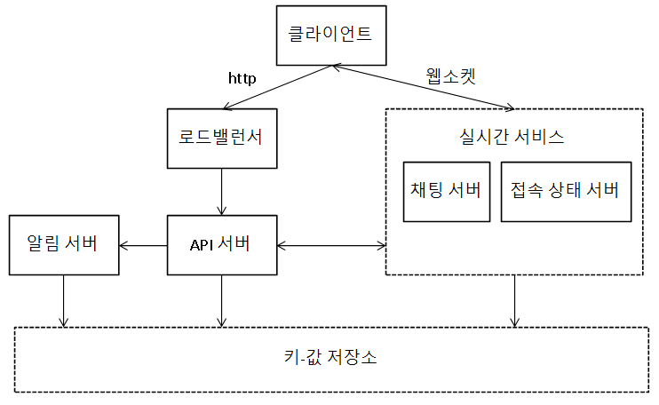

# 채팅 시스템 설계
## 가정
* 1:1과 그룹 채팅 지원
    * 그룹 채팅은 최대 100명
* DAU 5천만
* 텍스트만 주고 받을 수 있고, 사용자 접속상태 표시
    * 100,000자 제한
* 종단 간 암호화 필수는 아님
* 채팅 이력은 영구히 보관

## 개략적인 설계
* 서비스의 기능
    * 클라이언트들로부터 메시지 수진
    * 메시지 수진자(recipient) 결정 및 전달
    * 수신자가 접속(online) 상태가 아닌 경우, 접속할 때까지 메시지 보관
* 클라이언트가 주로 송신 클라이언트(sender)
* HTTP로 메시지들 사용할 경우, keep-alive 헤더를 활용
    * 클라이언트와 서버 사이의 연결을 끊지 않고 계속 유지할 수 있기 때문
    * TCP handshake 횟수를 줄일 수 있음
* 하지만 HTTP 만으로는 서버에서 클라이언트로 임의 시점에 메시지를 보내는 데 쉽게 쓸 수 없음

### 폴링
* 클라이언트가 주기적으로 서버에 새 메시지가 있느냐고 물어봄
* 폴링 비용은 폴링을 자주할 수록 올라감
    * 답해줄 메시지가 없는 경우, 서버 자원이 낭비

### 롱 폴링
* 폴링보다 효율적
* 클라이언트가 새 메시지가 반환되거나 타임아웃 될 때까지 연결 유지
* 새 메시지를 받으면 기존 연결 종료하고 서버에 새 요청을 보내 모든 절차 다시 시작
* 문제점
    * 메시지를 보내는 클라이언트와 수신 클라이언트가 같은 채팅 서버에 접속하게 되지 않을 수 있음
        * HTTP 서버들은 stateless하고, 로드밸런싱을 위해 round-robin 등을 활용하는 경우 메시지를 받은 서버는 해당 메시지를 수신할 클라이언트와의 롱 폴링 연결을 가지고 있지 않을 수 있음
    * 서버는 클라이언트가 연결을 해제했는지 아닌지 알기 어려움
    * 여전히 비효율적
        * 메시지를 많이 받지 않는 클라이언트도 타임아웃이 일어날 때마다 주기적으로 서버에 다시 접속하기 때문
    
### 웹소켓
* 서버가 클라이언트에게 비동기 메시지를 보낼 때 널리 활용
* 동작 과정
    * 클라이언트가 연결을 시작
        * 한 번 맺어진 연결은 항구적 & 양방향
    * 처음에는 HTTP 연결이지만, 핸드셰이크를 거쳐 웹소켓 연결로 전환
    * HTTP & HTTPS 가 사용하는 기본 포트번호를 그대로 사용
        * 방화벽이 있는 환경에서도 잘 동작
* 단, 연결이 항구적으로 유지돼야 하므로 서버 측에서 연결 관리를 효율적으로 해야 함

### 개략적인 설계안
* 통신 프로토콜로는 웹소켓 활용
    * 채팅 외 일반적인 기능은 HTTP로 해도 무방
* 무상태 서비스
    * 로그인 , 회원가입 , 사용자 프로파일 표시 등을 처리하는 전통적인 요청／웅답 서비스
    * 로드밸런서 뒤에 위치
    * 서비스 탐색(service discovery) 서비스로 클라이언트가 접속할 채팅 서버의 DNS 호스트명을 클라이언트에게 알려줄 수 있음
* 상태 유지 서비스
    * 채팅 서비스는 상태 유지가 필요
        * 각 클라이언트가 채팅 서버와 독립적인 네트워크 연결을 유지해야 하기 때문
* 제3자 서비스 연동
    * 앱이 실행하지 않더라도 새 메시지가 오면 푸시가 동작해야 함(알림 시스템 설계 참고)
* 규모 확장성
    * 서버 한 대로 얼마나 많은 접속을 동시에 허용할 수 있느냐가 관건
    * 동시 접속자가 1M이고, 접속당 10K의 서버 메모리가 필요하다면 10GB 메모리면 처리 가능
    * 그러나 SPOF 등의 관점에서 하나의 서버로 모든 것을 처리하는 설계는 비권장

{: w="28.33%"}

* 특징
    * 실시간으로 메시지를 주고 받기 위해 웹소켓 연결은 유지해야 함
    * 채팅 서버는 클라이언트 사이에 메시지를 중계하는 역할
    * 접속상태 서버(presence server)는 사용자의 접속 여부 확인
    * API 서버는 로그인, 회원가입, 프로파일 변경 등 그 외 나머지 전부를 처리
    * 알림 서버는 푸시 알림을 보냄
    * 키-값 저장소는 채팅 이력(chat history) 보관
* 저장소
    * 데이터의 유형과 읽기/쓰기 패턴에 따라 NoSQL과 RDB가 선택
    * 데이터의 종류
        * 사용자 프로파일, 설정, 친구 목록 등 일반적인 데이터
            * 안정성을 보장하는 RDB에 저장
            * 다중화(replication)과 샤딩(sharding)으로 가용성과 규모확장성 보증
        * 채팅 시스템에 고유한 데이터인 채팅 이력
            * 데이터의 양이 엄청남 - 페이스북 메신저나 왓츠앱은 매일 600억개의 메시지를 처리
            * 오래된 메시지는 거의 사용되지 않고, 최근에 주고받은 메시지가 빈번하게 사용
                * 그러나 검색, 특정 사용자가 언급(mention), 특정 메시지로 점프 등을 통해 무작위적인 데이터 접근하는 경우도 있음
            * 1:1 채팅 앱의 경우 읽기:쓰기 비율이 1:1 정도
            * 키-값 저장소를 추천
                * 수평적 규모확장에 용이
                * 데이터 접근 지연시간(latency)가 낮음
                * RDB는 데이터 가운데 롱 테일(long tail)에 해당하는 부분을 잘 처리 못함
                    * 인덱스가 커지면 데이터에 대한 random access 비용 증가
                * 다른 많은 채팅 시스템이 채택 중

### 데이터 모델
* 1:1 채팅을 위한 메시지 테이블
    * message_id를 PK - 메시지 순서에도 활용
    * 그외 송수신자 정보, 내용이나 생성시점 등
* 그룹 채팅
    * channel_id와 meesage_id를 복합키로
    * channel_id를 파티션 키로도 활용
    * 나머지는 위와 유사
* message_id
    * 고유해야 하며, 정렬 가능해야 하고, 시간 순서와 일치해야 함
    * RDB면 auto_increment가 대안이 될 수 있으나, NoSQL은 없음
    * 스노플레이크 같은 전역적 64-bit 순서 번호 생성기 이용 가능
    * 또는, 지역적 순서 번호 생성기(local sequence number generator) 이용
        * 메시지 사이의 순서는 같은 채널 또는 같은 1:1 채팅 세션 안에서만 유지되면 충분하기에 전역적 ID 생성기에 비해 구현이 쉬움

## 상세 설계
### 서비스 탐색
* 클라이언트에게 적합한 채팅 서버를 추천하는 것이 주 기능
* 클라이언트의 위치(geographical location), 서버의 용량(capacity) 등이 기준
    * 아파치 주키퍼 같은 오픈 소스를 활용해 모든 채팅 서버를 등록해두고, 클라이언트가 접속을 시도하면 기준에 따라 서버를 골라 줄 수 있음
* 동작 과정
    * 사용자가 시스템에 로그인을 시도
    * 로드밸런서가 로그인 요청을 API 서버들 중 하나로 전달
    * API 서버가 인증을 처리하고 나면 서비스 탐색 기능 동작해 채팅 서버 탐색
    * 사용자와 선택된 채팅 서버가 웹소켓 연결

### 메시지 흐름
* 1:1
    * A가 채팅 서버1로 메시지 전송
    * 채팅 서버1은 ID 생성기를 사용해 해당 메시지의 ID 결정
    * 채싱 서버1은 메시지를 메시지 동기화 큐로 전달
    * 메시지가 키-값 저장소에 보관
    * 다른 사용자 B
        * 접속 중인 경우, B가 접속 중인 채팅 서버2로 메시지 전송
        * 아닌 경우, 푸시 알림 메시지를 푸시 알림 서버로 보냄
    * 채팅 서버2는 메시지를 B에게 전송
        * B와 서버2 사이의 웹소켓 연결 활용
* 여러 단말 사이의 메시지 동기화
    * 각 단말은 cur_max_message_id라는 변수 유지
        * 해당 단말에서 관측된 가장 최신 메시지의 ID
    * 새 메시지 조건
        * 수신자ID가 현재 로그인한 사용자 ID와 동일
        * 키-값 저장소에 보관된 메시지로서, 그 ID가 cur_max_message_id보다 큼
* 소규모 그룹 채팅에서의 메시지 흐름
    * A가 보낸 메시지가 B와 C의 메시지 동기화 큐에 복사
        * 일종의 수신함 역할
    * 적합한 이유
        * 새로운 메시지가 왔는지 확인하려면 자기 큐만 확인하면 돼 동기화 플로우가 단순
        * 그룹이 크지 않으면 메시지를 수신자별 큐에 복사해 넣는 작업의 비용이 크지 않음
    * 수신자는 여러 사용자로부터 오는 메시지를 수신할 수 있어야 하므로, 메시지 동기화 큐는 여러 사용자로부터 오는 메시지를 받을 수 있어야 함

### 접속상태 표시
* 사용자 로그인
    * 클라이언트와 실시간 서비스 사이에 웹소켓 연결이 맺어지고 나면 접속상태 서버는 A의 상태와 last_active_at 타임스탬프 값을 키-값 저장소에 보관
    * 이 절차가 끝나면 해당 사용자는 접속 중인 것으로 표시
* 로그아웃
    * 로그아웃을 하면 키-값 저장소에 보관된 사용자 상태가 offline으로 전환
* 접속 장애
    * 사용자를 오프라인으로 표시하고 연결이 복구되면 온라인으로 표시
        * 그러나 짧은 시간 동안의 장애에도 상태가 변경되는 건 과함
    * 박동(heartbeat) 검사로 해결
        * 온라인 상태의 클라이언트가 주기적으로 박동 이벤트(heartbeat event)를 접속상태 서버로 보냄
            * 마지막 이벤트를 받은 지 x초 이내에 또 다른 이벤트 메시지를 받으면 접속
            * 못 받으면 오프라인으로 전환
* 상태 정보의 전송
    * 상태정보 서버는 pub-sub model
        * 각 친구관계마다 별도의 채널
    * 클라이언트와 서버 사이 통신은 웹소켓 활용
    * 그룹의 크기가 커지면, 사용자가 그룹 채팅에 입장하는 순간에만 상태 정보를 읽어가게 하거나, 친구 리스트에 있는 사용자의 접속상태를 갱신하고 싶으면 수동으로 하도록 유도할 수 있음

## 추가로 논의해볼만한 부분
* 채팅 앱을 확장해 사진이나-비디오 등의 미디어를 지원
    * 압축 방식, 클라우드 저장소, 섬네일 생성 등
* 종단 간 암호화
    * 발신인과 수신자 이외에 아무도 메시지 내용을 볼 수 없게
* 캐시
    * 클라이언트가 이미 읽은 메시지를 캐시해 서버와 통신을 줄임
* 로딩 속도 개선
    * 지역 분산 네트워크로 앱 로딩속도 개선
* 오류 처리
    * 채팅 서버 오류
        * 채팅 서버 하나가 죽었을 때, 서비스 탐색 기능이 클라이언트들에게 새로운 서버를 배정
    * 메시지 재전송
        * 메시지의 안정적 전송을 보장하기 위해 재시도나 큐 활용

