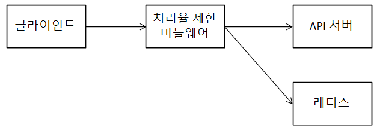
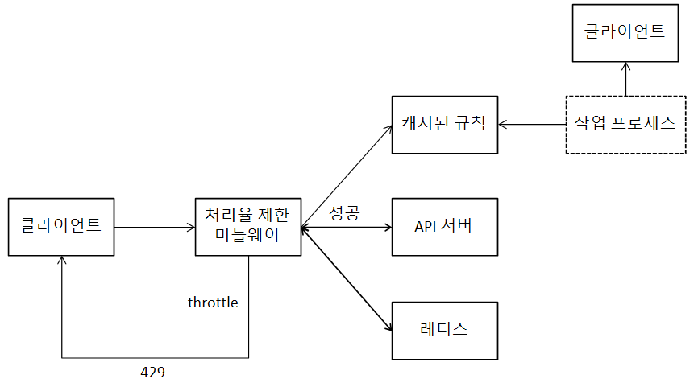

# 처리율 제한 장치의 설계
## 처리율 제한 장치란
* 처리율 제한 장치(reate limiter)는 클라이언트 또는 서비스가 보내는 트래픽의 처리율(rate)를 제어하기 위한 장치
    * HTTP의 경우, 특정 기간 내에 전송되는 클라이언트의 요청 횟수 제한
    * API 요청 횟수가 threshold를 넘어서면 추가로 도달한 호출은 모두 중단(block)
* 사례
    * 사용자는 초당 2회 이상 새 글을 올릴 수 없음
    * 같은 IP주소로 하루에 10개 이상 계정 생성할 수 없음
    * 같은 디바이스로 주당 5회 이상 리워드(reward)를 요청할 수 없음
* 이점
    * DoS(Dential of Service) 공격에 의한 자원 고갈(resource starvation)을 방지
    * 비용 절감
        * 서버를 더 적게 둘 수 있음
        * 우선순위가 높은 API에 더 많은 자원 할당
        * third-party API에 지불하는 사용료를 절감 가능
    * 서버 과부하 방지

## 문제 이해 및 설계 범위 확정
* 가정
    * 처리율 제한 장치의 종류
        * 서버측 API를 위한 장치
    * API 호출 제어 기준
        * IP주소, 사용자ID 등 다양한 형태의 제어 규칙(throttling rules)을 정의할 수 있도록 하는 유연한 시스템
    * 시스템 규모
        * 대규모 요청
    * 분산 환경 여부
        * 분산 환경
    * 독립된 서비스 유무
        * 자유롭게
    * 사용자의 요청이 처리율 제한 장치에 의해 걸러진 경우, 통보 여부
        * 통보해야 함

### 요구사항 요약
* 설정된 처리율을 초과하는 요청은 정확히 제한
* 낮은 응답시간 - HTTP 응답시간에 나쁜 영향을 주지 않도록
* 가능한 한 적은 메모리
* 분산형 처리율 제한(distributed rate limiting) - 하나의 처리율 제한 장치를 여러 서버나 프로세스에서 공유
* 예외 처리 - 요청이 제한됐을 때, 그 사실을 사용자에게 분명히 보여주기
* 높은 결함 내성(fault tolerance) - 제한 장치 장애가 전체 시스템에 영향을 주면 안 됨

## 개략적 설계안 제시
### 처리율 제한 장치는 어디에 둘 것인가?
* 클라이언트측
    * 클라이언트요청은 위변조가 쉬워 처리율 제한을 안정적으로 수행하기 어려움
    * 모든 클라이언트의 구현을 통제하는 것은 어려움
* 서버측
    * API 서버에 둘 수도 있고, 처리율 제한 미들웨어를 만들어 해당 미들웨어로 하여금 API 서버로 가는 요청을 통제하게 할 수도 있음
        * 제한된 요청일 경우, **429(Too many requests)** 반환할 수 있을 것
* 일반적인 MSA
    * API 게이트웨이에 많이 구현
        * 처리율 제한, SSL 종단(termination), 사용자 인증, IP 허용목록(whitelist) 관리 등을 지원하는 완전 위탁관리형 서비스(fully managed)
        * 주로 CSP에서 유지 보수 담당
* 고려 사항
    * 프로그래밍 언어, 캐시 등 현재 사용하고 있는 기술 스택을 점검
        * 프로그래밍 언어가 서버 측 구현을 지원하기 충분할 정도로 효율이 높은지 확인
    * 필요에 맞는 처리율 제한 알고리즘 채택
        * 서버측에 구현하기로 결정했다면, 알고리즘 선택은 자유로울 것
        * third party를 사용하기로 했다면, 선택지는 제한될 수 있음
    * MSA 환경이고, 사용자 인증이나 IP 허용목록 관리 등을 위해 API 게이트웨이를 도입했다면, 처리율 제한 기능 또한 API 게이트웨이에 포함시켜야 할 수도
    * 처리율 제한 장치를 직접 구현할 충분한 인력과 시간이 없다면, 상용 API 게이트웨이 사용을 검토

### 처리율 제한 알고리즘
* 토큰 버킷(token bucket) 알고리즘
    * 토큰 버킷은 지정된 용량을 갖는 컨테이너
        * 사전 설정된 양의 토큰이 주기적으로 채워짐
        * 토큰이 꽉 찬 버킷에는 토큰이 추가되지 않음
    * 각 요청을 처리될 때마다 하나의 토큰을 사용
        * 요청이 도착하면 버킷에 충분한 토큰이 있는지 검사
            * 충분한 토큰이 있는 경우, 토큰 하나를 꺼낸 후 요청을 시스템에 전달
            * 충분한 토큰이 없는 경우, 해당 요청은 버려짐(dropped)
    * 2개의 파라미터가 필요
        * 버킷 크기: 버킷에 담을 수 있는 토큰의 최대 개수
        * 토큰 공급률(refill rate): 초당 몇 개의 토큰이 버킷에 공급되는지
    * 버킷 개수에 대한 규칙
        * 일반적으로, 엔드포인트마다 별도의 버킷 할당
            * 사용마다 하루 한 번만 포스팅을 할 수 있고, 친구는 150명까지 추가할 수 있고, 좋아요는 다섯 번까지만 누를 수 있다면, 사용자마다 3개의 버킷 필요
        * IP 주소별로 처리율 제한을 적용한다면 IP 주소마다 버킷을 하나씩 할당
        * 시스템 처리율을 초당 N개로 제한하고 싶다면, 모든 요청이 하나의 버킷 공유
    * 장점
        * 구현이 쉬움
        * 효율적인 메모리 사용
        * 짧은 시간에 집중되는 트래픽(burst of traffic)도 처리 가능
            * 버킷에 남은 토큰만 있다면 요청이 시스템에 전달됨
    * 단점
        * 버킷 크기와 토큰 공급률을 적절히 튜닝하는 것의 어려움
* 누출 버킷 (leaky bucket) 알고리즘
    * 토큰 버킷과 유사하지만, 요청 처리율이 고정
    * 보통 FIFO 큐로 구현
        * 요청이 도착하면, 큐의 상태를 확인
            * 가득 차 있는 경우 새 요청은 버림
            * 빈 자리가 있는 경우, 큐에 요청 추가
            * 지정된 시간마다 큐에서 요청 꺼내 처리
    * 2개의 파라미터가 필요
        * 버킷 크기: 큐 사이즈
        * 처리율(outflow rate): 지정된 시간당 몇 개의 항목을 처리할지
    * 장점
        * 제한된 큐의 크기로 인한 효율적인 메모리 사용
        * 고정된 처리율을 가지고 있어 안정적 출력(stable outflow rate)가 필요한 경우 적합
    * 단점
        * 단시간에 많은 트래픽이 몰리는 경우 큐에 오래된 요청들이 쌓이게 됨
            * 요청이 제때 처리되지 못하면, 새 요청들이 버려짐
        * 버킷 크기와 처리율을 적절히 튜닝하기 어려움
* 고정 윈도우 카운터(fixed window counter) 알고리즘
    * 타임라인을 고정된 간격의 윈도우로 나누고, 각 윈도우마다 카운터 부여
    * 요청이 접수될 때마다 카운터 1 증가
    * 카운터가 사전에 지정된 threshold에 도달하면, 신규 요청은 새 윈도우로 열리 때까지 버려짐
    * 윈도우 경계 부근에 순간적으로 많은 트래픽이 집중될 경우, 윈도우에 할당된 양보다 많은 요청이 처리될 수 있다는 문제가 있음
        * 분당 최대 5개의 요청만 허용하는 시스템, 카운터 매분 초기화
        * 2시 30초 ~ 2시 1분 사이에 5개의 요청, 2시 1분 ~ 2시 1분 30초 사이에 5개의 요청이 들어온 경우
            * 윈도우가 2시 ~ 2시 1분, 2시 1분 ~ 2시 2분이므로, 각 윈도우에서 5개의 요청을 처리한 거라 문제 없음
            * 근데 윈도우를 2시 30초 ~ 2시 1분 30초로 본다면, 1분 동안 시스템이 처리한 요청은 허용 한도의 2배가 됨
    * 장점
        * 효율적인 메모리 사용
        * 이해하기 쉬움
        * 윈도우가 닫히는 시점에 카운터를 초기화하므로 특정한 트래픽 패턴을 처리하기에 적합
    * 단점
        * 윈도우 경계에 일시적으로 트래픽이 많이 몰릴 경우, 기대헀던 시스템의 처리 한도보다 많은 양의 요청을 처리하게 됨
* 이동 윈도 로그(sliding window log) 알고리즘
    * 고정 윈도우 카운터의 경계 문제를 해결
    * 요청의 타임스탬프를 추적
        * 타임스탬프는 보통 Redis의 sorte set 같은 캐시에 보관
    * 새 요청이 오면, 만료된 타임스탬프 제거
        * 만료된 타임스탬프 = 값이 현재 윈도우 시작 지점보다 오래된 타임스탬프
    * 새 요청의 타임스탬프를 로그에 추가
        * 로그의 크기가 허용치보다 작거나 같은 요청을 시스템에 전달
        * 그렇지 않은 경우 처리 거부
    * 동작 예시
        * 분당 최대 2회의 요청만 처리하도록 설정된 처리율 제한기
        * 1시 1초에 요청 도착
            * 로그가 비어있어 요청 허용
        * 1시 30초에 요청 도작
            * 해당 타임스탬프가 로그에 추가
            * 추가된 직후 로그의 크기는 2이며, 허용 한도보다 크지 않음
            * 요청 허용
        * 1시 50초에 요청 도착
            * 해당 타임스탬프가 로그에 추가
            * 추가된 직후 로그의 크기는 3이며, 허용 한도보다 큼
            * 타임스탬프는 로그에 남지만 요청 거부
        * 1시 1분 40초에 요청 도착
            * 1시 40초부터 1시 1분 40초 사이의 요청들은 1분 위도우 안에 속한 요청
                * 즉, 1시 40초 이전 타임스탬프는 전부 만료된 값
            * 만료된 2개의 타임스탬프(1시 1초, 1시 30초)를 로그에서 제거
                * 직후 로그의 크기는 2(1시 50초, 1시 1분 40초)
            * 요청 허용
    * 장점
        * 매우 정교한 알고리즘으로, 허용되는 요청 개수는 어느 순간의 윈도우에서든 시스템의 처리율 한도를 넘지 않음
    * 단점
        * 다량의 메모리 사용
            * 거부한 요청의 타임스탬프도 보관하기 때문
* 이동 윈도우 카운터(sliding window counter) 알고리즘
    * 위의 두 윈도우 알고리즘을 결합
    * 동작 예시
        * 처리율 제한 장치의 한도가 분당 7개 요청으로 설정
        * 이전 1분 동안 5개의 요청이, 그리고 현재 1분 동안 3개의 요청이 왔음
        * 현재 1분의 30% 시점에 도착한 새 요청의 경우, 현재 윈도우에 몇 개의 요청이 온 것으로 처리해야 할까?
            * 현재 1분간의 요청 수 + 직전 1분간의 요청 수 x 이동 윈도우와 직전 1분이 겹치는 비율
                * 현재 윈도우에 들어있는 요청은 3 + 5 x 70% = 6.5개
                * 반올림해도 되고, 내림해도 됨
            * 내림했을 경우, 1개의 요청을 더 받을 수 있기 때문에 새 요청이 허용됨
    * 장점
        * 이전 시간대의 평균 처리율에 따라 현재 윈도우의 상태를 계산하므로 짧은 시간에 몰리는 트래픽에 잘 대응
        * 효율적인 메모리 사용
    * 단점
        * 직전 시간대에 도착한 요청이 균등 분포됐다는 가정이 들어가므로, 다소 느슨한 알고리즘 - 크게 문제가 되진 않는다

### 개략적인 아키텍처
* 얼마나 많은 요청이 접수됐는지 추적할 수 있는 카운터를 어디에 보관할 것인가
    * DB는 느리기 때문에 캐시가 바람직
        * 더군다나, 캐시는 시간에 기반한 만료 정책까지 지원
        * 레디스의 경우, INCR과 EXPIRE 명령어를 지원
            * INCR: 메모리에 저장된 카운터의 값 1 증가
            * EXPIRE: 타임아웃을 설정해, 설정된 시간이 지나면 자동 삭제

{: w="31.67%"}
*개략적인 구조*

* 동작원리
    * 클라이언트가 처리율 제한 미들웨어에 요청을 보냄
    * 미들웨어는 레디스의 지정 버킷에서 카운터를 가져와 한도 도달 여부 확인
        * 도달했다면 요청 거부
        * 도달하지 않았다면 요청을 API 서버로 전달 후, 카운터를 증가 시키고 레디스에 저장

## 상세 설계
### 처리율 제한 규칙
* 처리율 제한에 대한 규칙은 보통 설정 파일 형태로 디스크에 저장

### 처리율 한도 초과 트래픽의 처리
* 요청이 한도 제한에 걸리면 429 응답
* 처리율 제한 장치가 사용하는 HTTP 헤더
    * 아래와 같은 정보들을 헤더로 클라이언트에게 전달할 수 있음
        * X-Ratelimit-Remaining: 윈도우 내에 남은 처리 가능 요청의 수
        * X-Ratelimit-Limit: 매 윈도우마다 클라이언트가 전송할 수 있는 요청의 수
        * X-Ratelimit-Retry-After: 한도 제한에 걸리지 않으려면 몇 초 뒤에 요청을 다시 보내야 하는지

### 상세 설계
{: w="33.33%"}
*전체 구조*

* 처리 제한 규칙은 디스크에 보관
    * 작업 프로세스(workers)는 수시로 규칙을 캐시에 저장
* 클라이언트 요청이 처리율 제한 미들웨어에 도달
* 캐시에서 제한 규칙을 가져오고, 레디스 캐시에서 카운터와 마지막 요청의 타임스탬프를 가져옴
    * 처리율 제한에 걸리지 않은 경우 API 서버로
    * 처리율 제한에 걸릴 경우 429 응답
        * 해당 요청은 버릴 수도 있고, 큐에 보관할 수도 있음

### 분산 환경에서의 처리율 제한 장치 구성
* Race Condition
    * 병렬로 실행되는 스레드들이 레디스의 카운터를 읽을 때 발생 가능
    * Lock은 시스템의 성능을 상당히 떨어뜨림
        * 루아 스크립트(Lua script) 또는 정렬 집합(Sorted set)이라는 레디스의 자료 구조 사용
* Synchronization
    * 처리율 제한 장치가 여러 서버에 각각 존재하는 경우, 한 클라이언트에 대한 처리율 제한을 올바로 수행하기 위해 동기화가 필요해짐
    * 고정 세션(Sticky Session)을 활용해 같은 클라이언트의 요청은 항상 같은 처리율 제한 장치로 보내게 하기
        * 그러나 규모 확장 측면이나 유연성 측면에서 권장하지 않음
    * 레디스와 같은 중앙 집중형 데이터 저장소를 사용하는 것이 나음(여러 처리율 제한 장치가 한 레디스를 참조하게)
* 성능 최적화
    * 여러 데이터센터를 지원하는 경우, 멀리 떨어진 사용자를 지원하다 보면 지연시간(latency)가 증가
        * 클라우드 환경의 경우, CSP가 제공하는 에지 서버(edge server)를 활용해 사용자의 트래픽을 가장 가까운 에지 서버로 전달
    * 제한 장치 간에 데이터를 동기화할 때 최종 일관성 모델(eventual consistency model) 사용
* 모니터링
    * 모니터링으로 확인할 점
        * 처리율 제한 알고리즘이 효과적인가
        * 처리율 제한 규칙이 효과적인가
    * 처리율 제한 규칙이 너무 빡빡해 많은 유효 요청이 처리되지 못한다면, 느슨하게 변경할 필요가 있음
    * 순간적인 트래픽 증가로 제한 장치가 비효율적으로 동작한다면, 알고리즘 변경을 고려(예를 들어 토큰 버킷)

## 생각해볼 점들
### 경성(hard) 또는 연성(soft) 처리율 제한
* 경성 처리율 제한: 요청 개수는 임계치를 절대 넘을 수 없음
* 연성 처리율 제한: 요청 개수는 잠시 동안은 임계치를 넘을 수 있음

### 다양한 계층에서의 처리율 제한
* 이 포스트는 Application Layer 기준
* 다른 계층에서도 처리율 제한이 가능함
    * 예를 들어 Iptables를 사용하면 IP 주소에 처리율 제한을 적용하는 것이 가능

### 처리율 제한을 회피하기 위한 최적의 클라이언트 설계
* 클라이언트 측 캐시를 사용해 API 호출 횟수 줄이기
* 임계치를 고려해 짧은 시간 많은 요청을 보내지 않기
* 예외나 에러 처리 코드 도입
* retry 로직을 구현할 때는 백오프(back-off) 시간 두기

