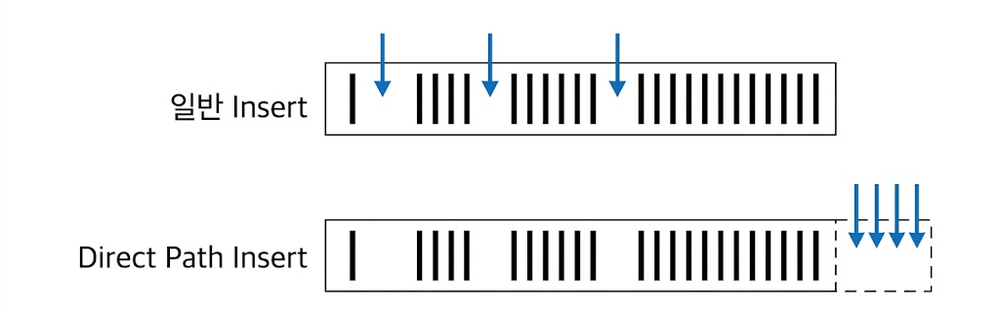

# Direct Path IO 활용
## Direct Path I/O
* 일반적인 블록 I/O는 DB 버퍼캐시 경유
    * 읽고자 하는 블록을 먼저 버퍼캐시에서 찾고, 찾지 못할 때만 디스크 읽음
    * 데이터 변경할 때도 먼저 블록을 버퍼캐시에서 찾고, 버퍼블록에 변경을 가하고 나면 DBWR 프로세스가 변경된 블록(Dirty 블록)들을 주기적으로 찾아 데이터파일에 반영
* 자주 읽는 블록에 대한 반복적인 I/O Call을 줄임으로써 시스템 성능을 높이려고 버퍼 캐시 사용
    * 대량 데이터를 읽고 쓸 때 건건이 버퍼캐시를 탐색한다면, 성능에 악영향(캐시 히트율이 낮기 때문)
    * 대량 블록을 건건이 디스크로부터 버퍼캐시에 적재하고서 읽는 부담도 큼
    * Full Scan 위주로 가끔 수행되는 대용량 처리 프로그램들은 데이터 재사용성도 낮음
* 버퍼캐시를 경유하지 않고 곧바로 데이터 블록을 읽고 쓸 수 있는 Direct Path I/O 기능 제공
    * Direct Path I/O가 작동하는 경우
        * 병렬 쿼리로 Full Scan 수행
        * 병렬 DML 수행
        * Direct Path Insert 수행
        * Temp 세그먼트 블록을 읽고 쓸 때
        * direct 옵션을 지정하고 export 수행
        * nocache 옵션을 지정한 LOB 컬럼 읽을 때

### 병렬 쿼리
* 쿼리에 parallel 또는 parallel_index 힌트를 사용하면, 지정한 병렬도만큼 병렬 프로세스가 떠서 동시에 작업 진행

```sql
SELECT /*+ full(t) parallel(t 4) */ * FROM big_table t;

SELECT /*+ index_ffs(t big_table_x1) parallel_index(t big_table_x1 4) */ count(*) 
FROM big_table t;
```

* 병렬도가 4일 경우, 성능이 4배 빨라지는 것이 아닌 수십배 빨라짐
    * Direct Path I/O 때문
    * 버퍼캐시 탐색하지 않고 디스크로부터 버퍼캐시에 적재하는 부담도 없음
* Order by, Group By, 해시 조인, 소트 머지 조인 등을 처리할 때는 힌트로 지정한 병렬도보다 2배 많은 프로세스 사용

## Direct Path Insert
* Insert가 느린 이유
    * 데이터를 입력할 블록을 Freelist에서 찾음
        * Freelist란 테이블 HWM(High-Water-Mark) 아래쪽에 있는 블록 중 데이터 입력이 가능한(여유 공간이 있는) 블록을 목록으로 관리하는 것
    * Freelist에서 할당받은 블록을 버퍼캐시에서 찾음
    * 버퍼캐시에 없으면, 데이터파일에서 읽어 버퍼캐시에 적재
    * INSERT 내용을 Undo 세그먼트에 기록
    * INSERT 내용을 Redo 로그에 기록
* Direct Path Insert 방식을 사용하면, 대량 데이터를 일반 INSERT보다 훨씬 빠르게 입력
    * Direct Path Insert 방식으로 입력하는 방법
        * INSERT ... SELECT 문에 append 힌트
        * parallel 힌트를 이용해 병렬 모드로 INSERT
        * direct 옵션을 지정하고 SQL*Loader(sqlldr)로 데이터 적재
        * CTAS(create table ... as select)문 수행
    * Direct Path Insert가 빠른 이유
        * Freelist를 참조하지 않고 HWM 바깥 영역에서 데이터를 순차적으로 입력
        * 블록을 버퍼캐시에서 탐색하지 않음
        * 버퍼캐시에 적재하지 않고, 데이터파일에 직접 기록
        * Undo 로깅을 안 함
        * Redo 로깅을 안 하게 할 수 있음
            * alter문으로 테이블을 nologging 모드로 전환 가능
            * Direct path Insert가 아닌 일반 INSERT 문은 로깅하지 않게 하는 방법이 없음
* Array Processing도 Direct Path Insert 방식으로 처리 가능

```sql
-- append_values 힌트 사용
procedure insert_target( p_source in typ_source) is
begin
    forall i in p_source.first..p_source.last
        insert /*+ append_values */ into target values p_source(i);
end insert_target;
```

* Direct Path Insert 주의점
    * 성능이 비교할 수 없이 빨라지지만, Exclusive 모드 TM Lock이 걸림
        * 커밋하기 전까지 다른 트랜잭션은 해당 테이블에 DML 수행 불가능
        * 트랜잭션이 빈번한 주간에 이 옵션 사용은 금물
    * Freelist를 조회하지 않고 HWM 바깥 영역에 입력하므로 테이블에 여유 공간이 있어도 재활용하지 않음

    {: w="30%"}

    * 과거 데이터를 주기적으로 DELETE 해서 여유 공간이 생겨도, 이 방식으로만 계속 INSERT하는 테이블은 사이즈가 줄지 않고 계속 증가
        * Range 파티션 테이블이면 과거 데이터를 DELETE가 아닌 파티션 DROP으로 지워야 공간 반환이 이뤄짐
        * 비파티션 테이블이면 주기적으로 Reorg 작업 수행

## 병렬 DML
* INSERT는 append 힌트를 이용해 Direct Path Write 방식으로 유도할 수 있지만, UPDATE/DELETE는 기본적으로 Direct Path Write 불가능
* 유일한 방법은 병렬 DML로 처리하는 것
    * 병렬 처리는 대용량 데이터가 전제이므로, 오라클은 병렬 DML을 항상 Direct Path Write로 처리

```sql
-- 1. 세션 내 Parallel DML 활성화
alter session enable parallel dml;

insert /*+ parallel(c 4) */ into 고객 c
select /*+ full(o) parallel(o 4) */ * from 외부가입고객 o;

update /*+ full(c) parallel(c 4) */ 고객 c set 고객상태코드 = 'WD'
where 최종거래일시 < '20100101';

delete /*+ full(c) parallel(c 4) */ from 고객 c
where 탈퇴일시 < '20100101';
```

* 힌트를 제대로 기술했는데, 병렬 DML를 활성하지 않은 경우
    * 대상 레코드를 찾는 작업은 병렬로 진행하지만, 추가/변경/삭제는 QC가 혼자 담당해 병목 발생
* 병렬 INSERT는 append 힌트를 지정하지 않아도 Direct Path Insert 사용하지만, 병렬 DML이 작동하지 않을 경우를 대비해 append 힌트를 사용하는 것이 좋음
    * 병렬 DML이 작동하지 않더라도, QC가 Direct Path Insert를 사용하면 어느 정도 성능이 나옴

```sql
-- 1. 기본 Parallel Direct Path Insert
insert /*+ append parallel(c 4) */ into 고객 c
select /*+ full(o) parallel(o 4) */ * from 외부가입고객 o;

-- 12c부터는 세션 설정(alter session) 없이도 enable_parallel_dml 힌트를 통해 직접 병렬 DML 활성화가 가능
insert /*+ enable_parallel_dml parallel(c 4) */ into 고객 c
select /*+ full(o) parallel(o 4) */ * from 외부가입고객 o;

update /*+ enable_parallel_dml full(c) parallel(c 4) */ 고객 c
set 고객상태코드 = 'WD'
where 최종거래일시 < '20100101';

delete /*+ enable_parallel_dml full(c) parallel(c 4) */ from 고객 c
where 탈퇴일시 < '20100101';
```

* 병렬 DML도 Direct Path Write 방식을 사용하므로 데이터를 입력/수정/삭제할 때 Exclusive 모드 TM Lock이 걸림

### 병렬 DML이 잘 작동하는지 확인하는 방법
```sql
-- UPDATE(또는 DELETE/INSERT)가 PX_COORDINATOR 아래쪽에 나타나면 UPDATE를 각 병렬 프로세스가 처리
-------------------------------------------------------------------------------------------
| Id  | Operation                | Name     | Pstart| Pstop |   TQ  |IN-OUT| PQ Distrib |
-------------------------------------------------------------------------------------------
|   0 | UPDATE STATEMENT         |          |       |       |       |      |            |
|   1 |  PX COORDINATOR          |          |       |       |       |      |            |
|   2 |   PX SEND QC (RANDOM)    | :TQ10000 |       |       | Q1,00 | P->S | QC (RAND)  |
|   3 |    UPDATE                | 고객     |       |       | Q1,00 | PCWP |            |
|   4 |     PX BLOCK ITERATOR    |          |     1 |     4 | Q1,00 | PCWC |            |
|   5 |      TABLE ACCESS FULL   | 고객     |     1 |     4 | Q1,00 | PCWP |            |
-------------------------------------------------------------------------------------------

-- UPDATE(또는 DELETE/INSERT)가 PX_COORDINATOR 위쪽에 나타나면 UPDATE를 QC가 처리
-------------------------------------------------------------------------------------------
| Id  | Operation                | Name     | Pstart| Pstop |   TQ  |IN-OUT| PQ Distrib |
-------------------------------------------------------------------------------------------
|   0 | UPDATE STATEMENT         |          |       |       |       |      |            |
|   1 |  UPDATE                  | 고객     |       |       |       |      |            |
|   2 |   PX COORDINATOR         |          |       |       |       |      |            |
|   3 |    PX SEND QC (RANDOM)   | :TQ10000 |       |       | Q1,00 | P->S | QC (RAND)  |
|   4 |     PX BLOCK ITERATOR    |          |     1 |     4 | Q1,00 | PCWC |            |
|   5 |      TABLE ACCESS FULL   | 고객     |     1 |     4 | Q1,00 | PCWP |            |
-------------------------------------------------------------------------------------------
```