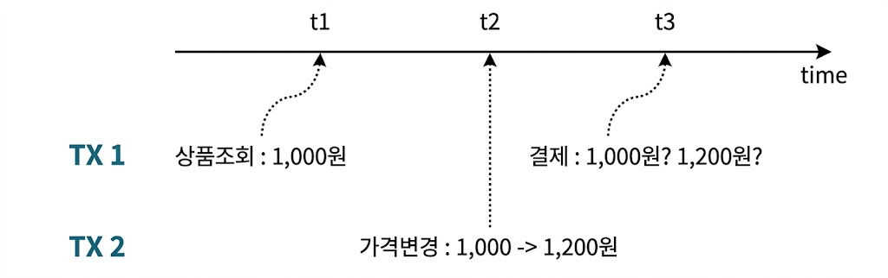
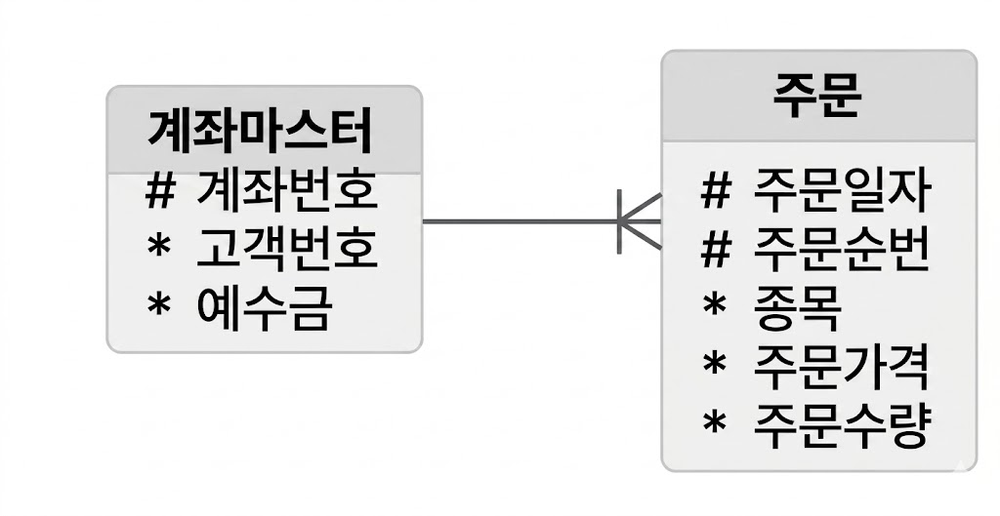
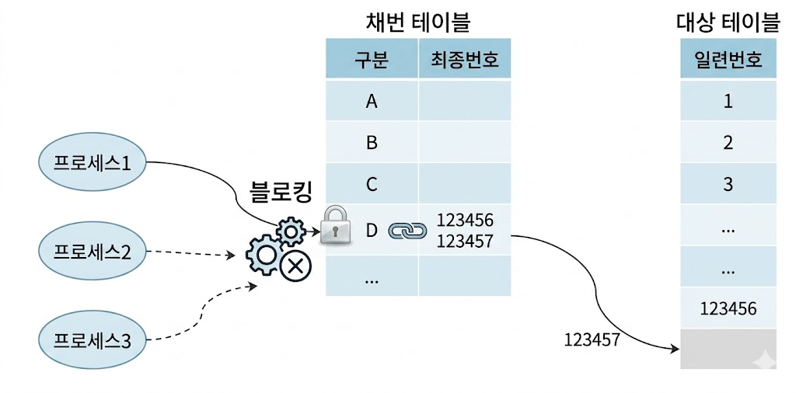
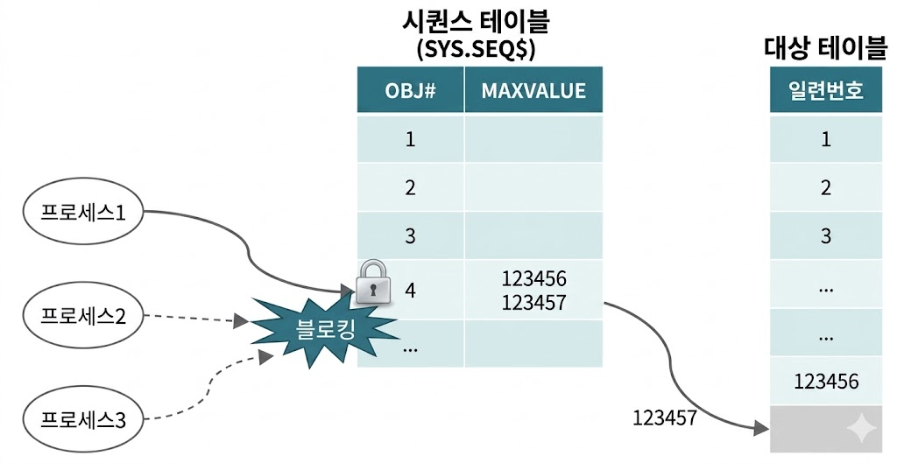
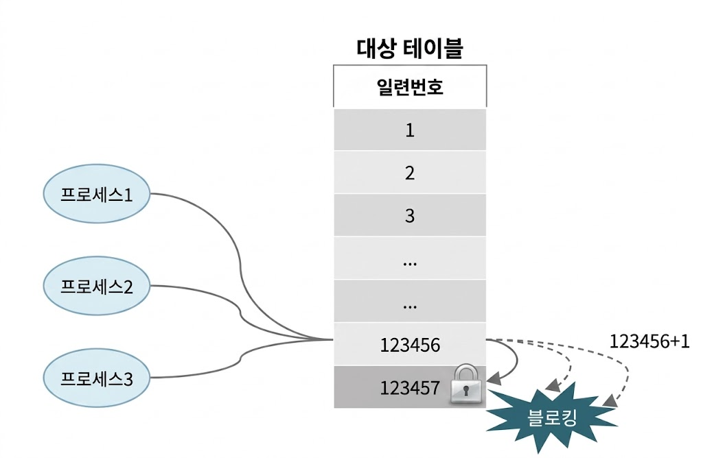
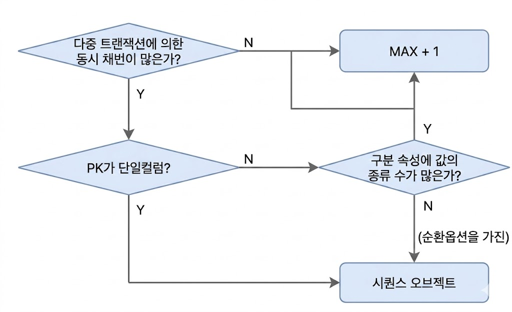
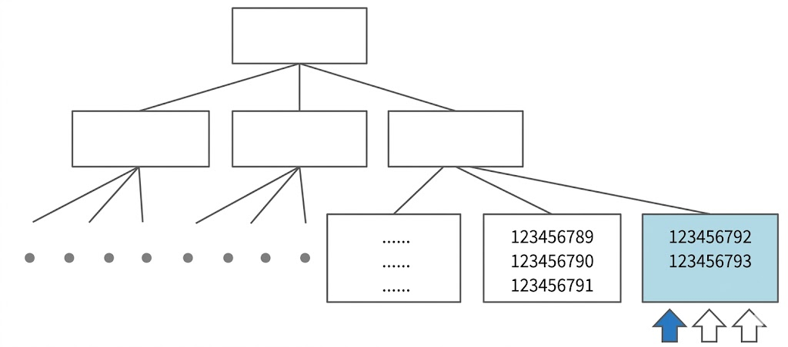
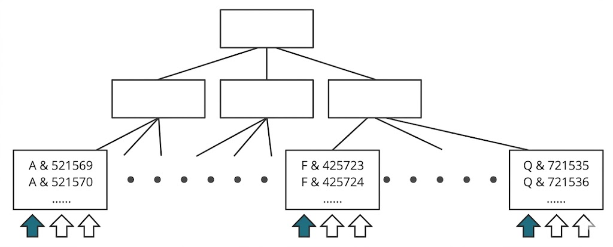

# Lock과 트랜잭션 동시성 제어
## 오라클 Lock
* 공유 리소스와 사용자 데이터 보호를 위해 DML Lock, DDL Lock, 래치, 버퍼 Lock, 라이브러리 캐시 Lock/Pin 등 다양한 Lock 사용
    * 래치는 SGA에 공유된 각종 자료구조를 보호하기 위해 사용
    * 버퍼 Lock은 버퍼 블록에 대한 엑세스를 직렬화하기 위해 사용
    * 라이브러리 캐시 Lock과 Pin은 라이브러리 캐시에 공유된 SQL 커서와 PL/SQL 프로그램을 보호하가 위해 사용
* 애플리케이션 개발에서 가장 중요하게 다뤄야 할 Lock은 DML Lock
    * 다중 트랜잭션에 동시에 엑세스하는 사용자 데이터와 무결성을 보호
    * 테이블 Lock과 로우 Lock

### DML 로우 Lock
* 두 개의 동시 트랜잭션아 같은 로우를 변경하는 것을 방지
    * 하나의 로우를 변경하려면, 로우 Lock을 먼저 설정해야
* DML 로우 Lock은 배타적 모드 사용
    * UPDATE, DELETE를 진행 중인(아직 커밋하지 않은) 로우를 다른 트랜잭션이 UPDATE, DELETE 불가능
* INSERT에 대한 로우 Lock 경합은 Unique 인덱스가 있을 때만 발생
    * Unique 인덱스가 있는 상황에서 두 트랜잭션이 같은 값을 입력하려고 할 때, 블로킹 발생
        * 블로킹 발생시, 후행 트랜잭션을 기다렸다가 선행 트랜잭션이 커밋하면 INSERT에 실패하고, 롤백하면 성공
        * 두 트랜잭션이 서로 다른 값을 입력하거나 Unique 인덱스가 아예 없으면 INSERT에 대한 로우 Lock 경합 없음
* MVCC 모델을 사용하는 오라클은 SELECT 문에 로우 Lock을 사용하지 않음
    * 오라클은 다른 트랜잭션이 변경한 로우를 읽을 때 복사본 블록을 만들어 쿼리가 *시작된 시점*으로 되돌려서 읽음
    * 변경이 진행 중인(아직 커밋하지 않음) 로우를 읽을 때도 Lock이 풀릴 때까지 기다리지 않고 복사본을 만들어서 읽음
    * MVCC를 사용하지 않는 DBMS는 SELECT문에 공유 Lock 사용
        * 공유 Lock 끼리는 호환돼, 두 트랜잭션이 같이 Lock 설정 가능
        * 공유 Lock과 배타적 Lock은 호환되지 않기 때문에, DML과 SELECT가 서로 진행 방해 가능
            * 다른 트랜잭션이 읽고 있는 로우를 변경하려면, 다음 레코드로 이동할 때까지 기다려야 함
            * 다른 트랜잭션이 변경 중인 로우를 읽으려면, 커밋할 때까지 기다려야 함
* 오라클에서 DML과 SELECT는 서로 진행을 방해하지 않음, SELECT 끼리도 마찬가지
* DML 로우 Lock에 의한 성능 저하를 방지하려면, 온라인 트랜잭션을 처리하는 주간에 Lock을 필요 이상으로 오래 유지하지 않도록 커밋 시점을 조절해야 함
    * 트랜잭션이 빨리 일을 마치도록, 즉 Lock이 오래 지속되지 않도록 관련 SQL을 모두 튜닝해야 함

### DML 테이블 Lock
* DML 로우 Lock을 설정하기 앞서 테이블 Lock을 먼저 설정
    * 현재 트랜잭션이 갱신 중인 테이블 구조를 다른 트랜잭션이 변경하지 못하게 막기 위해
* Lock 모드간 호환성(Compatibility)
    * RS: row share
    * RX: row exclusive
    * S: share
    * SRX: share row exclusive
    * X: exclusive

| | Null | RS | RX | S | SRX | X |
| :--- | :---: | :---: | :---: | :---: | :---: | :---: |
| Null | ○ | ○ | ○ | ○ | ○ | ○ |
| RS | ○ | ○ | ○ | ○ | ○ | |
| RX | ○ | ○ | ○ | | | |
| S | ○ | ○ | | ○ | | |
| SRX | ○ | ○ | | | | |
| X | ○ | | | | | |

* 선행 트랜잭션과 호환되지 않는 모드로 테이블 Lock을 설정하려면 후행 트랜잭션은 대기하거나 작업 포기해야 함
* INSERT, UPDATE, DELETE, MERGE문을 위해 로우 Lock을 설정하려면 해당 테이블에 RX 모드 테이블 Lock을 먼저 설정해야 함
* SELECT FOR UPDATE 문을 위해 로우 Lock을 설정하려면 10gR1 이하는 RS, 10gR2 이상은 RX 모드 테이블 Lock을 먼저 설정해야 함
* RS, RX 간에는 어떤 조합으로도 호환되므로 SELECT FOR UPDATE나 DML문 수행시 테이블 Lock에 의한 경합 발생 안 함
    * 같은 로우 갱신하려 할 때만 로우 Lock에 의한 경합 발생
* 테이블 Lock이 테이블 전체에 Lock을 거는 것이 아님
    * 테이블 Lock을 설정한 트랜잭션이 해당 테이블에서 수행 중인 작업을 알려주는 일종의 Flag
        * 여러 종류가 있고, 그에 따라 후행 트랜잭션이 수행할 수 있는 작업 범위가 결정
            * 진행할 수 없다면 기다릴지, 작업을 포기할지 진로를 결정해야 함
                * 기다린다면 대기자 목록에 Lock 요청을 등록하고 대기
            * DDL을 이용해 테이블 구조를 변경하려는 트랜잭션은 테이블에 TM Lock 설정돼 있는지 확인
                * TM Lock을 RX모드로 설정한 트랜잭션아 하나라도 있다면, 테이블을 갱신 중인 트랜잭션이 있다는 신호
                    * ORA-00054 반환하고 작업을 멈춤
            * DDL문이 먼저 수행 중일때는, DML문을 수행하려는 트랜잭션이 기다림

### 대상 리소스가 사용 중일때, 진로 선택
* Lock을 얻고자 하는 리소스가 사용 중일때, 프로세스는 아래 세 가지 방법 중 하나를 택함
    * Lock이 해제될 때까지 대기
    * 일정 시간만 기다리다 포기
    * 기다리지 않고 작업을 포기
* SELECT FOR UPDATE는 사용자가 위 세 가지 옵션을 모두 선택할 수 있음

```sql
select * from t for update;
select * from t for update wait 3;
select * from t for update nowait;
```

* DML을 수행할 때 묵시적으로 테이블 Lock을 설정하는데, 이때는 첫 번째 방법을 선택
    * Lock Table로 명시적으로 테이블 Lock을 설정할 때도 기본적으로 기다리는 방법 선택
        * NOWAIT 옵션으로 곧바로 작업을 포기하도록 사용 가능
* DDL을 수행할 때도 내부적으로 테이블 Lock을 설정하는데, NOWAIT 옵션이 자동으로 지정

### Lock을 푸는 열쇠, 커밋
* 블로킹(Blocking)은 선행 트랜잭션이 설정한 Lock 때문에 후행 트랜잭션이 작업을 진행하지 못하고 멈춰 있는 상태
    * 커밋 또는 롤백으로 해소
* 교착상태(Deadlock)은 두 트랜잭션이 각각 특정 리소스에 Lock을 설정한 상태에서 맞은편 트랜잭션이 Lock을 설정한 리소스에 또 Lock을 설정하려고 진행한느 사오항
    * 둘 중 하나가 물러나지 않으면 영영 해결 불가
* 데드락이 발생하면, 이를 먼저 인지한 트랜잭션이 문장 수준 롤백을 진행 후 ORA-00060
    * 교착상태를 발생시킨 문장 하나만 롤백
        * 교착상태는 해결됐지만 블로킹 상태
    * 에러를 받은 트랜잭션은 커밋 또는 롤백을 결정해야 함
        * 프로그램에서 예외처리를 하지 않는다면 대기 상태를 지속
* 오라클은 데이터를 읽을 때 Lock을 사용하지 않으므로 타 DBMS 대비 Lock 경합이 적게 발생
    * 읽는 트랜잭션의 진행을 막는 부담감이 없으므로, 필요한 만큼 트랜잭션을 충분히 길게 가져갈 수 있음
* *불필요하게* 트랜잭션이 길게 정의되지 않게 주의
    * 너무 길면, 트랜잭션을 롤백해야 할 때 너무 많은 시간이 걸림
    * Undo 세그먼트 고갈 또는 경합 유발 가능
* 같은 데이터를 갱신하는 트랜잭션이 동시 수행되지 않도록 애플리케이션을 설계해야
* DML Lock 때문에 동시성이 저하되지 않도록 적절한 시점에서 커밋
* 불필요하게 커밋을 너무 자주 수행하면 서버 프로세스가 LGWR에게 로그 버퍼를 비우도록 요청하고 sync 방식으로 기다리는 횟수가 늘기 때문에 성능이 느려짐
    * 10gR2부터 비동기식 커밋과 배치 커밋 활용 가능
        * WAIT(Default): LGWR가 로그버퍼를 파일에 기록했다는 완료 메시지를 받을 때까지 대기
            * sync
        * NOWAIT: LGWR의 완료 메시지를 기다리지 않고 바로 다음 트랜잭션을 진행
            * async
        * IMMEDIATE(Default): 커밋 명령을 받을 때마다 LGWR가 로그 버퍼를 파일에 기록
        * BATCH: 세션 내부에서 트랜잭션 데이터를 일정량 버퍼링했다가 일괄 처리

        ```sql
        COMMIT WRITE IMMEDIATE WAIT ;
        COMMIT WRITE IMMEDIATE NOWAIT ;
        COMMIT WRITE BATCH WAIT ;
        COMMIT WRITE BATCH NOWAIT ;
        ```

## 트랜잭션 동시성 제어
* 비관적 동시성 제어(Pessimistic Concurrency Control)은 사용자들이 같은 데이터를 동시에 수정할 것으로 가정
    * 한 사용자가 데이터를 읽는 시점에 Lock을 걸고 조회 또는 갱신처리가 완료될 때까지 이를 유지
    * Lock은 첫 번째 사용자가 트랜잭션을 완료하기 전까지 다른 사용자들이 같은 데이터를 수정할 수 없게 만듦
    * 비관적 동시성 제어를 잘못 사용하면 동시성이 나빠짐
* 낙관적 동시성 제어(Optimistic Concurrency Control)는 사용자들이 같은 데이터를 동시에 수정하지 않을 것으로 가정
    * 데이터를 읽을 때 Lock을 설정하지 않음
    * 낙관적 입장에 섰다고 동시 트랜잭션에 의한 잘못된 데이터 갱신을 신경 쓰지 않아도 되는 것은 아님
    * 읽는 시점에는 Lock을 사용하지 않았지만, 데이터를 수정하고자 하는 시점에 앞서 읽은 데이터가 다른 사용자에 의해 변경되었는지 반드시 검사

### 비관적 동시성 제어
* 우수 고객을 대상으로 적립포인트를 제공하는 이벤트를 실시한다고 가정
    * 다양한 실적정보를 읽고 복잡한 산출공식을 이용해 적립포인트를 계산하는 동안, 다른 트랜잭션이 같은 고객의 실적정보를 변경한다면 문제가 생길 수 있음

```sql
SELECT 적립포인트, 방문횟수, 최근방문일시, 구매실적 
  FROM 고객
 WHERE 고객번호 = :cust_num;

-- 새로운 적립포인트 계산

UPDATE 고객 
   SET 적립포인트 = :적립포인트 
 WHERE 고객번호 = :cust_num;
 ```

 * SELECT 문에 FOR UPDATE를 사용하면 고객 레코드에 Lock을 설정하므로 데이터가 잘못 갱신되는 문제를 방지 가능

 ```sql
 SELECT 적립포인트, 방문횟수, 최근방문일시, 구매실적 
  FROM 고객
 WHERE 고객번호 = :cust_num 
   FOR UPDATE;
 ```

 * 비관적 동시성 제어는 시스템 동시성을 심각하게 떨어뜨릴 수도 잇음
    * FOR UPDATE에 WAIT, NOWAIT 옵션을 함께 사용하면 Lock을 얻기 위해 무한정 기다리지 않아도 됨

```sql
for update nowait → 대기없이 Exception(ORA-00054)을 던짐
for update wait 3 → 3초 대기 후 Exception(ORA-30006)을 던짐
```

* WAIT, NOWAIT 옵션을 사용하면 다른 트랜잭션에 의해 Lock에 걸렸을 때 Exception을 만나게 됨
    * 메시지와 함께 트랜잭션 종료 가능
    * 오히려 동시성을 증가시키게 됨

### 큐(Queue) 테이블 동시성 제어
* 큐 테이블에 쌓인 고객 입금 정보를 일정한 시간 간격으로 읽어 입금 테이블에 반영하는 데몬 프로그램을 가정
    * 데몬이 여러 개이므로 Lock이 걸릴 수 있음
    * Lock이 걸리면 3초간 대기했다가 다음에 다시 시도하게 하려고 for update wait 3 옵션 지정
    * 큐에 쌓인 데이터를 한 번에 다 읽어서 처리하면 Lock이 풀릴 때까지 다른 데몬이 오래 걸릴 수 있으므로 고객 정보를 100개씩만 읽도록

```sql
SELECT cust_id, rcpt_amt 
  FROM cust_rcpt_Q
 WHERE yn_upd = 'Y' 
   AND rownum <= 100 
   FOR UPDATE WAIT 3;
```

* skip locked 옵션을 사용하면, Lock이 걸린 레코드는 생략하고 다음 레코드를 계속 읽게 할 수 있음
    * SQL에서 rownum 조건절 제거
    * 클라이언트단에서 100개를 읽으면 멈추도록 구현
    * 한 건씩 Fetch하지 말고 100개 단위로 Array 처리

```sql
SELECT cust_id, rcpt_amt 
  FROM cust_rcpt_Q
 WHERE yn_upd = 'Y' 
   FOR UPDATE SKIP LOCKED;
```

### 낙관적 동시성 제어
```sql
SELECT 적립포인트, 방문횟수, 최근방문일시, 구매실적 INTO :a, :b, :c, :d
  FROM 고객
 WHERE 고객번호 = :cust_num;

-- 새로운 적립포인트 계산

UPDATE 고객 
   SET 적립포인트 = :적립포인트
 WHERE 고객번호 = :cust_num
   AND 적립포인트 = :a
   AND 방문횟수 = :b
   AND 최근방문일시 = :c
   AND 구매실적 = :d ;

IF SQL%ROWCOUNT = 0 THEN
    ALERT('다른 사용자에 의해 변경되었습니다.');
END IF;
```

* SELECT 문에서 읽은 컬럼이 매우 많다면 UPDATE 문에서 조건절을 일일이 기술하는 것이 귀찮음
    * 만약 UPDATE 대상 테이블에 최종변경일시를 관리하는 컬럼이 있다면, 이를 조건절에 넣어 해당 레코드의 갱신여부 판단 가능

```sql
SELECT 적립포인트, 방문횟수, 최근방문일시, 구매실적, 변경일시
  INTO :a, :b, :c, :d, :mod_dt
  FROM 고객
 WHERE 고객번호 = :cust_num;

-- 새로운 적립포인트 계산

UPDATE 고객 
   SET 적립포인트 = :적립포인트, 변경일시 = SYSDATE
 WHERE 고객번호 = :cust_num
   AND 변경일시 = :mod_dt ; -- 최종 변경일시가 앞서 읽은 값과 같은지 비교

IF SQL%ROWCOUNT = 0 THEN
    ALERT('다른 사용자에 의해 변경되었습니다.');
END IF;
```

* 낙관적 동시성 제어에서도 UPDATE 전에 SELECT문을 한 번 더 수행함으로써 Lock에 대한 예외처리를 하면, 다른 트랜잭션이 설정한 Lock을 기다리지 않게 구현 가능

```sql
SELECT 고객번호
  FROM 고객
 WHERE 고객번호 = :cust_num
   AND 변경일시 = :mod_dt
   FOR UPDATE NOWAIT;
```

### 동시성 제어 없는 낙관적 프로그래밍
* 낙관적 동시성 제어를 사용하면 Lock이 유지되는 시간이 매우 짧아져 동시성을 높이는 데 유리
    * 다른 사용자가 같은 데이터를 변경했는지 검사하고 그에 따라 처리 방향성을 결정하는 절차가 필요함

{: w="35%"}

* TX1이 t1 시점에 상품을 조회할 때는 가격이 1000원이었는데, 주문을 진행하는 동안 TX2에 의해 가격이 1200원으로 수정되었다면, TX1이 최종 결제 버튼을 클릭하는 순간 올바른 처리는?
    * 상품 정보를 조회한 시점 기준으로 주문을 처리하는 것이 업무 규칙이라면 주문을 그대로 처리해도 됨
    * 아니라면, 상품 가격의 변경 여부를 체크함으로써 해당 주문을 취소시키거나 사용자에게 변경사실을 알리고 처리방향을 확인받는 프로세스 필요

```sql
insert into 주문
select :상품코드, :고객ID, :주문일시, :상점번호, ...
from   상품
where  상품코드 = :상품코드
and    가격 = :가격 ;  -- 주문을 시작한 시점 가격

if sql%rowcount = 0 then
    alert('상품가격이 변경되었습니다.');
end if;
```

* 하지만, 주문을 진행하는 동안 상품 공급업체가 가격을 변경하지 않을 것이라고 낙관적으로 생각해 처리 로직이 없는 경우가 부지기수
* 업무 규칙이라면 상관 없지만, 그렇지 않은데도 동시성 제어를 제대로 구현하지 않는다면 문제가 될 수 있음

### 데이터 품질과 동시성 향상을 위한 제언
* **성능보다 데이터 품질이 더 중요함**
* FOR UPDATE 사용을 두려워하지 말자
    * 다중 트랜잭션이 존재하는 데이터베이스 환경에서 공유 자원에 대한 엑세스 직렬화는 필수
* 데이터 변경할 목적으로 읽는다면 당연히 Lock을 걸어야 함
    * FOR UPDATE가 필요한 상황이면 이를 정확히 사용하고, 번거롭더라도 동시성이 나빠지지 않게 WAIT 또는 NOWAIT 옵션을 활용한 예외처리에 주의
* 불필요하게 Lock을 오래 유지하지 않고, 트랜재션의 원자성을 보장하는 범위 내에서 가급적 빨리 커밋
    * 트랜잭션을 재생성할 수 있는 경우(원본 데이터를 읽어 가공된 데이터를 생성하는 경우), 중간에 적당한 주기로 커밋하는 방안도 고려
    * 꼭 주간에 수행할 필요가 없는 배치는 야간에 수행
* 낙관적, 비관적 동시성 제어를 같이 사용 가능
    * 일단 낙관적 동시성 제어 시도
    * 다른 트랜잭션에 의해 데이터가 변경된 사실이 발견되면, 롤백하고 다시 시도할 때 비관적 동시성 제어 사용
* 동시성을 향상하고자 할 때 SQL 튜닝은 기본
    * 가장 효율적인 인덱스 구성 및 데이터량에 맞는 조인 메소드 선택
    * 루프를 돌면서 절차적으로 처리하면 성능이 매우 느리고, 느린 만큼 Lock도 오래 지속
    * Array Processing, One SQL 등을 활용해 처리 성능이 빨라지면 Lock도 빨리 해제
    * Lock에 대한 고민은 트랜잭션 내 모든 SQL을 완벽히 튜닝하고 나서

### 로우 Lock 대상 테이블 지정
{: w="25%"}

```sql
-- 양쪽 테이블 모두에 로우 Lock
select b.주문수량
from   계좌마스터 a, 주문 b
where  a.고객번호 = :cust_no
and    b.계좌번호 = a.계좌번호
and    b.주문일자 = :ord_dt
for update;

-- 주문수량이 있는 주문 테이블에만 로우 Lock
select b.주문수량
from   계좌마스터 a, 주문 b
where  a.고객번호 = :cust_no
and    b.계좌번호 = a.계좌번호
and    b.주문일자 = :ord_dt
for update of b.주문수량;
```

## 채번 방식에 따른 INSERT 성능 비교
* INSERT, UPDATE, DELETE, MERGE 중 가장 중요하고 튜닝 요소가 많은 것이 INSERT
    * 수행빈도가 높고 채번 방식에 따른 성능 차이가 매우 큼
* 신규 데이터 입력시 PK 중복을 방지하기 위해 채번이 선행
    * 채번 테이블
    * 시퀀스 오브젝트
    * MAX + 1 조회

### 채번 테이블
* 각 테이블 식별자의 단일컬럼 일련번호 또는 구분 속성별 순번을 채번하기 위해 별도 테이블을 관리
    * 채번 레코드를 읽어 1을 더한 값으로 변경, 그 값을 새 레코드 입력에 사용
* 채번 레코드를 변경하는 과정에서 자연스럽게 엑세스 직렬화(트랜잭션 줄 세우기)가 이뤄짐
    * 두 트랜잭션이 중복 값을 채번할 가능성을 원천적으로 방지
* 장점
    * 범용성
    * INSERT 과정에서 중복 레코드 발생에 대한 예외 처리에 크게 신경쓰지 않아도 됨
        * 채번 함수만 잘 정의하면 편리
    * INSERT 과정에서 결번 방지
    * PK가 복합컬럼일 때도 사용 가능
* 단점
    * 다른 채번 방식 대비 성능이 안 좋음
        * 채번 레코드를 변경하기 위한 로우 Lock 경합 때문
        * 로우 Lock은 자율 트랜잭션 기능을 활용하지 않으면, 대상 테이블에 INSERT를 마치고 커밋 또는 롤백할 때까지 대기

        {: w="35%"}

        * 동시 INSERT가 아주 많으면 채번 레코드뿐만 아니라 채번 테이블 블록 자체에도 경합 발생
            * 서로 다른 레코드를 변경하는 프로세스끼리도 버퍼Lock과 ITL 경합 발생
        * PK가 복합컬럼인 경우, 즉 구분 속성별 순번을 채번하는 경우 Lock 경합은 줄어듦
            * 구분 속성 레코드 수가 소수일 때만 이 방식을 사용하므로, Lock 경합이 발생할 가능성은 다른 방식 대비 높음
    * 따라서, 동시 INSERT가 아주 많은 테이블에는 사실상 사용 불가

### 자율 트랜잭션
* 자율(Autonomous) 트랜잭션 기능을 이용하면 메인 트랜잭션에 영향을 주지 않고 서브 트랜잭션에서 일부 자원만 Lock을 해제할 수 있음

```sql
create or replace function seq_nextval(l_gubun number) return number
as
    pragma autonomous_transaction; -- 자율 트랜잭션 사용
    l_new_seq seq_tab.seq%type;
begin
    update seq_tab
    set    seq = seq + 1
    where  gubun = l_gubun;

    select seq into l_new_seq
    from   seq_tab
    where  gubun = l_gubun;

    commit;
    return l_new_seq;
end;
```

* PL/SQL 함수/프로시저를 자율 트랜잭션으로 선언하면, 그 내부에서 커밋을 수행해도 메인 트랜잭션은 커밋하지 않은 상태로 남음
* 메인 트랜잭션 INSERT문에서 채번 함수를 호출하고 최종적으로 커밋하기 전까지 다른 작업을 많이 수행하더라도 채번 테이블 로우 Lock은 이미 해제한 상태이므로 다른 트랜잭션을 블로킹하지 않음

```sql
insert into target_tab values ( seq_nextval(123), :x, :y, :z );
```

### 시퀀스 오브젝트
* 장점
    * 성능이 빠르다
        * INSERT 과정에서 중복 레코드 발생에 대비한 예외처리에 크게 신경쓰지 않아도 됨
        * 테이블별로 시퀀스 오브젝트를 생성하고 관리하는 부담 존재하나, 사용하기 편리
        * 성능 이슈가 없는 것은 아님
            * 시퀀스 채번 과정에서 Lock 발생
                * 시퀀 오브젝트가 오라클 내부에서 관리하는 채번 테이블임
                    * SYS.SEQ$ 테이블이며, DBA_SEQUENCES 뷰를 통해 조회 가능

        {: w="35%"}    

        * 시퀀스 오브젝트도 테이블이므로 값을 읽고 변경하는 과정에서 Lock 메커니즘이 작동
            * 시퀀스 Lock에 의한 성능 이슈가 있지만, 캐시 사이즈를 적절히 설정하면 가장 빠른 성능 제공
            * 자율 트랜잭션 기능도 기본적으로 구현
* 단점
    * *기본적으로* PK가 단일컬럼일 때만 사용 가능
        * 복합컬럼일 때도 사용할 수는 있지만, 각 레코드의 유일성을 보장하는 최소 컬럼으로 PK를 구성해야 한다는 최소성(Minimalty) 요건 위배
    * 신규 데이터를 입력하는 과정에서 결번이 생길 수 있음
        * 원인
            * 시퀀스 채번 이후 트랜잭션 롤백
            * CACHE 옵션을 설정한 시퀀스가 캐시에서 밀려남
                * 자주 사용하지 않아(시퀀스 채번 간격이 길어) 캐시에서 밀려나거나 인스턴스를 재기동하는 순간, 캐시된 번호는 모두 사라지며 디스크에서 다시 읽을 때 그다음 번호부터 읽음
                    * 인스턴스 재기동에 의한 결번은 피할 방법이 없음
                        * NOCACHE 옵션을 지정하면 되나, 성능에 문제
                    * 사용빈도가 낮아서 생기는 결번은, 시퀀스를 Shared Pool에 KEEP 하도록 설정

                    ```sql
                    SQL> EXEC SYS.DBMS_SHARED_POOL.KEEP('SCOTT.MY_SEQ', 'Q');
                    ```
    
    * 업무적으로 결번이 생기는 현상을 막을 필요가 없는 경우 존재
        * 그리고 채번 테이블이나 MAX + 1 방식도 결번을 원천적으로 막을 수 없음
            * 데이터를 삭제하면서 생기는 결번 존재
            * 자율 트랜잭션을 사용하면, 채번 테이블에서 채번할 때도 롤백에 의해 결번이 생길 수 있음

### 시퀀스 Lock
* 로우 캐시 Lock
    * 딕셔너리 정보를 매번 디스크에서 읽고 쓰면 성능이 매우 느림
    * 오라클은 로우 캐시 사용
        * 로우 캐시는 공유 캐시(SGA)의 구성요소
            * 정보를 읽고 쓸 때 엑세스를 직렬화해야 함
                * 이때 사용하는 Lock이 *로우 캐시 Lock*
    * 로우 캐시를 사용하는 대표적인 오브젝트가 시퀀스(SYS.SEQ$)
        * 로우 캐시 Lock 경합이 나타날 수 있음
            * nextval을 호출할 때마다 로우 캐시에서 시퀀스 레코드(last_number)를 변경해야 하는데, 많은 사용자가 동시에 nextval을 호출하면 로우 캐시 Lock 경합 발생
    * 시퀀스 채번으로 인한 로우 캐시 Lock 경합을 줄이기 위해 기본적으로 CACHE 옵션 사용
        * 기본값은 20
        * 시퀀스 채번에 의한 로우 캐시 Lock 경합을 줄이고 싶다면, 값을 크게 설정
        * 채번 빈도가 낮아 굳이 캐시를 사용하고 싶지 않다면 NOCACHE 옵션 지정

    ```sql
    SQL> create sequence MYSEQ cache 1000;

    SQL> select cache_size, last_number
    2  from   user_sequences
    3  where  sequence_name = 'MYSEQ';

    CACHE_SIZE LAST_NUMBER
    ---------- -----------
        1000           1

    SQL> select MYSEQ.NEXTVAL from dual;

    NEXTVAL
    ----------
            1

    SQL> select cache_size, last_number
    2  from   user_sequences
    3  where  sequence_name = 'MYSEQ';

    CACHE_SIZE LAST_NUMBER
    ---------- -----------
        1000        1001
    ```

    * CACHE 크기를 1000으로 지정한 시퀀스를 생성하고 nextval 호출하니 last_nubmer 값이 1에서 1001로 증가
        * nextval을 호출할 때마다 시퀀스 레코드를 변경하지 않고, 값을 시퀀드 캐시에서 얻음
        * 시퀀스 캐시에서 1000개의 값을 모두 소진한 직후 nextval을 호출하면 그때 로우 캐시에서 시퀀스 레코드를 2001로 변경
* 시퀀스 캐시 lock
    * 시퀀스 캐시도 공유 캐시에 위치
    * 시퀀스 캐시에서 값을 얻을 때도 엑세스 직렬화가 필요
        * *SQ Lock*
* SV Lock
    * 시퀀스 캐시는 한 인스턴스 내에서 공유
        * nextval을 호출하는 순서대로 값을 제공해 인스턴스내에서 번호 순서 보장
    * 테이터베이스 하나에 인스턴스가 여러 개인 RAC 환경에서는 인스턴스마다 시퀀스 캐시를 가짐
        * 인스턴스 간에는 번호 순서를 보장하지 않음
        * 예시
            * 첫 번째 nextval을 1번 인스턴스 A 프로세스가 호출하고, 이어서 두 번째 nextval은 2번 인스턴스 B 프로세스가 호출
                * 1번 인스턴스 시퀀스 캐시는 1부터 1000까지 값을 순서대로 반환
                * 2번 인스턴스 시퀀스 캐시는 1001부터 2000까지 값을 순서대로 반환
            * 1, 2번 인스턴스에 있는 프로세스들이 교차로 nextval을 호출하는 경우, 테이블에 값이 입력되는 순서
                * 1 - 1001 - 2 - 1002 - 3 - 1003 - ...
        * 식별자는 유일(Unique)하고, 반드시 값이 있어야(Not Null)함
            * 값을 순서대로 입력해야 한다는 조건은 없음
            * 하지만, 업무상 식별자가 일련번호(Serial Number)이길 원하는 경우가 있음
        * 어떤 인스턴스에서 nextval을 호출하더라도 순서대로 일련번호를 제공해야 한다면, ORDER 옵션 사용
            * 시퀀스 캐시 하나를 모든 RAC 노드가 공유
    * 자원을 공유할 때는 항상 Lock 메커니즘이 필요
        * RAC 환경에서 ORDER 옵션을 사용하면 오라클은 SV Lock을 통해 시퀀스 캐시에 대한 엑세스를 직렬화
        * RAC 각 노드는 네크워크를 통해 시퀀스 캐시를 서로 주고 받으면서 공유
            * 1번 인스턴스가 nextval을 연속해서 1000번, 이어서 2번 인스턴스가 연속해서 1000번 호출하는 패턴이라면 ORDER 옵션을 사용해도 성능이 나빠지진 않음
            * 1번과 2번이 교대로 nextval을 빠르게 호출하는 트랜잭션 패턴이라면 ORDER 옵션을 사용하는 순간 성능이 급격히 나빠짐
                * 업무적으로 꼭 필요할 때만 ORDER 사용
    * RAC 환경에서 ORDER 옵션을 사용해서 성능이 나빠진 것을 해결하는 방법은 ORDER 옵션을 제거하는 것 뿐
    * 다른 채번 방식도 비슷한 부작용 존재
        * 시퀀스: 시퀀스 캐시를 인스턴스 간에 주고 받아야 함
        * 채번 테이블: 채번 레코드가 저장된 데이터 및 인덱스 블록을 인스턴스 간에 주고 받아야 함
        * MAX + 1: MAX 값을 찾는 데 필요한 인덱스 블록을 인스턴스 간에 주고 받아야 함
* RAC 환경에서 ORDER 옵션 여부에 따른 성능 차이가 심하지만, 시퀀스를 이용한 채번이 그나마 빠름
    * *동시 INSERT가 많은* 테이블에 단일속성 일련번호 식별자를 두었다면, 시퀀스를 활용

### 순환옵션을 가진 시퀀스 활용
* PK가 복합컬럼인데 동시 트랜잭션이 높아 시퀀스가 꼭 필요하다면, 순환(cycle) 옵션을 가진 시퀀스 고려
    * 하루에 도저히 도달할 수 없는 값을 최대값으로 설정
    * 최대값에 도달하면 1부터 다시 시작하도록 순환옵션 설정
        * 순환옵션을 사용하는 이유는 값이 무한정 커지지 않게 해 순번 컬럼 길이를 최소화하기 위함

### MAX + 1 조회
* 테이블의 최종 일련번호를 조회하고, 거기에 1을 더해 INSERT

```sql
insert into 상품거래(거래일련번호, 계좌번호, 거래일시, 상품코드, 거래가격, 거래수량)
values ( (select max(거래일련번호) + 1 from 상품거래)
, :acnt_no, sysdate, :prod_cd, :trd_price, :trd_qty );
```

* 장점
    * 시퀀스 또는 별도의 채번 테이블을 관리하는 부담이 없음
    * 동시 트랜잭션에 의한 충돌이 많지 않으면, 성능이 매우 빠름
    * PK가 복합컬럼인 경우, 즉 구분 속성별 순번을 채번할 때도 사용 가능
        * 채번 테이블은 구분 속성 값의 수(Number of Distinct Values)가 적을 때만 사용 가능
        * MAX + 1은 값의 수가 아무리 많아도 상관 없고, 많을수록 성능이 좋아짐
            * 입력 값 중복에 의한 로우 Lock 경합도 줄고 재실행 횟수도 줄기 때문

    {: w="35%"}   

* 단점
    * 레코드 중복에 대비한 세밀한 예외처리 필요
    * 다중 트랜잭션에 의한 동시 채번이 심하면 시퀀스보다 성능이 많이 나빠질 수 있음
        * 레코드 중복에 의한 로우 Lock 경합 때문
            * 로우 Lock은 선행 트랜잭션이 커밋 또는 롤백할 때까지 지속
            * 선행 트랜잭션이 롤백하지 않는 한, INSERT는 결국 실패하게 되므로 채번과 INSERT를 다시 실행해야 함
        * PK가 복합컬럼이고 구분 속성별 값의 수가 많으면, 구분 속성 값별로 채번이 분산됨
            * 동시 채번이 많아도 로우 Lock 경합 및 재실행 가능성은 현저히 줄어듦
        * 로우 Lock 경합 외, MAX 값 조회에 최적화된 인덱스를 구성해 주지 않았을 때 성능 이슈 있음

| 채번 방식 | 식별자 구조 | 주요 경합 | 부수적인 경합 | 비고 |
| :--- | :--- | :--- | :--- | :--- |
| 채번 테이블 | 일련번호 | (값 변경을 위한) 로우 Lock 경합 | (동시성이 높다면) 채번 테이블 블록 경합 | • 채번 테이블 관리 부담 |
| | 구분+순번 | 단일 일련번호일 때보다 Lock 경합 감소 | | |
| 시퀀스 오브젝트 | 일련번호 | 시퀀스 경합 | (시퀀스 경합 해소 시) 인덱스 블록 경합 | • 시퀀스 관리 부담<br>• INSERT 과정에 결번 가능성 |
| MAX + 1 | 일련번호 | (입력 값 중복 시) 로우 Lock+재실행 | (동시성이 매우 높다면) 인덱스 블록 경합 | • 별도 오브젝트 관리 없음<br>• 중복 값 발생에 대비한 예외처리 필수<br>• PK 인덱스 구성에 따른 성능 차이 발생 |
| | 구분+순번 | 단일 일련번호일 때보다 Lock 경합 감소 (구분 속성 값의 종류 수가 많으면, 현저히 감소) | | |

* Lock 경합 요소를 고려한 채번 방식 선택 기준
    * 다중 트랜잭션에 의한 동시 채번이 많지 않으면, 세 가지 방식 중 어느 것을 사용해도 무방
        * 채번 테이블이나 시퀀스 오브젝트 관리 부담을 고려한다면, MAX + 1이 더 권장
    * 다중 트랜잭션에 의한 동시 채번이 많고 PK가 단일컬럼 일련번호라면, 시퀀스 방식
    * 다중 트랜잭션에 의한 동시 채버니 많고 PK 구분 속성에 값 종류 개수가 많으면, 중복에 의한 로우 Lock 경합 및 재실행 가능성 낮음
        * MAX + 1방식이 구조적(PK컬럼의 Minimality 측면)으로 좋음
    * 다중 트랜잭션에 의한 동시 채번이 많고 PK 구분 속성에 값 종류 개수가 적으면, MAX + 1 방식은 성능 이슈 가능성
        * 순환(cycle) 옵션을 가진 시퀀스 오브젝트 활용 고려

{: w="35%"}        

### 12c 시퀀스 신기능
* 컬럼 기본값으로 시퀀스 지정

```sql
create sequence my_seq;

create table t (
  c1 number default my_seq.nextval not null
, c2 varchar2(5));
```

* 기본값을 지정한 C1 컬럼에 값을 직접 입력할 수 있지만, 입력하지 않을 수도 있음
    * 입력하지 않으면, 오라클이 대신 시퀀스 nextval 호출해서 값 입력

```sql
insert into t (c1, c2) values( my_seq.nextval, 'X' );
insert into t (c2) values( 'X' );
```

* 특정 컬럼을 IDENTITY 컬럼으로 지정

```sql
create table t (c1 number generated always as identity, c2 varchar2(5));

insert into t (c2) values ( 'X' );
insert into t (c1, c2) values ( default, 'X' );
```

* GENERATED ALWAYS 옵션을 지정한 컬럼에 값을 직접 입력하려고 하면 ORA-32792 발생

```sql
insert into t (c1, c2) values ( 3, 'X' );
```

* 기본적으로 시스템이 값을 입력하지만, 사용자가 값을 직접 입력할 수도 있으려면 GENERATED BY DEFAULT 옵션 지정

```sql
create table t (c1 number generated by default as identity, c2 varchar2(5));
```

* 글로벌 시퀀스(Global Sequunce)는 여러 세션이 공유할 수 있는 시스템 레벨 시퀀스

```sql
create sequence g_seq GLOBAL; --GLOBAL 키워드 생략 가능
```

* 세션 시퀀스(Session Sequence)는 여러 세션이 공유할 수 없는 세션 레벨 시퀀스

```sql
create sequence s_seq SESSION;
```

* 세션 시퀀스는 세션이 종료되면 초기화, 즉 세션 내에서만 유효
* Lock 메커니즘이 불필요하므로 글로벌 시퀀스보다 성능이 좋음
* 하지만 글로벌 시퀀스를 모두 대체할 수는 없음
    * 스테이징(Staging) 테이블에 데이터를 적재하는 경우
        * 시퀀스를 여러 세션이 호출하지 않기 때문에 굳이 글로벌 시퀀스 사용 안 해도 됨
        * 스테이징 테이블은 데이터를 새로 적재하기 전에 Truncate
            * 기존 마지막 값에 이어 채번할 필요가 없어 성능이 빠른 세션 시퀀스가 유용

### 시퀀스보다 좋은 솔루션
* 한 개 이상의 구분 소성과 함께 뒤쪽에 순번 대신 입력일시를 두는 방식으로 PK 구조를 설계하면, 채번 또는 INSERT 과정에서 생기는 Lock 이슈 거의 해소
    * 채번 과정을 생략하고 SYSDATE 또는 SYSTIMESTAMP 함수만 호출하면 되기 때문
* 구분 속성에 값의 종류 개수가 많으면 입력일시에 DATE 타입 써도 됨
    * 값의 종류 개수가 적으면 TIMESTAMP 써야 할 수도
        * OS마다 지원하는 소숫자리 다름
* 적절한 데이터 타입을 선택하면, 중복 가능성은 매우 희박하나 그래도 예외처리는 필요
* 정보생명주기(ILM)을 효과적으로 관리하는 데 있어 데이터 삭제는 매우 중요
    * 쌓이는 데이터가 많을 수록, 지울 데이터도 많아짐
        * 빠르게 삭제할 수 있는 구조로 설계해야
        * 삭제한 공간을 바로 시스템에 반납합으로써 새로 입력하는 데이터를 위해 재활용할 수 있어야
* 입력일시를 PK에 포함하려는 노력은 매우 의미 있음
    * 서비스 중단없이 파티션 단위로 커팅(파티션 Drop/Truncate)하려면 PK 인덱스가 로컬 파티션이어야 하고, PK 인덱스를 로컬 파티셔닝하려면 삭제 기준 컬럼(파티션 키)이 PK에 포함돼 있어야 함
        * 그리고 보통 삭제 기준이 입력일시

### 인덱스 블록 경합
* INSERT 성능이 너무 빠를 경우 발생
    * 채번 테이블 로우 Lock이나 시퀀스 Lock이 병목 지점이면 잘 안 나타남
    * MAX + 1 방식에서도 자주 나타남

{: w="35%"}

* 인덱스 경합은 Right Growing 인덱스에서 가장 흔함
    * 인덱스는 키순으로 정렬된 상태를 유지
        * 일련번호, 입력일시처럼 순차적으로 값이 증가하는 단일컬럼 인덱스는 항상 맨 우측 블록에만 데이터가 입력
            * 이런 특징을 갖는 인덱스가 Right Growing 인덱스
            * 입력하는 값이 달라도 같은 블록을 갱신하려는 프로세스 간 버퍼 Lock 경합 발생 가능
                * 여러 프로세스에 의한 동시 INSERT가 많을 때 트랜잭션 성능을 떨어뜨리는 주범
* 인덱스 경합은 특히 RAC 환경에서 심각한 성능 저하 유발
    * 여러 노드가 동시에 Current 블록 하나를 주고 받으며 값을 입력하기 때문
* 구분 속성을 앞에 두면 Right Growing 인덱스는 아님
    * 그래도 동시성이 매우 높으면 인덱스 블록 경합 발생 가능
    * 구분 속성의 값의 종류 개수가 적을수록 경합도 심함

{: w="35%"}

* 인덱스를 해시 파티셔닝해 인덱스 블록 경합을 해소
    * 값이 순차적으로 증가하더라도 해시 함수가 리턴한 값에 따라 서로 다른 파티션에 입력돼 경합 감소
    * 인덱스를 리버스 키 인덱스로 전환하는 방법도 고려

### 시퀀시 신기능 활용
* 시퀀스 신기능으로 일련번호에 대한 Right Growing 인덱스 성능 문제 해결
    * 글로벌 시퀀스와 세션 시퀀스를 각각 하나씩 만듦

```sql
create sequence g_seq global;
create sequence s_seq session;
```

* 글로벌 시퀀스는 데몬 프로세스 또는 커넥션 풀(에 등록된) 프로세스가 DB에 접속하는 순간, 아래를 호출

```sql
select g_seq.nextval from dual;
```

* 세션 시퀀스는 INSERT를 수행할 때마다 호출
    * 글로벌 시퀀스 currval과 세션 시퀀스 nextval을 조합한 값을 INSERT
    * 각 프로세스가 서로 다른 리프 블록에 값을 입력하므로 인덱스 경합이 발생하지 않음

```sql
insert into t( id, c1, c2 ) values
(to_char(g_seq.currval, 'fm0000') || to_char(s_seq.nextval, 'fm0000'), 'A', 'B' );
```

* 18c에 추가된 Scalable 기능
    * 시퀀스를 생성할 때 SCALE 또는 SCALE EXTEND 옵션 지정
    * Scalable 시퀀스에서 nextval을 호출하면, 인스턴스 번호, 세션ID, 시퀀스 번호를 조합한 번호 반환

    ```sql
    SQL> create sequence my_seq maxvalue 9999 SCALE EXTEND;

    SQL> select my_seq.nextval as last_value
    2       , substr(my_seq.nextval, 1, 3) as val1
    3       , substr(my_seq.nextval, 4, 3) as val2
    4       , substr(my_seq.nextval, 7)    as val3
    5       , sys_context('userenv', 'instance') as inst_id
    6       , sys_context('userenv', 'sid') as sid
    7  from dual;

    LAST_VALUE    VAL1   VAL2   VAL3   INST_ID   SID
    ------------  ----   ----   ----   -------   ---
    1011410001    101    141    0001   1         141
    ```

    * EXTEND 옵션을 생략하면, 맨 우측 시퀀스 번호(VAL3)가 1, 2, 3 순으로 증가
        * 리딩 제로(leading zero)가 없는 숫자 반환

    ```sql
    -- 18c 하위 버전에서는 아래와 같이 구현 가능
    select sys_context('userenv', 'instance') as 인스턴스번호
        , sys_context('userenv', 'sid') as 세션ID
        , my_seq.nextval as 시권스번호
    from   dual;
    ```