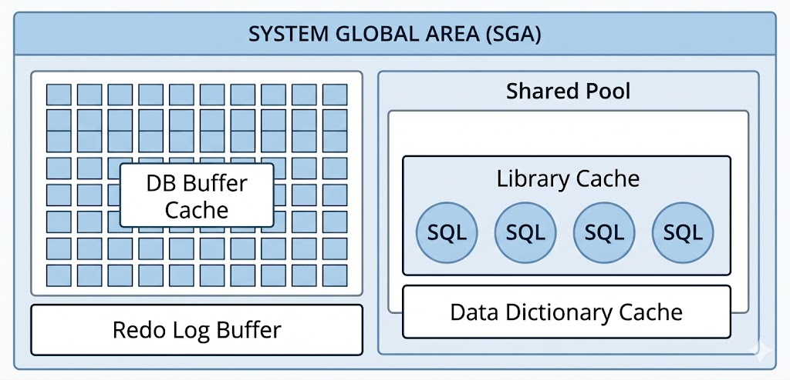
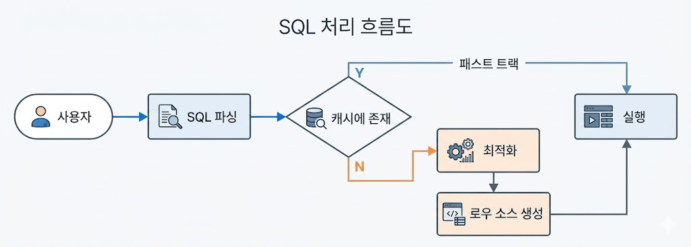

# SQL 처리 과정과 I/O (1)
## SQL 파싱과 최적화
### 구조적, 집합적, 선언적 질의 언어
* SQL(Structured Query Language)
    * 기본적으로 구조적(structured)이고 집합적(set-based)이고 선언적(declarative)인 질의 언어
    * 원하는 결과집합을 구조적, 집합적으로 선언하지만, 결과집합을 만드는 과정은 절차적
        * 프로시저가 필요한데, 프로시저를 만들어 내는 DBMS 내부 엔진이 옵티마이저
* DBMS 내부에서 프로시저를 작성하고 컴파일해 실행 가능한 상태로 만드는 전 과정을 'SQL 최적화'라고 함

### SQL 최적화
* SQL 파싱
    * SQL 파서(Parser)가 파싱 진행
        * 파싱 트리 생성: SQL 문을 이루는 개별 구성요소를 분석해 파싱 트리 생성
        * Syntax 체크: 문법적 오류 확인
            * 사용할 수 없는 키워드 사용, 순서 또는 누락된 키워드 여부 등
        * Semantic 체크: 의미상 오류가 없는지 확인
            * 존재하지 않는 테이블, 컬럼 사용 또는 사용한 오브젝트에 대한 권한 등
* SQL 최적화
    * 옵티마이저(Optimizer)는 미리 수집한 시스템 및 오브젝트 통게정보를 바탕으로 다양한 실행경로를 생성해 비교한 후 가장 효율적인 하나를 선택
* 로우 소스 생성
    * 옵티마이저가 선택한 실행경로는 실제 실행 가능한 코드 또는 프로시저 형태로 포맷팅
    * 로우 소스 생성기(Row-Source Generator)가 담당

### SQL 옵티마이저
* 사용자가 원하는 작업을 가장 효율적으로 수행할 수 있는 최적의 데이터 엑세스 경로를 선택해주는 DBMS의 핵심 엔진
* 최적화 단계
    * 쿼리 수행에 후보군이 될만한 실행계획들을 찾아냄
    * 데이터 딕셔너리(Data Dictionary)에 미리 수집해 둔 오브젝트 통계 및 시스템 통계정보를 이용해 각 실행계획의 예상비용 산정
    * 최저 비용을 나타내는 실행계획을 선택

### 실행계획과 비용
* SQL 옵티마이저가 생성한 처리절차를 실행계획(Execution Plan)으로 확인 가능

```sql
CREATE TABLE T
AS
SELECT D.NO, E.*
FROM SCOOT.EMP E
    , (SELECT ROWNUM NO FROM DUAL CONNECT BY LEVEL <= 1000) D;

CREATE INDEX T_X01 ON T(DEPTNO, NO);
CREATE INDEX T_X02 ON T(DEPTNO, JOB, NO);

-- T에 대한 통계정보 수집
EXEC DBMS_STATS.GATHER_TABLE_STATS(USER, 'T');

-- AutoTrace를 활성화하고 SQL을 실행하면 실행계획 확인 가능
-- 옵티마이저는 T_X01 인덱스를 사용할 것이다. 
SET AUTOTRACE TRACEONLY EXP;

SELECT *
FROM T
WHERE DEPTNO = 10 AND NO = 1;

-- T_X02 인덱스를 사용하는 플랜
SELECT /*+ INDEX(T T_X02) */ *
FROM T
WHERE DEPTNO = 10 AND NO = 1;

-- Full Scan을 하는 플랜
SELECT /*+ INDEX(T T_X02) */ *
FROM T
WHERE DEPTNO = 10 AND NO = 1;
```

* 옵티마이저가 Cost가 가장 낮은 T_X01 인덱스를 선택했음을 알 수 있음
    * Cost는 쿼리를 수행하는 동안 발생할 것으로 예상하는 I/O 횟수 또는 예상 소요시간
        * 실행경로를 선택하기 위해 옵티마이저가 여러 통계정보를 활용해 계산
        * 실측치가 아니므로 실제 수행할 때 발생하는 I/O 또는 시간과 차이가 많이 남

### 옵티마이저 힌트
* 힌트를 통해 더 효율적인 엑세스 경로를 지정할 수 있음

```sql
SELECT /*+ INDEX(A 고객_PK) */ *
FROM 고객 A
WHERE 고객ID = '0'
```

* 주의사항
    * 힌트 안에 인자를 나열할 땐 ','를 사용할 수 있지만, 힌트와 힌트 사이에는 사용하면 안 됨

    ```sql
    /*+ INDEX(A A_X01) INDEX(B, B_XO3) */ -- 유효한 힌트 사용
    /*+ INDEX(C), FLL(D) */ -- 첫 힌트만 유효
    ```

    * 테이블을 지정할 때, 스키마명까지 명시하면 안 됨

    ```sql
    SELECT /*+ FRULL(SCOTT.EMP) */ --무효
    FROM EMP
    ```

    * FROM 절 테이블 명에 ALIAS를 지정했다면, 힌트에도 ALIAS가 필수

    ```sql
    SELECT /*+ FRULL(EMP) */ --무효
    FROM EMP E
    ```
* 자주 사용하는 힌트 목록

| 분류 | 힌트 | 설명 |
| --- | --- | --- |
| 최적화 목표 | ALL_ROWS | 전체 처리속도 최적화 |
|  | FIRST_ROWS(n) | 최초 N건 응답속도 최적화 |
| 엑세스 방식 | FULL | Table Full Scan으로 유도 |
|  | INDEX | Index Scan으로 유도 |
|  | INDEX_DESC | Index를 역순으로 스캔하도록 유도 |
|  | INDEX_FFS | Index Fast Full Scan으로 유도 |
|  | INDEX_SS | Index Skip Scan으로 유도 |
| 조인순서 | ORDERED | FROM 절에 나열된 순서대로 조인 |
| | LEADING | LEADING 힌트 괄호에 기술한 순서대로 조인 |
| | SWAP_JOIN_INPUTS | 해시 조인 시 BUILD INPUT을 명시적으로 선택 |
| 조인방식 | USE_NL | NL 조인으로 유도 |
| | USE_MERGE | 소트 머지 조인으로 유도 |
| | USE_HASH | 해시 조인으로 유도 |
| | NL_SJ | NL 세미조인으로 유도 |
| | MERGE_SJ | 소트 머지 세미조인으로 유도 |
| | HASH_SJ | 해시 세미조인으로 유도 |
| 서브쿼리 팩토링 | MATERIALIZE | WITH 문으로 정의한 집합이 물리적으로 생성하도록 유도 |
| | INLINE | WITH 문으로 정의한 집합이 물리적으로 생성하지 않고 INLINE 처리하도록 유도 |
| 쿼리 변환 | MERGE | 뷰 머징 유도 |
| | NO_MERGE | 뷰 머징 방지 | 
| | UNNEST | 서브쿼리 Unnesting 유도 |
| | NO_UNNEST | 서브쿼리 Unnesting 방지 |
| | PUSH_PRED | 조인조건 Pushdown 유도 |
| | NO_PUSH_PRED | 조인조건 Pushdown 방지 |
| | USE_CONCAT | OR 또는 IN-List 조건을 OR-Expansion으로 유도 |
| | NO_EXPAND | OR 또는 IN-List 조건에 대한 OR-Expansion으로 방지 |
| 병렬 처리 | PARALLEL | 테이블 스캔 또는 DML을 병렬방식으로 처리하도록 유도 |
| | PARALLEL_INDEX | 인덱스 스캔을 병렬방식으로 처리하도록 유도 | 
| | PQ_DISTRIBUTE | 병렬 수행 시 데이터 분배 방식 결정 | 
| 기타 | APPEND | Direct-Path Insert로 유도 |
| | DRIVING_SITE | DB Link Remote 쿼리에 대한 최적화 및 실행 주체 지정 | 
| | PUSH_SUBQ | 서브쿼리를 가급적 빨리 필터링하도록 유도 |
| | NO_PUSH_SUBQ | 서브쿼리를 가급적 늦게 필터링하도록 유도 |

## SQL 공유 및 재사용
### 소프트 파싱 vs 하드 파싱
* Library Cache
    * SQL 파싱, 최적화, 로우 소스 생성 과정을 거쳐 생성한 내부 프로시저를 반복 재사용할 수 있도록 캐싱해 두는 메모리 공간
    * SGA(System Global Area)의 구성요소
        * 서버 프로세스와 백그라운드 프로세스가 공통으로 엑세스하는 데이터와 제어 구조를 캐싱하는 메모리 공간

{: w="25%"}

* 사용자가 SQL문을 전달하면, DBMS는 SQL을 파싱한 후 해당 SQL이 라이브러리 캐시에 존재하는지 확인
    * 캐시에서 찾으면 곧바로 실행 단계로
        * **Soft Parsing**
    * 못 찾으면 최적화 단계를 거침
        * **Hard Parsing**

{: w="30%"}

* SQL 최적화 과정은 왜 하드(Hard)한가
    * 옵티마이저가 SQL을 최적화할 때 고려할 요소가 많음
        * e.g. 테이블 조인순서, 조인 방식, 테이블 스캔 방식, 인덱스 스캔 방식, 사용할 인덱스 등
    * SQL 최적화 과정에서 사용하는 정보
        * 테이블, 컬럼, 인덱스 구조에 관한 기본 정보
        * 오브젝트 통계: 테이블 통계, 인덱스 통계, 컬럼 통계(히스토그램 포함)
        * 시스템 통계: CPU 속도, Sing Block I/O 속도, Multiblock I/O 속도 등
        * 옵티마이저 관련 파라미터
    * 하나의 쿼리를 수행하는 데 있어 후보군이 될만한 무수히 많은 실행경로를 도출하고, 짦은 순간에 딕셔너리와 통계정보를 읽어 각각에 대한 효율성을 판단함
        * CPU를 많이 소비
    * 이렇게 생성한 내부 프로시저를 한 번만 사용하고 버리는 것은 비효율적
        * 라이브러리 캐시가 필요함

### 바인드 변수의 중요성
* 이름없는 SQL 문제
    * 사용자 정의 함수/프로시저, 트리거, 패키지 등은 생성할 때 이름을 가짐
        * 컴파일한 상태로 딕셔너리에 저장
        * 삭제 전까지 영구적으로 보관
        * 실행할 때 라이브러리 캐시에 적재해 여러 사용자가 공유하면서 재사용
    * SQL은 이름이 따로 없고 전체 텍스트가 이름 역할
        * 딕셔너리 저장 X
        * 최초 실행 시 최적화 과정을 거쳐 동적으로 생성한 내부 프로시저를 라이브러리 캐시에 적재 후 여러 사용자가 공유해 사용
    * SQL은 왜 함수/프로시저처럼 영구 저장하지 않을까
        * DBMS에서 수행되는 SQL이 모두 완성된 SQL은 아니며, 수시로 변경 또는 일회성도 많음
        * 이를 모두 저장하면 많은 공간이 필요하고, SQL을 찾는 속도가 느려짐
* 공유 가능 SQL
    * 라이브러리 캐시에서 SQL을 찾기 위해 사용하는 키 값은 SQL문 그 자체
        * 아래 SQL은 각각 최적화를 진행하고 라이브러리 캐시에서 별도 공간 이용

    ```sql
    SELECT * FROM emp WHERE empno = 7900;
    select * from EMP where EMPNO = 7900;
    select * from emp where empno = 7900  ;
    ```

    * 아래 코드에서, 여러 사용자가 동시에 시스템 접속을 시도할 때
        * I/O가 거의 발생하지 않음에도 CPU 사용률이 급격히 올라가고, 라이브러리 캐시에 발생하는 여러 종류의 경합 때문에 로그인 처리가 제대로 안 됨
        * 각 사용자에 대해 동시다발적으로 발생하는 SQL 하드파싱 때문
    
    ```java
    public void login(String loginId) throws Exception {
        String SQLStmt = "SELECT * FROM CUSTOMER WHERE LOGIN_ID = '" + loginId + "'";
        Statement st = con.createStatement();
        ResultSet rs = st.executeQuery(SQLStmt);
        if(rs.next()) {
            // do something
        }
        rs.close();
        st.close();
    }
    ```
    ```sql
    -- V$SQL(라이브러리 캐시) 조회시
    SELECT * FROM CUSTOMER WHERE LOGIN_ID = 'test1';
    SELECT * FROM CUSTOMER WHERE LOGIN_ID = 'test2';
    SELECT * FROM CUSTOMER WHERE LOGIN_ID = 'test3';
    ...

    -- 위 로그인 로직은 아래 처럼 DBMS 내부 프로시저를 하나씩 만들어 라이브러리 캐시에 적재하는 것과 같다.
    create procedure LOGIN_TEST1() { ... }
    create procedure LOGIN_TEST2() { ... }
    create procedure LOGIN_TEST3() { ... }
    ...
    ```

    * 프로시저의 내부 루틴은 모두 같기 때문에, 로그인ID를 파라미터로 받는 프로시저 하나를 공유하면서 재사용하는 것이 바람직

    ```java
        public void login(String loginId) throws Exception {
        String SQLStmt = "SELECT * FROM CUSTOMER WHERE LOGIN_ID = ?";
        PreparedStatement st = con.prepareStatement(SQLStmt);
        st.setString(1, loginId);
        ResultSet rs = st.executeQuery();
        if(rs.next()) {
            // do something
        }
        rs.close();
        st.close();
    }
    ```
    ```sql
    -- V$SQL(라이브러리 캐시) 조회시
    SELECT * FROM CUSTOMER WHERE LOGIN_ID = :1;

    -- 아래와 같다
    create procedure LOGIN (login_id in varchar2) { ... }
    ```