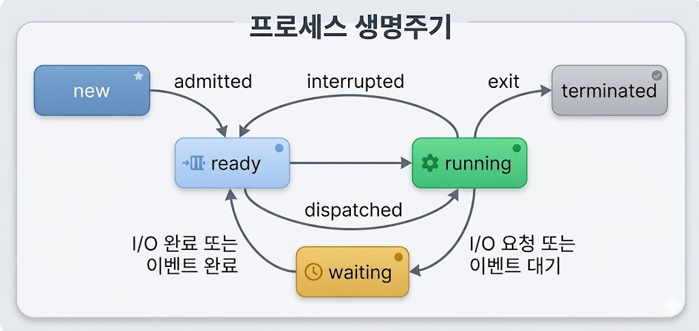
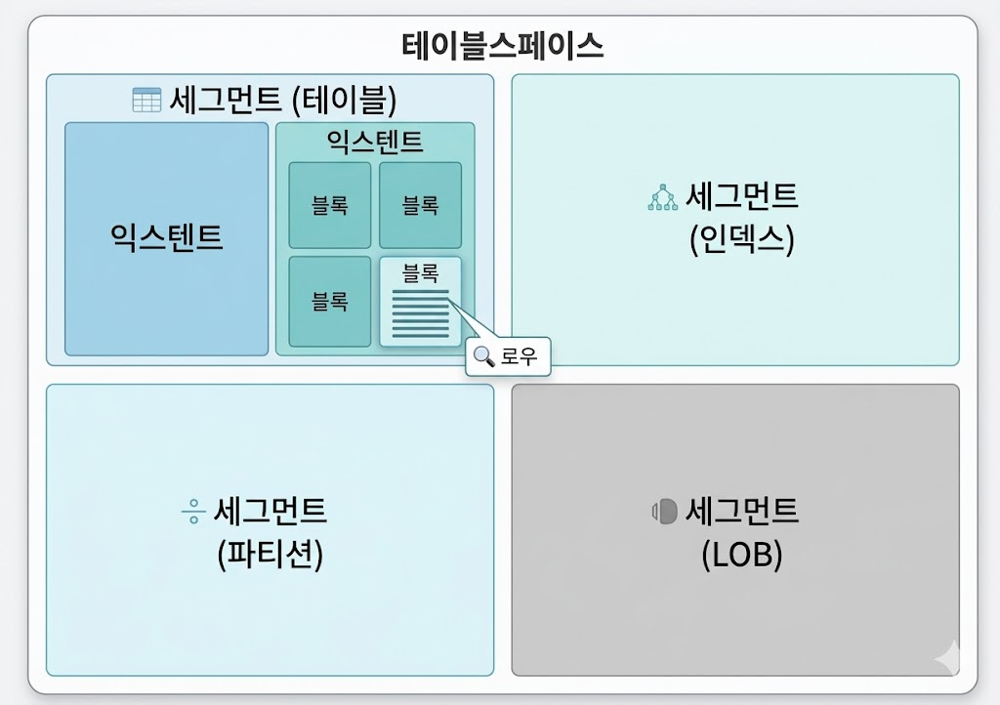
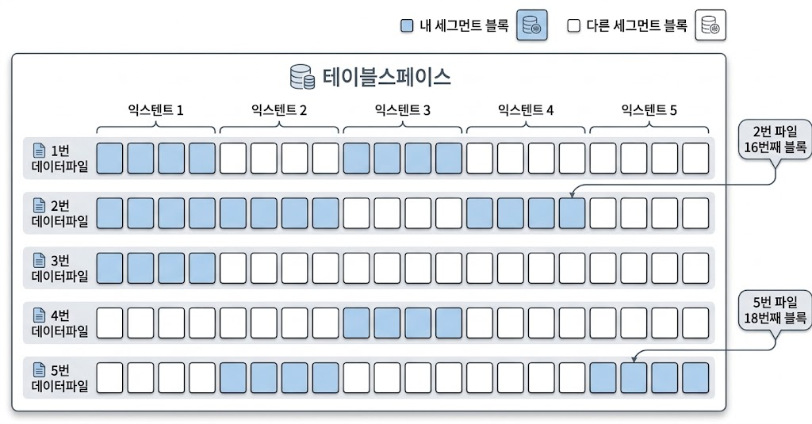
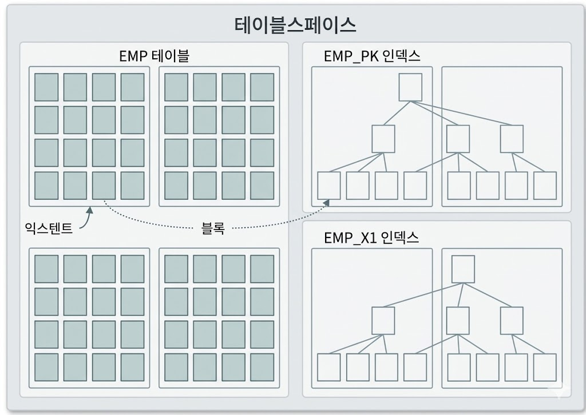
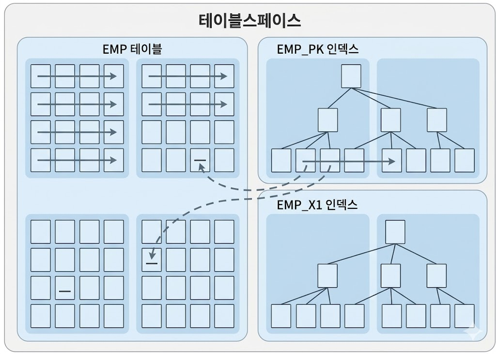
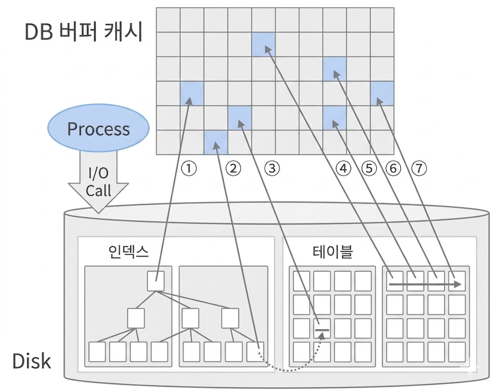

# SQL 처리 과정과 I/O (2)
## 데이터 저장 구조 및 I/O 메커니즘
### SQL이 느린 이유
* 십중팔구 디스트 I/O 때문
* Process는 '실행 중인 프로그램'
    * 생성(new) 이후 종료(terminated) 전까지 준비(ready)와 실행(running), 대기(waiting) 상태를 반복
    * 실행 중인 프로세스는 interrupt에 의해 수시로 실행 준비 상태(Runnable Queue)로 전환됐다가 다시 실행 상태로 전환

    {: w="30%"}
    *프로세스의 생명주기*

    * interrupt가 없더라도, 프로세스가 디스크에서 데이터를 읽어야 할 땐 CPU를 OS에 반환하고 waiting 상테에서 I/O가 완료되기를 기다림
        * 정해진 OS 함수를 호출(I/O Call)하고 CPU를 반환한 채 Wait Queue에서 대기
* I/O Call의 속도는 Single Block I/O 기준 평균 10ms
    * SSD는 평균 1 ~ 2ms
    * 어떤 SQL의 Single Block I/O 방식으로 10,000 블록을 읽는다면, 10초 이상 걸린다는 의미
* 여러 프로세스에 의해 여러 개의 I/O Call이 발생할 경우, 디스크 경합이 심해져 대기 시간도 늘어남
### 데이터베이스 저장 구조

{: w="40%"}
*데이터베이스 저장 구조*

* 테이블스페이스는 세그먼트를 담는 컨테이너
    * 여러 개의 데이터파일(디스크 상의 물리적 OS 파일)로 구성
* 세그먼트는 테이블, 인덱스처럼 데이터 저장공간이 필요한 오브젝트
    * 테이블, 인덱스를 생성할 때 데이터를 어떤 테이블스페이스에 저장할지 지정
* 세그먼트는 여러 익스텐트로 구성
    * 파티션 구조가 아니라면, 테이블과 인덱스도 하나의 세그먼트
        * 1개의 테이블이 1개의 물리적 세그먼트에 저장되는 구조
    * 테이블, 인덱스가 파티션 구조라면 각 파티션이 하나의 세그먼트
        * 논리적으로는 1개이나, 물리적으로 여러 세그먼트로 분할 저장되는 구조
    * LOB 컬럼은 그 자체가 하나의 세그먼트를 구성하므로 자신이 속한 테이블과 별도 공간에 값 저장
* 익스텐트는 공간을 확장하는 단위
    * 테이블이나 인덱스에 데이터를 입력하다 공간이 부족해지면 해당 오브젝트가 속한 테이블스페이스로부터 익스텐트를 추가로 할당 받음
        * 연속된 블록들의 집합이기도 함
* 익스텐트 단위로 공간을 확장하지만, 레코드가 실제 저장되는 공간은 데이터 블록
    * 한 블록은 하나의 테이블이 독점 = 블록내 레코드는 모두 같은 테이블의 레코드
    * 한 익스텐트도 하나의 테이블이 독점 = 한 익스텐트에 담긴 블록은 모두 같은 테이블 블록

{: w="40%"}

* 세그먼트 공간이 부족해지면 테이블스페이스로부터 익스텐트를 추가 할당
    * 세그먼트에 할당된 모든 익스텐트가 같은 데이터파일에 위치하지 않을 수 있음
    * 하나의 테이블스페이스를 여러 데이터파일로 구성하면, 파일 경합을 줄이기 위해 DBMS가 데이터를 가능한 여러 데이터파일로 분산해서 저장하기 때문
* 익스텐트 내 블록은 서로 인접한 연속된 공간이지만, 익스텐트끼리는 연속된 공간이 아님
* 정리
    * 블록: 데이터를 읽고 쓰는 단위
    * 익스텐트: 공간을 확장하는 단위. 연속된 블록 집합
    * 세그먼트: 데이터 저장공간이 필요한 오브젝트(테이블, 인덱스, 파티션, LOB 등)
    * 테이블스페이스: 세그먼트를 담는 컨테이너
    * 데이터파일: 디스크 상의 물리적인 OS파일
### 블록 단위 I/O
* DBMS가 데이터를 읽고 쓰는 단위는 블록
    * 특정 레코드 하나, 특정 컬럼 하나를 조회해도 블록을 통째로 읽음
    * 인덱스도 블록 단위로 데이터를 읽고 씀

{: w="35%"}

### 시퀀셜 엑세스 vs 랜덤 엑세스
* 시퀀셜(Sequential) 엑세스는 논리적 또는 물리적으로 연결된 순서에 따라 차례대로 블록을 읽는 것
    * 인덱스 리프 블록은 앞뒤를 가리키는 주소값을 통해 논리적으로 서로 연결돼 있음
    * 테이블 블록 간에는 서로 논리적인 연결고리가 없음
        * 세그먼트에 할당된 익스텐트 목록을 세그먼트 헤더에 맵으로 관리
            * 익스텐트 맵은 첫 번째 블록 주소 값을 가짐
        * 읽어야 할 익스텐트 목록을 익스텐트 맵에서 얻고, 각 익스텐트의 첫번째 블록 뒤에 연속해서 저장된 블록 순서대로 읽으면 Full Table Scan
* 랜덤(Random) 엑세스는 논리적, 물리적인 순서를 따르지 않고 레코드 하나를 읽기 위해 한 블록씩 접근(touch)하는 방식

{: w="30%"}

### 논리적 I/O vs 물리적 I/O
* SGA에는 데이터를 저장하는 **DB 버퍼캐시**가 존재
    * 라이브러리 캐시는 SQL과 실행계획, DB 저장형 함수/프로시저 등을 캐싱하는 코드 캐시
    * DB 버퍼캐시는 디스크에서 읽은 데이터 블록을 캐싱해 같은 블록에 대한 I/O Call을 줄이는 데이터 캐시
* 서버 프로세스와 데이터파일 사이에 버퍼캐시가 있으므로, 데이터 블록을 읽을 땐 항상 버퍼캐시부터 탐색
* 논리적 I/O vs 물리적 I/O
    * 논리적 블록 I/O는 SQL을 처리하는 과정에서 발생한 총 블록 I/O
        * 논리적 I/O = 메모리상 버퍼 캐시를 경유하는 메모리 I/O + Direct Path I/O
    * 물리적 블록 I/O는 디스크에서 발생한 총 블록 I/O
        * SQL 처리 도중 블록을 버퍼캐시에서 찾지 못해 디스크 엑세스를 하는 경우
* 왜 논리적 I/O인가
    * SQL을 수행하면 데이터가 담긴 블록을 읽어야 함
    * SQL이 참조하는 테이블에 데이터를 입력하거나 삭제하지 않는 상황에서 조건절에 같은 변수 값을 입력하면, 아무리 여러 번 실행해도 매번 읽는 블록 수는 같음
        * *SQL을 수행하면서 읽은 총 블록 I/O가 논리적 I/O*
        * Direct Path Read 방식으로 읽은 경우를 제외하면 모든 블록은 버퍼캐시를 경유해서 읽음
        * 따라서, 논리적 I/O 횟수는 일반적으로 버퍼캐시에서 블록을 읽은 횟수와 일치
            * 논리적 I/O가 메모리 I/O와 같은 개념은 아니지만, 수치는 같음
    * 버퍼캐시에서 블록을 찾지 못해 디스크에서 읽은 블록 I/O가 물리적 I/O
        * 데이터 입력이나 삭제가 없어도 물리적 I/O는 SQL 실행할 때마다 다름
* 버퍼캐시 히트율
    * BCHR: 읽은 전체 블록 중 물리적인 디스크 I/O를 수반하지 않고 메모리에서 찾은 비율
        * = (캐시에서 곧바로 찾은 블록 수 / 총 읽은 블록 수) x 100
        * = ( (논리적 I/O - 물리적 I/O) / 논리적 I/O) x 100
        * = (1 - (물리적 I/O) / (논리적 I/O)) x 100
    * 온라인 트랜잭션(OLTP)을 주로 처리하는 앱에서는 평균 99% 히트율을 달성해야 함
    * **물리적 I/O가 성능을 결정하지만, 실제 SQL 성능을 향상하려면 논리적 I/O를 줄여야 한다**
        * 물리적 I/O = 논리적 I/O x (100% - BHCR)
            * *논리적 I/O는 일정하므로, 물리적 I/O는 BCHR에 의해 결정*
            * BHCR은 시스템 상황에 따라 달라지므로 물리적 I/O는 시스템 상황에 의해 결정되는 통제 불가능한 외생변수
        * BCHR이 평균 70%일 때
            * SQL의 논리적 I/O가 10,000개면 물리적 I/O는 3,000개
            * SQL의 논리적 I/O가 1,000개면 물리적 I/O는 300개로 감소해 성능이 열 배 향상
    * 논리적 I/O를 줄이는 방법
        * **SQL을 튜닝해 읽는 총 블록 개수를 줄인다**
            * 논리적 I/O는 항상 일정하자미나, SQL 튜닝을 통해 줄일 수 있는 통제 가능한 내생변수
            * **논리적 I/O를 줄임으로써 물리적 I/O를 줄이는 것이 SQL 튜닝**
    * BCHR이 SQL 성능을 좌우하지만, BCHR이 높다고 효율적인 SQL은 아님
        * 같은 블록을 비효율적으로 반복해서 읽으면 BCHR이 높아지기 때문

### Single Block I/O vs Multiblock I/O 
* 비용, 기술적인 한계 때문에 모든 데이터를 캐시에 적재할 수 없음
* 캐시에서 찾지 못한 데이터 블록은 I/O Call을 통해 디스크에서 버퍼캐시로 적재하고서 읽음
* I/O Call을 할 때, *한 번에 한 블록씩 요청해서 메모리에 적재*하는 방식을 **Single Block I/O**
* I/O Call을 할 때, *한 번에 여러 블록씩 요청해서 메모리에 적재*하는 방식을 **Multi Block I/O**
* 인덱스를 이용할 때 기본적으로 인덱스와 테이블 모두 Single Block I/O 사용
    * 인덱스는 소량 데이터를 읽을 때 주로 사용하므로 이 방식이 효율적
        * 인덱스 루트 블록을 읽을 때
        * 인덱스 루트 블록에서 얻은 주소 정보로 브랜치 블록을 읽을 때
        * 인덱스 브랜치 블록에서 얻은 주소 정보로 리프 블록을 읽을 때
        * 인덱스 리프 블록에서 얻은 주소 정보로 테이블 블록을 읽을 때
* 많은 데이터 블록을 읽을 때는 Multi Block I/O가 효율적
    * 인덱스를 사용하지 않고 테이블 전체를 스캔할 때 사용
    * 테이블이 클수록 Multi Block I/O 단위도 크면 좋음
* 읽고자 하는 블록을 버퍼캐시에서 찾지 못하면 해당 블록을 디스크에서 읽기 위해 I/O Call
    * 그동안 프로세스는 Wait Queue에서 대기
    * 대용량 테이블을 Full Scan할 때, Multi Block I/O 단위를 크게 설정하면 프로세스가 Wait 하는 횟수를 줄여 성능에 이점
* Multi Block I/O는 캐시에서 찾지 못한 특정 블록을 읽으려고 I/O Call을 할 때, 디스크 상에 그 블록과 *인접한* 블록들을 한꺼번에 읽어 캐시에 미리 적재하는 기능
    * DBMS 블록 사이즈 상관 없이 OS 단에서는 일반적으로 1MB 단위로 I/O 수행

{: w="25%"}

* 인접한 블록이란, *같은 익스텐트에 속한 블록*
    * Multi Block I/O 방식으로 읽더라도 익스텐트 경계를 넘을 수 없음
* Multi Block I/O 중간에 왜 Single Block I/O가 나타나는가
    * '익스텐트 맵'은 테이블 블록에 대한 인덱스, 'Multi Block I/O'는 배치 I/O라고 생각
    * 예시
        * 가정
            * Multi Block I/O 단위는 4
            * 익스텐트 맵을 통해 확인한 첫 번째 익스텐트에서 읽어야 할 블록 목록은 1 ~ 10
            * 1, 6, 8번 블록이 버퍼캐시에 캐싱
        * 진행
            * 1번을 캐시버퍼 체인에서 찾음. 캐시에서 바로 읽음
            * 2 ~ 4번을 캐시버퍼 체인에서 찾지 못함. 디스크 I/O 보류
            * 5번을 캐시버퍼 체인에서 찾지 못함. 2 ~ 5번 블록을 읽기 위해 *Multi Block I/O *방식으로 디스크 I/O Call. 2 ~ 5번 버퍼블록을 캐시에서 읽음
            * 6번을 캐시버퍼 체인에서 찾음. 캐시에서 바로 읽음
            * 7번을 캐시버퍼 체인에서 찾지 못함. 디스크 I/O 보류
            * 8번을 캐시버퍼 체인에서 찾음. 7번 블록을 위해 *Single Block I/O* 방식으로 디스크 I/O Call. 7 ~ 8번 버퍼블록을 캐시에서 읽음
            * 9번을 캐시버퍼 체인에서 찾지 못함. 디스크 I/O 보류
            * 10번을 캐시버퍼 체인에서 찾지 못함. 익스텐트 마지막 블록이므로 9 ~ 10번 블록을 읽기 위해 *Multi Block I/O *방식으로 디스크 I/O Call. 9 ~ 10번 버퍼블록을 캐시에서 읽음
                * 9번 블록도 캐시돼 있을 경우, 9번은 캐시버퍼에서 읽고 10번은 익스텐트 마지막 블록이므로 *Single Block I/O8 방식으로 디스크 I/O Call
    * Full Scan 중에 Chain이 발생한 로우를 읽을 때도 Single Block I/O

### Table Full Scan vs Index Range Scan
* 테이블 전체를 스캔해서 읽는 방식을 Table Full Scan
    * 테이블에 속한 블록 *전체*를 읽어 사용자가 원하는 데이터 찾음
* 인덱스를 이용해서 읽는 방식을 Index Range Scan
    * 인덱스에서 *일정량*을 스캔하면서 얻은 ROWID로 테이블 레코드를 찾아감
    * ROWID = 테이블 레코드가 디스크 상에 어디 저장됐는지를 가리키는 위치 정보
* Table Full Scan이 오히려 성능이 나은 경우도 있음
    * 한 번에 많은 데이터를 처리하는 집계용 SQL이나 배치의 경우
    * Table Full Scan + 해시 조인이면 성능이 개선되는 경우가 많음
* Table Full Scan은 시퀀셜 엑세스 + Multi Block I/O 방식으로 디스크 블록을 읽음
    * 한 블록에 속한 모든 레코드를 한 번에 읽고, 캐시에서 못 찾으면 I/O Call을 통해 인접한 수십 ~ 수백 개 블록을 한꺼번에 I/O
        * 스토리지 스캔 성능이 좋아지는 만큼 성능이 좋아짐
* Index Range Scan은 랜덤 엑세스 + Single Block I/O 방식으로 디스크 블록을 읽음
    * 캐시에서 블록을 못 찾으면, 레코드 하나를 읽기 위해 I/O Call
        * 많은 데이터를 읽을 때 불리
    * 읽었던 블록을 반복해서 읽는 비효율
        * 많은 데이터를 읽을 때, 물리적인 블록 I/O 뿐만 아니라 논리적인 블록 I/O에서도 불리
        * 한 블록에 평균 500개 레코드가 있다면, 같은 블록을 최대 500번 읽음

### 캐시 탐색 메커니즘
* Direct Path I/O를 제외한 모든 블록 I/O는 메모리 버퍼캐시를 경유
    * 인덱스 루트 블록을 읽을 때
    * 인덱스 루트 블록에서 얻은 주소 정보로 브랜치 블록을 읽을 때
    * 인덱스 브랜치 블록에서 얻은 주소 정보로 리프 블록을 읽을 때
    * 인덱스 리프 블록에서 얻은 주소 정보로 테이블 블록을 읽을 때
    * 테이블 블록을 Full Scan할 때

{: w="35%"}
*버퍼 캐시의 구조*

* 예시
    * 20번 블록을 읽을 때
        * 블록이 캐싱돼 있다면 버퍼 헤더가 첫 번째 해시 체인에 연결돼 있을 것이므로 해당 체인 탐색
    * 27번 블록 읽을 때
        * 세 번째 해시 체인 탐색
        * 체인에 없으면, 디스크로부터 읽어서 세 번째 체인에 연결 후 읽음
* 버퍼캐시에서 블록을 찾을 때, 해시 알고리즘으로 버퍼 헤더를 찾고, 거기서 얻은 포인터로 버퍼 블록을 엑세스하는 방식 사용
    * 같은 입력 값은 항상 동일한 해시 체인에 연결됨
    * 다른 입력 값이 동일한 해시 체인에 연결될 수 있음
    * 해시 체인 내에서 정렬은 보장되지 않음
* 메모리 공유자원에 대한 엑세스 직렬화
    * 버퍼캐시는 SGA 구성요소이므로, 버퍼블록은 모두 공유자원
        * 여러 프로세스가 같은 버퍼블록에 접근할 경우, 블록 정합성 문제 발생
    * 자원을 공유하는 것처럼 보여도 내부에선 한 프로세스씩 순차적으로 접근하도록 구현
        * 직렬화(serialization) 메커니즘이 필요
    * 캐시버퍼 체인 래치(Latch)
        * 대량의 데이터를 읽을 때 모든 블록에 대해 해시 체인 탐색
        * DBA(Data Block Address)를 해시 함수에 입력하고 스캔해야 할 해시 체인 찾음
        * 해시 체인을 탐색하는 동안 다른 프로세스가 체인 구조를 변경하지 못하게 일종의 Lock을 설정
    * SGA를 구성하는 서브 캐시마다 별도의 래치 존재
        * 버퍼캐시에는 캐시버퍼 체인 래치, 캐시버퍼 LRU 체인 래치 등이 작동
    * 버퍼캐시 히트율이 높아지더라도, 래치에 의한 경합 때문에 캐시 I/O도 생각만큼 빠르지 않을 수 있음
    * 캐시버퍼 체인뿐만 아니라, 버퍼블록 자체에도 '버퍼 Lock'과 같은 직렬화 메커니즘이 존재
        * 읽고자 하는 블록을 찾으면 캐시버퍼 체인 래치를 곧바로 해제
        * 버퍼블록 데이터를 읽고 쓴느 도중 후행 프로세스가 같은 블록에 접근하면 데이터 정합성 문제 발생
        * 캐시버퍼 체인 래치를 해제하기 전에 버퍼 헤더에 Lock을 설정해 버퍼블록 자체에 대한 직렬화 문제 해결
            * 로우 Lock을 설정하는 행위도 블록을 변경하는 작업이므로 버퍼 Lock 필요
            * 같은 블록에서 서로 다른 로우를 동시에 읽고 쓰는 경우를 막기 위해서라도 필요
    * 직렬화 메커니즘에 의한 캐시 경합을 줄이려먼, 논리적 I/O 자체를 줄여야 함