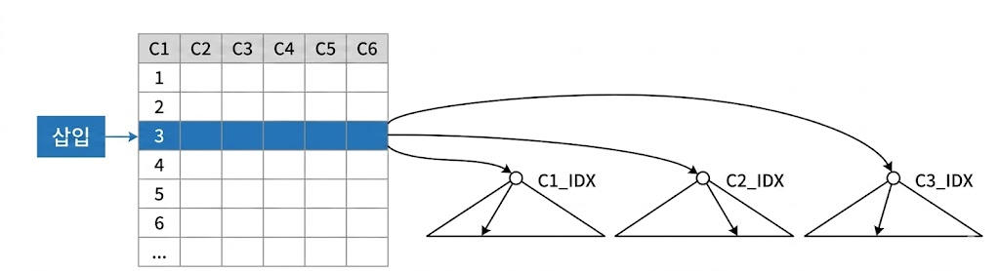
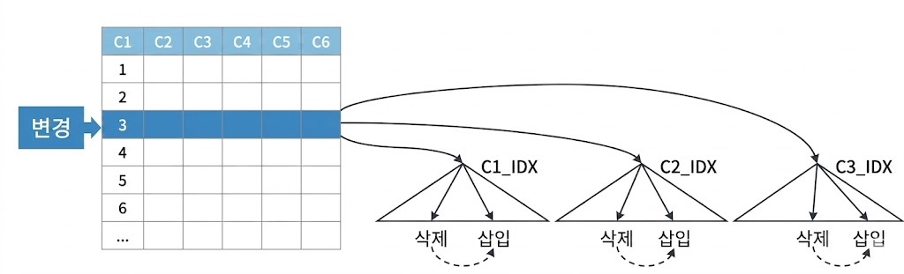
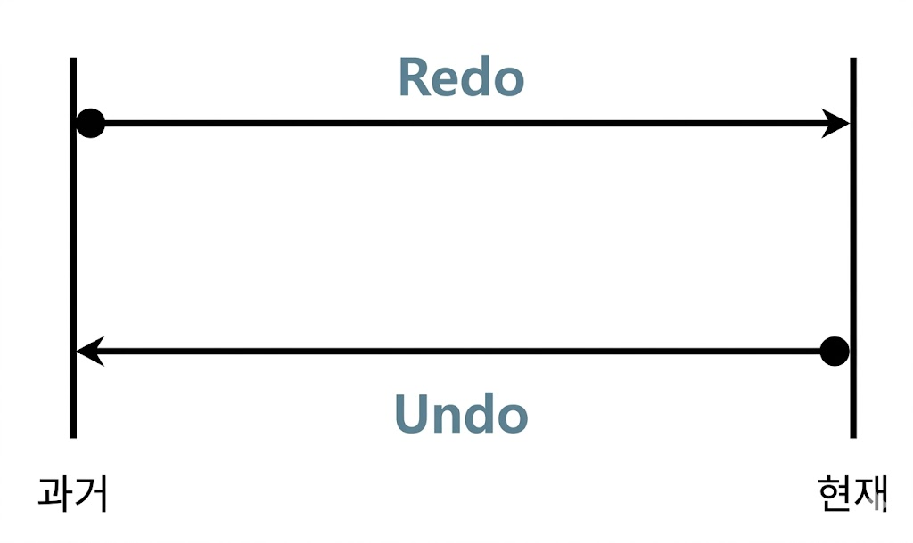
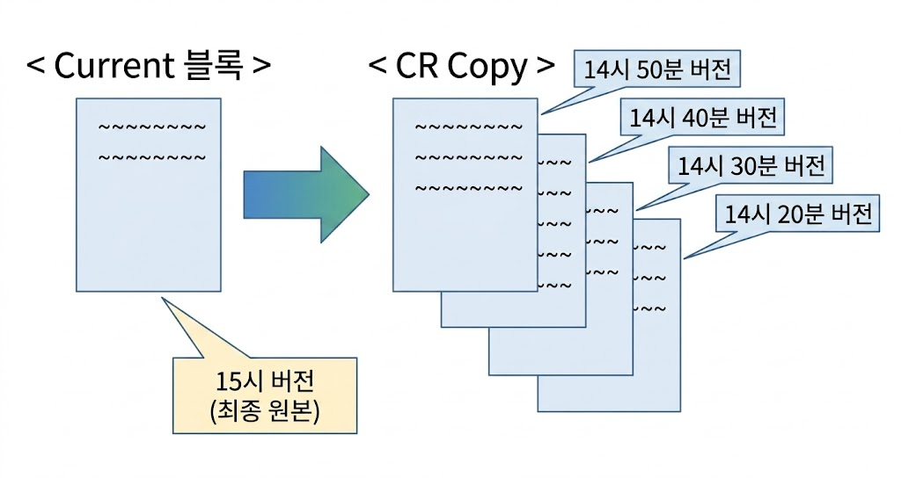
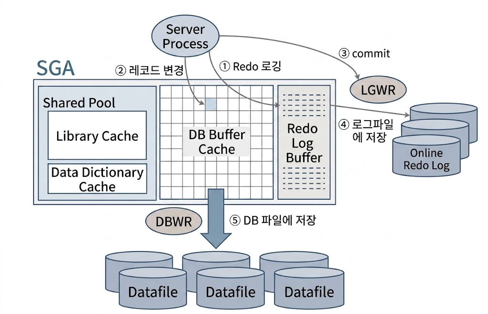

# 기본 DML 튜닝
## DML 성능에 영향을 미치는 요소
### 인덱스와 DML 성능
* 테이블에 레코드를 입력하면, 인덱스에도 입력해야 함
    * 테이블을 Freelist를 통해 입력할 블록을 할당
    * 인덱스는 정렬된 자료구조이므로, 수직적 탐색을 통해 입력할 블록을 찾아야 함
    * 인덱스에 입력하는 과정이 더 복잡하므로, DML 성능에 미치는 영향도 큼
    * DELETE로 테이블에서 레코드 하나를 삭제하면, 인덱스 레코드를 모두 찾아서 삭제해야 함

{: w="30%"}

* UPDATE는 변경된 컬럼을 참조하는 인덱스만 찾아서 변경
    * 테이블에서 한 건 변경할 때마다 인덱스에는 두 개 오퍼레이션이 발생
        * 인덱스는 정렬된 자료구조이기 때문
        * 'A'를 'K'로 변경하면 저장 위치도 달라지므로 삭제 후 삽입하는 방식으로 처리

{: w="30%"}

* 인덱스 개수가 DML 성능에 미치는 영향이 큰 만큼, 설계에 심혈을 기울여야 함
    * 핵심 트랜잭션 테이블에서 인덱스를 하나라도 줄이면 TPS는 향상됨

```sql
SQL> create table source
  2  as
  3  select b.no, a.*
  4  from   (select * from emp where rownum <= 10) a
  5        ,(select rownum as no from dual connect by level <= 100000) b;

SQL> create table target
  2  as
  3  select * from source where 1 = 2;

SQL> alter table target add
  2  constraint target_pk primary key(no, empno);

SQL> set timing on;
SQL> insert into target
  2  select * from source;

1000000 개의 행이 만들어졌습니다.

경   과: 00:00:04.95

SQL> truncate table target;

SQL> create index target_x1 on target(ename);

SQL> create index target_x2 on target(deptno, mgr);

SQL> insert into target
  2  select * from source;

1000000 개의 행이 만들어졌습니다.

경   과: 00:00:38.98
```

### 무결성 제약과 DML 성능
* 데이터 무결성 규칙
    * 개체 무결성(Entity Integrity)
    * 참조 무결성(Referential Integrity)
    * 도메인 무결성(Domain Integrity)
    * 사용자 정의 무결성(또는 업무 제약 조건)
* 이들 규칙은 애플리케이션 뿐만 아니라 DBMS에서 PK, FK, Check, Not Null 같은 Constraint로 더 완벽하게 지켜낼 수 있음
* PK, FK는 Check, Not Null 보다 성능에 더 큰 영향
    * 실제 데이터를 조회해 봐야 하기 때문

```sql
SQL> drop index target_x1;

SQL> drop index target_x2;

SQL> alter table target drop primary key;

SQL> truncate table target;

SQL> insert into target
  2  select * from source;

1000000 개의 행이 만들어졌습니다.

경   과: 00:00:01.32
```

| PK 제약/인덱스 | 일반 인덱스(2개) | 소요시간 |
| :---: | :---: | :---: |
| O | O | 38.98초 |
| O | X | 4.95초 |
| X | X | 1.32초 |

### 조건절과 DML 성능
* SELECT문과 크게 다르지 않음

```sql
SQL> set autotrace traceonly exp

SQL> update emp set sal = sal * 1.1 where deptno = 40;

---------------------------------------------------------------------------
| Id | Operation        | Name    | Rows | Bytes | Cost (%CPU)| Time     |
---------------------------------------------------------------------------
|  0 | UPDATE STATEMENT |         |    1 |     7 |     2   (0)| 00:00:01 |
|  1 |  UPDATE          | EMP     |      |       |            |          |
|  2 |   INDEX RANGE SCAN| EMP_X01 |    1 |     7 |     1   (0)| 00:00:01 |
---------------------------------------------------------------------------

SQL> delete from emp where deptno = 40;

---------------------------------------------------------------------------
| Id | Operation        | Name    | Rows | Bytes | Cost (%CPU)| Time     |
---------------------------------------------------------------------------
|  0 | DELETE STATEMENT |         |    1 |    13 |     1   (0)| 00:00:01 |
|  1 |  DELETE          | EMP     |      |       |            |          |
|  2 |   INDEX RANGE SCAN| EMP_X01 |    1 |    13 |     1   (0)| 00:00:01 |
---------------------------------------------------------------------------
```

### 서브쿼리와 DML 성능
* SELECT문과 크게 다르지 않으므로 조인 튜닝 원리 적용 가능

```sql
SQL> update emp e set sal = sal * 1.1
  2  where exists
  3    (select 'x' from dept where deptno = e.deptno and loc = 'CHICAGO');

---------------------------------------------------------------------------------
| Id | Operation                      | Name     | Rows | Bytes | Cost (%CPU)|
---------------------------------------------------------------------------------
|  0 | UPDATE STATEMENT               |          |    5 |    90 |     5 (20)|
|  1 |  UPDATE                        | EMP      |      |       |           |
|  2 |   NESTED LOOPS                 |          |    5 |    90 |     5 (20)|
|  3 |    SORT UNIQUE                 |          |    1 |    11 |     2  (0)|
|  4 |     TABLE ACCESS BY INDEX ROWID| DEPT     |    1 |    11 |     2  (0)|
|  5 |      INDEX RANGE SCAN          | DEPT_X01 |    1 |       |     1  (0)|
|  6 |    INDEX RANGE SCAN            | EMP_X01  |    5 |    35 |     1  (0)|
---------------------------------------------------------------------------------

SQL> delete from emp e
  2  where exists
  3    (select 'x' from dept where deptno = e.deptno and loc = 'CHICAGO');

---------------------------------------------------------------------------------
| Id | Operation                      | Name     | Rows | Bytes | Cost (%CPU)|
---------------------------------------------------------------------------------
|  0 | DELETE STATEMENT               |          |    5 |   120 |     4 (25)|
|  1 |  DELETE                        | EMP      |      |       |           |
|  2 |   HASH JOIN SEMI               |          |    5 |   120 |     4 (25)|
|  3 |    INDEX FULL SCAN             | EMP_X01  |   14 |   182 |     1  (0)|
|  4 |    TABLE ACCESS BY INDEX ROWID| DEPT     |    1 |    11 |     2  (0)|
|  5 |     INDEX RANGE SCAN           | DEPT_X01 |    1 |       |     1  (0)|
---------------------------------------------------------------------------------

SQL> insert into emp
  2  select e.*
  3  from   emp_t e
  4  where exists
  5         (select 'x' from dept where deptno = e.deptno and loc = 'CHICAGO');

---------------------------------------------------------------------------------
| Id | Operation                      | Name     | Rows | Bytes | Cost (%CPU)|
---------------------------------------------------------------------------------
|  0 | INSERT STATEMENT               |          |    5 |   490 |     6 (17)|
|  1 |  LOAD TABLE CONVENTIONAL       | EMP      |      |       |           |
|  2 |   HASH JOIN SEMI               |          |    5 |   490 |     6 (17)|
|  3 |    TABLE ACCESS FULL           | EMP_T    |   14 |  1218 |     3  (0)|
|  4 |    TABLE ACCESS BY INDEX ROWID| DEPT     |    1 |    11 |     2  (0)|
|  5 |     INDEX RANGE SCAN           | DEPT_X01 |    1 |       |     1  (0)|
---------------------------------------------------------------------------------
```

### Redo 로깅과 DML 성능
* 오라클은 데이터파일과 컨트롤 파일에 가해지는 모든 변경사항을 Redo 로그에 기록
    * 트랜잭션 데이터가 유실됐을 때, 트랜잭션을 재현함으로써 유실 이전 상태로 복구하는 데 이용
* DML을 수행할 때마다 Redo 로그를 생성해야 하므로 Redo 로깅은 DML 성능에 영향을 미침
* Redo 로그의 용도
    * Database Recovery(또는 Media Recovery)
        * 물리적으로 디스크가 깨지는 등 Media Fail 발생 시 데이터베이스를 복구하기 위해 사용
        * 온라인 Redo 로그를 백업해 둔 Archived Redo 로그 이용
    * Cache Recovery (Instance Recovery 시 roll forward 단계)
        * I/O 성능을 높이기 위해 사용하는 버퍼캐시는 휘발성
            * 캐시에 저장된 변경사항이 디스크 상의 데이터 블록에 아직 기록되지 않은 상태에서 인스턴스가 비정상적으로 종료되면, 작업내용이 모두 유실됨
        * 트랜잭션 데이터 유실에 대비하기 위해 Redo 로그 사용
    * Fast Commit
        * 변경된 메모리 버퍼블록을 디스크 상의 데이터 블록에 반영하는 작업은 랜덤 엑세스 방식으로 매우 느림
        * 로그는 Append 방식으로 기록하므로 상대적으로 빠름
        * 트랜잭션에 의한 변경사항을 우선 Append 방식으로 로그 파일에 빠르게 기록
            * 변경된 메모리 버퍼블록과 데이터파일 블록 간의 동기화는 DBWR, Checkpoint 등을 이용해 Batch 방식으로 일괄 수행
        * Fast Commit은 사용자의 갱신내용이 메모리상의 버퍼블록에만 기록된 채 아직 디스크에 기록되지 않앗지만 Redo 로그를 믿고 빠르게 커밋을 완료한다는 의미
        * 커밋 정보까지 Redo 로그 파일에 안전하게 기록했다면, 인스턴스 Crash가 발생해도 언제든 복구할 수 있음

### Undo로깅과 DML 성능
* Redo는 트랜잭션을 재현함으로써 과거를 현재 상태로 되돌리는 데 사용
* Undo는 트랜잭션을 롤백함으로써 현재를 과거 상태로 되돌리는 데 사용

{: w="20%"}

* Redo는 트랜잭션을 재현하는 데 필요한 정보를 로깅
* Undo는 변경된 블록을 이전 상태로 되돌리는 데 필요한 정보를 로깅
    * DML 수행할 때매다 Undo를 생성해야 하므로 Undo 로깅은 DML 성능에 영향을 미침

### Undo의 용도와 MVCC 모델
* 오라클은 데이터를 입력/수정/삭제할 때마다 Undo 세그먼트에 기록을 남김
    * Undo 데이터를 기록한 공간은 해당 트랜잭션이 커밋하는 순간, 다른 트랜잭션이 재사용할 수 있는 상태로 바뀜
    * 가장 오래 전에 커밋한 Undo 공간부터 재사용하므로, 언젠가 다른 트랜잭션 데이터로 덮여쓰임
* Undo에 기록한 데이터의 용도
    * Transaction Rollback
        * 트랜잭션에 의한 변경사항을 최종 커밋하지 않고 롤백할 때 이용
    * Transaction Recovery (Instacne Recovery시 rollback 단계)
        * Instance Crash 발생 후 Redo를 이용해 roll forward 단계가 완료되면 최종 커밋되지 않은 변경사항까지 모두 복구
        * 시스템이 셧다운된 시점에 아직 커밋되지 않았던 트랜잭션을 모두 롤백해야 하는데, 이때 Undo 데이터 이용
    * Read Consistency
        * 읽기 일관성을 위해 사용
        * 읽기 일관성을 위해 Consistent 모드로 데이터를 읽는 오라클에선 동시 트랜잭션이 많아질수록 블록 I/O가 증가하면서 성능 저하로 이어짐
* MVCC(Multi-Version Concurrency Control) 모델
    * MVCC 모델을 사용하는 오라클에서 데이터를 읽는 모드
        * Current 모드
            * 디스크에서 캐시로 적재된 원본(Current) 블록을 현재 상태 그대로 읽음
        * Consistent 모드
            * 쿼리가 시작된 이후 다른 트랜잭션에 의해 변경된 블록을 만나면 원복 블록으로부터 복사본(CR Copy) 블록 만듦
            * 복사본에 Undo 데이터를 적용해 쿼리가 *시작된 시점*으로 되돌려서 읽음

            {: w="30%"}
            *원본 블록 하나에 여러 복사본이 캐시에 존재할 수 있음*

    * SCN(System Commit Number)
        * 오라클은 시스템에서 마지막 커밋이 발생한 시점정보를 SCN이라는 Global 변수값으로 관리
            * 기본적으로 각 트랜잭션이 커밋할 때마다 1씩 증가
            * 오라클 백그라운드 프로세서의 의해서도 조금씩 증가
        * 오라클은 각 블록이 마지막으로 변경된 시점을 관리하기 위해 모든 블록 헤더에 SCN 기록
            * 블록 SCN
        * 모든 쿼리는 Global 변수인 SCN 값을 먼저 확인하고서 읽기 작업 시작
            * 쿼리 SCN
    * Consistent 모드는 쿼리 SCN과 블록 SCN을 비교함으로써 쿼리 수행 도중에 블록이 변경됐는지를 확인하면서 데이터를 읽음
        * 데이터를 읽다 블록 SCN이 쿼리 SCN보다 큰 블록을 만나면 복사본 블록 생성
        * Undo 데이터를 적용해 쿼리가 시작된 시점으로 되돌려서 읽음
    * SELECT 문은 몇몇 예외를 제외하고는 항상 Consistent 모드로 데이터를 읽음
    * DML은 Consistent 모드로 대상 레코드를 찾고, Current 모드로 추가/변경/삭제
        * Consistent 모드로 DML 문이 *시작된 시점*에 존재했던 데이터 블록 찾음
            * 읽기 일관성을 위함
        * Current 모드로 원본 블록 갱신

### Lock과 DML 성능
* Lock을 필요 이상으로 자주, 길게 사용하거나 레벨을 높일수록 DML 성능이 느려짐
* Lock을 너무 적게, 짧게 사용하거나 필요한 레벨 이하로 낮추면 데이터 품질이 나빠짐

### 커밋과 DML 성능
* 커밋은 DML과 별개로 실행하지만, DML을 끝내려면 커밋까지 완료해야 함
* DML이 Lock에 의해 Blocking된 경우, DML이 완료할 수 있게 Lock을 푸는 열쇠가 커밋이므로, 커밋은 DML 성능과 직결
* 모든 DBMS가 Fast Commit을 구현하고 있음
    * 갱신한 데이터가 아무리 많아도 커밋만큼은 빠르게 처리
* 커밋 내부 메커니즘
    * DB 버퍼캐시
        * DB에 접속한 사용자를 대신해 모든 일을 처리하는 서버 프로세스는 버퍼캐시를 통해 데이터를 읽고 씀
        * 버퍼캐시에 변경된 블록(Dirty Block)을 모아 주기적으로 데이터파일에 일괄 기록하는 작업은 DBWR(Database Writer) 프로세스가 담당
            * 건건이 처리하지 않고 모았다가 한 번에 일괄(Batch) 처리
    * Redo 로그버퍼
        * 버퍼캐시는 휘발성이므로 DBWR 프로세스가 Dirty Block을 데이터파일에 반영할 때까지 불안한 상태
        * 버퍼캐시에 가한 변경사항을 Redo 로그에도 기록
            * 버퍼캐시 데이터가 유실되더라도 Redo 로그를 이용해 복구 가능
        * Redo 로그도 파일
            * Append 방식으로 기록하더라도 디스크 I/O는 느림
            * Redo 로깅 성능 문제를 해결하기 위해 로그버퍼 이용
                * Redo 로그 파일에 기록하기 전에 먼저 로그버퍼에 기록
                * 기록한 내용은 나중에 LGWR(Log Writer) 프로세스가 Redo 로그 파일에 일괄(Batch) 기록
    * 트랜잭션 데이터 저장 과정
        * DML문을 실행하면 Redo 로그버퍼에 변경사항 기록
        * 버퍼블록에서 데이터를 변경(레코드 추가/수정/삭제)
            * 버퍼캐시에서 블록을 찾지 못하면, 데이터파일에서 읽는 작업부터
        * 커밋
        * LGWR 프로세스가 Redo 로그버퍼 내용을 로그파일에 일괄 저장
        * DBWR 프로세스가 변경된 버퍼블록들은 데이터파일에 일괄 저장

        {: w="30%"}

        * 오라클은 데이터를 변경하기 전에 항상 로그부터 기록
            * Write Ahead Logging
        * 메모리 버퍼캐시가 휘발성이어서 Redo 로그를 남기는데, Redo 로그마저 휘발성 로그버퍼에 기록한다면 트랜잭션 데이터를 안전하게 지킬 수 있을까
            * DBWR/LGWR 프로세스는 *주기적으로* 깨어나 각각 Dirty Block과 Redo 로그버퍼를 파일에 기록
            * LGWR 프로세스는 서버 프로세스가 커밋을 발행했다고 *신호를 보낼때도* 깨어나서 활동을 시작
                * *적어도 커밋시점에는* Redo 로그버퍼 내용을 로그파일에 기록
                * Log Force at Commit
        * 서버 프로세스가 변경한 버퍼블록들을 디스크에 기록하지 않았더라도 커밋 시점에 Redo 로그를 디스크에 안전하게 기록했다면 트랜잭션의 영속성 보장
    * 커밋 = 저장버튼
        * 커밋은 서버 프로세스가 그때까지 했던 작업을 *디스크에 기록하라는 명령어*
            * 저장을 완료할 때까지 서버 프로세스는 다음 작업 진행 불가
            * Redo 로그버퍼에 기록된 내용을 디스크에 기록하도록 LGWR 프로세스에 신호를 보낸 후 작업을 완료했다는 신호를 받아야 다음 작업 진행 가능(Sync)
        * LGWR 프로세스가 *Redo로그를 기록하는 작업은 디스크 I/O작업*으로, 커밋은 생각보다 느림
        * 트랜잭션을 필요 이상으로 길게 정의해 오랫동안 커밋하지 않는 것은 좋지 않음
            * 오랫동안 커밋하지 않은 채 데이터를 계속 갱신한다면 Undo 공간이 부족해져 시스템 장애 상황 유발
        * 반대로 너무 자주 커밋하는 것도 좋지 않음
            * 루프를 돌면서 건건이 커밋한다면 프로그램 자체 성능이 매우 느려짐

## 데이터베이스 Call과 성능