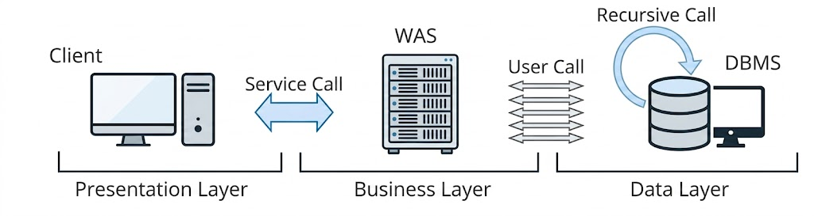

# 기본 DML 튜닝
## DML 성능에 영향을 미치는 요소
### 인덱스와 DML 성능
* 테이블에 레코드를 입력하면, 인덱스에도 입력해야 함
    * 테이블을 Freelist를 통해 입력할 블록을 할당
    * 인덱스는 정렬된 자료구조이므로, 수직적 탐색을 통해 입력할 블록을 찾아야 함
    * 인덱스에 입력하는 과정이 더 복잡하므로, DML 성능에 미치는 영향도 큼
    * DELETE로 테이블에서 레코드 하나를 삭제하면, 인덱스 레코드를 모두 찾아서 삭제해야 함

{: w="30%"}

* UPDATE는 변경된 컬럼을 참조하는 인덱스만 찾아서 변경
    * 테이블에서 한 건 변경할 때마다 인덱스에는 두 개 오퍼레이션이 발생
        * 인덱스는 정렬된 자료구조이기 때문
        * 'A'를 'K'로 변경하면 저장 위치도 달라지므로 삭제 후 삽입하는 방식으로 처리

{: w="30%"}

* 인덱스 개수가 DML 성능에 미치는 영향이 큰 만큼, 설계에 심혈을 기울여야 함
    * 핵심 트랜잭션 테이블에서 인덱스를 하나라도 줄이면 TPS는 향상됨

```sql
SQL> create table source
  2  as
  3  select b.no, a.*
  4  from   (select * from emp where rownum <= 10) a
  5        ,(select rownum as no from dual connect by level <= 100000) b;

SQL> create table target
  2  as
  3  select * from source where 1 = 2;

SQL> alter table target add
  2  constraint target_pk primary key(no, empno);

SQL> set timing on;
SQL> insert into target
  2  select * from source;

1000000 개의 행이 만들어졌습니다.

경   과: 00:00:04.95

SQL> truncate table target;

SQL> create index target_x1 on target(ename);

SQL> create index target_x2 on target(deptno, mgr);

SQL> insert into target
  2  select * from source;

1000000 개의 행이 만들어졌습니다.

경   과: 00:00:38.98
```

### 무결성 제약과 DML 성능
* 데이터 무결성 규칙
    * 개체 무결성(Entity Integrity)
    * 참조 무결성(Referential Integrity)
    * 도메인 무결성(Domain Integrity)
    * 사용자 정의 무결성(또는 업무 제약 조건)
* 이들 규칙은 애플리케이션 뿐만 아니라 DBMS에서 PK, FK, Check, Not Null 같은 Constraint로 더 완벽하게 지켜낼 수 있음
* PK, FK는 Check, Not Null 보다 성능에 더 큰 영향
    * 실제 데이터를 조회해 봐야 하기 때문

```sql
SQL> drop index target_x1;

SQL> drop index target_x2;

SQL> alter table target drop primary key;

SQL> truncate table target;

SQL> insert into target
  2  select * from source;

1000000 개의 행이 만들어졌습니다.

경   과: 00:00:01.32
```

| PK 제약/인덱스 | 일반 인덱스(2개) | 소요시간 |
| :---: | :---: | :---: |
| O | O | 38.98초 |
| O | X | 4.95초 |
| X | X | 1.32초 |

### 조건절과 DML 성능
* SELECT문과 크게 다르지 않음

```sql
SQL> set autotrace traceonly exp

SQL> update emp set sal = sal * 1.1 where deptno = 40;

---------------------------------------------------------------------------
| Id | Operation        | Name    | Rows | Bytes | Cost (%CPU)| Time     |
---------------------------------------------------------------------------
|  0 | UPDATE STATEMENT |         |    1 |     7 |     2   (0)| 00:00:01 |
|  1 |  UPDATE          | EMP     |      |       |            |          |
|  2 |   INDEX RANGE SCAN| EMP_X01 |    1 |     7 |     1   (0)| 00:00:01 |
---------------------------------------------------------------------------

SQL> delete from emp where deptno = 40;

---------------------------------------------------------------------------
| Id | Operation        | Name    | Rows | Bytes | Cost (%CPU)| Time     |
---------------------------------------------------------------------------
|  0 | DELETE STATEMENT |         |    1 |    13 |     1   (0)| 00:00:01 |
|  1 |  DELETE          | EMP     |      |       |            |          |
|  2 |   INDEX RANGE SCAN| EMP_X01 |    1 |    13 |     1   (0)| 00:00:01 |
---------------------------------------------------------------------------
```

### 서브쿼리와 DML 성능
* SELECT문과 크게 다르지 않으므로 조인 튜닝 원리 적용 가능

```sql
SQL> update emp e set sal = sal * 1.1
  2  where exists
  3    (select 'x' from dept where deptno = e.deptno and loc = 'CHICAGO');

---------------------------------------------------------------------------------
| Id | Operation                      | Name     | Rows | Bytes | Cost (%CPU)|
---------------------------------------------------------------------------------
|  0 | UPDATE STATEMENT               |          |    5 |    90 |     5 (20)|
|  1 |  UPDATE                        | EMP      |      |       |           |
|  2 |   NESTED LOOPS                 |          |    5 |    90 |     5 (20)|
|  3 |    SORT UNIQUE                 |          |    1 |    11 |     2  (0)|
|  4 |     TABLE ACCESS BY INDEX ROWID| DEPT     |    1 |    11 |     2  (0)|
|  5 |      INDEX RANGE SCAN          | DEPT_X01 |    1 |       |     1  (0)|
|  6 |    INDEX RANGE SCAN            | EMP_X01  |    5 |    35 |     1  (0)|
---------------------------------------------------------------------------------

SQL> delete from emp e
  2  where exists
  3    (select 'x' from dept where deptno = e.deptno and loc = 'CHICAGO');

---------------------------------------------------------------------------------
| Id | Operation                      | Name     | Rows | Bytes | Cost (%CPU)|
---------------------------------------------------------------------------------
|  0 | DELETE STATEMENT               |          |    5 |   120 |     4 (25)|
|  1 |  DELETE                        | EMP      |      |       |           |
|  2 |   HASH JOIN SEMI               |          |    5 |   120 |     4 (25)|
|  3 |    INDEX FULL SCAN             | EMP_X01  |   14 |   182 |     1  (0)|
|  4 |    TABLE ACCESS BY INDEX ROWID| DEPT     |    1 |    11 |     2  (0)|
|  5 |     INDEX RANGE SCAN           | DEPT_X01 |    1 |       |     1  (0)|
---------------------------------------------------------------------------------

SQL> insert into emp
  2  select e.*
  3  from   emp_t e
  4  where exists
  5         (select 'x' from dept where deptno = e.deptno and loc = 'CHICAGO');

---------------------------------------------------------------------------------
| Id | Operation                      | Name     | Rows | Bytes | Cost (%CPU)|
---------------------------------------------------------------------------------
|  0 | INSERT STATEMENT               |          |    5 |   490 |     6 (17)|
|  1 |  LOAD TABLE CONVENTIONAL       | EMP      |      |       |           |
|  2 |   HASH JOIN SEMI               |          |    5 |   490 |     6 (17)|
|  3 |    TABLE ACCESS FULL           | EMP_T    |   14 |  1218 |     3  (0)|
|  4 |    TABLE ACCESS BY INDEX ROWID| DEPT     |    1 |    11 |     2  (0)|
|  5 |     INDEX RANGE SCAN           | DEPT_X01 |    1 |       |     1  (0)|
---------------------------------------------------------------------------------
```

### Redo 로깅과 DML 성능
* 오라클은 데이터파일과 컨트롤 파일에 가해지는 모든 변경사항을 Redo 로그에 기록
    * 트랜잭션 데이터가 유실됐을 때, 트랜잭션을 재현함으로써 유실 이전 상태로 복구하는 데 이용
* DML을 수행할 때마다 Redo 로그를 생성해야 하므로 Redo 로깅은 DML 성능에 영향을 미침
* Redo 로그의 용도
    * Database Recovery(또는 Media Recovery)
        * 물리적으로 디스크가 깨지는 등 Media Fail 발생 시 데이터베이스를 복구하기 위해 사용
        * 온라인 Redo 로그를 백업해 둔 Archived Redo 로그 이용
    * Cache Recovery (Instance Recovery 시 roll forward 단계)
        * I/O 성능을 높이기 위해 사용하는 버퍼캐시는 휘발성
            * 캐시에 저장된 변경사항이 디스크 상의 데이터 블록에 아직 기록되지 않은 상태에서 인스턴스가 비정상적으로 종료되면, 작업내용이 모두 유실됨
        * 트랜잭션 데이터 유실에 대비하기 위해 Redo 로그 사용
    * Fast Commit
        * 변경된 메모리 버퍼블록을 디스크 상의 데이터 블록에 반영하는 작업은 랜덤 엑세스 방식으로 매우 느림
        * 로그는 Append 방식으로 기록하므로 상대적으로 빠름
        * 트랜잭션에 의한 변경사항을 우선 Append 방식으로 로그 파일에 빠르게 기록
            * 변경된 메모리 버퍼블록과 데이터파일 블록 간의 동기화는 DBWR, Checkpoint 등을 이용해 Batch 방식으로 일괄 수행
        * Fast Commit은 사용자의 갱신내용이 메모리상의 버퍼블록에만 기록된 채 아직 디스크에 기록되지 않앗지만 Redo 로그를 믿고 빠르게 커밋을 완료한다는 의미
        * 커밋 정보까지 Redo 로그 파일에 안전하게 기록했다면, 인스턴스 Crash가 발생해도 언제든 복구할 수 있음

### Undo로깅과 DML 성능
* Redo는 트랜잭션을 재현함으로써 과거를 현재 상태로 되돌리는 데 사용
* Undo는 트랜잭션을 롤백함으로써 현재를 과거 상태로 되돌리는 데 사용

{: w="20%"}

* Redo는 트랜잭션을 재현하는 데 필요한 정보를 로깅
* Undo는 변경된 블록을 이전 상태로 되돌리는 데 필요한 정보를 로깅
    * DML 수행할 때매다 Undo를 생성해야 하므로 Undo 로깅은 DML 성능에 영향을 미침

### Undo의 용도와 MVCC 모델
* 오라클은 데이터를 입력/수정/삭제할 때마다 Undo 세그먼트에 기록을 남김
    * Undo 데이터를 기록한 공간은 해당 트랜잭션이 커밋하는 순간, 다른 트랜잭션이 재사용할 수 있는 상태로 바뀜
    * 가장 오래 전에 커밋한 Undo 공간부터 재사용하므로, 언젠가 다른 트랜잭션 데이터로 덮여쓰임
* Undo에 기록한 데이터의 용도
    * Transaction Rollback
        * 트랜잭션에 의한 변경사항을 최종 커밋하지 않고 롤백할 때 이용
    * Transaction Recovery (Instacne Recovery시 rollback 단계)
        * Instance Crash 발생 후 Redo를 이용해 roll forward 단계가 완료되면 최종 커밋되지 않은 변경사항까지 모두 복구
        * 시스템이 셧다운된 시점에 아직 커밋되지 않았던 트랜잭션을 모두 롤백해야 하는데, 이때 Undo 데이터 이용
    * Read Consistency
        * 읽기 일관성을 위해 사용
        * 읽기 일관성을 위해 Consistent 모드로 데이터를 읽는 오라클에선 동시 트랜잭션이 많아질수록 블록 I/O가 증가하면서 성능 저하로 이어짐
* MVCC(Multi-Version Concurrency Control) 모델
    * MVCC 모델을 사용하는 오라클에서 데이터를 읽는 모드
        * Current 모드
            * 디스크에서 캐시로 적재된 원본(Current) 블록을 현재 상태 그대로 읽음
        * Consistent 모드
            * 쿼리가 시작된 이후 다른 트랜잭션에 의해 변경된 블록을 만나면 원복 블록으로부터 복사본(CR Copy) 블록 만듦
            * 복사본에 Undo 데이터를 적용해 쿼리가 *시작된 시점*으로 되돌려서 읽음

            {: w="30%"}
            *원본 블록 하나에 여러 복사본이 캐시에 존재할 수 있음*

    * SCN(System Commit Number)
        * 오라클은 시스템에서 마지막 커밋이 발생한 시점정보를 SCN이라는 Global 변수값으로 관리
            * 기본적으로 각 트랜잭션이 커밋할 때마다 1씩 증가
            * 오라클 백그라운드 프로세서의 의해서도 조금씩 증가
        * 오라클은 각 블록이 마지막으로 변경된 시점을 관리하기 위해 모든 블록 헤더에 SCN 기록
            * 블록 SCN
        * 모든 쿼리는 Global 변수인 SCN 값을 먼저 확인하고서 읽기 작업 시작
            * 쿼리 SCN
    * Consistent 모드는 쿼리 SCN과 블록 SCN을 비교함으로써 쿼리 수행 도중에 블록이 변경됐는지를 확인하면서 데이터를 읽음
        * 데이터를 읽다 블록 SCN이 쿼리 SCN보다 큰 블록을 만나면 복사본 블록 생성
        * Undo 데이터를 적용해 쿼리가 시작된 시점으로 되돌려서 읽음
    * SELECT 문은 몇몇 예외를 제외하고는 항상 Consistent 모드로 데이터를 읽음
    * DML은 Consistent 모드로 대상 레코드를 찾고, Current 모드로 추가/변경/삭제
        * Consistent 모드로 DML 문이 *시작된 시점*에 존재했던 데이터 블록 찾음
            * 읽기 일관성을 위함
        * Current 모드로 원본 블록 갱신

### Lock과 DML 성능
* Lock을 필요 이상으로 자주, 길게 사용하거나 레벨을 높일수록 DML 성능이 느려짐
* Lock을 너무 적게, 짧게 사용하거나 필요한 레벨 이하로 낮추면 데이터 품질이 나빠짐

### 커밋과 DML 성능
* 커밋은 DML과 별개로 실행하지만, DML을 끝내려면 커밋까지 완료해야 함
* DML이 Lock에 의해 Blocking된 경우, DML이 완료할 수 있게 Lock을 푸는 열쇠가 커밋이므로, 커밋은 DML 성능과 직결
* 모든 DBMS가 Fast Commit을 구현하고 있음
    * 갱신한 데이터가 아무리 많아도 커밋만큼은 빠르게 처리
* 커밋 내부 메커니즘
    * DB 버퍼캐시
        * DB에 접속한 사용자를 대신해 모든 일을 처리하는 서버 프로세스는 버퍼캐시를 통해 데이터를 읽고 씀
        * 버퍼캐시에 변경된 블록(Dirty Block)을 모아 주기적으로 데이터파일에 일괄 기록하는 작업은 DBWR(Database Writer) 프로세스가 담당
            * 건건이 처리하지 않고 모았다가 한 번에 일괄(Batch) 처리
    * Redo 로그버퍼
        * 버퍼캐시는 휘발성이므로 DBWR 프로세스가 Dirty Block을 데이터파일에 반영할 때까지 불안한 상태
        * 버퍼캐시에 가한 변경사항을 Redo 로그에도 기록
            * 버퍼캐시 데이터가 유실되더라도 Redo 로그를 이용해 복구 가능
        * Redo 로그도 파일
            * Append 방식으로 기록하더라도 디스크 I/O는 느림
            * Redo 로깅 성능 문제를 해결하기 위해 로그버퍼 이용
                * Redo 로그 파일에 기록하기 전에 먼저 로그버퍼에 기록
                * 기록한 내용은 나중에 LGWR(Log Writer) 프로세스가 Redo 로그 파일에 일괄(Batch) 기록
    * 트랜잭션 데이터 저장 과정
        * DML문을 실행하면 Redo 로그버퍼에 변경사항 기록
        * 버퍼블록에서 데이터를 변경(레코드 추가/수정/삭제)
            * 버퍼캐시에서 블록을 찾지 못하면, 데이터파일에서 읽는 작업부터
        * 커밋
        * LGWR 프로세스가 Redo 로그버퍼 내용을 로그파일에 일괄 저장
        * DBWR 프로세스가 변경된 버퍼블록들은 데이터파일에 일괄 저장

        {: w="30%"}

        * 오라클은 데이터를 변경하기 전에 항상 로그부터 기록
            * Write Ahead Logging
        * 메모리 버퍼캐시가 휘발성이어서 Redo 로그를 남기는데, Redo 로그마저 휘발성 로그버퍼에 기록한다면 트랜잭션 데이터를 안전하게 지킬 수 있을까
            * DBWR/LGWR 프로세스는 *주기적으로* 깨어나 각각 Dirty Block과 Redo 로그버퍼를 파일에 기록
            * LGWR 프로세스는 서버 프로세스가 커밋을 발행했다고 *신호를 보낼때도* 깨어나서 활동을 시작
                * *적어도 커밋시점에는* Redo 로그버퍼 내용을 로그파일에 기록
                * Log Force at Commit
        * 서버 프로세스가 변경한 버퍼블록들을 디스크에 기록하지 않았더라도 커밋 시점에 Redo 로그를 디스크에 안전하게 기록했다면 트랜잭션의 영속성 보장
    * 커밋 = 저장버튼
        * 커밋은 서버 프로세스가 그때까지 했던 작업을 *디스크에 기록하라는 명령어*
            * 저장을 완료할 때까지 서버 프로세스는 다음 작업 진행 불가
            * Redo 로그버퍼에 기록된 내용을 디스크에 기록하도록 LGWR 프로세스에 신호를 보낸 후 작업을 완료했다는 신호를 받아야 다음 작업 진행 가능(Sync)
        * LGWR 프로세스가 *Redo로그를 기록하는 작업은 디스크 I/O작업*으로, 커밋은 생각보다 느림
        * 트랜잭션을 필요 이상으로 길게 정의해 오랫동안 커밋하지 않는 것은 좋지 않음
            * 오랫동안 커밋하지 않은 채 데이터를 계속 갱신한다면 Undo 공간이 부족해져 시스템 장애 상황 유발
        * 반대로 너무 자주 커밋하는 것도 좋지 않음
            * 루프를 돌면서 건건이 커밋한다면 프로그램 자체 성능이 매우 느려짐

## 데이터베이스 Call과 성능
### 데이터베이스 Call
```sql
select cust_nm, birthday from customer where cust_id = :cust_id

call       count       cpu    elapsed       disk      query    current       rows
-------  -------  --------  ---------  ---------  ---------  ---------  ---------
Parse          1      0.00       0.00          0          0          0          0
Execute     5000      0.18       0.14          0          0          0          0
Fetch       5000      0.21       0.25          0      20000          0      50000
-------  -------  --------  ---------  ---------  ---------  ---------  ---------
total      10001      0.39       0.40          0      20000          0      50000

Misses in library cache during parse: 1
```

* Parse Call
    * SQL 파싱과 최적화 수행
    * SQL과 실행계획을 라이브러리 캐시에서 찾으면, 최적화 단계 생략 가능
* Execute Call
    * SQL을 실행
    * DML은 이 단계에서 모든 게 끝나지만, SELECT문은 Fetch 단계 거침
* Fetch Call
    * 데이터를 읽어 사용자에게 결과집합을 전송
    * 전송할 데이터가 많을 때는 Fetch Call이 여러 번 발생

{: w="30%"}

* User Call
    * 네트워크를 경유해 DBMS 외부로부터 인입되는 Call
* Recursive Call
    * DBMS 내부에서 발생하는 Call
    * 데이터 딕셔너리 조회, PL/SQL로 작성한 사용자 정의 함수/프로시저/트리거에 내장된 SQL 실행 등
* User Call이든 Recursive Call 이든 SQL을 실행할 때마다 Parse, Execute, Fetch Call 단계 거침
    * 특히 네트워크를 경유하는 User Call이 성능에 미치는 영향이 매우 큼

### 절차적 루프 처리
```sql
SQL> create table source
  2  as
  3  select b.no, a.*
  4  from   (select * from emp where rownum <= 10) a
  5        ,(select rownum as no from dual connect by level <= 100000) b;

SQL> create table target
  2  as
  3  select * from source where 1 = 2;

-- SOURCE 테이블에 레코드 1M개가 입력돼 있을 때

SQL> set timing on;

SQL> begin
  2      for s in (select * from source)
  3      loop
  4          insert into target values ( s.no, s.empno, s.ename, s.job, s.mgr
  5                                   , s.hiredate, s.sal, s.comm, s.deptno );
  6      end loop;
  7
  8      commit;
  9  end;
 10  /

경   과: 00:00:29.31
```

* 루프를 돌며 건건이 Call을 했지만, Recursive Call이므로 29초 만에 수행

```sql
-- 루프 처리를 모두 완료하고 커밋하지 않고, 루프 내부에서 커밋

SQL> begin
  2    for s in (select * from source)
  3    loop
  4
  5        insert into target values ( s.no, s.empno, s.ename, s.job, s.mgr
  6                                 , s.hiredate, s.sal, s.comm, s.deptno );
  7
  8        commit;
  9
 10    end loop;
 11
 12  end;
 13  /

경   과: 00:01:00.50
```

* 커밋이 자주 발생해 성능도 안 좋아졌으나, 트랜잭션 원자성(Atomicity)에도 문제가 생김
* 매우 오래 걸리는 트랜잭션을 한 번도 커밋하지 않고 진행하면 Undo 공간 부족으로 인해 문제가 생길 수 있음
    * 트랜잭션 원자성을 위해 반드시 그렇게 처리해야 한다면 Undo 공간을 늘려야
    * 아니라면 적당한 주기로 커밋

```sql
-- 루프 안쪽에 아래 코드 추가
if mod(i, 100000) = 0 then  -- 10만 번에 한 번씩 커밋
    commit;
end if;
```

```java
public class JavaLoopQuery {
    public void execute() throws Exception {
        String SQLStmt = "select no, empno, ename, job, mgr"
                       + ", to_char(hiredate, 'yyyymmdd hh24miss'), sal, comm, deptno "
                       + "from   source";

        PreparedStatement stmt = con.prepareStatement(SQLStmt);
        ResultSet rs = stmt.executeQuery();
        while(rs.next()){
            long    no       = rs.getLong(1);
            long    empno    = rs.getLong(2);
            String  ename    = rs.getString(3);
            String  job      = rs.getString(4);
            Integer mgr      = rs.getInt(5);
            String  hiredate = rs.getString(6);
            long    sal      = rs.getLong(7);
            long    comm     = rs.getLong(8);
            int     deptno   = rs.getInt(9);

            insertTarget(con, no, empno, ename, job, mgr, hiredate, sal, comm, deptno);
        }
        rs.close();
        stmt.close();
    }

    public void insertTarget( long    p_no
                            , long    p_empno
                            , String  p_ename
                            , String  p_job
                            , int     p_mgr
                            , String  p_hiredate
                            , long    p_sal
                            , long    p_comm
                            , int     p_deptno) throws Exception {
        String SQLStmt = "insert into target "
                       + "(no, empno, ename, job, mgr, hiredate, sal, comm, deptno) "
                       + "values (?, ?, ?, ?, ?, to_date(?, 'yyyymmdd hh24miss'), ?, ?, ?)";
        PreparedStatement st = con.prepareStatement(SQLStmt);
        st.setLong   (1, p_no      );
        st.setLong   (2, p_empno   );
        st.setString (3, p_ename   );
        st.setString (4, p_job     );
        st.setInt    (5, p_mgr     );
        st.setString (6, p_hiredate);
        st.setLong   (7, p_sal     );
        st.setLong   (8, p_comm    );
        st.setInt    (9, p_deptno  );
        st.execute();
        st.close();
        }
        ...
        ...
    }

/* 수행시간 218.392초 */
```

* 네트워크를 경유하는 User Call이므로 성능이 안 좋음

### One SQL의 중요성
```sql
SQL> insert into target
  2  select * from source;

1000000 개의 행이 만들어졌습니다.

경   과: 00:00:01.46
```

* 한 번의 Call로 처리하니, 수행시간이 빠름
* 업무 로직이 복잡하면 절차적으로 처리할 수 밖에 없지만, 가급적 One SQL로 구현하려 노력해야 함

## Array Processing 활용
* One SQL로 구현하기 복잡한 업무 로직은 Array Processing 기능을 활용하면 One SQL로 구현하지 않고도 Call 부하를 줄일 수 있음

```sql
SQL> declare
  2    cursor c is select * from source;
  3    type typ_source is table of c%rowtype;
  4    l_source typ_source;
  5
  6    l_array_size number default 10000;
  7
  8    procedure insert_target( p_source  in typ_source) is
  9    begin
 10      forall i in p_source.first..p_source.last
 11        insert into target values p_source(i);
 12    end insert_target;
 13
 14 begin
 15   open c;
 16   loop
 17     fetch c bulk collect into l_source limit l_array_size;
 18
 19     insert_target( l_source );
 20
 21     exit when c%notfound;
 22   end loop;
 23
 24   close c;
 25
 26   commit;
 27 end;
 28 /

경   과: 00:00:03.99
```

```java
public class JavaArrayProcessing {
    public void execute() throws Exception {
        int    arraySize = 10000;
        long   no       [] = new long  [arraySize];
        long   empno    [] = new long  [arraySize];
        String ename    [] = new String[arraySize];
        String job      [] = new String[arraySize];
        int    mgr      [] = new int   [arraySize];
        String hiredate [] = new String[arraySize];
        long   sal      [] = new long  [arraySize];
        long   comm     [] = new long  [arraySize];
        int    deptno   [] = new int   [arraySize];

        String SQLStmt = "select no, empno, ename, job, mgr"
                       + ", to_char(hiredate, 'yyyymmdd hh24miss'), sal, comm, deptno "
                       + "from   source";

        PreparedStatement st = con.prepareStatement(SQLStmt);
        st.setFetchSize(arraySize);

        ResultSet rs = st.executeQuery();

        int i = 0;
        while(rs.next()){
            no      [i] = rs.getLong(1);
            empno   [i] = rs.getLong(2);
            ename   [i] = rs.getString(3);
            job     [i] = rs.getString(4);
            mgr     [i] = rs.getInt(5);
            hiredate[i] = rs.getString(6);
            sal     [i] = rs.getLong(7);
            comm    [i] = rs.getLong(8);
            deptno  [i] = rs.getInt(9);

            if(++i == arraySize) {    // 10,000번에 한 번씩 insertTarget 실행
                insertTarget(i, no, empno, ename, job, mgr, hiredate, sal, comm, deptno);
                i = 0;
            }
        }

        if(i > 0) insertTarget(i, no, empno, ename, job, mgr, hiredate, sal, comm, deptno);

        rs.close();
        st.close();
    }

    public void insertTarget( int      length
                            , long []  p_no
                            , long []  p_empno
                            , String[] p_ename
                            , String[] p_job
                            , int  []  p_mgr
                            , String[] p_hiredate
                            , long []  p_sal
                            , long []  p_comm
                            , int  []  p_deptno) throws Exception {
        String SQLStmt = "insert into target "
                    + "(no, empno, ename, job, mgr, hiredate, sal, comm, deptno) "
                    + "values (?, ?, ?, ?, ?, to_date(?, 'yyyymmdd hh24miss'), ?, ?, ?)";

        PreparedStatement st = con.prepareStatement(SQLStmt);

        for(int i=0; i < length; i++){
            st.setLong   (1, p_no      [i]);
            st.setLong   (2, p_empno   [i]);
            st.setString (3, p_ename   [i]);
            st.setString (4, p_job     [i]);
            st.setInt    (5, p_mgr     [i]);
            st.setString (6, p_hiredate[i]);
            st.setLong   (7, p_sal     [i]);
            st.setLong   (8, p_comm    [i]);
            st.setInt    (9, p_deptno  [i]);
            st.addBatch();    // insert 할 값들을 배열에 저장
        };
        st.executeBatch();   // 배열에 저장된 값을 한 번에 insert
        st.close();
    }
...
...
}

/* 실행시간 11.813초 */
```

* 만 번에 한 번씩 INSERT 하도록 구현해 백만 번 발생할 Call을 백 번으로 줄임
* Call을 단 하나로 줄이지 못하더라도 Array Processing을 활용해 성능 향상이 가능

## 인덱스 및 제약 해제를 통한 대량 DML 튜닝
* 인덱스 및 무결성 제약 조건은 DML 성능에 큰 영향을 끼침
    * OLTP에서 이들 기능을 해제할 수는 없음
    * 동시 트랜잭션 없이 대량 데이터를 적재하는 배치(Batch) 프로그램에서는 이들을 해제해 성능개선 가능

```sql
-- 데이터 1000만건 추가 및 인덱스 설정

SQL> create table source
  2  as
  3  select b.no, a.*
  4  from   (select * from emp where rownum <= 10) a
  5        ,(select rownum as no from dual connect by level <= 1000000) b;

SQL> create table target
  2  as
  3  select * from source where 1 = 2;

SQL> alter table target add
  2  constraint target_pk primary key(no, empno);

SQL> create index target_x1 on target(ename);

SQL> set timing on;

SQL> insert /*+ append */ into target
  2  select * from source;

10000000 개의 행이 만들어졌습니다.

경   과: 00:01:19.10

SQL> commit;
```

### PK 제약과 인덱스 해제1 - PK 제약에 Unique 인덱스를 사용한 경우
```sql
-- PK제약과 인덱스 해제
-- 인덱스 Drop

SQL> truncate table target;

SQL> alter table target modify constraint target_pk disable drop index;

SQL> alter index target_x1 unusable;
```

* 일반 인덱스는 Unusable 상태로 변경

```sql
SQL> insert /*+ append */ into target
  2  select * from source;

10000000 개의 행이 만들어졌습니다.

경   과: 00:00:05.84

SQL> commit;

SQL> alter table target modify constraint target_pk enable NOVALIDATE;

경   과: 00:00:06.77

SQL> alter index target_x1 rebuild;

경   과: 00:00:08.26
```

* 데이터 입력 및 제약 활성화 & 인덱스 재생성 시간을 합쳐도 기존보다 훨씬 빠름
    * PK를 활성화하면서 NOVALIDATE 옵션을 사용한 것도 영향이 큼
        * 사용하지 않는다면, 무결성 체크를 해야 함

### PK 제약과 인덱스 해제1 - PK 제약에 Non-Unique 인덱스를 사용한 경우
* X1 인덱스는 Unusable 상태로 변경했지만, PK 인덱스는 제약을 비활성화하면서 Drop 했음
    * PK는 Unusable 상태에서 데이터 입력 불가
    * PK를 Drop하지 않고 Unusable 상태에서 데이터를 입력하고 싶다면, PK 제약에 Non-Unique 인덱스를 사용

```sql
SQL> set timing off;
SQL> truncate table target;

SQL> alter table target drop primary key drop index;

SQL> create index target_pk on target(no, empno);  -- Non-Unique 인덱스 생성

SQL> alter table target add
  2  constraint target_pk primary key (no, empno)
  3  using index target_pk;        -- PK 제약에 Non-Unique 인덱스 사용하도록 지정

SQL> alter table target modify constraint target_pk disable keep index;

SQL> alter index target_pk unusable;

SQL> alter index target_x1 unusable;
```

```sql
SQL> set timing on;
SQL> insert /*+ append */ into target
  2  select * from source;

10000000 개의 행이 만들어졌습니다.

경   과: 00:00:05.53
SQL> commit;

경   과: 00:00:00.00

SQL> alter index target_x1 rebuild;

경   과: 00:00:07.24
SQL> alter index target_pk rebuild;

경   과: 00:00:05.27
SQL> alter table target modify constraint target_pk enable novalidate;

경   과: 00:00:00.06
```

## 수정가능 조인 뷰
```sql
update 고객 c
set    최종거래일시 = (select max(거래일시) from 거래
                     where  고객번호 = c.고객번호
                     and    거래일시 >= trunc(add_months(sysdate, -1)))
     , 최근거래횟수 = (select count(*) from 거래
                     where  고객번호 = c.고객번호
                     and    거래일시 >= trunc(add_months(sysdate, -1)))
     , 최근거래금액 = (select sum(거래금액) from 거래
                     where  고객번호 = c.고객번호
                     and    거래일시 >= trunc(add_months(sysdate, -1)))
where exists (select 'x' from 거래
              where  고객번호 = c.고객번호
              and    거래일시 >= trunc(add_months(sysdate, -1)))

-- 이렇게 수정 가능
update 고객 c
set   (최종거래일시, 최근거래횟수, 최근거래금액) =
      (select max(거래일시), count(*), sum(거래금액)
       from   거래
       where  고객번호 = c.고객번호
       and    거래일시 >= trunc(add_months(sysdate, -1)))
where exists (select 'x' from 거래
              where  고객번호 = c.고객번호
              and    거래일시 >= trunc(add_months(sysdate, -1)))
```

* 수정한 방식도, 한 달 이내 고객별 거래 데이터를 2번 조회하기 때문에 비효율이 있긴 함
    * 총 고객 수와 한 달 이내 거래 고객 수에 따라 성능 좌우

```sql
update 고객 c
set    (최종거래일시, 최근거래횟수, 최근거래금액) =
       (select max(거래일시), count(*), sum(거래금액)
        from   거래
        where  고객번호 = c.고객번호
        and    거래일시 >= trunc(add_months(sysdate, -1)))
where exists (select /*+ unnest hash_sj */ 'x' from 거래
              where  고객번호 = c.고객번호
              and    거래일시 >= trunc(add_months(sysdate, -1)))
```

* 총 고객 수가 아주 많다면 Exists 서브쿼리를 해시 세미 조인으로 유도하는 것을 고려

```sql
update 고객 c
set    (최종거래일시, 최근거래횟수, 최근거래금액) =
       (select nvl(max(거래일시), c.최종거래일시)
             , decode(count(*), 0, c.최근거래횟수, count(*))
             , nvl(sum(거래금액), c.최근거래금액)
        from   거래
        where  고객번호 = c.고객번호
        and    거래일시 >= trunc(add_months(sysdate, -1)))
```

* 한 달 이내 거래를 발생시킨 고객이 많아 UPDATE 발생량이 많다면, 위와 같이 변경 가능
    * 하지만 모든 고객 레코드에 LOCK이 걸림
    * 이전과 같은 값을 갱신되는 비중이 높을수록 Redo 로그 발생량이 증가해 비효율적일 수 있음
* 다른 테이블과 조인이 필요할 때 전통적인 UPDATE 문을 사용하면 비효율을 완전히 해소할 수 없음

### 수정가능 조인 뷰
* 수정가능 조인 뷰를 활용하면 참조 테이블과 두 번 조인하는 비효율을 없앨 수 있음

```sql
update
( select /*+ ordered use_hash(c) no_merge(t) */
         c.최종거래일시, c.최근거래횟수, c.최근거래금액
       , t.거래일시, t.거래횟수, t.거래금액
  from   (select 고객번호
               , max(거래일시) 거래일시, count(*) 거래횟수, sum(거래금액) 거래금액
          from   거래
          where  거래일시 >= trunc(add_months(sysdate, -1))
          group by 고객번호) t
       , 고객 c
  where  c.고객번호 = t.고객번호
)
set 최종거래일시 = 거래일시
  , 최근거래횟수 = 거래횟수
  , 최근거래금액 = 거래금액
```

* *조인 뷰*는 FROM 절에 두 개 이상 테이블을 가진 뷰
    * *수정가능 조인 뷰*는 입력/수정/삭제가 허용되는 조인 뷰
        * 1쪽 집합과 조인하는 M쪽 집합에만 허용

```sql
SQL> create table emp  as select * from scott.emp;
SQL> create table dept as select * from scott.dept;

SQL> create or replace view EMP_DEPT_VIEW as
  2  select e.rowid emp_rid, e.*, d.rowid dept_rid, d.dname, d.loc
  3  from emp e, dept d
  4  where  e.deptno = d.deptno;

SQL> update EMP_DEPT_VIEW set loc = 'SEOUL' where job = 'CLERK';
```

* job = 'CLERK'인 사원이 부서 10, 20, 30에 모두 속해 있는데, UPDATE를 수행하고 나면 세 부서의 소재지가 모두 SEOUL로 바뀜
    * 하지만 다른 job을 가진 사원의 부서 소재지까지 바뀌는 것은 원하는 결과는 아님

```sql
-- ORA-01779: cannot modify a column which maps to a non key-preserved table 에러 발생
SQL> update EMP_DEPT_VIEW set comm = nvl(comm, 0) + (sal * 0.1) where sal <= 1500;

-- ORA-01752: cannot delete from view without exactly one key-preserved table 에러 발생
SQL> delete from EMP_DEPT_VIEW where job = 'CLERK';
```

* 옵티마이저가 어느 테이블이 1쪽 집합인지 알 수 없기 때문에 발생하는 에러
* 1쪽 집합에 PK 제약을 설정하거나 Unique 인덱스를 생성해야 수정가능 조인뷰를 통한 입력/수정/삭제 가능

```sql
SQL> alter table dept add constraint dept_pk primary key(deptno);

SQL> update EMP_DEPT_VIEW set comm = nvl(comm, 0) + (sal * 0.1) where sal <= 1500;

4 rows updated.
```

* PK 제약을 설정하면 EMP 테이블은 *키-보존 테이블(Key-Preserved Table)*이 되고, DEPT 테이블은 *비 키-보존 테이블(Non Key-Preserved Table)*로 남음

### 키 보존 테이블
* 조인된 결과집합을 통해서도 중복 값 없이 Unique하게 식별이 가능한 테이블
    * Unique한 1쪽 집합과 조인되는 테이블이어야 조인된 결과집합을 통한 식별이 가능

```sql
SQL> select ROWID, emp_rid, dept_rid, empno, deptno from EMP_DEPT_VIEW;

ROWID              EMP_RID            DEPT_RID           EMPNO   DEPTNO
------------------ ------------------ ------------------ ------ --------
AAAMt4AAGAAAEWSAAA AAAMt4AAGAAAEWSAAA AAAMt5AAGAAAEWaAAB   7369       20
AAAMt4AAGAAAEWSAAB AAAMt4AAGAAAEWSAAB AAAMt5AAGAAAEWaAAC   7499       30
AAAMt4AAGAAAEWSAAC AAAMt4AAGAAAEWSAAC AAAMt5AAGAAAEWaAAC   7521       30
AAAMt4AAGAAAEWSAAD AAAMt4AAGAAAEWSAAD AAAMt5AAGAAAEWaAAB   7566       20
AAAMt4AAGAAAEWSAAE AAAMt4AAGAAAEWSAAE AAAMt5AAGAAAEWaAAC   7654       30
AAAMt4AAGAAAEWSAAG AAAMt4AAGAAAEWSAAG AAAMt5AAGAAAEWaAAA   7782       10
......             ......             ......             ...      ...

14 rows selected.
```

* dept_rid 중복이 나타다고 있고, emp_rid는 중복 값이 없으며 뷰의 rowid와 일치
    * *키 보존 테이블*이란 *뷰에 rowid를 제공하는 테이블*
* DEPT 테이블로부터 Unique 인덱스를 제거하면 키 보존 테이블이 없기 때문에 뷰에서 rowid 출력 불가

```sql
SQL> alter table dept drop primary key;

-- ORA-01445: cannot select ROWID from, or sample, a join view without a key-preserved table
SQL> select rowid, emp_rid, dept_rid, empno, deptno from EMP_DEPT_VIEW;
```

### ORA-01779 오류 회피
```sql
SQL> alter table dept add avg_sal number(7,2);

-- ORA-01779: cannot modify a column which maps to a non key-preserved table
SQL> update
  2  (select d.deptno, d.avg_sal as d_avg_sal, e.avg_sal as e_avg_sal
  3   from (select deptno, round(avg(sal), 2) avg_sal from emp group by deptno) e
  4      , dept d
  5   where d.deptno = e.deptno )
  6  set d_avg_sal = e_avg_sal ;
```

* 11g 이하 버전에서 ORA-01779 에러 발생
    * EMP 테이블을 DEPTNO로 Group By 했으므로 DEPTNO 컬럼으로 조인한 DEPT 테이블은 키가 보존되는데도 옵티마이저가 불필요한 제약을 가한 것

```sql
SQL> update /*+ bypass_ujvc */
  2  (select d.deptno, d.avg_sal d_avg_sal, e.avg_sal e_avg_sal
  3   from (select deptno, round(avg(sal), 2) avg_sal from emp group by deptno) e
  4      , dept d
  5   where d.deptno = e.deptno )
  6  set d_avg_sal = e_avg_sal ;
```

* 10g에선 bypass_ujvc 힌트로 제약 회피 가능
* 11g부터는 MERGE 문으로 변경해야 함
    * bypass_ujvc 힌트 사용이 불가할 뿐, 수정가능 조인 뷰 사용이 중단된 것은 아님
    * 1쪽 집합에 Unique 인덱스가 있다면, 수정가능 조인 뷰를 이용한 UPDATE가 가능

```sql
-- 어떤 버전에서도 실행 불가
update (
  select o.주문금액, o.할인금액, c.고객등급
  from   주문_t o, 고객_t c
  where  o.고객번호 = c.고객번호
  and    o.주문금액 >= 1000000
  and    c.고객등급 = 'A')
set 할인금액 = 주문금액 * 0.2, 주문금액 = 주문금액 * 0.8

-- 12c에서는 아래와 같이 가능
update (
  select o.주문금액, o.할인금액
  from   주문_t o
       , (select 고객번호 from 고객_t where 고객등급 = 'A' group by 고객번호) c
  where  o.고객번호 = c.고객번호
  and    o.주문금액 >= 1000000)
set 할인금액 = 주문금액 * 0.2, 주문금액 = 주문금액 * 0.8
```

## MERGE문 활용
* MERGE문은 Source 테이블 기준으로 Target 테이블과 Left Outer 방식으로 조인해서 성공하면 UPDATE, 실패하면 INSERT를 함
    * UPSERT라고도 부름

### Optional Clauses
```sql
-- UPDATE/INSERT를 선택적으로 처리
merge into customer t using customer_delta s on (t.cust_id = s.cust_id)
when matched then update
    set t.cust_nm = s.cust_nm, t.email = s.email, ... ;

merge into customer t using customer_delta s on (t.cust_id = s.cust_id)
when not matched then insert
    (cust_id, cust_nm, email, tel_no, region, addr, reg_dt) values
    (s.cust_id, s.cust_nm, s.email, s.tel_no, s.region, s.addr, s.reg_dt);
```

```sql
-- 수정가능 조인뷰
update
  (select d.deptno, d.avg_sal as d_avg_sal, e.avg_sal as e_avg_sal
   from (select deptno, round(avg(sal), 2) avg_sal from emp group by deptno) e
      , dept d
   where d.deptno = e.deptno )
set d_avg_sal = e_avg_sal ;

-- MERGE로 대체 가능
merge into dept d
using (select deptno, round(avg(sal), 2) avg_sal from emp group by deptno) e
on (d.deptno = e.deptno)
when matched then update set d.avg_sal = e_avg_sal;
```

### Conditional Operations
```sql
-- on 절에 기술한 조인문 외에 추가로 조건절 기술 가능
merge into customer t using customer_delta s on (t.cust_id = s.cust_id)
when matched then update
    set t.cust_nm = s.cust_nm, t.email = s.email, ...
    where reg_dt >= to_date('20000101', 'yyyymmdd')
when not matched then insert
    (cust_id, cust_nm, email, tel_no, region, addr, reg_dt) values
    (s.cust_id, s.cust_nm, s.email, s.tel_no, s.region, s.addr, s.reg_dt)
    where reg_dt < trunc(sysdate) ;
```

### DELETE Clause
```sql
merge into customer t using customer_delta s on (t.cust_id = s.cust_id)
when matched then
    update set t.cust_nm = s.cust_nm, t.email = s.email, ...
    delete where t.withdraw_dt is not null  -- 탈퇴일시가 null이 아닌 레코드 삭제
when not matched then insert
    (cust_id, cust_nm, email, tel_no, region, addr, reg_dt) values
    (s.cust_id, s.cust_nm, s.email, s.tel_no, s.region, s.addr, s.reg_dt);
```

* MERGE문에서 UPDATE가 이뤄진 결과로서 withdraw_dt가 NULL이 아닌 레코드만 삭제
    * withdraw_dt가 NULL이 아니었어도, MERGE문을 수행한 결과가 NULL이면 삭제하지 않음
* MERGE문 DELETE 절은 조인에 성공한 데이터만 삭제 가능
    * Source에서 삭제된 데이터를 Target에서 지우는 역할까진 못함
        * Source에서 삭제된 데이터는 조인에 실패하기 때문

### 활용 예시
```sql
-- SQL을 항상 2번씩 수행
select count(*) into :cnt from dept where deptno = :val1;

if :cnt = 0 then
  insert into dept(deptno, dname, loc) values(:val1, :val2, :val3);
else
  update dept set dname = :val2, loc = :val3 where deptno = :val1;
end if;

-- 이 경우, SQL을 최대 2번씩 수행
update dept set dname = :val2, loc = :val3 where deptno = :val1;

if sql%rowcount = 0 then
  insert into dept(deptno, dname, loc) values(:val1, :val2, :val3);
end if;

-- 이 경우, SQL을 한 번만 수행
merge into dept a
using (select :val1 deptno, :val2 dname, :val3 loc from dual) b
on    (b.deptno = a.deptno)
when matched then
  update set dname = b.dname, loc = b.loc
when not matched then
  insert (a.deptno, a.dname, a.loc) values (b.deptno, b.dname, b.loc);
```

### 수정가능 조인 뷰 vs MERGE 문
* 실행계획만 같다면 UPDATE나 MERGE나 상관 없음

```sql
MERGE INTO EMP T2
USING (SELECT T.ROWID AS RID, S.ENAME
       FROM   EMP T, EMP_SRC S
       WHERE  T.EMPNO = S.EMPNO
       AND    T.ENAME <> S.ENAME) S
ON (T2.ROWID = S.RID)
WHEN MATCHED THEN UPDATE SET T2.ENAME = S.ENAME;
```

* 위 패턴은 UPDATE 대상 건수를 쉽게 확인 가능
    * SELECT 문을 먼저 만들어 데이터 검증을 마친 후, 바깥에 MERGE문 사용
    * ON 절에 ROWID 사용
* 그러나 UPDATE 대상 테이블인 EMP를 두 번 엑세스하므로 성능이 안 좋음
    * ON절에 ROWID를 사용헀으므로 문제가 없다고 생각할 수 있지만, ROWID는 포인터가 아님

```sql
-- 성능을 고려하면, 아래와 같이 작성해야 함
-- 데이터 검증용 SELECT 문을 따로 하나 더 만들어야 함
MERGE INTO EMP T
USING EMP_SRC S
ON (T.EMPNO = S.EMPNO)
WHEN MATCHED THEN UPDATE SET T.ENAME = S.ENAME
WHERE T.ENAME <> S.ENAME;

-- 수정가능 조인뷰가 더 편할 수 있음
-- SELECT문 먼저 만들어 데이터 검증을 마친 후, 바깥에 UPDATE
UPDATE (
  SELECT S.ENAME AS S_ENAME, T.ENAME AS T_ENAME
  FROM   EMP T, EMP_SRC S
  WHERE  T.EMPNO = S.EMPNO
  AND    T.ENAME <> S.ENAME
)
SET T_ENAME = S_ENAME;
```

* EMP_SRC 테이블 EMPNO 컬럼에 Unique 인덱스가 생성돼 있어야 함
    * 없다면 10g까지는 bypass_ujvc, 12c부터는 Group By 처리로 ORA-01779 회피 가능