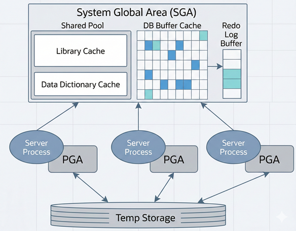
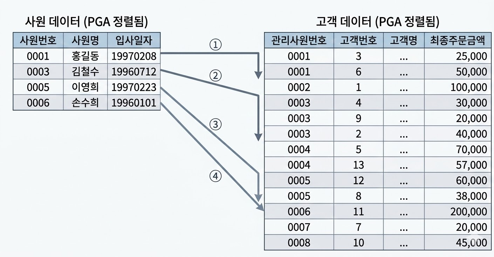

# 소트 머지 조인
## SGA vs PGA
* 공유 메모리 영역인 SGA(System/Shared Global Area)에 캐시된 데이터는 여러 프로세스가 공유
    * 단, 동시에 엑세스 불가
    * 동시에 엑세스하려는 프로세스 간 엑세스를 직렬화하기 위한 Lock 매커니즘으로서 래치(Latch)가 존재
* 데이터 블록과 인덱스 블록을 캐싱하는 DB 버퍼캐시는 SGA의 핵심 구성요소
    * 블록을 읽으려면 버퍼 Lock도 얻어야 함

{: w="35%"}

* 오라클 서버 프로세스는 SGA에 공유된 데이터를 읽고 쓰면서, 동시에 자신만의 고유 메모리 영역을 가짐
* 각 오라클 서버 프로세스에 할당된 메모리 영역을 PGA(Process/Program/Private Global Area)
    * 프로세스에 종속적인 고유 데이터를 저장하는 용도
    * PGA 공간이 작아 데이터를 모두 저장할 수 없을 때는 Temp 테이블스페이스 이용
* PGA는 독립적인 메모리 공간이므로 **래치 메커니즘 불필요**
    * **같은 양의 데이터를 읽더라도 SGA 버퍼캐시보다 빠름**

## 기본 메커니즘
* 소트 머지 조인(Sort Merge Join) 진행 단계
    * 소트 단계: 양쪽 집합을 조인 컬럼 기준으로 정렬
    * 머지 단계: 정렬한 양쪽 집합을 서로 머지
* use_merge힌트로 유도

```sql
select /*+ ordered use_merge(c) */ e.사원번호, e.사원명, e.입사일자 , c.고객번호, c.고객명, c.전화번호, c.최종주문금액
from   사원 e, 고객 c
where  c.관리사원번호 = e.사원번호
and    e.입사일자     >= '19960101'
and    e.부서코드     = 'Z123'
and    c.최종주문금액 >= 20000
```

* SQL 수행과정
    * 아래 조건에 해당하는 사원 데이터를 읽어 조인컬럼인 사원번호 순으로 정렬
        * 정렬한 결과집합은 PGA 영역에 할당된 Sort Area에 저장
            * 정렬한 결과집합이 PGA 영역보다 크면 Temp 테이블스페이스에 저장

    ```sql
    select 사원번호, 사원명, 입사일자
    from   사원
    where  입사일자 >= '19960101'
    and    부서코드 = 'Z123'
    order by 사원번호
    ```

    * 아래 조건에 해당하는 고객 데이터를 읽어 조인컬럼인 관리사원번호 순으로 정렬
        * 정렬한 결과집합은 PGA 영역에 할당된 Sort Area에 저장
            * 정렬한 결과집합이 PGA 영역보다 크면 Temp 테이블스페이스에 저장

    ```sql
    select 고객번호, 고객명, 전화번호, 최종주문금액, 관리사원번호
    from   고객 c
    where  최종주문금액 >= 20000
    order by 관리사원번호
    ```

    * PGA(또는 Temp 테이블스페이스)에 저장한 사원 데이터를 스캔하면서 PGA(또는 Temp 테이블스페이스)에 저장한 고객 데이터와 조인

    ```sql
    begin
        for outer in (select * from PGA에_정렬된_사원)
        loop    -- outer 루프
            for inner in (select * from PGA에_정렬된_고객
                        where 관리사원번호 = outer.사원번호)
            loop  -- inner 루프
            dbms_output.put_line( ... );
            end loop;
        end loop;
    end;
    ```

* 첫 두 단계가 소트 단계, 마지막이 머지 단계
    * 실제 조인을 수행하는 머지 단계는 NL조인과 다르지 않음

{: w="35%"}

* 사원 데이터를 기준으로 고객 데이터를 매번 Full Scan 하지 않음
    * 고객 데이터가 정렬돼 있어 조인 대상 레코드가 시작되는 지점을 쉽게 찾을 수 있음
    * 조인에 실패하는 레코드를 만나는 순간 바로 멈출 수 있음
* Sort Area에 저장한 데이터 자체가 인덱스 역할
    * 조인 컬럼에 인덱스가 없어도 사용 가능한 조인 방식
    * 조인 컬럼에 인덱스가 있어도 NL 조인은 대량 데이터를 조인할 때 불리하므로 소트 머지 조인 사용 가능

## 소트 머지 조인이 빠른 이유
* NL 조인은 *인덱스를 이용한 조인 방식*
    * 조인 과정에서 엑세스하는 모든 블록을 랜덤 엑세스 방식으로 *건건이* DB 버퍼캐시를 경유해서 읽음
    * 인덱스든 테이블이든 읽는 모든 블록에 래치 획득 및 캐시버퍼 체인 스캔 과정을 거침
    * 버퍼캐시에서 찾지 못한 블록은 *건건이* 디스크에서 읽음
* 소트 머지 조인은 양쪽 테이블로부터 조인 대상 집합(조인 조건 이외 필터 조건을 만족하는 집합)을 *일괄적으로* 읽어 PGA에 저장 후 조인
    * PGA는 프로세스만을 위한 독립적인 메모리 공간이므로 래치 획득 과정이 없음
* 소트 머지 조인도 양쪽 테이블로부터 조인 대상 집합을 읽을 때 DB 버퍼캐시 경유
    * 인덱스 이용하기도 함
    * 버퍼캐시 탐색 비용 & 랜덤 엑세스 부하 발생 가능

## 소트 머지 조인의 주용도
* 대량 데이터 처리는 대부분 해시 조인이 더 빠름
* 해시 조인은 조인 조건식이 등치(=) 조건이 아닐 때 사용 불가
* 소트 머지 조인이 주로 사용되는 상황
    * 조인 조건식이 등치(=) 조건이 아닌 대량 데이터 조인
    * 조인 조건이 아예 없는 조인(Cross Join, 카테시안 곱)

## 소트 머지 조인 제어하기
```sql
-- use_merge 힌트 사용
-- ordered는 FROM절에 기술한 순서대로 조인하라고 지시하는 힌트(leading(e)로 대체 가능)
select /*+ ordered use_merge(c) */
       e.사원번호, e.사원명, e.입사일자
     , c.고객번호, c.고객명, c.전화번호, c.최종주문금액
from   사원 e, 고객 c
where  c.관리사원번호 = e.사원번호
and    e.입사일자     >= '19960101'
and    e.부서코드     = 'Z123'
and    c.최종주문금액 >= 20000

-- 양쪽 테이블을 각각 소트한 후, 위쪽 사원 테이블 기준으로 아래쪽 고객 테이블과 머지 조인
-- 소트할 대상을 찾기 위해 각 테이블을 엑세스할 때 인덱스 사용(Table Full Scan도 가능)

Execution Plan
----------------------------------------------------------
0      SELECT STATEMENT Optimizer=ALL_ROWS
1   0    MERGE JOIN
2   1      SORT (JOIN)
3   2        TABLE ACCESS (BY INDEX ROWID) OF '사원' (TABLE)
4   3          INDEX (RANGE SCAN) OF '사원_X1' (INDEX)
5   1      SORT (JOIN)
6   5        TABLE ACCESS (BY INDEX ROWID) OF '고객' (TABLE)
7   6          INDEX (RANGE SCAN) OF '고객_X1' (INDEX)
```

## 소트 머지 조인 특징 요약
* 조인을 위해 실시간으로 인덱스를 생성하는 것과 다름 없음
    * 양쪽 집합을 정렬한 다음에는 NL조인과 같은 방식
    * PGA 영역에 저장한 데이터를 이용해 빠름
    * 소트 부하만 감수하면, 건건이 버퍼캐시를 경유하는 NL조인보다 빠름
* NL 조인과 달리 소트 머지 조인은 조인 컬럼에 대한 인덱스 유무 영향을 받지 않음
    * 양쪽 집합을 개별적으로 읽고 나서 조인을 시작
    * 조인 컬럼에 인덱스가 없는 상황에서 두 테이블을 각각 읽어 조인 대상 집합을 줄일 수 있을 때 유리
* 스캔 위주의 엑세스 방식
    * 양쪽 소스 집합으로부터 조인 대상 레코드를 찾는 데 인덱스를 이용할 수 있고, 이때는 랜덤 엑세스