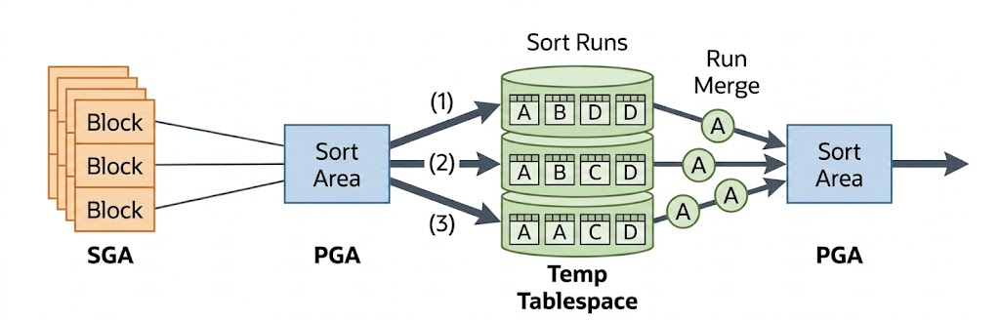
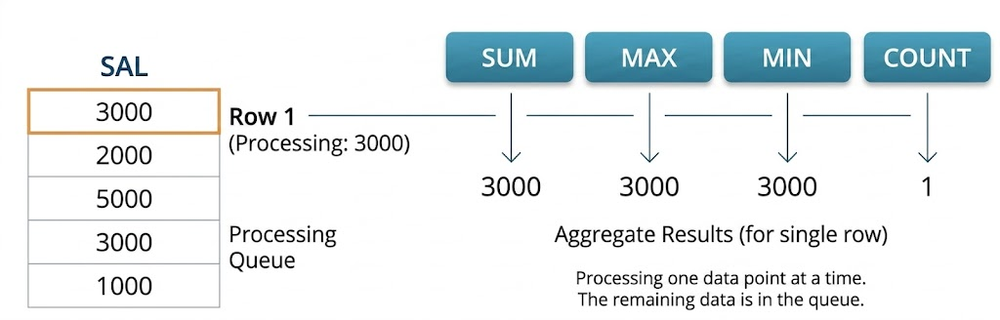
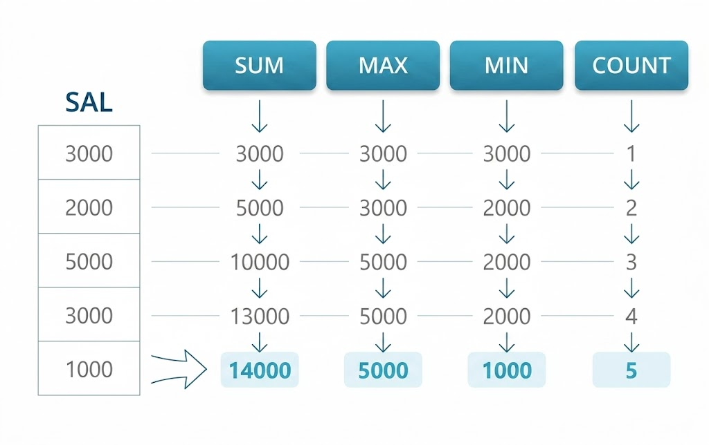
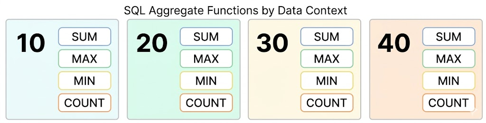
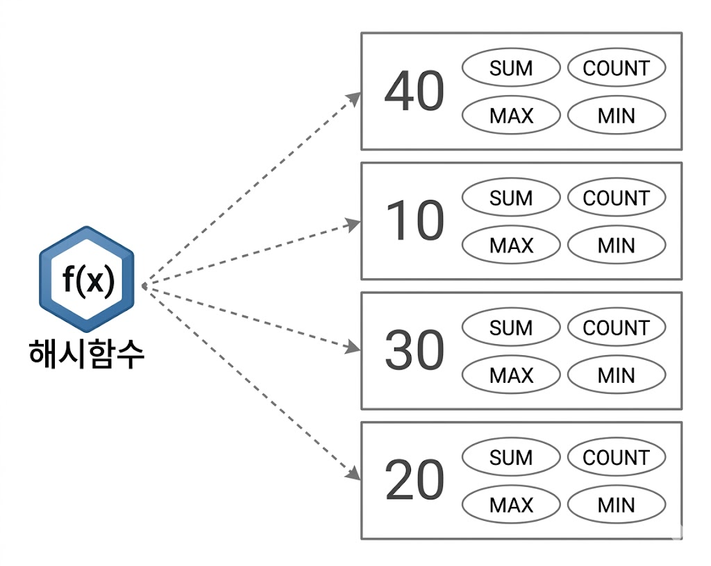

# 소트 연산에 대한 이해
## 소트 수행 과정
* 기본적으로 PGA에 할당한 Sort Area에서 이뤄짐
    * 메모리 공간인 Sort Area가 다 차면, 디스크 Temp 테이블 스페이스 활용
* 메모리 소트(In-Memory Sort)
    * 전체 데이터의 정렬 작업을 메모리 내에서 완료
    * Internal Sort
* 디스크 소트(To-Disk Sort)
    * 할당받은 Sort Area 내에서 정렬을 완료하지 못해 디스크 공간까지 사용하는 경우
    * External Sort
* 수행 과정
    * 소트할 대상 집합을 SGA 버퍼캐시를 통해 읽음
    * 일차적으로 Sort Area에서 정렬 시도
    * 정렬할 양이 많을 때는 정렬된 중간 집합을 Temp 테이블스페이스에 임시 세그먼트를 만들어 저장
        * Sort Area가 찰 때마다 Temp 영역에 저장해 둔 중간 단계 집합을 Sort Run이라 부름
    * 최종 결과집합을 얻기 위해 Sort Run을 Merge
    * 오름차순 정렬이라면 각각에서 가장 작은 값부터 PGA로 읽어 들이다가 PGA가 찰 때마다 쿼리 수행 다음 단계로 전달하거나 클라이언트에게 전송

{: w="35%"}
*To-Disk Sort*

* 소트 연산은 메모리 집약적(Memory-intensive)이면서 CPU 집약적(CPU-intensive)
    * 처리할 데이터량이 많을 때는 디스크 I/O까지 발생해 성능에 영향이 큼
* 많은 서버 리소스를 사용하고 디스크 I/O가 발생하는 것도 문제지만, **부분범위 처리를 불가능하게 함으로써 OLTP 환경에서 애플리케이션 성능 저하시키는 주요인**
* 소트가 발생하지 않도록 SQL을 작성해야 하고, 불가피하다면 메모리 내에서 수행을 완료할 수 있게 해야 함

## 소트 오퍼레이션
### Sort Aggregate
* 전체 로우를 대상으로 집계를 수행할 때
    * 실제로 데이터를 정렬하진 않음
    * Sort Area를 사용한다는 의미

```sql
SQL> select sum(sal), max(sal), min(sal), avg(sal) from emp;

------------------------------------------------------------------------------------------
| Id  | Operation           | Name | Rows  | Bytes | Cost (%CPU)| Time     |
------------------------------------------------------------------------------------------
|   0 | SELECT STATEMENT    |      |     1 |     4 |     3   (0)| 00:00:01 |
|   1 |  SORT AGGREGATE     |      |     1 |     4 |            |          |
|   2 |   TABLE ACCESS FULL | EMP  |    14 |    56 |     3   (0)| 00:00:01 |
------------------------------------------------------------------------------------------
```

* 데이터를 정렬하지 않고 SUM, MAX, MIN, AVG를 구하는 절차
    * Sort Area에 SUM, MAX, MIN, AVG, COUNT 값을 위한 변수를 각각 하나씩 할당
    * EMP 테이블 첫 번째 레코드에서 읽은 SAL 값을 SUM, MAX, MIN 변수에 저장하고, COUNT 변수에 1 저장
    * EMP 테이블에서 레코드를 하나씩 읽어 내려가면서 
        * SUM 변수에는 값을 누적
        * MAX 변수에는 기존보다 큰 값이 나타날 때마다 값을 대체
        * MIN 변수에는 기존보다 작은 값이 나타날 때마다 값을 대체
        * COUNT 변수에는 SAL 값이 NULL이 아닌 레코드를 만날 때마다 1씩 증가
    * EMP 레코드를 다 읽고 난 후, 결과값을 그대로 출력
        * AVG는 SUM을 COUNT로 나눈 값을 출력

{: w="35%"}

{: w="35%"}

### Sort Order By
* 데이터를 정렬할 때 나타남

```sql
SQL> select * from emp order by sal desc;

------------------------------------------------------------------------------------------
| Id  | Operation           | Name | Rows  | Bytes | Cost (%CPU)| Time     |
------------------------------------------------------------------------------------------
|   0 | SELECT STATEMENT    |      |    14 |   518 |     4  (25)| 00:00:01 |
|   1 |  SORT ORDER BY      |      |    14 |   518 |     4  (25)| 00:00:01 |
|   2 |   TABLE ACCESS FULL | EMP  |    14 |   518 |     3   (0)| 00:00:01 |
------------------------------------------------------------------------------------------
```

### Sort Group By
* 소팅 알고리즘을 사용해 그룹별 집계를 수행할 때 나타남

```sql
SQL> select deptno, sum(sal), max(sal), min(sal), avg(sal)
  2  from   emp
  3  group by deptno
  4  order by deptno ;

------------------------------------------------------------------------------------------
| Id  | Operation           | Name | Rows  | Bytes | Cost (%CPU)| Time     |
------------------------------------------------------------------------------------------
|   0 | SELECT STATEMENT    |      |    11 |   165 |     4  (25)| 00:00:01 |
|   1 |  SORT GROUP BY      |      |    11 |   165 |     4  (25)| 00:00:01 |
|   2 |   TABLE ACCESS FULL | EMP  |    14 |   210 |     3   (0)| 00:00:01 |
------------------------------------------------------------------------------------------
```

* 예시
    * 수천 명의 사원(EMP)가 근무하는 회사에 부서가 4개(10, 20, 30, 40)뿐일 경우
    * 부서별 급여(SAL)을 집계 - 합계, 최대, 최소, 평균
    * 수행 과정
        * 각 부서에 대한 임시 공간을 마련
            * 각 공간마다 SUM, MAX, MIN, COUNT를 저장할 공간 마련
            * 공간을 부서번호 순으로 정렬
        * 각 사원의 급여 정보를 읽음
            * 읽은 사원의 부서번호에 해당하는 값을 갱신
                * Sort Aggregate와 동일
    * 부서 개수를 미리 알 수 없다면, 새로운 부서가 나타날때마다 새로운 공간을 정렬 순서에 맞춰 중간에 끼워 넣어야 함
    * 아무리 사원이 많아도, 부서가 많지 않다면 Sort Area가 클 필요 없음

{: w="30%"}

* 오라클 10gR2 부터, Group By 절 뒤에 Order by를 명시하지 않으면 대부분 Hash Group By로 처리

```sql
SQL> select deptno, sum(sal), max(sal), min(sal), avg(sal)
  2  from   emp
  3  group by deptno ;

------------------------------------------------------------------------------------------
| Id  | Operation           | Name | Rows  | Bytes | Cost (%CPU)| Time     |
------------------------------------------------------------------------------------------
|   0 | SELECT STATEMENT    |      |    11 |   165 |     4  (25)| 00:00:01 |
|   1 |  HASH GROUP BY      |      |    11 |   165 |     4  (25)| 00:00:01 |
|   2 |   TABLE ACCESS FULL | EMP  |    14 |   210 |     3   (0)| 00:00:01 |
------------------------------------------------------------------------------------------
```

* 읽는 레코드마다 Group By 컬럼의 해시 값으로 버킷을 찾아 그룹별로 집계항목을 갱신
    * 그룹 개수가 많지 않다면 집계할 대상 레코드가 아무리 많아도 Temp 테이블 스페이스를 사용하지 않음

{: w="30%"}

### 그룹핑 결과의 정렬 순서
* Hash Group By 뿐만 아니라, 그룹핑 결과는 정렬 순서를 애초에 보장하지 않음
    * Sort Group By 역시 마찬가지

```sql
SQL> select deptno, job, sum(sal), max(sal), min(sal)
  2  from   emp
  3  group by deptno, job ;

DEPTNO JOB                      SUM(SAL)   MAX(SAL)   MIN(SAL)
------ ------------------ ---------- ---------- ----------
    10 CLERK                    1300       1300       1300
    10 MANAGER                  2450       2450       2450
    10 PRESIDENT                5000       5000       5000
    20 CLERK                    1900       1100        800
    20 ANALYST                  6000       3000       3000
    20 MANAGER                  2975       2975       2975
    30 CLERK                     950        950        950
    30 MANAGER                  2850       2850       2850
    30 SALESMAN                 5600       1600       1250

9 개의 행이 선택되었습니다.

Execution Plan
----------------------------------------------------------
0      SELECT STATEMENT Optimizer=CHOOSE (Cost=4 Card=11 Bytes=132)
1    0   SORT (GROUP BY) (Cost=4 Card=11 Bytes=132)
2    1     TABLE ACCESS (FULL) OF 'EMP' (Cost=2 Card=14 Bytes=168)
```

* Sort Group By는 소팅 알고리즘을 이용해 값을 집계한다는 의미
    * 결과의 정렬이 아님
* 쿼리에 Order By 절을 명시하면 정렬 순서가 보장
    * 이때도 실행계획은 똑같이 Sort Group By
* 같은 Sort Group By인데 Order By 유무에 따라 정렬 순서가 달라지는 이유
    * 소팅 알고리즘을 사용해 그룹핑한 결과집합은 논리적인 정렬 순서를 갖는 연결 리스트
    * 사용자가 Order By를 명시하면 DBMS는 논리적 정렬 순서를 따라 값을 읽으므로 정렬 순서 보장
    * 물리적으로 저장된 순서는 논리적 순서와 다를 수 있음 & Order By가 없으면 오라클은 정렬된 순서로 결과를 출력할 이유가 없음
        * 논리적 순서를 무시하고 물리적으로 저장된 순서에 따라 값을 읽으므로 정렬을 보장하지 않음
* **정렬된 그룹핑 결과를 얻고자 한다면, 실행계획에 Sort Group By가 표시되더라도 Order By를 반드시 명시**
* Group By를 사용한 쿼리에 Order By를 추가하면 그룹핑을 위해 사용하는 내부 알고리즘이 바뀔 뿐 그룹핑과 정렬 작업을 각각 수행하지 않음

### Sort Unique
* 옵티마이저가 서브쿼리를 풀어 일반 조인문으로 변환하는 것이 서브쿼리 Unnesting
    * Unnesting된 서브쿼리가 M쪽 집합이면 메인 쿼리와 조인하기 전에 중복 레코드부터 전부 제거해야 함
        * 1쪽 집합이더라도 조인 컬럼에 Unique 인덱스가 없으면

```sql
SQL> select /*+ ordered use_nl(dept) */ * from dept
  2  where  deptno in (select /*+ unnest */ deptno
  3                    from emp where job = 'CLERK') ;

---------------------------------------------------------------------------------------
| Id  | Operation                     | Name        | Rows  | Bytes | Cost (%CPU)|
---------------------------------------------------------------------------------------
|   0 | SELECT STATEMENT              |             |     3 |    87 |     4  (25)|
|   1 |  NESTED LOOPS                 |             |     3 |    87 |     4  (25)|
|   2 |   SORT UNIQUE                 |             |     3 |    33 |     2   (0)|
|   3 |    TABLE ACCESS BY INDEX ROWID| EMP         |     3 |    33 |     2   (0)|
|   4 |     INDEX RANGE SCAN          | EMP_JOB_IDX |     3 |       |     1   (0)|
|   5 |   TABLE ACCESS BY INDEX ROWID | DEPT        |     1 |    18 |     1   (0)|
|   6 |    INDEX UNIQUE SCAN          | DEPT_PK     |     1 |       |     0   (0)|
---------------------------------------------------------------------------------------
```

* 만약 PK/Unique 제약 또는 Unique 인덱스를 통해 Unnesting된 서브쿼리의 유일성이 보장된다면, Sort Unique 오퍼레이션은 생략
* Union, Minus, Intersect 같은 집합(Set) 연산자를 사용할 때도 Sort Unique 오퍼레이션이 나타남

```sql
-- 1. UNION (중복 제거를 위한 SORT UNIQUE 발생)
SQL> select job, mgr from emp where deptno = 10
  2  union
  3  select job, mgr from emp where deptno = 20;

------------------------------------------------------------------------------------------
| Id  | Operation           | Name | Rows  | Bytes | Cost (%CPU)| Time     |
------------------------------------------------------------------------------------------
|   0 | SELECT STATEMENT    |      |    10 |   150 |     8  (63)| 00:00:01 |
|   1 |  SORT UNIQUE        |      |    10 |   150 |     8  (63)| 00:00:01 |
|   2 |   UNION-ALL         |      |       |       |            |          |
|   3 |    TABLE ACCESS FULL| EMP  |     5 |    75 |     3   (0)| 00:00:01 |
|   4 |    TABLE ACCESS FULL| EMP  |     5 |    75 |     3   (0)| 00:00:01 |
------------------------------------------------------------------------------------------

-- 2. MINUS (차집합 연산을 위한 SORT UNIQUE 발생)
SQL> select job, mgr from emp where deptno = 10
  2  minus
  3  select job, mgr from emp where deptno = 20;

------------------------------------------------------------------------------------------
| Id  | Operation           | Name | Rows  | Bytes | Cost (%CPU)| Time     |
------------------------------------------------------------------------------------------
|   0 | SELECT STATEMENT    |      |     5 |   150 |     8  (63)| 00:00:01 |
|   1 |  MINUS              |      |       |       |            |          |v
|   2 |   SORT UNIQUE       |      |     5 |    75 |     4  (25)| 00:00:01 |
|   3 |    TABLE ACCESS FULL| EMP  |     5 |    75 |     3   (0)| 00:00:01 |
|   4 |   SORT UNIQUE       |      |     5 |    75 |     4  (25)| 00:00:01 |
|   5 |    TABLE ACCESS FULL| EMP  |     5 |    75 |     3   (0)| 00:00:01 |
------------------------------------------------------------------------------------------
```

* Distinct 연산자를 사용해도 Sort Unique 오퍼레이션이 나타남

```sql
SQL> select distinct deptno from emp order by deptno;

------------------------------------------------------------------------------------------
| Id  | Operation           | Name | Rows  | Bytes | Cost (%CPU)| Time     |
------------------------------------------------------------------------------------------
|   0 | SELECT STATEMENT    |      |     3 |     9 |     5  (40)| 00:00:01 |
|   1 |  SORT UNIQUE        |      |     3 |     9 |     4  (25)| 00:00:01 |
|   2 |   TABLE ACCESS FULL | EMP  |    14 |    42 |     3   (0)| 00:00:01 |
------------------------------------------------------------------------------------------
```

* 오라클 10gR2부터 Distinct 연산에도 Hash Unique 방식을 사용
    * Group By와 마찬가지로 Order By를 생략할 때

```sql
SQL> select distinct deptno from emp;

------------------------------------------------------------------------------------------
| Id  | Operation           | Name | Rows  | Bytes | Cost (%CPU)| Time     |
------------------------------------------------------------------------------------------
|   0 | SELECT STATEMENT    |      |     3 |     9 |     4  (25)| 00:00:01 |
|   1 |  HASH UNIQUE        |      |     3 |     9 |     4  (25)| 00:00:01 |
|   2 |   TABLE ACCESS FULL | EMP  |    14 |    42 |     3   (0)| 00:00:01 |
------------------------------------------------------------------------------------------
```

### Sort Join
* 소트 머지 조인을 수행할 때 나타남

```sql
SQL> select /*+ ordered use_merge(e) */ *
  2  from   dept d, emp e
  3  where  d.deptno = e.deptno ;

------------------------------------------------------------------------------------------
| Id  | Operation           | Name | Rows  | Bytes | Cost (%CPU)| Time     |
------------------------------------------------------------------------------------------
|   0 | SELECT STATEMENT    |      |    14 |   770 |     8  (25)| 00:00:01 |
|   1 |  MERGE JOIN         |      |    14 |   770 |     8  (25)| 00:00:01 |
|   2 |   SORT JOIN         |      |     4 |    72 |     4  (25)| 00:00:01 |
|   3 |    TABLE ACCESS FULL | DEPT |     4 |    72 |     3   (0)| 00:00:01 |
|   4 |   SORT JOIN         |      |    14 |   518 |     4  (25)| 00:00:01 |
|   5 |    TABLE ACCESS FULL | EMP  |    14 |   518 |     3   (0)| 00:00:01 |
------------------------------------------------------------------------------------------
```

### Window Sort
* 윈도우 함수(= 분석 함수)를 수행할 때 나타남

```sql
SQL> select empno, ename, job, mgr, sal
  2       , avg(sal) over (partition by deptno)
  3  from emp ;

------------------------------------------------------------------------------------------
| Id  | Operation           | Name | Rows  | Bytes | Cost (%CPU)| Time     |
------------------------------------------------------------------------------------------
|   0 | SELECT STATEMENT    |      |    14 |   406 |     4  (25)| 00:00:01 |
|   1 |  WINDOW SORT        |      |    14 |   406 |     4  (25)| 00:00:01 |
|   2 |   TABLE ACCESS FULL | EMP  |    14 |   406 |     3   (0)| 00:00:01 |
------------------------------------------------------------------------------------------
```