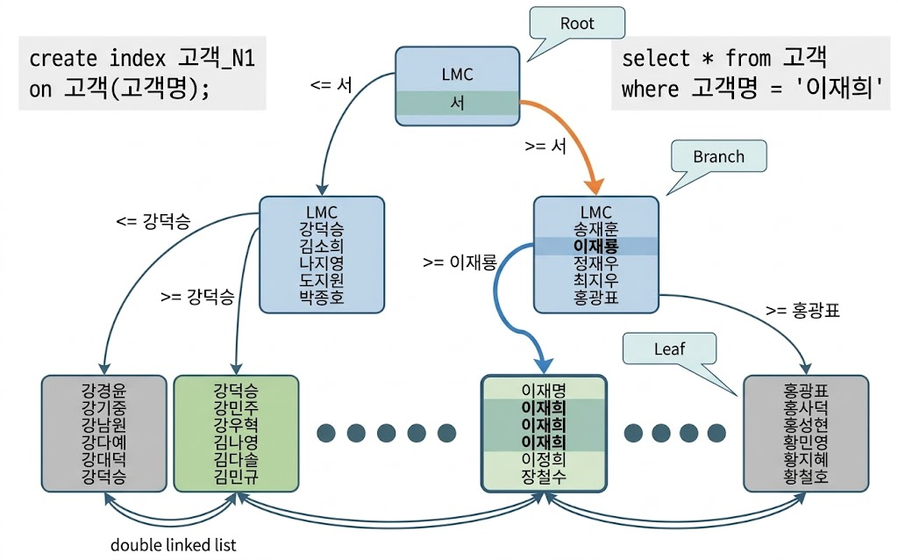
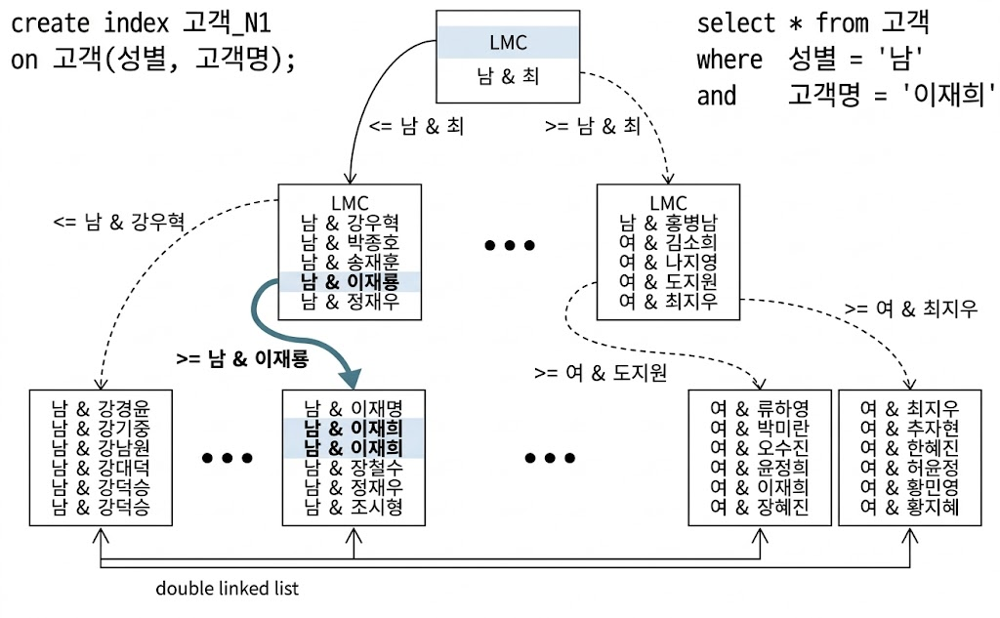
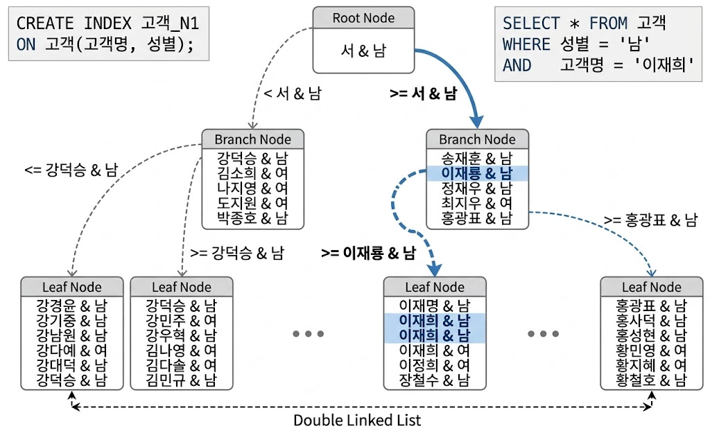

# 인덱스 구조 및 탐색
## 미리 보는 인덱스 튜닝
### 인덱스 튜닝의 두 가지 핵심 요소
* 인덱스는 큰 테이블에서 소량 데이터를 검색할 때 사용
    * 온라인 트랜잭션 처리(Oline Transaction Processing, OLTP) 시스템에서는 소량 데이터를 주로 검색하므로 인덱스 튜닝이 중요
* **인덱스 스캔 효율화 튜닝**
    * 학생명부에서 시력이 1.0 ~ 1.5인 홍길동 학생을 찾을 경우
        * 이름과 시력순으로 정렬된 경우 - 소량만 스캔해도 됨
        * 시력과 이름순으로 정렬된 경우 - 더 많은 양을 스캔해야 함
* 테이블 엑세스 횟수 줄이기 - **랜덤 엑세스 최소화 튜닝**
    * 학생명부에서 시력이 1.0 ~ 1.5인 홍길동 학생을 찾을 경우
        * 시력이 1.0 ~ 1.5인 학생이 50명, 홍길동인 학생이 5명, 탐색 대상 학생이 2명으로 가정
        * 이름만으로 정렬한 학생명부와 시력만으로 정렬한 학생명부만 있을 경우
        * 이름만으로 정렬한 학생명부를 사용하는게 더 효율적
* 랜덤 엑세스 최소화 튜닝이 인덱스 스캔 효율화 튜닝보다 성능에 미치는 영향이 큼

### SQL 튜닝은 랜덤 I/O와의 전쟁
* DB 성능이 느린 이유는 디스크 I/O 때문
    * OLTP 시스템이라면 특히 랜덤 I/O가 중요
* NL 조인이 대량 데이터 조인할 때 느린 이유도 랜던 I/O 때문
    * 소트머지 조인과 해시 조인도 이를 극복하기 위한 기능

## 인덱스 구조
* DB에서 인덱스 없이 데이터를 검색하려면 테이블을 처음부터 끝까지 모두 읽어야 함
    * 인덱스를 이용하면 일부만 읽고 멈출 수 있음
    * 범위 스캔(Range Scan)이 가능
        * 인덱스가 정렬돼 있기 때문

{: w="40%"}
*B Tree*

* DBMS는 일반적으로 B*Tree 인덱스 사용
    * 루트와 브랜치 블록의 레코드는 하위 브록에 대한 주소값을 가짐
    * 키값은 하위 블록에 저장된 키값의 범위를 나타냄
        * 루트 블록 '서' 레코드가 가리키는 하위 블록에는 고객명이 '서'보다 크거 같은 레코드가 저장
    * 루트와 브랜치 블록에는 키 값을 갖지 않는 LMC(Leftmost Child) 레코드가 있음
        * LMC가 가리키는 주소로 찾아간 블록에는 키값을 가진 첫 번째 레코드보다 작거나 같은 레코드가 저장
    * 리프 블록에 저장된 각 레코드는 키값 순으로 정렬 & 테이블 레코드를 가리키는 주소값인 ROWID를 가짐
        * 인덱스 키값이 같으면 ROWID 순으로 정렬
    * ROWID = 데이터 블록 주소 + 로우 번호
        * 데이터 블록 주소 = 데이터 파일 번호 + 블록 번호
        * 블록 번호 = 데이터 파일 내에서 부여한 상대적 순번
        * 로우 번호 = 블록 내 순번
* 인덱스 탐색 과정
    * 수직적 탐색: 인덱스 스캔 시작지점을 찾는 과정
    * 수평적 탐색: 데이터를 찾는 과정

## 인덱스 수직적 탐색
* 정렬된 인덱스 레코드 중 조건에 만족하는 첫 레코드를 찾는 과정
    * *인덱스 스캔의 시작점을 찾는 과정*
* 루트(Root) 블록에서 시작
    * 루트 & 브랜치 블록에 저장된 하위 블록에 대한 주소값 이용
* 탐색 과정에서 찾고자 하는 값보다 크거나 같은 값을 만나면, 바로 직전 레코드가 가리키는 하위 블록으로 이동
    * 예시 - '이재희' 탐색
        * 루트 블록에는 '이재희'보다 크거나 같은 값이 없음 - 맨 마지막 '서'레코드가 가리키는 하위 블록으로 이동
        * '이재희'보다 큰 '정재우'를 찾음 - 바로 직전 레코드('이재룡')가 가리키는 하위 블록으로 이동
        * 리프 블록에 도달해 조건을 만족하는 첫 번째 레코드 찾음
    * 예시 - '강덕승' 탐색
        * 루트 블록에 '강덕승'보다 큰 값('서')가 있음 - 바로 직전 레코드(LMC)가 가리키는 하위 블록으로 이동
        * 찾고자 하는 값과 일치하는 레코드 있음 - 바로 직전 레코드(LMC)가 가리키는 하위 블록으로 이동

## 인덱스 수평적 탐색
* 수직적 탐색을 통해 찾은 스캔 시작점에서, 찾고자 하는 데이터가 더 안 나타날 때까지 인덱스 리프 블록을 수평적으로 스캔
    * 본격적으로 데이터를 찾는 과정
* 리프 블록끼리는 서로 앞뒤 블록에 대한 주소값을 가짐
    * double linked list
* 수평적 탐색을 통해
    * 조건절에 만족하는 데이터를 모두 찾음
    * ROWID를 얻음
        * 일반적으로 인덱스를 스캔하고서 테이블에 액세스할 때 사용

## 결합 인덱스 구조와 탐색

{: w="40%"}
*결합 인덱스*

* 예시 - 남자 '이재희'를 탐색
    * 루트에서 찾고자 하는 값보다 큰 첫 번째 레코드인 '남 & 최' 레코드 확인 - 바로 직전 레코드(LMC)가 가리키는 하위 블록으로 이동
    * 브랜치 블록에서 찾고자 하는 값보다 큰 첫 번째 레코드인 '남 & 정재우' 확인 - 바로 직전 레코드(남 & 이재룡)가 가리키는 하위 블록으로 이동
    * 리프에 도달 했으므로, 탐색 대상을 찾음

{: w="40%"}
*순서가 다른 결합 인덱스*

* 결합 인덱스에서, 어떤 조합으로 인덱스를 구성하든 읽는 인덱스 블록 개수는 같음
    * 인덱스 선두 컬럼을 = 조건으로 검색할 때는 어느 컬럼을 인덱스 앞쪽에 두든 블록 I/O 개수가 같으므로 성능이 같음
* 결합 인덱스에서 컬럼 배치 순서에 대한 오해
    * 선택도가 낮은 컬럼을 앞쪽에 두고 결합 인덱스를 생성해야 한다는 오해가 있음
    * DBMS가 사용하는 B*Tree는 엑셀 필터가 아님
    * 루트 - 브랜치 - 리프를 탐색하면서 = 조건을 모두 만족하는 첫 번째 레코드를 찾음
        * 그 후, 조건을 만족하지 않는 첫번째 레코드를 만날 때까지 스캔
    * 인덱스 구성에 따라 성능 차이가 나지만, 위와 같은 이유는 아님
* delte 작업 시 인덱스가 불균형(Unbalanced) 상태에 놓일 수 있다는 오해
    * B*Tree는 어떤 값으로 탐색하더라도 인덱스 루트에서 리프 블록에 도달하기까지 읽는 블록 수가 항상 같음
    * 즉, 루트로부터 모든 리프 블록까지의 높이(height)는 항상 같음