# 인덱스 스캔 효율화
## 인덱스 탐색


## 인덱스 스캔 효율성
## 엑세스 조건과 필터 조건
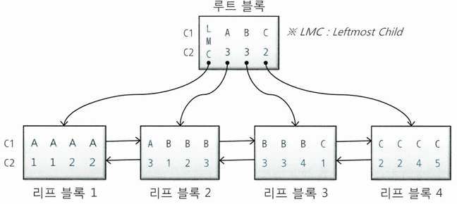{: w="40%"}

* 루트 블록에 (C1, C2)가 (A, 3), (B, 3), (C, 2)인 세 개의 레코드가 있음
    * 각 레코드는 하위 노드를 가리키는 블록 주소를 가짐
    * 레코드가 가리키는 주소로 찾아간 블록에는, 자신의 키 값보다 크거나 같은 값을 갖는 레코드가 저장
* 루트 블록에는 키 값을 갖지 않는 특별한 레코드인 LMC(Leftmost Child) 존재
    * 자식 노드 중 가장 왼쪽 끝에 위치한 블록을 가리킴
    * LMC가 가리키는 주소로 찾아간 블록에는 *키 값을 가진 첫 번째 레코드보다 작거나 같은 값*을 가진 레코드가 저장
 
### WHERE C1 = 'B'
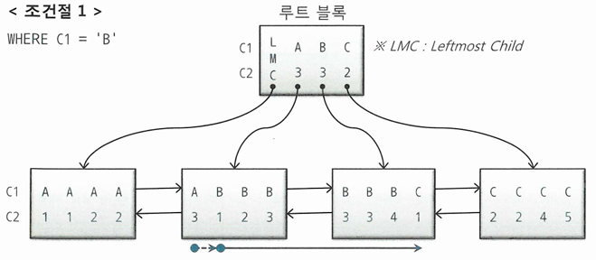{: w="40%"}

* 수직적 탐색을 통해 C1 = 'B'인 첫 번째 레코드를 찾고, 'C'를 만나는 순간 스캔 멈춤
    * 점선 화살표는 블록 내 시작점을 찾는 과정
* 루트 블록 스캔 과정에서 C1 = 'B'인 레코드를 찾았을 때, 그것이 가리키는 리프 블록3으로 가면 안 됨
    * 그 직전(C1 = 'A') 레코드가 가리키는 리프 블록 2로 가야 스캔 시작점을 찾음


### WHERE C1 = 'B' AND C2 = 3
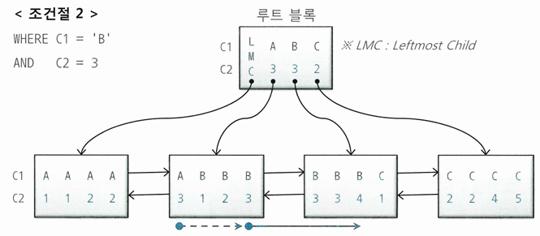{: w="40%"}

* C1, C2 조건이 스캔 시작점과 끝 지점을 결정해 스캔량을 줄이는 데 역할을 함

### WHERE C1 = 'B' AND C2 >= 3
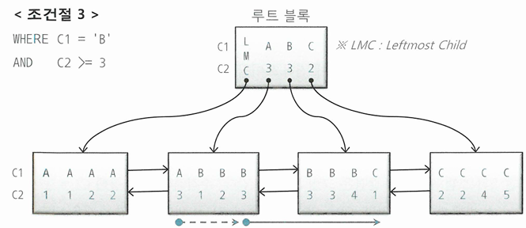{: w="40%"}

* C2 조건이 스캔을 멈추는 데 역할을 전혀 하지 못하지만, 스캔 시작점에 영향을 줌
    * 스캔 시작점을 결정해 스캔량을 줄이는 데 역할을 함

### WHERE C1 = 'B' AND C2 <= 3
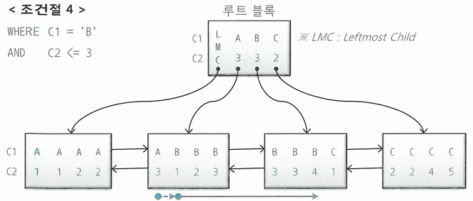{: w="40%"}

* C2 조건이 스캔 시작점을 결정하는 데 역할을 못했으나 스캔을 멈추는 데 영향을 줌
    * 스캔량을 줄이는 데 역할을 함

### WHERE C1 = 'B' AND C2 BETWEEN 2 AND 3
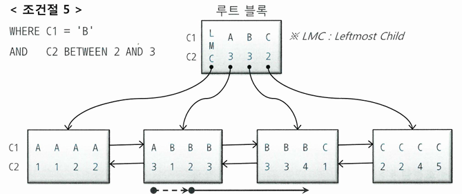{: w="40%"}

* C1, C2 조건이 스캔 시작점과 끝 지점을 결정해 스캔량을 줄이는 데 역할을 함

### WHERE C1 BETWEEN 'A' AND 'C' AND C2 BETWEEN 2 AND 3
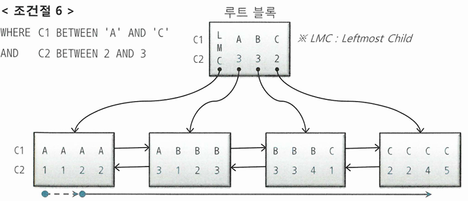{: w="40%"}

* C1 조건은 스캔 시작과 끝 지점을 결정하는 데 중요한 역할을 함
* C2는 스캔량을 줄이는 데 거의 역할을 못함
    * 중간 C1 = 'B' 구간에서는 사실상 무의미

## 인덱스 스캔 효율성
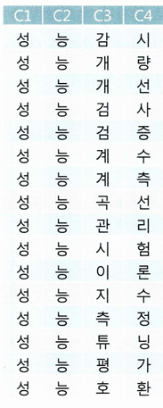{: w="30%"}
*용어사전의 각 문자별로 인덱스를 생성한 경우*

* '성능검'으로 시작하는 용어를 검색할 때
    * 인덱스 수직적 탐색을 통해 '성능검사' 레코드를 찾음
    * '성능계수'까지 총 3건의 레코드를 스캔
* '성능'으로 시작하고 네 번째 문자가 '선'인 용어를 검색할 때
    * '성능'으로 시작하는 레코드를 모두 스캔해야 함
    * 결과집합 개수는 첫 예시와 동일
* **인덱스 선행 컬럼이 조건절에 없기 때문에 발생하는 비효율**
    * 두 번째 예시를 조건절로 표현할 경우, C4보다 앞선 선행컬럼 C3가 조건절에 없음
    * 인덱스 선행 컬럼이 조건절에 없거나 '=' 조건이 아니면 인덱스 스캔 과정에서 비효율이 발생

### 인덱스 스캔 효율성 측정
```sql
Rows    Row Source Operation
----    --------------------------------------------------------------------
10      TABLE ACCESS BY INDEX ROWID TBL (cr=7471 pr=1466 pw=0 time 22137 us)
10          INDEX RANGE SCAN TBL_IDX (cr=7463 pr=1466 pw=0 time 22328 us)
```

* 인덱스를 스캔하고 얻은 레코드가 10개인데, 그 과정에서 7463개 블록을 읽음
* 인덱스 리프 블록에는 테이블 블록보다 많은 레코드가 담김
    * 한 블록당 평균 500개 레코드라고 가정
    * 500 * 7463 개 레코드를 읽고 레코드 10개를 얻은 것

## 엑세스 조건과 필터 조건
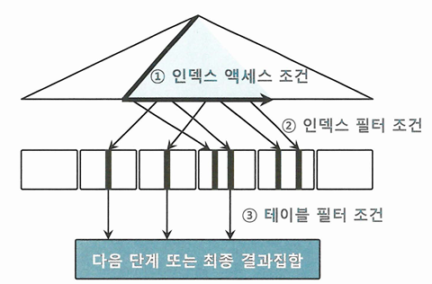{: w="40%"}

* **인덱스 엑세스 조건**은 인덱스 스캔 범위를 결정하는 조건절
    * 인덱스 수직적 탐색을 통해 스캔 시작점을 결정하는데 영향
    * 인덱스 리프 블록을 스캔하다가 어디서 멈출지를 결정하는데 영향
* **인덱스 필터 조건**은 테이블로 엑세스할지를 결정하는 조건절
* 용어사전 예시를 보면
    * 첫번째 예시의 경우 C1 ~ 3가 인덱스 엑세스 조건
    * 두번째 예시의 경우 C1 ~ 2가 인덱스 엑세스 조건, C4는 인덱스 필터 조건
* 인덱스를 이용하든, 테이블을 Full Scan 하든, 테이블 엑세스 단계에서 처리되는 조건절은 모두 필터 조건
* **테이블 필터 조건**은 쿼리 수행 다음 단계로 전달하거나 최종 결과 집합에 포함할지를 결정

## 비교 연산자 종류와 컬럼 순서에 따른 군집성
* 테이블과 달리 인덱스는 같은 값을 갖는 레코드들이 군집해 있음
    * 인덱스 컬럼을 앞쪽부터 누락없이 '=' 연산자로 조회하면 조건절을 만족하는 레코드는 모두 모여 있음
    * 어느 하나를 누락하거나 '='조건이 아닌 연산자로 조회하면 조건절을 만족하는 레코드는 서로 흩어진 상태

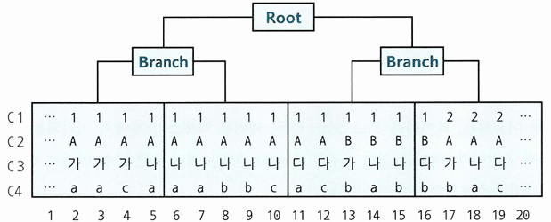{: w="40%"}

* WHERE C1 = 1 AND C2 = 'A' AND C3 = '나' AND C4 = 'a'
    * 조건을 만족하는 레코드들이 모두 연속(5 ~ 7)해서 모여 있음
* WHERE C1 = 1 AND C2 = 'A' AND C3 = '나' AND C4 >= 'a'
    * 맨 마지막 컬럼만 범위검색 조건일 때도 조건을 만족하는 레코드들이 모여 있음(5 ~ 10)
* WHERE C1 = 1 AND C2 = 'A' AND C3 BETWEEN '가' AND '다' AND C4 = 'a'
    * C1 ~ 3 조건을 만족하는 인덱스 레코드는 모여 있으나(2 ~ 12), 모든 조건을 만족하는 레코드는 흩어져 있음
* WHERE C1 = 1 AND C2 <= 'B' AND C3 = '나' AND C4 BETWEEN 'a' AND 'b'
    * C1 ~ 2 조건을 만족하는 레코드는 모여 있고(2 ~ 16), 모든 조건을 만족하는 레코드는 흩어져 있음
* 선행 컬럼이 모두 '=' 조건인 상태에서 **첫 번째 나타나는 범위검색 조건까지 만족하는 인덱스 레코드는 모두 연속해서 모여 있지만, 그 이하 조건까지 만족하는 레코드는 비교 연산자 종류 상관없이 흩어짐**
* WHERE C1 BETWEEN 1 AND 3 AND C2 = 'A' AND C3 = '나' AND C4 = 'a'
    * 선두 컬럼 C1이 범위검색 조건이면 C1 조건을 만족하는 레코드는 모여 있고(2 ~ 19), 모든 조건을 만족하는 레코드는 흩어져 있음
* 선행 컬럼이 모두 '=' 조건인 상태에서 첫 번째 나타나는 범위검색 조건이 인덱스 스캔 범위 결정
    * 선두 컬럼이 범위검색 조건이면, 그 조건이 스캔 범위를 결정
    * 이들 조건이 인덱스 엑세스 조건
    * 나머지는 인덱스 필터 조건

### 범위검색 조건 맨 처음과 마지막 구간에서의 엑세스 조건
* 마지막 예시에서 C2 ~ C4도 인덱스 스캔량을 줄이는 데 역할을 함
    * C1 = 1인 구간에서, 아래 조건을 만족하는 첫 번째 레코드를 찾아 수직적 탐색해 C1 = 1 구간에서 스캔 범위를 줄임
        * WHERE C1 >= 1 AND C2 = 'A' AND C3 = '나' AND C4 = 'a'
    * C1 = 3인 구간에서, 아래 조건보다 큰 값을 만나는 순간 멈추므로 스캔 범위를 줄이는 역할을 함
        * WHERE C1 <= 3 AND C2 'A' AND C3 = '나' AND C4 = 'a'
    
```sql
Predicate information (identified by operation id):
-----------------------------------------------------------------------
2 - access("C1">=1 AND "C2"='A' AND "C3"='나' AND "C4"='a' AND "C1"<=3)
2 - filter("C2"='A' AND "C3"='나' AND "C4"='a')
```

* 몇 가지 케이스를 제외하면, **인덱스 컬럼에 대한 조건절은 모두 엑세스 조건에 표시**됨
    * 좌변 컬럼을 가공한 조건절
    * 왼족 '%' 또는 양쪽 '%' 기호를 사용한 LIKE 조건절
    * 같은 컬럼에 대한 조건절이 두 개 이상일 때, 인덱스 엑세스 조건으로 선택되지 못한 조건절
    * OR Expansion 또는 INLIST ITERATOR로 선택되지 못한 OR 또는 IN 조건절

## 인덱스 선행 컬럼이 등치(=)조건이 아닐 때 생기는 비효율
* 인덱스 컬럼을 모두 '='조건으로 사용할 때 인덱스 스캔 효율성이 가장 좋음
    * 리프 블록을 스캔하면서 읽은 레코드가 모두 테이블 엑세스로 이어지므로
* 인덱스 컬럼 중 일부가 조건절에 없거나 등치 조건이 아니더라도, 그것이 뒤쪽 컬럼일 때는 비효율이 없음

```sql
SELECT *
FROM 매물아파트매매
WHERE 아파트시세코드='A01011350900056'
AND 평형 = '59'
AND 평형타입 = 'A'
AND 인터넷매물 BETWEEN '1' AND '3'
ORDER BY 입력일 DESC
```

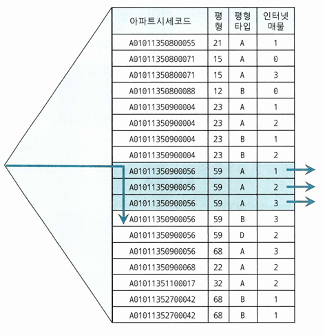{: w="35%"}
*인덱스 (아파트시세코드 + 평형 + 평형타입 + 인터넷매물)*

* 인터넷 매물이 BETWEEN 조건이지만 선행 컬럼들이 모두 '=' 조건이라 비효율없음
    * 3건을 찾기 위해 4건만 스캔했다는 의미
* **인덱스 선행 컬럼이 모두 '=' 조건이면 조건을 만족하는 레코드가 모두 모여 있기 때문에 필요한 범위만 스캔하고 멈출 수 있음**

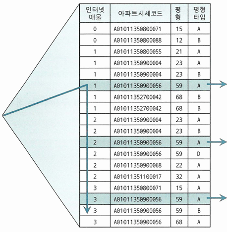{: w="35%"}
*인덱스 (인터넷매물 + 아파트시세코드 + 평형 + 평형타입)*

* 선두 컬럼에 BETWEEN 연산자를 사용하면 조건을 만족하지 않는 레코드까지 스캔해야 함

## BETWEEN을 IN-List로 전환
* 운영에서 인덱스 구성을 바꾸기 쉽지 않으므로, BETWEEN 조건을 IN-List로 바꾸면 효율이 올라가는 경우가 있음

```sql
SELECT *
FROM 매물아파트매매
WHERE 아파트시세코드='A01011350900056'
AND 평형 = '59'
AND 평형타입 = 'A'
AND 인터넷매물 IN ('1', '2', '3')
ORDER BY 입력일 DESC
```

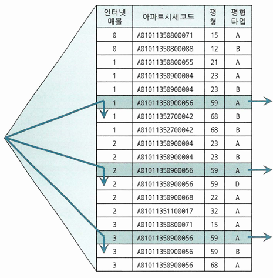{: w="35%"}

* 인덱스 수직적 탐색이 세번 발생하게 됨
    * 실행계획을 보면 INLIST INTERATOR

```sql
--------------------------------------------------------------------------------
| Id | Operation                      | Name            | Rows | Bytes | Cost |
--------------------------------------------------------------------------------
|  0 | SELECT STATEMENT               |                 |      |       |    6 |
|  1 |  INLIST ITERATOR               |                 |      |       |      |
|  2 |   TABLE ACCESS BY INDEX ROWID  | 매물아파트매매    |    3 |    37 |    6 |
|  3 |    INDEX RANGE SCAN            | 매물아파트매매_PK |    3 |       |    5 |
--------------------------------------------------------------------------------
```

* Row Source별 수행 통계를 보면, Index Range Scan 단계의 Starts가 3
    * 인덱스를 3번 탐색한다는 뜻

```sql
--------------------------------------------------------------------------------------
| Id | Operation                      | Name            | Starts | A-Rows | Buffers |
--------------------------------------------------------------------------------------
|  0 | SELECT STATEMENT               |                 |      1 |      3 |      12 |
|  1 |  INLIST ITERATOR               |                 |      1 |      3 |      12 |
|  2 |   TABLE ACCESS BY INDEX ROWID  | 매물아파트매매    |      3 |      3 |      12 |
|  3 |    INDEX RANGE SCAN            | 매물아파트매매_PK |      3 |      3 |      10 |
--------------------------------------------------------------------------------------

-- 인덱스를 3번 탐색한다는 것은 SQL을 아래와 같이 작성한 것과 같음
select 해당층, 평당가, 입력일, 해당동, 매물구분, 연사용일수, 중개업소코드
from   매물아파트매매
where  인터넷매물 = '1'
and    아파트시세코드='A01011350900056'
and    평형 = '59'
and    평형타입 = 'A'
union all
select 해당층, 평당가, 입력일, 해당동, 매물구분, 연사용일수, 중개업소코드
from   매물아파트매매
where  인터넷매물 = '2'
and    아파트시세코드='A01011350900056'
and    평형 = '59'
and    평형타입 = 'A'
union all
select 해당층, 평당가, 입력일, 해당동, 매물구분, 연사용일수, 중개업소코드
from   매물아파트매매
where  인터넷매물 = '3'
and    아파트시세코드='A01011350900056'
and    평형 = '59'
and    평형타입 = 'A'
order by 입력일 desc
```

* IN-List 개수만큼 UNION ALL 브랜치가 생성되고, 각 브랜치마다 모든 컬럼을 '=' 조건으로 검색하므로 선두 컬럼에 BETWEEN을 사용할 때와 같은 비효율이 사라짐

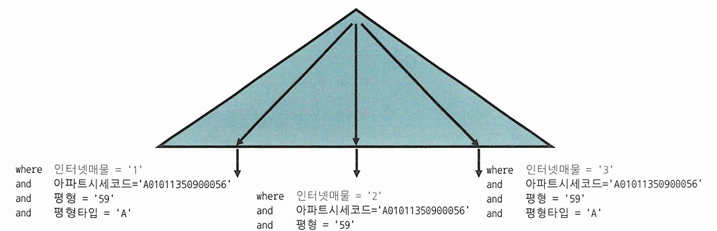{: w="30%"}

* Index Skip Scan 방식으로 유도해도 비슷한 효과를 얻을 수 있음
* IN-List 항목 개수가 늘어날 수 있다면 BETWEEN을 IN-List 방식으로 사용하기 곤란
    * NL 방식 조인문이나 서브쿼리로 구현
        * IN-List 값들을 코드 테이블로 관리하고 있어야 함

```sql
select /*+ ordered use_nl(b) */ b.해당층, b.평당가, b.입력일
     , b.해당동, b.매물구분, b.연사용일수, b.중개업소코드
from   통합코드 a, 매물아파트매매 b
where  a.코드구분 = 'CD064' -- 인터넷매물구분
and    a.코드 between '1' and '3'
and    b.인터넷매물 = a.코드
and    b.아파트시세코드 = 'A01011350900056'
and    b.평형 = '59'
and    b.평형타입 = 'A'
order by b.입력일 desc
```

### BETWEEN 조건을 IN-List로 전환할 때 주의사항
* IN-List 개수가 많지 않아야 함
    * 개수가 많으면, 수직적 탐색이 많이 발생
    * BETWEEN 조건 때문에 리프 블록을 많이 스캔하는 비효율보다 IN-List 개수만큼 브랜치 블록을 반복 탐색하는 비효율이 더 클 수 있음
        * 루트에서 브랜치 블록까지 Depth가 깊을 때 특히 그럼

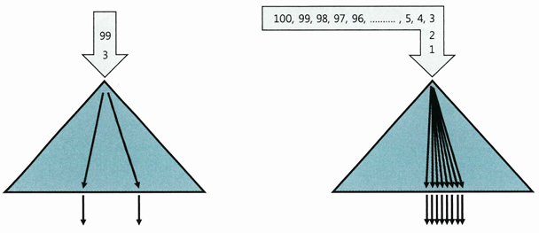{: w="30%"}

* 인덱스 스캔 과정에서 선택되는 레코드들이 멀리 떨어져 있을 때만 유용
    * BETWEEN으로 멀리 떨어진 레코드들을 찾으려면 인덱스 리프 블록을 많이 스캔해야 하기 때문

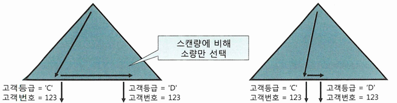{: w="30%"}

* BETWEEN 조건 때문에 인덱스를 비효율적으로 스캔하더라도 블록 I/O 측면에서는 대개 소량에 그치는 경우가 많음
    * 인덱스 리프 블록에는 테이블 블록보다 많은 레코드가 담기기 때문
    * IN-List 개수가 많으면 수직적 탐색 과정에서 이미 많은 블록을 읽게 됨

## Index Skip Scan 활용
```sql
-- 2018년 월별로 10만개 판매데이터 입력
-- 판매구분 값별로는 'A'가 10만개, 'B'가 110만개
create table 월별고객별판매집계
as
select rownum 고객번호
     , '2018' || lpad(ceil(rownum/100000), 2, '0') 판매월
     , decode(mod(rownum, 12), 1, 'A', 'B') 판매구분
     , round(dbms_random.value(1000,100000), -2) 판매금액
from   dual
connect by level <= 1200000 ;

select count(*)
from   월별고객별판매집계 t
where  판매구분 = 'A'
and    판매월 between '201801' and '201812'
```

* 쿼리를 최적으로 수행하려면 '=' 조건인 판매구분이 선두컬럼에 위치하도록 인덱스를 구성해야 함

```sql
create index 월별고객별판매집계_IDX1 on 월별고객별판매집계(판매구분, 판매월);

-- 인덱스를 스캔하면서 281개의 블록 I/O 발생
-- 테이블 엑세스는 발생하지 않음
Rows     Row Source Operation
-------  ---------------------------------------------------
      1  SORT AGGREGATE (cr=281 pr=0 pw=0 time=47753 us)
 100000    INDEX RANGE SCAN 월별고객별판매집계_IDX1 (cr=281 pr=0 pw=0 time= ... )
```

* BETWEEN 조건의 판매월 컬럼이 선두인 인덱스를 사용하면 판매구분 'A'인 레코드는 각 판매월 앞쪽에 위치
    * 전체에서 차지하는 비중이 8.3%로 서로 멀리 떨어지게 됨
    * 인덱스 선두 컬럼이 BETWEEN 조건이어서 판매구분이 'B'인 레코드까지 모두 스캔하고서 버림

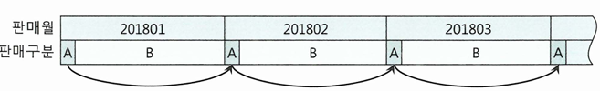{: w="30%"}

```sql
create index 월별고객별판매집계_IDX2 on 월별고객별판매집계(판매월, 판매구분);

select /*+ index(t 월별고객별판매집계_IDX2) */ count(*)
from   월별고객별판매집계 t
where  판매구분 = 'A'
and    판매월 between '201801' and '201812'

-- 인덱스를 스캔하면서 3090개 블록 I/O 발생
Rows     Row Source Operation
-------  ---------------------------------------------------
      1  SORT AGGREGATE (cr=3090 pr=0 pw=0 time=206430 us)
 100000    INDEX RANGE SCAN 월별고객별판매집계_IDX2 (cr=3090 pr=0 pw=0 time= ... )
```

* IN-List로 전환 시 인덱스 브랜치 블록을 열두 번 반복 탐색했으나, 리프 블록을 스캔할 때의 비효율을 제거함으로써 성능이 10배 좋아짐

```sql
select /*+ index(t 월별고객별판매집계_IDX2) */ count(*)
from   월별고객별판매집계 t
where  판매구분 = 'A'
and    판매월 in ( '201801', '201802', '201803', '201804', '201805', '201806'
                , '201807', '201808', '201809', '201810', '201811', '201812' )

-- 3090개이던 블록 I/O 개수가 314개로 감소
Rows     Row Source Operation
-------  ---------------------------------------------------
      1  SORT AGGREGATE (cr=314 pr=0 pw=0 time=31527 us)
 100000    INLIST ITERATOR (cr=314 pr=0 pw=0 time=900030 us)
 100000      INDEX RANGE SCAN 월별고객별판매집계_IDX2 (cr=314 pr=0 pw=0 time= ... )
```

* Index Skip Scan 유도시 선두 컬럼이 BETWEEN 조건인데도 큰 비효율 없이 일을 마침
    * IN-List보다 낫고, IDX1과 비교해도 큰 차이 없음

```sql
select /*+ INDEX_SS(t 월별고객별판매집계_IDX2) */ count(*)
from   월별고객별판매집계 t
where  판매구분 = 'A'
and    판매월 between '201801' and '201812'

-- 블록 I/O 300개 발생
Rows     Row Source Operation
-------  ---------------------------------------------------
      1  SORT AGGREGATE (cr=300 pr=0 pw=0 time=94282 us)
 100000    INDEX SKIP SCAN 월별고객별판매집계_IDX2 (cr=300 pr=0 pw=0 time=500073 us)
```

* 선두 컬럼이 BETWEEN 이어서 나머지 검색 조건을 만족하는 데이터들이 서로 멀리 떨어져 있을 때, Index Skip Scan이 유용함

## IN 조건은 '='인가
* **IN 조건은 =이 아님**

```sql
-- 고객번호의 평균 카디널리티는 3이라고 가정(고객별로 평균 3 건의 상품 가입)
select *
from   고객별가입상품
where  고객번호 = :cust_no
and    상품ID in ('NH00037', 'NH00041', 'NH00050')
```

* 인덱스를 (상품ID + 고객번호) 순으로 생성하면, 같은 상품은 고객번호 순으로 정렬된 상태로 하나(또는 연속된 두 개)의 리프 블록에 저장
    * 고객번호 기준으로는 같은 고객번호가 상품ID에 따라 뿔뿔이 흩어진 상태

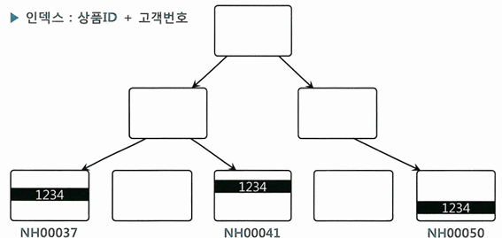{: w="30%"}

* 이런 경우에는, 상품ID 조건절이 IN-List Iterator 방식으로 풀리는 것이 효과적
    * 고객번호 조건을 만족하는 레코드가 서로 멀리 떨어져 있기 때문

```sql
-- IN-List Iterator로 풀린다는 것은 SQL이 아래와 같은 방식으로 실행된다는 의미
select *
from   고객별가입상품
where  고객번호 = :cust_no
and    상품ID = 'NH00037'
union all
select *
from   고객별가입상품
where  고객번호 = :cust_no
and    상품ID = 'NH00041'
union all
select *
from   고객별가입상품
where  고객번호 = :cust_no
and    상품ID = 'NH00050'
```

* 상품ID 조건절을 IN-List Iterator로 풀면 고객번호와 상품ID 둘 다 인덱스 엑세스 조건으로 사용
    * 인덱스를 수직적으로 3번 탐색하며, 그 과정에서 아홉 개 블록을 읽음
* 지금과 같은 인덱스 구성에서는 상품ID 조건절이 IN-List Iterator 방식으로 풀려야 효과적
    * 인덱스를 정상적으로 사용하려면 수직적 탐색을 통해 스캔 시작점을 찾아야 하는데, 상품ID가 'NH00037'이거나 'NH00041'이거나 'NH00050'인 어느 한 지점을 찾을 수 없기 때문
    * 상품ID가 인덱스 선두 컬럼인 상황에서 IN-List Iterator 방식으로 풀지 않으면, 상품ID는 필터 조건이므로 테이블 전체 또는 인덱스 전체를 스캔하면서 필터링

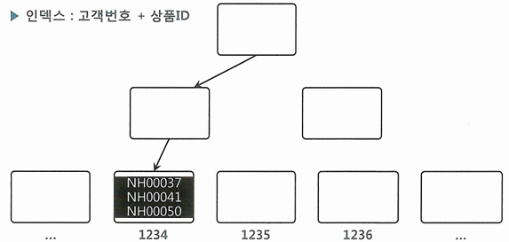{: w="30%"}

* 인덱스가 (고객번호 + 상품ID) 순인 경우, 같은 고객은 상품ID 순으로 정렬된 상태로 같은 리프블록에 저장
* 상품ID 조건절을 IN-List Iterator 방식으로 풀면, 인덱스를 수직적으로 3번 탐색하는 과정에서 9개 블록을 읽음
* 상품ID 조건절을 IN-List Iterator 방식으로 풀지 않으면, 상품ID 조건절은 필터링 처리함
    * 고객번호만 엑세스 조건이므로 고객번호 =1234인 레코드를 모두 스캔
    * 같은 고객은 한 블록(또는 연속된 두 블록)에 모여 있으므로 블록 I/O는 수직적 탐색을 포함 총 3 ~ 4개만 발생
* IN은 '='이 아니다
    * '='이 되려면 IN-List Iterator 방식으로 풀려야만 하고, 그렇지 않으면 필터 조건
    * 하지만 방금 예시를 보면, 상품ID가 엑세스 조건으로서 의미있는 역할을 하려면, 고객별 상품 데이터가 아주 많아야 함

### 다른 예시
* 상품 테이블 인덱스
    * 상품_PK: 상품ID
    * 상품_X01: 상품ID + 상품구분코드

```sql
select * from 상품
where 상품ID = :prod_id
and   상품구분코드 in ( 'GX', 'KR' )

Execution Plan
---------------------------------------------------------------------------
0      SELECT STATEMENT Optimizer=ALL_ROWS (Cost=2 Card=1 Bytes=38)
1    0   TABLE ACCESS (BY INDEX ROWID) OF '상품' (TABLE) (Cost=2 Card=1 Bytes=38)
2    1     INDEX (RANGE SCAN) OF '상품_X01' (INDEX) (Cost=1 Card=1)
---------------------------------------------------------------------------

Predicate information (identified by operation id): 
---------------------------------------------------
   2 - access("상품ID"=:PROD_ID)
   2 - filter("상품구분코드"='GX' OR "상품구분코드"='KR')
```

* X01 인덱스 스캔을 IN-List Iterator 방식으로 유도하면 성능향상에 도움이 될까?
    * 상품ID는 엑세스 조건이며, 단일 로우를 추출하고 있음
    * 상품ID는 유니크하므로, 특정 상품ID에 해당하는 데이터는 단 한 건
    * IN-List Iterator를 사용하면 'GX'인 경우와 'KR'인 경우를 각각 인덱스에서 찾으려 시도하게 되는데, 데이터는 하나뿐이므로 인덱스를 두 번 탐색하는 오버헤드만 발생
* X01 인덱스 구성 순서를 변경하면 성능향상에 도움이 될까?
    * 변별력이 높은 상품ID가 앞에 오는 것이 유리함
        * 인덱스 수직 탐색 한 번으로 대상 로우를 즉시 찾을 수 있음

### NUM_INDEX_KEYS 힌트 활용
* IN-List를 엑세스 조건 또는 필터 조건으로 유도하는 방법
    * (고객번호 + 상품ID)순으로 구성된 상황에서 고객번호만 인덱스 엑세스 조건으로 사용하려면
    * num_index_keys의 세 번째 인자 '1': 인덱스 첫 번째 컬럼까지만 엑세스 조건으로 이용하라

```sql
select /*+ num_index_keys(a 고객별가입상품_X1 1) */ *
from   고객별가입상품 a
where  고객번호 = :cust_no
and    상품ID in ('NH00037', 'NH00041', 'NH00050')

Execution Plan
-------------------------------------------------------------------------------------
0      SELECT STATEMENT Optimizer=ALL_ROWS
1    0   TABLE ACCESS (BY INDEX ROWID BATCHED) OF '고객별가입상품' (TABLE)
2    1     INDEX (RANGE SCAN) OF '고객별가입상품_X1' (INDEX)

Predicate information (identified by operation id):
---------------------------------------------------
   2 - access("고객번호"= TO_NUMBER(:CUST_NO))
   2 - filter("상품ID"='NH00037' OR "상품ID"='NH00041' OR "상품ID"='NH00050')

-- 힌트대신 인덱스 컬럼을 가공해도 됨
select *
from   고객별가입상품
where  고객번호 = :cust_no
and    RTRIM(상품ID) in ('NH00037', 'NH00041', 'NH00050')

select *
from   고객별가입상품
where  고객번호 = :cust_no
and    상품ID || '' in ('NH00037', 'NH00041', 'NH00050')

-- 상품ID까지 인덱스 엑세스 조건으로 사용하는 경우
-- 상품ID가 IN-List Iterator 방식으로 풀리면서 인덱스 엑세스 조건으로 사용
select /*+ num_index_keys(a 고객별가입상품_X1 2) */ *
from   고객별가입상품 a
where  고객번호 = :cust_no
and    상품ID in ('NH00037', 'NH00041', 'NH00050')

Execution Plan
-------------------------------------------------------------------------------------
0      SELECT STATEMENT Optimizer=ALL_ROWS
1    0   INLIST ITERATOR
2    1     TABLE ACCESS (BY INDEX ROWID BATCHED) OF '고객별가입상품' (TABLE)
3    2       INDEX (RANGE SCAN) OF '고객별가입상품_X1' (INDEX)

Predicate information (identified by operation id):
---------------------------------------------------
   3 - access("고객번호"= TO_NUMBER(:CUST_NO)) AND ("상품ID"='NH00037' OR "상품
ID"='NH00041' OR "상품ID"='NH00050'))
```

## BETWEEN과 LIKE 스캔 범위 비교
* LIKE와 BETWEEN은 둘 다 범위검색 조건
    * 데이터 분포와 조건절 값에 따라 인덱스 스캔량이 다를 수 있음
* **LIKE보다 BETWEEN을 사용하는 게 나음**
    * BETWEEN을 사용하면 적어도 손해는 안 봄

```sql
-- 인덱스를 (판매월 + 판매구분)
where  판매월 BETWEEN '201901' and '201912'
and    판매구분 = 'B'

where  판매월 LIKE '2019%'
and    판매구분 = 'B'
```

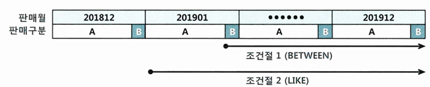{: w="30%"}
*A가 90%, B가 10% 비중인 경우*

* 조건절1은 판매월 '201901', 판매구분 = 'B'인 첫 번째 레코드에서 스캔 시작
* 조건절2는 판매월 '201901'인 첫 번쨰 레코드에서 스캔 시작
    * 만약 '201900'이 있다면, 거기서부터 시작

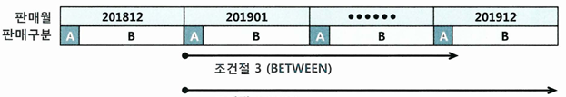{: w="30%"}
*A가 10%, B가 90% 비중인 경우*

* 조건절3은 판매월 '201912', 판매구분 = 'B'인 첫 번째 레코드를 만나는 순간 스캔 멈춤
* 조건절4는 판매월 '201912'인 레코드를 모두 스캔하고나서야 멈춤
    * 만약 '201913'이 있다면, 그 값도 읽어야 함

## 범위검색 조건을 남용할 때 생기는 비효율
* 조건절을 LIKE을 사용할 때, 해당 컬럼이 인덱스 구성 컬럼일 때는 주의가 필요
* 예시
    * 회사코드, 지역코드, 상품명 등을 입력함으로써 '가입상품'테이블에서 데이터를 조회
        * 조회 화면에서 회사코드는 반드시 입력하지만, 지역코드는 입력하지 않을 수 있음
        * 상품명은 단어 중 일부만 입력할 수 있음
        * 인덱스를 (회사코드 + 지역코드 + 상품명)으로 구성

    ```sql
    -- 아래 두 쿼리 중 하나를 선택적으로 사용
    -- 회사코드, 지역코드, 상품명을 모두 입력할 때
    SELECT 고객ID, 상품명, 지역코드, ...
    FROM   가입상품
    WHERE  회사코드 = :com
    AND    지역코드 = :reg
    AND    상품명 LIKE :prod || '%'

    -- 회사코드, 상품명만 입력할 때
    SELECT 고객ID, 상품명, 지역코드, ...
    FROM   가입상품
    WHERE  회사코드 = :com
    AND    상품명 LIKE :prod || '%'
    ```

    * 회사코드, 지역코드, 상품명에 'C70', '02', '보급'을 입력하고 조회했을 때와 지역코드를 입력하지 않았을 때 인덱스 스캔 범위

    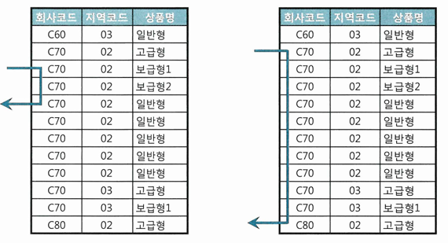{: w="30%"}

    * 중간 컬럼에 대한 조건이 있으면, 세 컬럼 모두 엑세스 조건이므로 조건이 없을 때 대비 아주 적은 범위만 스캔하고 빠르게 결과 출력 가능

    ```sql
    -- 두 상황을 SQL 하나로 처리하려고 이렇게 바꾼다면?
    SELECT 고객ID, 상품명, 지역코드, ...
    FROM   가입상품
    WHERE  회사코드 = :com
    AND    지역코드 LIKE :reg || '%'
    AND    상품명 LIKE :prod || '%'
    ```

    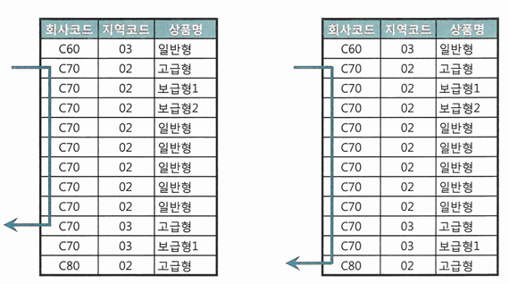{: w="30%"}

    * 지역코드를 입력하지 않은 경우는 동일하나, 지역코드를 입력한 경우에는 인덱스 스캔 범위가 늘어남
        * 엑세스 조건이던 상품명이 필터 조건으로 바뀌어 버림
* 조건절은 모두 BETWEEN으로 처리하는 경우
    * 인덱스 스캔 효율을 생각하면 사용을 자제해야 함

```sql
SELECT 거래일자, 종목코드, 투자자유형코드
     , 주문매체코드, 체결건수, 체결수량, 거래대금
FROM   일별종목거래
WHERE  거래일자 BETWEEN :시작일자 AND :종료일자  -- 필수 조건
AND    종목코드 BETWEEN :종목1 AND :종목2        -- 옵션 조건
AND    투자자유형코드 BETWEEN :투자자유형1 AND :투자자유형2  -- 옵션 조건
AND    주문매체구분코드 BETWEEN :주문매체구분1 AND :주문매체구분2 -- 옵션 조건
```

## 다양한 옵션 조건 처리 방식의 장단점 비교
### OR 조건 활용
```sql
select * from 거래
where (:cust_id is null or 고객ID = :cust_id)
and    거래일자 between :dt1 and :dt2

Execution Plan
------------------------------------------------------------
0      SELECT STATEMENT Optimizer=ALL_ROWS
1    0   TABLE ACCESS (FULL) OF '거래' (TABLE)
```
* 옵션 조건 컬럼을 선두에 두고 (고객ID + 거래일자) 순으로 인덱스를 구성해도 이를 사용할 수 없음
    * 옵티마이저에 의한 OR Expansion 쿼리 변환이 기본적으로 작동하지 않으므로
* **인덱스 선두 컬럼에 대한 옵션 조건에 OR 사용하면 안 됨**
* (거래일자 + 고객ID) 인덱스는 사용 가능
    * 고객ID를 필터 조건으로 사용하는 것이 문제
        * 인덱스 스캔 단게에서 필터링해도 비효율적인데, 테이블 엑세스 단계에서 필터링함
        * 거래일자 BETWEEN 조건을 찾기 위해 인덱스에서 100만건을 스캔하면, 그만큼 테이블을 랜덤 엑세스한 후에 고객ID를 필터링함
            * OR 옵션 조건으로 처리한 고객ID를 인덱스에 포함할 필요가 없음

```sql
Execution Plan
------------------------------------------------------------
0      SELECT STATEMENT Optimizer=ALL_ROWS
1    0   FILTER
2    1     TABLE ACCESS (BY INDEX ROWID) OF '거래' (TABLE)
3    2       INDEX (RANGE SCAN) OF '거래_IDX3' (INDEX)

Predicate information (identified by operation id):
---------------------------------------------------
   1 - filter(TO_DATE(:DT1)<=TO_DATE(:DT2))
   2 - filter(:CUST_ID IS NULL OR "고객ID"=TO_NUMBER(:CUST_ID))
   3 - access("거래일자">=:DT1 AND "거래일자"<=:DT2)
```

* OR 조건을 활용한 옵션 조건 처리 정리
    * 인덱스 엑세스 조건으로 사용 불가
    * 인덱스 필터 조건으로 사용 불가
    * 테이블 필터 조건으로만 사용 가능
    * 단, 인덱스 구성 컬럼 중 하나 이상이 Not Null컬럼이면, 18c부터 인덱스 필터 조건으로 사용 가능
* OR 조건을 이용한 옵션 조건 처리는 가급적 사용하지 않아야 함
    * 옵션 조건 컬럼이 NULL 허용 컬럼이더라도 결과집합을 보장한다는 것이 유일한 장점
        * 다른 방식들은 UNION ALL을 제외하면 모두 NULL 허용 컬럼에 사용할 수 없음
* 아래와 같은 형태의 OR 조건절에는 OR-Expansion을 통해 인덱스 사용 가능

```sql
select * from 거래
where 고객ID = :cust_id
and   ((:dt_type = 'A' AND 거래일자 between :dt1 and :dt2)
       or
       (:dt_type = 'B' AND 결제일자 between :dt1 and :dt2))

-- Execution Plan
---------------------------------------------------------------------------------------
0      SELECT STATEMENT Optimizer=ALL_ROWS
1    0   CONCATENATION
2    1     FILTER
3    2       TABLE ACCESS (BY LOCAL INDEX ROWID) OF '거래' (TABLE)
4    3         INDEX (RANGE SCAN) OF '거래_IDX1' (INDEX)  -- 고객ID + 거래일자
5    1     FILTER
6    5       TABLE ACCESS (BY LOCAL INDEX ROWID) OF '거래' (TABLE)
7    6         INDEX (RANGE SCAN) OF '거래_IDX2' (INDEX)  -- 고객ID + 결제일자
```

### LIKE/BETWEEN 조건 활용
* 필수 조건 컬럼을 인덱스 선두에 두고 엑세스 조건으로 사용하면, LIKE/BETWEEN이 인덱스 필터 조건이어도 좋은 성능을 낼 수 있음
    * 필수 조건이 아래와 같이 '='이면 옵션 조건인 상품분류코드까지도 인덱스 엑세스 조건이므로 최적의 성능을 낼 수 있음

```sql
-- 인덱스 : 등록일시 + 상품분류코드
select * from 상품
where  등록일시 >= trunc(sysdate)      -- 필수 조건(당일 등록 상품)
and    상품분류코드 like :prd_cls_cd || '%' -- 옵션 조건

-- 인덱스 : 상품명 + 상품분류코드
select * from 상품
where  상품명 = :prd_nm                -- 필수 조건
and    상품분류코드 like :prd_cls_cd || '%' -- 옵션 조건
```

* 필수 조건의 변별력이 좋지 않을 때 문제 발생
    * 아래에서 상품대분류코드만으로 조회할 때는 Table Full Scan이 유리
    * 옵티마이저는 상품코드까지 입력할 때를 기준으로 Index Range Scan 선택
        * 사용자가 상품코드까지 입력하지 않으면 문제 발생

```sql
-- 인덱스 : 상품대분류코드 + 상품코드
select * from 상품
where  상품대분류코드 = :prd_lcls_cd  -- 필수 조건
and    상품코드 like :prd_cd || '%'  -- 옵션 조건
```

* LIKE/BETWEEN 사용시 점검할 사항
    * 인덱스 선두 컬럼에 대한 옵션 조건을 LIKE/BETWEEN으로 처리하는 것은 금물
        * 사용자가 고객ID를 입력하면, 둘 다 범위 검색 조건이어서 인덱스 스캔 과정에 약간 비효율이 있더라도 고객ID가 변별력이 매우 좋기 때문에 비교적 빠르게 조회
        * 고객ID를 입력하지 않으면, 인덱스에서 '모든' 거래 데이터를 스캔하면서 거래일자 조건을 필터링함

        ```sql
        -- 인덱스가 (고객ID + 거래일자) 일 때
        select * from 거래
        where  고객ID like :cust_id || '%'
        and    거래일자 between :dt1 and :dt2
        ```

        * 옵션 조건 처리를 위와 같이 하려면, 인덱스를 (거래일자 + 고객ID) 순으로 구성해야
            * 고객ID 값을 입력할 때 생기는 비효율 감수
                * 특정 고객의 거래를 조회하고 싶을 때, 거래일자 범위에 속한 모든 거래 데이터를 스캔한 후 고객ID로 필터링
    * NULL 허용 컬럼에 대한 옵션 조건을 LIKE/BETWEEN으로 처리하는 것은 금물
        * 성능을 떠나 결과집합에 오류 발생

        ```sql
        select * from 거래
        where  고객ID like '%'
        and    거래일자 between :dt1 and :dt2
        ```

        * 거래일자 조건에 해당하는 모든 고객의 거래를 선택해야 하는 상황
            * 고객ID가 NULL 허용컬럼이고 실제 NULL이 입력돼 있다면 그 데이터는 결과집합에서 누락
            * BETWEEN도 마찬가지
    * 숫자형이면서 인덱스 엑세스 조건으로도 사용 가능한 컬럼에 대한 옵션 조건 처리는 LIKE를 사용하면 안 됨
        * 인덱스를 (거래일자 + 고객ID)순으로 구성

        ```sql
        select * from 거래
        where  거래일자 = :trd_dt
        and    고객ID like :cust_id || '%'

        -- 자동 형변환이 일어남
        select * from 거래
        where  거래일자 = :trd_dt
        and    to_char(고객ID) like :cust_id || '%'
        ```

        * 고객ID가 숫자형 컬럼이면, 자동 형변환이 일어나 고객ID를 필터 조건으로 사용하게 됨
            * 특정 고객의 하루 치 거래를 조회하고 싶은데, 하루 치 거래를 모두 스캔하면서 고객ID 조건을 필터링함
    * LIKE를 옵션 조건에 사용할 때는 컬럼 값 길이가 고정적이어야 함

    ```sql
    -- '김훈'을 입력했을 때 '김훈남' 고객도 같이 조회되는 경우
    where 고객명 like :cust_nm || '%'  -- :cust_nm = '김훈'

    -- 컬럼 값 길이가 가변적일 때는 변수 값 길이가 같은 레코드만 조회되도록 아래와 같이 조건절을 추가
    where 고객명 like :cust_nm || '%'  -- :cust_nm = '김훈'
    and   length(고객명) = length(nvl(:cust_nm, 고객명))

    -- %없는 LIKE 조건이므로 입력값과 정확히 일치하는 고객명만 출력
    where 고객명 like :cust_nm    -- 고객명을 입력하지 않을 때 :cust_nm에 '%' 입력
    ```

### UNION ALL 활용
```sql
select * from 거래
where :cust_id is null
and   거래일자 between :dt1 and :dt2
union all
select * from 거래
where :cust_id is not null
and   고객ID = :cust_id
and   거래일자 between :dt1 and :dt2

Execution Plan
---------------------------------------------------------------------------------------
0      SELECT STATEMENT Optimizer=ALL_ROWS
1    0   UNION ALL
2    1     FILTER    -- :cust_id is null
3    2       TABLE ACCESS (BY LOCAL INDEX ROWID) OF '거래' (TABLE)
4    3         INDEX (RANGE SCAN) OF '거래_IDX1' (INDEX)  -- 거래일자
5    1     FILTER    -- :cust_id is not null
6    5       TABLE ACCESS (BY LOCAL INDEX ROWID) OF '거래' (TABLE)
7    6         INDEX (RANGE SCAN) OF '거래_IDX2' (INDEX)  -- 고객ID + 거래일자
```

* 위와 같은 패턴을 이용하면, 인덱스를 가장 최적으로 사용 가능
    * 위쪽 브랜치에서는 거래일자, 아래쪽 브랜치는 고객ID와 거래일자 모두 엑세스 조건으로 사용하기 때문
* LIKE 패턴도 인덱스 사용은 가능하지만 필수 조건인 거래일자가 BETWEEN이면 옵션 조건 컬럼을 필터 조건으로 사용
    * UNION ALL은 옵션 조건 컬럼도 인덱스 엑세스 조건으로 사용
    * 고객ID가 NULL 허용 컬럼이더라도 문제 없음

### NVL/DECODE 함수 활용
```sql
select * from 거래
where 고객ID = nvl(:cust_id, 고객ID)
and   거래일자 between :dt1 and :dt2

select * from 거래
where 고객ID = decode(:cust_id, null, 고객ID, :cust_id)
and   거래일자 between :dt1 and :dt2

Execution Plan
---------------------------------------------------------------------------------------
0      SELECT STATEMENT Optimizer=ALL_ROWS
1    0   CONCATENATION
2    1     FILTER    -- :cust_id is null
3    2       TABLE ACCESS (BY LOCAL INDEX ROWID) OF '거래' (TABLE)
4    3         INDEX (RANGE SCAN) OF '거래_IDX1' (INDEX)  -- 거래일자
5    1     FILTER    -- :cust_id is not null
6    5       TABLE ACCESS (BY LOCAL INDEX ROWID) OF '거래' (TABLE)
7    6         INDEX (RANGE SCAN) OF '거래_IDX2' (INDEX)  -- 고객ID + 거래일자
```

* :cust_id 변수에 값을 입력하지 않으면 위쪽 브랜치에 거래일자가 선두인 컬럼을, 값을 입력하면 아래쪽 브랜치에서 (고객ID + 거래일자) 인덱스를 사용
* 고객ID 컬럼을 함수 인자로 사용했는데도, OR Expansion 쿼리 변환이 일어나 인덱스를 사용 가능
    * UNION ALL 방식으로 옵티마이저가 쿼리 변환
    * 이 기능이 작동하지 않으면 NVL, DECODE 함수를 사용하는 패턴도 인덱스 엑세스 조건으로 사용이 불가능
        * :cust_id에 값을 입력하지 않으면 조건절이 '고객ID = 고객ID'형태가 되므로 인덱스에서 이 조건을 만족하는 어느 한 시작점을 찾을 수 없음
* 옵션 조건 컬럼을 인덱스 엑세스 조건으로 사용할 수 있다는 장점
    * UNION ALL보다 단순하면서 같은 성능
* LIKE처럼 NULL 허용 컬럼에 사용할 수 없음
    * 조건절 변수에 NULL을 입력하면 NULL인 레코드가 결과집합에서 누락
* 옵션 조건 처리용 NVL/DECODE 함수를 여러 개 사용하면 그중 변별력이 가장 좋은 컬럼 기준으로 한 번만 OR Expansion이 일어남
    * OR Expansion 기준으로 선택되지 않으면 인덱스 구성 컬럼이어도 모두 필터 조건으로 처리됨

## 함수호출부하 해소를 위한 인덱스 구성
* PL/SQL 사용자 정의 함수는 매우 느림
    * 가상머신(VM) 상에서 실행되는 인터프리터 언어
        * PL/SQL로 작성한 함수와 프로시저를 컴파일하면 바이트코드를 생성해 데이터 딕셔너리에 저장
        * PL/SQL 엔진(가상머신)만 있으면 어디든 실행 가능
    * 호출 시마다 컨텍스트 스위칭 발생
        * PL/SQL 함수 실행 시 매번 SQL 실행엔진과 PL/SQL 가상머신 사이에 컨텍스트 스위칭 발생
    * 내장 SQL에 대한 Recursive Call 발생
        * 성능 병목의 가장 핵심적인 요인
* 조인문으로 처리할 수 있으면, 조인으로 처리하는 것이 좋음

### 효과적인 인덱스 구성을 통한 함수호출 최소화
```sql
-- 회원 테이블 Full Scan
-- encryption 함수는 테이블 건수만큼 수행
select /*+ full(a) */ 회원번호, 회원명, 생년, 생월일, 등록일자
from   회원 a
where  암호화된_전화번호 = encryption( :phone_no )

-- encryption 함수는 조건절을 만족하는 건수만큼 수행
select /*+ full(a) */ 회원번호, 회원명, 생년, 생월일, 등록일자
from   회원 a
where  생년 = '1987'
and    암호화된_전화번호 = encryption( :phone_no )
```

```sql
-- 인덱스 생성
create index 회원_X01 on 회원(생년);
create index 회원_X02 on 회원(생년, 생월일, 암호화된_전화번호);
create index 회원_X03 on 회원(생년, 암호화된_전화번호);
```

* 회원_X01 인덱스를 사용하면, 암호화된_전화번호 조건절을 테이블 엑세스 단계에서 필터링
    * encryption 함수는 테이블 엑세스 횟수, 생년 조건을 만족하는 건수만큼 수행

```sql
select /*+ index(a 회원_x01) */ 회원번호, 회원명, 생년, 생월일, 등록일자
from   회원 a
where  생년 = '1987'
and    암호화된_전화번호 = encryption( :phone_no )

Execution Plan
---------------------------------------------------------------------------------------
0      SELECT STATEMENT Optimizer=ALL_ROWS (Cost=1 Card=1 Bytes=156)
1    0   TABLE ACCESS (BY INDEX ROWID BATCHED) OF '회원' (TABLE) (Cost=1 ... )
2    1     INDEX (RANGE SCAN) OF '회원_X01' (INDEX) (Cost=1 Card=1)

Predicate information (identified by operation id):
---------------------------------------------------
   1 - filter("암호화된_전화번호"="ENCRYPTION"(:PHONE_NO))
   2 - access("생년"='1987')
```

* 회원_X02 인덱스를 사용하면, 암호화된_전화번호는 선행 컬럼인 생월일에 대한 '=' 조건이 없으므로 인덱스 필터 조건
    * encryption 함수는 인덱스 스캔 횟수, 생년 조건을 만족하는 건수만큼 수행

```sql
select /*+ index(a 회원_x02) */ 회원번호, 회원명, 생년, 생월일, 등록일자
from   회원 a
where  생년 = '1987'
and    암호화된_전화번호 = encryption( :phone_no )

Execution Plan
---------------------------------------------------------------------------------------
0      SELECT STATEMENT Optimizer=ALL_ROWS (Cost=1 Card=1 Bytes=156)
1    0   TABLE ACCESS (BY INDEX ROWID BATCHED) OF '회원' (TABLE) (Cost=1 ... )
2    1     INDEX (RANGE SCAN) OF '회원_X02' (INDEX) (Cost=2 Card=1)

Predicate information (identified by operation id):
---------------------------------------------------
   2 - access("생년"='1987' AND "암호화된_전화번호"="ENCRYPTION"(:PHONE_NO))
   2 - filter("암호화된_전화번호"="ENCRYPTION"(:PHONE_NO))
```

* 회원_X03 인덱스를 사용하면, 암호화된_전화번호도 생년과 함께 인덱스 엑세스 조건으로 사용
    * encryption 함수는 단 한 번 수행

```sql
select /*+ index(a 회원_x03) */ 회원번호, 회원명, 생년, 생월일, 등록일자
from   회원 a
where  생년 = '1987'
and    암호화된_전화번호 = encryption( :phone_no )

Execution Plan
---------------------------------------------------------------------------------------
0      SELECT STATEMENT Optimizer=ALL_ROWS (Cost=2 Card=1 Bytes=156)
1    0   TABLE ACCESS (BY INDEX ROWID BATCHED) OF '회원' (TABLE) (Cost=2 ... )
2    1     INDEX (RANGE SCAN) OF '회원_X03' (INDEX) (Cost=1 Card=1)

Predicate information (identified by operation id):
---------------------------------------------------
   2 - access("생년"='1987' AND "암호화된_전화번호"="ENCRYPTION"(:PHONE_NO))
```