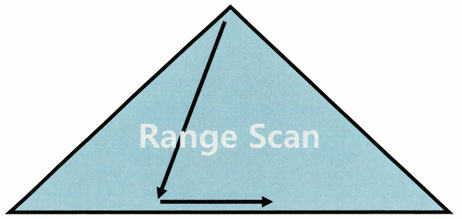
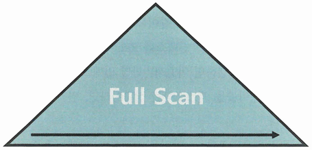
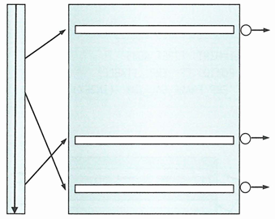
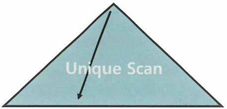

# 인덱스 확장기능 사용법
## Index Range Scan
* 인덱스 루트에서 리프 블록까지 수직적으로 탐색한 후, **필요한 범위(Range)만** 스캔

{: w="30%"}
*Index Range Scan*

```sql
Execution Plan
------------------
0   SELECT STATEMENT Optimizer=ALL_ROWS
1   0   TABLE ACCESS (BY INDEX ROWID) OF 'EMP' (TABLE)
2   1   INDEX (RANGE SCAN) OF 'EMP_DEPTNO_IDX' (INDEX)
```

* 인덱스를 Range Scan 하려면 선두 컬럼을 가공하지 않은 상태로 조건절에 사용해야 함
    * 단, Range Scan을 한다고 무조건 성능이 좋은 것은 아님

## Index Full Scan
* **수직적 탐색 없이 인덱스 리프 블록을 처음부터 끝까지 수평적으로 탐색**

{: w="30%"}
*Index Full Scan*

```sql
CREATE INDEX EMP_ENAME_SAL_IDX ON EMP (ENAME, SAL);

SELECT *
FROM EMP
WHERE SAL > 2000
ORDER BY ENAME;

Execution Plan
------------------
0   SELECT STATEMENT Optimizer=ALL_ROWS
1   0   TABLE ACCESS (BY INDEX ROWID) OF 'EMP' (TABLE)
2   1   INDEX (FULL SCAN) OF 'EMP_ENAME_SAL_IDX' (INDEX)
```

* 데이터 검색을 위한 최적의 인덱스가 없을 때 차선으로 선택
    * 선두 컬럼인 ENAME이 조건절에 없으므로 Range Scan 불가능
    * SAL 컬럼이 인덱스에 있어, Index Full Scan을 통해 SAL이 2000보다 큰 레코드를 찾음

### Index Full Scan의 효용성
* 선두 컬럼이 조건절에 없으면 옵티마이저는 Table Full Scan을 고려
    * 근데 대용량 테이블이라 Table Full Scan의 부담이 클 경우
    * 옵티마이저는 인덱스 활용을 고려할 수 밖에 없음
* 인덱스가 차지하는 데이터 크기는 테이블보다 훨씬 적음
    * 데이터 저장공간은 '컬럼 길이 x 레코드 수' 이기 때문
* 부연설명
    * Oracle은 Block 단위로 I/O를 진행함
        * 블록이 8kB, 인덱스 레코드의 크기가 20Byte, 테이블 레코드의 크기가 200Byte인 경우
        * 인덱스를 풀스캔하면 한 번의 I/O에서 테이블을 풀스캔 했을 때에 비해 10배의 데이터를 읽을 수 있음

    
    ```sql
    SELECT *
    FROM EMP
    WHERE SAL > 9000
    ORDER BY ENAME
    ```

    * 만약 위 조건을 만족하는 사원이 극히 일부라면, Table Full Scan보다 Index Full Scan을 통한 필터링이 효과적
        * 다만, 적절한 인덱스가 없어서 Index Range Scan의 차선책으로 선택한 것
        * 수행빈도가 높은 SQL이라면, 적절한 인덱스를 생성해주는 것이 좋음

{: w="35%"}

### 인덱스를 이용한 소트 연산 생략
* 인덱스를 Full Scan하면 Range Scan과 마찬가지로 결과집합이 인덱스 컬럼 순으로 정렬
    * Sort Order By 생략 가능

```sql
SELECT /*+ FIRST_RWOS */
FROM EMP
WHERE SAL > 1000
ORDER BY ENAME
```

* 위 쿼리는 거의 모든 레코드에 대한 테이블 엑세스가 발생하므로 Table Full Scan이 유리
    * 그러나 FIRST_ROWS 힌트 존재
    * 소트 연산을 생략해 전체 집합 중 처음 일부를 빠르게 출력할 목적으로 Index Full Scan 선택
        * 부분범위 처리가 가능한 상황에서 극적인 성능 개선 효과
* 사용자가 처음 의도(부분범위 처리 활용)와 달리 fetch를 멈추지 않고 데이터를 끝까지 읽는다면 Table Full Scan보다 훨씬 더 많은 I/O 발생

## Index Unique Scan
* 수직적 탐색만으로 데이터를 찾는 스캔
    * **Unique 인덱스를 '=' 조건으로 탐색**하는 경우 작동

{: w="30%"}
*Index Unique Scan*

* Unique 인덱스에 존재하는 컬럼은 중복 값이 입력되지 않게 DBMS가 정합성을 관리
    * 해당 인덱스 키 컬럼을 모두 '='으로 검색할 때는 데이터 한 건 찾는 순간 더 이상 탐색할 필요 없음
* Unique 인덱스에 대한 범위검색 조건이나, 일부 컬럼만으로 검색할 때는 Index Range Scan

## Index Skip Scan
