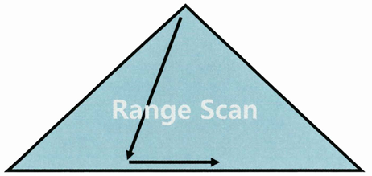
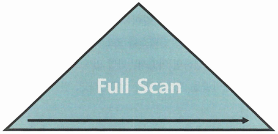
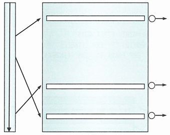
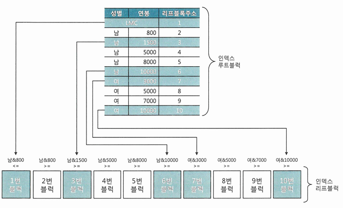
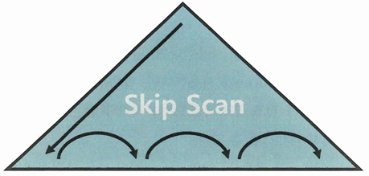
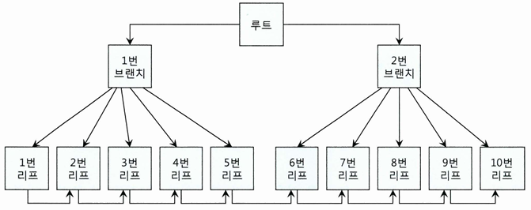
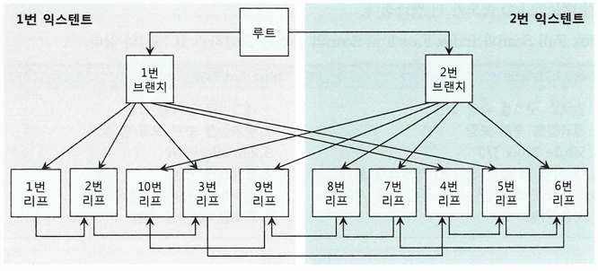
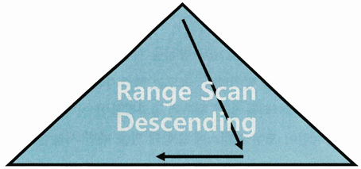

# 인덱스 확장기능 사용법
## Index Range Scan
* 인덱스 루트에서 리프 블록까지 수직적으로 탐색한 후, **필요한 범위(Range)만** 스캔

{: w="30%"}
*Index Range Scan*

```sql
Execution Plan
------------------
0   SELECT STATEMENT Optimizer=ALL_ROWS
1   0   TABLE ACCESS (BY INDEX ROWID) OF 'EMP' (TABLE)
2   1   INDEX (RANGE SCAN) OF 'EMP_DEPTNO_IDX' (INDEX)
```

* 인덱스를 Range Scan 하려면 선두 컬럼을 가공하지 않은 상태로 조건절에 사용해야 함
    * 단, Range Scan을 한다고 무조건 성능이 좋은 것은 아님

## Index Full Scan
* **수직적 탐색 없이 인덱스 리프 블록을 처음부터 끝까지 수평적으로 탐색**

{: w="30%"}
*Index Full Scan*

```sql
CREATE INDEX EMP_ENAME_SAL_IDX ON EMP (ENAME, SAL);

SELECT *
FROM EMP
WHERE SAL > 2000
ORDER BY ENAME;

Execution Plan
------------------
0   SELECT STATEMENT Optimizer=ALL_ROWS
1   0   TABLE ACCESS (BY INDEX ROWID) OF 'EMP' (TABLE)
2   1   INDEX (FULL SCAN) OF 'EMP_ENAME_SAL_IDX' (INDEX)
```

* 데이터 검색을 위한 최적의 인덱스가 없을 때 차선으로 선택
    * 선두 컬럼인 ENAME이 조건절에 없으므로 Range Scan 불가능
    * SAL 컬럼이 인덱스에 있어, Index Full Scan을 통해 SAL이 2000보다 큰 레코드를 찾음

### Index Full Scan의 효용성
* 선두 컬럼이 조건절에 없으면 옵티마이저는 Table Full Scan을 고려
    * 근데 대용량 테이블이라 Table Full Scan의 부담이 클 경우
    * 옵티마이저는 인덱스 활용을 고려할 수 밖에 없음
* 인덱스가 차지하는 데이터 크기는 테이블보다 훨씬 적음
    * 데이터 저장공간은 '컬럼 길이 x 레코드 수' 이기 때문
* 부연설명
    * Oracle은 Block 단위로 I/O를 진행함
        * 블록이 8kB, 인덱스 레코드의 크기가 20Byte, 테이블 레코드의 크기가 200Byte인 경우
        * 인덱스를 풀스캔하면 한 번의 I/O에서 테이블을 풀스캔 했을 때에 비해 10배의 데이터를 읽을 수 있음

    
    ```sql
    SELECT *
    FROM EMP
    WHERE SAL > 9000
    ORDER BY ENAME
    ```

    * 만약 위 조건을 만족하는 사원이 극히 일부라면, Table Full Scan보다 Index Full Scan을 통한 필터링이 효과적
        * 다만, 적절한 인덱스가 없어서 Index Range Scan의 차선책으로 선택한 것
        * 수행빈도가 높은 SQL이라면, 적절한 인덱스를 생성해주는 것이 좋음

{: w="35%"}

### 인덱스를 이용한 소트 연산 생략
* 인덱스를 Full Scan하면 Range Scan과 마찬가지로 결과집합이 인덱스 컬럼 순으로 정렬
    * Sort Order By 생략 가능

```sql
SELECT /*+ FIRST_RWOS */
FROM EMP
WHERE SAL > 1000
ORDER BY ENAME
```

* 위 쿼리는 거의 모든 레코드에 대한 테이블 엑세스가 발생하므로 Table Full Scan이 유리
    * 그러나 FIRST_ROWS 힌트 존재
    * 소트 연산을 생략해 전체 집합 중 처음 일부를 빠르게 출력할 목적으로 Index Full Scan 선택
        * 부분범위 처리가 가능한 상황에서 극적인 성능 개선 효과
* 사용자가 처음 의도(부분범위 처리 활용)와 달리 fetch를 멈추지 않고 데이터를 끝까지 읽는다면 Table Full Scan보다 훨씬 더 많은 I/O 발생

## Index Unique Scan
* 수직적 탐색만으로 데이터를 찾는 스캔
    * **Unique 인덱스를 '=' 조건으로 탐색**하는 경우 작동

{: w="30%"}
*Index Unique Scan*

* Unique 인덱스에 존재하는 컬럼은 중복 값이 입력되지 않게 DBMS가 정합성을 관리
    * 해당 인덱스 키 컬럼을 모두 '='으로 검색할 때는 데이터 한 건 찾는 순간 더 이상 탐색할 필요 없음
* Unique 인덱스에 대한 범위검색 조건이나, 일부 컬럼만으로 검색할 때는 Index Range Scan

## Index Skip Scan
* 인덱스 선두 컬럼을 조건절에 사용하지 않으면 옵티마이저는 기본적으로 Table Full Scan
    * Table Full Scan보다 I/O를 줄일 수 있거나 정렬된 결과를 쉽게 얻을 수 있다면 Index Full Scan
* 인덱스 선두 컬럼이 조건절에 없어도 인덱스를 활용하는 스캔 방식인 Index Skip Scan
    * 조건절에 빠진 *인덱스 선투 컬럼의 Dinstinct Value 개수가 적고 후행 컬럼의 Distinct Value 개수가 많을 때 유용*

{: w="40%"}

```sql
-- 성별과 연봉 컬럼에 대한 조건식을 모두 사용했을 때
SELECT * FROM 사원 WHERE 성별 = '남' AND 연봉 BETWEEN 2000 AND 4000
```

* 성별 = '남'이면서 연봉 >= 2000인 첫 번째 레코드 찾음
    * 루트 블록 네 번째 레코드가 가리키는 4번 리프 블록으로 찾아가면, 성별='남'이면서 연봉 >= 5000인 레코드를 만나게 되므로 바로 직전에 위치한 세 번째 레코드가 가리키는 3번 리프 블록으로
* 3번 리프 블록에서 성별='남'이면서 연봉 >= 2000인 첫 번째 레코드를 만났다면, 거기서부터 리프 블록을 차례로 스캔하다 성별='남'이면서 연봉 > 4000인 첫 번째 레코드를 만나는 순간 스캔 멈춤


```sql
-- Index Skip Scan 유도/방지하려고 할 때
-- index_ss, no_index_ss 힌트
SELECT /*+ INDEX_SS(사원 사원_IDX) */
FROM 사원
WHERE 연봉 BETWEEN 2000 AND 4000;

Execution Plan
------------------------------------------------------
0   SELECT STATEMENT Optimzer=ALL_ROWS
1   0   TABLE ACCESS (BY INDEX ROWID) OF '사원' (TABLE)
2   1       INDEX (SKIP SCAN) OF '사원_IDX' (INDEX)
```

* Index Skip Scan은 루트 또는 브랜치 블록에서 읽은 컬럼 값 정보를 이용해 조건절에 부합하는 레코드를 포함할 *가능성이 있는* 리프 블록만 골라서 엑세스
    * 인덱스 루트 블록에서 첫 번째 레코드가 가리키는 리프 블록은 (남, 800) 이하인 레코드
        * 엑세스할 필요 없음
        * '남'보다 작은 성별이 존재한다면, 그 사원에 대한 인덱스 레코드는 모두 1번 리프 블록에 저장되므로 엑세스 해야 함
            * 우리는 성별이 2가지 값 뿐인 걸 알지만 옵티마이저는 모름
    * 두 번째 레코드가 가리키는 리프 블록은 (남, 800) 이상 (남, 1500) 이하인 레코드
        * 2000 <= 연봉 <= 4000 인 값이 존재할 가능성이 없으므로 Skip
    * 세 번째 레코드가 가리키는 리프 블록은 (남, 1500) 이상 (남, 5000) 이하인 레코드
        * 엑세스
    * 네 번째 레코드가 가리키는 리프 블록은 (남, 5000) 이상 (남, 8000) 이하인 레코드
        * Skip
        * 다섯 번째 리프 블록도 Skip
    * 여섯 번째 리프 블록
        * (남, 10000) 이상이므로 2000 <= 연봉 <= 4000 구간 초과
        * 그러나 **엑세스 해야 함**
            * 여자 중에서 연봉 < 3000 이거나 '남'과 '여' 사이에 다른 성별이 존재한다면 이 리프 블록에 저장
            * 연봉 = 3000 인 여자 직원도 일부 저장될 수 있음
    * 일곱 번째 리프 블록은 엑세스, 여덟 번째와 아홉 번째 레코드가 가리키는 리프 블록은 Skip
    * 열 번째 리프 블록은 (여, 10000) 이상
        * 연봉 구간은 조건 초과
        * '여'보다 값이 큰 미지의 성별 값이 존재한다면 모두 저장될 것이므로 엑세스

{: w="30%"}
*Index Skip Scan*

### Index Skip Scan이 작동하기 위한 조건
* Distinct Value 개수가 적은 선두 컬럼이 조건절에 없고 후행 컬럼의 Distinct Value가 많을 때 효과적
* 하지만 인덱스 선두 컬럼이 없을 때만 Index Skip Scan이 작동하는 것은 아님
    * 인덱스 구성이 (업종유형코드 + 업종코드 + 기준일자)

    ```sql
    -- 선두 컬럼에 대한 조건절은 있고, 중간 컬럼에 대한 조건일 없는 경우에도 Skip Scan 사용 가능
    SELECT /*+ INDEX_SS(A 일별업종별거래_PK) */
    FROM 일별업종별거래 A
    WHERE 업종유형코드 = '01'
    AND 기준일자 BETWEEN '20080501' AND '20080531'

    Execution Plan
    ----------
    0   SELECT STATEMENT Optimizer=ALL_ROWS (Cost=91 Card=7 Bytes=245)
    1   0    TABLE ACCESS (BY LOCAL INDEX ROWID) OF '일별업종별거래' (TABLE) (Cost=91 ...)
    2   1       INDEX (SKIP SCAN) OF '일별업종별거래_PK' (INDEX (UNIQUE)) (Cost=102 ...)
    ```

    * 위 SQL에서 Index Range Scan을 사용한다면, 업종유형코드 = '01'인 인덱스 구간을 *모두* 스캔
    * Index Skip Scan을 사용한다면, 업종유형코드 = '01'인 구간에서 기준일자가 '20080501'보다 크거나 같고 '20080531'보다 작거나 같은 레코드를 *포함할 가능성이 있는 리프 블록만* 골라서 스캔
* 선두 컬럼이 부등호, BETWEEN, LIKE 같은 범위검색 조건일 때도 Index Skip Scan 사용 가능
    * (기준일자, 업종유형코드)인 인덱스가 있을 경우

    ```sql
    SELECT /*+ INDEX_SS(A 일별업종별거래_X01) */
    FROM 일별업종별거래 A
    WHERE 기준일자 BETWEEN '20080501' AND '20080531'
    AND 업종유형코드 = '01'
    ```

    * Index Range Scan을 사용한다면, 기준일자 BETWEEN 조건을 만족하는 인덱스 구간을 *모두* 스캔
    * Index Skip Scan을 사용한다면, 기준일자 BETWEEN 조건을 만족하는 인덱스 구간에서 업종유형코드 = '01'인 레코드를 *포함할 가능성이 있는 리프 블록만*만 엑세스
* Index Range Scan이 불가능하거나 효율적이지 못한 상황에서 Index Skip Scan이 유용한 경우가 있음
    * 부분범위 처리가 가능하다면 Index Full Scan이 도움이 됨
* 하지만 인덱스는 기본적으로 최적의 Index Range Scan을 목표로 설계해야 함
    * 수행 횟수가 적은 SQL을 위해 인덱스를 추가하는 것이 비효율적일 때 차선책으로 활용

## Index Fast Full Scan
* 인덱스 트리 구조를 무시하고 인덱스 세그먼트 전체를 Multiblock I/O 방식으로 스캔
    * Index Full Scan보다 빠름
    * index_ffs, no_index_ffs

{: w="50%"}
*인덱스의 논리적 연결 구조*

{: w="50%"}
*인덱스의 물리적 연결 구조*

* Index Full Scan
    * 인덱스의 논리적 구조를 따라감
        * 루트 - 브랜치1 - 1 - 2 - 3 - 4 - 5- 6 - 7 - 8 - 9 - 10
* Index Fast Full Scan
    * 물리적으로 디스크에 저장된 순서대로 인덱스 리프 블록들을 읽음
        * Multiblock I/O 방식으로 왼쪽 익스텐트에서 1 - 2 - 10 - 3 - 9
            * 읽어야 할 익스텐트 목록을 익스텐트 맵에서 얻음(Table Full Scan과 동일)
        * 이어서 오른쪽 익스텐트에서 8 - 7 - 4 - 5 - 6
        * 루트와 두 개의 브랜치 블록도 읽지만, 필요 없는 블록이므로 버림
* Index Full Scan은 Multiblock I/O 방식을 사용하므로 디스크로부터 대량의 인덱스 블록을 읽어야 할 때 유리
    * 인덱스 리프 노드가 갖는 연결 리스트 구조를 무시한 채 데이터를 읽기 때문에 결과집합이 인덱스 키 순서대로 정렬되지 않음
    * 쿼리에 사용한 컬럼이 모두 인덱스에 포함돼 있을 때만 사용 가능
* Index Range Scan, Index Full Scan과 달리 인덱스가 파티션 돼 있지 않더라도 병렬 쿼리가 가능
    * 병렬 쿼리 시에는 Direct Path I/O 방식을 사용해 I/O 속도가 더 빨라짐

| Index Full Scan | Index Fast Full Scan |
|---|---|
| 인덱스 구조를 따라 스캔 | 세그먼트 전체를 스캔 |
| 결과집합 순서 보장 | 결과집합 순서 보장 안 됨 |
| Single Block I/O | Multiblock I/O |
| 파티션 돼 있지 않다면, 병렬스캔 불가 | 병렬 스캔 가능 |
| 인덱스에 포함되지 않은 컬럼 조회 시에도 사용 가능 | 인덱스에 포함된 컬럼으로만 조회할 때 사용 가능

## Index Range Scan Descending
* 인덱스를 뒤에서부터 앞쪽으로 스캔해 내림차순으로 정렬된 결과집합을 얻음
    * 기본적으로 Index Range Scan과 동일

{: w="30%"}
*Index Range Scan Descending*

```sql
-- EMPNO 기준으로 내림차순 정렬하려 할 때, EMPNO 컬럼에 인덱스가 있다면 옵티마이저가 알아서 인덱스를 거꾸로 읽는 실행계획 수립
-- index_desc 힌트
SELECT *
FROM EMP
WHERE EMPNO > 0
ORDER BY EMPNO DESC

Execution Plan
----------------------------------------------------------------------
0   SELECT STATEMENT Optimzer=ALL_ROWS
1   0   TABLE ACCESS (BY INDEX ROWID) OF 'EMP' (TABLE)
2   1       INDEX (RANGE SCAN DESCENDING) OF 'PK_EMP' (INDEX (UNIQUE))
```

```sql
-- MAX 값을 구하고자 할 때도, 해당 컬럼에 인덱스가 있으면 인덱스를 뒤에서부터 한 건만 읽고 멈추는 실행계획이 자동으로 수립
CREATE INDEX EMP_X02 ON EMP(DEPTNO, SAL);

SELECT DEPTNO, DNAME, LOC
    ,(SELECT MAX(SAL) FROM EMP WHERE DEPTNO = D.DEPTNO)
FROM DEPT D

Execution Plan
-----------------------------------------------------------------
0   SELECT STATEMENT Optimizer=ALL_ROWS
1   0   SORT (AGGREGATE)
2   1       FIRST ROW
3   2           INDEX (RANGE SCAN (MIN/MAX)) OF 'EMP_X02' (INDEX)
4   0       TABLE ACCESS (FULL) OF 'DEPT' (TABLE)
```