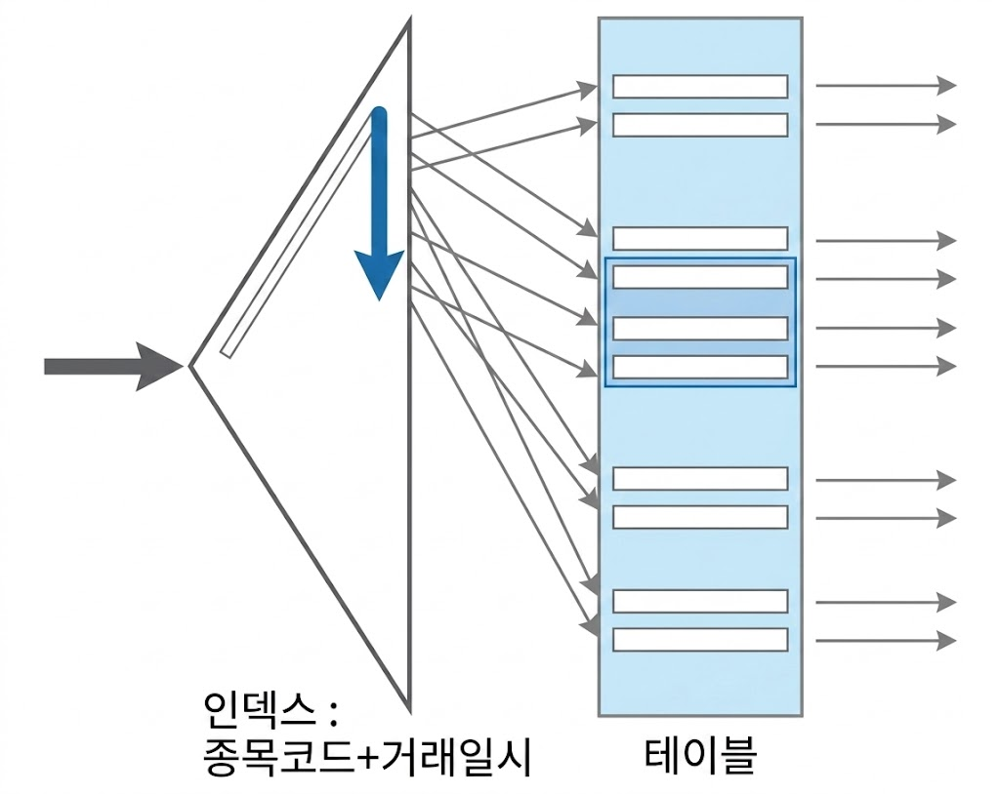
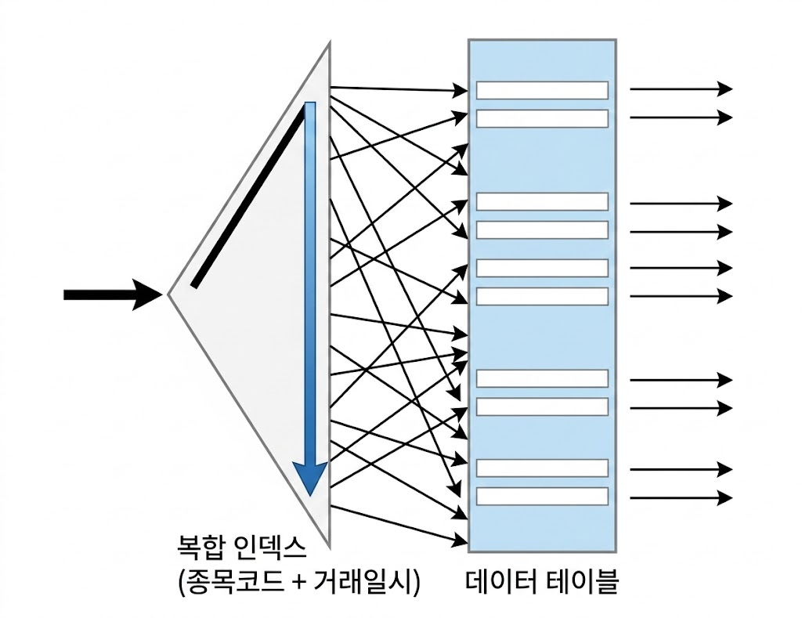
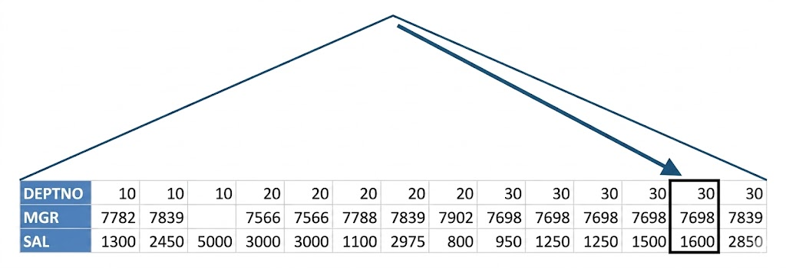
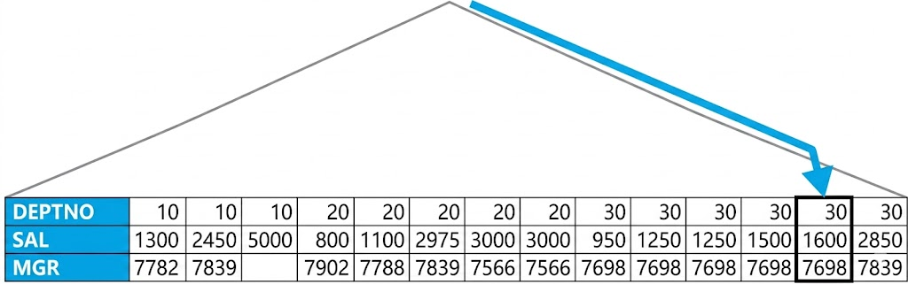
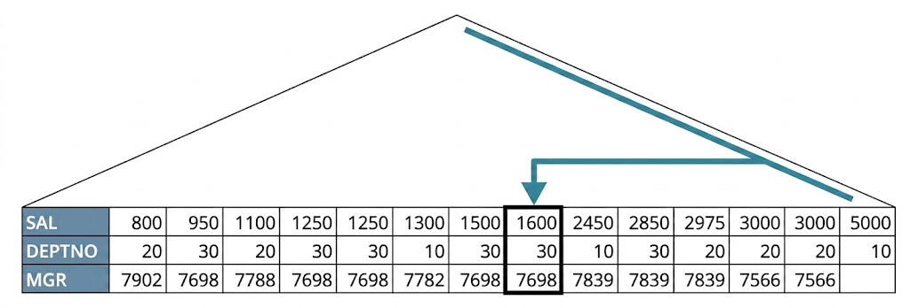
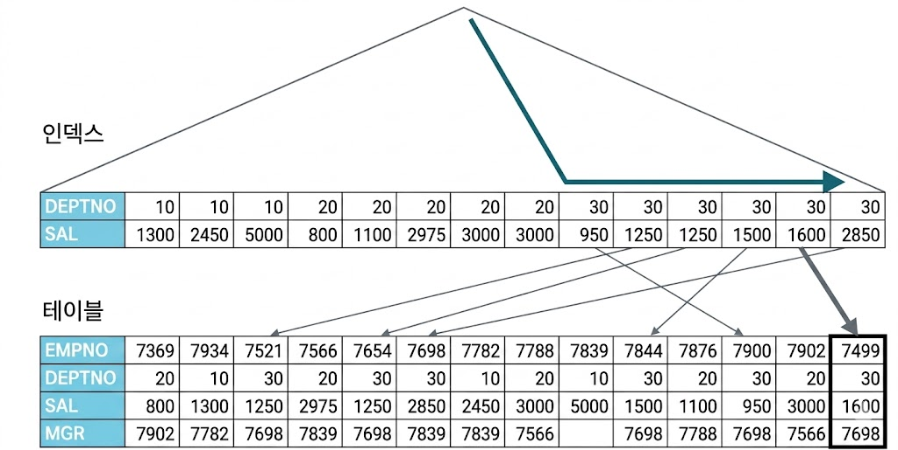
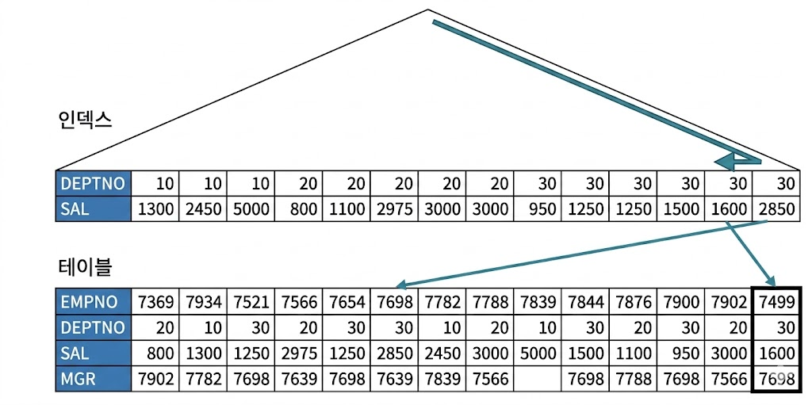
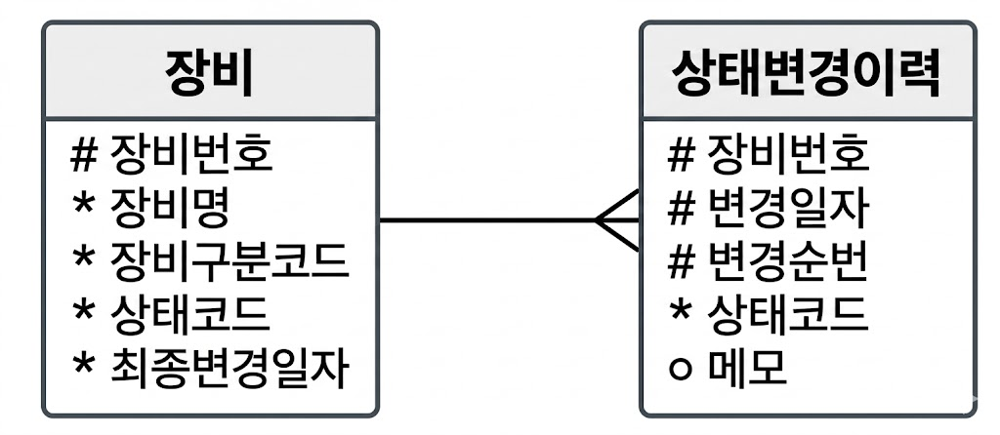
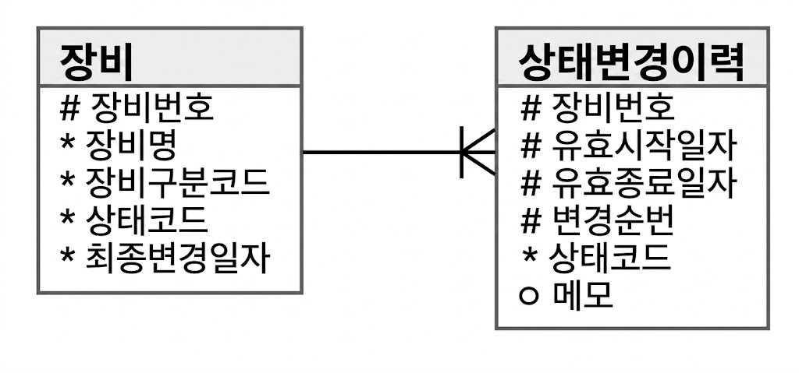
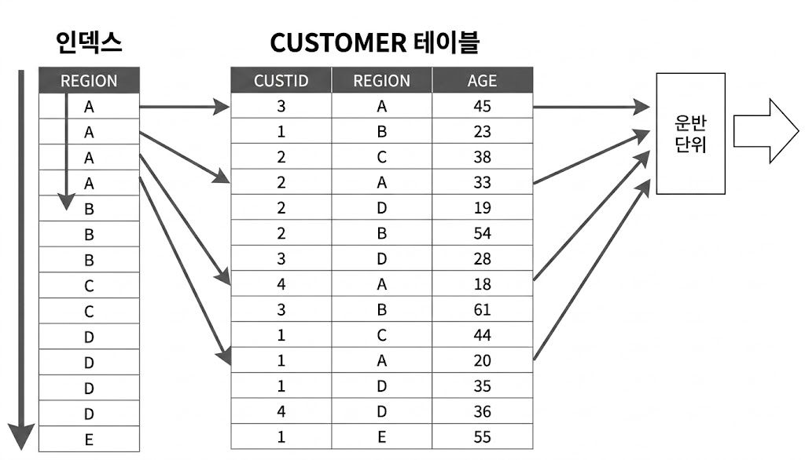

# 인덱스를 이용한 소트 연산 생략
## Sort Order By 생략

```sql
-- 인덱스 선두 컬럼을 (종목코드 + 거래일시) 순으로 구성하지 않으면, 소트 연산 생략 불가
-- 종목코드 조건을 만족하는 레코드를 인덱스에서 모두 읽어야 함
select 거래일시, 체결건수, 체결수량, 거래대금
from   종목거래
where  종목코드 = 'KR123456'
order by 거래일시

--------------------------------------------------------------------------------------------
| Id  | Operation                     | Name        | Rows  | Bytes | Cost (%CPU)|
--------------------------------------------------------------------------------------------
|   0 | SELECT STATEMENT              |             | 40000 | 3515K |  2041   (1)|
|   1 |  SORT ORDER BY                |             | 40000 | 3515K |  2041   (1)|
|   2 |   TABLE ACCESS BY INDEX ROWID | 종목        | 40000 | 3515K |  1210   (1)|
|* 3  |    INDEX RANGE SCAN           | 종목거래_N1  | 40000 |       |    96   (2)|
--------------------------------------------------------------------------------------------

Predicate Information (identified by operation id):
---------------------------------------------------
   2 - access("종목코드"='KR123456')

-- 인덱스 선두 컬럼을 (종목코드 + 거래일시) 순으로 구성하면 소트 연산 생략 가능
-- 종목코드 조건을 만족하는 전체 레코드를 읽지 않고도, 부분범위 처리를 통해 결과집합 출력
--------------------------------------------------------------------------------------------
| Id  | Operation                     | Name        | Rows  | Bytes | Cost (%CPU)|
--------------------------------------------------------------------------------------------
|   0 | SELECT STATEMENT              |             | 40000 | 3515K |  1372   (1)|
|   1 |  TABLE ACCESS BY INDEX ROWID | 종목          | 40000 | 3515K |  1372   (1)|
|* 2  |   INDEX RANGE SCAN           | 종목거래_PK    | 40000 |       |   258   (1)|
--------------------------------------------------------------------------------------------

Predicate Information (identified by operation id):
---------------------------------------------------
   2 - access("종목코드"='KR123456')
```

### 부분범위 처리를 활용한 튜닝 기법은 유효한가
* 3-Tier 환경에서 부분범위 처리는 유의미한가
    * 부분범위 처리는 쿼리 수행 결과 중 앞쪽 일부를 우선 전송하고 멈추었다가 클라이언트가 추가 전송을 요청(그리드 스크롤 또는 버튼 클릭을 통한 Fetch Call)할 때마다 남은 데이터를 조금씩 나눠 전송하는 것
    * 클라이언트 프로그램이 DB 서버에 직접 접속하는 2-Tier 환경에서는 이 특징을 활용한 튜닝 기법 많이 활용
* 3-Tier 아키텍처에서는 클라이언트와 DB 사이에 WAS, AP 서버 등이 존재
    * 서버 리소스를 수많은 클라이언트가 공유
    * 클라이언트가 특정 DB 커넥션 독점 불가
        * 단위 작업을 마치면 DB 커넥션을 바로 커넥션 풀에 반환
        * 쿼리 조회 결과를 클라이언트에 모두 전송하고 커서를 닫아야 함
* 부분처리 활용의 핵심
    * 결과집합 출력을 바로 시작할 수 있느냐
    * 앞쪽 일부만 출력하고 멈출 수 있느냐
* 3-Tier 환경에서 무의미해 보이기도 함
    * 단, *Top N 쿼리*의 존재로 인해 여전히 유효

## Top N 쿼리
* 전체 결과집합 중 상위 N개 레코드만 선택하는 쿼리

```sql
select * from (
  select 거래일시, 체결건수, 체결수량, 거래대금
  from   종목거래
  where  종목코드 = 'KR123456'
  and    거래일시 >= '20180304'
  order by 거래일시
)
where rownum <= 10
```

* 인라인 뷰로 정의한 집합을 모두 읽어 거래일시 순으로 정렬한 중간 집합을 우선 만들고, 상위 열 개 레코드를 조회
    * 소트를 생략할 수 있는 인덱스 구성이더라도, 중간집합 구성 때문에 부분범위 처리가 불가해 보임
* (종목코드 + 거래일시) 순으로 구성된 인덱스를 사용하면, 옵티마이저는 소트 연산을 생략
    * 인덱스를 스캔하다 열 개 레코드를 읽는 순간 바로 멈춤

{: w="30%"}

```sql
Execution Plan
-----------------------------------------------------------------------------------------
0      SELECT STATEMENT Optimizer=ALL_ROWS
1    0   COUNT (STOPKEY)
2    1     VIEW
3    2       TABLE ACCESS (BY INDEX ROWID) OF '종목거래' (TABLE)
4    3         INDEX (RANGE SCAN) OF '종목거래_PK' (INDEX (UNIQUE))
```

* 실행 계획에 Sort Order By 오퍼레이션 없음
    * COUNT(STOPKEY) 존재
    * 조건절에 부합하는 레코드가 아무리 많아도 그 중 ROWNUM으로 지정한 건수만큼 결과를 얻으면 바로 멈춘다는 뜻

### 페이징 처리
* 3-Tier 환경에서 부분범위 처리를 응용해 페이징 처리

```sql
-- 페이징 처리 표준 패턴
select *
from (
    select rownum no, a.*
    from
    (
        /* SQL Body */
    ) a
    where rownum <= (:page * 10)
)
where no >= (:page-1) * 10 + 1
```

* Top N 쿼리이므로 ROWNUM으로 지정한 건수만큼 결과 레코드를 얻으면 거기서 바로 멈춤
    * 뒤쪽 페이지로 이동할수록 읽는 데이터량이 많아지는 단점
* 3-Tier 환경에서 부분범위 처리를 활용하기 위해 해야하는 것
    * 부분범위 처리가 가능하도록 SQL 작성
    * 작성한 SQL문을 페이징 처리용 표준 패턴 SQL Body부분에 붙여 넣음
* 부분범위 처리가 가능하도록 SQL을 작성한다는 의미
    * 인덱스 사용 가능하도록 조건절 구사
    * 조인은 NL 조인 위주
        * 룩업을 위한 작은 테이블은 해시 조인 Build Input으로 처리해도 됨
    * Order By 절이 있어도 소트 연산을 생략할 수 있도록 인덱스 구성

```sql
select *
from (
    select rownum no, a.*
    from
    (
        select 거래일시, 체결건수, 체결수량, 거래대금
        from   종목거래
        where  종목코드 = 'KR123456'
        and    거래일시 >= '20180304'
        order by 거래일시
    ) a
    where rownum <= (:page * 10)
)
where no >= (:page-1)*10 + 1

Execution Plan
--------------------------------------------------------------------------------------
0      SELECT STATEMENT Optimizer=ALL_ROWS (Cost=16 Card=756 Bytes=126K)
1    0   VIEW (Cost=16 Card=756 Bytes=126K)
2    1     COUNT (STOPKEY)      → NO SORT + STOPKEY
3    2       VIEW (Cost=16 Card=756 Bytes=117K)
4    3         TABLE ACCESS (BY INDEX ROWID) OF '종목거래' (TABLE) (Cost=16 ... )
5    4           INDEX (RANGE SCAN) OF '종목거래_PK' (INDEX) (Cost=4 Card=303)
```

### 페이징 처리 ANTI패턴
* 앞선 쿼리에서, Order By 아래쪽 불필요해 보이는 ROWNUM을 제거해 가독성을 높일 경우

```sql
select *
from (
    select rownum no, a.*
    from
    (
        select 거래일시, 체결건수, 체결수량, 거래대금
        from   종목거래
        where  종목코드 = 'KR123456'
        and    거래일시 >= '20180304'
        order by 거래일시
    ) a
)
where no between (:page-1)*10 + 1 and (:page * 10)

Execution Plan
--------------------------------------------------------------------------------------
0      SELECT STATEMENT Optimizer=ALL_ROWS (Cost=16 Card=756 Bytes=126K)
1    0   FILTER
2    1     VIEW (Cost=16 Card=756 Bytes=126K)
3    2       COUNT      → NO SORT + NO STOP
4    3         VIEW (Cost=16 Card=756 Bytes=117K)
5    4           TABLE ACCESS (BY INDEX ROWID) OF '종목거래' (TABLE) (Cost=16 ... )
6    5             INDEX (RANGE SCAN) OF '종목거래_PK' (INDEX) (Cost=4 Card=303)
```

* Order By 아래쪽 ROWNUM은 단순 조건절이 아님
    * Top N Stopkey를 작동하게 하는 열쇠
    * 제거할 경우, 위 SQL 처럼 Count 옆에 Stopkey가 없음
    * Sort Order By가 나타나지 않은 것으로 보아, 소트 생략은 가능하지만 Stopkey가 작동하지 않아 전체범위를 처리한다는 뜻

{: w="30%"}

### 부분범위 처리 가능하도록 SQL 작성하기
```sql
거래_PK  : 거래일자 + 계좌번호 + 거래순번
거래_X01 : 계좌번호 + 거래순번 + 결제구분코드

-- 인덱스로 소트 연산 생략 불가
select *
from (
    select 계좌번호, 거래순번, 주문금액, 주문수량, 결제구분코드, 주문매체구분코드
    from   거래
    where  거래일자 = :ord_dt
    order by 계좌번호, 거래순번, 결제구분코드
)
where rownum <= 50

Execution Plan
------------------------------------------------------------------------------------------
0      SELECT STATEMENT Optimizer=ALL_ROWS (Cost=433K Card=10 Bytes=1K)
1    0   COUNT (STOPKEY)
2    1     VIEW (Cost=433K Card=421K Bytes=57M)
3    2       SORT (ORDER BY STOPKEY) (Cost=433K Card=421K Bytes=40M)
4    3         TABLE ACCESS (BY INDEX ROWID) OF '거래' (TABLE) (Cost=4
```

* PK에 결제구분코드 추가하면 소트생략이 가능하지만, PK에 컬럼을 함부로 추가할 수 없음
* (거래일자 + 계좌번호 + 거래순번 + 결제구분코드) 순으로 구성된 인덱스를 하나 더 만들어도 되지만, 트랜잭션이 많은 대형 테이블일 경우 인덱스는 최소한으로 유지해야 함
* 데이터 모델 관점
    * PK가 (거래일자 + 계좌번호 + 거래순번)
    * 거래일자가 = 조건
        * 같은 거래일자를 (계좌번호 + 거래순번) 순으로 정렬하면 중복 레코드 없음
    * 무의미한 결제구분코드를 Order By에서 제거하면 Sort Order By 오퍼레이션이 사라지고, 부분범위 처리 가능

### 최소값/최대값 구하기
* Sort Aggregate는 전체 데이터를 정렬하진 않지만, 전체 데이터를 읽으면서 값 비교

```sql
SELECT MAX(SAL) FROM EMP;

Execution Plan
-----------------------------------------------------------------------------
0      SELECT STATEMENT Optimizer=ALL_ROWS (Cost=3 Card=1 Bytes=4)
1    0   SORT (AGGREGATE) (Card=1 Bytes=4)
2    1     TABLE ACCESS (FULL) OF 'EMP' (TABLE) (Cost=3 Card=14 Bytes=56)
```

* 인덱슨느 정렬돼 있으므로, 전체 데이터를 읽지 않고 최소/최대값을 쉽게 찾을 수 있음
    * 인덱스 맨 왼쪽으로 내려가서 첫 번째 읽는 값이 최소값, 맨 오른쪽으로 내려가서 첫 번째로 읽는 값이 최대값

```sql
CREATE INDEX EMP_X1 ON EMP(SAL);

SELECT MAX(SAL) FROM EMP;

Execution Plan
-----------------------------------------------------------------------------
0      SELECT STATEMENT Optimizer=ALL_ROWS (Cost=1 Card=1 Bytes=3)
1    0   SORT (AGGREGATE) (Card=1 Bytes=3)
2    1     INDEX (FULL SCAN (MIN/MAX)) OF 'EMP_X1' (INDEX) (Cost=1 Card=1 ... )
```

### 인덱스를 이용해 최소/최대값 구하기 위한 조건
* 인덱스를 이용해 최소/최대값을 구하려면 조건절 컬럼과 MIN/MAX 함수 인자 컬럼이 모두 인덱스에 포함돼 있어야 함
    * 테이블 엑세스가 발생하지 않아야 함

```sql
CREATE INDEX EMP_X1 ON EMP(DEPTNO, MGR, SAL);

SELECT MAX(SAL) FROM EMP WHERE DEPTNO = 30 AND MGR = 7698;

Execution Plan
-----------------------------------------------------------------------------------------
0      SELECT STATEMENT Optimizer=ALL_ROWS (Cost=1 Card=1 Bytes=8)
1    0   SORT (AGGREGATE) (Card=1 Bytes=8)
2    1     FIRST ROW (Cost=1 Card=1 Bytes=8)
3    2       INDEX (RANGE SCAN (MIN/MAX)) OF 'EMP_X1' (INDEX) (Cost=1 Card=1 ... )
```

* 조건절과 MAX 인자가 모두 인덱스에 포함돼 있고, 인덱스 선두 컬럼이 모두 = 조건
* 조건을 만족하는 범위(Range) 가장 오른쪽에 있는 값 하나를 읽음
    * FIRST ROW는 조건을 만족하는 레코드 하나를 찾았을 때 바로 멈춘다는 것
        * 이를 임의로 First Row Stopkey라고 부르자

{: w="30%"}

```sql
CREATE INDEX EMP_X1 ON EMP(DEPTNO, SAL, MGR);

SELECT MAX(SAL) FROM EMP WHERE DEPTNO = 30 AND MGR = 7698;

Execution Plan
-----------------------------------------------------------------------------------------
0      SELECT STATEMENT Optimizer=ALL_ROWS (Cost=1 Card=1 Bytes=8)
1    0   SORT (AGGREGATE) (Card=1 Bytes=8)
2    1     FIRST ROW (Cost=1 Card=1 Bytes=8)
3    2       INDEX (RANGE SCAN (MIN/MAX)) OF 'EMP_X1' (INDEX) (Cost=1 Card=1 ... )
```

* DEPTNO 조건을 만족하는 범위(Range) 가장 오른쪽에 있는 값을 읽음
* 거기서부터 스캔을 시작해 MGR 조건을 만족하는 레코드 하나를 찾았을 때 멈춤
    * DEPTNO가 엑세스 조건, MGR이 필터 조건
* 조건절 컬럼과 MAX 컬럼이 모두 인덱스에 포함돼 있으므로 First Row Stopkey 작동

{: w="30%"}

```sql
CREATE INDEX EMP_X1 ON EMP(SAL, DEPTNO, MGR);

SELECT MAX(SAL) FROM EMP WHERE DEPTNO = 30 AND MGR = 7698;

Execution Plan
-----------------------------------------------------------------------------------------
0      SELECT STATEMENT Optimizer=ALL_ROWS (Cost=1 Card=1 Bytes=8)
1    0   SORT (AGGREGATE) (Card=1 Bytes=8)
2    1     FIRST ROW (Cost=1 Card=1 Bytes=8)
3    2       INDEX (FULL SCAN (MIN/MAX)) OF 'EMP_X1' (INDEX) (Cost=1 Card=1 ... )
```

* 조건절 컬럼이 둘 다 인덱스 선두 컬럼이 아니므로 Index Range Scan 불가능
* Index Full Scan 방식으로 인덱스 전체 레코드 중 가장 오른쪽에서 스캔을 시작
* 조건절을 만족하는 레코드 하나를 찾았을 때 멈춤
    * DEPTNO, MGR이 핉터 조건
* 조건절 컬럼과 MAX 컬럼이 모두 인덱스에 포함돼 있으므로 First Row Stopkey 작동

{: w="30%"}

```sql
CREATE INDEX EMP_X1 ON EMP(DEPTNO, SAL);

SELECT MAX(SAL) FROM EMP WHERE DEPTNO = 30 AND MGR = 7698;

Execution Plan
--------------------------------------------------------------------------------------
0      SELECT STATEMENT Optimizer=ALL_ROWS (Cost=2 Card=1 Bytes=8)
1    0   SORT (AGGREGATE) (Card=1 Bytes=8)
2    1     TABLE ACCESS (BY INDEX ROWID) OF 'EMP' (TABLE) (Cost=2 Card=1 Bytes=8)
3    2       INDEX (RANGE SCAN) OF 'EMP_X1' (INDEX) (Cost=1 Card=5)
```

* DEPTNO 조건을 만족하는 MAX(SAL)은 쉽게 찾을 수 있음
    * MGR이 인덱스에 없으므로, 해당 조건은 테이블에서 필터링해야만 함
    * DEPTNO 조건을 만족하는 *전체* 레코드를 읽어 테이블에서 MGR 조건을 필터링한 후 MAX(SAL)을 구함
* First Row Stopkey 작동 안 함

{: w="30%"}

### Top N 쿼리 이용해 최소/최대값 구하기
* ROWNUM <= 1 조건을 이용해 TOP 1 레코드를 찾으면 됨

```sql
CREATE INDEX EMP_X1 ON EMP(DEPTNO, SAL);

SELECT *
FROM (
    SELECT SAL
    FROM   EMP
    WHERE  DEPTNO = 30
    AND    MGR = 7698
    ORDER BY SAL DESC
)
WHERE ROWNUM <= 1;

Execution Plan
------------------------------------------------------------------------------------------
0      SELECT STATEMENT Optimizer=ALL_ROWS (Cost=2 Card=1 Bytes=13)
1    0   COUNT (STOPKEY)
2    1     VIEW (Cost=2 Card=1 Bytes=13)
3    2       TABLE ACCESS (BY INDEX ROWID) OF 'EMP' (TABLE) (Cost=2 Card=1 ... )
4    3         INDEX (RANGE SCAN DESCENDING) OF 'EMP_X1' (INDEX) (Cost=1 Card=5)
```

* Top N 쿼리에 작동하는 Top N Stopkey의 경우, 모든 컬럼이 인덱스에 포함돼 있지 않아도 작동
    * 가장 큰 SAL을 찾기 위해 DEPTNO 조건을 만족하는 *전체* 레코드를 읽지 않음
    * DEPTNO 조건을 만족하는 가장 오른쪽에서부터 역순으로 스캔하면서 테이블을 엑세스하다 MGR 조건을 만족하는 레코드 하나를 찾았을 때 바로 멈춤
* 인라인 뷰를 사용해 약간 복잡하나, 성능은 MIN/MAX보다 나음

{: w="30%"}

## 이력 조회
* 일반 테이블의 컬럼은 최종값만 저장하므로 변경되기 이전 값을 알 수 없으므로, 이력이 필요하면 이력 테이블을 따로 관리해야 함
    * 과거 변경이력 뿐만 아니라 현재 데이터도 저장해야 변경 이력을 완벽히 재생 가능

{: w="20%"}

### 단순한 이력 조회
* 이력 데이터를 조회할 때 First Row Stopkey 또는 Top N Stopkey 가 작동할 수 있게 인덱스 및 SQL을 설계해야 함

```sql
SELECT 장비번호, 장비명, 상태코드
     , (SELECT MAX(변경일자)
        FROM   상태변경이력
        WHERE  장비번호 = P.장비번호) 최종변경일자
FROM   장비 P
WHERE  장비구분코드 = 'A001'

---------------------------------------------------------------------------------------
| Id | Operation                     | Name           | Starts | A-Rows | Buffers |
---------------------------------------------------------------------------------------
|  0 | SELECT STATEMENT              |                |      1 |     10 |       4 |
|  1 |  SORT AGGREGATE               |                |     10 |     10 |      22 |
|  2 |   FIRST ROW                   |                |     10 |     10 |      22 |
|  3 |    INDEX RANGE SCAN (MIN/MAX) | 상태변경이력_PK |     10 |     10 |      22 |
|  4 |  TABLE ACCESS BY INDEX ROWID  | 장비           |      1 |     10 |       4 |
|  5 |   INDEX RANGE SCAN            | 장비_N1        |      1 |     10 |       2 |
---------------------------------------------------------------------------------------
```

* PK가 (장비번호 + 변경일자 + 변경순번) 으로 구성돼 First Row Stopkey 작동

### 복잡한 이력 조회
```sql
SELECT 장비번호, 장비명, 상태코드
     , SUBSTR(최종이력, 1, 8) 최종변경일자
     , TO_NUMBER(SUBSTR(최종이력, 9, 4)) 최종변경순번
FROM (
    SELECT 장비번호, 장비명, 상태코드
         , (SELECT MAX(H.변경일자 || LPAD(H.변경순번, 4))
            FROM   상태변경이력 H
            WHERE  장비번호 = P.장비번호) 최종이력
    FROM   장비 P
    WHERE  장비구분코드 = 'A001'
)

---------------------------------------------------------------------------------------
| Id | Operation                     | Name           | Starts | A-Rows | Buffers |
---------------------------------------------------------------------------------------
|  0 | SELECT STATEMENT              |                |      1 |     10 |       4 |
|  1 |  SORT AGGREGATE               |                |     10 |     10 |    6380 |
|  2 |   INDEX RANGE SCAN            | 상태변경이력_PK |     10 |  1825K |    6380 |
|  3 |  TABLE ACCESS BY INDEX ROWID  | 장비           |      1 |     10 |       4 |
|  4 |   INDEX RANGE SCAN            | 장비_N1        |      1 |     10 |       2 |
---------------------------------------------------------------------------------------
```

* 인덱스 컬럼을 가공해 First Row Stopkey 작동 안 함
* 장비별 상태변경이력이 많다면, 아래 쿼리가 나음
    * 쿼리가 복잡하고, 상태변경이력을 3번 조회하는 비효율이 있지만, First Row Stopkey 가 작동해 성능이 비교적 나음

```sql
SELECT 장비번호, 장비명, 상태코드
     , (SELECT MAX(H.변경일자)
        FROM   상태변경이력 H
        WHERE  장비번호 = P.장비번호) 최종변경일자
     , (SELECT MAX(H.변경순번)
        FROM   상태변경이력 H
        WHERE  장비번호 = P.장비번호
        AND    변경일자 = (SELECT MAX(H.변경일자)
                           FROM   상태변경이력 H
                           WHERE  장비번호 = P.장비번호)) 최종변경순번
FROM   장비 P
WHERE  장비구분코드 = 'A001'

-------------------------------------------------------------------------------------------
| Id  | Operation                      | Name            | Starts | A-Rows | Buffers |
-------------------------------------------------------------------------------------------
|   0 | SELECT STATEMENT               |                 |      1 |     10 |       4 |
|   1 |  SORT AGGREGATE                |                 |     10 |     10 |      22 |
|   2 |   FIRST ROW                    |                 |     10 |     10 |      22 |
|   3 |    INDEX RANGE SCAN (MIN/MAX)  | 상태변경이력_PK  |     10 |     10 |      22 |
|   4 |  SORT AGGREGATE                |                 |     10 |     10 |      47 |
|   5 |   INDEX RANGE SCAN             | 상태변경이력_PK  |     10 |   1000 |      47 |
|   6 |    SORT AGGREGATE              |                 |     10 |     10 |      22 |
|   7 |     FIRST ROW                  |                 |     10 |     10 |      22 |
|   8 |      INDEX RANGE SCAN (MIN/MAX)| 상태변경이력_PK  |     10 |     10 |      22 |
|   9 |  TABLE ACCESS BY INDEX ROWID   | 장비            |      1 |     10 |       4 |
|  10 |   INDEX RANGE SCAN             | 장비_N1         |      1 |     10 |       2 |
-------------------------------------------------------------------------------------------
```

* 이력 테이블에서 읽어야 할 컬럼이 많을 경우가 문제

```sql
SELECT 장비번호, 장비명
     , (SELECT MAX(H.변경일자)
        FROM   상태변경이력 H
        WHERE  장비번호 = P.장비번호) 최종변경일자
     , (SELECT MAX(H1.변경순번)
        FROM   상태변경이력 H1
        WHERE  장비번호 = P.장비번호
        AND    변경일자 = (SELECT MAX(H2.변경일자)
                           FROM   상태변경이력 H2
                           WHERE  장비번호 = P.장비번호)) 최종변경순번
     , (SELECT H1.상태코드
        FROM   상태변경이력 H1
        WHERE  장비번호 = P.장비번호
        AND    변경일자 = (SELECT MAX(H2.변경일자)
                           FROM   상태변경이력 H2
                           WHERE  장비번호 = P.장비번호)
        AND    변경순번 = (SELECT MAX(H3.변경순번)
                           FROM   상태변경이력 H3
                           WHERE  장비번호 = P.장비번호
                           AND    변경일자 = (SELECT MAX(H4.변경일자)
                                              FROM   상태변경이력 H4
                                              WHERE  장비번호 = P.장비번호))) 최종상태코드
FROM   장비 P
WHERE  장비구분코드 = 'A001'
```

### INDEX_DESC 힌트 활용
* 인덱스를 역순으로 읽도록 index_desc 힌트를 사용하고, 첫 번째 레코드에서 바로 멈추도록 rownum <= 1 조건절 사용

```sql
SELECT 장비번호, 장비명
     , SUBSTR(최종이력, 1, 8) 최종변경일자
     , TO_NUMBER(SUBSTR(최종이력, 9, 4)) 최종변경순번
     , SUBSTR(최종이력, 13) 최종상태코드
FROM (
    SELECT 장비번호, 장비명
         , (SELECT /*+ INDEX_DESC(X 상태변경이력_PK) */
                   변경일자 || LPAD(변경순번, 4) || 상태코드
            FROM   상태변경이력 X
            WHERE  장비번호 = P.장비번호
            AND    ROWNUM <= 1) 최종이력
    FROM   장비 P
    WHERE  장비구분코드 = 'A001'
)

-------------------------------------------------------------------------------------------
| Id  | Operation                       | Name            | Starts | A-Rows | Buffers |
-------------------------------------------------------------------------------------------
|   0 | SELECT STATEMENT                |                 |      1 |     10 |       4 |
|   1 |  COUNT STOPKEY                  |                 |     10 |     10 |      41 |
|   2 |   TABLE ACCESS BY INDEX ROWID   | 상태변경이력    |     10 |     10 |      41 |
|   3 |    INDEX RANGE SCAN DESCENDING  | 상태변경이력_PK  |     10 |     10 |      30 |
|   4 |  TABLE ACCESS BY INDEX ROWID    | 장비            |      1 |     10 |       4 |
|   5 |   INDEX RANGE SCAN              | 장비_N1         |      1 |     10 |       2 |
-------------------------------------------------------------------------------------------
```

* 성능은 좋으나, 인덱스 구성이 완벽해야만 쿼리가 잘 동작
    * 인덱스 구성이 바뀌면 결과집합에 문제가 생길 수 있음

### 11g/12c 신기능 활용
```sql
-- 11g부터
SELECT 장비번호, 장비명
     , SUBSTR(최종이력, 1, 8) 최종변경일자
     , TO_NUMBER(SUBSTR(최종이력, 9, 4)) 최종변경순번
     , SUBSTR(최종이력, 13) 최종상태코드
FROM (
    SELECT 장비번호, 장비명
         , (SELECT 변경일자 || LPAD(변경순번, 4) || 상태코드
            FROM   (SELECT 장비번호, 변경일자, 변경순번, 상태코드
                    FROM   상태변경이력
                    ORDER BY 변경일자 DESC, 변경순번 DESC)
            WHERE  장비번호 = P.장비번호
            AND    ROWNUM <= 1) 최종이력
    FROM   장비 P
    WHERE  장비구분코드 = 'A001'
)

-------------------------------------------------------------------------------------------
| Id  | Operation                       | Name            | Starts | A-Rows | Buffers |
-------------------------------------------------------------------------------------------
|   0 | SELECT STATEMENT                |                 |      1 |     10 |       4 |
|   1 |  COUNT STOPKEY                  |                 |     10 |     10 |      40 |
|   2 |   VIEW                          |                 |     10 |     10 |      40 |
|   3 |    TABLE ACCESS BY INDEX ROWID   | 상태변경이력    |     10 |     10 |      40 |
|   4 |     INDEX RANGE SCAN DESCENDING  | 상태변경이력_PK  |     10 |     10 |      30 |
|   5 |  TABLE ACCESS BY INDEX ROWID    | 장비            |      1 |     10 |       4 |
|   6 |   INDEX RANGE SCAN              | 장비_N1         |      1 |     10 |       2 |
-------------------------------------------------------------------------------------------
```

* 인라인 뷰로, 모든 상태변경이력을 읽어 변경일자와 변경순번 역순으로 정렬한 중간집합을 만들고 장비번호와 ROWNUM 조건을 필터링할 것처럼 보임
* 실제 수행하면 장비번호 조건절이 인라인 뷰 안 쪽으로 파고 듦
    * Predicate Pushing 쿼리 변환
* 인덱스 구성이 변경돼 Top N Stopkey 가 작동하지 않아 성능이 느려져도 결과 집합은 보장됨

```sql
-- 12c보다 정상 Top N Stopkey가 잘 작동하는 쿼리
SELECT 장비번호, 장비명
     , SUBSTR(최종이력, 1, 8) 최종변경일자
     , TO_NUMBER(SUBSTR(최종이력, 9, 4)) 최종변경순번
     , SUBSTR(최종이력, 13) 최종상태코드
FROM (
    SELECT 장비번호, 장비명
         , (SELECT 변경일자 || LPAD(변경순번, 4) || 상태코드
            FROM   (SELECT 변경일자, 변경순번, 상태코드
                    FROM   상태변경이력
                    WHERE  장비번호 = P.장비번호
                    ORDER BY 변경일자 DESC, 변경순번 DESC)
            WHERE  ROWNUM <= 1) 최종이력
    FROM   장비 P
    WHERE  장비구분코드 = 'A001'
)
```

### 윈도우 함수와 Row Limiting 절
* 인덱스 활용이 중요한 온라인성 쿼리에서 윈도우 함수 또는 Row Limiting 절보단 아직 Top N이 성능상 유리
* 이력조회
    * 서브쿼리에서 윈도우 함수를 사용할 수 있지만, Top N Stopkey가 작동하지 않음
    * 인덱스로 소트를 생략할 수 있을 때 사용해선 안 됨

    ```sql
    SELECT 장비번호, 장비명
     , SUBSTR(최종이력, 1, 8) 최종변경일자
     , TO_NUMBER(SUBSTR(최종이력, 9, 4)) 최종변경순번
     , SUBSTR(최종이력, 13) 최종상태코드
    FROM (
        SELECT 장비번호, 장비명
            , (SELECT 변경일자 || LPAD(변경순번, 4) || 상태코드
                FROM   (SELECT 변경일자, 변경순번, 상태코드
                            , ROW_NUMBER() OVER (ORDER BY 변경일자 DESC, 변경순번 DESC) NO
                        FROM   상태변경이력
                        WHERE  장비번호 = P.장비번호)
                WHERE  NO = 1) 최종이력
        FROM   장비 P
        WHERE  장비구분코드 = 'A001'
    );
    ```

    * 12c부터 Row Limiting 절을 이용해 구현할 수도 있지만, Top N Stopkey가 작동하지 않음
        * Row Limiting 절을 사용하면, 윈도우 함수를 사용하는 앞선 쿼리 형태로 옵티마이저가 쿼리 변환

    ```sql
    SELECT 장비번호, 장비명
     , SUBSTR(최종이력, 1, 8) 최종변경일자
     , TO_NUMBER(SUBSTR(최종이력, 9, 4)) 최종변경순번
     , SUBSTR(최종이력, 13) 최종상태코드
    FROM (
        SELECT 장비번호, 장비명
            , (SELECT 변경일자 || LPAD(변경순번, 4) || 상태코드
                FROM   상태변경이력
                WHERE  장비번호 = P.장비번호
                ORDER BY 변경일자 DESC, 변경순번 DESC
                FETCH FIRST 1 ROWS ONLY) 최종이력
        FROM   장비 P
        WHERE  장비구분코드 = 'A001'
    );
    ```

* 페이징 처리
    * 윈도우 함수를 페이징 처리에 활용할 때는 Top N Stopkey 알고리즘이 작동할 수 있음
        * 카디널리티와 비용 계산이 불완전함으로 소트를 생략할 수 있는데도 인덱스를 사용하지 않는 경우 발생
        * 페이징 처리에 이 방식으로 사용하면 index/index_desc 힌트를 자주 써야함

    ```sql
    SELECT 변경일자, 변경순번, 상태코드
    FROM (
        SELECT 변경일자, 변경순번, 상태코드
            , ROW_NUMBER() OVER (ORDER BY 변경일자, 변경순번) NO
        FROM   상태변경이력
        WHERE  장비번호 = :eqp_no
    )
    WHERE NO BETWEEN 1 AND 10;
    ```

    * 소트 생략 가능한 인덱스가 없으 Top N 소트가 작동할 때, 기존 Top N 쿼리보다 윈도우 함수가 소트 공간(Sort Area, Temp 세그먼트)을 더 많이 사용함
    * 12c 이후로 페이징 처리에 Row Limiting을 사용할 수 있지만, 윈도우 함수 사용과 동일한 성능 특성

    ```sql
    SELECT 변경일자, 변경순번, 상태코드
    FROM (
        SELECT ROWNUM NO, 변경일자, 변경순번, 상태코드
        FROM (
            SELECT 변경일자, 변경순번, 상태코드
            FROM   상태변경이력
            WHERE  장비번호 = :eqp_no
            ORDER BY 변경일자, 변경순번
            FETCH FIRST 10 ROWS ONLY
        )
    )
    WHERE NO >= 1;
    ```

### 상황에 따라 달라져야 하는 이력 조회 패턴
* 일부 장비가 아닌 전체 장비를 대상으로 조회하거나, 최종이력이 아닌 직전 이력을 조회하거나, 특정 상태로 변경한 최종 이력을 조회하는 등
* 특히 전체(또는 상당히 많은) 장비의 이력을 조회할 때는 인덱스를 이용한 Stopkey 기능 작동 여부가 튜닝의 핵심요소가 아님
    * 인덱스 활용 패턴은 랜덤 I/O 발생량만큼 성능도 비레해서 느려지므로 대량 데이터 조회할 때 좋지 않음

```sql
-- 전체 장비 이력에 윈도우 함수를 이용하면 효과적
SELECT P.장비번호, P.장비명
     , H.변경일자 AS 최종변경일자
     , H.변경순번 AS 최종변경순번
     , H.상태코드 AS 최종상태코드
FROM   장비 P
     , (SELECT 장비번호, 변경일자, 변경순번, 상태코드
             , ROW_NUMBER() OVER (PARTITION BY 장비번호
                                 ORDER BY 변경일자 DESC, 변경순번 DESC) RNUM
        FROM   상태변경이력) H
WHERE  H.장비번호 = P.장비번호
AND    H.RNUM = 1;

-------------------------------------------------------------------------------------------------
| Id  | Operation                | Name         | A-Rows | Buffers | Reads  |
-------------------------------------------------------------------------------------------------
|   0 | SELECT STATEMENT         |              |   1000 |   2881K |  36812 |
|   1 |  HASH JOIN               |              |   1000 |   2881K |  36812 |
|   2 |   TABLE ACCESS FULL      | 장비         |   1000 |      23 |      6 |
|   3 |   VIEW                   |              |   1000 |   2881K |  36806 |
|   4 |    WINDOW SORT PUSHED RANK|              |   8700 |   2881K |  36806 |
|   5 |     TABLE ACCESS FULL    | 상태변경이력 | 18250K |   2880K |  36803 |
-------------------------------------------------------------------------------------------------
```

* Full Scan과 해시 조인으로 오랜 과거 이력까지 모두 읽지만, 인덱스를 이용하는 방식보다 빠름

```sql
-- KEEP절 활용도 가능
SELECT P.장비번호, P.장비명
     , H.변경일자 AS 최종변경일자
     , H.변경순번 AS 최종변경순번
     , H.상태코드 AS 최종상태코드
FROM   장비 P
     , (SELECT 장비번호
             , MAX(변경일자) 변경일자
             , MAX(변경순번) KEEP (DENSE_RANK LAST ORDER BY 변경일자, 변경순번) 변경순번
             , MAX(상태코드) KEEP (DENSE_RANK LAST ORDER BY 변경일자, 변경순번) 상태코드
        FROM   상태변경이력
        GROUP BY 장비번호) H
WHERE  H.장비번호 = P.장비번호

-------------------------------------------------------------------------------------------------
| Id  | Operation                | Name         | A-Rows | Buffers | Reads  |
-------------------------------------------------------------------------------------------------
|   0 | SELECT STATEMENT         |              |   1000 |   2881K |  17809 |
|   1 |  HASH JOIN               |              |   1000 |   2881K |  17809 |
|   2 |   TABLE ACCESS FULL      | 장비         |   1000 |      23 |      3 |
|   3 |   VIEW                   |              |   1000 |   2881K |  17806 |
|   4 |    SORT GROUP BY         |              |   1000 |   2881K |  17806 |
|   5 |     TABLE ACCESS FULL    | 상태변경이력 | 18250K |   2880K |  17803 |
-------------------------------------------------------------------------------------------------
```

### 선분이력 맛보기
{: w="20%"}

```sql
-- 1. 현재 시점의 유효한 이력 조회 (종료일자 상수를 활용)
SELECT P.장비번호, P.장비명
     , H.상태코드, H.유효시작일자, H.유효종료일자, H.변경순번
FROM   장비 P, 상태변경이력 H
WHERE  P.장비구분코드 = 'A001'
AND    H.장비번호 = P.장비번호
AND    H.유효종료일자 = '99991231'

-- 또는

-- 2. 특정 기준일자(:BASE_DT) 시점의 유효한 이력 조회
SELECT P.장비번호, P.장비명
     , H.상태코드, H.유효시작일자, H.유효종료일자, H.변경순번
FROM   장비 P, 상태변경이력 H
WHERE  P.장비구분코드 = 'A001'
AND    H.장비번호 = P.장비번호
AND    :BASE_DT BETWEEN H.유효시작일자 AND H.유효종료일자
```

## Sort Group By 생략
* region이 선두 컬럼인 인덱스를 활용하면, Sort Group By 생략 가능
    * Sort Group By Nosort 확인

```sql
select region, avg(age), count(*)
from   customer
group by region

-------------------------------------------------------------------------------------------------
| Id | Operation                   | Name         | Rows  | Bytes | Cost (%CPU)|
-------------------------------------------------------------------------------------------------
|  0 | SELECT STATEMENT            |              |    25 |   725 | 30142  (1) |
|  1 |  SORT GROUP BY NOSORT       |              |    25 |   725 | 30142  (1) |
|  2 |   TABLE ACCESS BY INDEX ROWID| CUSTOMER     | 1000K |   27M | 30142  (1) |
|  3 |    INDEX FULL SCAN          | CUSTOMER_X01 | 1000K |       |  2337  (2) |
-------------------------------------------------------------------------------------------------
```

{: w="35%"}

* 수행 과정
    * 인덱스에서 A구간을 스캔하면서 테이블을 엑세스하다가 B를 만나는 순간, 그때까지 집계한 값을 운반단위에 저장
    * B구간을 스캔하다가 C를 만나는 순간, 그때까지 집계한 값을 운반단위에 저장
    * C구간을 스캔하다가 D를 만나는 순간, 그때까지 집게한 값을 운반단위에 저장
        * Array Size가 3일 경우, 지금까지 읽은 A ~ C에 대한 집계 결과를 클라이언트에 전송하고 Fetch Call 대기
            * 추가 Fetch Call이 없을 경우 작업 종료
    * 추가 Fetch Call이 오면, D구간부터 위 과정을 반복
