# 테이블 엑세스 최소화
### 인덱스 ROWID
* SQL이 참조하는 컬럼을 인덱스가 모두 포함하는 경우가 아니라면, 인덱스를 스캔한 후에 반드시 테이블을 엑세스
    * Table Access By Index Rowid

```sql
SELECT *
FROM TBL
WHERE 지역 = '서울'


Execution Plan
-----------------------------------------------------
0   SELECT STATEMENT Optimizer=ALL_ROWS
1   0   TABLE ACCESS BY INDEX ROWID OF 'TBL' (TABLE)
2   1       INDEX RANGE SCAN OF 'TBL_지역_IDX' (INDEX)
```

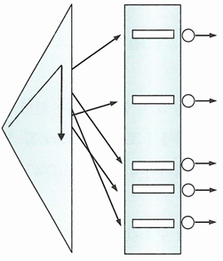{: w="30%"}

* 인덱스를 스캔하는 이유는, 검색 조건을 만족하는 소량의 데이터를 인덱스에서 빨리 찾고 거기서 테이블 레코드를 찾아가기 위한 주소값은 ROWID를 얻기 위함
* 인덱스 ROWID는 물리적 주소보다 논리적 주소에 가까움
    * 데이터파일 번호, 오브젝트 번호, 블록 번호 같은 물리적 요소로 구성돼 있긴 함
    * 하지만 물리적으로 직접 연결되지 않고 테이블 레코드를 찾아가기 위한 논리적 주소 정보를 담고 있음

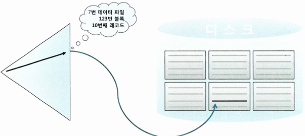{: w="50%"}

* ROWID는 포인터가 아님
    * 포인터는 메모리 주소값을 담고 있어, 엑세스 비용이 0에 가깝고 물리적으로 직접 연결된 구조와 다름 없음
    * ROWID는 디스크 상에서 테이블 레코드를 찾아가기 위한 위치 정보를 담고 있고, 테이블 레코드와 물리적으로 직접 연결된 구조는 아님

### 메인 메모리 DB(MMDB)
* 데이터를 모두 메모리에 로드해 놓고 메모리를 통해서만 I/O를 수행하는 DB
* 잘 튜닝된 OLTP성 데이터베이스 시스템은 버퍼캐시 히트율이 99% 이상
    * 디스크를 경유하지 않고 대부분 데이터를 메모리에서 읽음
    * 그럼에도 메인 메모리 DB보다 느림
        * 특히 대량 데이터를 인덱스로 엑세스할 때
* 어떤 메인 메모리 DB는 인스턴스를 기동하면 디스크에 저장된 데이터를 버퍼캐시로 로딩하고 이어서 인덱스 생성
    * 이때 인덱스는 오라클처럼 디스크 상의 주소정보가 아닌 메모리상의 주소 정보, 즉 포인터를 가짐
* 오라클은 테이블 블록이 수시로 버퍼캐시에서 밀려났다가 다시 캐싱되며, 그때마다 다른 공간에 캐싱됨
    * 인덱스에서 포인터로 직접 연결할 수 없음
    * 메모리 주소 정보(포인터)가 아닌 디스크 주소 정보(DBA, Data Block Address)를 이용해 해시 알고리즘으로 버퍼 블록 찾음

### I/O 메커니즘 복습
* DBA(= 데이터파일번호 + 블록번호)는 디스크 상에서 블록을 찾기 위한 주소 정보
    * 매번 디스크에서 블록을 읽을 수는 없음
    * I/O 성능을 높이기 위해 버퍼캐시 활용
        * 블록을 읽을 때는 디스크로 가기 전에 버퍼캐시부터 탐색
        * 읽고자 하는 DBA를 해시 함수에 입력해서 해시 체인을 찾고 거기서 버퍼 헤더를 찾음
* 버퍼 헤더는 항상 같은 해시 체인에 연결
    * 캐시에 적재할 때와 읽을 때 같은 해시 함수를 사용하기 때문
* 실제 데이터를 담은 버퍼 블록은 매번 다른 위치에 캐싱
    * 그 메모리 주소값을 버퍼 헤더가 가지고 있음
* 해싱 알고리즘으로 버퍼 헤더 찾음 > 버퍼 헤더에서 얻은 포인터로 버퍼 블록을 찾음
* 인덱스로 테이블 블록을 엑세스할 때는 리프 블록에서 읽은 ROWID를 분해해서 DBA 정보를 얻음
* 테이블을 Full Scan 할 때는 익스텐트 맵을 통해 읽을 블록들의 DBA 정보를 얻음

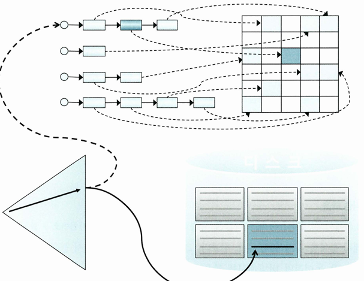{: w="50%"}

* 인덱스 ROWID(위 그림 실선)은 포인터가 아님
    * 디스크 상에서 테이블 레코드를 찾아가기 위한 논리적인 주소 정보
* ROWID가 가리키는 테이블 블록을 버퍼캐시에서 먼저 찾아보고(위 그림 점섬), 못 찾을 때만 디스크에서 블록을 찾아 버퍼캐시에 적재한 후 읽음
* 모든 데이터가 캐싱돼 있더라도 테이블 레코드를 찾기 위해 매번 DBA 해싱과 래치 획득 과정 반복
    * 동시 엑세스가 심할 경우 캐시버퍼 체인 래치와 버퍼 Lock에 대한 경합 발생

## 인덱스 클러스터링 팩터
* 클러스터링 팩터(CF, Clustering Factor)는 특정 컬럼을 기준으로 같은 값을 갖는 데이터가 서로 모여있는 정도를 의미
    * CF가 좋은 컬럼에 생성한 인덱스는 검색 효율이 좋음
    * 탐색 조건에 해당하는 데이터가 물리적으로 근접해 있으면, 흩어져 있을 때보다 탐색 속도가 빠름

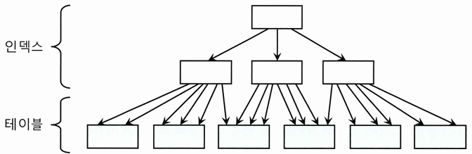{: w="50%"}
*인덱스 클러스터링 팩터가 좋은 예시*

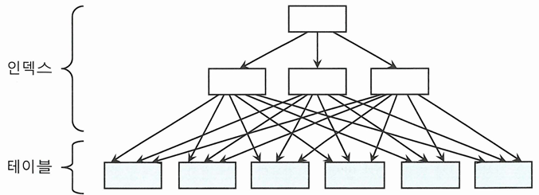{: w="50%"}
*인덱스 클러스터링 팩터가 나쁜 예시*

* 인덱스 클러스링 팩터가 좋은 상태는, 인덱스 레코드 정렬 순서와 테이블 레코드 정렬 순서가 100% 일치하지만, 나쁜 경우는 그렇지 않음

### 인덱스 클러스터링 팩터 효과
* CF가 좋은 컬럼에 생성한 인덱스는 테이블 엑세스량에 비해 블록 I/O를 적게 발생시킴
    * 인덱스 레코드마다 테이블 레코드를 건건이 블록 단위로 I/O를 한다면, CF가 달라도 블록 I/O   발생량에 차이가 없어야 하지 않나?
* 인덱스 ROWID로 테이블을 엑세스할 때, 테이블 블록에 대한 포인터(메모리 주소값)을 바로 해제하지 않고 일단 유지함
    * 버퍼 Pinning
    * 래치 획득 & 해시 체인 스캔 과정을 거쳐 어렵게 찾아갔기 때문
* 다음 인덱스 레코드를 읽었는데, '직전과 같은' 테이블 블록을 가리키는 경우
    * 래치 획득과 해시 체인 스캔 과정을 생략하고 바로 테이블 블록을 읽을 수 있음
    * 논리적인 블록 I/O 과정 생략

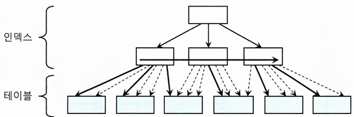{: w="40%"}

* 굵은 실선이 실제 블록 I/O가 발생하는 경우, 가는 점선은 블록을 찾아가는 과정(논리적인 블록 I/O) 없이 포인터로 바로 엑세스 하는 경우
* CF가 안 좋은 인덱스를 사용하면 테이블 엑세스하는 횟수만큼 블록 I/O 발생

## 인덱스 손익분기점
* 인덱스 ROWID를 이용한 테이블 엑세스는 고비용 구조
    * 읽어야 할 데이터가 일정량을 넘는 순간, 테이블 전체 스캔보다 느려짐
* Table Full Scan의 성능은 전체 데이터 중 몇 건을 조회하든 거의 차이가 없음
* 인덱스를 이용한 테이블 엑세스는 전체 데이터 중 몇 건을 조회하느냐가 성능에 큰 영향
    * 테이블 랜덤 엑세스 때문
    * 인덱스 스캔량 증가 영향도 있지만, 테이블 랜덤 엑세스 증가 영향이 더 큼
* 인덱스를 이용한 테이블 엑세스가 Table Full Scan보다 더 느려지는 핵심 요인
    * Tablue Full Scan은 시퀀셜 엑세스인 반면, 인덱스 ROWID를 이용한 테이블 엑세스는 랜덤 엑세스
    * Tablue Full Scan은 Multiblock I/O인 반면, 인덱스 ROWID를 이용한 테이블 엑세스는 Single Block I/O
* **인덱스 손익분기점은 보통 5~20% 수준**
    * CF에 따라 달라짐
        * 인덱스 CF가 나쁘면 같은 테이블 블록을 여러번 반복 엑세스해 논리적 I/O 횟수와 물리적 I/O 횟수가 늘기 때문
* 인덱스 스캔이 항상 좋은 것도 아니고, 테이블 스캔이 항상 나쁜 것도 아님

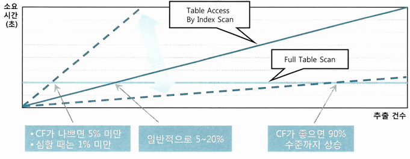{: w="50%"}

### 인덱스 손익분기점과 버퍼캐시 히트율
* 5~20% 손익분기점은 100만 이내의 작은 테이블에나 적용되는 수치
    * 10만건의 테이블의 10%인 만 건 정도면 버퍼캐시에서 데이터를 찾을 가능성이 있음
        * 이 정도 크기의 테이블이면 인덱스 컬럼 기준으로 값이 같은 테이블 레코드 근처에 모여있을 가능성이 있음
        * 인덱스를 스캔하면서 테이블을 엑세스하다 보면 대부분의 테이블 블록을 캐시에서 찾게됨
    * 1000만건의 테이블의 10%인 100만건은 버퍼캐시에서 찾을 가능성이 낮음
        * 데이터베이스에 저장된 전체 테이블에 할당된 버퍼캐시는 수백만개의 블록을 캐싱하는 수준
        * 인덱스 컬럼 기준으로 값이 같은 테이블 레코드가 근처에 모여 있을 가능성이 낮음
            * 거의 모든 데이터를 디스크에서 읽게 됨
* 만 건만 넘어도 시퀀셜 엑세스 & Multiblock I/O인 Table Full Scan이 빠를 수 있음

### 온라인 프로그램 튜닝 vs 배치 프로그램 튜닝
* 온라인 프로그램은 보통 소량의 데이터를 읽고 갱신
    * 인덱스를 효과적으로 활용하는 것이 중요
    * 대부분 NL조인 사용
    * 인덱스를 활용해 소트 연산을 생략함으로써 부분범위 처리 방식으로 구현할 수 있다면, 온라인 환경에서 대량 데이터 조회할 때 빠른 응답 속도를 낼 수 있음
* 배치 프로그램은 대량 데이터를 읽고 갱신하므로 항상 전체범위 처리 기준으로 튜닝
    * 처리대상 집합 중 일부를 빠르게 처리하는 것이 아닌, 전체범위 처리 기준으로 튜닝
    * 인덱스와 NL 조인보다 Full Scan과 해시 조인이 유리

```sql
-- 실명확인번호로 조회한 특정 고객의 1년 이내 변경 이력 중 전월 말일 데이터 출력
SELECT C.고객번호, C.고객명, H.전화번호, H.주소, H.상태코드, H.변경일시
FROM 고객 C, 고객변경이력 H
WHERE C.실명확인번호 = :rmno
AND H.고객번호 = C.고객번호
AND H.변경일시 = (SELECT MAX(변경일시)
                FROM 고객변경이력 M
                WHERE 고객번호 = C.고객번호
                AND 변경일시 >= TRUNC(ADD_MONTH(SYSDATE, -12), 'mm')
                AND 변경일시 <= TRUNC(SYSDATE, 'mm'));

Execution Plan
-------------------------------------------------------------------------------------------
0   SELECT STATEMENT Optimizer=ALL_ROWS (Cost=...)
1   0   NESTED LOOPS
2   1       NESTED LOOPS (Cost=...)
3   2           NESTED LOOPS (Cost=...)
4   3               TABLE ACCESS (BY INDEX ROWID) OF '고객' (TABLE) (Cost=...)
5   4                   INDEX (RANGE SCAN) OF '고객_X01' (INDEX) (Cost=...)
6   3               VIEW PUSHED PREDICATE OF 'SYS.VW_SQ_1' (VIEW) (Cost=...)
7   6                   SORT (AGGREGATE) (Cost=...)
8   7                       FIRST ROW (Cost=...)
9   8                           INDEX (RANGE SCAN (MIN/MAX)) OF '고객변경이력_PK' (Cost=...)
10  2               INDEX (UNIQUE SCAN) OF '고객변경이력_PK' (INDEX(UNIQUE)) (Cost=...)
11  1           TABLE ACCESS (BY INDEX ROWID) OF '고객변경이력' (TABLE) (Cost=...)


-- 고객구분코드가 'A001'인 고객의 최근 1년 이내 변경 이력 중 전월 말일 데이터를 읽어 고객_임시 테이블에 입력
-- 전체 300만명 중 조건을 만족하는 고객이 100만명일 때, 첫 쿼리에서 조건절만 바꿔 같은 방식으로 수행하면 성능이 좋지 않음
INSERT INTO 고객_임시
SELECT C.고객번호, C.고객명, H.전화번호, H.주소, H.상태코드, H.변경일시
FROM 고객 C, 고객변경이력 H
WHERE C.고객구분코드 = 'A001'
AND H.고객번호 = C.고객번호
AND H.변경일시 = (SELECT MAX(변경일시)
                FROM 고객변경이력 M
                WHERE 고객번호 = C.고객번호
                AND 변경일시 >= TRUNC(ADD_MONTH(SYSDATE, -12), 'mm')
                AND 변경일시 <= TRUNC(SYSDATE, 'mm'));

-- Full Scan + 해시 조인으로 변경
-- 조건절에 해당하지 않는 고객 데이터, 1년을 초과한 이력 데이터까지 읽는 비효율이 있지만, 수행속도는 훨씬 빠름
INSERT INTO 고객_임시
SELECT /*+ FULL(C) FULL(H) INDEX_FFS(M.고객변경이력)
            ORDERD NO_MERGE(M) USE_HASH(M) USE_HASH(H) */
    C.고객번호, C.고객명, H.전화번호, H.주소, H.상태코드, H.변경일시
FROM 고객 C
    ,(SELECT 고객번호, MAX(변경일시) 최종변경일시
      FROM 고객변경이력
      WHERE 변경일시 >= TRUNC(ADD_MONTH(SYSDATE, -12), 'mm')
      AND 변경일시 <= TRUNC(SYSDATE, 'mm')
      GROUP BY 고객번호)  M
    , 고객변경이력 H
WHERE C.고객구분코드 = 'A001'
AND M.고객번호 = C.고객번호
AND H.고객번호 = M.고객번호
AND H.변경일시 = M.최종변경일시


AND H.고객번호 = C.고객번호
AND H.변경일시 = (SELECT MAX(변경일시)
                FROM 고객변경이력 M
                WHERE 고객번호 = C.고객번호
                AND 변경일시 >= TRUNC(ADD_MONTH(SYSDATE, -12), 'mm')
                AND 변경일시 <= TRUNC(SYSDATE, 'mm'));

Execution Plan
-------------------------------------------------------------------------------------
0   INSERT STATEMENT Optimizer=ALL_ROWS (Cost=...)
1   0   LOAD TABLE CONVENTIONAL OF '고객_임시'
2   1       HASH JOIN (Cost=...)
3   2           HASH JOIN (Cost=...)
4   3               TABLE ACCESS (FULL) OF '고객' TABLE (Cost=...)
5   3               VIEW (Cost=...)
6   5                   SORT (GROUP BY) (Cost=...)
7   6                       FILTER
8   7                           INDEX (FAST FULL SCAN) OF '고객변경이력_PK' (Cost=...)
9   2           TABLE ACCESS (FULL) OF '고객변경이력' (TABLE) (Cost=...)

-- 고객변경이력 테이블을 두 번 읽는 비효율 제거
INSERT INTO 고객_임시
SELECT 고객번호, 고객명, 전화번호, 주소, 상태코드, 변경일시
FROM (SELECT /*+ FULL(C), FULL(H), LEADING(C) USE_HASH(H) */
        C.고객번호, C.고객명, H.전화번호, H.주소, H.상태코드, H.변경일시
        , RANK() OVER (PARTITION BY H.고객번호, ORDER BY H.변경일시 DESC) NO
      FROM 고객 C, 고객변경이력 H
      WHERE C.고객구분코드 = 'A001'
      AND H.변경일시 >= TRUNC(ADD_MONTHS(SYSDATE, -12), 'mm')
      AND H.변경일시 <= TRUNC(SYSDATE, 'mm')
      AND H.고객번호 = C.고객번호)
WHERE NO = 1

Execution Plan
-----------------------------------------------------------------------------------
0   INSERT STATEMENT Optimizer=ALL_ROWS (Cost=...)
1   0   LOAD TABLE COVENTIONAL OF '고객_임시'
2   1       VIEW (Cost=...)
3   2           WINDOW (SORT PUSHED RANK) (Cost=...)
4   3               FILTER
5   4                   HASH JOIN (Cost=...)
6   5                       TABLE ACCESS (FULL) OF '고객' (TABLE) (Cost=...)
7   5                       TABLE ACCESS (FULL) OF '고객변경이력' (TABLE) (Cost=...)
```

* 배치 프로그램에서 초대용량 테이블을 Full Scan하면 상당히 오래 기다려야 하고 시스템 부하도 큼
    * 파티션 활용 전략, 병렬 처리가 매우 중요함
* 파티션 테이블에도 인덱스 사용 가능
* 모든 성능 문제를 인덱스로 해결하려 해선 안 됨
    * 큰 테이블에서 아주 적은 일부 데이터를 빨리 찾고자 할 때 주로 사용

## 인덱스 컬럼 추가
* EMP 테이블에 (DEPTNO + JOB) 으로 구성된 인덱스 하나만 있는 상태인 경우

```sql
SELECT /*+ INDEX(EMP, EMP_X01) */
FROM EMP
WHERE DEPT_NO = 30 AND SAL >= 2000
```

{: w="50%"}
*사원 한 명을 찾기 위해 테이블을 여섯번 엑세스*

* 실 운영 환경에서 인덱스 구성을 변경하기는 쉽지 않음
    * 기존 인덱스를 활용하는 쿼리가 있을 수 있기 때문
* 인덱스를 새로 만드는 것 역시 쉽지 않음
    * 테이블마다 인덱스가 수십 개씩 달릴 수 있음
    * 인덱스 관리 비용 증가 및 DML 부하에 따른 트랜잭션 성능 저하
* 기존 인덱스에 SAL 컬럼을 추가하는 것만으로 큰 효과를 얻을 수 있음
    * 인덱스 스캔략은 줄지 않지만, 테이블 랜덤 엑세스 횟수를 줄여주기 때문

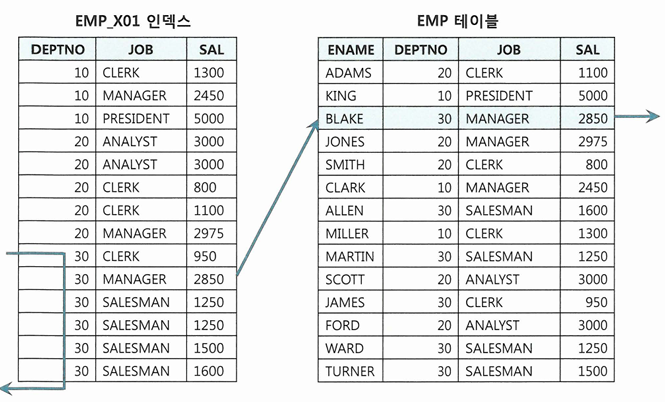{: w="50%"}
*EMP_X01에 SAL 추가*

## 인덱스만 읽고 처리
* 테이블 랜덤 엑세스가 아무리 많아도 필터 조건에 의해 버려지는 레코드가 거의 없다면 비효율이 없음

```sql
-- 부서번호 단일 컬럼으로 구성된 인덱스를 사용하는 경우
SELECT 부서번호, SUM(수량)
FROM TBL
WHERE 부서번호 LIKE '12%'
GROUP BY 부서번호
```

* 위 경우 비효율은 없음
    * 인덱스에서 부서번호 LIKE 조건에 해당하는 데이터 찾음
    * 테이블 엑세스한 후 버리는 데이터가 없음
* 그러나 비효율이 없더라도 인덱스 스캔 과정에서 얻은 데이터가 많다면, 테이블 랜덤 엑세스가 많이 발생하므로 느림
* 쿼리에 사용된 컬럼을 모두 인덱스에 추가해서 테이블 엑세스가 발생하지 않게 하는 방법을 고려해볼 수 있음
    * 인덱스만 읽어서 처리하는 쿼리를 'Covered 쿼리'
    * 그 쿼리에서 사용한 인덱스를 'Covered 인덱스'
    * 추가해야 할 컬럼이 많으면 적용하기 힘듦

### Include 인덱스
* 인덱스 키 외에 미리 지정한 컬럼을 리프 레벨에 함께 저장하는 기능
    * 테이블 랜덤 엑세스를 줄이는 용도
    * 컬럼은 최대 1,023개까지 지정 가능

```sql
CREATE INDEX EMP_X01 ON EMP (DEPTNO) INCLUDE (SAL)
CREATE INDEX EMP_X02 ON EMP (DEPTNO, SAL)
```

* EMP_X02는 DEPTNO와 SAL 모두 루트와 브랜치 블록에 저장
    * 둘 다 수직적 탐색에 사용 가능
* EMP_X01는 SAL을 리프 블록에만 저장
    * 수직적 탐색에선 DEPTNO만 사용
    * 수평적 탐색에는 SAL도 필터 조건으로 사용 가능
        * SAL은 테이블 랜덤 엑세스 횟수를 줄이는 용도로만 사용

```sql
-- EMP_X01, EMP_X02 둘 다 Covered 인덱스 이므로 테이블 랜덤 엑세스 생략 가능
SELECT SAL FROM EMP WHERE DEPTNO = 20

-- 테이블 랜덤 엑세스 측면에서는 동일 
-- 불필요한 테이블 엑세스가 발생하지 않음
-- 인덱스 스캔량은 EMP_X02 인덱스가 더 적음
-- SAL 컬럼도 인덱스 엑세스 조건으로 사용하기 때문
SELECT * FROM EMP WHERE DEPTNO = 20 AND SAL >= 2000
SELECT * FROM EMP WHERE DEPTNO = 20 AND SAL <= 3000
SELECT * FROM EMP WHERE DEPTNO = 20 AND SAL BETWEEN 2000 AND 3000

-- EMP_X02는 소트 연산 생략 가능하지만 EMP_X01은 불가
SELECT * FROM EMP WHERE DEPTNO = 20 ORDER BY SAL
```

## 인덱스 구조 테이블
* 랜덤 엑세스가 아예 발생하지 않도록 테이블을 인덱스 구조로 생성할 수 있음
    * IOT(Index-Organized Table)
* 테이블을 찾아가기 위한 ROWID를 갖는 일반 인덱스와 달리, IOT는 그 자리에 테이블 데이터를 가짐
    * 테이블 블록에 있어야 할 데이터를 인덱스 리프 블록에 모두 저장
    * 인덱스 리프 블록이 곧 데이터 블록

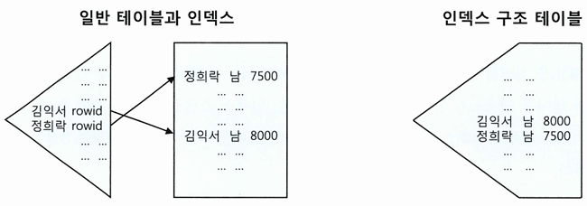{: w="50%"}

```sql
-- 테이블을 인덱스 구조로 만들기
CREATE TABLE INDEX_ORG_T (A NUMBER, B VARCHAR(10), CONSTRAINT INDEX_ORG_T_PK PRIMARY KEY (A))
ORGANIZATION INDEX;

-- 일반 테이블은 '힙 구조 테이블'이라 하는데, 아래처럼 옵션 명시 가능
CREATE TABLE INDEX_ORG_T (A NUMBER, B VARCHAR(10), CONSTRAINT INDEX_ORG_T_PK PRIMARY KEY (A))
ORGANIZATION HEAP;
```

* 힙 구조 테이블은 데이터 입력 시 랜덤 방식
    * Freelist로부터 할당 받은 블록에 정해진 순서 없이 데이터 입력
* IOT는 인덱스 구조 테이블이므로, 정렬 상태를 유지하며 데이터 입력
* IOT는 인위적으로 클러스터링 팩터를 좋게 만드는 방법 중 하나
    * 같은 값을 가진 레코드들이 100% 정렬된 상태로 모여 있으므로 랜덤 엑세스가 아닌 시퀀셜 방식으로 데이터 엑세스
    * BETWEEN이나 부등호 조건으로 넓은 범위를 읽을 때 유리
* 데이터 입력과 조회 패턴이 서로 다른 테이블에서도 유용
    * 영업사원이 100명이고, 영업사원들의 일별 실적을 집계하는 테이블 한 블록에 100개 레코드가 담기는 경우
        * 1년이면 365개 블록 
    * 실적등록은 일자별, 실적조회는 주로 사원별

    ```sql
    SELECT SUBSTR(일자, 1, 6) 월도, SUM(판매금액) 총판매금액, AVG(판매금액) 평균판매금액
    FROM 영업실적
    WHERE 사번 = 'S1234' AND 일자 BETWEEN '20180101' AND '20181231'
    GROUP BY SUBSTR(일자, 1, 6)
    ```

    * 인덱스를 사용한다면, 사원마다 랜덤 엑세스 방식으로 365개 테이블 블록을 읽어야 함
        * 클러스터링 팩터가 매우 안 좋아 조회 건수만큼 블록 I/O 발생
    * 사번이 첫 번째 정렬 기준이 되도록 IOT를 구성해주면, 4개의 블록만 읽고 처리 가능
        * 한 블록에 100개의 레코드가 담기므로

    ```sql
    CREATE TABLE 영업실적 (사번 VARCHAR(5), 일자 VARCHAR(8), ..., CONSTRAINT 영업실적_PK PRIMARY KEY(사번, 일자)) ORGANIZATION INDEX;
    ```

## 클러스터 테이블
### 인덱스 클러스터 테이블
* 클러스터 키 값이 같은 레코드를 한 블록에 모아서 저장하는 구조
    * 한 블록에 모두 담을 수 없을 때는 새로운 블록 할당해서 클러스터 체인으로 연결

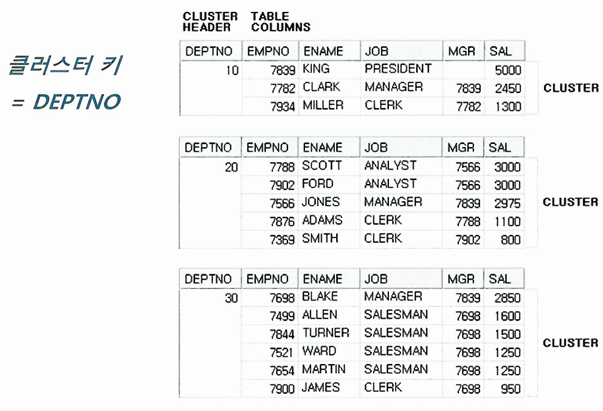{: w="40%"}

* 여러 테이블 레코드를 같은 블록에 저장할 수도 있음
    * 다중 테이블 클러스터
    * 일반 테이블은 하나의 데이터 블록을 여러 테이블이 공유할 수 없음
* SQL 서버나 Sybase의 클러스터형 인덱스(Clustered Index)와는 다른 개념
    * 클러스터형 인덱스는 IOT와 유사
    * 오라클 클러스터는 키 값이 같은 데이털르 같은 공간에 저장할 뿐, 정렬은 안 함

```sql
-- 클러스터 생성
CREATE CLUSTER C_DEPT# (DEPTNO NUMBER(2)) INDEX;

-- 클러스터에 테이블을 담기 전에 반드시 클러슽 인덱스를 정의
-- 데이터 검색 용도 뿐만 아니라 데이터가 저장될 위치를 찾을 때도 사용하기 때문
CREATE INDEX C_DEPT#_IDX ON CLUSTER C_DEPT#;

-- 클러스터 테이블 생성
CREATE TABLE DEPT (
    DEPTNO NUMBER(2) NOT NULL
    ,DNAME VARCHAR(14) NOT NULL
    ,LOC VARCHAR2(13))
CLUSTER C_DEPT#(DEPTNO);
```

* 클러스터 인덱스도 일반 B*Tree 인덱스 구조 사용
    * 테이블 레코드를 일일이 가리키지 않고 해당 키 값을 저장하는 첫 번째 데이터 블록을 가리킴
    * 일반 테이블에서 생성한 인덱스 레코드는 테이블 레코드와 1:1 대응
    * 클러스터 인덱스는 테이블 레코드와 1:M 대응
    * 클러스터 인덱스의 키 값은 항상 Unique

{: w="45%"}

* 클러스터 인덱스를 스캔하면서 값을 찾을 때는 랜덤 엑세스가 값 하나당 한 번씩 밖에 발생 안 함
    * 클러스터 체인을 스캔하면서 발생하는 랜덤 엑세스 제외
* 클러스터에 도달해서는 시퀀셜 방식으로 스캔하기 때문에 넓은 범위를 읽더라도 비효율이 없음

```sql
SELECT * FROM DEPT WHERE DEPTNO = :DEPTNO;

Execution Plan
---------------------------------------------------------------------------------
0   SELECT STATEMENT Optimizer=ALL_ROWS (Cost=1 Card=1 Bytes=30)
1   0   TABLE ACCESS (CLUSTER) OF 'DEPT' (CLUSTER) (Cost=1 Card=1 Bytes=30)
2   1       INDEX (UNIQUE SCAN) OF 'C_DEPT#_IDX' (INDEX (CLUSTER)) (Cost=1 Card=1)
```

### 해시 클러스터 테이블
* 인덱스를 사용하지 않고, 해시 알고리즘을 사용해 클러스터를 찾아감

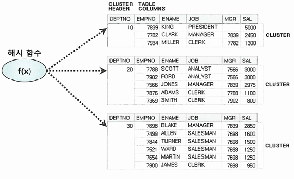{: w="45%"}

```sql
-- 클러스터 생성
CREATE CLUSTER C_DEPT# (DEPTNO NUMBER(2)) HASHKEY 4;

-- 클러스터 테이블 생성
CREATE TABLE DEPT (
    DEPTNO NUMBER(2) NOT NULL
    ,DNAME VARCHAR(14) NOT NULL
    ,LOC VARCHAR2(13))
CLUSTER C_DEPT#(DEPTNO);

SELECT * FROM DEPT WHERE DEPTNO = :DEPTNO;

Execution Plan
---------------------------------------------------------------------------------
0   SELECT STATEMENT Optimizer=ALL_ROWS (Cost=1 Card=1 Bytes=30)
1   0   TABLE ACCESS (HASH) OF 'DEPT' (CLUSTER (HASH)) (Cost=1 Card=1 Bytes=30)
```