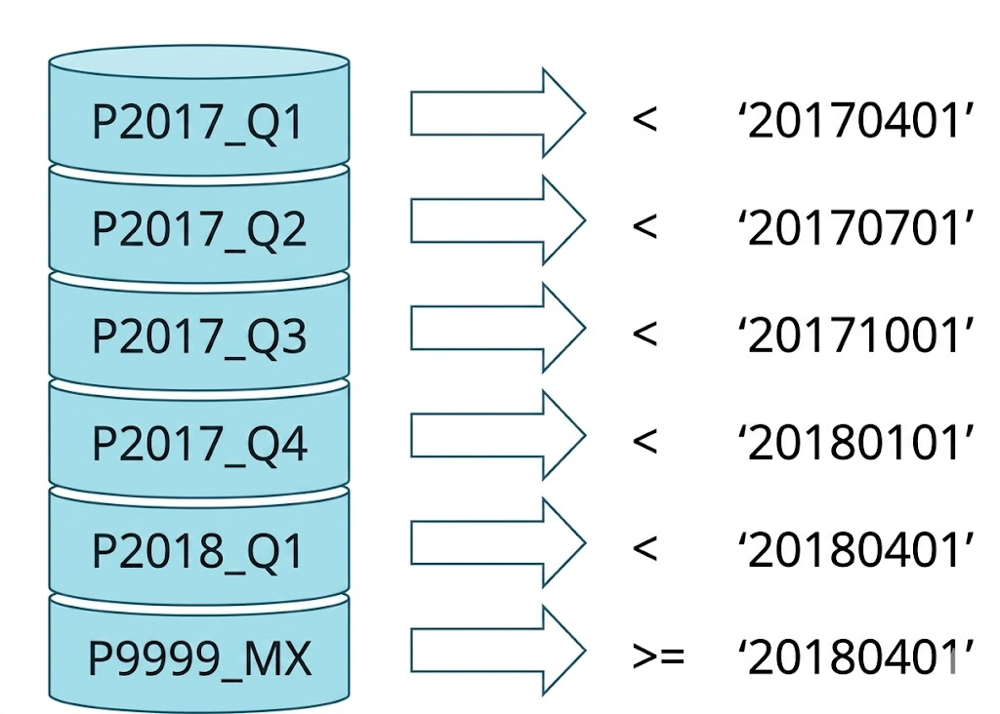
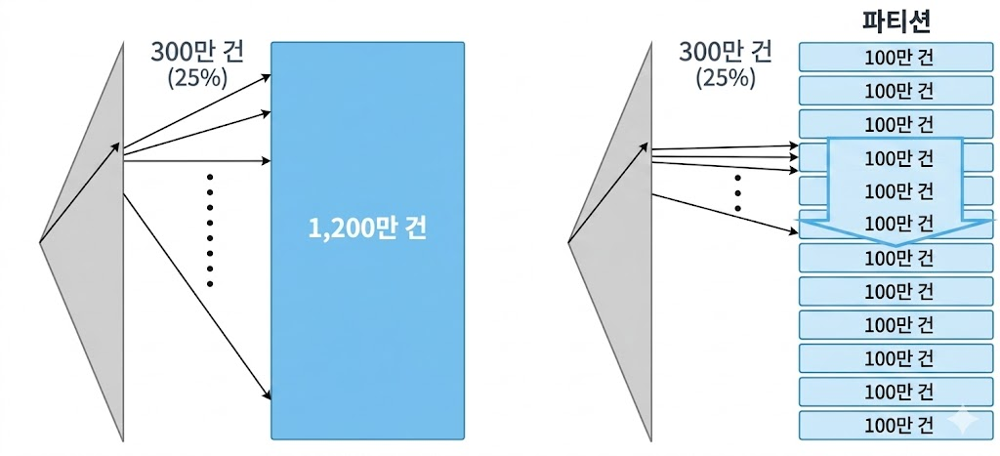
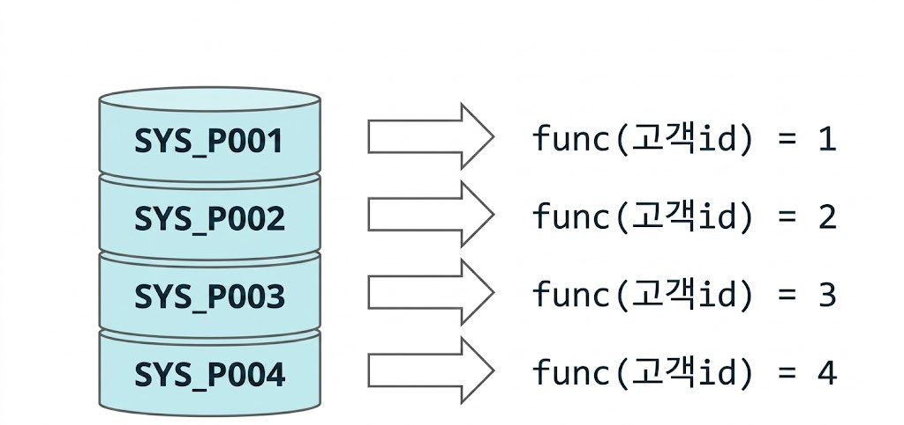
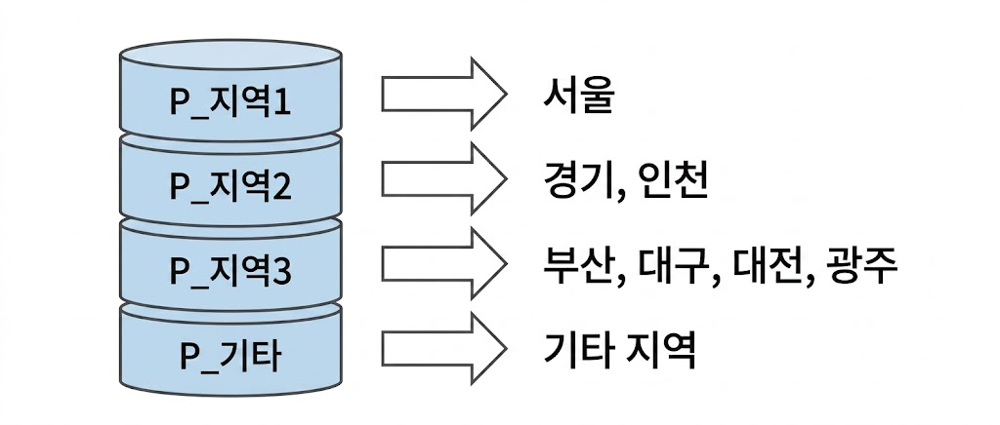
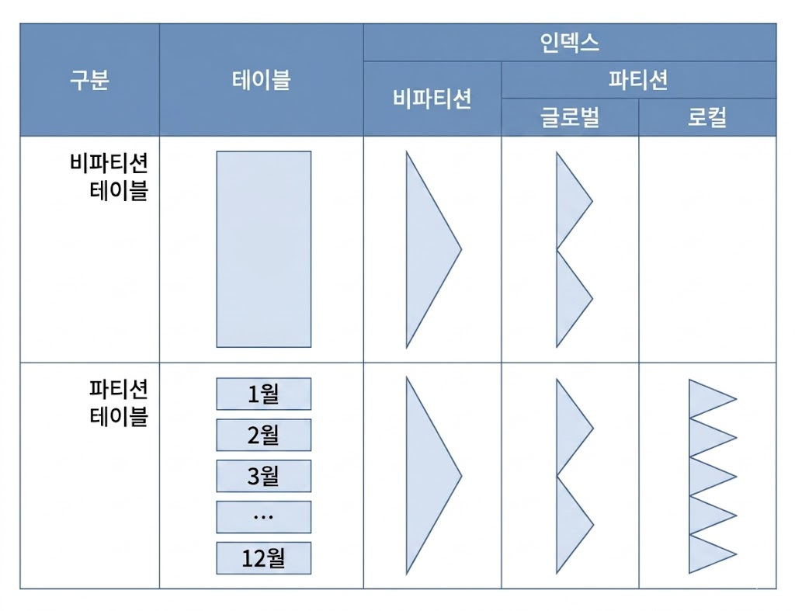
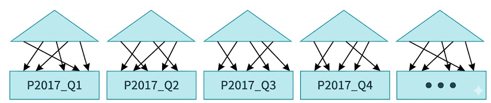
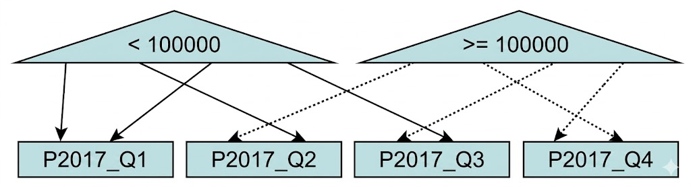
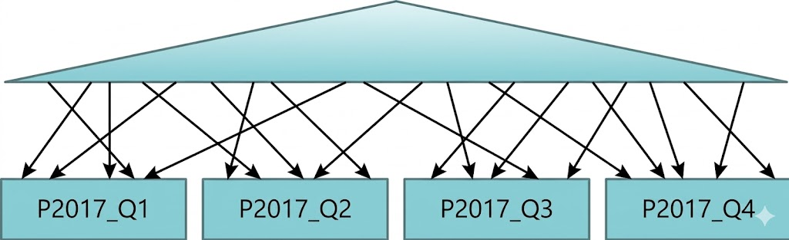
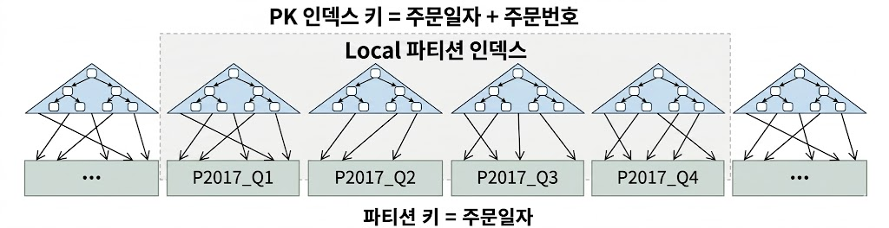
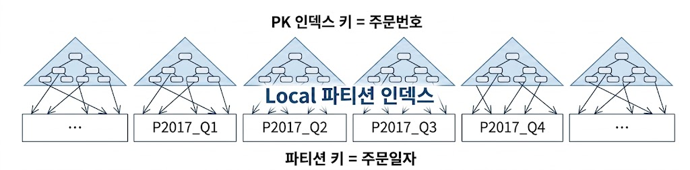

# 파티션을 활용한 DML 튜닝
## 테이블 파티션
* 파티셔닝(Partitioning)은 테이블 또는 인덱스 데이터를 특정 컬럼(파티션 키) 값에 따라 별도 세그먼트에 나눠서 저장하는 것
    * 일반적으로 시계열에 따라 Range 방식으로 분할
        * 리스트 또는 해시 방식으로도 분할 가능
    * 파티션이 필요한 이유
        * 관리적 측면: 파티션 단위 백업, 추가, 삭제, 변경으로 가용성 향상
        * 성능적 측면: 파티션 단위 조회 및 DML, 경합 또는 부하 분산

### Range 파티션
* 주로 날짜 컬럼을 기준으로 파티셔닝

```sql
CREATE TABLE 주문 (
    주문번호 NUMBER,
    주문일자 VARCHAR2(8),
    고객ID   VARCHAR2(5),
    배송일자 VARCHAR2(8),
    주문금액 NUMBER,
    ...
)
PARTITION BY RANGE (주문일자) (
    PARTITION P2017_Q1 VALUES LESS THAN ('20170401'),
    PARTITION P2017_Q2 VALUES LESS THAN ('20170701'),
    PARTITION P2017_Q3 VALUES LESS THAN ('20171001'),
    PARTITION P2017_Q4 VALUES LESS THAN ('20180101'),
    PARTITION P2018_Q1 VALUES LESS THAN ('20180401'),
    PARTITION P9999_MX VALUES LESS THAN (MAXVALUE) -- 주문일자 >= '20180401'
);
```

{: w="20%"}

* 파티션 테이블에 값을 입력하면 각 레코드를 파티션 키 값에 따라 분할 저장하고 읽을 때도 검색 조건을 만족하는 파티션만 골라 읽을 수 있음
    * 이력성 데이터 Full Scan시 성능이 크게 향상
    * 보관주기 정책에 따라 과거 데이터가 저장된 파티션만 백업하고 삭제하는 등 데이터 관리 작업을 효율적으로 수행
* 파티션 테이블에 대한 SQL 성능 향상의 원리는 파티션 Pruning(=Elimination)
    * SQL 하드파싱이나 실행 시점에 조건절을 분석해 읽지 않아도 되는 파티션 세그먼트를 엑세스 대상에서 제외하는 기능

```sql
SELECT *
  FROM 주문
 WHERE 주문일자 >= '20120401'
   AND 주문일자 <= '20120630';
```

{: w="30%"}

* 조건절은 만족하는 데이터는 1200만건 중 300만건으로 전체의 25%
    * 인덱스로 건건이 랜덤 엑세스하면 테이블 전체를 스캔하는 것보다 성능이 더 느림
    * 테이블 전체를 스캔하자니 사이즈가 너무 큼
* 100만 단위로 나눠 저장하면, Full Scan 하더라도 전체가 아닌 일부 파티션 세그먼트만 읽고 멈출 수 있음
    * 파티션을 병렬로 처리하면 그 효과는 배가 됨
    * 파티션 테이블도 인덱스로 엑세스할 수 있지만, 파티션 Pruning을 이용한 테이블 스캔보다 느림
* 파티션도 클러스터, IOT 처럼 데이터가 흩어지지 않고 물리적으로 인접하도록 저장하는 클러스터링 기술
    * 클러스터와 다른 점은 세그먼트 단위로 모아서 저장한다는 것
        * 클러스터는 데이터를 블록 단위로 모아 저장
        * IOT는 데이터를 정렬된 순서로 저장

### 해시 파티션
* 파티션 키 값을 해시 함수에 입력해 반환받은 값이 같은 데이터를 같은 세그먼트에 저장
    * 파티션 개수만 사용자가 결정
    * 데이터 분산 알고리즘은 오라클 내부 해시함수가 결정
* 해시 파티션은 고객ID처럼 변별력이 좋고 데이터 분포가 고른 컬럼을 파티션 기준으로 선정해야 효과적

```sql
CREATE TABLE 고객 (
    고객ID VARCHAR2(5),
    고객명 VARCHAR2(10),
    ...
)
PARTITION BY HASH(고객ID) PARTITIONS 4;
```

{: w="30%"}

* 검색할 때 조건절 비교 값에 똑같은 해시 함수를 적용함으로써 읽을 파티션 결정
* 해시 알고리즘 특성 상 = 또는 IN-List 조건으로 검색할 때만 파티션 Pruning 작동

### 리스트 파티션
* 사용자가 정의한 그룹핑 기준에 따라 데이터를 분할 저장

```sql
CREATE TABLE 인터넷매물 (
    물건코드 VARCHAR2(5),
    지역분류 VARCHAR2(4),
    ...
)
PARTITION BY LIST(지역분류) (
    PARTITION P_지역1 VALUES ('서울'),
    PARTITION P_지역2 VALUES ('경기', '인천'),
    PARTITION P_지역3 VALUES ('부산', '대구', '대전', '광주'),
    PARTITION P_기타  VALUES (DEFAULT) -- 기타 지역
);
```

{: w="30%"}

* Range 파티션에선 값의 순서에 따라 저장할 파티션이 결정되지만, 리스트 파티션에서는 순서와 상관없이 불연속적인 값의 목록에 의해 결정
* 해시 파티션은 오라클이 정한 해시 알고리즘에 따라 임의로 분할하지만, 리스트 파티션은 사용자가 정의한 논리적인 그룹에 따라 분할
    * 업무적인 친화도에 따라 그룹핑 기준을 정화되, 될 수 있으면 각 파티션에 값이 고르게 분산되도록 설정

## 인덱스 파티션
* 테이블 파티션 구분
    * 비파티션 테이블
    * 파티션 테이블
* 인덱스도 테이블처럼 파티션 여부에 따라 파티션 인덱스와 비파티션 인덱스로 구분
    * 파티션 인덱스는 각 파티션이 커버하는 테이블 범위에 따라 로컬과 글로벌로 구분
    * 로컬 파티션 인덱스
    * 글로벌 파티션 인덱스
    * 비파티션 인덱스
* 로컬 파티션 인덱스는 각 테이블 파티션과 인덱스 파티션이 서로 1:1 대응 관계가 되도록 오라클이 자동 관리하는 파티션
    * 로컬이 아닌 파티션 인덱스는 *모두* 글로벌 파티션 인덱스
    * 테이블 파티션과 독립적인 구성(파티션 키, 파티션 기준값 정의)를 가짐

{: w="35%"}
*테이블과 인덱스 파티션 조합 예시*

### 로컬 파티션 인덱스
* 파티션 별로 별도의 인덱스를 만드는 것

```sql
CREATE INDEX 주문_x01 ON 주문 ( 주문일자, 주문금액 ) LOCAL;
CREATE INDEX 주문_x02 ON 주문 ( 고객ID, 주문일자 ) LOCAL;
```

* 각 인덱스 파티션은 테이블 파티션 속성을 그대로 받음
    * 테이블 파티션 키가 주문일자면, 인덱스 파티션 키도 주문일자
    * *로컬 인덱스*라고 부르기도 함

{: w="35%"}

* 로컬 파티션 인덱스는 테이블과 정확히 1:1 대응 관계를 갖도록 오라클이 파티션을 자동으로 관리
    * 테이블 파티션 구성을 변경(add, drop, exchange)하더라도 인덱스를 재생성할 필요 없음
    * 변경작업이 금방 끝나므로 peek 시간대만 피하면 서비스 중단하지 않고도 작업 가능한 관리 편의성

### 글로벌 파티션 인덱스
* 파티션을 테이블과 다르게 구성한 인덱스
    * 파티션 유형이 다르거나, 파티션 키가 다르거나, 파티션 기준값 정의가 다른 경우
    * 비파티션 테이블이어도 인덱스는 파티셔닝 가능

```sql
-- 주문금액 + 주문일자로 글로벌 파티션 인덱스 생성
CREATE INDEX 주문_x03 ON 주문 ( 주문금액, 주문일자 ) GLOBAL
PARTITION BY RANGE(주문금액) (
    PARTITION P_01 VALUES LESS THAN ( 100000 ),
    PARTITION P_MX VALUES LESS THAN ( MAXVALUE ) -- 주문금액 >= 100000
);
```

{: w="35%"}

* 글로벌 파티션 인덱스는 테이블 파티션 구성을 변경(drop, exchange, split 등)하는 순간 Unusable 상태로 바뀌므로 곧바로 인덱스를 재생성 해줘야 함
    * 그동안 해당 테이블을 사용하는 서비스 중단
* 테이블과 인덱스가 정확히 1:1관계가 되도록 파티션을 직접 구성해주더라도, 로컬 파티션이 아님
    * 오라클이 인덱스 파티션을 자동으로 관리해주지 않음

### 비파티션 인덱스
* 파티셔닝하지 않은 인덱스

```sql
CREATE INDEX 주문_x04 ON 주문 ( 고객ID, 배송일자 );
```

{: w="35%"}

* 비파티션 인덱스는 여러 테이블 파티션을 가리킴
    * *글로벌 비파티션 인덱스*라고 부르기도 함
* 비파티션 인덱스는 테이블 파티션 구성을 변경(drop, exchange, split 등)하는 순간 Unusable 상태로 바뀌므로 곧바로 인덱스를 재생성 해줘야 함
    * 그동안 해당 테이블을 사용하는 서비스 중단

### Prefixed vs Nonprefixed
* 인덱스 파티션 키 컬럼이 인덱스 구성상 왼쪽 선두 컬럼에 위치하는지에 따른 구분
    * Prefixed: 인덱스 파티션 키 컬럼이 인덱스 키 컬럼 왼쪽 선두에 위치
    * Nonprefixed: 인덱스 파티션 키 컬럼이 인덱스 키 컬럼 왼쪽 선두에 위치하지 않음
        * 파티션 키가 인덱스 컬럼에 아예 속하지 않을 때도 포함

| 구분 | Prefixed | Nonprefixed |
| :--- | :---: | :---: |
| 로컬 파티션 | 1 | 2 |
| 글로벌 파티션 | 3 | 4 (Not Support) |

* 글로벌 파티션 인덱스는 Prefixed만 지원
* 파티션 유형 정리
    * 로컬 Prefixed 파티션 인덱스
    * 로컬 Nonprefixed 파티션 인덱스
    * 글로벌 Prefixed 파티션 인덱스
    * 비파티션 인덱스

```sql
-- 1. SQL 쿼리
SELECT i.index_name, i.partitioned, p.partitioning_type
     , p.locality, p.alignment
  FROM user_indexes i, user_part_indexes p
 WHERE i.table_name = '주문'
   AND p.index_name(+) = i.index_name
 ORDER BY i.index_name;

/*
-- 2. 실행 결과 데이터
INDEX_NAME    PAR  PARTITION  LOCALI  ALIGNMENT     설명
----------    ---  ---------  ------  ---------     ----
주문_X01      YES  RANGE      LOCAL   PREFIXED      → 로컬 Prefixed 파티션 인덱스
주문_X02      YES  RANGE      LOCAL   NON_PREFIXED  → 로컬 Nonprefixed 파티션 인덱스
주문_X03      YES  RANGE      GLOBAL  PREFIXED      → 글로벌 Prefixed 파티션 인덱스
주문_X04      NO                                    → 비파티션 인덱스
*/
```

### 중요한 인덱스 파티션 제약
* **Unique 인덱스를 파티셔닝하려면, 파티션 키가 모두 인덱스 구성 컬럼이어야 한다**

{: w="40%"}

* *주문일자*로 파티셔닝한 테이블이고, PK는 *주문일자 + 주문번호*, 인덱스는 로컬 파티션
    * PK 인덱스도 주문일자로 파티셔닝한 셈이므로 파티션 키가 인덱스 구성 컬럼
* 2017년 12월 25일에 주문번호 123456인 주문 레코드가 입력되면, 중복 값 확인을 위해 P2017_Q4 파티션 인덱스만 탐색
    * 입력 주문은 이 파티션에만 입력될 수 있기 때문

{: w="40%"}

* PK인덱스가 *주문번호* 단일컬럼인 경우
    * 테이블 파티션 키인 주문일자가 인덱스 구성 컬럼이 아님
    * 인덱스를 파티셔닝할 수 없지만, 허용했다고 가정
* 주문번호가 123456인 주문 레코드가 입력되면, 중복 값이 있는지 확인하기 위해 인덱스 파티션을 모두 탐색해야 함
    * 입력 주문은 어떤 파티션에든 입력될 수 있기 때문
* Unique 인덱스를 파티셔닝할 때 파티션 키가 인덱스 컬럼에 포함돼야 한다는 조건은 DML 성능 보장을 위해 필수적인 제약 조건
    * 파티션 키 조건 없이 PK 인덱스로 엑세스하는 수많은 쿼리 성능을 위해서도 필요
        * 파티션 키 조건 없이 PK 컬럼만으로 조회할 때 모든 파티션 인덱스를 탐색해야 하기 때문
* 이 제약으로 인해 PK 인덱스를 로컬 파티셔닝하지 못하면 파티션 Drop, Truncate, Exchange, Split, Merge 같은 파티션 구조 변경 작업이 쉽지 않음
    * 작업을 하는 순간 PK 인덱스가 Unusable 상태로 바뀌기 때문
    * 곧바로 인덱스를 Rebuild하면 되지만, 그동안 해당 테이블을 사용하는 서비스를 중단
* **서비스 중단 없이 파티션 구조를 빠르게 변경하려면, PK를 포함한 모든 인덱스가 로컬 파티션 인덱스여야 함**
* 파티션을 활용한 UPDATE/DELETE/INSERT는 파티션 구조 변경 작업을 수반
    * ILM을 지원하는 매우 중요한 기능
        * Information Lifecycle Management, 데이터 생성부터 소멸까지 생명주기를 효율적으로 관리하는 체계
            * 기간계 DB에 쌓인 과거 데이터를 주기적으로 별도 저장소로 옮기고, 그곳에서 일정 기간이 지나면 폐기하는 프로세스와 정책 등을 포함
    * ILM 관리체계를 효과적으로 운영하려면 가급적 인덱스를 로컬 파티션으로 구성
        * 테이블 설계할 때부터 PK를 잘 구성
            * 대량으로 데이터를 추가/변경/삭제하는 기준 컬럼을 PK에 포함하려고 노력

## 파티션을 활용한 대량 UPDATE 튜닝
* 대량 데이터 입력/수정/삭제할 때는 인덱스를 Drop하거나 Unusable 상태로 변경하고서 작업하는 방법을 많이 활용
    * 손익분기점은 5% 정도
        * 입력/수정/삭제하는 데이터 비중이 5%를 넘는다면, 인덱스 없이 작업한 후 재생성하는 것이 더 빠름