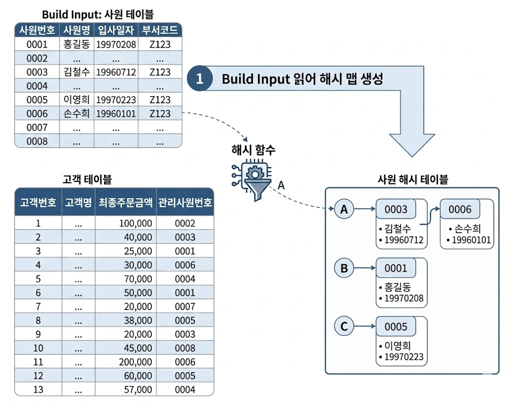
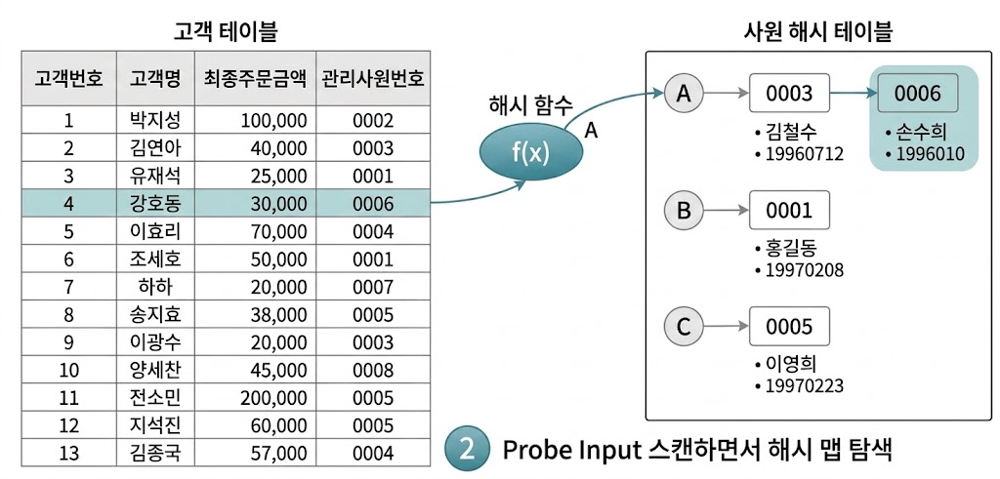
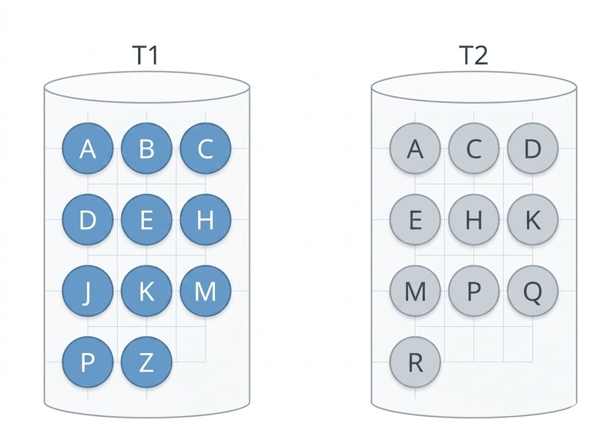
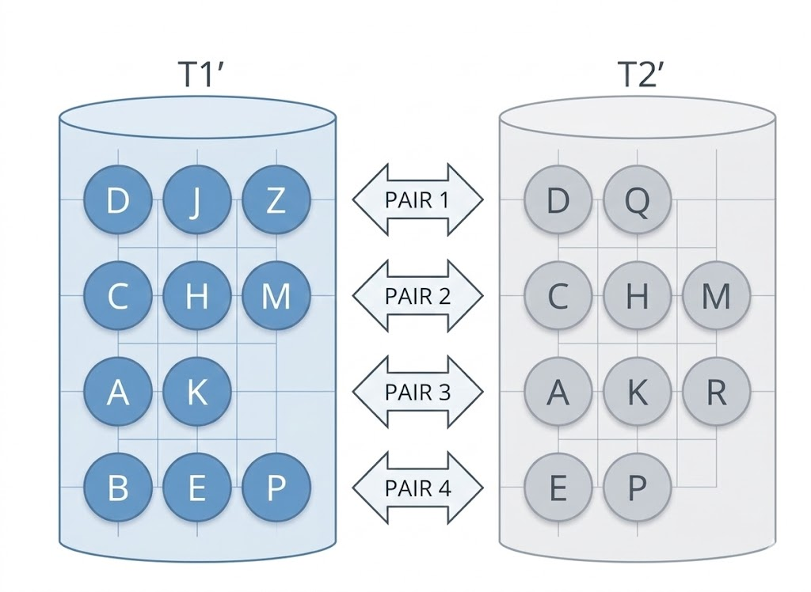
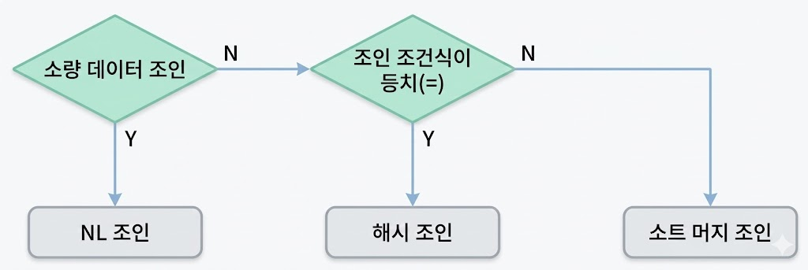

# 해시 조인
## 기본 메커니즘
* 진행 단계
    * Build 단계: 작은 쪽 테이블(Build Input)을 읽어 해시 테이블(해시 맵) 생성
    * Probe 단계: 큰 쪽 테이블(Probe Input)을 읽어 해시 테이블을 탐색하면서 조인

```sql
-- 사원 테이블 기준(ordered)으로 고객 테이블과 조인할 때 해시 조인(use_hash) 하라
select /*+ ordered use_hash(c) */
       e.사원번호, e.사원명, e.입사일자
     , c.고객번호, c.고객명, c.전화번호, c.최종주문금액
from   사원 e, 고객 c
where  c.관리사원번호 = e.사원번호
and    e.입사일자     >= '19960101'
and    e.부서코드     = 'Z123'
and    c.최종주문금액 >= 20000
```

{: w="35%"}
*Build*

* Build 단계에서 아래 조건을 만족하는 사원 데이터를 읽어 해시 테이블 생성
    * 조인컬럼인 사원번호를 해시 테이블 키 값으로
        * 사원번호를 해시 함수에 입력해서 반환된 값으로 해시 체인 찾고, 그 해시 체인에 데이터 연결
    * 해시 테이블은 PGA에 할당된 Hash Area에 저장
        * PGA가 부족하면, Temp 테이블 스페이스 사용

```sql
select 사원번호, 사원명, 입사일자
from   사원
where  입사일자 >= '19960101'
and    부서코드 = 'Z123'
```

* Probe 단계에서 아래 조건에 해당하는 고객 데이터를 하나씩 읽어 앞서 생성한 해시 테이블을 탐색
    * 관리사원번호를 해시 함수에 입력해 반환된 값을 해시 체인을 찾고, 해시 체인을 스캔해 값이 같은 사원번호 찾음
        * 찾으면 조인 성공, 못 찾으면 실패

```sql
select 고객번호, 고객명, 전화번호, 최종주문금액, 관리사원번호
from   고객
where  최종주문금액 >= 20000
```

* Build 단계에서 사용한 해시 함수를 Probe 단계에서도 사용하므로 같은 사원번호를 입력하면 같은 해시 값이 반환
    * 해시 함수가 반환한 값에 해당하는 해시 체인만 스캔

```sql
begin
  for outer in (select 고객번호, 고객명, 전화번호, 최종주문금액, 관리사원번호
                from   고객
                where  최종주문금액 >= 20000)
  loop    -- outer 루프
    for inner in (select 사원번호, 사원명, 입사일자
                  from   PGA에_생성한_사원_해시맵
                  where  사원번호 = outer.관리사원번호)
    loop  -- inner 루프
      dbms_output.put_line( ... );
    end loop;
  end loop;
end;
```

* Probe 단계는 NL조인과 다르지 않음

{: w="35%"}
*Probe*

## 해시 조인이 빠른 이유
* Hash Aread에 생성한 해시 테이블을 이용한다는 점만 다를 뿐 해시 조인도 NL 조인과 조인 프로세스가 동일
    * 해시 테이블을 PGA 영역에 할당하기 때문에 NL 조인보다 빠름
    * NL 조인은 Outer 테이블 레코드마다 Inner 테이블 레코드를 읽기 위해 래치 획득 및 캐시버퍼 체인 스캔 과정 반복
    * 해시 조인은 래치 획득 과정 없이 PGA에서 빠르게 데이터 탐색하고 조인
* 해시 조인도 Build Input과 Probe Input 각 테이블을 읽을 때 DB 버퍼캐시 경유
    * 이때 인덱스 이용하기도 함
    * 버퍼캐시 탐색 비용 및 랜덤 엑세스 부하 발생 가능
* 일반적으로 해시 조인이 소트 머지 조인보다 빠른 이유
    * 조인 오퍼레이션을 시작하기 전 사전 준비작업 차이
        * 소트 머지 조인에서 사전 준비작업은 *양쪽* 집합을 모두 정렬해 PGA에 적재
            * PGA는 큰 메모리 공간이 아니므로, 두 집합 중 어느 하나가 중대형 이상이면 Temp 테이블스페이스, 디스크에 쓰는 작업 수반
        * 해시 조인에서 사전 준비작업은 어느 *한쪽*을 읽어 해시 맵을 만드는 작업
            * 둘 중 작은 집합을 해시 맵 Build Input으로 선택
            * 두 집합 모두 Hash Area에 담을 수 없는 크기가 아니라면, Temp 테이블스페이스를 사용하지 않음
* 해시 조인은 NL 조인처럼 조인 과정에서 발생한느 랜덤 엑세스 부하가 없고, 소트 머지 조인처럼 양쪽 집합을 미리 정렬하는 부하도 없음
    * 해시 테이블을 생성하는 비용은, 둘 중 작은 집합을 Build Input으로 선택하므로 부담이 크지 않음
    * Build Input이 PGA 메모리에 담겨 인메모리 해시 조인일 때 가장 효과적
    * Build Input이 Hash Area를 초과해 Temp 테이블스페이스를 쓰게 되더라도, 대량 데이터 조인은 해시 조인이 일반적으로 가장 빠름

### 해시 테이블에 담기는 정보
* 조인 키값 뿐만 아니라 SQL에 사용한 컬럼 모두 저장
* 만약 키 값만 저장한다면, 래치 획득 과정 없이 PGA에서 조인한다는 해시 조인의 장점이 사라짐
    * 조인에 성공한 키에 대한 나머지 정보를 읽으려면 ROWID로 다시 테이블 블록을 엑세스해야 하기 때문

## 대용량 Build Input 처리
{: w="25%"}

* 두 테이블 모두 대용량 테이블이어서 인메모리 해시 조인이 불가능한 경우, 분할/정복 방식으로 진행
    * 파티션 단계
        * 조인하는 양쪽 집합(조인 이외의 조건절을 만족하는 레코드)의 조인 컬럼에 해시 함수 적용하고, 반환된 해시 값에 따라 동적으로 파티셔닝
        * 독립적으로 처리할 수 있는 여러 개의 작은 서브 집합으로 분할함으로써 파티션 pair 생성

        {: w="25%"}

        * 양쪽 집합을 읽어 디스트 Temp 공간에 저장해야 하므로, 인메모리 해시 조인보다 성능이 떨어짐
    * 조인 단계
        * 각 파티션 pair에 대해 하나씩 조인을 수행
            * 각각에 대한 Build Input과 Probe Input은 독립적으로 결정
            * 파티션하기 전 어느 쪽이 작은 테이블이었는지 상관 없이, 각 파티션 pair별로 작은 쪽을 Build Input으로 해시 테이블 생성
            * 해시 테이블 생성하고 나면 반대쪽 파티션 로우를 하나씩 읽으면서 해시 테이블을 탐색
        * 모든 파티션 pair에 대한 처리를 마칠 때까지 반복
        
## 해시 조인 실행계획 제어
```sql
-- 위쪽 테이블을 Build Input으로 해시 테이블을 생성한 후, 아래쪽 테이블(Probe Input)에서 읽은 조인 키값으로 해시 테이블을 탐색하면서 조인
-- Build/Probe Input을 읽을 때 인덱스 이용(Table Full Scan도 가능)
Execution Plan
----------------------------------------------------------
0      SELECT STATEMENT Optimizer=ALL_ROWS
1   0    HASH JOIN
2   1      TABLE ACCESS (BY INDEX ROWID) OF '사원' (TABLE)
3   2        INDEX (RANGE SCAN) OF '사원_X1' (INDEX)
4   1      TABLE ACCESS (BY INDEX ROWID) OF '고객' (TABLE)
5   4        INDEX (RANGE SCAN) OF '고객_N1' (INDEX)

-- use_hash 힌트로 제어
-- use_hash만 사용한 경우, Build Input은 옵티마이저가 결정(보통 각 테이블 조건절에 대한 카디널리티가 작은 테이블)
select /*+ use_hash(e c) */
       e.사원번호, e.사원명, e.입사일자
     , c.고객번호, c.고객명, c.전화번호, c.최종주문금액
from   사원 e, 고객 c
where  c.관리사원번호 = e.사원번호
and    e.입사일자     >= '19960101'
and    e.부서코드     = 'Z123'
and    c.최종주문금액 >= 20000

-- leading/ordered로 Build Input 지시 가능(힌트로 지시한 순서에 따라 가장 먼저 읽는 테이블)
select /*+ leading(e) use_hash(c) */ -- 또는 ordered use_hash(c)
       e.사원번호, e.사원명, e.입사일자
     , c.고객번호, c.고객명, c.전화번호, c.최종주문금액
from   사원 e, 고객 c
where  c.관리사원번호 = e.사원번호
and    e.입사일자     >= '19960101'
and    e.부서코드     = 'Z123'
and    c.최종주문금액 >= 20000

-- swap_join_inputs로 Build Input 명시적으로 선택 가능
select /*+ leading(e) use_hash(c) swap_join_inputs(c) */
       e.사원번호, e.사원명, e.입사일자
     , c.고객번호, c.고객명, c.전화번호, c.최종주문금액
from   사원 e, 고객 c
where  c.관리사원번호 = e.사원번호
and    e.입사일자     >= '19960101'
and    e.부서코드     = 'Z123'
and    c.최종주문금액 >= 20000
```

### 세 개 이상 테이블 해시 조인
* A, B, C 테이블이 있는 경우
    * 경로1
        * A와 B를 조인하고, B와 C를 조인

        ```sql
        select *
        from A, B, C
        where A.key = B.key
        and B.key = C.key
        ```
    
    * 경로2
        * A와 B를 조인하고, A와 C를 조인

        ```sql
        select *
        from A, B, C
        where A.key = B.key
        and A.key = C.key
        ```
    
    * 두 방법은 본질적으로 같음
        * 테이블 T1, T2, T3가 있고 T1과 T2를, T2와 T3를 조인한다고 할 때
            * 경로1은 T1 = A, T2 = B, T3 = C
            * 경로2는 T1 = B, T2 = A, T3 = C

```sql
select /*+ leading(T1, T2, T3) use_hash(T2) use_hash(T3) */
from   T1, T2, T3
where  T1.key = T2.key
and    T2.key = T3.key
```

* 해시 조인에서 leading 힌트 첫 번째 파라미터로 지정한 테이블이 Build Input
    * T1이 T2와 조인할 때는 Build Input
    * 가능한 실행계획 패턴

    ```sql
    -- 패턴1
    Execution Plan
    ----------------------------------------------------------
    0      SELECT STATEMENT Optimizer=ALL_ROWS
    1   0    HASH JOIN
    2   1      HASH JOIN
    3   2        TABLE ACCESS (FULL) OF 'T1' (TABLE)
    4   2        TABLE ACCESS (FULL) OF 'T2' (TABLE)
    5   1      TABLE ACCESS (FULL) OF 'T3' (TABLE)

    -- 패턴2
    Execution Plan
    ----------------------------------------------------------
    0      SELECT STATEMENT Optimizer=ALL_ROWS
    1   0    HASH JOIN
    2   1      TABLE ACCESS (FULL) OF 'T3' (TABLE)
    3   1      HASH JOIN
    4   3        TABLE ACCESS (FULL) OF 'T1' (TABLE)
    5   3        TABLE ACCESS (FULL) OF 'T2' (TABLE)
    ```

    ```sql
    -- T2를 Build Input으로 선택하고 싶은 경우
    -- leading(T1, T2, T3) swap_join_inputs(T2) 처럼 swap_join_inputs 힌트 사용
    
    -- 패턴1
    Execution Plan
    ----------------------------------------------------------
    0      SELECT STATEMENT Optimizer=ALL_ROWS
    1   0    HASH JOIN
    2   1      HASH JOIN
    3   2        TABLE ACCESS (FULL) OF 'T2' (TABLE)
    4   2        TABLE ACCESS (FULL) OF 'T1' (TABLE)
    5   1      TABLE ACCESS (FULL) OF 'T3' (TABLE)

    -- 패턴2
    Execution Plan
    ----------------------------------------------------------
    0      SELECT STATEMENT Optimizer=ALL_ROWS
    1   0    HASH JOIN
    2   1      TABLE ACCESS (FULL) OF 'T3' (TABLE)
    3   1      HASH JOIN
    4   3        TABLE ACCESS (FULL) OF 'T2' (TABLE)
    5   3        TABLE ACCESS (FULL) OF 'T1' (TABLE)
    ```

    * 패턴 1을 2로 바꾸려면, T3가 Build Input이 돼야 하므로 swap_join_inputs로 가능

    ```sql
    select /*+ leading(T1, T2, T3) swap_join_inputs(T3) */
    select /*+ leading(T1, T2, T3) swap_join_inputs(T2) swap_join_inputs(T3) */
    ```

## 조인 메소드 선택 기준
{: w="30%"}

* 소량 데이터 조인할 때는 **NL 조인**
* 대량 데이터 조인할 때는 **해시 조인**
    * 조인 조건식이 등치(=) 조건이 아니라 해시 조인으로 처리할 수 없을 때는 **소트 머지 조인**
        * 카테시안 곱 포함
* 소량과 대량의 기준
    * NL 조인 기준으로 *최적화했는데도* 랜덤 엑세스가 많아 만족할만한 성능을 낼 수 없는 경우
* 수행빈도가 매우 높은 쿼리에 대해서는
    * 최적화된 NL조인과 해시 조인 성능이 같으면 NL조인
    * 해시 조인이 약간 더 빨라도 NL 조인
    * NL조인 보다 해시 조인이 매우 빠른 경우 해시 조인
        * 보통 대량 데이터 조인
* NL조인을 가장 먼저 고려하는 이유
    * 인덱스는 Drop하지 않는 한, 영구적으로 유지하면서 다양한 쿼리를 위해 공유 및 재사용
    