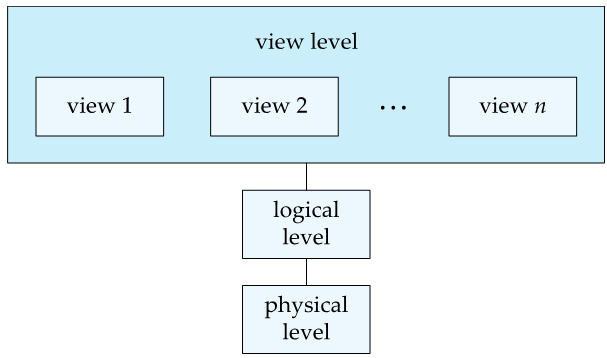
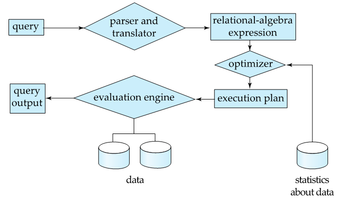
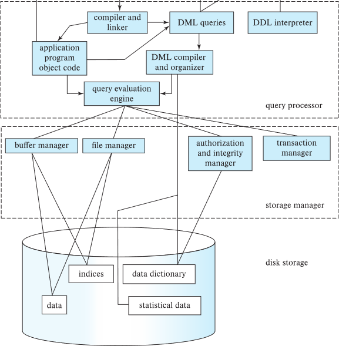
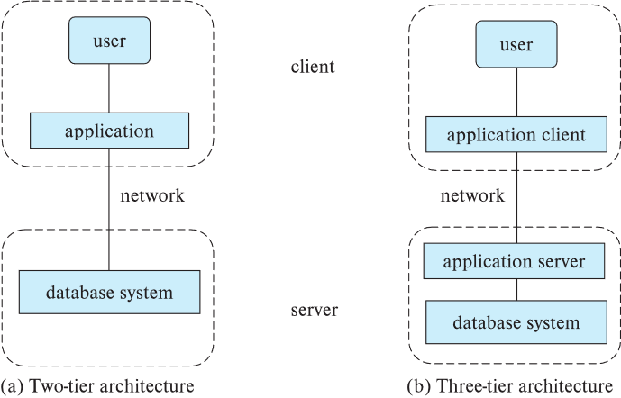

# DB Introduction
## Database Systems
* **Database-management system (DBMS)** contains information about a particular enterprise.
    * Collection of interrelated data
    * Set of programs to access the data
    * An environment that is both *convenient* and *efficient* to use
* Database systems are used to manage collections of data that are
    * Highly valuable
    * Relatively large
    * Accessed by multiple users and applications, often at the same time.

## Purpose of Database Systems
* Data redundancy and inconsistency
    * Data is stored  in multiple file formats resulting induplication of information in different files.
* Difficulty in accessing data
    * Need to write a new program to carry out each new task.
* Data isolation
    * Multiple files and formats.
* Integrity problems
    * Integrity constraints  (e.g., account balance > 0) become “buried” in program code rather than being stated explicitly.
    * Hard to add new constraints or change existing ones.
* Atomicity of updates
    * Failures may leave database in an inconsistent state with partial updates carried out.
* Concurrent access by multiple users
    * Concurrent access needed for performance.
    * Uncontrolled concurrent accesses can lead to inconsistencies.
* Security problems
    * Hard to provide user access to some, but not all, data.

## View of Data
* A major purpose of a database system is to provide users with an *abstract* view of the data.

### Data Models
* **Data models** is a  collection of conceptual tools for decribing data, data relationships, data semantics, and consistency constraints.

* **Realational Model**
    * All the data is stored in various tables.
    * Tables are also known as **relations**.
* **Entity-relationship data model**
* **Semi-structed data model**
* **Object-based data model**

### Data Abstraction
* Hide the complexity  of data structures to represent data in the database from users through several levels of **data abstraction**.

* **Physical level**: describes *how* a record (e.g., instructor) is stored.
* **Logical level**: describes data stored in database, and the relationships among the data.
* **View level**: application programs hide details of data types.
    *  Views can also hide information (such as an employee’s salary) for security purposes. 

{: w="350" h = "330"}
*An architecture for a database system*

### Instances and Schemas
* The collection of information stored in the database at a particular moment is called and **instance** of the database.
* The overall design of the database is called the database **schema**.
* Similar to types and variables in programming languages.
    * **Logical Schema**: The overall logical structure of the database.
    * Example: The database consists of information about a set of customers and accounts in a bank and the relationship between them.
        * Analogous to type information of a variable in a program.
    * **Physical schema**: The overall physical  structure of the database.
    * **Instance**: The actual content of the database at a particular point in time.
        * Analogous to the value of a variable.
* **Physical Data Independence**: The ability to modify the physical schema without changing the logical schema Applications depend on the logical schema.
    * In general, the interfaces between the various levels and components should be well defined so that changes in some parts do not seriously influence others.

## Database Languages
### Data Definition Language (DDL)
* Specification notation for defining the database schema

```sql
    create table instructor(
        ID  char(5),
        name varchar(20),
        dept_name   varchar(20),
        salary  numeric(8, 2))
```

* We specify the storage structure and access methods used by the database system by a set of statements in a special type of DDL called a **data storage and definition** language.
* The data values stored in the database must satisfy certain consistency constraints.
    * **Domain Constraints**: A domain of possible values must be associated with every attribute.
    * **Referential Integrity**
    * **Authorization**: We may want to differentiate among the users as far as the type of access they are permitted on various data values in the database.
* DDL compiler generates a set of table templates stored in a **data dictionary**.
* Data dictionary contains **metadata**.
    * Database schema 
    * Integrity constraints
        * Primary key (ID uniquely identifies instructors)
    * Authorization
        * Who can access what

### Data Manipulation Language (DML)
* Language for accessing and updating the data organized by the appropriate data model.
    * also known as query language
* There are basically two types of data-manipulation language.
    * **Procedural DML**: Require a user to specify what data are needed and how to get those data.
    * **Declarative DML**: Require a user to specify what data are needed without specifying how to get those data. 
* Declarative DMLs are usually easier to learn and use than are procedural DMLs.  
* Declarative DMLs are also referred to as non-procedural DMLs.
* The portion of a DML that involves information retrieval is called a **query** language. 

### SQL Query Language
* SQL  query language is nonprocedural. A query takes as input several tables (possibly only one) and always returns a single table.

```sql
    select name
    from instructor
    where dept_name = 'Comp. Sci';
```

* SQL is **NOT** a Turing machine equivalent language.
* To be able to compute complex functions SQL is usually embedded in some higher-level language.
* Application programs generally access databases through one of
    * Language extensions to allow embedded SQL
    * Application program interface (e.g., ODBC/JDBC) which allow SQL queries to be sent to a database

### Database Access from Application Program
* Non-procedural query languages such as SQL are not as powerful as a universal Turing machine.    
* SQL does not support actions such as input from users, output to displays, or communication over the network.  
* Such computations and actions must be written in a **host language**, such as C/C++, Java or Python, with embedded SQL queries that access the data in the database.
* **Application programs** are programs that are used to interact with the database in this fashion.

## Database Design
* 간략한 순서
    1. 요건분석
    2. 개념적 설계 (ER model 설계)
        * ER Diagram 도출
    3. Table 스키마
    4. 정규화
    5. refinement
    6. 최종 스키마
* The process of designing the general structure of the database
    * **Logical Design**: Deciding on the database schema. Database design requires that we find a “good” collection of relation schemas.
        * Business decision: What attributes should we record in the database?
        * Computer Science decision: What relation schemas should we have and how should the attributes be distributed among the various relation schemas?
    * **Physical Design** Deciding on the physical layout of the database.

## Database Engine
* Database system is partitioned into modules that deal with each of the responsibilities of the overall system.  
* The functional components of a database system can be divided into
    * The storage manager,
    * The  query processor component, 
    * The transaction management component.

### Storage Manager
* A program module that provides the interface between the low-level data stored in the database and the application programs and queries submitted to the system.
* The storage manager is responsible to the following tasks: 
    * Interaction with the OS file manager 
    * Efficient storing, retrieving and updating of data
* The storage manager components include:
    * Authorization and integrity manager
    * Transaction manager
    * File manager
    * Buffer manager
* The storage manager implements several data structures as part of the physical system implementation
    * Data files: store the database itself
    * Data dictionary: stores metadata about the structure of the database, in particular the schema of the database.
    * Indices: can provide fast access to data items.  A database index provides pointers to those data items that hold a particular value.

### Query Processor
* The query processor components include:
    * DDL  interpreter: interprets DDL statements and records the definitions in the data dictionary.
    * DML compiler: translates DML statements in a query language into an evaluation plan consisting of low-level instructions that the query evaluation engine understands.
        * The DML compiler performs query optimization; that is, it picks the lowest cost evaluation plan from among the various alternatives.
    * Query evaluation engine: executes low-level instructions generated by the DML compiler.

### Query Processing
1.	Parsing and translation
2.	Optimization
3.	Evaluation

{: w="440" h = "400"}

### Transaction Management
* A **transaction** is a collection of operations that performs a single logical function in a database application.
* **Transaction-management component** ensures that the database remains in a consistent (correct) state despite system failures (e.g., power failures and operating system crashes) and transaction failures.
* **Concurrency-control manager** controls the interaction among the concurrent transactions, to ensure the consistency of the database. 

## Database Architecture
* Centralized databases
    * One to a few cores, shared memory
* Client-server
    * One server machine executes work on behalf of multiple client machines
* Parallel databases
    * Many core shared memory
    * Shared disk
    * Shared nothing
* Distributed databases
    * Geographical distribution
    * Schema/data heterogeneity

{: w="380" h = "450"}
*Database Architecture(Centralized/Shared-Memory)*

### Database Applications
* Database applications are usually partitioned into two or three parts
    * Two-tier architecture: The application resides at the client machine, where it invokes database system functionality at the server machine.
    * Three-tier architecture: The client machine acts as a front end and does not contain any direct database calls.  
        * The client end communicates with an application server, usually through a forms interface.  
        * The application server in turn communicates with a database system to access data.  

{: w="380" h = "350"}
*Two-tier and three-tier architectures*
