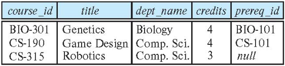
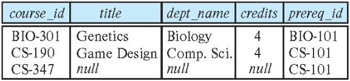

# Intermediate SQL
## Join Expressions
* **Join operations** take two relations and return as a result another relation.
* A join operation is a *Cartesian product* which requires that tuples in the two relations match (under some condition).
    * It also specifies the attributes that are present in the result of the join.
* The join operations are typically used as subquery expressions in the **from** clause.
* Three types of joins
    * Natural join
    * Inner join
    * Outer join

### Natural Join
* Natural join matches tuples with the same values for all common attributes, and retains only one copy of each common column.

```sql
--List the names of instructors along with the course ID of the courses that they taught
select name, course_id
from  students, takes
where student.ID = takes.ID;

--Same query in SQL with “natural join” construct
select name, course_id
from student natural join takes
```

{: w="340" h = "360"}
*Student Relation*

{: w="350" h = "430"}
*Takes Relation*

{: w="450" h = "440"}
*student natural join takes*

* The from clause can have *multiple relations* combined using natural join

```sql
select A1, A2, … An
from r1 natural join r2 natural join .. natural join rn
where  P ;
```
     
### Dangerous in Natural Join
* Beware of **unrelated attributes with same name** which get equated incorrectly.

```sql
--List the names of students instructors along with the titles of courses that they have taken

--correct version
select name, title
from student natural join takes, course
where takes.course_id = course.course_id;

--incorrect version
select name, title
from student natural join takes natural join course;
```

* Incorrect query omits all (student name, course title) pairs where the student takes a course in a department other than the student's own department. 
    * Natural join of student and takes contains the attributes (ID, name, dept_name, tot_cred, course_id, sec_id), while the course relation contains the attributes (course_id, title, dept_name, credits).
    * As a result, the natural join would require that the dept_name attribute vlaues from the two relations be the same in addition to requiring that the course_id values be the same.

### Natural Join with Using Clause
* To avoid the danger of equating attributes erroneously, we can use the **using** construct that allows us to specify exactly which columns should be equated.

```sql
select name, title
from (student natural join takes) join course using (course_id);
```

### Join Condition
* The **on** condition allows a general predicate over the relations being joined.
* This predicate is written like a where clause predicate except for the use of the keyword on.

```sql
select *
from student join takes on student.ID = takes.ID;

--equivalent query
select *
from student, takes
where student.ID = takes.ID;

--display the ID value only once
select student.ID as ID, name, dept_name, tot_cred, course_id, sec_id, semester, year, grade
from student join takes on student.ID = takes.ID;
```

### Outer Join
```sql
select *
from student natural join takes;
```

* Above query does not work quite as intended.
    * Suppose that there is some student who takes no courses.
    * Tuple in the student relation for that particular student would not satisfy the condition of a natural join with any tuple in the takes relation, and that student's data would not appear in the result.
* **Outer join** is an extension of the join operation that avoids loss of information.
* Computes the join and then adds tuples form one relation that does not match tuples in the other relation to the result of the join. 
    * Uses **null** values.
* Three forms of outer join
    * left outer join
    * right outer join
    * full outer join

{: w="330" h = "290"}
*Relation course*

{: w="270" h = "250"}
*Relation prereq*

* Observe that 
    * course information is missing CS-347
    * prereq information is missing CS-315

### Left Outer Join
{: w="340" h = "290"}
*course natural left outer join prereq*

* In relational algebra: course ⟕ prereq

### Right Outer Join
{: w="340" h = "290"}
*course natural right outer join prereq*

* In relational algebra: course ⟖ prereq

### Full Outer Join
{: w="340" h = "300"}
*course natural full outer join prereq*

* In relational algebra: course ⟗ prereq

## Views
* In some cases, it is not desirable for all users to see the entire logical model.
    * That is, all the actual relations stored in the database.
* Consider a person who needs to know an instructors name and department, but not the salary. 
* This person should see a relation described, in SQL, by 

```sql
select ID, name, dept_name
from instructor;
```

* Aside from security concerns, we may wish to create a personalized collection of *virtual* relations that is better matched to a certain user's instution of the structure of the enterprise.
* Consider we may want to have a list of all course sections offered by the Physics department in the Fall 2017 semester, with the building and room number of each section.

```sql
select course.course_id, sec_id, building, room_number
from course, section
where course.course_id = section.course_id
    and course.dept_name = 'Physics'
    and section.semester = 'Fall'
    and section.year = 2017;
```

* It is possible to compute and store the results of these queries and then make the stored relations available to users.
* However, if we did so, and the underlying data in the relations instructor, course or section changed, the stored query results would then no longer match the result of reexecuting the query on the relations.
* In general, it is a bad idea to compute and store query results such as those in the above examples.

* A **view** provides a mechanism to hide certain data from the view of certain users.
* Any relation that is not of the conceptual model but is made visible to a user as a *virtual relation* is called a **view**.

### View Definition
* A view is defined using the **create view** statement which has the form

```sql
create view v as query_expression
```

* where query_expression is any legal SQL expression.  
* The view name is represented by v.
* Once a view is defined, the view name can be used to refer to the virtual relation that the view generates.
* View definition is not the same as creating a new relation by evaluating the query expression  
    * Rather, a view definition causes the saving of an expression; the expression is substituted into queries using the view

### View Definition and Use
```sql
--A view of instructors without their salary
create view faculty as
    select ID, name, dept_name
    from instructor;
```

```sql
--A view that lists all course sections offered by the Physics department in the Fall 2017 semester with the building and room number of each section
create view physics_fall_2017 as
    select course.course_id, sec_id, building, room_number
    from course, section
    where course.course_id = section.course_id
        and course.dept_name = 'Physics'
        and section.semester = 'Fall'
        and section.year = 2017;
```

```sql
--Create a view of department salary totals
create view departments_total_salary(dept_name, total_salary) as
    select dept_name, sum (salary)
    from instructor
    group by dept_name;
```

* One view may be used in the expression defining another view.
* A view relation v1 is said to depend directly on a view relation v2.
    * if v2 is used in the expression defining v1.
* A view relation v1 is said to depend on view relation v2 if either v1 depends directly to v2 or there is a path of dependencies from v1 to v2.
* A view relation v is said to be recursive if it depends on itself.

```sql
--physics_fall_2017 is a view
create view physics_fall_2017_watson as
    select course_id, room_number
    from physics_fall_2017
    where building= 'Watson';

--equivalent query
create view physics_fall_2017_watson as
    select course_id, room_number
    from (select course.course_id, building, room_number
          from course, section
          where course.course_id = section.course_id
               and course.dept_name = 'Physics'
               and section.semester = 'Fall'
               and section.year = '2017')
     where building= 'Watson';
```

* A way to define the meaning of views defined in terms of other views.
* Let view v1 be defined by an expression e1 that may itself contain uses of view relations.
* View expansion of an expression repeats the following replacement step:
	* repeat
        * Find any view relation vi in e1
        * Replace the view relation vi by the expression defining vi
    * until no more view relations are present in e1
* As long as the view definitions are not recursive, this loop will terminate.

### Materialized Views
* Certain database systems allow view relations to be physically stored.
    * Physical copy created when the view is defined.
    * Such views are called **Materialized view**.
* If relations used in the query are *updated*, the materialized view result becomes out of date.
    * Need to **maintain** the view, by updating the view whenever the underlying relations are updated.

### Update of a View
* Although views are a useful tool for queries, they present serious problems if we express updates, insertions, or deletions with them.
* Add a new tuple to faculty view which we defined earlier

```sql
insert into faculty values ('30765', 'Green', 'Music');
```

* This insertion must be represented by an insertion into the relation instructor, since instructor is the actual relation from which the database system constructs the view faculty.
    * However, to insert a tuple into instructor, we must have some value for salary.
* Two reasonable approaches
    * Reject the insertion and return an error.
    * Insert the tuple ('30765', 'Green', 'Music', null) into the instructor relation.
* Another problem with midification of the database through views occurs with a view such as:

```sql
create view instructor_info as 
    select ID, name, building
    from instructor, department
    where instructor.dept_name = department.dept_name;

insert into instructor_info values ('69987', 'White', 'Taylor');
```

* Suppose there is no instructor with ID 69987, and no department in the Taylor building.
    * Then the only possible method of inserting tuples into the instructor and department relations is
         * to insert ('69987', 'White', null, null) into instructor
         * and (null, 'Taylor', null) into department
    * However, this upate does not have the desired effect, since the view relation instructor_info still does not include the tuple ('69987', 'White', 'Taylor').
        * Thus, there is no way to update the relations instructor and department by using nulls to get the desired update on instructor_info.

### View Updates in SQL
* In general, an SQL view is said to be **updatable** if the following conditions are **all satisfied** by the query defining the view.
    * The **from** clause has only one database relation.
    * The **select** clause contains only attribute names of the relation, and does not have any expressions, aggregates, or **distinct** specification.
    * Any attribute not listed in the **select** clause can be set to null.
        * that is, it does not have a **not null** constraint and is not part of a primary key.
    * The query does not have a **group by** or **having** clause.

* Under these constraints, the update, insert and delete operations would be allowed on the following view

```sql
create view history_instructors as
    select *
    from instructor
    where dept_name= 'History';
```

* What happens if we insert ('25566', 'Brown', 'Biology', 100000) into history_instructors?
    * This tuple can be inserted into the instructor relation, but it would not appear in the history_instructors view since it does not satisfy the selection imposed by the view.
* By default, SQL would allow the above update to proceed.
* However, views can be defined with a *with check option* clause at the end for the view definition.
    * then, if a tuple inserted into the view does not satisfy the view's *where* clause condition, the insertion is rejected by the database system.
* Updates are similarly rejected if the new value does not satisfy the *where* clause conditions.

## Transaction
* A **transaction** consists of a sequence of query and/or update statements and is a **unit** of work.
* The SQL standard specifies that a transaction begins implicitly when an SQL statement is executed.  
* The transaction must end with one of the following statements:
    * **Commit work**: The updates performed by the transaction become permanent in the database. 
    * **Rollback work**: All the updates performed by the SQL statements in the transaction are undone.
* Atomic transaction
    * Either fully executed or rolled back as if it never occurred.
* Isolation from concurrent transactions

## Integrity Constraints
* Integrity constraints guard against accidental damage to the database, by ensuring that authorized changes to the database do not result in a loss of data consistency. 
    * A checking account must have a balance greater than $10,000.00.
    * A salary of a bank employee must be at least $4.00 an hour
    * A customer must have a (non-null) phone number

### Constraints on a Single Relation 
* **not null**
* **primary key**
* **unique**
* **check** (P), where P is a predicate

### Not Null Constraints
* The **not null** constraint prohibits the insertion of a null value for the attribute, and is an example of a domain constraint.

```sql
--Declare name and budget to be not null
name varchar(20) not null
budget numeric(12,2) not null;
```

### Unique Constraints
* The **unique** specification says that attributes form a superkey.
    * That is, no two tuples in the relation can be equal on all the listed attributes.
    * However, attributes declared as unique are permitted to be *null* unless they have explicitly been declared to be **not null**.
        * A null value does not equal any other value.

```sql
unique(A, B, C, ...)
```

### The Check Clause
* The **check** (P) clause specifies a predicate P that must be satisfied by every tuple in a relation.

```sql
--Ensure that semester is one of fall, winter, spring or summer  
create table section 
    (course_id varchar (8),
    sec_id varchar (8),
    semester varchar (6),
    year numeric (4,0),
    building varchar (15),
    room_number varchar (7),
    time slot id varchar (4), 
    primary key (course_id, sec_id, semester, year),
    check (semester in ('Fall', 'Winter', 'Spring', 'Summer')));
```

* The check clause permits attribute domains to be restricted in powerful ways that most programming language type systems do not permit.
* Null values present an interesting special case in the evaluation of a check clause.
    * A check clause is satisfied if it is not false, so clause that evaluate to unknown are not violations.
    * If null values are not desired, a seperate not null constraint must be specified.

### Referential Integrity
* Ensures that a value that appears in one relation for a given set of attributes also appears for a certain set of attributes in another relation.
    * Example: If “Biology” is a department name appearing in one of the tuples in the instructor relation, then there exists a tuple in the department relation for “Biology”.
* Let A be a set of attributes.  
* Let R and S be two relations that contain attributes A and where A is the primary key of S. 
    * A is said to be a foreign key of R if for any values of A appearing in R these values also appear in S.

* Foreign keys can be specified as part of the SQL create table statement.

```sql
create table instructor
    (ID varchar(5),
    name varchar(20) not null,
    dept_name varchar(20),
    salary numeric(8, 2) check (salary > 29000),
    primary key(ID),
    foreign key(dept_name) references department);
```

* By default, a foreign key references the primary-key attributes of the referenced table.
* SQL allows a list of attributes of the referenced relation to be specified explicitly.

```sql
foreign key (dept_name) references department (dept_name)

create table section
    (course_id varchar(8),
    sec_id varchar(8),
    semester varchar(6) check (semester in ('Fall', 'Winter', 'Spring', 'Summer')),
    year numeric(4, 0) check (year > 1759 and year < 2100),
    building varchar(15),
    room_number varchar(7),
    time_slot_id varchar(4),
    primary key (course_id, sec_id, semester, year),
    foreign key(course_id) references course,
    foreign keyI(building, room_number) references classroom);
```

* When a referential-integrity constraint is violated, the normal procedure is to reject the action that caused the violation.
* An alternative, in case of delete or update is to **cascade**.

```sql
create table course 
    (...
    dept_name varchar(20),
    foreign key (dept_name) references department
        on delete cascade
        on update cascade
    ...) 
```

* Instead of cascade we can use
    * set null
    * set default

### Integrity Constraint Violation During Transactions
* SQL standard allows a clause **initially deferred** to be added to a constraint specification.
    * The constraint would then be checked at the end of a transaction and not at intermediate steps.
* A constraint can alternatively be specified as **deferrable**, which means it is checked immediately by default but can be deferred when desired.
* For constraints declared as deferrable, executing a statement **set constraint** *constraint-list* **deferred** as part of a transaction causes the checking of the specified constraints to be deferred to the end of that transaction.

### Complex Check Conditions
* The predicate in the check clause can be an arbitrary predicate that can include a subquery.

```sql
check(time_slot_id in(select time_slot_id from time_slot))
```

* The check condition states that the time_slot_id in each tuple in the section relation is actually the identifier of a time slot in the time_slot relation.
    * The condition has to be checked not only when a tuple is inserted or modified in section, but also when the relation time_slot changes.

### Assertions
* An **assertion** is a predicate expressing a condition that we wish the database always to satisfy.
* The following constraints, can be expressed using assertions:
    * For each tuple in the student relation, the value of the attribute tot_cred must equal the sum of credits of courses that the student has completed successfully.
    * An instructor cannot teach in two different classrooms in a semester in the same time slot

```sql
create assertion credits_earned_constraint check
(not exists (select ID
            from student
            where tot_cred <> (select coalesce(sum(credits), 0)
                                from takes natural join course
                                where student.ID = takes.ID and grade is not null and grade <> 'F')));
```

## SQL Data Types and Schemas
### Built-in Data Types in SQL
* **date**: Dates, containing a (4 digit) year, month and date.
    * date '2005-7-27'
* **time**: Time of day, in hours, minutes and seconds.
    * time '09:00:30'         
    * time '09:00:30.75'
* **timestamp**: date plus time of day
    * timestamp '2005-7-27 09:00:30.75'
* **interval**: period of time
    * interval '1' day
    * Subtracting a date/time/timestamp value from another gives an interval value.
    * Interval values can be added to date/time/timestamp values.

### Default Values
* SQL allows a **default** value to be specified for an attribute as illustrated by the following create table statement.

```sql
create table student
    (ID varchar(5),
    name varchar not null,
    dept_name varchar(20),
    tot_cred numeric(3, 0) default 0,
    primary key (ID));
```

### Large-Object Types
* Large objects (photos, videos, CAD files, etc.) are stored as a large object
    * **blob**: binary large object
        * object is a large collection of uninterpreted binary data 
            * whose interpretation is left to an application outside of the database system.
    * **clob**: character large object
        * object is a large collection of character data.
* When a query returns a large object, a pointer is returned rather than the large object itself.

```sql
book_review clob(10KB)
image blob(10MB)
movie blob(2GB)
```

### User-Defined Types
* **create type** construct in SQL creates user-defined type.
 
```sql
create type Dollars as numeric (12,2) final;

create table department
    (dept_name varchar(20),
    building varchar (15),
    budget Dollars);
```

### Domains
* **create domain** construct in SQL-92 creates user-defined domain types.
* Types and domains are similar.
* Domains can have constraints, such as not null, specified on them.

```sql
create domain person_name char(20) not null;

create domain degree_level varchar(10)
    constraint degree_level_test
        check (value in ('Bachelors', 'Masters', 'Doctorate'));
```

## Index Definition in SQL
* Many queries reference only a small proportion of the records in a table. 
* It is inefficient for the system to read every record to find a record with particular value
* An **index** on an attribute of a relation is a data structure that allows the database system to find those tuples in the relation that have a specified value for that attribute efficiently, without scanning through all the tuples of the relation.
* We create an index with the create index command
    * create index <name> on <relation-name> (attribute);

```sql
create table student
    (ID varchar (5),
    name varchar (20) not null,
    dept_name varchar (20),
    tot_cred numeric (3,0) default 0,
    primary key (ID));

create index studentID_index on student(ID);
```

* The query can be executed by using the index to find the required record, without looking at all records of student.

```sql
select *
from  student
where  ID = '12345'
```

## Authorization
* We may assign a user several forms of authorizations on parts of the database.
    * **Read**: allows reading, but not modification of data.
    * **Insert**: allows insertion of new data, but not modification of existing data.
    * **Update**: allows modification, but not deletion of data.
    * **Delete**: allows deletion of data.
* Each of these types of authorizations is called a **privilege**. 
    * We may authorize the user all, none, or a combination of these types of privileges on specified parts of a database, such as a relation or a view.
* Forms of authorization to modify the database schema
    * **Index**: allows creation and deletion of indices.
    * **Resources**: allows creation of new relations.
    * **Alteration**: allows addition or deletion of attributes in a relation.
    * **Drop**: allows deletion of relations.

### Authorization Specification in SQL
* The **grant** statement is used to confer authorization.
	* grant <privilege list\> on <relation or view\> to <user list\>
* <user list\> is:
    * a user-id
    * **public**, which allows all valid users the privilege granted
    * A role

```sql
grant select on department to Amit, Satoshi;
```

* Granting a privilege on a view does not imply granting any privileges on the underlying relations.
* The grantor of the privilege must already hold the privilege on the specified item (or be the database administrator).

### Privileges in SQL
* **select**: allows read access to relation, or the ability to query using the view.
* **insert**: the ability to insert tuples.
* **update**: the ability  to update using the SQL update statement.
* **delete**: the ability to delete tuples.
* **all privileges**: used as a short form for all the allowable privileges.

### Revoking Authorization in SQL
* The **revoke** statement is used to revoke authorization.
    * revoke <privilege list\> on <relation or view\> from <user list\>
* <privilege-list\> may be **all** to revoke all privileges the revokee may hold.
* If <revokee-list\> includes **public**, all users lose the privilege except those granted it explicitly.
* If the same privilege was granted twice to the same user by different grantees, the user may retain the privilege after the revocation.
* All privileges that depend on the privilege being revoked are also revoked.

### Roles
* A **role** is a way to distinguish among various users as far as what these users can access/update in the database.
* To create a role we use: create a role <name\>
* Once a role is created we can assign “users” to the role using: grant <role\> to <users\>

```sql
create role instructor;

grant instructor to Amit;

--Privileges can be granted to roles
grant select on takes to instructor;

--Roles can be granted to users, as well as to other roles
--Instructor inherits all privileges of teaching_assistant
create role teaching_assistant
grant teaching_assistant to instructor;

--Chain of roles
create role dean;
grant instructor to dean;
grant dean to Satoshi;
```

### Authorization on Views
```sql
create view  geo_instructor as
(select *
from instructor
where dept_name = 'Geology');

grant select on geo_instructor to geo_staff;
```

* Suppose that a geo_staff member issues
```sql
select *
from geo_instructor;
```

* The staff member is authorized to see the result of this query.
* However, when the query processor translates it into a query on the actual relations in the database, it replaces uses of a view by the definition of the view, producing a query on instructor.
* Thus, the system must check authorization on the clerk's query before it replaces views by their definitions.

### Other Authorization Features
* references privilege to create foreign key
    * SQL references privilege is granted on specific attributes in a manner like that for the update privilege.

```sql
grant reference (dept_name) on department to Mariano;
```

* transfer of privileges
    * The passing of a specific authorization from one user to another can be represented by an **authorization graph**.
    * The user has an authorization *if and only if* there is a path from the root of the authorization graph (the node representing the database administrator) down to the node representing the user.

```sql
grant select on department to Amit with grant option;
revoke select on department from Amit, Satoshi cascade;
revoke select on department from Amit, Satoshi restrict;
```