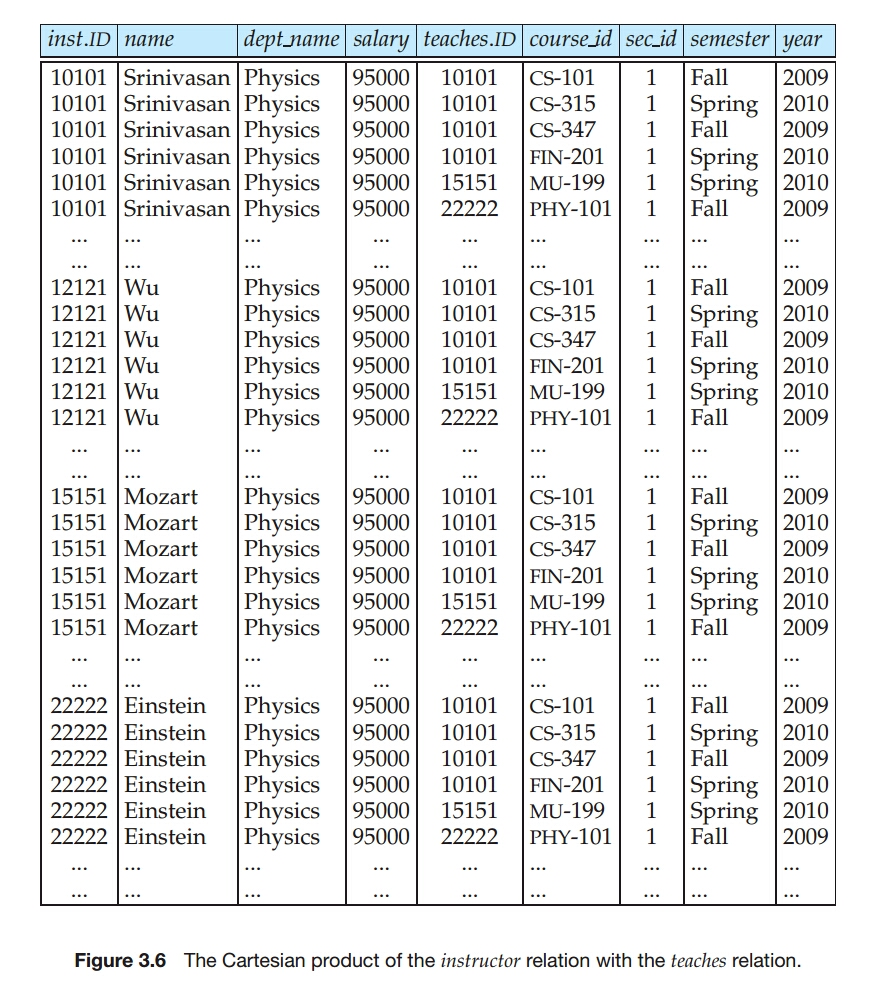
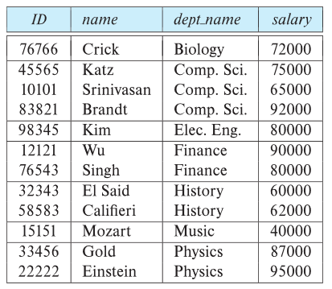
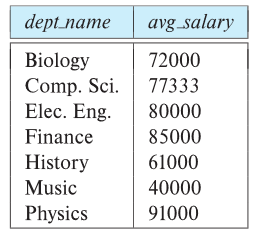

# Introduction to SQL
## Overview of the SQL Query Language
* The SQL language has several parts
* **Data-defintion language (DDL)**: The SQL DDL provides commands for defining relation schemas, deleting relations, and modifying relation schemas.
* **Data-manipulation language (DML)**: The SQL DML provides the ability to query information from the database and to insert tuples into, delete tuples from, and modify tuples in the database.
* Integrity: The DDL includes commands for specifying integrity constraints.
* View definition: The DDL includes commands for defining views.
* Transaction control: Includes commands for specifying the beginning and ending of transactions.
* Embedded  SQL and dynamic SQL: Define how SQL statements can be embedded within general-purpose programming languages.
* Authorization: Includes commands for specifying access rights to relations and views.

## SQL Data Definition
* DDL allows the specification of information about relations, including:
    * The schema for each relation.
    * The type of values associated with each attribute.
    * The Integrity constraints.
    * The set of indices to be maintained for each relation.
    * Security and authorization information for each relation.
    * The physical storage structure of each relation on disk.

### Basic Types
* **char(n)**: Fixed length character string, with user-specified length n.
* **varchar(n)**: Variable length character strings, with user-specified maximum length n.
* **int**: Integer (a finite subset of the integers that is machine-dependent).
* **smallint**: Small integer (a machine-dependent subset of the integer domain type).
* **numeric(p,d)**: Fixed point number, with user-specified precision of p digits, with d digits to the right of decimal point. 
    * e.g. numeric(3,1), allows 44.5 to be stores exactly, but not 444.5 or 0.32.
* **real, double precision**: Floating point and double-precision floating point numbers, with machine-dependent precision.
* **float(n)**: Floating point number, with user-specified precision of at least n digits.
* Each type may include a special value called the **null** value.

### Basic Schema Definition
* An SQL relation is defined using the create table command

```sql
create table r
    (A_1D_1, A_2D_2, ..., A_nD_n, 
        (integrity-constraint_1), 
        ...,
        (integrity-constraint_k));
```

* r is the name of the relation.
* each A_i is an attribute name in the schma of relation r
* D_i is the data type of values in the domain of attribute A_i.
* e.g.

```sql
create table instructor
    (ID char(5),
     name   varchar(20),
     dept_name  varchar(20),
     salary numeric(8, 2));
```

### Integrity Constraints in Create Table
* Types of integrity constraints
    * primary key(A_1, ..., A_n)
    * foreign key(A_m, ..., A_n) references r
    * not null
* SQL prevents any update to the database that violates an integrity constraint.
* e.g.

```sql
create table instructor (
    ID char(5),
    name   varchar(20) not null,
    dept_name  varchar(20),
    salary numeric(8, 2),
    primary key(ID),
    foreign key (dept_name) references department);
```

### More Examples of Relation Definitions
```sql
create table department (
    dept_name   varchar(20),
    building    varchar(15),
    budget  numeric(12,2),
    primary key (dept_name));
```
```sql
create table course (
    course_id   varchar(7),
    title   varchar(50),
    dept_name   varchar(20),
    credits numeric(2, 0),
    primary key (course_id),
    foreign key (dept_name) references department);
```
```sql
create table teaches (
    ID  varchar(5),
    course_id   varchar(8),
    sec_id  varchar(8),
    semester    varchar(6),
    year    numeric(4, 0),
    primary key (ID, course_id, sec_id, semester, year),
    foreign key (course_id, sec_id, semester, year) references sections,
    foreign key (ID) references instructor);

```

### Updates to tables
* **Insert**
* Insert new tuples into the relation.

```sql
insert into instructor values ('10211', 'Smith', 'Biology', 66000);
```

* **Delete**
* Remove all tuples from the relation.

```sql
delete from student
```

* **Drop**
* Remove a relation from the SQL database.
* After relation is dropped, no tuples can be inserted into relation unless it is re-created with create command.

```sql
drop table r;
```

* **Alter**
* Add attributes to an existing relation.
    * where A is the name of the attribute to be added to relation r and D is the domain of A.
    * All existing tuples in the relation are assigned *null* as the value for the new attribute.

```sql
alter table r add A D;
```

* Or, can drop attribute from a relation.
    * where A is the name of attribute of relation r.
    * dropping of attributes not supported by many databases.

```sql
alter table r drop A;
```

## Basic Structure of SQL Queries
* The basic structure of an SQL query consists of three clauses: **select**, **from** and **where**.
* A typical SQL query has the form
    * A_i represents an attribute
    * R_i represents a relation
    * P is a predicate
* The result of an SQL query is a relation.

```sql
select A_1, A_2, ... , A_n
from r_1, r_2, ..., r_m
where P
```

### The Select Clause
* The **select** clause lists the attributes desired in the result of a query, corresponds to the **projection operation** of the relational algebra.
* NOTE: SQL names are case insensitive.

```sql
--find the names of all instructors
select name
from instructor;
```

* SQL allows duplicate in relations as well as in query results.
* To force the elimination of duplicates, insert the keyword **distinct** after select.

```sql
--find the department names of all instructors, and remove duplicates
select distinct dept_name
from instructor;
```

* The keyword **all** specifies that duplicate should not be removed(default).

```sql
--find dept_name of all instructors
select all dept_name
from instructor;
```

* An asterisk in the select clause denotes **"all attributes"**.

```sql
--find all attributes of all instructors
select *
from instructor;
```

* An attribute can be literal with no **from** caluse.

```sql
--Result is a table with one column and a single row with value "437"
select '437';

--Can give the column a name
select '437' as FOO;
```

* An Attribute can be a literal with **from** clause.
    * Result is a table with one column and N rows, each row with value "A".
        * N is the number of tuples in the instructor table.

```sql
select 'A'
from instructor;
```

* The select clause can contain arithmetic expressions involving the operation, +, -, * and /, and operating on constants or attributes of tuples.

```sql
select ID, name, salary / 12
from instructor;
```

* would return a relation that is the same as the instructor relation.
    * except that the value of the attribute salary is divided by 12.
* Can rename "salary/12" using the **as** caluse.

```sql
select ID, name, salary / 12 as monthly_salary
from instructor;
```

## The Where Clause
* The **where** caluse specifies conditions that the result must satisfy, corresponds to the **selection predicate** of the relational algebra.

```sql
--to find all instructors in Comp. Sci. dept
select name
from instructor
where dept_name = 'Comp. Sci.';
```

* SQL allows the use of the logical connectives **and**, **or**, and **not**.
* The operands of the logical connectives can be expressions involving the comparison operators <, <=, >, >=, = and <>.
* Comparisions can be applied to results of arithmetic expressions.

```sql
--to find all instructors in Comp. Sci. dept with salary > 70000
select name
from instructor
where dept_name = 'Comp. Sci' and salary > 70000
```

## The From Clause
* The **from** clause lists the relations involed in the query, corresponds to the **Cartesian product operation** of the realational algebra.

```sql
--find the Cartesian product instructor X teaches
select *
from instructor, teaches;
```

* generares every possible instrutor - teaches pair, with all attributes from both relations.
* For common attributes, the attributes in the resuluting table are renamed using the relation name.
    * e.g. ID -> instructor.ID
* Cartesian product not very useful directly, but useful combined with where clause condition.
    * selection operation in relational algebra.

* Find the names of all instructors who have taught some course and the course_id.

```sql
select name, course_id
from instructor, teaches
where instructor.ID = teaches.ID;
```

* Find the names of all instructors in the Art  department who have taught some course and the course_id

```sql
select name, course_id
from instructor, teaches
where instructor.ID = teaches.ID and instructor.dept_name = 'Art';
```

### Queries on Multiple Relations
* Queries oftn need to access information from multiple relations.

```sql
--retrieve the names of all instructors, along with their department names and department building name
select name, instructor.dept_name, building
from instructor, department
where instructor.dept_name = department.dept_name;
```

* Note that the attribute dept_name occurs in both relations, and the relation name is used as a prefix to make clear to which attribute we are referring.
    * This naming convention requires that the relations that are present in the from clause have distinct names.

* A typical SQL query has the form

```sql
select A_1, A_2, ..., A_n
from r_1, r_2, ..., r_m
where P;
```

* Although the clauses must be written in the order **select, from, where**, the easiest way to understand the operations specified by the query is to consider the clauses in operational order: **from, where, select**.
* The from clause by itself defines a Cartesian product of the relations listed in the clause.
    * It is defined formally in terms of relational algebra, but it can also be understood as an iterative process that generates tuples for the result relation of the from clause.

```
for each tuple t_1 in relation r_1
    for each tuple t_2 in relation r_2
        ...
        for each tuple t_m in relation r_m
            Concatenate t_2, t_2, ..., t_m into a single tuple t
            Add t into the result relation
```

* The result relation has all attributes from all the relations in the from clause.
* For example, the relation schema for the Cartesian product of relations instructor and teaches is
    * (instructor.ID, name, dept_name, salary, teaches.ID, course_id, sec_id, semester, year)
    * The Cartesian product by itself combines tuples from instructor and teaches that are unrelated to each other.
        * *Each tuple in instructor is combined with every tuple in teaches, even those that refer to a different instrutor*.
        * The result can be and **extremely large relation**, and it rarely makes sense to create such a Cartesian product.

{: w="400" h = "460"}
*The Cartesian product of the instructor relation with the teaches relation*

* Instead, the predicate in the **where** clause is used to restrict the combinations created by the Cartesian product to those that are meaningful for the desired answer.
* In general, the meaning of an SQL query can be understood as follows.
    1. Generate a Cartesian product of the relations listed in the **from** clause.
    2. Apply the predicates specified in the **where** clause on the result of Step 1.
    3. For each tuple in the result of Step 2, output the attributes (or results of expressions) specified in the **select** clause.
    * This sequence of steps helps make *clear what the result of a SQL query should be, not how it should be executed*.
* If we omit the **where** clause condition in the preceding SQL query, it wiil output the Cartesian product, which could be a huge relation.
* Example Scenario
    * instructor relations has 200 tuples.
    * teaches relations has 600 tuples.
    * number of tuples that satisfy where clause 'instructor.ID = teaches.ID' is 10.
    * When using a where clause
        * 10 tuples in the result relation.
    * When not using a where clause
        * result relation is equal to Cartesian product.
        * 200 * 600 = 120,000 tuples in the result relation.

## Additional Basic Operations
### The Rename Operation
* The SQL allows renaming relations and attributes using the **as** clause.

```sql
old-name as new-name
```

```sql
--Find the names of all instructors who have a higher salary than some instructor in 'Comp. Sci'
select distinct T.name
from instructor as T, instructor as S
where T.salary > S.salary and S.dept_name = 'Comp. Sci.';
```

```sql
select name as instructor_name, course_id
from instructor, teaches
where instructor.ID = teaches.ID;
```

* Keyword as is optional and may be omitted.

```sql
select distinct T.name
from instructor T, instructor S
where T.salary > S.salary and S.dept_name = 'Comp. Sci.';
```

### String Operations
* SQL includes a string-matching operator for comparisons on character strings.
* The operator **like** uses patterns that are described using two special characters:
    * percent ( **%** ): The % character matches any substring.
    * underscore ( _ ): The _ character matches any character.
* SQL supports a variety of string operations such as
    * concatenation - using "||"
    * converting from upper to lower case (and vice versa)
    * finding string length
    * extracting substrings
    * etc

* Patterns are case sensitive. 
* Pattern matching examples:
    * 'Intro%' matches any string beginning with “Intro”.
    * '%Comp%' matches any string containing “Comp” as a substring.
    * '_ _ _' matches any string of exactly three characters.
    * '_ _ _ %' matches any string of at least three characters.

```sql
--Find the names of all instructors whose name includes the substring “dar”.
select name
from instructor
where name like '%dar%';
```

* For pattern to include the special pattern characters (that is, % and _), SQL allows the specification of an escape character.
* We define the escape character for a like comparison using the **escape** keyword.

```sql
--matches all strings beginning with "ab%cd"
like 'ab\%cd%' escape '\';

--matches all strings beginning with "ab\cd"
like 'ab\\cd%' escape '\';
```

* SQL allows us to search for mismatches instead of matches by using the **not like** comparison operator.

### Ordering the Display of Tuples
* The **order by** clause causes the tuples in the result of a query to appear in sorted order.

```sql
--To list in alphabetic order all instructors in the Physics department
select name
from instructor
where dept_name = 'Physics'
order by name;
```

* By default, the order by clause lists items in *ascending order*.
* To specify the sort order, we may specify **desc** for descending order of **asc** for ascending order.
* Ordering can be performed on multiple attributes.

```sql
/*
We wish to list the entire instructor relation in desc order of salary.
If several instructors have the same salary, we order them in asc order by name.
*/
select *
from instructor
order by salary desc, name asc;
```

### Where Clause Predicates
* SQL includes a **between** comparison operator.
    * simplify where clauses that specify that a value be less than or equal to some value and greater than or equal to some other value.

```sql
select name
from instructor
where salary between 90000 and 100000;

-- same query
select name
from instructor
where salary <= 100000 and salary >= 90000;
```

* We can use the **not between** comparison operator.
* The comparison operators can be used on tuples, and the ordering is defined lexicographically.

```sql
select name, course_id
from instructor, teaches
where instructor.ID = teaches.ID and dept_name = 'Biology';

--same query
select name, course_id
from instructor, teaches
where (instructor.ID, dept_name) = (teaches.ID, 'Biology');
```

## Set Operations
* The SQL operations **union**, **intersect** and **except** operate on relations and correspond to the mathmatical set operations $\cup, \cap, -$.

### The Union Operation
```sql
--find the set of all courses taught either in Fall 2017 or in Spring 2018, or both
(select course_id
 from section
 where semester = 'Fall' and year = 2017)
union
(select course_id
 from section
 where semester = 'Spring' and year = 2018);
```

* The union operation automatically eliminates duplicates.
* If we want to retain all duplicates, we must write **union all** in place of union.

### The Intersect Operation
```sql
--find the set of all courses taught in both the Fall 2017 and Spring 2018
(select course_id
 from section
 where semester = 'Fall' and year = 2017)
intersect
(select course_id
 from section
 where semester = 'Spring' and year = 2018);
```

* The intersect operation automatically eliminates duplicates.
* If we want to retain all duplicates, we must write **intersect all** in place of intersect.

### The Except Operation
```sql
--find the all courses taught in the Fall 2017 but not in the Spring 2018
(select course_id
 from section
 where semester = 'Fall' and year = 2017)
except
(select course_id
 from section
 where semester = 'Spring' and year = 2018);
```

* The operation automatically eliminates duplicates in the inputs before performing set difference.
* If we want to retain all duplicates, we must write **except all** in place of except.

## Null Value
* It is possible for tuples to have a null value, denoted by **null**, for some of their attributes.
    * signifies an unknown value or that a value does not exist.
* Null values present special problems in relational operations.
    * Arithmetic operations (involving +, -, *, /)
        * The result of an arithmetic expression is null if *any of the input values is null*.
        * e.g. 5 + null returns null
    * Comparison operations
        * e.g. "1 < null"
            * It would wrong to say this is true since we do not know what the null value represents.
            * But it would likewise be wrong to claim this expression is false.
                * if we did, "not(1 < null)" would evaluate to true.
        * SQL therefore treats as **unknown** the result of any comparison involving a null value.
            * Third logical value in addition to *true* and *false*.

* Since the predicate in a where clause can involve Boolean operations such as and, or, and not on the results of comparisons, the definitions of the Boolean operations are extended to deal with the value unknown.
    * and
        * *true* and *unknown* is *unknown*
        * *false* and *unknown* is *false*
        * *unknown* and *unknown* is *unknown*
    * or
        * *true* or *unknown* is *true*
        * *false* or *unknown* is *unknown*
        * *unknown* or *unknown* is *unknown*
    * not
        * not *unknown* is *unknown*
* Result of where clause predicate is treated as false if it evaluates to unknown.
* The predicate **is null** can be used to check for null values.
    * The predicate **is not null** succeeds if the value on which it is applied is not null.

```sql
--Find all instructors whose salary is null
select name
from instructor
where salary is null;
```

* SQL allows us to test whether the result of a comparison is unknown, rather than true or false, by using the clauses **is unknown** and **is not unknown**.

```sql
select name
from instructor
where salary > 10000 is unknown;
```

## Aggregate Functions
* Aggregate functions are functions that take a collection (a set or multiset) of values as input and return a *single value*.
* **avg**: average value
* **min**: minimum value
* **max**: maximum value
* **sum**: sum of values
* **count**: number of values

### Basic Aggregation
```sql
--find the average salary of instructors in the Comp. Sci.
select avg(salary) as avg_salary
from instructor
where dept_name = 'Comp. Sci.';
```

```sql
--find the total number of instructors who teaches a course in the Spring 2018
select count (distinct ID)
from teaches
where semester = 'Spring' and year = 2018;
```

```sql
--number of tuples in the course relation
select count(*)
from course;
```

* SQL does not allow the use of dinstinct with count(*).

### Aggregation with Grouping
* There are circumstances where we would like to apply the aggregate functions not only to a single set of tuples, but also to a group of sets of tuples.
    * we specify this in SQL using the **group by** clause.
* Tuple with the same value on all attributes in the group by clause are placed in one group.

{: w="340" h = "360"}

```sql
--find the average salary in each department
select dept_name, avg (salary) as avg_salary
from instructor
group by dept_name;
```

{: w="320" h = "340"}
*result*

* In this case the group by clause has been omitted, so the entire relation is treated as a single group.

```sql
select avg (salary)
from instructor;
```

```sql
--find the number of instructors in each department who teach a course in the Spring 2018
select dept_name, count (distinct ID) as instr_count
from instructor, teaches
where instructor.ID = teaches.ID and
    semester = 'Spring' and year = 2018
group by dept_name;
```

* It is important to ensure that the only attributes that appear in the select statement without being aggregated are those that are present in the group by clause.
    * Any attribute that is not present in the group by clause may appear in the select clause only as an argument to an aggregate function, otherwise the query is treated as erroneous.

```sql
--erroneous query: because of attribute "ID" in select clause
select dept_name, ID, avg (salary)
from instructor
group by dept_name;
```

### The Having Clause
* At times, it is useful to state a condition that applies to groups rather than to tuples.
* e.g. find departments where the average salary of the instructors is more than $42,000.
    * This condition does not apply to a single tuple.
    * Rather, it applies to each group constructed by the group by clause.
* To express such a query, we use the **having** clause of SQL.

```sql
--find departments where the average salary of the instructors is more than $42,000
select dept_name, avg (salary) as avg_salary
from instructor
group by dept_name
having avg (salary) > 42000;
```

* As was the case for the select clause, any attribute that is present in the having clause without being aggregated must appear in the group by clause, otherwise the query is errorneous.
* This meaning of a query containing aggregation, group by, or having clauses is defined by the following sequence of operations.
    1. As was the case for queries without aggregation, the **from** clause is first evaluated to get a relation.
    2. If a **where** clause is present, the predicate in the where clause is applied on the result relation of the from clause.
    3. Tuples satisfying the where predicate are then place into groups by the **group by** clause if it is present.
        * If the group by clause is absent, the entire set of tuples satisfying the where predicate is treated as being in one group.
    4. The **having** clause, if it present, is applied to each group.
        * The groups that do not satisfy the having clause predicate are removed.
    5. The **select** clause uses the remaining groups to generate tuples of the result of the query, applying the aggregate functions to get a single result tuple for each group.

```sql
--for each course section offered in 2017, find the average total credits of all students enrolled in the section, if the section has at leat 2 students
select course_id, semester, year, sec_id, avg (total_cred)
from student, takes
where student.ID = takes.ID and year = 2017
group by course_id, semester, year, sec_id
having count (ID) >= 2;
```

### Aggreation with Null and Boolean Values
* All aggregate functions except **count (*)** ignore null values in their input collection.
* The count of an empty collections is defined to be 0, and all other aggregate operations return a value of null when applied on an empty collection.
* The aggregate functions **some** and **every** can be applied on a collection of Boolean values, and compute the disjunction (**or**) and conjunction (**and**), respectively, of the values.

## Nested Subqueries
* SQL provides a mechanism for the nesting of subqueries. 
    * A **subquery** is a select-from-where expression that is nested within another query.

```sql
select A_1, A_2, ..., A_n
from r_1, r_2, ..., r_m
where P
```

* From clause: r_i can be replaced by any valid subquery.
* Where clause: P can be replaced with an expression of the form: B <operation> (subquery)
    * B is an attribute and <operation> to be defined later.
* Select clause: A_i can be replaced be a subquery that generates a single value.

### Set Membership
* SQL allows testing tuples for membership in a relation.
    * The **in** connective tests for set membership, where the set is a collection of values produced by a select clause.
    * The **not in** connective tests for the absence of set membership.

```sql
--find courses offered in Fall 2017 and in Spring 2018
select distinct course_id
from section
where semester = 'Fall' and year = 2017 and
    course_id in (select course_id
                  from section
                  where semester = 'Spring' and year = 2018);
```
```sql
--find courses offered in Fall 2017 but not in Spring 2018
select distinct course_id
from section
where semester = 'Fall' and year = 2017 and
    course_id not in (select course_id
                      from section
                      where semester = 'Spring' and year = 2018);
```

* The in and not in operators can also be used on enumerated sets.

```sql
--select the names of instructors whose names are neither Mozart nor Einstein
select distinct name
from instructor
where name not in ('Mozart', 'Einstein');
```
```sql
--Find the total number of (distinct) students who have taken course sections taught by the instructor with ID 10101
select count (distinct ID)
from takes
where (course_id, sec_id, semester, year) in (select course_id, sec_id, semester, year
                                              from teaches
                                              where teaches.ID = '10101');
```

### Set Comparison
```sql
--Find names of instructors with salary greater than that of some (at least one) instructor in the Biology department.
select distinct T.name
from instructor as T, instructor as S
where T.salary > S.salary and S.dept_name = 'Biology';
```

* The phrase "greater than at least one" is represented in SQL by **> some**.

```sql
--Find names of instructors with salary greater than that of some (at least one) instructor in the Biology department.
select distinct name
from instructor
where salary > some (select salary
                     from instructor
                     where dept_name = 'Biology');
```

* The > some comparison in the where clause of the outer select is true if the salary value of the tuple is greater than at least one member of the set of all salary values for instructors in Biology.
* SQL also allows < some, <= some, >= some, = some and <> some comparison.
    * Verify that =some is identical to in, whereas <>some is *not* the same as not in.

```sql
--Find the names of all instructors whose salary is greater than the salary of all instructors in the Biology department.
select name
from instructor
where salary > all (select salary
                    from instructor
                    where dept_name = 'Biology')
```

* As it does for some, SQL also allows < all, <= all, >= all, = all and <> all comparison.
    * Verify that <> all is identical to not in, whereas = all is *not* the same as in.

```sql
--find the departments that have the highest average salary
select dept_name
from instructor
group by dept_name
having avg (salary) >= all (select avg (salary)
                            from instructor
                            group by dept_name);
```

### Test for Empty Relations
* The **exists** construct returns the value true if the argument subquery is nonempty.

```sql
--Find all courses taught in both the Fall 2017 semester and in the Spring 2018 semester
select course_id
from section as S
where semester = 'Fall' and year = 2017 and
    exists (select *
            from section as T
            where semester = 'Spring' and year = 2018 and
                S.course_id = T.course_id);
```

* The above query illustrates a feature of SQL where a **correlation name** from an outer query (S in the above query), can be used in a subquery in the where clause.
* A subquery that uses a correlation name from an outer query is called a **correlated query**.

* We can use the **not exists** construct to simulate the set containment operation.
    * First nested query lists all courses offered in Biology.
    * Second nested query lists all courses a particular student took.

```sql
--Find all students who have taken all courses offered in the Biology department
select S.ID, S.name
from student as S
where not exists ((select course_id
                   from course
                   where dept_name = 'Biology')
                   except
                   (select T.course_id
                    from takes as T
                    where S.ID = T.ID));
```

Note: Cannot write this query using = all and its variants.

```sql
--find the total number of (distinct) students who have taken course sections taught by the instructor with ID 110011
select count (distinct ID)
from takes
where exists (select course_id, sec_id, semester, year
              from teaches
              where teaches.Id = '110011'
                and takes.course_id = teaches.course_id
                and takes.sec_id = teaches.sec_id
                and takes.semester = teaches.semester
                and takes.year- = teaches.year);
```

### Test for the Absence of Duplicate Tuples
* The **unique** construct tests whether a subquery has any duplicate tuples in its result.
* The unique construct evaluates to *true* if a given subquery contains no duplicates.

```sql
--Find all courses that were offered at most once in 2017
select T.course_id
from course as T
where unique (select R.course_id
              from section as R
              where T.course_id = R.course_id and
                    R.year = 2017);

```

* Note that if a course were not offered in 2017, the subquery would return an empty result, and the unique predicate would evaluate to **true** on the empty set.

```sql
--Find all courses that were offered at most once in 2017
select T.course_id
from course as T
where 1 >= (select count(R.course_id)
            from section as R
            where T.course_id = R.course_id and
                  R.year = 2017);
```

* We can test for the existence of duplicate tuples in a subquery by using the **not unique** construct.

```sql
select T.course_id
from course as T
where not unique (select R.course_id
                  from section as R
                  where T.course_id = R.course_id and
                        R.year = 2017);
```

* Formally, the unique test on a relation is defined to fail if and only if the relation contains two distinct tuples t_1 and t_2 such that t_1 = t_2.

### Subqueries in the From Clause
* SQL allows a subquery expression to be used in the from clause

```sql
--Find the average instructors’ salaries of those departments where the average salary is greater than $42,000.”
select dept_name, avg_salary
from (select dept_name, avg (salary) as avg_salary
      from instructor
      group by dept_name)
where avg_salary > 42000;
```

* Note that we do not need to use the having clause, since the subquery in the from clause computes the average salary, and the predicate that was in the having caluse earlier is now in the where clause of the outer query.

```sql
--Find the average instructors’ salaries of those departments where the average salary is greater than $42,000.”
select dept_name, avg_salary
from (select dept_name, avg (salary)
      from instructor
      group by dept_name)
      as dept_avg (dept_name, avg_salary)
where avg_salary > 42000;
```

```sql
--find the maximum across all departments of the total of all instructors' salaries in each department
select max (tot_salary)
from (select dept_name, sum(salary)
      from instructor
      group by dept_name) as dept_total (dept_name, tot_salary);
```

```sql
--print the names of each instructor, along with their salary and the average salary in their department
select name, salary, avg_salary
from instructor I1, lateral (select avg (salary) as avg_salary
                             from instructor I2
                             where I2.dept_name = I1.dept_name);
```

* Without the **lateral** clause, the subquery cannot access the correlation variable I1 from the outer query.

### The With Clause
* The **with** clause provides a way of defining a temporary relation whose definition is available only to the query in which the with clause occurs. 

```sql
--Find all departments with the maximum budget 
with max_budget (value) as
     (select max (budget)
      from department)
select budget
from department, max_budget
where department.budget = max_budget.value;
```

* Using nested subqueries would have mad the query harder to read and understand.
* The with clause makes the query logic clearer; it also permits this temporary relation to be used in multiple palces within a query.

```sql
--find all departments where the total salary is greater thatn the average of the total salary at all department
with dept_total (dept_name, value) as 
    (select dept_name, sum (salary)
    from instructor
    group by dept_name),
dept_total_avg (value) as
    (select avg (value)
    from dept_total)
select dept_name
from dept_total, dept_total_avg
where dept_total.value > dept_total_avg.value;
```

### Scalar Subqueries
* Scalar subquery is one which is used where a single value is expected.
    * Runtime error if subquery returns more than one result tuple.

```sql
--List all departments along with the number of instructors in each department
select dept_name
    (select count (*)
     from instructor
     where department.dept_name = instructor.dept_name)
    as num_instructors
from department;
```

* Note tha technically the type of a scalar subquery result is still a relation, even if it contains a single tuple.

### Scalar Without a From Clause
```sql
(select count (*) from teaches) / (select count (*) from instructor);
```

```sql
select (select count (*) from teaches) / (select count (*) from instructor)
from dual;
```
## Modification of the Database
### Deletion
* A **deletion** request is expressed in much the same way as a query.
* We can delete only whole tuples.
    * We cannot delete values on only particular attributes.
    * Delete command operates on only one relation.

```sql
delete from r
where P;
```

```sql
--delete all tuples from the instructor
delete from instructor;
```

* The instructor relation itself still exists, but it is empty.

```sql
--delete all tuples in the instructor relation pertaining to instructors in the Finance department
delete from instructor
where dept_name = 'Finance';
```

```sql
--delete all instructors with a salary between $13,000 and $15,000
delete from instructor
where salary between 13000 and 15000;
```

```sql
--delete all tuples in the instructor relation for those instructors associated with a department located in the Waston building
delete from instructor
where dept_name in (select dept_name
                    from department
                    where building = 'Waston');
```

* Problem: as we delete tuples from instructor, the average salary changes.

```sql
--Delete all instructors whose salary is less than the average salary of instructors
delete from instructor
where salary < (select avg (salary)
                from instructor);
```

* Solution used in SQL:
    1. First, compute avg (salary) and find all tuples to delete.
    2. Next, delete all tuples found above (without recomputing avg or retesting the tuples).

### Insertion
* The simpleset **insert** statement is a request to insert one tuple.
    * The attribute values for inserted tuples must be members of the corresponding attribute's domain.
    * Tuples inserted must have the correct number of attribute.

```sql
--Add a new tuple to course
insert into course values ('CS-437', 'Database Systems', 'Comp. Sci.', 4);
--equivalently
insert into course (course_id, title, dept_name, credits) values ('CS-437', 'Database Systems', 'Comp. Sci.', 4);
--also equivalently
insert into course (title, course_id, credits, dept_name) values ('Database Systems', 'CS-437', 4,'Comp. Sci.');
```

```sql
--Add a new tuple to student  with tot_creds set to null
insert into student values ('3003', 'Green', 'Finance', null);
```

* We can insert tuples on the basis of the result of a query.

```sql
--Make each student in the Music department who has earned more than 144 credit hours an instructor in the Music department with a salary of $18,000.
insert into instructor
       select ID, name, dept_name, 18000
       from student
       where dept_name = 'Music' and tot_cred > 144;
```

* The select from where statement is evaluated fully before any of its results are inserted into the relation.

```sql
--This request might insert an infinite number of tuples, if the primary key constraint on student were absent.
insert into student
       select *
       from student;
```

### Updates
* With **update** statement, We can change a value in tuple without changing all values in the tuples.

```sql
--Give  a  5% salary raise to all instructors
update instructor
set salary = salary * 1.05;

--Give  a 5% salary raise to those instructors who earn less than 70000
update instructor
set salary = salary * 1.05;
where salary < 70000;
```

* A nested select within an update statement may reference the relation that is being updated.

```sql
--Give  a 5% salary raise to instructors whose salary is less than average
update instructor
set salary = salary * 1.05
where salary < (select avg (salary)
                from instructor);
```

* The order is important.

```sql
--Increase salaries of instructors whose salary is over $100,000 by 3%, and all others by a 5% 
update instructor
set salary = salary * 1.03
where salary > 100000;

update instructor
set salary = salary * 1.05
where salary <= 100000;
```

* If we changed the order of the two statement, an instructor with a salary just under $100,000 would receive a raise of over *%.
    * Can be done better using the **case** statement.

```sql
--Increase salaries of instructors whose salary is over $100,000 by 3%, and all others by a 5% 
update instructor
set salary = case
                when salary <= 100000 then salary * 1.05
                else salary * 1.03
            end;
```

* Scalar subqueries are useful in SQL update statement, where they can be used in the set clause.

```sql
--Recompute and update tot_creds value for all students
update student
set tot_cred = (
    select sum (credits)
    from takes, course
    where student.ID = takes.ID and
            takes.course_id = course.course_id and
            takes.grade <> 'F' and
            takes.grade is not null);
```

* Sets tot_creds to null for students who have not taken any course.
* Instead of sum(credits), use:

```sql
select case 
        when sum (credits) is not null then sum (credits)
        else 0
        end;
```
