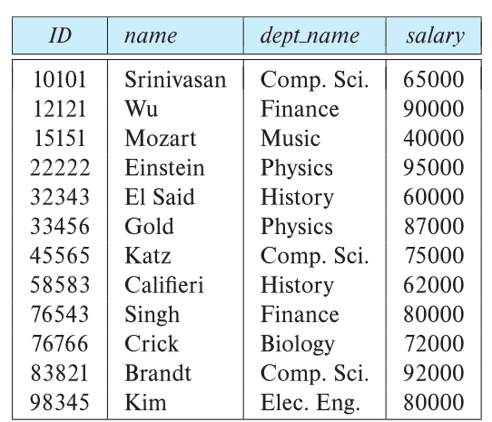
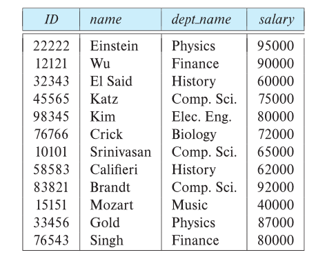
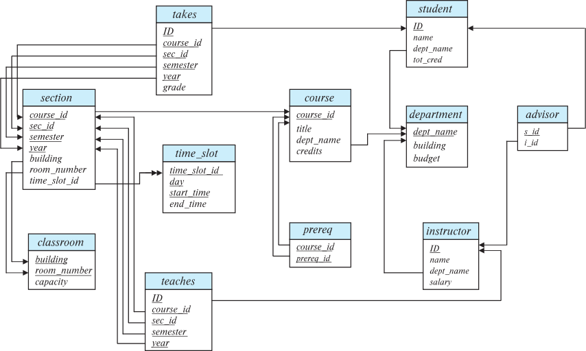
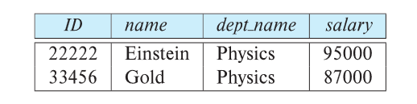
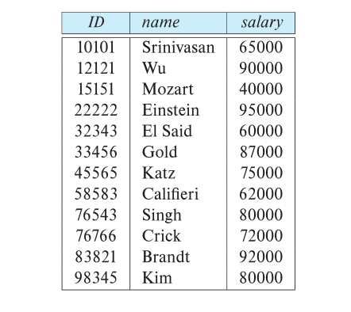
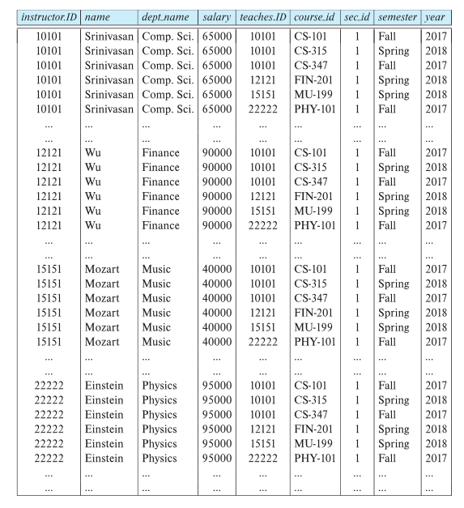
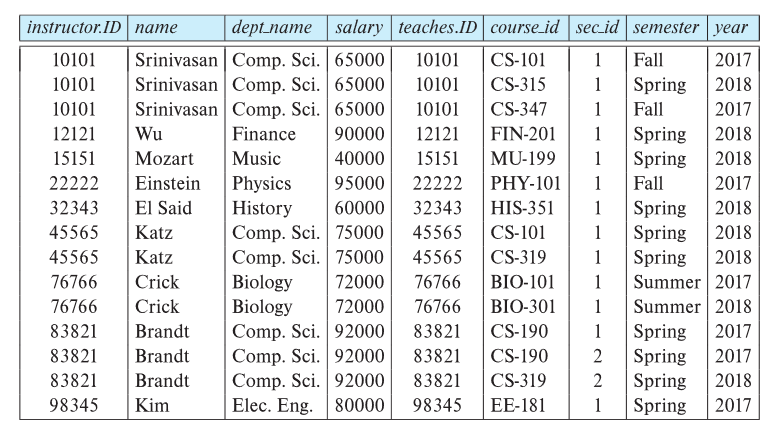
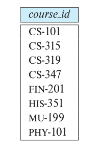
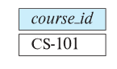
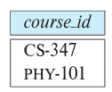

# Relational Model
{: w="30%"}
*Example of a Instructor  Relation*

## Structure of Relational Databases
* A relational database consists of a collection of **tables**, each of which is assigned a unique name.
* In the realational model the term **relation** is used to refer to a table.
    * e.g. *instructor* is a relation(or a table).
    * While the term **tuple** is used to refer to a row.
        * e.g. (10101, Srinivasan, Comp.Sci., 65000) is a tuple.
    * Similary, the term **attribute** refers to a column of a table.
        * e.g. *dept_name* is a attribute.

### Relation Schema and Instacne
* $A_1, A_2, ..., A_n$ are attributes.
* $R = (A_1, A_2, ..., A_n)$ is a realtional schema.
    * e.g. *instructor* = *(ID, name, dept_name, salary)*
* A relational instance *r* defined over schema *R* is denoted by *r(R)*.
* The current values a relation are specified by a table.
* An element ***t*** of relation ***r*** is called a *tuple* and is represented by a *row* in a table.

### Attributes
* The set of allowed values for each attribute is called the **domain** of the attribute.
* Attribute values are (normally) required to be **atomic**.
    * that is, indivisible.
* The special value **null** is a member of every domain.
    * Indicated that the value is *unknown* or *does not exist*.
* The null value causes complications in the definition of many operations.

### Relations are Unordered
* Order of tuples is irrelevant.
    * tuples may be stored in an arbitrary order.
    * e.g. *instructor* relation with unordered tuples.

## Database Schema
* The concept of a relation corresponds to the programming-language notion of a variable, while the concept of a **relation schema** corresponds to the programming-language notion of type definition.
* **Database Schema**: The logical structure of the database.
* **Database Instance**: A snapshot of the data in the database at a given instant in time.
* Example
    * schema: *instructor(ID, name, dept_name, salary)*

{: w="30%"}
*Example of a Instance*

## Keys
* Let $K \subseteq R$
* *K* is a **superkey** of *R* if values for *K* are sufficient to *identify a unique tuple* of each possible relation *r(R)*.
    * 즉, 고유식별자 여부는 column의 내용이 아닌 속성의 정의를 통해 판단
    * e.g. *{ID}* and *{ID, name}* are both superkyes of *instructor*.
* Superky *K* is a **candidate key** if *K* is minimal.
    * e.g *{ID}* is a candidate key for *instructor*.
* One of the candidate keys is selected to be the **primary key**.
    * Chosen by the database designer.
* **Primary key constraint**
    * The Primary key constraint uniquely identifies each record in a table.
    * Primary keys must contain UNIQUE values, and cannot contain NULL values.
    * A table can have only ONE primary key; and in the table, this primary key can consist of single or multiple columns (fields).
* **Foreign key constraint**: Value in one relation must appear in another
    * **Referencing** relation
    * **Referenced** relation
    * e.g. *dept_name* in *instructor* is a foreign key from *instructor* referencing *department*.
    * 다음 스키마 다이어그램을 보면, *instructor*의 *dept_name*은 *department*의 *dept_name*을 참조.
        * 이때, *instructor*의 *dept_name*을 외래키라고 함.
        * 참조당하는 쪽(이 경우 *department*의 *dept_name*)은 항상 테이블의 primary key여야 함.
        * *instructor*의 *dept_name*의 값들은 **반드시** *department*의 *dept_name*에 존재해야 함.
            * 그 역은 존재하지 않아도 됨.
            * *instructor*측에 null값이 존재하는 경우도 *department*에 존재하지 않아도 됨.
                * primary key는 null 값을 가질 수 없기 때문.

## Schema Diagrams
* A database schema, along with primary key and foregin key constraints, can be depicted by **schema diagrams**.

{: w="40%"}
*Schema Diagram for University Database*

* Primary key attributes are show underlined.
* *takes* 테이블의 외래키는 2개.
    * *ID*
    * *{course_id, sec_id, semester, year}*
* *time_slot* 테이블의 *time_slot_id*는 외래키가 아님.
    * *section* 테이블의 *time_slot_id*를 단순 참조 중.
    * *section* 테이블의 *time_slot_id*이 primary key가 아니기 때문.

## Relational Query Languages
* A **query language** is a language in which a user requests information from the database.
    * **Imperative query language**: The user instructs the system to perform a specific sequence of operations on the database to compute the desired result.
        * Such languages usually have a notion of state variables, which are updated in the course of the computation.
    * **Functional query language**: The computation is expressed as the evaluation of functions that may operate on data in the database or on the results of other functions.
        * Functions are side-effect free, and they do not update the program site.
    * **Declarative query language**: The user describes the desired information without giving a specific sequence of steps of functions calls for obtaining that information.
        * The desired information is typically described using some form of mathematical logic.
* Procedural versus non-procedural, or declarative
* “Pure” languages
    * Relational algebra
    * Tuple relational calculus
    * Domain relational calculus
* The above 3 pure languages are equivalent in computing power
* We will concentrate in this chapter on relational algebra
    * Not Turing-machine equivalent
    * Consists of 6 basic operations

## The Realtional Algebra
* A  procedural language consisting  of a set of operations that take one or two relations as input and produce a new relation as their result. 
* Six basic operators
    * select: $\sigma$
    * project: $\Pi$
    * union: $\cup$
    * set difference: $-$
    * Cartesian product: $\times$
    * rename: $\rho$

### Select Operation
* The **select** operation selects tuples that satisfy a given predicate.
* Notation: $\sigma_{p}(r)$
* *p* is called the **selection predicate**.
* e.g. select those tuples of the *instructor* relation where the instructor is in the “Physics” department.
    * $\sigma_{dept \\_ name = "Physics"}(instructor)$

{: w="30%"}
*Result*

* We allow compasions using $=, \neq, >, \geq, <, \leq$ in the selection predicate.
* We can combine several predicates into a larger predicate by using the connectives.
    * $\wedge, \vee, \neg$
    * e.g. find the instructors in Physics with a salary greater $90,000
        * $\sigma_{dept \\_ name = "Physics" \wedge salary > 90000}(instructor)$
* The select predicate may  include comparisons between two attributes.
    * e.g. find all departments whose name is the same as their building name
        * $\sigma_{dept \\_ name = building}(department)$

### Project Operation
* A unary operation that returns its argument relation, with certain attributes left out.
* Notation: $\Pi_{A_1, A_2, A_3, ..., A_k}(r)$ where $A_1, A_2, A_3, ..., A_k$ are attribute names and *r* is a relation name.
* The result is defined as the relation of *k* columns obtained by erasing the columns that are not listed.
* Duplicate rows removed from result, since relations are sets
* e.g. eliminate the dept_name attribute of instructor
    * $\Pi_{ID, name, salary}(instructor)$

{: w="26.67%"}
*Result*

### Composition of Relational Operations
* The result of a relational-algebra operation is relation  and therefore of relational-algebra operations can be composed together into a **relational-algebra expression**.
* e.g. find the names of all instructors in the Physics department.
    * $\Pi_{name}(\sigma_{dept \\_ name = "Physics"}(instructor))$
* Instead of giving the name of a relation as the argument of the projection operation, we give an expression that evaluates to a relation.

### Cartesian-Product Operation
* The Cartesian-product operation (denoted by $\times$)  allows us to combine information from any two relations.  
* e.g. the Cartesian product of the relations *instructor* and *teaches*
    * $instructor \times teaches$
* We construct a tuple of the result out of each possible pair of tuples.
    * one from the *instructor* relation and one from the *teaches* relation.
* Since the instructor *ID* appears in both relations we distinguish between these attribute by attaching to the attribute the name of the relation from which the attribute originally came.
    * instructor.ID
    * teaches.ID

{: w="31.67%"}
*The  instructor  X  teaches  table*

### Join Operation
* The Cartesian-Product $instructor \times teaches$ associates every  tuple of instructor with every tuple of teaches.
    * Most of the resulting rows have information about instructors who did NOT teach a particular course. 
* To get only those tuples of  “instructor  X  teaches “ that pertain to instructors and the courses that they taught, we write:
    * $\sigma_{instructor.id = teaches.id}(instructor \times teaches)$
    * We get only those tuples of “instructor  X  teaches” that pertain to instructors and the courses that they taught.

{: w="35%"}
*Result*

* The **join** operation allows us to combine a select operation and a Cartesian-Product operation into a single operation.
* Consider relations *r(R)* and *s(S)*.
* Let  “theta” be a predicate on attributes in the schema R “union” S
    * The join operation  $r \Join_\theta s$ is defined as follows
        *  $r \Join_\theta s = \sigma_\theta(r \times s)$
* Ths, $\sigma_{instructor.id = teaches.id}(instructor \times teaches)$ can equivalently be written as $instructor \Join_{instructor.id = teaches.id} teaches$.

### Union Operation
* The union operation allows us to combine two realtions.
* Notation: $r \cup s$
* For $r \cup s$ to be valid
    1. *r, s* must have the same **arity**(same number of attributes).
    2. The attribute domains must be **compatible**. 
        * e.g. Second column of *r* deals with the same type of values as does the second column of *s*.
* e.g. to find all courses taught in the Fall 2017 semester, or in the Spring 2018 semester, or in both
    * $\Pi_{course \\_ id}(\sigma_{semester = "Fall" \wedge year = 2017}(section)) \cup \Pi_{course \\_ id}(\sigma_{semester = "Spring" \wedge year = 2018}(section))$

{: w="25%"}
*Result*

### Set-Intersection Operation
* The  set-intersection  operation  allows us to find tuples that are in both the input relations.
* Notation: $r \cap s$
* Assume
    * *r, s* have the same arity.
    * attributes of *r* and *s* are compatible.
* e.g. Find the set of all courses taught in both the Fall 2017 and the Spring 2018 semesters.
    * $\Pi_{course \\_ id}(\sigma_{semester = "Fall" \wedge year = 2017}(section)) \cap \Pi_{course \\_ id}(\sigma_{semester = "Spring" \wedge year = 2018}(section))$

{: w="25%"}
*Result*

### Set Difference Operation
* The set-difference operation allows us to find tuples that are in one relation but are not in another. 
* Notation: $r - s$
* Set differences must be taken between **compatible** relations.
    * *r* and *s* have the same arity.
    * attribute domains of *r* and *s* must be compatible.
* e.g. to find all courses taught in the Fall 2017 semester, but not in the Spring 2018 semester.
    * $\Pi_{course \\_ id}(\sigma_{semester = "Fall" \wedge year = 2017}(section)) - \Pi_{course \\_ id}(\sigma_{semester = "Spring" \wedge year = 2018}(section))$

{: w="25%"}
*Result*

### The Assignment  Operation 
* It is convenient at times to write a relational-algebra expression by assigning parts of it to temporary relation variables.  
* The assignment  operation is  denoted by $\leftarrow$ and works like assignment in a programming language.
* e.g. Find all instructor in the “Physics” and Music department.
    * $Physics \leftarrow \sigma_{dept \\_ name = "Physics"}(instructor)$
    * $Music \leftarrow \sigma_{dept \\_ name = "Music"}(instructor)$
    * $Physics \cup Music$
* With the assignment operation, a query can be written as a sequential program consisting of a series of assignments followed by an expression whose value is displayed as the result of the query.

### The Rename Operation
* The results of relational-algebra expressions do not have a name that we can use to refer to them.  The  rename operator, $\rho$ , is provided  for that purpose.
* The expression: $\rho_x(E)$ returns the result of expression *E* under the name *x*.
* Another form of the rename operation: $\rho_{x(A1, A2, ..., An)}(E)$

### Equivalent Queries
* There is more than one way to write a query in relational algebra. 
* e.g. Find information about courses taught by instructors in the Physics department with salary greater than 90,000.
    * $\sigma_{dept \\_ name = "Physics" \wedge salary > 90000}(instructor)$
    * $\sigma_{dept \\_ name = "Physics"}(\sigma_{salary > 90000}(instructor))$
* e.g. Find information about courses taught by instructors in the Physics department.
    * $\sigma_{dept \\_ name = "Physics"}(instructor \Join_{instructor.ID = teaches.ID} teaches)$
    * $(\sigma_{dept \\_ name = "Physics"}(instructor)) \Join_{instructor.ID = teaches.ID} teaches$
* The two queries are not identical; they are, however, equivalent.
    * they give the same result on any database.

