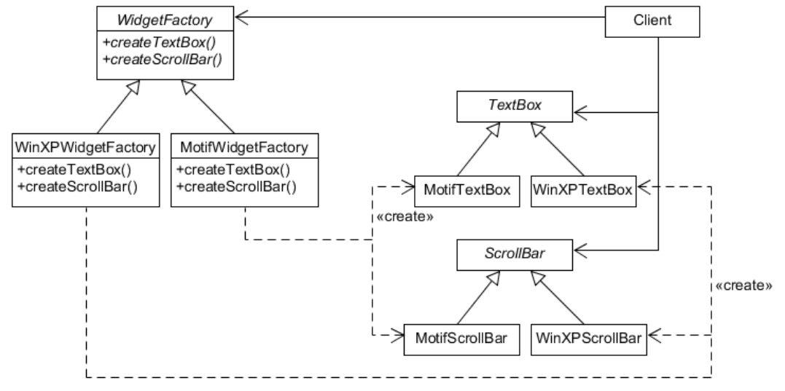
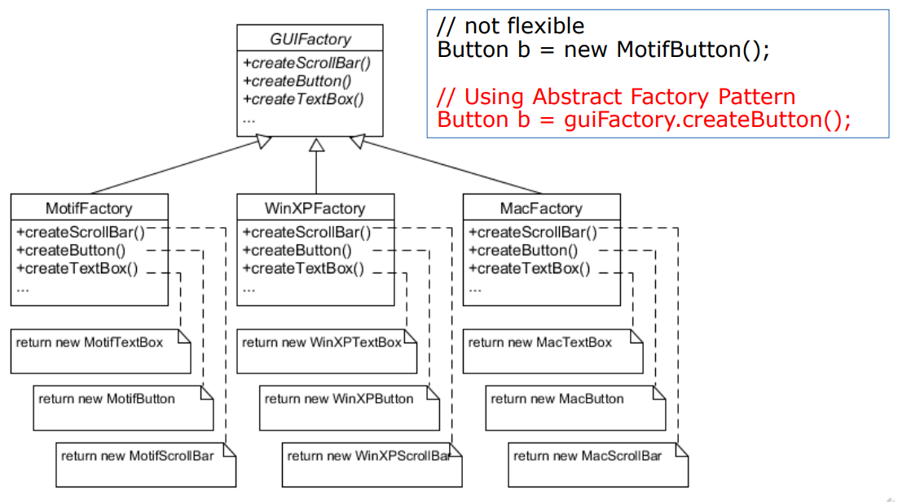
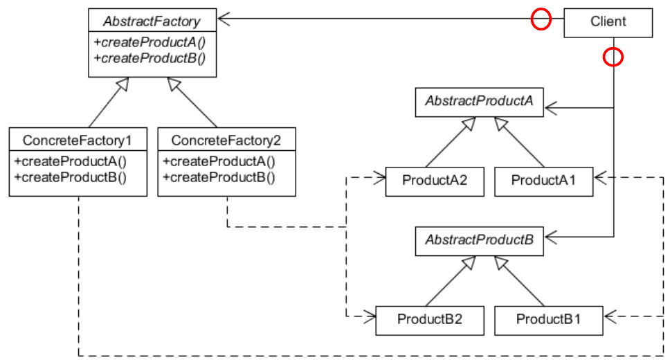
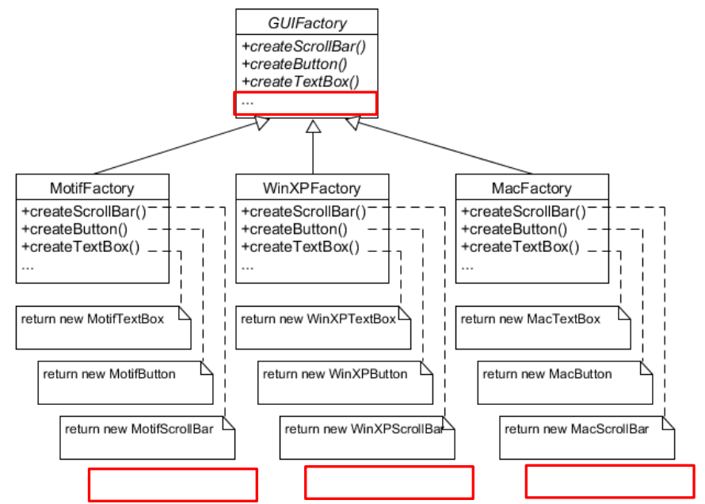
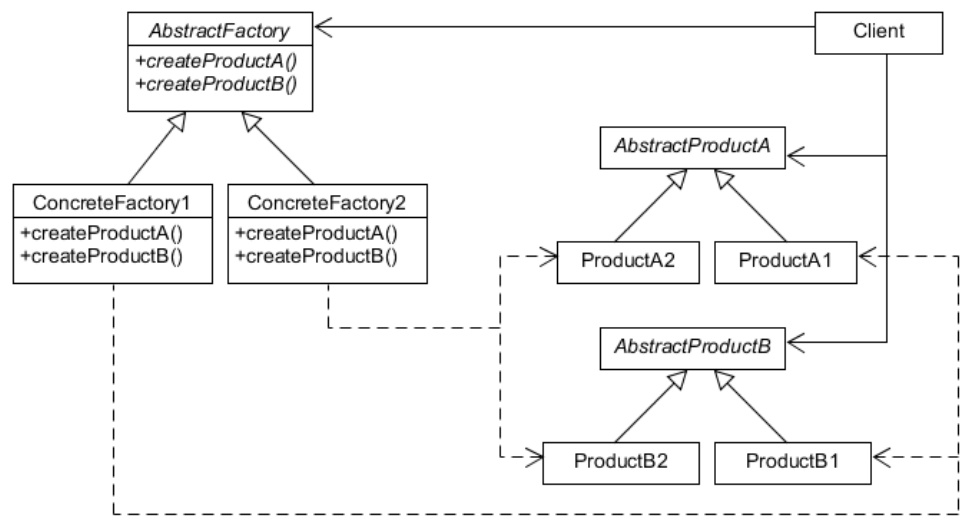

# Abstract Factory Pattern
## Overview
* Purpose
    * Provide an **interface that delegates creation calls** to one or more concrete classes in order to deliver **specific objects**.
* Use When
    * The creation of objects should be independent of the system utilizing them.
    * Systems should be capable of using multiple families of objects.
    * Families of objects must be used together.
    * Libraries must be published without exposing implementation details.
    * Concrete classes should be decoupled from clients.

### VS Factory Patterns
* Abstract factory pattern is one level of abstraction higher than the factory method pattern.
* Mechanisms
    * Abstract Factory pattern uses **composition & delegation**.
    * Factory Method pattern uses **inheritance**.

## Example
* Building a user interface toolkit that supports multiple look and feel standards.
    * Windows XP, MAC OS X, Motif, X Window
* Have different appearances and behavior for a large set of subclasses.
    * scroll bars, windows, buttons, etc.

{: w="380" h = "340"}

### Factory Object Set-up and Delegation
```java
public class UIToolKit {
    WidgetFactory wfactory;

    public UIToolKit (WidgetFactory wf) {
        this.wfactory = wf;
    }

    public void PopUpPrinterDialog() {
        DialogWindow d= wfactory.createDialogWindow("Printer Setup");
        d.add ( wfactory.createButton(OK_Button) );
        d.add ( wfactory.createButton(Cancel_Button) ); 

        d.showWindow();
    }
}
```

```java
public class DriverForWinXP {
    // setup a specific widget factory
    WidgetFactory wf = new WinXPWidgetFactory();

    // start a client program
    UIToolKit ui = new UIToolKiet(wf);

    // rest of code
}
```

### Class Diagram for GUIFactory
{: w="380" h = "370"}

### Class Diagram for Abstract Factory Pattern
{: w="370" h = "350"}

## Participants
* AbstractFactory
    * Declares an interface for operations that create abstract product objects.
* ConcreteFactory
    * Implements the operations to create concrete product objects.
* AbstractProduct
    * Declares an interface for a type of product object.
* ConcreteProduct
    * Defines a product object to be created by the corresponding concrete factory.
    * Implements the AbstractProduct interface.
* Client
    * **Uses only interfaces** declared by AbstractFactory and AbstractProduct classes.

## Other Example
### Making Factories for Ingredients (Abstract Factory)
```java
public interface PizzaIngredientFactory {
    public Dough createDough();
    public Sauce createSauce();
    public Cheese createCheese();
    public Veggies[] createVeggies();
    public Pepperoni createPepperoni();
    public Clams createClam(); 
}
```

### Concrete PizzaIngredientFactory (Factory Object)
```java
public class NYPizzaIngredientFactory implements PizzaIngredientFactory {
    public Dough createDough() {
        return new ThinCrustDough();
    }

    public Sauce createSauce() {
        return new MarinaraSauce();
    }

    public Cheese createCheese() {
        return new ReggianoCheese();
    }

    public Veggies[] createVeggies() {
        Veggies veggies[] = {new Garlic(), new Onion(), new Mushroom(), 
        new RedPepper() };
        return veggies;
    }

    public Pepperoni createPepperoni() {
        return new SlicedPepperoni();
    }

    public Clams createClam() {
        return new FreshClams();
    }
}
```

### Pizza product class
```java
public abstract class Pizza {
    String name;
    Dough dough;
    Sauce sauce;
    Veggies veggies[];
    Cheese cheese;

    abstract public void prepare();

    public void bake() {
        System.out.println("Bake for 25 minutes at 350");
    }

    public void cut() {
        System.out.println("Cutting the pizza into diagonal slices");
    }
    
    public void box() {
        System.out.println("Place pizza in official PizzaStore box");
    }

    public void setName(String name) {
        this.name = name;
    }

    public String getName() {
        return name;
    }

    public String toString() {
        return this.getName();
    }
}
```

```java
public class NYPizzaStore extends PizzaStore {
    protected Pizza createPizza(String item) {
        Pizza pizza = null;
        PizzaIngredientFactory ingredientFactory = new NYPizzaIngredientFactory();

        if (item.equals("cheese")) {
            pizza = new CheesePizza(ingredientFactory);
            pizza.setName("New York Style Cheese Pizza");
        } else if (item.equals("veggie")) {
            pizza = new VeggiePizza(ingredientFactory);
            pizza.setName("New York Style Veggie Pizza");
        } else if (item.equals("clam")) {
            pizza = new ClamPizza(ingredientFactory);
            pizza.setName("New York Style Clam Pizza");
        } else if (item.equals("pepperoni")) {
            pizza = new PepperoniPizza(ingredientFactory);
            pizza.setName("New York Style Pepperoni Pizza");
        }

        return pizza;
    }
}
```

```java
public class CheesePizza extends Pizza {
    PizzaIngredientFactory ingredientFactory;

    public CheesePizza(PizzaIngredientFactory ingredientFactory) {
        this.ingredientFactory = ingredientFactory;
    }

    void prepare() {
        System.out.println("Preparing " + name);
        dough = ingredientFactory.createDough();
        sauce = ingredientFactory.createSauce();
        cheese = ingredientFactory.createCheese();
    }
}
```

### What has changed?
1. Instantiating PizzaStore.
    ```
    PizzaStore nyPizzaStore = new NYPizzaStore();
    ```
2. Order.
    ```
    nyPizzaStore.orderPizza(“cheese”);
    ```
3. orderPizza() calls createPizza().
    ```
    Pizza pizza = createPizza(“cheese”);
    ```
5. BEGIN of Changed Flow for Ingredient Factory.
6. createPizza() now needs ingredientFactory.
    ```
    Pizza pizza = new CheesePizza(nyIngredientFactory);
    ```
7. prepare() creates ingredients using ingredient factory.
    ```
    void prepare(){
    dough = ingredientFactory.createDough();
    sauce = ingredientFactory.createSauce();
    cheese = ingredientFactory.createCheese();
    }
    ```
8. END of Changed Flow for Ingredient Factory.
9. Now it is ready. orderPizza() calls bake(), cut(), box().

## When to Use Abstract Factory Pattern?
* Common to creational patterns
    * A system must be independent of how its products are created, composed, and represented.
    * A class cannot anticipate the class of objects it must create.
* Specific to Abstract Factory pattern
    * A system should use one of a set of **families of products**.
    * A **family of related product objects** is designed to be used together, and the **constraint** needs to be enforced.

## Abstract Factory Pattern
* Consequences
    * pros
        * Isolates concrete classes.
            * Factory encapsulates responsibility and process of creating parts.
            * Isolates clients from implementation classes.
        * Exchanging product families easy.
            * Concrete factory appears once where it is instantiated.
        * Promotes consistency among products.
    * cons
        * Supporting new kinds of products is difficult.
            * Fixes set of parts to be created.

{: w="360" h = "390"}
*Supporting new kinds of products is difficult (not impossible, but costly)*


{: w="370" h = "350"}
*Supporting additional factory object is easy*

## Related Patterns
* Abstract Factory
    * classes are often implemented with Factory Methods.
    * but they can also be implemented using Prototype.
* Easy start → Factory Method
    * less complicated, more customizable, subclasses proliferate.
    * Later evolve toward Abstract Factory, Prototype, or Builder when more flexibility is needed.

## Summary
* Dependency Inversion Principle (DIP)
    * Depend on abstractions. Do not depend on concrete classes.
* Factory Method
    * Define an **interface for creating an object**, but **let subclasses decide** which class to instantiate. 
    * Class-scope pattern (uses only inheritance)
* Abstract Factory
    * Provide an interface for creating **families of** related or dependent **objects** without specifying their concrete classes
    * Object-scope pattern (uses object composition & delegation).
