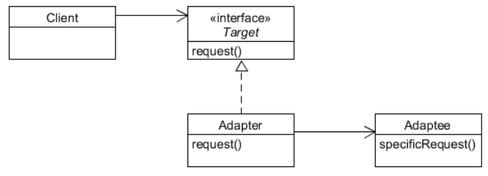
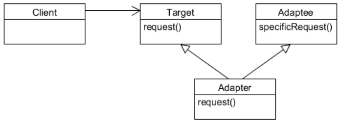
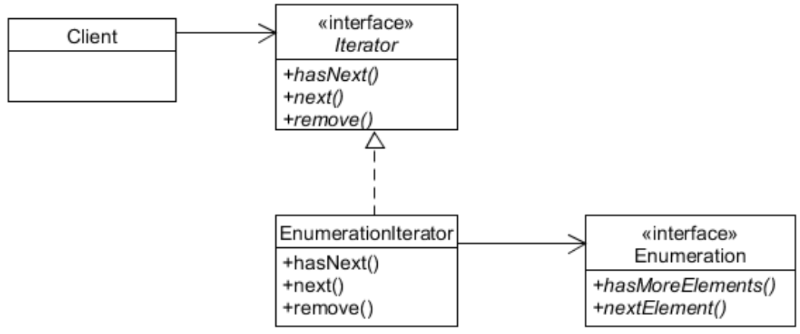

# Adapter Pattern
## Overview
* Also known as
    * Wrapper
* Purpose    
    * Permits classes with **different interfaces** to work together by creating a common object by which they may communicate and interact.
* Use When
    * A class to be used doesn't meet interface requirements.

## Adapters in SW
* You have an existing software system.
* You need to work a new vendor library into, but the new vendor designed their interfaces differently than the last vendor.
    * Write a class that adapts the new vendor interface into the one you’re expecting.


## Typical working process and Motivation
* Mechanism
    * A *client* makes a request to the adapter by *calling a method* on it using the **target interface**.
    * The *adapter* **translates the request** into one or more calls on the adaptee using the **adaptee interface**.
    * The client *receives the results* of the call and never knows there is an adapter doing the translation.
* Motivation 
    * A toolkit or class library may have an interface which is incompatible with an application’s interface we want to integrate.
    * It is possible that we do not have access to the source code of the toolkit or library. 
    * Even if the source code is available, we may want to minimize the change.

## Example
### Simplified Duck and Turkey
```java
public interface Duck {
    public void quack ();
    public void fly ();
}

public class MallardDuck implements Duck {
    public void quack () {
        System.out.println(“Quack”);
    }

    public void fly ( ) {
        System.out.println (“I am flying”);
    }
}

public interface Turkey {
    public void gobble ();
    public void fly ( );
}

public class WildTurkey implements Turkey {
    public void gobble ( ) {
        System.out.println(“Gobble Gobble”);
    }

    public void fly ( ){
        System.out.println(“I’m flying a short distance”);
    }
}
```

### Turkey Adapter
```java
public class TurkeyAdapter implements Duck { 
Turkey turkey;
    public TurkeyAdapter (Turkey turkey) {
        this.turkey = turkey;
    }

    public void quack () {
        turkey.gobble ();
    }

    public void fly () {
        for (int i= 0; i < 5; i++)
            turkey.fly ();
    }
}
```

### TestDrive
```java
public class DuckTestDrive {
    public static void main(String[] args) {
        MallardDuck duck = new MallardDuck();
        WildTurkey turkey = new WildTurkey();
        Duck turkeyAdapter = new TurkeyAdapter(turkey);
        System.out.println("The Turkey says...");
        turkey.gobble();
        turkey.fly();

        System.out.println("\nThe Duck says...");
        testDuck(duck);
        System.out.println("\nThe TurkeyAdapter says...");
        testDuck(turkeyAdapter);
    }

    static void testDuck(Duck duck) {
        duck.quack();
        duck.fly();
    }
}
```

## Object Adapter v.s. Class Adapter
* Object Adapter: uses object composition and delegation

{: w="350" h = "300"}

* Class Adapter: uses inheritance

{: w="350" h = "300"}

## Implementation Issues
* How much adaptation?
    * Simple and straightforward interface conversion such as
        * Changing method names.
        * Changing the order of arguments.
    * Totally different set of operations.
* Two-way transparency?
    * A two-way adapter supports both the Target and the Adaptee interface. 
    * It allows an adapted object (Adapter) to appear as an Adaptee object or a Target object.

## Enumerators v.s. Iterator
* Enumeration
    * Java’s old collection types such as Vector, Stack, HashTable, etc
    * hasMoreElements()
    * nextElement()
* Iterator
    * hasNext()
    * next()
    * remove()


### Adapting Enumeration to Iterator (EnumerationIterator)
{: w="360" h = "320"}

### EnumerationIterator Adapter
```java
public class EnumerationIterator implements Iterator {
    Enumeration enum;

    public EnumerationIterator(Enumeration enum) {
        this.enum = enum;
    }

    public boolean hasNext() {
        return enum.hasMoreElements();
    }

    public Object next() {
        return enum.nextElement();
    }

    public void remove() {
        throw new UnsupportedOperationException();
    }
}
```

## Summary
* Adapter pattern
    * Converts the interface of a class into another interface clients expect. 
    * Lets classes work together that couldn’t otherwise because of incompatible interfaces.
    * Class adapter and object adapter.
