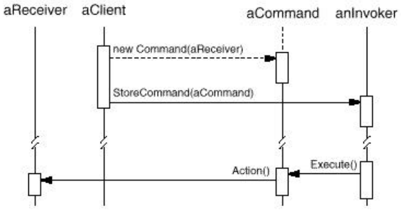

# Command Pattern
## Overview
### Purpose
* **Encapsulates** a **request as an object**.
* This allows the request to be handled in traditionally *object based relationships* such as queuing and callbacks.

### Use When
* Requests need to be specified, queued, and executed at variant times or in variant orders.
* A history of requests is needed.
* The invoker should be decoupled from the object handling the invocation.

## Example
### Given Hardware

{: w="30%"}

### Our Vendor Classes
{: w="31.67%"}

### Without Using Command Pattern
* Never do this!

```java
if(command == Slot1On)
    light.on();
else if(command == Slot1Off)
    light.off();
```

* Every time you want to modify the behavior of a button, you need to touch the client code!

### Implementing Command interface
* Command interface

```java
public interface Command {
    public void execute();
}
```

* You may want to include undo() for undo operation later.

### Implementing a command
```java
public class LightOnCommand implements Command {
    Light light; // Stores info. about its receiver

    public LightOnCommand(Light light) {
        this.light = light;
    }

    public void execute() {
        light.on();
    }
}
```

### Using the command object (Building Invoker)
```java
public class SimpleRemoteControl {
    Command slot;

    public SimpleRemoteControl() {}

    public void setCommand(Command command) {
        slot = command;
    }

    public void buttonWasPressed(){
        slot.execute();
    }
}
```

### Client Program
```java
public class RemoteControlTest {
    public static void main(String[] args) {
        SimpleRemoteControl remoteControl = new SimpleRemoteControl();

        Light light = new Light();
        LightOnCommand lightOn = new LightOnCommand(light);

        remote.setCommand(lightOn);
        remote.buttonWasPressed();
    }
}
```

```java
public class SimpleRemoteControl {
    Command slot;
    public void buttonWasPressed(){
        slot.execute();
    }
}
```

```java
public class LightOnCommand implements Command {
    Light light;
    public void execute() {
        light.on();
    }
}
```

## Command Pattern
* LightOn, LightOff, TVOn, TVOff, etc.

```java
public class LightOffCommand implements Command {
    Light light; // Stores info. about its receiver

    public LightOffCommand(Light light) {
        this.light = light;
    }

    public void execute() {
        light.off();
    }
}
```

* Command Pattern **encapsulates a request as an object**.
    * Each command object exposes only execute (and undo) method.

### Our Approach
{: w="31.67%"}

* **Encapsulates a request as an object**
    * Thus, let you parameterize clients with different requests, queue or log requests, and support undoable operations.

{: w="30%"}

### Collaborations
{: w="31.67%"}

### Extending the Remote Control
```java
public class RemoteControl {
    Command[] onCommands;
    Command[] offCommands;

    RemoteControl() {
        onCommands = new Command[7];
        offCommands = new Command[7];

        Command noCommand = new NoCommand(); // null objecet

        for(int i = 0; i < 7; ++i) {
            onCommands[i] = noCommand;
            offCommands[i] = noCommand;
        }
    }
}

public class NoCommand implements Command {
    public void execute() {}
}
```

### Command Pattern
```java
public void setCommand(int slot, Command onCommand, Command offCommand) {
    onCommands[slot] = onCommand;
    onCommands[slot] = offCommand;
}

public void onButtonWasPushed (int slot) {
    onCommands[slot].execute();
}

public void offButtonWasPushed (int slot) {
    offCommand[slot].execute();
}
```

### Client Program
```java
public class RemoteLoader {
    public static void main(String[] args) {
        // create invoker
        RemoteControl remotecontrol = new RemoteControl();

        // create receivers
        Light livingRoomLight = new Light("Living Room");
        Light kitchenLight = new Light("Kitchen");

        // create commands
        Command livingRoomLightOn = new LightOnCommand(livingRoomLight);
        Command livingRoomLightOff = new LightOffComman(livingRoomLight);
        Command kitchenlightOn = new LightOnCommand(kitchenLight);
        Command kitchenlightOff = new LightOffCommand(kitchenLight);

        // linking the invoker with the commands
        remotecontrol.setCommand(0,livingRoomLightOn,livingRoomLightOff);
        remotecontrol.setCommand(1,kitchenlightOn,kitchenlightOff);
        remotecoltrol.onButtonWasPushed(0);
        remotecoltrol.offButtonWasPushed(0);
        remotecoltrol.onButtonWasPushed(1);
        remotecoltrol.offButtonWasPushed(1);
    }
}
```

### After Setting the Commands
{: w="30%"}

### Supporting Undo
```java
public class LightOnCommand implements Command {
    Light light;
    public LightOnCommand(Light light){
        this.light = light;
    }

    public void execute() {
        light.on();
    }

    public void undo() {
        light.off();
    }
}

public void onButtonWaspressd(int slot) {
    onCommands[slot].execute();
    undoCommand = onCommands[slot];
}

public void offButtonWaspressd(int slot){
    offCommands[slot].execute();
    undocommand = offCommands[slot];
}

public void undoButtonWaspressd(){
    undocommand.undo();
}
```

### Supporting Macro Commands
```java
public class MacroCommand implements Command {
    Command[] command;

    public MacroCommand(Command[] command){
        this.command = command;
    }

    public void execute(){
        for(int i = 0; i < command.length; i++)
            command[i].execute();
    }
}
```

### Command + Iterator
```java
public class MacroCommand implements Command {
    ArrayList <Command>commands;

    public MacroCommand(Command[] commands) { 
        this.commands = new ArrayList();
        for (int i=0; i< commands.length; i++)
            this.commands.add(commands[i]);
    }

    public void execute() {
        for (Command item: this.commands)
            item.execute(); 
    }

    // NOTE: commands have to be done backwards to ensure proper undo
    public void undo() {
        ListIterator<Command> i=commands.listIterator(commands.size());
        while (i.hasPrevious())
            i.previous().undo(); 
    }
}
```

### Active Object Pattern
```java
interface Command {
    public void execute();
}

class ActiveObjectEngine {
    LinkedList itsCommands = new LinkedList();

    public void addCommand(Command c) {
        itsCommands.add(c);
    }

    public void run() {
        while (!itsCommands.isEmpty()) {
            Command c = (Command) itsCommands.getFirst();
            itsCommands.removeFirst();
            c.execute();
        }
    }
}

class SleepCommand implements Command {
    private Command wakeupCommand = null;
    private ActiveObjectEngine engine = null;
    private long sleepTime = 0; private long startTime = 0;
    private boolean started = false;

    public SleepCommand(long milliseconds, ActiveObjectEngine e, Command wakeupCommand) {
        sleepTime = milliseconds;
        engine = e;
        this.wakeupCommand = wakeupCommand;
    }

    public void execute() {
        long currentTime = System.currentTimeMillis();

        if (!started) {
            started = true;
            startTime = currentTime;
            engine.addCommand(this);
        } else if ((currentTime - startTime) < sleepTime ) {
            engine.addCommand(this);
        } else 
            engine.addCommand(wakeupCommand);
    }
}

public class DelayedTyper implements Command {
    private long mDelay = 0;
    private char mChar;
    private static boolean stop = false;
    private static ActiveObjectEngine engine = new ActiveObjectEngine(); 
    
    public DelayedTyper(long delay, char c) {
        mDelay = delay;
        mChar = c;
    }

    @Override
    public void execute() {
        System.out.print(mChar);
        
        if (!stop) delayAndRepeat();
    }

    private void delayAndRepeat() {
        engine.addCommand(new SleepCommand(mDelay, engine, this));
    } 

    public static void main(String args[]) throws Exception {
        engine.addCommand(new DelayedTyper(100, '1'));
        engine.addCommand(new DelayedTyper(300, '3'));
        engine.addCommand(new DelayedTyper(500, '5'));
        engine.addCommand(new DelayedTyper(700, '7')); 

        Command stopCommand = new Command() { 
            @Override public void execute() {
                stop = true;
            }
        }; 

        engine.addCommand(new SleepCommand(10000, engine, stopCommand)); 
        engine.run();
    }
} 
```

### Class Diagram for DelayedTyper
{: w="30.83%"}

## Review
* Command **decouples** the **object that invokes** the operation from the **one that knows how to perform it**.
* Commands can be manipulated and extended like any other object.
* You can assemble commands into a composite command.
    * E.g. MacroCommand class 
    * In general, composite commands are an instance of Composite pattern

