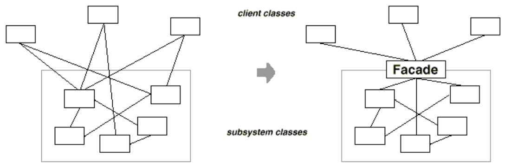
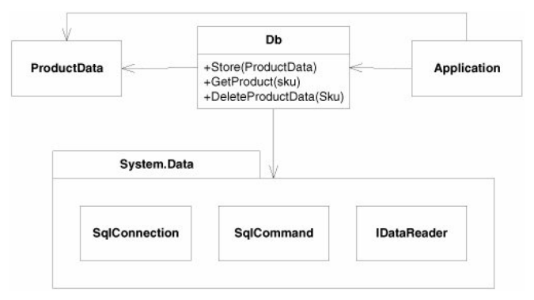
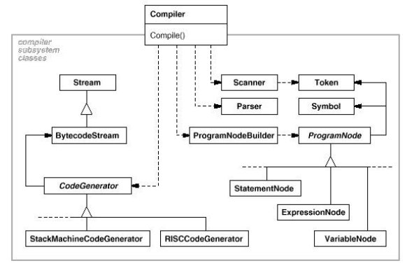
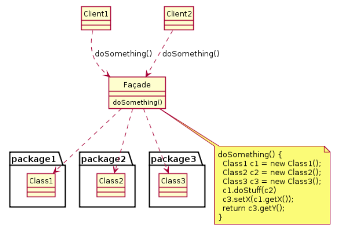
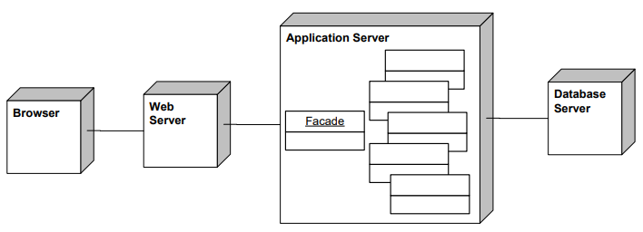
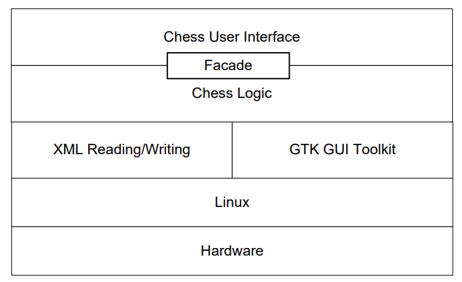
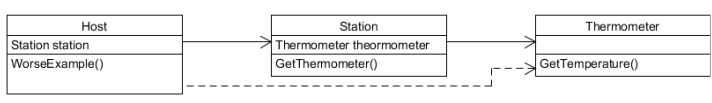

# Facade Pattern
## Overview
* Purpose
    * Supplies a single interface to a set of interfaces within a system.
* Use When
    * A simple interface is needed to provide access to a complex system.
    * There are many dependencies between system implementations and clients.
    * Systems and subsystems should be layered.

## The Facade Pattern
*  Provides a unified interface to a set of interfaces in a subsystem. 
    * It defines a higher-level interface that makes a subsystem easier to use.

{: w="28.33%"}


## Motivation
* In typical OO Design,
    * Structuring a system into subsystems helps reduce complexity.
    * Subsystems are groups of classes, or groups of classes and other subsystems.
    * May produces many minimal classes.
* Problems
    * Class/Subsystem interface can become quite complex.
        * Too many options to use!
    * A new-comer cannot figure out where to begin.
* Solution
    * Facade object provides a single, simplified interface to the more general facilities of a subsystem.

## Benefits
* Hides the implementation of the subsystem from clients.
    * makes the subsystem easier to use.
* Promotes weak coupling between the subsystem and its clients.
    * allows changing the classes comprising the subsystem without affecting the clients.
* **Does not prevent sophisticated clients from accessing the underlying classes**.
* Notice: **Facade does not add any functionality**, it just **simplifies interfaces**.


## Example
{: w="26.67%"}

{: w="25.83%"}

### Example Code
```java
class Scanner {...};
class Parser {...};

...

class CodeGenerator {...};
class Compiler { //facade class
    public:
        Compiler();
        virtual void Compile(istream&, BytecodeStream&); 
};

void Compiler::Compile(istream& input, BytecodeStream& output) {
    Scanner scanner(input);
    ProgramNodeBuilder builder;

    Parser parser;
    parser.Parse(scanner, builder);
    
    RISCCodeGenerator generator(output);
    ProgramNode* parseTree = builder.GetRootNode();
    parseTree->Traverse(generator);
}
```

### Facade Example
{: w="26.67%"}

### Known Uses: Web Applications
{: w="28.33%"}

### Facade in Layered Architecture
{: w="26.67%"}

## Comparing the Facade with the Adapter Pattern
* Are there existing classes?
* Is there an interface we must design to?
* Is a simpler interface needed?

## The Principle of Least Knowledge (Law of Demeter)
* When you design a system, you should be careful of the number of classes it interacts with and also how it comes to interact with those classes.
* A method m of an object o may only invoke the methods of the following kinds of objects.
    * o itself
    * m's parameters
    * any objects created/instantiated within m
    * o's direct component objects
    * a global variable, accessible by o, in the scope of m
* i.e., "use only one dot"
    * a.b.Method() breaks the law where a.Method() does not

### Example
```java
public float WorseExample() {
    Thermometer thermometer = station.GetThermometer();
    return thermometer.GetTemperature();
}

public float BetterExample() {
    return station.GetTemperature();
}
```

{: w="28.33%"}

```java
public class Car {
    Engine engine;
    public Car() { 
        // initialize car
    }

    public void start(Key key) {
        Doors doors = new Doors();
        boolean authorized = key.turns();

        if (authorized) {
            engine.start();
            updateDashboardDisplay();
        }
    }

    public void updateDashBoardDisplay() {
        //
    }
}
```

## Review
* Provides a unified interface to a set of interfaces in a subsystem. 
* Facade defines a higher-level interface that makes the subsystem easier to use.

### Related Patterns
* Mediator
    * Mediator’s colleagues are aware of Mediator.
* Facade
    * Unidirectional rather than cooperative interactions between object and subsystem.
    * The subsystem doesn’t know about the Facade.
    * Facade doesn’t add functionality, Mediator does.

