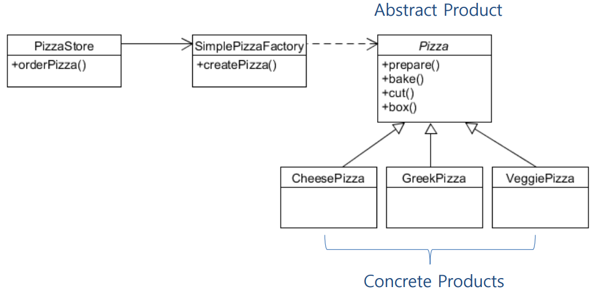
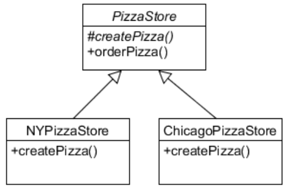
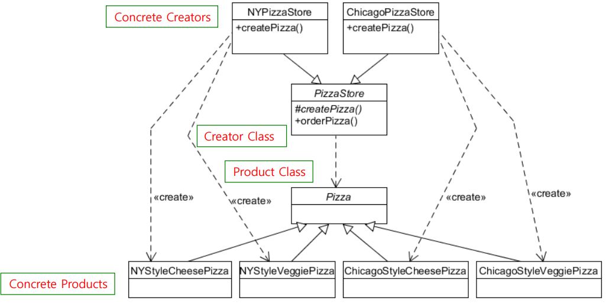
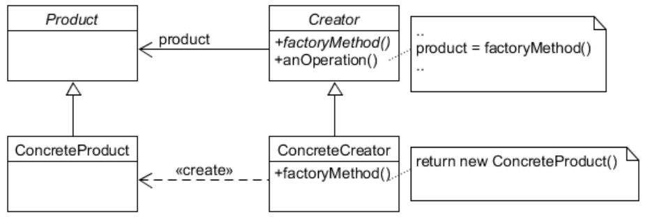
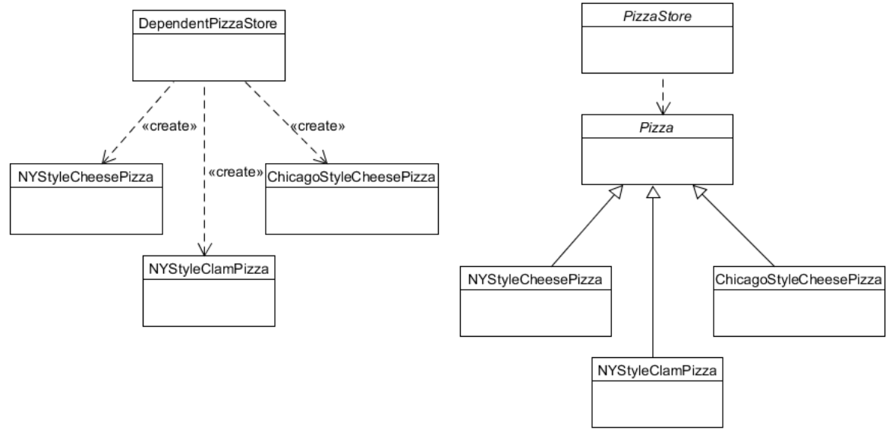

# Facotry Method Pattern
## Overview
### Creating Objects
* Coding to an interface.

```java
Duck duck = new MallardDuck();
```

* Duck: interface
* MallardDuck: concrete class

* Needs different ducks depeding on the condition.

```java
Duck duck;

if (picnic) duck = new MallardDuck();
else if (hunting) duck = new DecoyDuck();
else if (inBathTub) duck = new RubberDuck();
```

* But “new” operator needs Concrete Class.

### Factory Patterns
* Creational patterns
    * Allow to creating new objects **without explicitly using the new operator**.
    * We can instantiate different objects without modifying client code.
    * Examples: Factory Method, Abstract Factory, Singleton, Builder, Prototype
* Factory Method
    * Uses inheritance to decide the object to be instantiated.
* Abstract Factory
    * Delegates object creation to a factory object.

## Example
### Original Code
```java
Pizza orderPizza(String type) {
    Pizza pizza;
    if (type.equals("cheese"))
        pizza = new CheesePizza();
    else if (type.equals("greek"))
        pizza = new GreekPizza();
    else if (type.equals("pepperoni"))
        pizza = new PepperoniPizza();

    pizza.prepare();
    pizza.bake();
    pizza.cut();
    pizza.box();

    return pizza;
}
```

### Pizza types are changing!
```java
Pizza orderPizza(String type) {
Pizza pizza;
if (type.equals("cheese"))
    pizza = new CheesePizza();

// changed
else if (type.equals("clam"))
    pizza = new ClamPizza();
else if (type.equals("pepperoni"))
    pizza = new PepperoniPizza();

    pizza.prepare();
    pizza.bake();
    pizza.cut();
    pizza.box();

    return pizza;
}
```

### Building a Simple Factory
```java
public class SimplePizzaFactory {
    public Pizza createPizza(String type) {
        Pizza pizza;
        if (type.equals("cheese"))
            pizza = new CheesePizza();
        else if (type.equals("greek"))
            pizza = new GreekPizza();
        else if (type.equals("pepperoni"))
            pizza = new PepperoniPizza();

        return pizza;
    }
}
```

### Revising PizzaStore class using the Simple Factory
```java
pubilc class PizzaStore {
    SimplePizzaFactory factory;

    public PizzaStore(SimplePizzaFactory factory) {
        this.factory = factory;
    }

    public Pizza orderPizza(String type) {
        Pizza pizza;
        pizza = factory.createPizza(type); // use SimplePizzaFactory

        pizza.prepare();
        pizza.bake();
        pizza.cut();
        pizza.box();

        return pizza;
    }
}
```

* It looks like we are just pushing the problem off to another object.

### Simple Factory (not an official pattern)
{: w="31.67%"}

### Franchising the pizza store
* Different styles
    * NY, Chicago, California, etc
* Different pizza factories
    * NYPizzaFactory, ChicagoPizzaFactory, CaliforniaPizzaFactory

```java
NYPizzaFactory nyFactory = new NYPizzaFactory();
PizzaStore nyStore = new PizzaStore(nyFactory);
nyStore.order(“Veggie”);

ChicagoPizzaFactory chicagoFactory = new ChicagoPizzaFactory();
PizzaStore chicagoStore = new PizzaStore(chicagoFactory);
chicagoStore.order(“Veggie”);
```

## Factory Method Pattern
* Purpose
    * Exposes a **method for creating objects, allowing subclasses** to control the actual creation process.
* Use When
    * A class will not know what classes it will be required to create.
    * Subclasses may specify what objects should be created.
    * Parent classes wish to defer creation to their subclasses.

### Requirement Change
* Now we need want to make a framework which ties the store and the pizza creation.

```java
public abstract class PizzaStore {
    public Pizza orderPizza(String type) {
        Pizza pizza;
        pizza = createPizza(type);

        pizza.prepare();
        pizza.bake();
        pizza.cut();
        pizza.box();
        
        return pizza;
    }

    protected abstract Pizza createPizza(String type);
}
```

### Factory Method
* The example is a OO framework providing service “prepare pizza”.
    * The framework invokes the createPizza() factory method to create a pizza that it can prepare using a well-defined, consistent process.
    * A **“client” of the framework will subclass this class and provide an implementation of the createPizza()** method.
    * Any dependencies on concrete “product” classes are encapsulated in the subclass.

### Allowing the subclasses to decide
{: w="28.33%"}

```java
// NYPizzaStore
public Pizza createPizza(String type) {
    Pizza pizza;
    if (type.equals(“cheese”)) {
        pizza = new NYStyleCheesePizza();
    } else if (type.equals(“veggie”)) {
        pizza = new NYStyleVeggiePizza();
    }

    return pizza;
}
```

```java
// ChicagoPizzaStore
public Pizza createPizza(String type) {
    Pizza pizza;
    if (type.equals(“cheese”)) {
        pizza = new ChicagoStyleCheesePizza();
    } else if (type.equals(“veggie”)) {
        pizza = new ChicagoStyleVeggiePizza();
    }
    return pizza;
}
```

### Ordering a pizza using the Factory Method
1. Need an instance of PizzaStore.
    ```java
    PizzaStore nyPizzaStore = new NYPizzaStore();
    ```
2. Call orderPizza().
    ```java
    nyPizzaStore.orderPizza(“cheese”);
    ```
3. orderPizza() calls createPizza().
    ```java
    Pizza pizza = createPizza(“cheese”);
    ```
4. orderPizza() now prepare, bake, cut and box the pizza.
    ```java
    pizza.prepare();
    pizza.bake();
    pizza.cut();
    pizza.box();
    ```

### Implementing Pizza class
```java
public abstract class Pizza {
    String name;
    String dough;
    String sauce;

    ArrayList toppings = new ArrayList();

    void prepare(){
        System.out.println(“Preparing “ + name);
        System.out.println(“Tossing dough...”);
        System.out.println(“Adding sauce...”);
        System.out.println(“Adding toppings: “);

        for (int i = 0; i < toppings.size(); i++)
            System.out.println(“ “ + toppings.get(i));
    }

    void bake(){
        System.out.println(“Bake for 25 minutes at 350”);
    }

    void cut(){
        System.out.println(“Cutting the pizza into diagonal slices”);
    }

    void box(){
        System.out.println(“Place pizza in official PizzaStore box”);
    }
}
```

### Subclasses of Pizza
```java
public class NYStyleCheesePizza extends Pizza {
    public NYStyleCheesePizza(){
        name = “NY Style Sauce and Cheese Pizza”;
        dough = “Thin Crust Dough”;
        sauce = “Marinara Sauce”;
        toppings.add(“Grated Reggiano Cheese”);
    }
}

public class ChicagoStyleCheesePizza extends Pizza {
    public ChicagoStyleCheesePizza(){
        name = “Chicago Style Deep Dish and Cheese Pizza”;
        dough = “Extra Thick Crust Dough”;
        sauce = “Plum Tomato Sauce”;
        toppings.add(“Shredded Mozzarella Cheese”);
    }

    void cut(){
        System.out.println(“Cutting the pizza into square slices”);
    }
}
```

### Test Drive
```java
public class PizzaTestDrive {
    public static void main(String[] args){
        PizzaStore nyStore = new NYPizzaStore();
        PizzaStore chicagoStore = new ChicagoPizzaStore();

        Pizza pizza = nyStore.orderPizza(“cheese”);
        System.out.println(“Ethan ordered a “ + pizza.getName());

        Pizza pizza = chicagoStore.orderPizza(“cheese”);
        System.out.println(“Joel ordered a “ + pizza.getName());
    }
}
```

### Applying Factory Method Pattern
* The Factory Method pattern encapsulates object creation by letting subclasses decide what objects to create.

{: w="35.83%"}

### Factory Method Pattern
* Defines an interface for creating an object, but lets subclasses decide which class to instantiate. 
* Factory Method lets a class defer instantiation to subclasses.

{: w="30%"}

### A very dependent PizzaStore (bad design)
```java
public class DependentPizzaStore {
    public Pizza createPizza(String style, String type) {
        Pizza pizza = null;

        if (style.equals("NY")) {
            if (type.equals("cheese")) {
                pizza = new NYStyleCheesePizza();
            } else if (type.equals("veggie")) {
                pizza = new NYStyleVeggiePizza();
            }
        } else if (style.equals("Chicago")) {
            if (type.equals("cheese")) {
                pizza = new ChicagoStyleCheesePizza();
            } else if (type.equals("veggie")) {
                pizza = new ChicagoStyleVeggiePizza();
            }
        } else {
            System.out.println("Error: invalid type of pizza");
            return null;
        }

        pizza.prepare();
        pizza.bake();
        pizza.cut();
        pizza.box();

        return pizza;
    }
}
```

### Dependent PizzaStore VS Factory Method
{: w="33.33%"}

## Design Principle: Dependency Inversion Principle
* Dependency Inversion Principle
    * Depend upon abstractions. Do not depend upon concrete classes.
    * High-level components should not depend on low-level components.
    * Rather, they should both depend on abstractions
* Factory Method is one way of following the dependency inversion principle.

### Factory Method Pattern
* What exactly does it mean by saying that “the Factory Method Pattern lets subclasses decide which class to instantiate?”
    * **Creator class** is written in such a fashion that it does not know what actual Concrete Product class will be instantiated. 
    * The **Concrete Product** class to be instantiated is determined solely by which **Concrete Creator** subclass is instantiated and used by the application.
    * **It does not mean that the subclass decides at runtime which ConcreteProduct class to create**.

