# Observer Pattern
## Overview
### Also known as 
* Publish/Subscribe model

### Purpose
* Lets one or more objects be notified of state changes in other objects within the system.

### Use When
* Loose coupling is needed for communications.
* State changes in one or more objects should trigger behavior in other objects.
* Broadcasting capabilities are required.
* An understanding exists that objects will be blind to the expense of notification.

## Example
### Application Overview
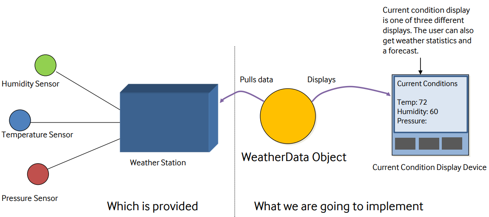{: w="35%"}
*Create an application using the WeatherData object to update three displays*

### The WeatherData class
* Methods getTemperature(), getHumidity(), getPressure() return the most recent weather measurements for temperature, humidity and pressure respectively.
    * We don’t care how these variables are set.
    * The WeatherData object knows how to get updated information from the Weather Station.
* Method measurementChanged() gets called whenever the measurements have been updated.

### What do we know?
* Display elements that use the weather data: 
    * Current conditions display
    * Statistics display
    * Forecast display
* They must be updated each time WeatherData has new measurements.
* System must be expandable
    * other developers can create new custom display elements and users can add or remove as many display elements as they want to the application. 
    * Currently, we know about only the initial three display types: current conditions, statistics, and forecast.

### The First Attempt
```java
public class WeatherData {
    // instance variable delcarations

    public void measurementsChanged() {
        float temp = getTemperature();
        float humidity = getHumidity();
        float pressure = getPressure();

        currentConditionDisplay.update(temp, humidity, pressure);
        statisticDisplay.update(temp, humidity, pressure);
        forecastDisplay.update(temp, humidity, pressure);
    }

    // other weatherData methods here
}
```

* By coding to concrete implementations we have no way to add or remove other display elements without making changes to the program.

### Meet the Obeserver Pattern
* A news paper **publisher** goes into business and begins publishing newspapers.
* You **subscribe** to a particular publisher.
    * Every time there’s new edition it gets delivered to you. 
    *As long as you remain a subscriber, you get new newspapers.
* You **unsubscribe** when you don’t want papers anymore.
    * They stop delivery.
* While the publisher remains in business, people, hotels, airlines and other business **constantly subscribe and unsubscribe** to the newspaper.

## Observer Pattern
* Publisher & Subscriber Model
    * Publisher : Subscriber = Subject : Observer

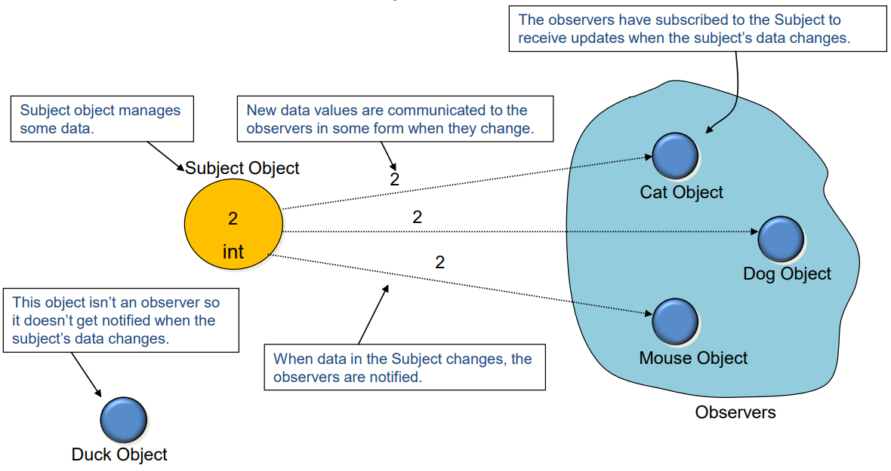{: w="36.67%"}
*Model Overview*

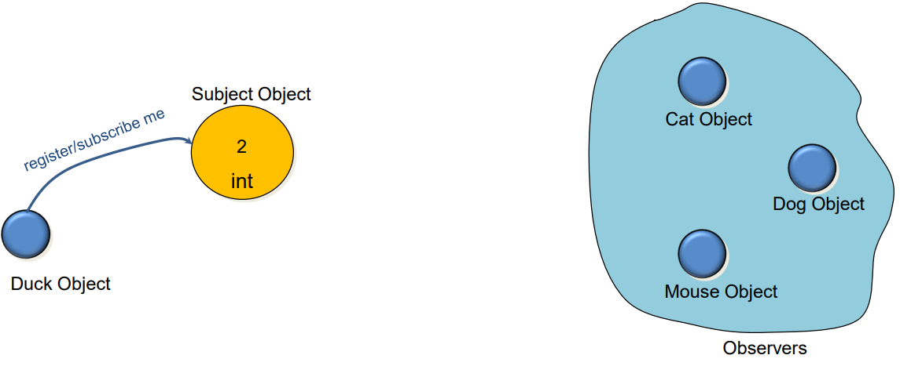{: w="36.67%"}
*Duck wants to subscribe*

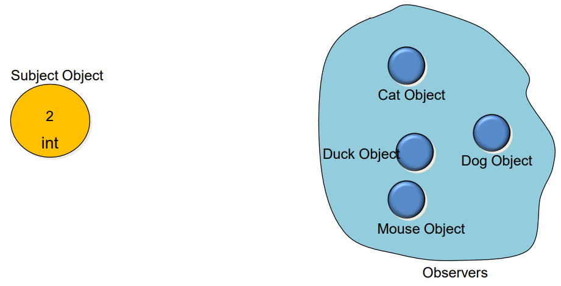{: w="33.33%"}
*Duck is now an observer, too*

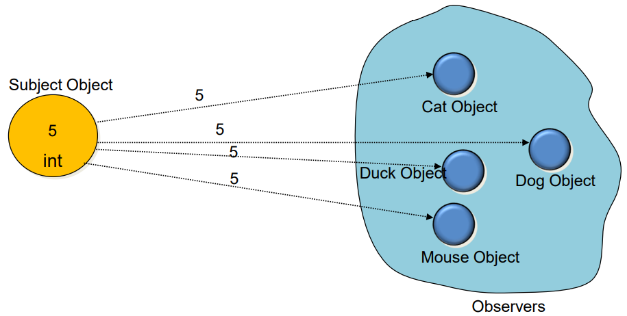{: w="33.33%"}
*Notifying the observers*

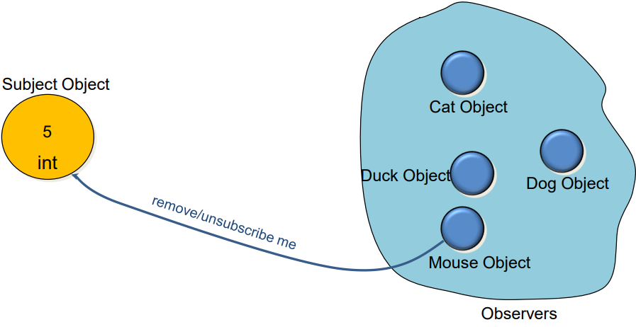{: w="33.33%"}
*Mouse wants to unsubscribe*

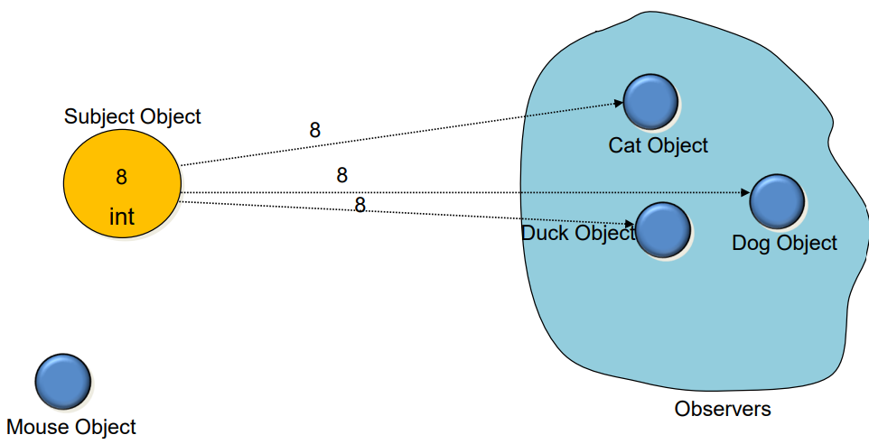{: w="34.17%"}
*Notifying the observers*

### The Observer Pattern Defined
* The Observer Pattern defines a **one-to-many dependency** between objects so that when one object changes state, all of its dependents are notified and updated automatically.

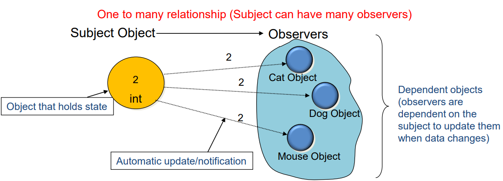{: w="36.67%"}

### Class Diagram for Observer Pattern

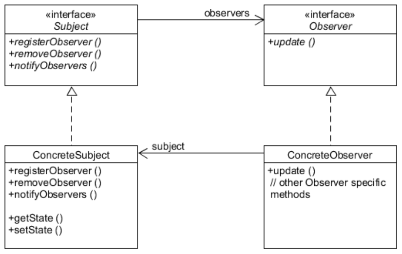{: w="31.67%"}

## The Power of Loose Coupling
* Principle of loose coupling
    * Strive for loosely coupled designs between object that interact.
* When two objects are **loosely coupled**, they can interact, but have very **little knowledge of each other**.
* Observer Pattern provides an object design where subjects and observers are loosely coupled.

## Designing the Weather Station

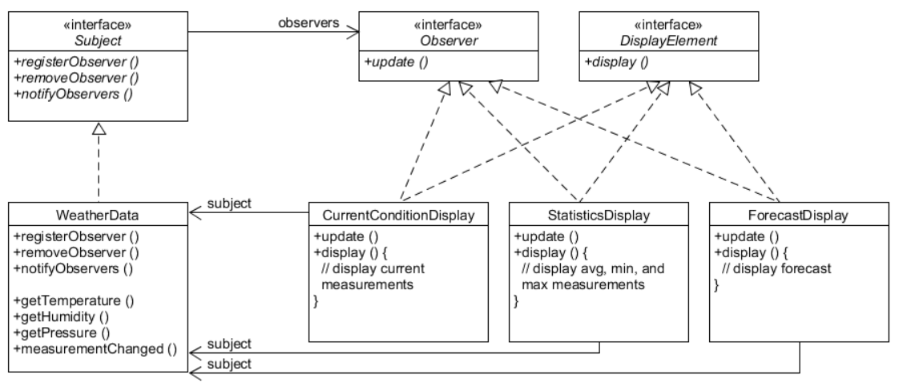{: w="37.5%"}

### Preparing Interfaces
```java
public interface Subject {
    public void registerObserver(Observer o);
    public void removeObserver(Obeserver o);
    public void notifyObservers();
}

public interface Observer {
    public void update(float temp, float humidity, float pressure);
}

public interface DisplayElement {
    public void display();
}
```

### Implementing WeatherData
```java
public class WeatherData implements Subject {
    private ArrayList observers;
    private float temperature;
    private float humidity;
    private float pressure;

    public weatherData() {
        this.observers = new ArrayList();
    }

    public void registerObserver(Observer o) {
        observers.add(o);
    }

    public void removeObserver(Observer o) {
        int i = observers.indexof(o);
        if(i >= 0) observers.remove(i);
    }

    public void notifyObservers() {
        for (int i = 0; i < observers.size(); ++i) {
            Observer observer = (Observer) observers.get(i);
            observer.update(temperature, humidity, pressure);
        }
    }

    public void measurementsChanged() {
        notifyObservers();
    }

    public void setMeasurements(float temperature, float humidity, float pressure) {
        this.temperature = temperature;
        this.humidity = humidity;
        this.pressure = pressure;
        measurementsChanged();
    }

    // other WeatherData methods here
}
```

### Implementing CurrentConditioinDisplay
```java
public class CurrentConditionDisplay implements Observer, DisplayElement {
    private float temperature;
    private float humidity;
    private Subject weatherData;

    public CurrentConditionDisplay(Subject weatherData) {
        this.weatherData = weatherData;
        weatherData.registerObserver(this);
    }

    public void update(float temperature, float humidity, float pressure) {
        this.temperature = temperature;
        this.humidity = humidity;
        display();
    }

    public void display() {
        System.out.println("Current condition: " + temperature + "F degrees and" + humidity + "% humidity");
    }
}
```

### Implementing the Weather Station and Output
```java
public class WeatherStation {
    public static void main(String[] args) {
        WeatherData weatherData = new WeatherData();

        CurrentConditionsDisplay currentDisplay = new CurrentConditionsDisplay(weatherData);
        StatisticsDisplay statisticsDisplay = new StatisticsDisplay(weatherData);
        ForecastDisplay forecastDisplay = new ForecastDisplay(weatherData);

        weatherData.setMeasurements(80, 65, 30.4f);
        weatherData.setMeasurements(82, 70, 29.2f);
        weatherData.setMeasurements(78, 90, 29.2f);
    }
}
```

## Using Java’s Official Observable Class
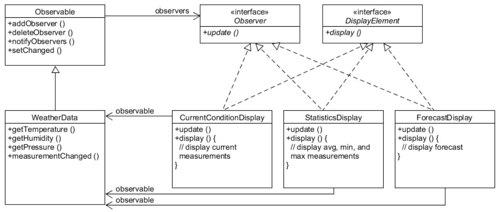{: w="37.5%"}

### How to Use Observable Class
* Observable (Publisher) side
    * To send notifications
        * Call SetChanged()
        * Call either notifyObservers() or notifyObservers(Object arg)
* Observer (Subscriber) side
    * To become an observer 
        * Implement java.util.Observer interface
    * To subscribe 
        * Call addObserver() on any Observable object
    * To unsubscribe 
        * Call deleteObserver()
    * To get updated 
        * Implement update(Observable o, Object arg)


### Internals of setChanged()
```java
setChanged() {
    changed = true;
}

notifyObservers(Object arg) {
    if (changed) {
        for every observer on the list {
            call update (this, arg);
        }
        changed = false;
    }
}

notifyObservers() {
    notifyObservers(null);
}
```

### Why is the setChanged() necessary?
* setChanged() method is there to give you more flexibility.
    * Optimize the notifications.
    * Example: If the sensor reading is very sensitive, you may not want to update the observers with every minor fluctuation.
        * setChanged() allows you to control the notification points
* Other relevant methods in Observable
    * clearChanged()
    * hasChanged()

### Observable side
```java
import java.util.Observable;
import java.util.Observer;

public class WeatherData extends Observable {
    private float temperature;
    private float humidity;
    private float pressure;

    public WeatherData() {}

    public void measurementsChanged() {
        setChanged();
        notifyObservers();
    }
    
    public void setMeasurements(float temperature, float humidity, float pressure) {
        this.temperature = temperature;
        this.humidity = humidity;
        this.pressure = pressure;
        measurementsChanged();
    }

    public float getTemperature() {
        return temperature;
    }

    public float getHumidity() {
        return humidity;
    }

    public float getPressure() {
        return pressure;
    }
}
```

### Observer side
```java
import java.util.Observable;
import java.util.Observer;

public class CurrentConditionsDisplay implements Observer, DisplayElement {
    Observable observable;
    private float temperature;
    private float humidity;

    public CurrentConditionsDisplay(Observable observable) {
        this.observable = observerble;
        observable.addObserver(this);
    }

    public void update(Observable obs, Object arg) {
        if(obs instanceof WeatherData) {
            WeatherData weatherData = (WeatherData)obs;
            this.temperature = weatherData.getTemperature();
            this.humidity = weatherData.getHumidity();
            display();
        }
    }

    public void display() {
        System.out.println(“Current conditions: ” + temperature + “F degrees and” + humidity + “% humidity”);
    }
}
```

