# SOLID Design Principle
## Single Responsibility Principle (SRP)
>**A class should have one, and only one, reason to change**

### The Single Responsibility Principle
* Responsibility
    * A contract or obligation of a class
    * **reason to change**
        * More responsibilities = More likelihood of change
        * The more a class changes, the more likely we will introduct bugs
        * Change can impact the others
* **SRP: Separate coupled responsibilities into separate classes**
    * Realted measure: Cohesion
        how strongly-realted and foucused are the various responsibilities of a module

### Example
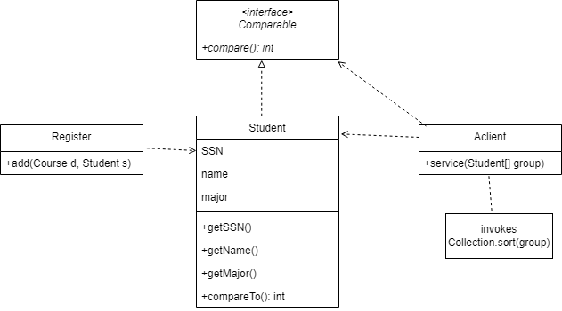{: w="33.33%"}
*Example of SRP violation*

* Often we need to sort students by their name, or SSN. So one may make Class Student *implement the Java Comparable interface*.
* Student is a business entity, it does not know in what order it should be sorted since the order of sorting is imposed by the client of Student.
    * When a new requirement needs to sort students in a different order, Student, Register, and AClient all need to be recompiled, even though Register has nothing to do with any ordering of Students.
* Worse: every time students need to be ordered differently, we have to recompile Student and all its client.
* Cause of the problems: we bundled two separate responsibilities (i.e., student as a business entity with ordering) into one class – **a violation of SRP**

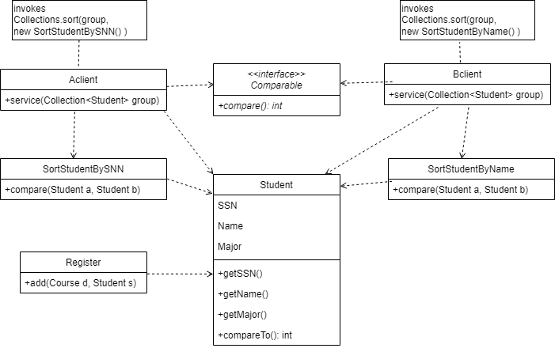{: w="35%"}
*Example of design following SRP*

* The solution is to **separate the different responsibilities** into two separate classes and use another version of Collections.sort().

### Another Example
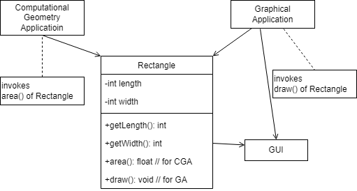{: w="28.33%"}
*Example of SRP violation*

* Class Rectangle may be forced to make changes from two different unrelated sources
* One is from the Computational Geometry Application (CGA). E.g., modifying area(). 
* The other is from Graphical Application (GA). E.g., modifying draw() for different platforms. 
* A change from either of the two source would still cause the other application to recompile.

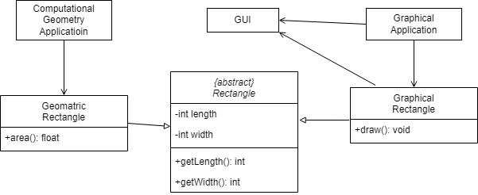{: w="34.17%"}
*Example of design following SRP*

* Package CGA is no longer dependent on graphical side of Rectangle and thus it becomes independent of package GUI. 
    * Any change caused by graphical application no longer requires CGA to be recompiled.
* Class Rectangle contains the most primitive attributes and operations of rectangles. 
* Classes GeometricRectangle and GraphicRectangle are independent of each other. 
    *A change from either side of CGA or GA, it would not cause the other side to be recompiled.

### Identifying Responsibilities Can be Tricky
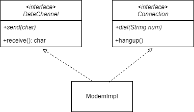{: w="26.67%"}

* Two responsibilities: Connection management and Data communication.
* Lesson: It depends on how the application is changing.
* Beware: **Avoid Needless Complexity**
    * If there is no symptom, it is not wise to apply the SRP or any other principle.

## Open Closed Principle (OCP)
> **Software entities (classes, modules, functions, etc.) should be open for extension but closed for modification**

* You should be able to extend a class’s behavior, without modifying it.

### Conforming to OCP
* Open for extension
    * Behavior of the module can be extended
    * We are able to change what the module does
* Closed for modification
    * Extending behavior does not result in excessive modification such as architectural changes of the module
* Violation Indicator: Design Smell of Rigidity
    * A single change to a program results in a **cascade of changes to dependent modules**.

### Example
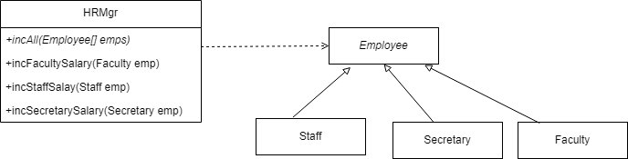{: w="32.5%"}
*Bad Example*

```java
void incAll(Employee[] emps) {
    for (int i = 0; i < emps.size(); i++) {
        if (emps[i].empType == FACULTY)
            incFacultySalary((Faculty)emps[i]);
        else if (emps[i].empType == STAFF)
            incStaffSalary((Staff)emps[i]);
        else if (emps[i].empType == SECRETARY)
            incSecretarySalary((Secretary)emps[i]);
    }
}
```

* Rigid
    * Adding new employee type requires significant changes.
* Fragile
    * Many switch/case or if/else statements.
    * Hard to find and understand.
* Immobile
    * To reuse incAll( ) → we need Faculty, Staff, Secretary, too! 
    * What if we need just Faculty and Staff only?

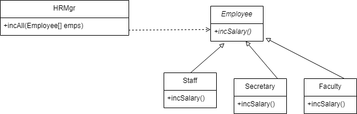{: w="30.83%"}
*Better Example*

```java
void incAll(Employee[] emps) {
    for (int i = 0; i < emps.size(); i++) 
        emps[i].incSalary(); 
}
```

* When Engineer is added, incAll() does not even need to recompile. 
* This design is open to extension, closed for modification.

### Abstraction is the Key
* Abstractions
    * Fixed and yet represent an unbounded group of possible behaviors.
    * Abstract base class : fixed
    * All the possible derived classes : unbounded group of possible behaviors.
* Program the class  to interfaces (or abstract classes) not to implementation (concrete classes).

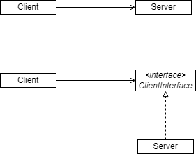{: w="27.5%"}

### Anticipating Future Changes
* Strategy is needed
    * **Choose the kinds of changes** against which to close design.
    * Guess the **most likely kinds of changes**, and then **construct abstractions** to protect him from those changes.
* Beware: Consider the cost
    * **Conforming to OCP is expensive**.
    * **Time and effort** to create appropriate abstractions.
    * Abstractions also **increase complexity**.
* **Do not put hooks in for changes that might happen**.
    * "Fool me once, shame on you. Fool me twice, shame on me."
    * Initially write the code expecting it to not change.
    * When a change occurs, implement the abstractions that protect from future changes of that kind. 
    * It's better to take the first hit as early as possible.
        * We want to know what kind of changes are likely before going too far in the development. 
    * Use TDD and listen to the tests.

## Liskov Substitution Principle (LSP)
> **Subtypes must be substitutable for their base type**

* Derived classes must be substitutable for their base classes.

### Liskov Substitution Principle
* A rule that you want to *check when you decide to use inheritance or not*.
* If C is a subtype of P, then objects of type P may be replaced with objects of type C **without altering** any of the desirable properties of the program.

### Subtyping VS Implementation Inheritance
* Subtyping 
    * establishes an IS_A relationship
    * also known as interface inheritance
* Implementation Inheritance
    * only reuses implementation and establishes a syntactic relationship not necessarily a semantic relationship
    * Also known as code inheritance
* Most OOP languages like Java, C++, and C#, inheritance keyword such as “extends” does the both Subtyping and Implementation Inheritance
    * But some languages distinguish them

### The Liskov Substitution Principle and Reuse
* **Think twice when you decide to use Inheritance**.
    * If you want to reuse implementation of List, you had better **exploit object composition, not inheritance**.
    * If you inherit Queue from List, then you violate LSP since Queue object cannot be substitutable for List.

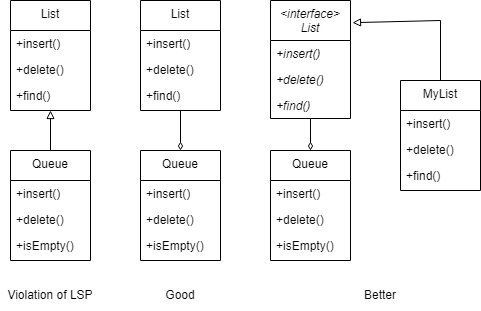{: w="31.67%"}

### Violation of LSP may lead to another violation
* Assume that when CType is passed to f() instead of PType, it causes f to misbehave.
    * **it means that CType violates the LSP**
    * CType is fragile in the presence of f

```java
void f(PType x) {
    // some code misbevaves when x is Ctype
    …
}
```

* The owner of f might want to put **test code for Ctype**.

```java
void f(PType x) {
    if (x instanceof( Ctype)) throw new RuntimeException();
    // some code misbevaves when x is Ctype
    …
}
```

* **The above reaction is worse. Now, it is violating OCP, too.**
    * f is not closed to all various subtypes of PType

## Dependency Inversion Principle (DIP)
> **High-level modules should not depend on low-level modules. Both should depend on abstractions** 

* **Abstractions should not depend on details. Details should depend on abstractions**.
* Why Inversion?
    * DIP attempts to **“invert” the dependencies** that result from a structured analysis and design approach.

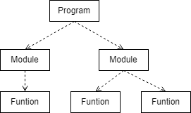{: w="26.67%"}
*Typical in Structured Analysis & Design*

* Interfaces and abstract classes are high-level resources
* Concrete classes are low-level resources

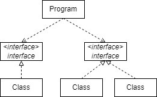{: w="26.67%"}
*Dependency Inversion Principle*

### Inversion of Ownership
* Its not just an inversion of **dependency**, DIP also inverts ownership.
    * Typically a service interface is “owned” or declared by the server, here the client is specifying what they want from the server
    * **DIP → Clients should own the interface**.

### The dependency inversion principle
{: w="30.83%"}

* High-level modules make calls to low-level modules. 
* The upper-level layer is dependent upon lower-level layers. 

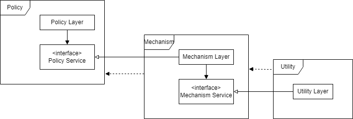{: w="35%"}

* Dependency Inversion: Lower-level layers is dependent upon upper-level layers.
* The client (upper-level layer) owns the interface, not the lower-level layers.

## Interface Segregation Principle (ISP)
> **Clients should not be forced to depend on methods they do not use**

* Make fine grained interfaces that are client specific.

### Fat interface
* Bundling functions for different clients into one interface create unnecessary coupling among the clients.
    * When one client causes the interface to change, all other clients are forced to recompile.
    * **Solution: Break the interface into cohesive groups**.
* ISP solves non-cohesive interfaces.
    * Clients should know only abstract base classes that have cohesive interfaces.

### Example
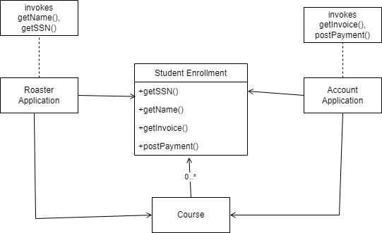{: w="30.83%"}
*Original Design*

* Suppose that RoasterApplication does not invoke methods getInvoice() or postPayment().
* Also suppose AccountApplication does not invoke the methods getName() or getSSN().
* Requirements change: add a new argument to the postPayment().
* This change force us to recompile and redeploy RoasterApplication, which does not care at all about the postPayment().

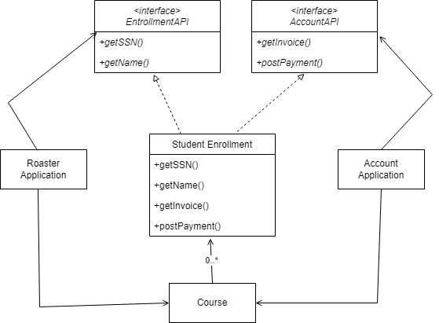{: w="32.5%"}
*Better Design*

* Now, each user of a StudentEnrollment object is given an interface that provides just the methods that it is interested in.
* This protects the user from changes in methods that don’t concern it.
* It also protects the user from knowing too much about the implementation of the object it is using.

