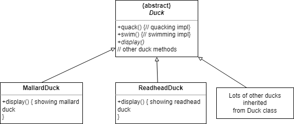
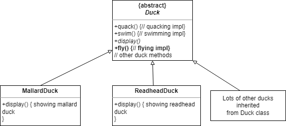
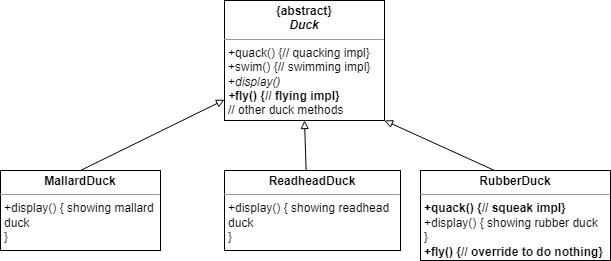
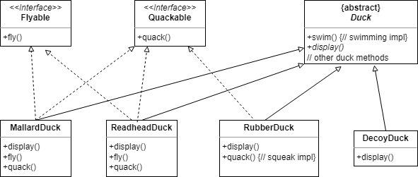
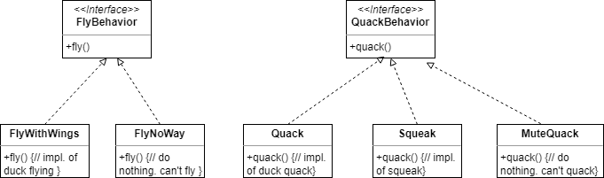
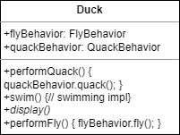
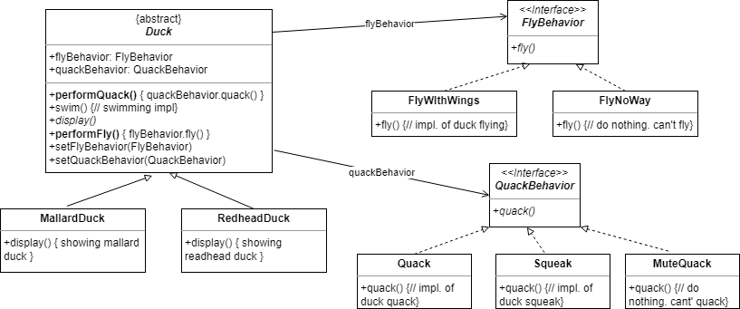
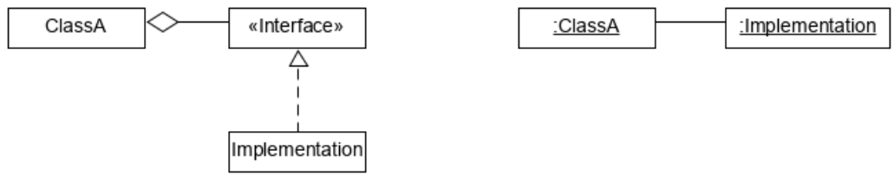
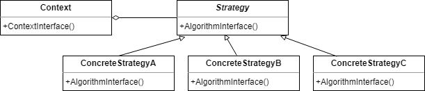
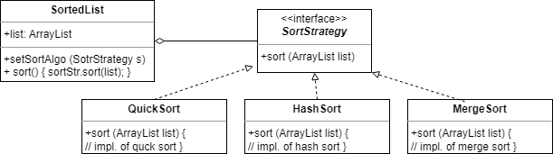

# Strategy Pattern
## Overview
### Purpose
* Defines a set of encapsulated algorithms that can be swapped to carry out a specific behavior.

### Use When
* The only difference between many related classes is their behavior.
* Multiple versions or variations of an algorithm are required.
* The behavior of a class should be defined at runtime.
* **Conditional statements** are complex and hard to maintain.

## Example
### Original Design
* Requirements
    * Every duck quacks.
    * Every duck swims in the same way.
    * Every duck requires its own display implementation.

{: w="420" h = "380"}
*Our Original Design*

### Requirement Changes...
* The original desing has been okay.
* We just got additional requirement - We need to add fly behavior to ducks.
* Let's add it to the base class!

{: w="420" h = "380"}
*Our First Attempt*

### Add a Rubber Duck
* A rubber duck can't fly, at least in our application!
* Overriding RubberDuck would solve the problem.

{: w="420" h = "380"}
*Overriding RubberDuck*

### More and More Ducks to Override
* Suppose we have to add a decoy duck.
    * The decoy duck cannot fly and cannot quack.
    * Would it be efficient to override every time?

### What we have here
* A localize update to the code caused a non-local side effect.
* A great use of inheritance for the purpose of *reuse* hasn't turned out so well when time comes to *maintenance*.

### Our Second Attempt: How about an Interface?
{: w="450" h = "350"}
*Our Second Attempt*

* Completely **destroy code reuse**.
* Create a *different* **maintenance nightmare**.
* There might be more than one kind of flying behavior even among the ducks that do fly.
    * Turkey, Chickent.. etc.

## Design Principle
### Encapsulate What Varies
* Identify the aspects of your application that vary and separate them from what stays the same.

### Seperating What Changes From What Stays The Same
* What is *changing* in SimDuck?
    * *Flying behavior* and *quack behavior*.
    * Each type of behavior has a *familiy*.
* To separate these behaviors from the Duck class, we'll
    * pull both methods out the Duck class.
    * *create a new set of classes* to represent each *bahavior*.

### Program to and interface, not an implementation
* Programming to a super type.
* Exploit Polymorphism.
* The declared type of the variables should be a super type.
    * The class declaring them doesn't have to know the actual object types.

{: w="430" h = "330"}

* **Programming to an implementation** would be:

```java
Dog d = new Dog();
d.bark();
```

* **Programming to an interface/supertype** would be:

```java
Animal a = new Dog();
a.makeSound();
```

* Even better, rather than hard-coding the instantiation of the subtype into the code, **assign the concrete implementation object at runtime**:

```java
Animal a = getAnimal("Dog");
a.makeSound();
```

## Improved Design
{: w="340" h = "360"}

### Class Duck
```java
public abstract class Duck {
    FlyBehavior flyBehavior; // object composition
    QuackBehavior quackBehavior; // object composition

    public Duck() {
    }

    public abstract void display();

    public void performFly() {
        flyBehavior.fly(); // delegation
    }

    public void performQuack() {
        quackBehavior.quack(); // delegation
    }

    public void swim() {
        System.out.println("All ducks float, even decoys!");
    }
}
```

### Interface FlyBehavior
```java
public interface FlyBehavior {
    public void fly();
}

public class FlyWithWings implements FlyBehavior {
    public void fly() {
        System.out.println("I'm flying!!");
    }
}

public class FlyNoWay implements FlyBehavior {
    public void fly() {
        System.out.println("I can't fly");
    }
}
```

### Interface QuackBehavior
```java
public interface QuackBehavior {
    public void quack();
}

public class Quack implements QuackBehavior {
    public void quack() {
        System.out.println("Qauck");
    }
}

public class MuteQuack implements QuackBehavior {
    public void quack() {
        System.out.println("<<silence>>");
    }
}

public class Squeak implements QuackBehavior {
    public void quack() {
        System.out.println("Squeak");
    }
}
```

### Concrete Ducks
```java
public class MallardDuck extends Duck {
    public MallardDuck() {
        quackBehavior = new Quack();
        flyBehavior = new FlyWithWings();
    }

    public void display() {
        System.out.println("I'm a real Mallard Duck");
    }
}
```

### Test Drive
```java
public class MiniDuckSimulator {
    public static void main(String[] args) {
        Duck mallard = new MallardDuck();
        mallard.performQuack();
        mallard.performFly();
    }
}
```

### Setting behavior dynamically
```java
public abstract class Duck {
    FlyBehavior flyBehavior; 
    QuackBehavior quackBehavior; 

    ...

    public void setFlyBehavior(FlyBehavior fb) {
        this.flyBehavior = fb;
    }

    public void setQuackBehavior(QuackBehavior qb) {
        this.quackBehavior = qb;
    }
}
```

### The Big Picture
{: w="480" h = "440"}

## Design principle: Favor Composition Over Inheritance (or Composing Objects Principle)
* Classes should achieve polymorphic behavior and code reuse
    * *by their composition rather than inheritance* (= by containing instances of other classes implementing the desired functionality)
* Delegation
    * passing method calls to a composed object
* **Favor (Object) Composition over (Class) Inheritance**
    * Most design patterns emphasize object composition over inheritance whenever it is possible.

{: w="370" h = "310"}

## Reuse in Object-Oriented System
1. Class Inheritance
    * subclass' implementation is defined in terms of the parent class' implementation.
    * the parent class implementation is often visible to the subclasses.
    * While-box reuse
    * pros
        * *done at compile-time and is easy to use*.
    * cons
        * the subclass becomes *dependent on the parent class implementation*.
        * the inherited implementation *cannot be changed at run-time*.
2. Object Composition
    * object are composed to achieve more complex functionality.
    * needs well-defined interfaces since the internals of the objects are unknown.
    * functionality is acquired dynamically at run-time by utilizing references to other objects.
    * Black-box reuse
    * pros
        * *implementations can be replaced at runtime*.
        * *less implementation dependencies*.
        * *harder to understand*.

## The Strategy Pattern
* Strategy Pattern
    * Defines a family of algorithms,
    * Encapsulates each one,
    * And makes them interchangeable.
* Strategy Pattern lets the algorithm vary independently from clients that use it.

{: w="380" h = "340"}
*Strategy Pattern*

### Sorting Example
* Requirement
    * we want to sort a list of integers using different sorting algorithms, e.g. quick sort, selection sort, insertion sort, etc.
* One way to solve this problem is to write a function for each sorting algorithm.
* A better way is to use the Strategy pattern.

{: w="380" h = "340"}
*Sorting Example*