# CPU Scheduling
## Basic Concepts
* CPU *scheduling* is the basis of multiprogrammed operating systems.
* The objective of *multiprogramming* is to have some processes running at all times to maximize CPU utilization.

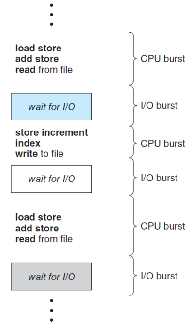{: w="310" h = "380"}
*Alternating sequence of CPU-bursts and I/O-bursts*

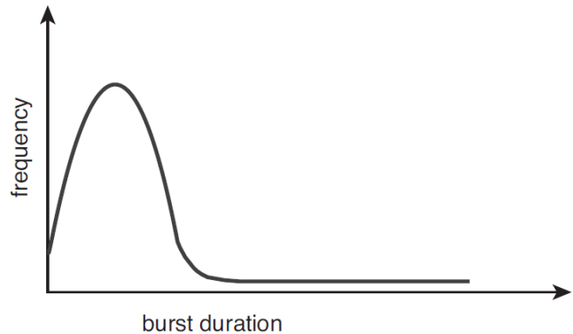{: w="410" h = "360"}
*Histogram of CPU-burst duration*

* CPU scheduler selects a process from the processes in memory that are *ready* to execute and *allocates* the CPU to that process.
* Then, how can we select a next process?
    * Linked List? or Binary Tree?
    * *FIFO Queue*
    * *Priority Queue*: How can we determine the priority of a process?

### Preemptive vs Non-preemptive
* **Non-preemptive** scheduling
    * A process keeps the CPU until it releases it, either by terminating or by switching to the waiting state.
* **Preemptive** scheduling
    * A process can be preempted by the scheduler.

* Decision Making for CPU-scheduling
    1. When a process switches from the *running* to *waiting* state.
    2. When a process switches from the *running* to *ready* state.
    3. When a process switches from the *waiting* to *ready* state.
    4. When a process *terminates*.
* No. 1 & 4: no choice – non-preemptive.
* No. 2 & 3: choices – preemptive or non-preemptive.

### Dispatcher
* The **dispatcher** is a module that gives control of the CPU’s core to the process selected by the CPU scheduler.
* The functions of dispatcher:
    * Switching context from one process to another -> Context Switching
    * Switching to user mode
    * Jumping to the proper location to resume the user program

* The dispatcher should be as fast as possible since it is invoked during every context switch.
* The *dispatcher latency* is the time to stop one process and start another running.

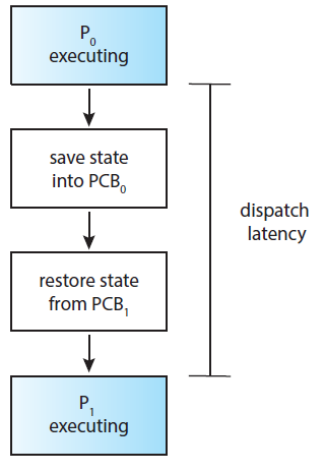{: w="310" h = "340"}
*The role of the dispatcher*

## Scheduling Criteria
* *CPU utilization*: To keep the CPU as busy as possible.
* *Throughput*: The number of processes completed per time unit.
* **Turnaround time**: How long does it take to execute a processfrom the time of submission to the time of completion.
* **Waiting time**:
    * The amount of time that a process spends waiting in the ready queue.
    * The sum of periods spend waiting in the ready queue.
* *Response time*: The time it takes to start responding.

## Scheduling Algorithm
* CPU Scheduling Problem: Decide which of the processes in the ready queue is to be allocated the CPU’s core.
* The solutions for the scheduling problem
    * **FCFS**: First-Come, First-Served
    * **SJF**: Shortest Job First (**SRTF**: Shortest Remaining Time First)
    * **RR**: Round-Robin
    * **Priority-based**
    * **MLQ**: Multi-Level Queue
    * **MLFQ**: Multi-Level Feedback Queue

### FCFS Scheduling
* The simplest CPU-scheduling algorithm.
* The process that requests the CPU first is allocated the CPU first.
    * can be easily implemented with a FIFO queue.

* Consider the following set of processes that arrive at time 0, with the length of the CPU burst given in milliseconds

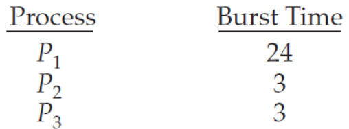{: w="300" h = "280"}

* If the processes arrive in the *order 𝑃1, 𝑃2, 𝑃3*:

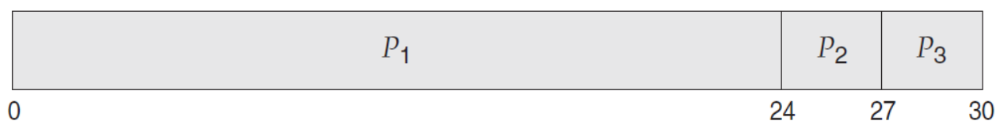{: w="360" h = "260"}
*Gantt Chart served by the FCFS policy*

* Calculate the *Waiting time* of this schedule
    * Waiting Time for 𝑃1 = 0, 𝑃2 = 24, 𝑃3 = 27
    * *Total* Waiting Time: (0 + 24 + 27) = 51
    * *Average* Waiting Time: 51/3 = 17
* Let us calculate the *Turnaround time*:
    * Turnaround Time for 𝑃1 = 24, 𝑃2 = 27, 𝑃3 = 30
    * *Total* Turnaround Time: (24 + 27 + 30) = 81
    * *Average* Turnaround Time: 81/3 = 27

* If the processes arrive in the *order 𝑃2, 𝑃3, 𝑃1*:

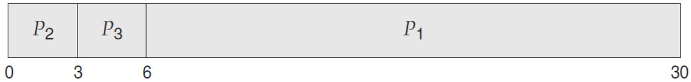{: w="360" h = "260"}
*Gantt Chart served by the FCFS policy*

* Calculate the *Waiting time* of this schedule.
    * Waiting Time for 𝑃1 = 6, 𝑃2 = 0, 𝑃3 = 3
    * *Total* Waiting Time: (6 + 0 + 3) = 9
    * *Average* Waiting Time: 9/3 = 3
* Let us calculate the *Turnaround time*:
    * Turnaround Time for 𝑃1 = 30, 𝑃2 = 3, 𝑃3 = 6
    * *Total* Turnaround Time: (30 + 3 + 6) = 39
    * *Average* Turnaround Time: 39/3 = 13

* Note that
    * The average waiting time under the **FCFS** policy is generally *not minimal* and *may vary* substantially if the processes’ **CPU-burst times** vary greatly.
    * Preemptive or non-preemptive?
        * The FCFS scheduling algorithm is **non-preemptive**.
* Note also that
    * The performance in a dynamic situation:
        * What if we have *one CPU-bound* and *many I/O-bound* processes?
        * CPU-bound가 큰 𝑃1과, 다른 𝑃들이 있을 때
            * 𝑃1이 가장 먼저 도착해버리면 나머지 𝑃들은 대기 시간이 길어짐 -> waiting time이 너무 길어짐(Convoy Effect)
    * **Convoy Effect**:
        * All the other processes wait for the one big process to get off the CPU.
        * Results in lower CPU and device utilization than might be possible if the shorter processes were allowed to go first.

### SJF Scheduling
* Shortest-Job-First: *shortest-next-CPU-burst-first* scheduling.
* SJF associates with each process: the length of the process’s next CPU burst.
* When the CPU is available, assign it to the process that has the smallest next CPU burst.
* If two or more processes are even, break the tie with the FCFS.

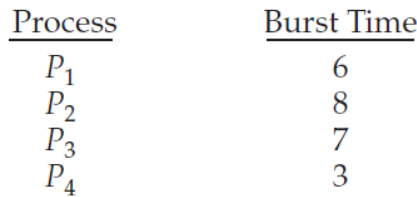{: w="300" h = "280"}

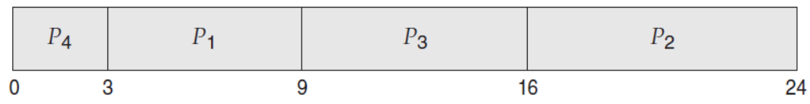{: w="360" h = "260"}
*Gantt Chart served by the SJF policy*

* Calculate the *Waiting time*:
    * Waiting Time for 𝑃1 = 3, 𝑃2 = 16, 𝑃3 = 9, 𝑃4 = 0
    * *Total* Waiting Time: (3 + 16 + 9 + 0) = 28
    * *Average* Waiting Time: 28/4 = 7
* Calculate the *Turnaround time*:
    * Turnaround Time for 𝑃1 = 9, 𝑃2 = 24, 𝑃3 = 16, 𝑃4 = 3
    * *Total* Turnaround Time: (9 + 24 + 16 + 3) = 52
    * *Average* Turnaround Time: 52/4 = 13

* Note that
    * The **SJF** scheduling algorithm is **provably optimal**, it gives the minimum average waiting time for a given set of processes.
    * Moving a short process before a long one decreases the waiting time of the short process more than it increases the waiting time of the long process.
    * Consequently, the average waiting time decreases.

* Can you implement the SJF scheduling?
    * There is **no way** to know the length of the *next CPU burst*.
    * Try to approximate the SJF scheduling:
        * We may be able to **predict** the length of the next CPU.
        * Pick a process with the shortest predicted CPU burst.
* How to predict the next CPU burst?
    * *Exponential average* of the measured lengths of *previous* CPU burst.
    * **$\tau_{n + 1} = \alpha\tau_n + (1 - \alpha)\tau_n$**, where
        * $\tau_n$ is the length of 𝑛th CPU burst,
        * $\tau_{n+1}$ is our predicted value for the next CPU burst,
        * for $ 0 <= \alpha <= 1$

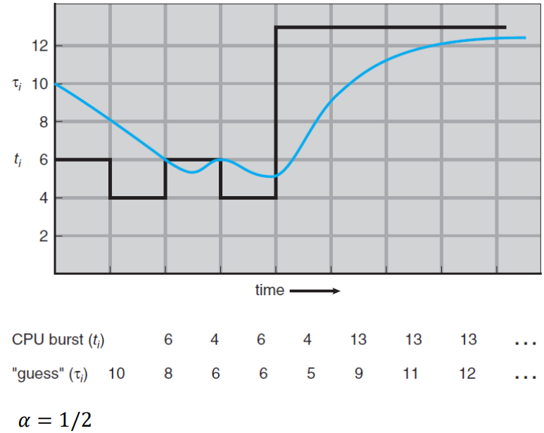{: w="420" h = "380"}
*Prediction of the length of the next CPU burst*

* Note also that
    * The **SJF** algorithm can be either **preemptive** or **non-preemptive**.
    * The choice arises: When a new process arrives at the *ready* queue while a *previous* process is still executing.
    * What if a *newly* arrived process is shorter than what is *left* of the currently executing process?
        * 이론적으로는 preemptive하게 하는 것이 유리하지만, 남은 CPU burst time을 구하는 것은 쉽지 않음

### SRTF Scheduling
* Shortest-Remaining-Time-First: **Preemptive SJF** scheduling
* SRTF will *preempt* the currently running process, whereas a non-preemptive SJF will *allow* it to *finish* its CPU burst.

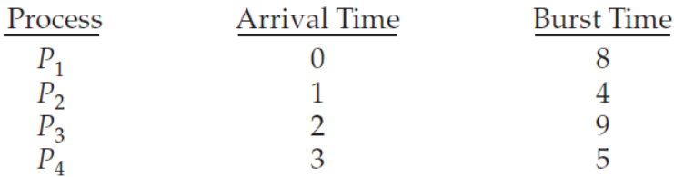{: w="340" h = "280"}

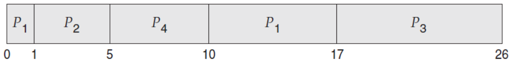{: w="360" h = "260"}
*Gantt Chart served by the SRTF policy*

* In SRTF:
    * *Waiting time*
        * *Total* Waiting Time: [ 10 − 1 + 1 − 1 + 17 − 2 + 5 − 3 ] = 26
        * *Average* Waiting Time: 26/4 = 6.5
    * *Turnaround* Time
        * *Total* Turnaround Time: [17 - 0 + 5 - 1 + 26 - 2 + 10 - 3] = 52
        * *Average* Turnaround Time: 52/4 = 13
* In SJF:
    * *Waiting time*
        * Total Waiting Time: [0 + 8 - 1 + 12 - 2 + 21 - 3] = 35
        * *Average* Waiting Time: 35/4 = 8.75
    * *Turnaround* Time
        * *Total* Turnaround Time: [8 - 0 + 12 - 1 + 21 - 2 + 26 - 3] = 61
        * *Average* Turnaround Time: 61/4 = 15.25

### RR Scheduling
* Round-Robin: **preemptive FCFS** with a *time quantum*.
* A **time quantum** (or time slice) is a small unit of time.
    * generally from 10 to 100 milliseconds in length.
* The ready queue is treated as a *circular queue*.
* The scheduler goes around the ready queue, allocating the CPU to each process for a time interval of up to 1 time quantum.

* One of two things will happen:
    * The process may have a CPU burst of *less than one time quantum*.
        * The process itself will release the CPU voluntarily
        * The scheduler will proceed to the next process in the ready queue.
    * If the CPU burst is *longer than one time quantum*, the timer will go off and will cause an interrupt to the OS.
        * A context switch will be executed, the process will be put at the tail of the ready queue.

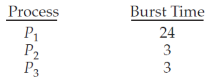{: w="300" h = "280"}

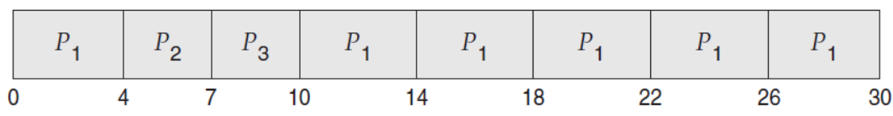{: w="360" h = "260"}
*Gantt Chart served by the RR policy when we use a time quantum of 4 milliseconds*

* The *Waiting time*:
    * Waiting Time for 𝑃1 = 10 − 4 = 6, 𝑃2 = 4, 𝑃3 = 7
    * *Total* Waiting Time: (6 + 4 + 7) = 17
    * *Average* Waiting Time: 17/3 = 5.66

* Note that
    * The average waiting time under the RR policy is often long.
    * The RR scheduling algorithm is **preemptive**.
        * If a process’s CPU burst exceeds one time quantum, that process is *preempted* and is put back in the ready queue.

* The performance of the RR scheduling algorithm depends heavily on the *size of the time quantum*.

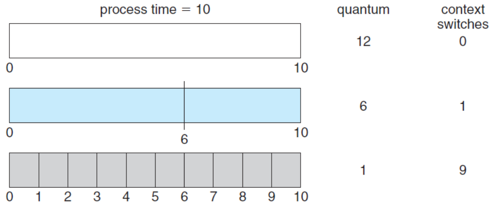{: w="450" h = "350"}
*How a smaller time quantum increases context switches*

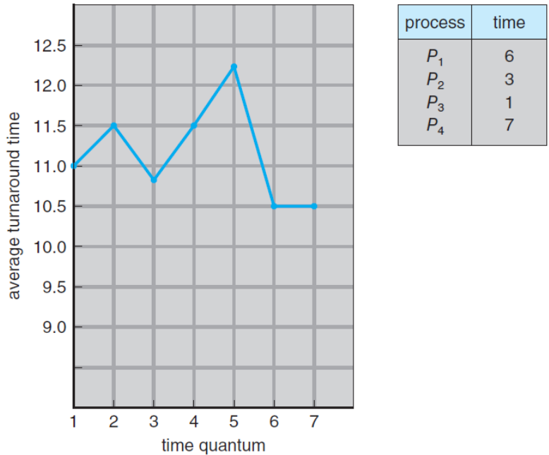{: w="450" h = "430"}
*How turnaround time varies with the time quantum*

### Priority base Scheduling
* A *priority* is associated with each process, and the CPU is allocated to the process with the *highest priority*.
    * Processes with *equal* priority are scheduled in *FCFS* order.
* Note that the *SJF* is a special case of the priority-based scheduling.
    * In this case, the priority is the *inverse* of the *next CPU burst*.
* We assume that low numbers represent high priority.

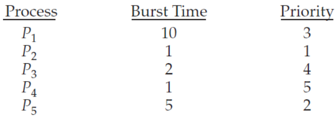{: w="340" h = "280"}

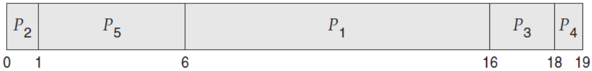{: w="360" h = "260"}
*Gantt Chart served by the Priority base policy*

* The average waiting time: 8.2
* The average turnaround time: 12

* Priority scheduling can be either **preemptive** or **non-preemptive**.
* The problem of **starvation** (indefinite blocking)
    * A *blocked process*: ready to run, but waiting for the CPU.
    * Some low-priority processes may wait indefinitely.
* A solution to the starvation problem is **aging** gradually increase the priority of processes that wait in the system for a long time.

* Combine RR and Priority scheduling: execute the *highest-priority* process and runs processes with the same priority using *round-robin* scheduling.

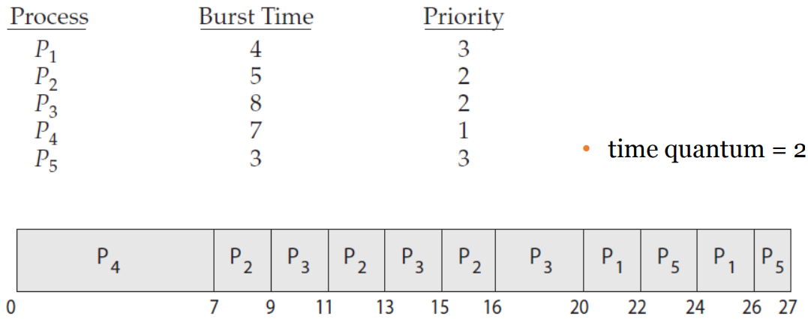{: w="480" h = "420"}
*Example that combine RR and Priority policy*

### Multi-Level Queue(MLQ) Scheduling

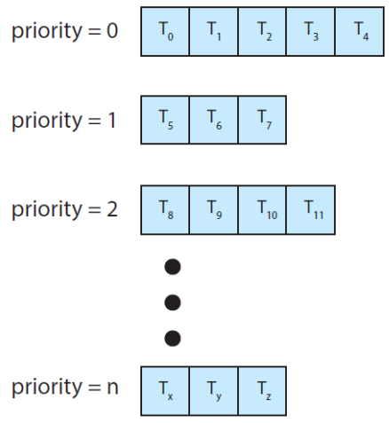{: w="340" h = "360"}
*Separate queues for each priority*

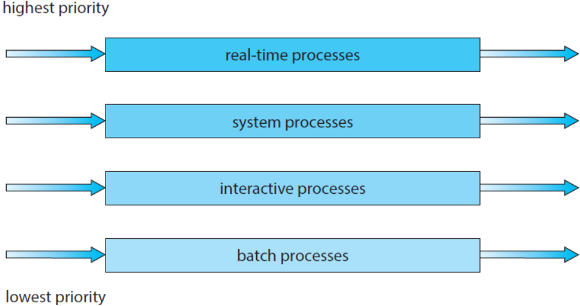{: w="380" h = "340"}
*Multi-Level Queue scheduling*

### Multi-Level Feedback Queue(MLFQ) Scheduling
* MLQ같은 경우, 우선순위가 낮은 process에서 starvation이 발생할 수 있음
* 이를 방지하기 위해, Aging 기법으로 우선순위를 바꿔주는 등 다양한 방법을 도입

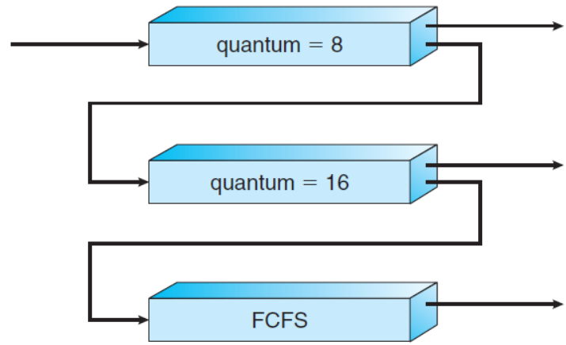{: w="360" h = "360"}
*Multi-Level Feedback Queue scheduling*

* 처음 process가 실행될 때는 quantum이 8만큼 실행
* 이때 작업이 다 끝나지 않은 상태에서 interrupt가 되면 quantum = 16인 큐로 이동하여 대기
* 이후 quantum이 16만큼 실행
* 이런 과정을 여러 큐를 두고 반복하며 점점 CPU 할당 시간을 늘려주며 실행

## Thread Scheduling
* On most modern operating systems
    * It is **kernel threads** – not **processes** – that are being scheduled, and *user threads* are managed by a thread library.
    * So, the kernel is unaware of them, ultimately mapped to associated kernel threads.

## Real-Time CPU Scheduling
* **Soft Realtime** vs **Hard Realtime**
* Soft real-time systems provide no guarantee 
    * As to when a critical real-time process will be scheduled.
    * Guarantee only that a critical process is preferred to noncritical one. 
* Hard real-time systems have stricter requirements.
    * A task must be services by its deadline.
