# DeadLocks
## System Model
* A **deadlock** is a situation in which every process in *a set of processes* is waiting for an event that can be caused only *by another process in the set*.
    * A situation in which a waiting thread (or process) can *never again change state*, because the *resources* it has requested are held by other waiting threads (or processes).

* Let us consider a system consisting of *a finite number of resources* to be distributed among a number of *competing threads*.
* **Resource types** consist of some number of **identical instances**. 
    * e.g., CPU cycles, files, and I/O devices(such as printers, drives, etc.)
* If a thread requests an *instance* of a *resource type*, the allocation of **any instance** should satisfy the request.
* A thread may utilize a resource as follows: **Request** – Use – **Release**.

## Deadlock in Multithreaded Applications
* How can a deadlock occur?

```
pthread_mutex_t first_mutex;
pthread_mutex_t second_mutex;

pthread_mutex_init(&first_mutex, NULL);
pthread_mutex_init(&second_mutex, NULL);

/* thread_one runs in this function */
void *do_work_one(void *param)
{
    pthread_mutex_lock(&first_mutex);
    pthread_mutex_lock(&second_mutex);
    /*
    * Do some work
    */
    pthread_mutex_unlock(&second_mutex);
    pthread_mutex_unlock(&first_mutex);

    pthread_exit(0);
}

/* thread_two runs in this function */
void *do_work_two(void *param)
{
    pthread_mutex_lock(&second_mutex);
    pthread_mutex_lock(&first_mutex);
    /*
    * Do some work
    */
    pthread_mutex_unlock(&first_mutex);
    pthread_mutex_unlock(&second_mutex);

    pthread_exit(0);
}
```

## Deadlock Characterization
* Four Necessary Conditions:
    1. **Mutual Exclusion**: *At least* one resource *is held* in a *non-sharable* mode.
    2. **Hold and Wait**: A thread *holds at least* one resource and *waiting to acquire* additional resources *held by* other threads.
    3. **No preemption**: Resources *cannot* be *preempted*.
    4. **Circular Wait**: *A set of waiting threads* exist such that the *dependency graph* of waiting is *circular*.

### Resource-Allocation Graph
* Rsource-allocation graph is a *directed graph* to describe deadlocks more precisely.
    * consists of a set of vertices 𝑉 and a set of edges 𝐸.
    * Two different node types of V: 
        * 𝑇 = {𝑇1, 𝑇2, ⋯ , 𝑇𝑛}: the set of all the *active threads* in the system.
        * 𝑅 = {𝑅1, 𝑅2, ⋯ , 𝑇𝑚}: the set of all the *resource types* in the system.
    * A directed edge: 𝑇𝑖 → 𝑅𝑗 (**request edge**)
        * signifies that a thread 𝑇𝑖 has requested an instance of 𝑅𝑗.
    * A directed edge: 𝑅𝑗 → 𝑇𝑖 (**assignment edge**)
        * signifies that an instance of 𝑅𝑗 has been allocated to a thread 𝑇𝑖.

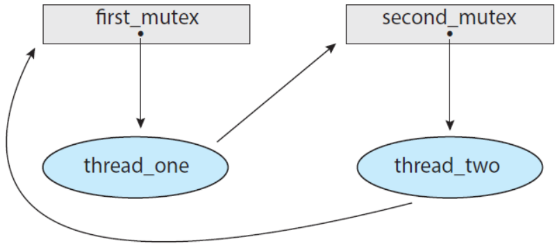{: w="340" h = "300"}
*Resource-allocation graph for program in upper example code*

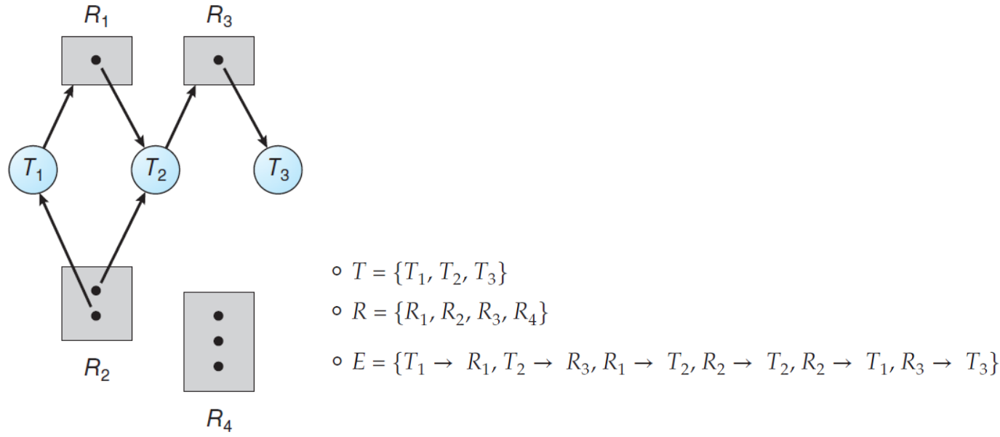{: w="480" h = "360"}
*Resource-allocation graph*

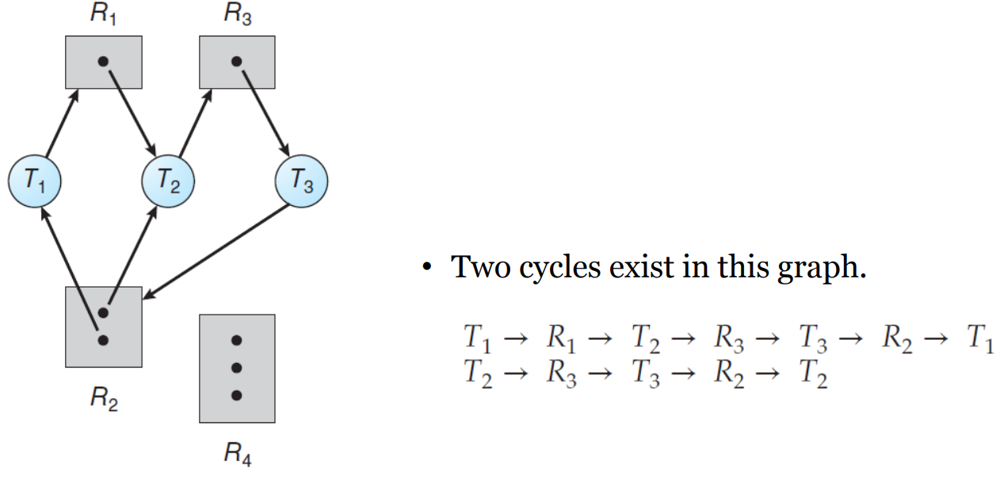{: w="460" h = "360"}
*Resource-allocation graph with a deadlock*

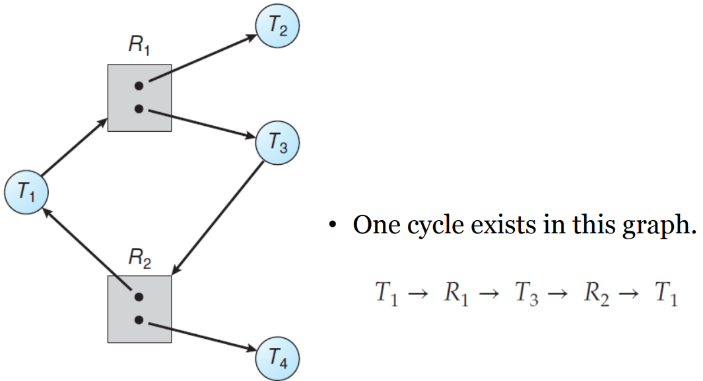{: w="420" h = "360"}
*Resource-allocation graph with a cycle but no deadlock*

* An important observation
    * If a resource-allocation graph does *not have a cycle*, then the system is **not** in a deadlocked state.
    * If a resource-allocation graph *has a cycle*, then the system **may** or **may not** be in a deadlocked state.

## Methods for Handling Deadlocks
* Three ways of dealing with the Deadlock Problem
    * **Ignore** the problem altogether and pretend that deadlocks never occur in the system.
    * Use a protocol to **prevent** or **avoid** deadlocks, ensuring that the system will *never enter* a deadlocked state.
        * Deadlock Prevention: 거의 불가능
        * *Deadlock Avoidance*: **Banker’s Algorithm**
    * Allow the system to enter a deadlocked state, then **detect** it, and **recover** it.
        * Deadlock Detection
        * Recovery from Deadlock

## Deadlock Prevention
* For a deadlock to occur, each of the *four necessary conditions* must hold.
* Hence, we can **prevent** the occurrence of a deadlock, by ensuring that *at least one* of these conditions cannot hold.
    1. Mutual Exclusion
    2. Hold and Wait
    3. No Preemption
    4. Circular Wait

* Mutual Exclusion
    * At least one resource must be non-sharable.
    * In general, it *cannot be applied* to most applications.
        * some resources are *intrinsically* non-sharable.
        * e.g., a mutex lock cannot be shared by several threads.
* Hold and Wait
    * We can guarantee that, whenever a thread requests a resource, it does not hold any other resources.
    * It is *impractical* for most applications.
* No preemption
    * We can use a protocol to ensure that there should be *preemption*.
    * If a thread is holding some resources and requests another resources that cannot be immediately allocated to it.
        * then, all resources the thread is currently holding are *preempted*.
    * The preempted resources are added to the list of resources for which the threads are waiting.
    * The thread will be restarted only when it can regain its old resources as well as new ones.
    * *Cannot generally be applied* to most applications.
* Circular Wait: sometimes *practical*.
    * Impose a *total ordering* of all resource types and to require that each thread requests resources in an *increasing order* of enumeration.
    * It is provable that these two protocols are used, then the circular-wait condition cannot hold.
    * Note that, however, imposing a lock ordering does not guarantee deadlock prevention, if locks can be acquired dynamically.

```
/* Deadlock example with lock ordering */

void transaction(Account from, Account to, double amount)
{
    mutex lock1, lock2;
    lock1 = get_lock(from);
    lock2 = get_lock(to);

    acquire(lock1);
        acquire(lock2);

            withdraw(from, amount);
            deposit(to, amount);

        release(lock2);
    release(lock1);
}

transaction(checking_account, saving_account, 25.0);
transaction(saving_account, checking_account, 50.0);
```

* The *Demerits* of the Deadlock Prevention
    * It prevents deadlocks by limiting how requests can made, ensuring that *at least one of the necessary conditions* cannot occur.
    * However, possible side effects of preventing deadlocks are *low device utilization* and *reduced system throughput*.

## Deadlock Avoidance
* Let the system to decide for each request whether or not the thread should *wait* in order to avoid a possible *future deadlock*.
* It requires additional information about *how resources are to be requested*.
* For example, in a system with resources 𝑅1 and 𝑅2,
    * A thread 𝑃 will request first 𝑅1 and then 𝑅2 before releasing them.
    * A thread 𝑄 will request 𝑅2 then 𝑅1.

* Given a *priori* information, it is possible to construct an algorithm that ensures the system will *never enter* a deadlocked state.
    * Let the **maximum number** of resources of each type that it may need.
    * Let the state of resource allocation be the number of **available** and **allocated** resources and the **maximum demands** of the threads.

### Safe State
* A state is *safe* if the system *can allocate* resources to each thread (up to its maximum) *in some order* and *still avoid* a deadlock.
* A system is in a safe state if only if there exists a **safe sequence**.
* A sequence of threads *〈𝑇1, 𝑇2, ⋯ , 𝑇𝑛〉* is a *safe sequence*, if, for each thread 𝑇𝑖, the resources that 𝑇𝑖 can still request can be satisfied by the currently available resources + resources held by all 𝑇𝑗, with 𝑗 < 𝑖.

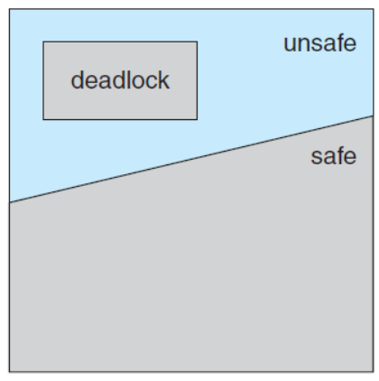{: w="310" h = "310"}
*Safe, unsafe, and deadlocked state spaces*

* Basic facts
    * A *safe state* is not a deadlocked state.
    * Conversely, a deadlocked state is an unsafe state.
    * However, not all unsafe states are deadlocks, an unsafe state *may* lead to a deadlock.

* Given the concept of a *safe state*
    * We can define an avoidance algorithm that ensure that the system will *never enter* a deadlocked state.
    * The idea is simply to ensure that the system will **always remain in a safe state**.
    * *Initially*, the system is *in a safe state*.
    * Whenever a thread requests a resource that is currently available, the system *decides* whether the resource can be *allocated or not*.
    * The request is *granted if and only if* the allocation *leaves* the system *in a safe state*.

### Revisit the Resource-Allocation Graph
* Suppose that a system has **only one instance** of each resource type.
* Then, introduce a new type of edge, called a **claim edge**.
* A claim edge: 𝑇𝑖 → 𝑅𝑗 indicates that a thread *may* request a resource at some time *in the future*.
* Then we can check for the safety by a *cycle-detection* algorithm in a directed graph.
* If **no cycle** exists, the request can be *granted* immediately, since the resource allocation will leave the system in a *safe state*.
* If a *cycle* is *detected*, then the request *cannot be granted*, since the resource allocation will put the system in an *unsafe state*.

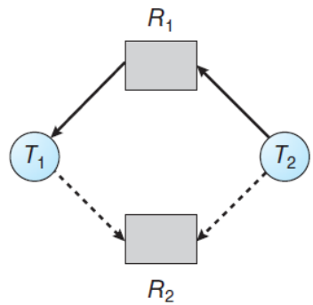{: w="300" h = "300"}
*Resource-allocation graph for deadlock avoidance*

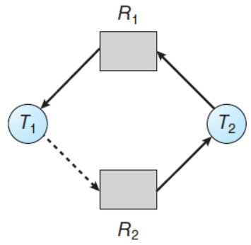{: w="300" h = "300"}
*An unsafe state in a resource-allocation graph*

### Banker's Algorithm
* RAG is not applicable to a resource allocation system with **multiple instances** of each resource type.
* Banker’s algorithm is *applicable* to such a system but *less efficient* and *more complicated* than the RAG.
* Why Banker’s?
    * The bank never allocates its available cash in such a way that it could no longer satisfy the needs of all its customers.

* Data structures
    * Let 𝑛 be the number of *threads* in the system and let 𝑚 be the number of *resource types*.
    * **Available**: A vector indicates the number of *available resource types*.
    * **Max**: A matrix defines the *maximum demand* of each thread.
    * **Allocation**: A matrix defines the number of resources of each type *currently allocated* to each thread.
    * **Need**: A matrix indicates the *remaining resource need* of each thread.
* Data structure example
    * 𝑨𝒗𝒂𝒊𝒍𝒂𝒃𝒍𝒆[𝒎]: if 𝐴𝑣𝑎𝑖𝑙𝑎𝑏𝑙𝑒[𝑗] == 𝑘, then 𝑘 instances of 𝑅𝑗 are available.
    * 𝑴𝒂𝒙[𝒏 × 𝒎]: if 𝑀𝑎𝑥[𝑖][𝑗] == 𝑘, then 𝑇𝑖 may request at most 𝑘 instances of 𝑅𝑗.
    * 𝑨𝒍𝒍𝒐𝒄𝒂𝒕𝒊𝒐𝒏[𝒏 × 𝒎]: if 𝐴𝑙𝑙𝑜𝑐𝑎𝑡𝑖𝑜𝑛[𝑖][𝑗] == 𝑘, then 𝑇𝑖 is currently allocated 𝑘 instances of 𝑅𝑗.
    * 𝑵𝒆𝒆𝒅[𝒏 × 𝒎]: if 𝑁𝑒𝑒𝑑[𝑖][𝑗] == 𝑘, then 𝑇𝑖 may need 𝑘 more instances of 𝑅𝑗.

* **Safety algorithm**
    1. Let *Work* and *Finish* be vectors of length *m* and *n*, respectively. Initialize *Work = Available* and *Finish[i] = false* for *i = 0, 1, ..., n - 1*.
    2. Find an index *i* such that both
        * *Finish[i] == false*
        * *Needi <= Work*
        * If no such *i* exists, go to step 4.
    3. *Work = Work + Allocationi*, *Finish[i] = true*. Go to step 2.
    4. If *Finish[i] == true* for all *i*, then the system is in a safe state.

* **Resource-request algorithm**
    1. If *Requesti <= Needi*, go to step2. Otherwise, raise an error condition, since the thread has exceeded its maximum claim.
    2. If *Requesti <= Available*, go to step 3. Otherwise, *Ti* must wait, since the resources are not available.
    3. Have the system pretend to have allocated the requested resources to thread *Ti* by modifying the state as follows
        * *Available = Available - Requesti*
        * *Allocationi = Allocationi + Requesti*
        * *Needi = Needi - Requesti*

### An Illustrative Example
* A set of five threads: 𝑇 = {𝑇0, 𝑇1, 𝑇2, 𝑇3, 𝑇4}
* A set of three resource types: 𝑅 = {𝐴, 𝐵, 𝐶}
* The number of instances of each resource types: 𝐴 = 10,𝐵 = 5, 𝐶 = 7
* The snapshot representing the current state of the system:

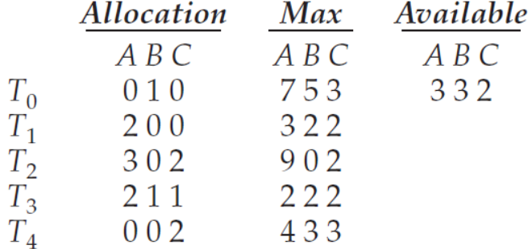{: w="340" h = "300"}

* Note that 𝑁𝑒𝑒𝑑[𝑖][𝑗] = 𝑀𝑎𝑥[𝑖][𝑗] − 𝐴𝑙𝑙𝑜𝑐𝑎𝑡𝑖𝑜𝑛[𝑖][𝑗].

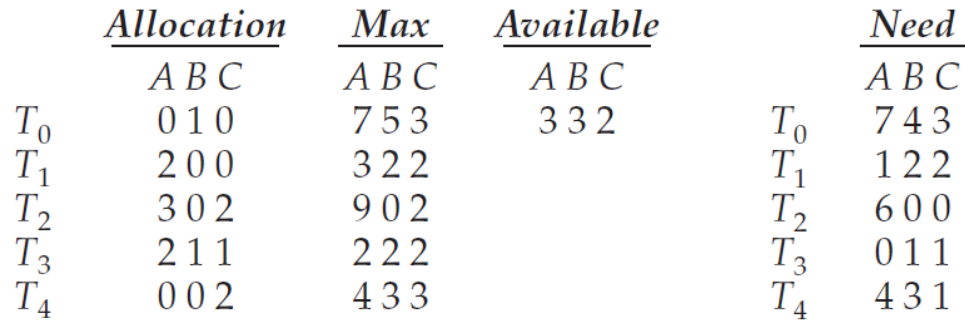{: w="370" h = "300"}

* Now we claim that the system is currently in a safe state.
    * In deed, the sequence 〈𝑇1, 𝑇3, 𝑇4, 𝑇2, 𝑇0〉 satisfies the safety criteria.
    
```
/* Sequence of Safety Algorithm */

Work = {3, 3, 2}
Finish = {false, false, false, false, false} // T1 ~ T0

i = 0,
Need[0] = {7, 4, 3}
Need[0] <= Work is false

i = 1,
Need[1] = {1, 2, 2}
Need[1] <= Work is true
update Work = Work + Allocation[1] = {5, 3, 2}
update Finish = {false, true, false, false, false} 

i = 2, 
Need[2] = {6, 0, 0}
Need[2] <= Work is false

i = 3,
Need[3] = {0, 1, 1}
Need[3] <= Work is true
update Work = Work + Allocation[3] = {7, 4, 3}
update Finish = {false, true, false, true, false} 

i = 4,
Need[4] = {4, 3, 1}
Need[4] <= Work is true
update Work = Work + Allocation[4] = {7, 4, 5}
update Finish = {false, true, false, true, true} 

i = 0,
Need[0] = {7, 4, 3}
Need[0] <= Work is true
update Work = Work + Allocation[0] = {7, 5, 5}
update Finish = {true, true, false, true, true} 

i = 2, 
Need[2] = {6, 0, 0}
Need[2] <= Work is true
update Work = Work + Allocation[2] = {10, 5, 7}
update Finish = {true, true, true, true, true} 

all elements in Finish vector are true
```

* When a *new request* is submitted
    * Suppose that 𝑇1 requests one instance of 𝐴 and two instances of 𝐶.
        * 𝑅𝑒𝑞𝑢𝑒𝑠𝑡1 = (1, 0, 2), 
    * Decide whether this request should be *granted or not*. - Resource-request algorithm
        * 𝑅𝑒𝑞𝑢𝑒𝑠𝑡1 ≤ 𝐴𝑣𝑎𝑖𝑙𝑎𝑏𝑙e - (1,0,2) ≤ (3,3,2)
        * (2,0,0) + (1,0,2) = (3,0,2)
        * (3,3,2) − (1,0,2) = (2,3,0)
        * (1,2,2) − (1,0,2) = (0,2,0)

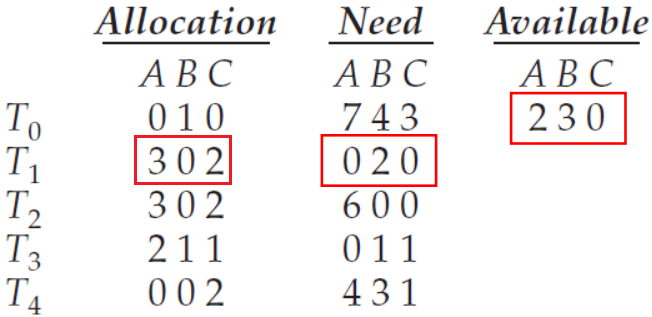{: w="330" h = "290"}

* Now, determine whether this new system state is safe.
    * Safety algorithm finds that 〈𝑇1, 𝑇3, 𝑇4, 𝑇0, 𝑇2〉 satisfies the safety. 

* Now, determine with a request of (3, 3, 0) by 𝑇4.
    * 𝑅𝑒𝑞𝑢𝑒𝑠𝑡4 = (3, 3, 0)
    * Request4 <= Need4: (3,3,0) <= (4,3,1)
    * Request4 <= Available: (3,3,3) <= (2,3,0)
        * Not true - Reject request
* How about a request of (0, 2, 0) by 𝑇0?
    * 𝑅𝑒𝑞𝑢𝑒𝑠𝑡0 = (0, 2, 0)
    * Request0 <= Need0: (0,2,0) <= (7,4,3)
    * Request0 <= Available: (0,2,0) <= (2,3,0)
    * (0,1,0) + (0,2,0) = (0,3,0)
    * (7,4,3) − (0,2,0) = (7,2,3)
    * (2,3,0) − (0,2,0) = (2,1,0)
    * Determine whether this new system state is safe.
        * Safety algorithm finds that 〈𝑇1, 𝑇3, 𝑇4, 𝑇0, 𝑇2〉 does not satisfie the safety. 

## Deadlock Detection
* If a system does not *prevent* or *avoid* the deadlock, then a deadlock situation may occur. 
* In this environment, the system may provide:
    * An algorithm that examines the state of the system to *determine* whether a deadlock has *occurred*.
    * An algorithm to *recover* from the deadlock.

* *Single Instance* of Each Resource Type
    * Maintain a **wait-for graph**, a variant of the resource-allocation graph.
    * *Periodically, invoke an algorithm* that searches for a cycle in the wait-for graph.

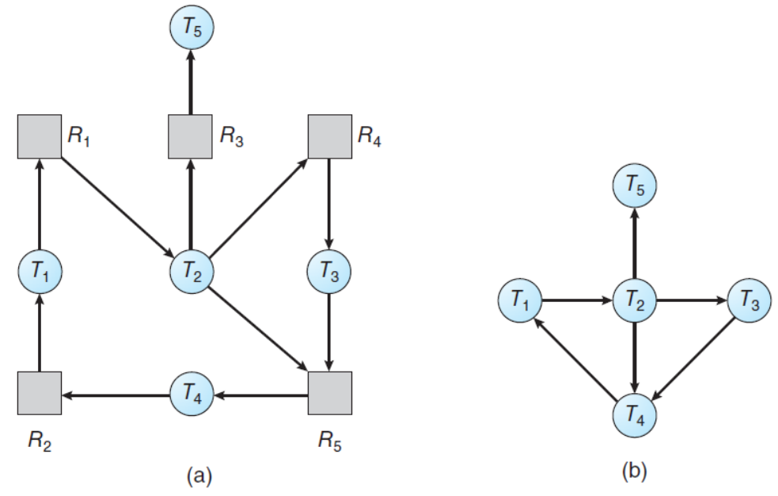{: w="400" h = "340"}
*(a) Resource-allocation graph (b) Corresponding wait-for graph*

* *Several Instances* of a Resource Type
    * The wait-for graph is not applicable to a system with *multiple instances* of each resource type.
    * We can design a deadlock detection algorithm that is *similar to* those used in *the banker’s algorithm*.

### Detection Algorithm
* Data Structures
    * 𝑨𝒗𝒂𝒊𝒍𝒂𝒃𝒍𝒆[𝒎]:
    * 𝑨𝒍𝒍𝒐𝒄𝒂𝒕𝒊𝒐𝒏[𝒏 × 𝒎]:
    * 𝑹𝒆𝒒𝒖𝒆𝒔𝒕[𝒏 × 𝒎]: indicates the current request of each thread.
        * if 𝑅𝑒𝑞𝑢𝑒𝑠𝑡[𝑖][𝑗] == 𝑘, then 𝑇𝑖 is requesting 𝑘 more instances of 𝑅𝑗.

* **Detection algorithm**
    1. Let *Work* and *Finish* be vectors of length *m* and *n*, respectively. Initialize *Work = Available*. For *i = 0, 1, ..., n - 1*, if *Allocationi != 0*, then *Finish[i] = false*. Ohterwise, *Finish[i] = true*.
    2. Find an index *i* such that both
        * *Finish[i] == false*
        * *Requesti <= Work*
        * If no such *i* exists, go to step 4.
    3. *Work = Work + Allocationi*, *Finish[i] = true*. Go to step 2.
    4. If *Finish[i] == false* for some *i, 0 <= i <= n*, then the system is in a deadlocked state. Moreover, if *Finish[i] == false*, then thread *Ti* is deadlocked.

### An Illustrative Example
* A set of five threads: 𝑇 = {𝑇0, 𝑇1, 𝑇2, 𝑇3, 𝑇4}
* A set of three resource types: 𝑅 = {𝐴, 𝐵, 𝐶}
* The number of instances of each resource types: 𝐴 = 7, 𝐵 = 2, 𝐶 = 6.
* The snapshot representing the current state of the system:

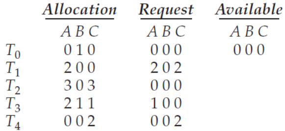{: w="330" h = "300"}

* Now we claim that the system is not in a deadlocked state.
    * the sequence 〈𝑇0, 𝑇2, 𝑇3, 𝑇1, 𝑇4〉 results in 𝐹𝑖𝑛𝑖𝑠ℎ[𝑖] == 𝑡𝑟𝑢𝑒 for all 𝑖.
* Now we claim that the system is now deadlocked.
    * a deadlock exists, consisting of threads 𝑇1, 𝑇2, 𝑇3, and 𝑇4.

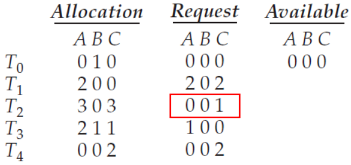{: w="330" h = "300"}

## Recovery from Deadlock
* *When* should we invoke the detection algorithm?
    * How **often** is a deadlock likely to occur?
        * *more frequent* deadlocks, *more frequent* deadlock detections.
    * How **many** threads will be affected by deadlock when it happens?
        * the number of threads involved in the deadlock cycle *may grow*.
    * Invoking *for every request* vs invoking *at defined intervals*.
        * Note that there is a considerable overhead in computation time.
        * However, there may be many cycles in the resource graph, if the detection algorithm is invoked at arbitrary points in time.

* When a detection algorithm determines a deadlock exists, *inform the operator* that a deadlock has occurred.
    * Or let the system *recover from* the deadlock automatically.
        * Process and Thread Termination
        * Resource Preemption

* Deadlock Recovery
    * **Process and Thread Termination**
        * Abort *all* deadlocked processes.
        * Abort *one* process *at a time* until the deadlock cycle is eliminated.
    * **Resource Preemption**
        * **Selecting a victim**: consider the order of preemption to *minimize cost*.
        * **Rollback**: *roll back* the process to some *safe state* and *restart* it.
        * **Starvation**: *picked as a victim* only a finite number of times.