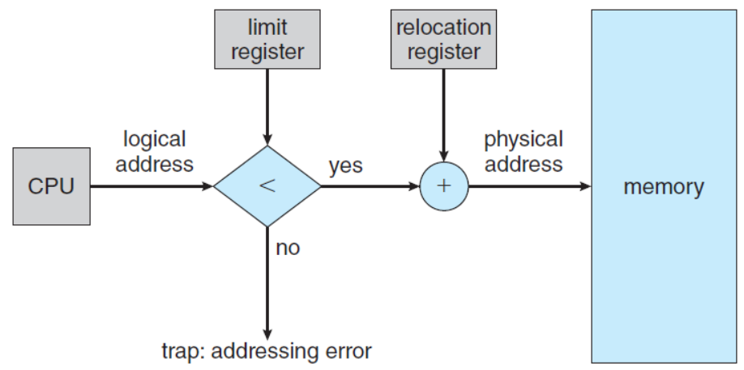
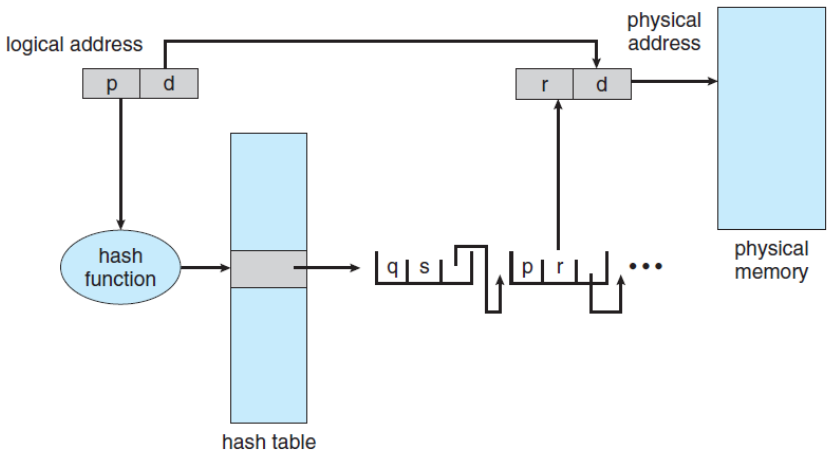

# Main Memory
## Background
* A process is a program *in execution*, to say, a set of instructions kept in a *main memory*.
* A **memory** consists of a large *array of bytes*, each with its own *address*.
    * CPU *fetches* instructions from memory using the *program counter*, and instructions may cause *load from* and store to the memory.

* Memory Space
    * We need to make sure that each process has a *separate memory space*.
    * A pair of registers: *base register* and *limit register* provides the ability to determine the range of *legal* addresses.

{: w="290" h = "360"}
*A base and a limit register define a logical address space*

* Protection of memory space is accomplished by having the CPU hardware compare every address generated in user mode with the registers.

{: w="360" h = "320"}
*Hardware address protection with base and limit registers*

### Address Binding
    * A program resides on a disk as a binary executable file.
        * To run, the program must be brought into memory.
        * The address of the process does not start ad address 00000000.
    * Addresses in the source are generally symbolic.
    * A compiler typically *binds symbolic* addresses to *relocatable* addresses.
    * A linker or loader in turn binds the *relocatable* addresses to *absolute* addresses.

{: w="310" h = "390"}
*Multistep processing of a user program*

### Logical vs Physical Address Space
* **Logical address**: an address generated by the CPU.
* **Physical address**: an address seen by the memory unit
    * that is, the one loaded into the memory-address register.
* **Logical address space**: the set of all logical addresses generated by a user program.
* **Physical address space**: the set of all physical addresses corresponding to these logical addresses.
* **MMU** (Memory Management Unit): a hardware device that maps from logical address to physical address.
    * *relocation register*: a base register in MMU.

{: w="320" h = "280"}
*Memory management unit (MMU)*

{: w="320" h = "280"}
*Dynamic relocation using a relocation register*

### Dynamic Loading
* Is it necessary for the entire program and data to be in physical memory?
* **dynamic loading**: obtains *better memory-space utilization*.
    * *a routine* is not loaded until it is called.
* The advantage of dynamic loading is that a routine is loaded only when it is needed.
    * The relocatable linking loader is called to load the desired routine and to update the program’s address tables to reflect this change.

### Dynamic Linking and Shared Libraries
* **DLLs**: Dynamically Linked Libraries
    * system libraries linked to user programs when the programs are run.
* *Static linking*: system libraries are treated like any other object module and are combined by the *loader* into the binary program code.
* *Dynamic linking*: is similar to dynamic loading, here, thought, *linking* is postponed until execution time.
* *Shared library*: DLLs are also known as shared libraries, since only one instance of the DLL in main memory can be shared among multiple user processes.

## Contiguous Memory Allocation
* We need to allocate main memory in the most efficient way possible.
* The memory is usually divided into two partitions:
    * one for the operating systems
    * one for the user processes.
* Several user processes reside in memory at the same.
* How to allocate available memory to the processes that are waiting to be brought into memory?
* **Contiguous memory allocation**
    * Each process is contained in a *single section of memory* that is *contiguous* to the section containing the next process.

### Memory Protection
* Prevent a process from accessing memory that it does not own.
    * by combining two ideas: *relocation register + limit register*.

{: w="320" h = "280"}
*Hardware support for relocation and limit registers*

### Memory Allocation
* **Variable-Partition** scheme: one of the simplest methods.
    * Assign processes to variably sized partitions in memory, where each partition may contain exactly one process.
* **Hole**: a block of available memory.

{: w="340" h = "280"}
*Variable partition*

* The Problem of *Dynamic* Storage Allocation
    * How to satisfy a request of *size 𝑛* from a list of *free holes*?
    * Tree types of solutions to this problem:
        * **First-Fit**: allocates the *first* hold that is big enough.
        * **Best-Fit**: allocates the *smallest* hole that is big enough.
        * **Worst-Fit**: allocates the *largest* hole.

### Fragmentation
* **External fragmentation**
    * The memory is fragmented into a large number of small holes.
    * There may be enough total memory space to satisfy a request but, the available spaces are not contiguous.
* **Internal fragmentation**
    * The memory allocated to a process may be slightly larger than the requested memory.
    * Unused memory that is internal to a partition.

## Paging
* **Paging** is a memory management scheme that permits a process’s physical address space to be *non-contiguous*.
    * Overcomes two problems of contiguous memory allocation.
        * Avoid *external fragmentation*.
        * Avoid the *associated need for compaction*.
    * Implemented through cooperation between the operating system and the computer hardware.

* Basic Method for Paging
    * Break *physical memory* into *fixed-sized blocks* (**frames**) and break *logical* memory into *blocks of the same size* (**pages**).
    * Now, the logical address space is totally separate from the physical address space.
    * Every address generated by the CPU is divided into two parts:
        * a **page number** (p)
        * a **page offset** (d)

{: w="340" h = "200"}

* The page number is used as an index into a per-process **page table**.

{: w="380" h = "360"}
*Paging hardware*

* Outlines of the steps taken by the CPU to translate a *logical address* to a *physical address*.
    1. Extract the page number 𝑝 and use it as an index into the page table.
    2. Extract the corresponding frame number 𝑓 from the page table.
    3. Replace the page number 𝑝 with the frame number 𝑓.

{: w="360" h = "360"}
*Paging model of logical and physical memory*

* The *page size* (like the *frame size*) is defined by the hardware.
    * A power of 2: typically varying bet5ween 4KB and 1GB per page.
    * If the size of **logical address space** is $2^𝑚$, and a page size is $2^𝑛$, then the high-order 𝑚 − 𝑛 bits designate the *page number*, and the low-order 𝑛 bits designate *the page offset*.

{: w="340" h = "210"}

{: w="330" h = "420"}
*Paging example for a 32-byte memory with a 4-byte pages*

* When a process arrives in the system to be executed, its size expressed in pages is examined for memory allocation.

{: w="360" h = "340"}
*Free frames (a) before allocation and (b) after allocation*

* Hardware Support
    * When the CPU scheduler selects a process for execution, the *page table* should be *reloaded* for the context switch.
    * *A pointer to the page table* should be stored with the other register values in the *PCB* of each process.

### PTBR (page-table base register)
* **PTBR** points to the page table and the page table is kept in main memory.
* *Faster* context switches, but still *slower* memory access time.
* Two memory access is needed, one for the page-table entry, one for the actual data.

### Translation Look-aside Buffer (TLB)
* **TLB** is a special, small, fast-lookup hardware cache memory. 

{: w="360" h = "350"}
*Paging hardware with TLB*

* Effective Memory-Access Time
    * **TLB hit**: if the page number of interest is *in* the TLB.
    * **TLB miss**: if the page number of interest is *not in* the TLB.
    * **Hit ratio**: the percentage of times that the page number of interest is found in the TLB.
    * For example, in a system with 10 ns to access memory, 
        * 80% hit ratio: EAT = 0.80 × 10 + 0.20 × 20 = 12 𝑛𝑠. 
        * 99% hit ratio: EAT = 0.99 × 10 + 0.01 × 20 = 10.1 𝑛𝑠.

### Memory Protection with Paging
* Memory Protection with Paging is accomplished by protection bits associated with each frame.
    * *valid-invalid bit*: one additional bit generally attached to each entry in the page table.
    * When this bit is set to **valid**: the associated page is in the process’s logical address space. (*legal*)
    * When this bit is set to **invalid**: the page is not in the process’s logical address space. (*illegal*)
    * Illegal addresses are trapped by use of the valid-invalid bit.

{: w="350" h = "370"}
*Valid bit (v) or invalid bit (i) in a page table*

### Shared Pages
* An advantage of paging is the possibility of *sharing common code*, a consideration important in a multiprogramming environment.
* Consider the standard C library *libc*.
    * each process load its own copy of libc into its address space.
    * however, it can be *shared* if the code is *reentrant code*.
* *Reentrant code* is non-self-modifying code, that is, it never changes during execution.

{: w="350" h = "380"}
*Sharing of standard C library in a paging environment*

## Structure of the Page Table
* Structuring the Page Table: A large logical address space makes the *page table itself* to become *excessively* large.
    * It needs some techniques for structuring the page table.
        * **Hierarchical Paging**
        * **Hashed Page Table**
        * **Inverted Page Table**

### Hierarchical Paging
* Breaks up the logical address space into multiple tables.

{: w="340" h = "380"}
*A two-level page-table architecture*

{: w="320" h = "280"}
*Address translation for a two-level 32-bit paging architecture*

### Hashed Page Tables
* Hashed Page Tables for handling address space larger than 32 bits, use a hashed table with the hash value being the virtual page number.

{: w="350" h = "300"}
*Hashed page table*

### Inverted Page Tables
* Rather than having a page table, use an inverted page table one entry for each real page consisting of the virtual address with information about the process.

{: w="350" h = "300"}
*Inverted page table*

## Swapping
* **Swapping** makes it possible for the *total physical address space* of all processes to *exceed* the *real physical memory* of the system thus *increasing* the *degree of multiprogramming* in a system.
* Process instructions and data must be in memory to be executed.
    * However, a process, or a portion of a process can be *swapped* temporally *out of memory* to a backing store and then *brought back* into memory for continued execution.

### Standard Swapping
* Standard Swapping moves entire processes between main memory and a backing store.
* The cost of swapping entire processes is too prohibitive.

{: w="340" h = "330"}
*Standard swapping of two processes using a disk as a backing store*

### Swapping with Paging
* Pages of a process can be swapped instead of an entire process.
* This strategy still allows physical memory to be oversubscribed, but only a small number of pages will be involved in swapping.
* Today, **paging** refers to swapping with paging.
    * **page out**: moves a page from memory to backing store.
    * **page in**: moves a page from backing store to memory.
* Paging works well in conjunction with the *virtual memory*.

{: w="330" h = "360"}
*Swapping with paging*
