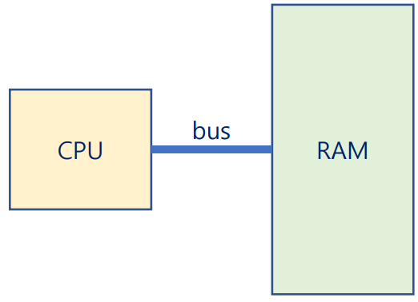

# Operating System Introduction
## 운영체제란
* An **operating system** is a software that operates a *computer* system.
* A **computer** is a machine that processes the *information*.
* An **information** can be defined as a *quantitative* representation that *measures* the *uncertaint

## 컴퓨터의 정보 처리
* 정보의 최소 단위: bit(*binary digit*)
* 정보의 처리: 정보의 상태 변환 (0 -> 1 or 1 -> 0)
* Boolean Algebra: NOT, AND, OR
* 논리 게이트: NOT, AND, OR, XOR, NAND, NOR
* 논리회로: IC, LSI, SoC, ...
    * [Moore's law](https://en.wikipedia.org/wiki/Moore%27s_law)
* 정보의 저장과 전송: Flip-Flop, Data Bus

### 컴퓨터의 연산 처리 방식
* 덧셈: 반가산기, 전가산기
* 뺄셈: 2의 보수 표현법
* 곱셈 & 나눗셈: 덧셈과 뺼셈의 반복
* 실수 연산: 부동 소수점
* 함수: GOTO
* 이를 기반으로 다양한 작업을 수행

## 컴퓨터는 다음 조건을 충족해야 한다
* Universality(범용성)
    * NOT, AND, OR 게이트만으로 모든 계산을 할 수 있다.
    * NAND 게이트만으로 모든 계산을 할 수 있다.
    * General-purpose computer(범용 컴퓨터)

* Computability(계산가능성)
    * Turing-computable: 튜링 머신으로 계산가능한 것.
    * Halting Problem: 튜링 머신으로 풀 수 없는 문제.

## 컴퓨터의 탄생
* Alan Turing - Turing Machine
* John von Neumann - ISA(Instruction Set Architecture)

### Turing Machine
* Alan Turing이 현대 컴퓨터의 원형을 제시함
{: w="50%"}

### ISA
* Neumann이 stored-program 방식을 처음으로 제시
    * A **stored-program** computer is a computer that stores *programs* in a memory.
    * Memory에서 Instruction을 fetch를 해오고 CPU에서 Execute하는 구조

{: w="33.33%"}

* 따라서, a program is a set of *instructions* that tells a computer's hardware to perform a task.

## 운영체제도 프로그램의 일종
* Operating System
    * is a program *running at all times* on the computer
    * to provide *system services* to application programs
    * to manage *process, resources, user interfaces*, and so on.

## What Operating Systems Do
* An **OS** is a software that manages a computer's hardware.
* It also provides a basis for application programs and acts as an intermediary between the computer user and the computer hardware.

### Four components of computer system
* The hardware
* The OS
* The application programs
* And a user

{: w="35%"}
*Abstract view of the components of a computer system*

### Defining Operating Systems
* There are *NO* universally accepted definition of an operating system.
* A more common definition is that
    * the one program running at all times on the computer usually called the **kernel**.
* Along with the kernel, there are two other types of programs
    * **system programs**
    * **application programs**

## Computer-System Organization
* A modern computer system consist of
    * one or more CPUs and
    * a number of device controllers connected through a common **bus**.

{: w="41.67%"}
*A typical PC computer system*

### Bootstrap
A **bootstrap** program is the first program to run on computer power-on, and then loads the OS.

### Interrupt
Hardware may trigger and interrupt at any time by sending a signal to the CPU, usually by way of the system bus.

{: w="43.33%"}
*Interrupt timeline for a single program doing output*

### von Neumann architecture
* A typical instruction-execution cycle
    * first *fetches* an instruction from memory
    * and stores that instrcution in the *instruction register*.
* The instrcution is then decoded
    * and may cause *operands* to be fetched from memory
    * and stored in some internal register.
* After then instruction on the operands
    * has been *executed*,
    * the result may be stored back in memory.

### Storage systems
The wide variety of *storage* systems can be organized in a hierarchy according to
* storage capacity
* and access time

{: w="36.67%"}
*Storage-device hierarchy*

### I/O Structure
A large portion of OS code is dedicated to managing I/O

{: w="33.33%"}
*How a modern computer system works*

## Computer System Architecture
* Definitions of Computer System Components
    * **CPU**: The hardware that executes instructions
    * **Processor**: A physical chip that contains one or more CPUs.
    * **Core**: The back computation unit of the CPU.
    * **Multicore**: Including multiple computing cores on the same CPU.
    * **Multiprocessor**: Including multiple processors.

### Symmetric multiprocessing (SMP)
* The most common multiprocessor systems, in which each peer CPU processor performs all tasks.
* *Asymmetric* multiprocessing: each processor is assigned a specific task.

{: w="33.33%"}
*Symmetric multiprocessing architecture*

### Multi-core design
* With several cores on the same processor chip.

{: w="30%"}
*_A dual-core design with two cores on the same chip_*

## Operating System Operations
### Multiprogramming
* runs more than one program at a time.
* keeps several processes in memory simultaneously.
* to increase CPU utilization.

{: w="25%"}
*Memory layout for a multiprogramming system*

### Multiprocessing (=multitasking)
* a logical extension of multiprogramming.
    * in which CPU switched jobs so frequently that users can interact with each job while it is running.
* **CPU scheduling**
    * If several processes are ready to run at the same time, the system must choose which process will run next.

### User mode & Kernel mode
* Two separate mode of operations: **user mode** and **kernel mode** to ensure that an incorrect program.
    * cannot cause other programs to execute incorrectly

{: w="38.33%"}
*Transition from user to kernel mode*

## Virtualization
* **Virtualization** is a technology that allow us
    * to abstract the hardware of a single computer
    * into several different execution environments.
* **VMM**: Virtual Machine Manager
    * VMware, XEN, WSL, ...

{: w="40%"}
*A computer running (a) a single operating system and (b) three virtual machines*

## Operating System Services
* OS provides an *environment* for the execution of programs.
    * User interface
    * Program execution
    * I/O operation
    * File-system manipulation
    * Communications
    * Error detection
    * Resource allocation
    * Logging
    * Protection and securit

{: w="50%"}
*A view of operating system services*

## User and Operating System Interface
* Three fundamental ways for users to interface with the OS
    * CLI: command line interface, or command interpreter
        * known an *shells*: sh, bash, csh, tcsh, zsh, etc
    * GUI: graphical user interface
        * Windows, Aqua for MacOS, KDE/GNOME for Linux, etc
    * Touch-Screen Interface
        * Android UI, iPhone UI, etc

## System calls
* System calls provides an interface to the services made available by the OS
* API: Application Programming Interface

{: w="30.83%"}
*The handling of a user application invoking the open() system call*

{: w="30%"}
*Passing of parameters as a table*

{: w="35%"}
*Examples of Windows and UNIX system calls*

