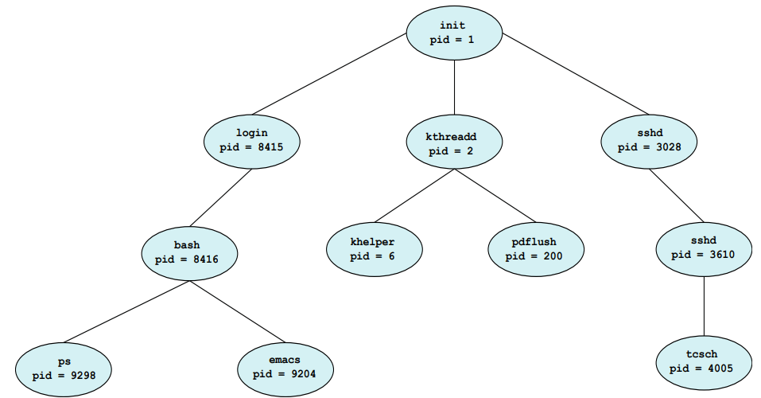

# Process
## Process Concept
* A **process** is a program in execution.
* A process is the unit of work in the operating system.
* A process will need certain resources to accomplish its task
    * CPU time
    * memory
    * files
    * I/O devices

### Memory Layout of a Process
* Text section: the executable code
* Data section: global variables
* Heap section: memory that is dynamically allocated during program run time
* Stack section: temporary data storage when invoking functions such as function parameters, return addresses, and local variables

{: w="290" h = "400"}
*Layout of a process in memory*

### State of Process New: the process is being created.
* **New**: The process is being created.
* **Running**: Instructions are being executed.
* **Waiting**: The process is waiting for some event to occur. 
    * such as an I/O completion or reception of a signal.
* **Ready**: The process is waiting to be assigned to a processor.
* **Terminated**: The process has finished execution.

{: w="380" h = "300"}
*Diagram of process state*

### Process Control Block
* Each process is represented in the operating system by the PCB.
* A PCB contains many pieces of information associated with a specific process:
    * **Process state**
    * **Program counter**
    * CPU registers
    * CPU-scheduling information
    * Memory-management information
    * Accounting information
    * I/O status information

{: w="280" h = "365"}
*Process control block (PCB)*

### Summary
* Typically, a process is a program that performs a *single thread of execution*.
* The single thread of control allows the process to perform only one task at a time.
* Modern operating systems have extended the process concept to allow a process to have multiple threads of execution and thus to perform more than one task at a time.
* A thread is a lightweight process.

## Process Scheduling
* The objective of **multiprogramming** is
    * to have some process running at all times 
    * so as to maximize CPU utilization.

* The objective of **time sharing** is 
    * to switch a CPU core among processes so frequently 
    * that users can interact with each program while it is running.

### Scheduling Queue
* As processes enter the system, they are put into a **ready queue**
    * where they are ready and waiting to execute on a CPU's core.
*  Processes that are waiting for a certain event to occur
    * are placed in a **wait queue**.
* These queues are generally implemented 
    * in the linked lists of PCBs.

{: w="400" h = "400"}
*The ready queue and wait queues*

* Queueing Diagram
    * as a common represemtation of process scheduling.

{: w="440" h = "380"}
*Queueing-diagram representation of process scheduling*

### Context Switch
* The **context** of a process is represented in the PCB.
* When an interrupt occurs, the system *saves* the current *context* of the running process, so that, later, it can *restore* that *context* when it should be resumed.
* The **context switch** is a task that 
    * switches the CPU core to another process.
    * performs a *state save* of the current process
    * and a *state restore* of a different process.

{: w="400" h = "430"}
*Diagram showing context switch from process to process*

## Operations on Processes
* An operating system must provide a mechanism for process creation, and process termination.
* A process may create several new processes
    * the creating process: a *parent* process
    * a newly created process: a *child* process

{: w="500" h = "450"}
*A tree of processes on a typical Linux system*

* Two possibilities for execution
    * The parent continues to *execute concurrently* with its children
    * The parent *waits* until some or all of its children have terminated
* Two possibilities of address-space
    * The child process is a *duplicate* of the parent process.
    * The child process has a *new program* loaded into it

```
#include <stdio.h>
#include <unistd.h>
#include <wait.h>

int main()
{
    pid_t pid;
    // fork a child process
    pid = fork();
    if (pid < 0) { // error occurred
        fprintf(stderr, "Fork Failed");
        return 1;
    }
    else if (pid == 0) { // child process
        execlp("/bin/ls", "ls", NULL);
    }
    else { // parent process
        wait(NULL);
        printf("Child Complete");
    }
    return 0;
}
```

{: w="400" h = "350"}
*Process creation using the fork() system call*

* A process terminates
    * when it finishes executing its final statement
    * exit() system call: asks OS to delete it
    * OS deallocates and reclaims all the resources: allocated memories, open files, and I/O buffers, etc

### Zombie and Orphan
* **zombie** process: a process that has terminated, but whose parent has not yet called wait().
* **orphan** process: a process that has a parent process who did not invoke wait() and instead terminated
* Daemon process 또는 Background process에 활용

## Operations on Processes
* In UNIX-like O/S, a new process is created by the **fork()** system call.
* The child process consists of *a copy of the address space* of the parent process.
* Both processes continue execution at the instruction after the fork() system call.
* With one difference: the return code for the fork() is *zero* for the child process, whereas the *nonzero* pid of the child is returned to the parent process.

```
#include <stdio.h>
#include <unistd.h>

int main()
{
    pid_t pid;
    pid = fork();
    printf("Hello, Process! %d\n", pid)

    return 0;
}
```

* After a fork() system call,
    * the parent can *continue its execution*; or
    * if it has nothing else to do while the child runs,
        * it can issue a wait() system call to move itself off the ready queue until the termination of the child.

```
#include <stdio.h>
#include <unistd.h>
#include <wait.h>

int value = 5;

int main()
{
    pid_t pid;
    pid = fork();
    
    if (pid == 0) { // child process
        value += 15;
        return 0;
    }
    else if(pid > 0) { // parent process
        wait(NULL);
        printf("Parent: value = %d\n", value); // will be 5
    }

    return 0;
}
```

1. fork()를 하면 parent의 내용을 복사하여 child를 생성
2. parent가 wait이 되면, child가 진행되면서 child 영역내의 value를 5 증가시키고 return
3. 그러나, 2.의 결과는 parent 영역의 value에 영향을 못 줌
4. 따라서, parent가 다시 실행되면서 print를 할 때, 5를 출력하는 것

```
#include <stdio.h>
#include <unistd.h>
#include <wait.h>

int main() {
    /*
    * How many processes are created?
    * it will be 8
    * e.g. 첫번째 fork()이후 생성된 child process와 parent process 둘 다 두 번째 fork()를 실행함
    */
    fork(); // fork a child process
    fork(); // fork another child process
    fork(); // and fork another

    /*
    * 이 경우는 16개
    */
    int i;
    for(i = 0; i < 4; ++i)
        fork();
    
    return 0;
}
```

```
int main()
{
    pit_t pid;
    pid = fork();

    if (pid == 0) { // child process
        execlp("/bin/ls", "ls", NULL);
        printf("LINE J\n"); // 실행되지 못함
    }
    else if (pid > 0) { // parent process
        wait(NULL);
        printf("Child Complete\n");
    }

    return 0;
}
```

```
/*
* B = C
*/
int main()
{
    pid_t pid, pid1;
    pid = fork();
    if (pid == 0) { // child process
        pid1 = getpid();
        printf("child: pid = %d\n", pid); // A
        printf("child: pid1 = %d\n", pid1); // B
    }
    else if (pid > 0) { // parent process
        pid1 = getpid();
        printf("parent: pid = %d\n", pid); // C
        printf("parent: pid1 = %d\n", pid1); // D
        wait(NULL);
    }

    return 0;
}
```

```
#define SIZE 5
int nums[SIZE] = {0, 1, 2, 3, 4};

int main()
{
    pid_t pid;
    int i;
    pid = fork();

    if(pid == 0) { // child process
        for (i = 0; i < SIZE; ++i) {
            nums[i] *= i;
            printf("CHILD: %d \n", nums[i]); // 0, 1, 4, 9, 16
        }
    }
    else if (pid > 0) { // parent process
        wait(NULL);
        for (i = 0; i < SIZE; ++i) {
            printf("PARENT: %d \n", nums[i]); // 0, 1, 2, 3, 4
        }
    }

    return 0;
}
```

## Interprocess Communication
* Process executing concurrently may be either *independent* processes or *cooperating* processes.
* A process is **independent**
    * if it *does not share data* with any other processes.
* A process is **cooperating**
    * if it can *affect* or *be affected* by the other processes.
    * Cleary, any processes that *shares data* with other processes is a cooperating process.

### IPC
* IPC: Inter-Process Communication
* Cooperating processes require an IPC mechanism 
    * that will allow them to exchange data
    * that is, *send data* to and *receive data* from each other.

* Two fundamental models of IPC
    * **shared memory**
    * **message passing**

{: w="430" h = "400"}
*Communication models: (a) Shared memory and (b) Message Passing*

## IPC in Shared-Memory Systems
* Consider the *Producer-Consumer* Problem to illustrate the concept of cooperating processes.
    * a common paradigm for cooperating processes.
* **Producer-Consumer Problem**
* A **producer** produces information that is consumed by a **consumer**.
* For example,
    * a compiler produces assembly code, and a assembler consumes it
    * a web server produces an HTML file, and a browser consumes it

* A solution using shared-memory
* To allow producer and consumer to run concurrently.
* Let a *buffer* of items be available, a producer can *fill the buffer*, and a consumer can *empty the buffer*.
* A **shared memory** is a region of memory that is shared by the producer and consumer processes.

```
/*
* define a shared buffer
*/
#define BUFFER_SIZE 10

typedef struct {
    ...
} item;

item buffer[BUFFER_SIZE];
int in = 0;
int out = 0;

/*
* producer process using shared memory
*/
item next_produced;

while (true) {
    /* produce an item in next_produced */

    while (((in + 1) % BUFFER_SIZE) == out); // do nothing

    buffer[in] = next_produced;
    in = (in + 1) % BUFFER_SIZE;
}

/*
* consumer process using shared memory
*/
item next_consumed;

while (true) {
    while (in == out); // do nothing

    next_consumed = buffer[out];
    out = (out + 1) % BUFFER_SIZE;
}
```
## IPC in Message-Passing Systems
* The scheme of using shared-memory requires that these processes *share a region of memory* and that the *code* for accessing and manipulating the shared memory
    * be written *explicitly* by the application programmer

* **Message-Passing**: OS provides the means for cooperating processes to communicate with each other via a *message-passing* facility.
* Two operations of the message-passing facility
    * **send(message)**
    * **receive(message)**

```
/*
* producer process using message passing
*/
message next_produced;

while (true) {
    /* produce an item in next_produced */

    send(next_produced);
}

/*
* consumer process using message passing
*/
message next_consumed;

while (true) {
    receive(next_consumed);

    /* consume the item in next_consumed */
}
```

* Communication Links
    * if two processes 𝑃 and 𝑄 want to communicate, 
        * the must *send* to and *receive* messages *from* each other
    * This comm. link can be implemented in a variety of ways.
        * *direct* or *indirect* communication
        * *synchronous* and *asynchronous* communication
        * *automatic* or *explicit* buffering

* Under **direct** communication, each process that wants to communicate must explicitly *name* the *recipient* or *sender* of the communication.
* The primitives of this scheme
    * send(𝑃, message) – send a message to process 𝑃.
    * receive(𝑄, message) – receive a message from process 𝑄
* The properties of communication links in this scheme
    * Links are established *automatically*
    * A link is associated with *exactly two processes*
    * There exists *exactly one link* between each pair of processes

* With **indirect** communication, the messages are *sent* to and *received from* **mailboxes**, or **ports**.
* A mailbox (also referred to as ports) can be viewed abstractly as an object *into* which messages can be *placed* by processes, and *from* which messages can be *removed*.
* The primitives of this scheme
    * send(𝐴, message) – send a message to mailbox 𝐴.
    * receive(𝐴, message) – receive a message from mailbox 𝐴
* The properties of communication links in this scheme
    * Links are established between a pair of processes only if *both members* of the pair have *a shared mailbox*.
    * A link may be associated with *more than two processes*.
    * A number of *different links may exist*, between each pair of processes with each link corresponding to one mailbox.
* OS provides a mechanism that allows a process to do:
    * *Create* a new mailbox.
    * *Send* and *Receive* messages through the mailbox.
    * *Delete* a mailbox.

* Different design options for implementation
    * **blocking** or **non-blocking**: **synchronous** or **asynchronous** -> 엄밀히는 서로 구분되는 개념
    * **Blocking send**: the sender is blocked until the message is received.
    * **Non-blocking send**: the sender is sends the message and continue.
    * **Blocking receive**: the receiver blocks until a message is available.
    * **Non-blocking receive**: the receiver retrieves either a valid message or a null message.

## Examples of IPC Systems
* Shared Memory: **POSIX Shared Memory**
    * POSIX: Portable Operating System Interface (for uniX)
* Message Passing: **Pipes**
    * One of the earliest IPC mechanisms on UNIX systems.

### POSIX Shared Memory
* POSIX shared memory is organized using memory-mapped files, which associate the region of shared memory with a file.
* First, create a shared-memory object
    * fd = shm_open(name, O_CREAT | ORDWR, 0666);
* Configure the size of the object in bytes
    * ftruncate(fd, 4096);
* Finally, establish a memory-mapped file
    * mmap(0, SIZE, PROT_READ | PROT_WRITE, MAP_SHARED, fd, 0);

```
/*
* Producer process illustrating POSIX shared-memory API
*/

#include <stdio.h>
#include <stdlib.h>
#include <string.h>
#include <fcntl.h>
#include <sys/shm.h>
#include <sys/stat.h>
#include <sys/mman.h>

int main()
{
    const int SIZE = 4096; // the size of shared memory
    const char *name = "OS"; // the name of shared memory
    const char *message_0 = "Hello, ";
    const char *message_1 = "Shared Memory!\n";

    int shm_fd; // the file descriptor of shared memory
    char *ptr; // pointer to shared memory

    /* create the shared memory object */
    shm_fd = shm_open(name, O_CREAT | O_RDWR, 0666);

    /* configure the size of the shared memory */
    ftruncate(shm_fd, SIZE);

    /* map the shared memory object */
    ptr = (char *)mmap(0, SIZE, PROT_READ | PROT_WRITE, MAP_SHARED, shm_fd, 0);

    /* write to the shared memory */
    sprintf(ptr, "%s", message_0);
    ptr += strlen(message_0);
    sprintf(ptr, "%s", message_1);
    ptr += strlen(message_1);

    return 0;
}
```

```
/*
* Consumer process illustrating POSIX shared-memory API
*/

#include <stdio.h>
#include <stdlib.h>
#include <fcntl.h>
#include <sys/shm.h>
#include <sys/stat.h>
#include <sys/mman.h>

int main()
{
    const int SIZE = 4096; // the size of shared memory
    const char *name = "OS"; // the name of shared memory

    int shm_fd; // the file descriptor of shared memory
    char *ptr; // pointer to shared memory

    /* create the shared memory object */
    shm_fd = shm_open(name, O_RDONLY, 0666);

    /* map the shared memory object */
    ptr = (char *)mmap(0, SIZE, PROT_READ | PROT_WRITE, MAP_SHARED, shm_fd, 0);

    /* read from the shared memory object */
    printf("%s", (char *)ptr);

    /* remove the shared memory */
    shm_unlink(name);

    return 0;
}
```

### Pipes
* **Pipes** were one of the first IPC mechanisms in early UNIX systems.
* A pipe acts as a *conduit* allowing two processes to communicate.

* Four issues of pipe implementation
    * Does the pipe allow *unidirectional* or *bidirectional* communication?
    * In the case of two-way comm., is it *half-duplex* or *full-duplex*?
    * Must a *relationship* exist between the communicating process?
        * such as parent-child
    * Can the pipes communicate *over a network*?

* Two common types of pipes
    * **Ordinary pipes**
        * *cannot be accessed from outside* the process that created it.
        * Typically, a *parent* process creates a pipe and uses it to communicate with a *child* process that it created.
    * Named pipes
        * can be accessed *without a parent-child* relationship

### Ordinary Pipes
* Ordinary pipes allow two processes to communicate in producer-consumer fashion.
    * the producer writes to one end of the pipe (*write* end)
    * the consumer reads from the other end (*read* end)
* *unidirectional*: only *one-way* communication is possible.
* *two-way* communication? use two pipes!

{: w="420" h = "360"}
*File descriptors for an ordinary pipe*

* On UNIX systems, ordinary pipes are constructed using the function:
    * pipe(int fd[])
    * fd[0]: the read end of the pipe
    * fd[1]: the write end

```
/*
* Ordinary pipe in UNIX
*/

#include <stdio.h>
#include <string.h>
#include <unistd.h>
#include <sys/types.h>

#define BUFFER_SIZE 25
#define READ_END 0
#define WRITE_END 1

int main()
{
    char write_msg[BUFFER_SIZE] = "Greetings;
    char read_msg[BUFFER_SIZE];
    int fd[2];
    pid_t pid;

    /* create the pipe */
    pipe(fd);

    pid = fork(); // fork a new process

    if (pid > 0) { // parent process
        close(fd[READ_END]);
        /* write to the pipe */
        write(fd[WRITE_END], write_msg, strlen(write_msg) + 1);
        close(fd[WRITE_END]);
    }
    else if (pid == 0) { // child process
        close(fd[WRITE_END]);
        /* read to the pipe */
        read(fd[READ_END], read_msg, BUFFER_SIZE);
        printf("read %s\n", read_msg);
        close(fd[READ_END]);
    }

    return 0;
}
```

## Communication in Client-Server Systems
* Two other strategies in client-server systems
* **Sockets** are defined as endpoints for communication.
* **RPCs** (Remote Procedure Calls) abstracts procedure calls between processes on networked systems.

### Socket
A socket is identified by an *IP address* concatenated with a *port* number.

{: w="330" h = "370"}
*Communication using sockets*

* Java provides a much easier interface to sockets and provides three different types of sockets.
    * *Socket* class: *connection-oriented* (*TCP*)
    * *DatagramSocket* class: *connectionless* (*UDP*)
    * *MulticastSocket* class: multiple recipients

```java
/*
* Date server in Java
*/

import java.net.*;
import java.io.*;

public class DateServer {
    public static void main(String[] args) throws Exception {
        ServerSocket server = new ServerSocket(6013);

        /* Now listen for connections */
        while (true) {
        Socket client = server.accept();
        PrintWriter pout = new PrintWriter(client.getOutputStream(), true);

        /* write the Date to the socket */
        pout.println(new java.util.Date().toString());

        /* close the socket and resume listening for connections */
        client.close();
        }
    }
}

```

```java
/*
* Date client in Java
*/

import java.net.*;
import java.io.*;

public class DateClient {
    public static void main(String[] args) throws Exception {
        /* make connection to server socket */
        Socket socket = new Socket("127.0.0.1", 6013);

        InputStream in = socket.getInputStream();
        BufferedReader br = new BufferedReader(new InputStreamReader(in));

        /* read date from the socket */
        String line = null;

        while ((line = br.readLine()) != null)
            System.out.println(line);

        /* close the socket connections */
        socket.close();
    }
}
```

### RPC
* One of the most common forms of *remote service*.
* Designed as a way to abstract the procedure-call mechanism for use between systems with network connections.
* A client invokes a procedure on a remote host as it would invoke a procedure locally.

* The RPC system hides the details that allow communication to take place by providing a *stub* on the client side.
* The stub of client-side locates the server and *marshals* the parameters.
* The stub of server-side received this message, unpacks the marshalled parameters, and performs the procedure on the server.
