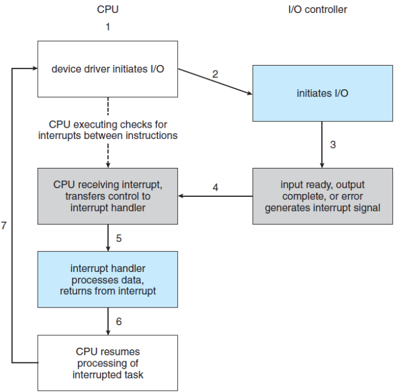

# Storage Management
## Mass-Storage Structure
* Mass-Storage
    * non-volatile, secondary storage system of a computer
    * usually, HDD(Hard Disk Drive) or NVM(Non-Volatile Memory).
    * sometimes, magnetic tapes, optical disks, or cloud storage.
        * using the structure of RAID systems.

{: w="330" h = "320"}
*HDD moving-head disk mechanism*

* HDD Scheduling
    * to *minimize* the access time (or *seek time*)
    * to *maximize* data transfer *bandwidth*.
    
* **seek time**: the time for the device arm to move the heads to the cylinder containing the desired sector, and the rotational latency is the additional time for the platter to rotate the desired sector to the head.
* **disk bandwidth**: the total number of bytes transferred, divided by the total time between the first request and the completion of the last transfer.

### FIFO Scheduling
* Intrinsically fair, but generally does not provide the fastest services.
* Total head movement of 640 cylinders.

{: w="360" h = "320"}
*FCFS disk scheduling*

### SCAN Scheduling
* The disk arm starts at one end of the disk and moves toward the other end, servicing requests as it reaches each cylinder, until it gets to the other end of the disk.
* At the other end, the *direction* of head movement is *reversed*, and continue.

* **SCAN Scheduling**: if the direction of head movement is moving towards 0.
* total head movement of 236 cylinders.

{: w="360" h = "320"}
*SCAN disk scheduling*

### C-SCAN (Circular-SCAN) Scheduling
* A variant of SCAN designed to provide a *more uniform wait time*.
* Moves the head from one end of the disk to the other, servicing requests along the way.
* However, when the head reaches the other end, *returns immediately* to the *beginning* of the disk *without servicing* any requests on the return trip.
* Treats the cylinders as a *circular list* that wraps around from the final cylinder to the first one.

* **C-SCAN Scheduling**
    * total head movement of 183 cylinders. (ignore from 199 to 0)

{: w="360" h = "320"}
*C-SCAN disk scheduling*

### Boot Block
* For a computer to start running, when it is powered up, it must have an initial program to run.
* A bootstrap loader is stored in NVM flash memory, and mapped to a known memory location.

{: w="320" h = "300"}
*Booting from a storage device in Windows*

### RAID
* **RAID** (Redundant Arrays of Independent Disks) is a collection of a variety of disk-organization techniques.
    * To improve the rate at which data can be read or written.
        * if the drives are operated **in parallel**.
    * To improve the **reliability** of data storage, because *redundant information* can be stored on multiple devices.
    * Thus, *failure* of one drive does not lead to *loss of data*.

* **Redundancy**: Improvement of *Reliability*
    * The *chance of fail* in a set of 𝑁 disks is much *greater* than the chance in a *single* disk.
    * Suppose that mean time between failures (MTBF) = 100,000 hours.
        * MTBF in an array of 100 disks = 100,000 / 100 = 1,000 hours.
    * The solution the problem of reliability: **redundancy**.
        * the simplest: *mirroring* (duplicate all the drives)
* **Parallelism**: Improvement in *Performance*
    * With multiple drives, we can improve the transfer rate by striping data across the drives.
    * **bit-level striping**: splitting the *bits* of each *byte*.
        * if we have 8 drives, we can write 𝑖 bit of each byte to drive 𝑖.
    * *block-level striping*: generalization to a number of drives.
* RAID Levels
    * *mirroring*: highly reliable, however, too expensive.
    * *striping*: highly efficient, however, not related to reliability.
    * How about **parity bit**?
        * set to 1: the number of bits in the byte is *even*.
        * set to 0: the number of bits in the byte is *odd*.
        * It enable us to detect an error if f one of the bits is damaged.
    * **RAID levels**: classify these schemes according to different *cost-performance trade-offs*.

{: w="420" h = "350"}
*RAID levels*

{: w="340" h = "380"}
*RAID 0 + 1 and 1 + 0 with a single disk failure*

## I/O System
* Two main jobs of a computer: I/O and computing
    * In many cases, the main job is I/O, for instance, web browsing, file editing, youtube, game, and so force.
    * The role of Operating System in I/O is to manage and control I/O operations and I/O devices.

{: w="400" h = "370"}
*A typical PC bus architecture*

* **Memory-Mapped I/O**
    * How does the processor give commands and data to a controller to accomplish an I/O transfer?
    * The controller has one or more registers for data and control signals.
        * data-in register: is read by the host to get input.
        * data-out register: is written by the host to send output.
        * status register: contains bits that can be read by the host.
        * control register: can be written by the host to start a command or to change the mode of a device.
    * If the device supports the memory-mapped I/O, control registers are mapped into the address space of the processor.
    * The CPU executes I/O requests using the standard data-transfer instructions to read and write the device-control registers at their mapped locations in physical memory.

{: w="320" h = "300"}
*Device I/O port locations on PCs (partial)*

### Three types of I/O
* **Polling**: or **busy-waiting**: reading the status register repeatedly until the busy bit becomes clear.
* **Interrupt**: CPU has a wire called the interrupt-request line.
    * If CPU detects an interrupt, it jumps to an ISR(*interrupt service routine*) to handle an interrupt.
    * The addresses of ISRs is specified in the *interrupt vector table*.
 * **DMA** (Direct Memory Access): used to avoid programmed I/O (one byte at a time).
    * useful for handling large data transfer.

{: w="320" h = "360"}
*Interrupt-driven I/O cycle*

{: w="320" h = "340"}
*Intel Pentium processor event-vector table*

{: w="360" h = "360"}
*Steps in a DMA transfer*

### Blocking I/O vs Non-blocking I/O
* **Blocking** I/O: a thread is suspended.
    * moved from *running* queue to *waiting* queue.
* **Non-blocking** I/O: does not halt the execution of the thread.
    * e.g., receiving keyboard or mouse input in word processor.
    * returns as much as available.
* **Asynchronous system call**: the thread continues to execute its code.

* The diff between *non-blocking* and *asynchronous* system call
    * a non-blocking read() call
        * *returns immediately* with whatever data are available, the full number of bytes requested, fewer, or none at all.
    * An asynchronous read() call 
        * *requests a transfer* that will be performed in its entirety but will complete at some future time.

{: w="370" h = "340"}
*Two I/O methods: (a) synchronous (b) asynchronous*

## File-System Interface
* **File System** provides the mechanism for on-line storage of and access to both *data* and *programs* of the operating system and all the users of the computer system.
* Consists of two distinct parts
    * a collection of *files*, each storing related data
    * a *directory* structure, which organizes all the files in the system.

* Access Methods
    * Sequential access: Information in the file is processed in order, one record after the other.
    * Direct access: relative access: A file is made up of fixed-length logical records that allow programs to read and write records rapidly in no particular order.

{: w="310" h = "240"}
*Sequential-access file*

{: w="310" h = "280"}
*Simulation of sequential access on a directed-access file*

* Directory Structure
    * The directory can be viewed as a symbol table that translates file names into theirs file control blocks.
    * The ways of organizing the directory structure:
        * Single-Level Directory
        * Two-Level Directory
        * Tree-Structured Directories
        * Acyclic-Graph Directories

{: w="350" h = "250"}
*Single-level directory*

{: w="370" h = "300"}
*Two-level directory*

{: w="380" h = "370"}
*Tree-structured directory structure*

{: w="340" h = "340"}
*Acyclic-graph directory structure*

{: w="350" h = "340"}
*General graph directory*

## File-System Implementation
* The file system itself is generally composed of many different levels.

{: w="240" h = "300"}
*Layered file system*

* **Allocation Method** 
    * The main problem of implementing the file system: how to *allocate space to files* so that storage space is utilized *effectively* and files can be accessed *quickly*.
    * Three major methods in wise use:
        * *Contiguous Allocation*
        * *Linked Allocation*
        * **Indexed Allocation**

### Contiguous Allocation
* Requires that each file occupy a set of contiguous blocks on the device.

{: w="350" h = "370"}
*Contiguous allocation of disk space*

### Linked Allocation
* The problems of contiguous allocation
    * *external fragmentation*
    * *need for compaction*
* **Linked Allocation** solves all problems of contiguous allocation each file is a linked list of storage blocks the blocks may be scattered anywhere on the device.

{: w="350" h = "370"}
*Linked allocation of disk space*

### FAT: File Allocation Table
* The disadvantages of the linked allocation
    * It can be used effectively only for sequential-access files.
    * To find i-th block of a file, we must start at the beginning of that file.
* **FAT**: an important variation on the linked allocation
    * simple but efficient method using a *file allocation table*.
* A section of storage at the beginning of each volume is set aside to contain the table. 
    * the table has one entry for each block and is indexed by block number.

{: w="330" h = "350"}
*File Allocation Table*

### Indexed Allocation
* The problems of linked allocation (without the FAT) the pointers to the blocks are scattered with blocks.
* Indexed Allocation solves this problem by bringing all the pointers together into the **index block**.
* Each file has its own index block, which is an array of storage-block addresses.
    * the i-th entry in the index block points to the i-th block of the file.

{: w="350" h = "370"}
*Indexed allocation of disk space*

### Free-Space Management
* To keep track of free disk space, the system maintains a *free-space list*.

{: w="330" h = "370"}
*Linked free-space list on disk*
