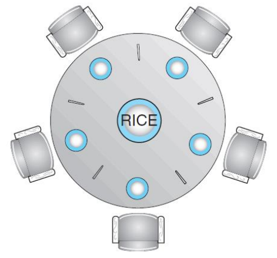

# Synchronization Examples
## Classic Problems of Synchronization
* Examples of a large class of *Concurrency-Control* Problems
    * The **Bounded-Buffer** Problem 
        * The **Producer-Consumer** Problem
    * The **Readers-Writers** Problem
    * The **Dining-Philosophers** Problem

### The Bounded-Buffer Problem
* Recall the Producer-Consumer Problem with a pool consisting of *n buffers*, each capable of holding *one* item.
    * The producer *produces full buffers* for the consumer
    * The consumer *produces empty buffers* for the producer.

* Shared Data Structures:
    * A binary semaphore *mutex* provides *mutual exclusion* for accesses to the buffer pool and is *initialized* to the value 1.
    * Two counting semaphores *empty* and *full* are used to count the number of *empty* and *full* buffers.
        * empty is initialized to the value 𝑛, full is to the value 0.

```
int n;
semaphore mutex = 1;
semaphore empty = n;
semaphore full = 0;

/*
* The structure of the producer process
*/
while (true) {
    ...
    /* produce an item in next_produced */
    ...
    wait(empty);
    wait(mutex);
    ...
    /* add next_produced to the buffer */
    ...
    signal(mutex);
    signal(full);
}

/*
* The structure of the consumer process
*/
while (true) {
    wait(full);
    wait(mutex);
    ...
    /* remove an item from buffer to next_consumed */
    ...
    signal(mutex);
    signal(empty);
    ...
    /* consume the item in next_consumed */
    ...
}
```

### The Readers-Writers Problem
* What if the processes running concurrently are either the *readers* or the *writers* to the shared data?
    * e.g., a *database* shared among several concurrent processes.
* The *readers* may want *only to read* the database, whereas the *writers* to *update* (that is, *read and write*) the database.
* Note that, obviously, *no adverse effects* will result, if *two or more readers* access the shared data simultaneously.
* However, *chaos* may ensue, if a *writer* and some other process (either a *reader* or a *writer*) access the database simultaneously.

* Some Variations of the Readers-Writers Problem:
    * **Priorities** are involved with all the variations.
    * The **first** readers-writers problem:
        * *No reader* should *wait* for other readers to finish simply because a *writer* is *waiting*.
    * The **second** readers-writers problem:
        * If a *writer* is waiting to access the object, no new *readers* may start *reading*.
    * Note that **starvation** may occur in these two cases.

* Solution to the first readers-writers problem
    * The reader processes share the following data structures
    * rw_mutex is common to both readers and writers.
    * mutex is used to ensure *mutual exclusion* when the variable read_count is updated.
    * read_count keeps track of how many processes are currently reading the object.

```
semaphore rw_mutex = 1;
semaphore mutex = 1;
int read_count = 0;

/*
* The structure of a writer process
*/

while (true) {
    wait(rw_mutex);
    ...
    /* writing is performed */
    ...
    signal(rw_mutex);
}

/*
* The structure of a reader process
*/

while (true) {
    wait(mutex);
    read_count++;
    if (read_count == 1)
        wait(rw_mutex);
    signal(mutex);
    ...
    /* reading is performed */
    ...
    wait(mutex);
    read_count--;
    if (read_count == 0)
        signal(rw_mutex);
    signal(mutex);
}
```

* Solution to the Readers-Writers Problem:
    * Note that, if *a writer* is in the critical section, and *𝑛 readers* are waiting, then *one reader* is queued on *rw_mutex*, and *𝑛 − 1 readers* are queued on *mutex*.
    * Also observe that, when a writer executes *signal(rw_mutex)*, we may resume the execution of either the *waiting readers* or a *single waiting writer*.
        * The selection is made by the scheduler.

### The Reader-Writer Locks
* The readers-writers problem and its solutions have been generalized to provide *reader-writer locks*.
* Acquiring a reader-writer lock requires specifying the mode of the lock: either *read* or *write*.
* Note that *multiple processes* may acquire a reader-writer lock in read mode, but *only one process* may acquire the lock for writing, as exclusive access is required for writers.

### Solution to the Bounded-Buffer Problem

```
/*
* PThread solution to the Bounded-Buffer Problem
*/
#include <stdio.h>
#include <stdlib.h>
#include <unistd.h>
#include <pthread.h>
#include <semaphore.h>

#define true 1
#define BUFFER_SIZE 5

int buffer[BUFFER_SIZE];

pthread_mutex_t mutex;
sem_t empty, full;

int in = 0, out = 0;

void insert_item(int item) {
    sem_wait(&empty);
    pthread_mutex_lock(&mutex);

    buffer[in] = item;
    in = (in + 1) % BUFFER_SIZE;
    printf("Producer: inserted $%d\n", item);

    pthread_mutex_unlock(&mutex);
    sem_post(&full);
}

void remove_item(int *item) {
    sem_wait(&full);
    pthread_mutex_lock(&mutex);

    *item = buffer[out];
    out = (out + 1) % BUFFER_SIZE;
    printf("Consumer: removed $%d\n", *item);

    pthread_mutex_unlock(&mutex);
    sem_post(&empty);
}

void *producer(void *param) {
    int item;
        while (true) {
            usleep((1 + rand() % 5) * 100000);
            item = 1000 + rand() % 1000;
            insert_item(item); // critical section
    }
}

void *consumer(void *param) {
    int item;
    while (true) {
        usleep((1 + rand() % 5) * 100000);
        remove_item(&item); // critical section
    }
}

int main(int argc, char *argv[]) {
    int i, numOfProducers = 1, numOfConsumers = 1;
    pthread_t tid;

    pthread_mutex_init(&mutex, NULL);
    sem_init(&empty, 0, BUFFER_SIZE);
    sem_init(&full, 0, 0);
    srand(time(0));
    // Create the producers
    for (i = 0; i < numOfProducers; i++)
        pthread_create(&tid, NULL, producer, NULL);
    // Create the consumers
    for (i = 0; i < numOfConsumers; i++)
        pthread_create(&tid, NULL, consumer, NULL);

    sleep(10);
    return 0;
}
```

```java
/*
* Java solution to the Bounded-Buffer Problem
*/

public class BoundedBuffer {
    public static void main(String[] args) {
        CashBox cashBox = new CashBox(1);
        Thread[] producers = new Thread[1];
        Thread[] consumers = new Thread[1];
        // Create threads of producers
        for (int i = 0; i < producers.length; i++) {
            producers[i] = new Thread(new ProdRunner(cashBox));
            producers[i].start();
        }
        // Create threads of consumers
        for (int i = 0; i < consumers.length; i++) {
            consumers[i] = new Thread(new ConsRunner(cashBox));
            consumers[i].start();
        }
    }
}

class ProdRunner implements Runnable {
    CashBox cashBox;
    public ProdRunner(CashBox cashBox) {
        this.cashBox = cashBox;
    }
    @Override
    public void run() {
        try {
            while (true) {
                Thread.sleep((long)(Math.random()*500));
                int money = ((int)(1 + Math.random()*9))*10000;
                cashBox.give(money);
            }
        } catch (InterruptedException e) {}
    }
}

class ConsRunner implements Runnable {
    CashBox cashBox;
    public ConsRunner(CashBox cashBox) {
        this.cashBox = cashBox;
    }
    @Override
    public void run() {
        try {
            while (true) {
                Thread.sleep((long)(Math.random()*500));
                int money = cashBox.take();
            }
        } catch (InterruptedException e) {}
    }
}

class CashBox {
    private int[] buffer;

    private int count, in, out;

    public CashBox(int bufferSize) {
        buffer = new int[bufferSize];
        count = in = out = 0;
    }

    synchronized public void give(int money) {
        while (count == buffer.length) {
            try {
                wait();
            } 
            catch (InterruptedException e) {}
        }

        buffer[in] = money;
        in = (in + 1) % buffer.length; 
        count++;
        System.out.printf("Cash increased: %d\n", money);

        notify();
    }  
    
    synchronized public int take() throws InterruptedException {
        while (count == 0) {
            try {
                wait();
            } 
            catch (InterruptedException e) {}
        }

        int money = buffer[out]; 
        out = (out + 1) % buffer.length;
        count--;
        System.out.printf("Cash decreased: %d\n", money);

        notify();
        return money;
    }
}
```

```java
/*
* Java solution to the first Readers-Writers Problem
*/

class SharedDB {
    private int readerCount = 0;
    private boolean isWriting = false;

    public void read() {
    // read from the database here.
    }

    public void write() {
    // write into the database here.
    }
    
    synchronized public void acquireReadLock() {
        while (isWriting == true) {
            try {
                wait();
            } catch (InterruptedException e) {}
        }
        readerCount++;
    }

    synchronized public void releaseReadLock() {
        readerCount--;
        if (readerCount == 0)
            notify();
    }

    synchronized public void acquireWriteLock() {
        while (readerCount > 0 || isWriting == true) {
            try {
                wait();
            } catch (InterruptedException e) {}
        }
        isWriting = true;
    }

    synchronized public void releaseWriteLock() {
        isWriting = true;
        notifyAll();
    }

    ...

    sharedDB.acquireReadLock();
    sharedDB.read();
    sharedDB.releaseReadLock();
    
    sharedDB.acquireWriteLock();
    sharedDB.write();
    sharedDB.releaseWriteLock();
}
```

## The Dining-Philosophers Problem
* Consider *five* philosophers who spend their lives *thinking* and *eating*.
    * sharing *five single chopsticks*.
* Sometimes, a philosopher gets hungry and tries to pick up *two chopsticks* that are closest to her.
* When a hungry philosopher has both *her chopsticks* at the same time, she eats *without releasing* the chopsticks.

* Need to allocate *several resources* among *several processes* in a **deadlock-free** and **starvation-free manner**.

{: w="320" h = "320"}
*The situation of the dining philosophers*

### Semaphore Solution
* One simple solution is to represent each chopstick with a semaphore.
    * A philosopher acquires a chopstick by executing a 𝑤𝑎𝑖𝑡() operation.
    * She releases her chopsticks by executing a 𝑠𝑖𝑔𝑛𝑎𝑙() operation.

```
semaphore chopstick[5];

while (true) {
    wait(chopstick[i]);
    wait(chopstick[(i + 1) % 5]);
    ...
    /* eat for a while */
    ...
    signal(chopstick[i]);
    signal(chopstick[(i + 1) % 5]);
    ...
    /* think for a while */
    ...
}
```

* The problem of **deadlock** and **starvation**
    * Simple semaphore solution guarantees **mutual exclusion**.
    * However, how about deadlock or starvation?
        * Suppose that all five philosophers become hungry at the same time and each grabs her left chopstick, trying to grab her right chopstick.
        * Here comes a deadlock situation.

* Possible *remedies* to the deadlock problem
    * Allow *at most four philosophers* to be sitting simultaneously at the table.
    * Allow a philosopher to pick up her chopsticks only if *both chopsticks* are available.
    * Use an *asymmetric* solution
        * An *odd-numbered* philosopher picks up first her left chopstick and then her right chopstick, whereas an *even-numbered* philosopher picks up her right chopstick and the her left chopstick.
    * Note that a deadlock-free solution does not necessarily eliminate the possibility of **starvation**.

### Monitor Solution
* Let a philosopher to pick up her chopsticks only if *both* of them are *available*.
* We need to distinguish among *three states* of the philosophers: thinking, hungry, and eating. 
* A philosopher can set her state to be eating, only if her *two neighbors* are not in the state of eating.
* We also need a *condition variable* which allows a philosopher to *delay* herself when she is *hungry* but is *unable to obtain* the chopsticks she needs.

* Solution to the Dining-Philosophers Problem
    * The distribution of the chopsticks is controlled by the monitor, *DiningPhilosopher*.
    * Each philosopher must to invoke the operation 𝑝𝑖𝑐𝑘𝑢𝑝(), before starting to eat, suspending the philosopher process.
    * After the successful completion of pickup(), the philosopher may eat, and invokes the operation 𝑝𝑢𝑡𝑑𝑜𝑤𝑛().
    * Note that **mutual exclusion** is guaranteed and **no deadlocks** will occur, however, **starvation** is still possible.

```
/*
* A monitor solution to the dining-philosopher problem
*/

monitor DiningPhilosophers
{
    enum {THINKING, HUNGRY, EATING} state[5];
    condition self[5];

    void pickup(int i) {
        state[i] = HUNGRY;
        test(i);
        if(state[i] != EATING)
            self.[i].wait();
    }

    void putdown(int i) {
        state[i] = THINKING;
        test((i + 4) % 5);
        test((i + 1) % 5);
    }

    void test(int i) {
        if((state[(i + 4) % 5] != EATING) && state[i] == HUNGRY && (state[(i + 1) != EATING])) {
            state[i] = EATING;
            self[i].signal();
        }
    }

    initialization_code() {
        for (int i = 0; i < 5; ++i)
            state[i] = THINKING;
    }
}
```

### Pthread solution to the Dining-Philosophers Problem
```
#include <stdio.h>
#include <stdlib.h>
#include <unistd.h>
#include <pthread.h>

#define true 1
#define NUM_PHILS 5

enum {THINKING, HUNGRY, EATING} state[NUM_PHILS];

pthread_mutex_t mutex_lock;
pthread_cond_t cond_vars[NUM_PHILS];

void init() {
    int i;
    for (i = 0; i < NUM_PHILS; i++) {
        state[i] = THINKING;
        pthread_cond_init(&cond_vars[i], NULL);
    }
    pthread_mutex_init(&mutex_lock, NULL);
    srand(time(0));
}

int leftOf(int i) {
    return (i + NUM_PHILS - 1) % NUM_PHILS;
}

int rightOf(int i) {
    return (i + 1) % NUM_PHILS;
}

void think(int id) {
    printf("%d: Now, I'm thiking...\n", id);
    usleep((1 + rand() % 50) * 10000);
}

void eat(int id) {
    printf("%d: Now, I'm eating...\n", id);
    usleep((1 + rand() % 50) * 10000);
}

void *philosopher(void *param) {
    int id = *((int *)param);
    while (true) {
        think(id);
        pickup(id);
        eat(id);
        putdown(id);
    }
}

void test(int i) {
    // If I'm hungry and my neighbors are not eating,
    // then let me eat.
    if (state[i] == HUNGRY && state[leftOf(i)] != EATING && state[rightOf(i)] != EATING) {
        state[i] = EATING;
        pthread_cond_signal(&cond_vars[i]);
    }
}

void pickup(int i) {
    pthread_mutex_lock(&mutex_lock);

    state[i] = HUNGRY;
    test(i);
    while (state[i] != EATING) {
        pthread_cond_wait(&cond_vars[i], &mutex_lock);
    }

    pthread_mutex_unlock(&mutex_lock);
}

void putdown(int i) {
    pthread_mutex_lock(&mutex_lock);

    state[i] = THINKING;
    test(leftOf(i));
    test(rightOf(i));

    pthread_mutex_unlock(&mutex_lock);
}

int main() {
    int i;
    pthread_t tid;
    init();
    for (i = 0; i < NUM_PHILS; i++)
        pthread_create(&tid, NULL, philosopher, (void *)&i);
    for (i = 0; i < NUM_PHILS; i++)
        pthread_join(tid, NULL);
    return 0;
}
```

### Java solution to the Dining-Philosophers Problem
```java
import java.util.concurrent.locks.Condition;
import java.util.concurrent.locks.Lock;
import java.util.concurrent.locks.ReentrantLock;

enum State {
THINKING, HUNGRY, EATING
}

public class DiningPhilosophers {

    public static void main(String[] args) throws Exception {
        int numOfPhils = 5;
        Philosopher[] philosophers = new Philosopher[numOfPhils];
        DiningPhilosopherMonitor monitor = new DiningPhilosopherMonitor(numOfPhils);
        for (int i = 0; i < philosophers.length; i++)
            new Thread(new Philosopher(i, monitor)).start();
    }
}

class Philosopher implements Runnable {

    private int id;
    private DiningPhilosopherMonitor monitor;

    public Philosopher(int id, DiningPhilosopherMonitor monitor) {
        this.id = id;
        this.monitor = monitor;
    }

    @Override
    public void run() {
        while (true) {
            think();
            monitor.pickup(id);
            eat();
            monitor.putdown(id);
        }
    }

    private void think() {
        try {
            System.out.println(id + ": Now I'm thinking.");
            Thread.sleep((long)(Math.random()*500));
        } catch (InterruptedException e) { }
    }

    private void eat() {
        try {
            System.out.println(id + ": Now I'm eating.");
            Thread.sleep((long)(Math.random()*50));
        } catch (InterruptedException e) { }
    }
}

class DiningPhilosopherMonitor {

    private int numOfPhils;
    private State[] state;
    private Condition[] self;
    private Lock lock;

    public DiningPhilosopherMonitor(int num) {
        numOfPhils = num;
        state = new State[num];
        self = new Condition[num];
        lock = new ReentrantLock();
        for (int i = 0; i < num; i++) {
            state[i] = State.THINKING;
            self[i] = lock.newCondition();
        }
    }

    private int leftOf(int i) {
        return (i + numOfPhils - 1) % numOfPhils;
    }

    private int rightOf(int i) {
        return (i + 1) % numOfPhils;
    }

    private void test(int i) {
        if (state[i] == State.HUNGRY && state[leftOf(i)] != State.EATING && state[rightOf(i)] != State.EATING) {
            state[i] = State.EATING;
            self[i].signal();
        }
    }

    public void pickup(int id) {
        lock.lock();
        try {
            state[id] = State.HUNGRY;
            test(id);
            if (state[id] != State.EATING)
                self[id].await();
        } 
        catch (InterruptedException e) {
        }
        finally {
            lock.unlock();
        } 
    }

    public void putdown(int id) {
        lock.lock();
        try {
            state[id] = State.THINKING;
            test(leftOf(id)); // left neighbor
            test(rightOf(id)); // right neighbor
        } 
        finally {
            lock.unlock();
        } 
    }
}
```

## Thread-Safe Concurrent Applications
* *Concurrent applications* have good performance on multicore systems, using techniques such as *mutex locks*, *semaphores*, and *monitors*.
* However, they present an increased risk of **race conditions** and **liveness hazards** such as *deadlock*.
* There are alternative approaches for the design of **thread-safe** *concurrent* applications.
    1. **Transactional Memory**
    2. **OpenMP**
    3. **Functional Programming Language**
