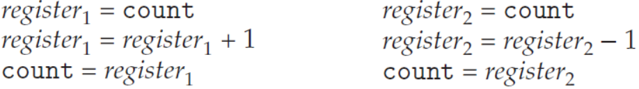
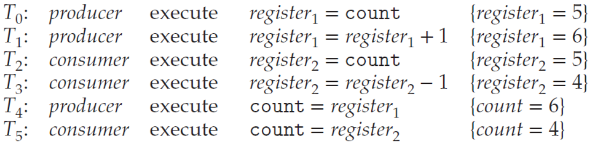
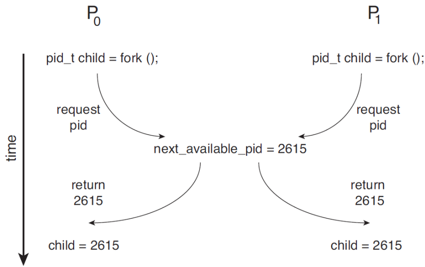
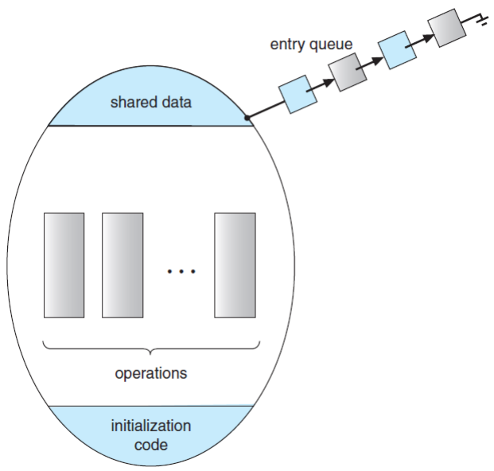
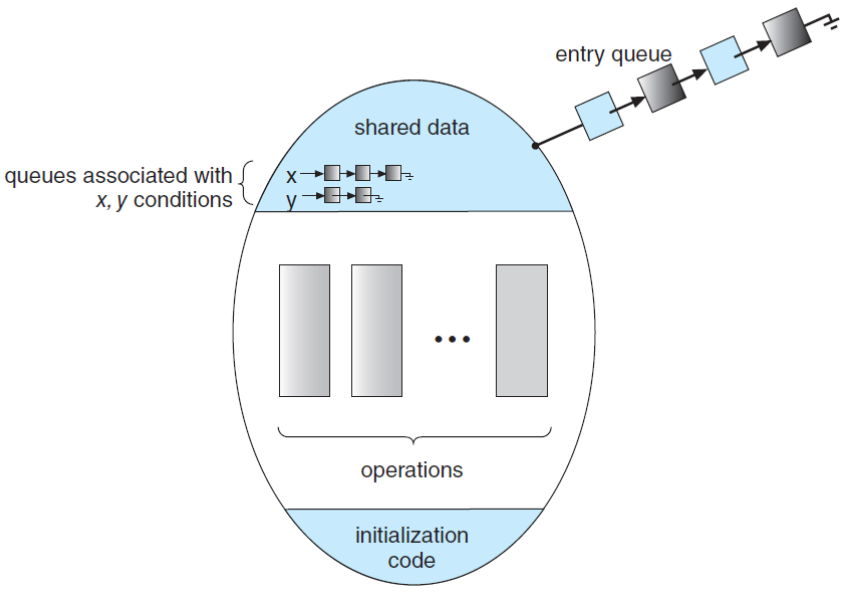
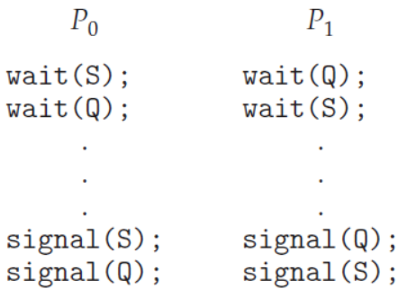

# Synchronization Tools
## Background
* *Cooperating* processes 
    * can either affect or be affected by each other.
    * can share a logical address(thread) space or be allowed to share data(shared memory & massage passing).
* However, *concurrent access* to shared data may result in **data inconsistency**.
* Hence, we need to ensure the *orderly execution* of cooperating processes that share a logical address space to *maintain data consistency*.

* The **integrity of data** shared by several processes (or threads)
* *Concurrent* execution
    * A process may be interrupted at any point in its instruction stream.
    * The processing core may be assigned to another process.
* Parallel execution
    * Two or more instruction streams (representing different processes) execute simultaneously on separate processing cores.

* Consider an example of how this is happen:
    * Let us revisit the **producer-consumer problem**, where two processes *share data* and are *running asynchronously*.
    * To count items in the buffer, add an integer variable count:
        * Initialized to 0, *incremented* every time we *add a new item* to the buffer, *decremented* every time we *remove one item* from the buffer.

```
while (true) {
    /* produce an item in next_produced */

    while (count == BUFFER_SIZE); // do nothing

    buffer[in] = next_produced;
    in = (in + 1) % BUFFER_SIZE;
    count++;
}

...

while (true) {
    while (count == 0); // do nothing

    next_consumed = buffer[out];
    out = (out + 1) % BUFFER_SIZE;
    count--;

    /* consume the item in next_consumed */
}
```

* Data inconsistency: Although two processes are correct separately, they *may not function correctly* when executed concurrently.
    * Suppose that the value of count is currently 5, the producer and consumer concurrently execute two statements: count++; and count—;
    * Then, the value of the variable count may be 4, 5, or 6!
        * is it posssible? why?

```
#include <stdio.h>
#include <pthread.h>

int sum = 0;

void *run(void *param)
{
    int i;
    for (i = 0; i < 10000; i++)
        sum++;
    pthread_exit(0);
}

int main()
{
    pthread_t tid1, tid2;
    pthread_create(&tid1, NULL, run, NULL);
    pthread_create(&tid2, NULL, run, NULL);
    pthread_join(tid1, NULL);
    pthread_join(tid2, NULL);
    printf("%d\n", sum);
}
```

* tid1과 tid2는 thread이므로 code space와 memory space, 즉 sum을 공유
* 결과가 항상 20000이 나오지 않음

```
int sum = 0;

void *run1(void *param)
{
    int i;
    for (i = 0; i < 10000; i++)
        sum++;
    pthread_exit(0);
}

void *run2(void *param)
{
    int i;
    for (i = 0; i < 10000; i++)
        sum--;
    pthread_exit(0);
}

int main()
{
    pthread_t tid1, tid2;
    pthread_create(&tid1, NULL, run1, NULL);
    pthread_create(&tid2, NULL, run2, NULL);
    pthread_join(tid1, NULL);
    pthread_join(tid2, NULL);
    printf("%d\n", sum);
}
```

* 역시 항상 0이 나오지 않음

* How these results can happen?
    * Note that two statements “count++” and “count--” may be implemented in machine language as follows:

{: w="360" h = "270"}

* Even though 𝑟𝑒𝑔𝑖𝑠𝑡𝑒𝑟1 and 𝑟𝑒𝑔𝑖𝑠𝑡𝑒𝑟2 may be the same physical register, the contents of these registers will be **saved** and **restored** by the interrupt handler (or scheduler).
* The concurrent execution of “count++” and “count--” is equivalent to a sequential execution in which the lower-level statements presented previously are *interleaved* in some *arbitrary order*.
* 연산이 진행되는 3단계의 instruction에서, 어느 시점에 contxt switch가 발생하느냐가 연산 결과에 영향을 끼칠 수 있음

{: w="380" h = "350"}

### Race Condition
* A situation where several processes (or threads) access and manipulate the *same* (or *shared*) *data concurrently* and the outcome of the execution depends on the *particular order* in which the access takes place.

* To guard against the **race condition**, we need to ensure that *only one process at a time* can manipulate the shared data (e.g. the 
variable count).
* To make such a guarantee, we require that the processes are *synchronized* in some way.
    * To say, **process (or thread) synchronization**.

```java
class RunnableTwo implements Runnable {
    static int count = 0;

    @Override
    public void run() {
        for (int i = 0; i < 10000; i++)
            count++;
    }
}

public class RaceCondition2 {
    public static void main(String[] args) throws Exception {
        RunnableTwo run1 = new RunnableTwo();
        RunnableTwo run2 = new RunnableTwo();
        Thread t1 = new Thread(run1);
        Thread t2 = new Thread(run2);
        t1.start(); t2.start();
        t1.join(); t2.join();
        System.out.println("Result: " + RunnableTwo.count);
    }
}
```

## The Critical Section Problem
* Consider a system consisting of 𝑛 processes {𝑃0, 𝑃1, ⋯ , 𝑃𝑛−1}.
    * Each process has *a segment of code*, called a **critical section**, in which the process may be *accessing* – and *updating* – *data* that is *shared with* at least one other process.
* The important feature of the system is that, when one process is executing in its critical section, no other process is allowed to execute in its critical section.

* The **critical-section problem**:
    * No two processes are executing in their critical sections at the same time.
    * To design a protocol that the processes can use to **synchronize** their activity so as to *cooperatively share* data.

* Sections of codes:
    * The **entry-section**: the section of code to request permission to enter its critical section.
    * The *critical-section* follows the entry-section.
    * The **exit-section** follows the critical-section.
    * The *remainder-section* is the section of remaining code.

```
while (true) {
    ...
    /*
    * Entry Section
    */

    /*
    * Critical Section
    */

    /*
    * Exit Section
    */

    /*
    * Remainder Section
    */
    ...
}
```

* Three requirements for the solution:
    * **Mutual Exclusion**: If process 𝑃𝑖 is executing in its critical section, then no other processes can be executing in their critical section.
    * **Progress**(avoid **deadlock**):  If no process is executing in its critical section and some processes wish to enter their critical section, then the selection of next process will enter its critical section next cannot be postponed indefinitely.
    * **Bounded Waiting**(avoid **starvation**): A bound (or limit) on the number of times that other processes are allowed to enter their critical sections after a process has made a request to enter its critical section and before that request is granted.

{: w="400" h = "420"}
*Race condition when assigning a pid*

* A simple solution in a *single-core* environment: 
    * *Prevent interrupts* from occurring while a shared variable was being modified.
    * We could be sure that the current sequence of instructions would be allowed to execute in order without preemption.
    * No other instructions would be run, so no unexpected modifications could be made to the shared data.
    * Unfortunately, *not feasible* in a *multiprocessor* environment.

* Two general approaches: **preemptive** kernels and **non-preemptive** kernels.
    * Non-preemptive kernel
        * A kernel-mode process will run until it exits kernel mode, blocks, or voluntarily yields the CPU.
        * Essentially free from race conditions on kernel data structures.
    * Preemptive kernel
        * Allows a process to be preempted when it is running in kernel mode.
        * Essentially difficult to design, but favorable since it may be more responsive.

## Peterson’s Solution
* Software Solutions to the Critical-Section Problem:
    * **Dekker’s Algorithm**: For two processes
    * **Eisenberg and McGuire’s Algorithm**: For 𝑛 processes with a lower bound on waiting of 𝑛 − 1 turns 
    * **Peterson’s Algorithm**: A classic software solution to the critical-section problem.
        * No guarantees that Peterson’s solution will work correctly, since modern computers perform basic machine-language instructions such as *load* and *store*.

* Peterson’s solution
    * Restricted to two processes that alternate execution  between their critical sections and remainder sections.

```
/*
* The structure of process Pi in Perterson's solution
*/

int turn;
boolean flag[2];

while (true) {
    flag[i] = true;
    turn = j;
    while (flag[j] && turn == j);

    /* critical section */

    flag[i] = false;

    /* remainder section */
}
```

```
#include <stdio.h>
#include <pthread.h>

#define true 1
#define false 0

int sum = 0;

int turn;
int flag[2];

int main()
{
    pthread_t tid1, tid2;
    pthread_create(&tid1, NULL, producer, NULL);
    pthread_create(&tid2, NULL, consumer, NULL);
    pthread_join(tid1, NULL);
    pthread_join(tid2, NULL);
    printf("sum = %d\n", sum);
}

void *producer(void *param)
{
    int k;
    for (k = 0; k < 10000; k++) {
        /* entry section */
        flag[0] = true;
        turn = 1;
        while (flag[1] && turn == 1);

        /* critical section */
        sum++;

        /* exit section */
        flag[0] = false;

        /* remainder section */
    }
    pthread_exit(0);
}

void *consumer(void *param)
{
    int k;
    for (k = 0; k < 10000; k++) {
        /* entry section */
        flag[1] = true;
        turn = 0;
        while (flag[0] && turn == 0);

        /* critical section */
        sum--;

        /* exit section */
        flag[1] = false;

        /* remainder section */
    }
    pthread_exit(0);
}
```

* What happen?
    * There are *no guarantees* that Peterson’s solution *will work correctly*, if the architecture perform basic machine-language instructions, such as *load* and *store*.
    * However, Peterson’s solution provides a good algorithmic description of solving the CSP.
    * Illustrates some of the complexities involved in the requirements of *mutual exclusion*, *progress*, and *bounded waiting*.

* Peterson’s solution is *provably correct*.
    * **Mutual exclusion** is preserved.
        * Note that each 𝑃𝑖 enters its critical section, only if either flag[j]==false or turn==i.
    * The progress requirement is satisfied. (**No deadlock**)
    * The bounded-waiting requirement is met. (**No starvation**)

## Hardware Support for Synchronization
* Hardware-based Solutions
    * Hardware instructions that provide support for solving the critical-section problem.
        * can be used directly as synchronization tools,
        * can be used to form the foundation of more abstract mechanisms.
    * Three primitive operations
        * **Memory barriers or fences**
        * **Hardware instructions**
        * **Atomic variables**

### Atomicity
*  An *atomic operation* is one uninterruptible unit of operation.
    * Modern computer systems provide special hardware instructions 
    *  i.e., *atomic instructions*
    * that allow us either to *test and modify* the content of a word
    * or to *test and swap* the contents of two words
* Two types of conceptual atomic instructions:
    * *test_and_set()* and *compare_and_swap()*

* The test_and_set() instruction:
    * A global Boolean variable lock is declared and initialized to false.

```
/* Definition of the atomic test_and_set() instruction */

boolean test_and_set (boolean *target) {
    boolean rv = *target;
    *target = true;

    return rv
}

/* Mutual-exclusion implementation with test_and_set() */

do {
    while (test_and_set(&lock)); // do nothing

    /* critical section */

    lock = false;

    /* remainder section */
} while (true);
```

* The compare_and_swap() instruction:
    * A global Boolean variable lock is declared and initialized to 0.

```
/* Definition of the atomic compare_and_swap instruction */

int compare_and_swap (int *value, int expected, int new_value) {
    int temp = *value;

    if (*value == expected)
        *value = new_value;

    return temp;
}

/* Mutual-exclusion implementation with compare_and_swap() */

while (true) {
    while (compare_and_swap(&lock, 0, 1)); // do nothing

    /* critical section */

    lock = 0;

    /* remainder section */
}
```

### Atomic Variable
* Typically, the compare_and_swap() instruction is used for construction other tools such as an *atomic variable*.
* An **atomic variable** provides atomic operations on basic data types such as integers and Booleans.
    * can be used to ensure mutual exclusion in situations where there may be a *single variable* with *race condition*.

```java
/*
* Java implementation of Peterson’s solution with Atomic variable
*/

import java.util.concurrent.atomic.AtomicBoolean;

public class Peterson2 {

    static int count = 0;

    static int turn = 0;
    static AtomicBoolean[] flag;
    static {
        flag = new AtomicBoolean[2];
        for (int i = 0; i < flag.length; i++)
            flag[i] = new AtomicBoolean();
    }

    static class Producer implements Runnable {
        @Override
        public void run() {
            for (int k = 0; k < 100000; k++) {
                /* entry section */
                flag[0].set(true);
                turn = 1;
                while (flag[1].get() && turn == 1);

                /* critical section */
                count++;

                /* exit section */
                flag[0].set(false);

                /* remainder section */
            }
        }
    }

    static class Consumer implements Runnable {
        @Override
        public void run() {
            for (int k = 0; k < 100000; k++) {
                /* entry section */
                flag[1].set(true);
                turn = 0;
                while (flag[0].get() && turn == 0);
                
                /* critical section */
                count--;

                /* exit section */
                flag[1].set(false);

                /* remainder section */
            }
        }
    }
}
```

## Higher-level software tools to solve the CSP
    * **Mutex Locks**: the simplest tools for synchronization.
    * **Semaphore**: more robust, convenient, and effective tool.
    * **Monitor**: overcomes the demerits of mutex and semaphore.
    * **Liveness**: ensures for processes to make progress.

## Mutex Locks
* **mutex**: *mutual exclusion*
* to protect critical section and prevent race condition.
* a process must *acquire* the **lock** before *entering* a critical section.
* *releases* the **lock** when it *exits* the critical section.

* Two functions and one variable for the Mutex Locks:
    * acquire() and release()
    * available: a Boolean variable whose value indicates if the lock is available or not.

```
while (true) {
    // acquire lock

    /*
    * critical section
    */

    // release lock

    /*
    * remainder section
    */
}
```

* The definition of acquire() and release():

```
acquire() {
    while (!available); // busy wait

    available = false;
}

realease() {
    available = true;
}
```

* Calls to either acquire() and release() must be performed *atomically*.
* Can be implemented using the compare_and_swap operation.

### Busy Waiting
* Any other process trying to enter its critical section must *loop continuously* in the call to acquire().
* Busy waiting is clearly a problem in a real multiprogramming system, where a single CPU core is shared among many processes.
* Wastes CPU cycles for some other processes to use productively.
* Mutex Lock 구현시 해결해야할 문제

### Spin lock
* The type of mutex lock using the method of **busy waiting**.
* The process *spins* while waiting for the lock to become available.
* However, spinlocks do have an advantage, in that *no context switch* is required waiting on a lock.
    * A context switch may take considerable time.
* In certain circumstances on multicore systems, spinlocks are the preferable choice for locking.
    * One thread can spin on one processing core while another thread performs its critical section on another core
    * Can save contex switch time.

```
#include <stdio.h>
#include <pthread.h>

int sum = 0; // a shared variable

pthread_mutex_t mutex;

void *counter(void *param)
{
    int k;
    for (k = 0; k < 10000; k++) {
        /* entry section */
        pthread_mutex_lock(&mutex);

        /* critical section */
        sum++;

        /* exit section */
        pthread_mutex_unlock(&mutex);

        /* remainder section */
    }
    pthread_exit(0);
}

int main()
{
    pthread_t tid1, tid2;
    pthread_mutex_init(&mutex, NULL);
    pthread_create(&tid1, NULL, counter, NULL);
    pthread_create(&tid2, NULL, counter, NULL);
    pthread_join(tid1, NULL);
    pthread_join(tid2, NULL);
    printf("sum = %d\n", sum);
}
```

## Semaphore
* A **semaphore** 𝑆 is an integer variable that, apart from initialization, is accessed only through *two standard atomic operations*:
    * **wait()** and **signal()**, or sometimes **P()** and **V()**. 
    * P() and V() are introduced by Edsger Dijkstra
        * *P*roberen(to test) and *V*erhogen(to increment)

Definition of wait() and signal():

```
wait(S) {
    while (S <= 0); // busy wait
    S--;
}

signal(S) {
    S++;
}
```

• All modifications to the integer value of the semaphore in the wait() and signal() operations must be executed *atomically*.

### Binary and Counting Semaphores
* **Binary Semaphore**
    * range only between 0 and 1: similar to **mutex lock**.
* **Counting Semaphore**
    * range over an unrestricted domain.
    * can be used to resources with *a finite number of instances*.

* Using the counting semaphore
    * *Initialize* a semaphore to *the number of resources available*.
    * When a process uses a resource *wait()* on the semaphore: decrements the count.
    * When a process release a resource *signal()* on the semaphore: increment the count.
    * When the count *goes to 0*, all resources are being used. 
        * Then, processes that wish to use a resource will block until the count becomes *greater than 0*.

* Using the semaphore to solve synchronization problem
    * Consider two processes 𝑃1 and 𝑃2 running concurrently.
        * 𝑃1 with a statement 𝑆1, and 𝑃1 with a statement 𝑆2.
    * Suppose that 𝑆2 should be executed only after 𝑆1 has completed.
        * Let 𝑃1 and 𝑃2 share a semaphore synch, initialized to 0.

* Semaphore Implementation
    * Semaphores also suffer from the problem of *busy waiting*.
    * To overcome this problem, modify the definition of P() and V().
    * When a process executes the wait() operation and finds that the semaphore is not positive, it must wait.
        * Rather than busy waiting, suspend itself and goes to the *waiting queue*.
    * When other process executes the signal() operation waiting processes can be restarted and placed into the *ready queue*.

```
    typedef struct {
        int value;
        struct process *list;
    } semaphore;

    wait(semaphore *S) {
        S->value--;
        if (S -> value < 0) {
            add this process to S->list;
            sleep();
        }
    }

    signal (semaphore *S) {
        S -> value++;
        if (S -> value <= 0) {
            remove a process P from S->list;
            wakeup(P);
        }
    }
```

```
#include <stdio.h>
#include <pthread.h>
#include <semaphore.h>

int sum = 0; // a shared variable

sem_t sem;

void *counter(void *param)
{
    int k;
    for (k = 0; k < 10000; k++) {
        /* entry section */
        sem_wait(&sem);

        /* critical section */
        sum++;

        /* exit section */
        sem_post(&sem);

        /* remainder section */
    }
    pthread_exit(0);
}

int main()
{
    pthread_t tid[5]; int i;
    sem_init(&sem, 0, 1); // thread는 5개지만, instance는 sum으로 1개. 따라서, binary semaphore를 쓰는 게 더 적합
    for (i = 0; i < 5; i++)
        pthread_create(&tid[i], NULL, counter, NULL);
    for (i = 0; i < 5; i++)
        pthread_join(tid[i], NULL);
    printf("sum = %d\n", sum);
}
```

## Monitor
* The difficulty of using semaphores
    * The semaphore is convenient and effective for synchronization.
    * However, *timing errors* can happen if particular execution sequences take place.
        * These sequences do not always occur, and it is hard to detect.

* An illustrative example of semaphore’s problem
    * All processes share a binary semaphore mutex initialized to 1.
        * Each process must wait(mutex) before entering the CS and signal(mutex) afterward.
    * If this sequence is not observed, two processes may be in their critical sections simultaneously.

* Situation 1
    * Note that the difficulty arises even if a single process is not well behaved.
    * Suppose that a program *interchanges the order*.
        * In which wait() and signal() on the semaphore mutex are executed.

```
signal (mutex);
...
critical section
...
wait (mutex);
```

* Situation 2 & 3
    * Suppose that a program *replaces signal() with wait()*.
    * Suppose that a process omits the wait(), or the signal(), or both of them.

```
wait (mutex);
...
critical section
...
wait(mutex)
```

* How to deal with these kinds of difficulties?
    * These situations may be caused by an honest programming error or an uncooperating programmer.
    * Various types of errors can be generated easily when programmers use semaphores (or mutex locks) incorrectly.
    * Incorporate simple synchronization tools as high-level language constructs
        * **monitor**: one fundamental high-level synchronization construct.

### Monitor Type
* An **ADT** that includes a set of *programmer-defined operations* that are provided with mutual exclusion within the *monitor*.
 * Declares the **variables** whose values define the *state of an instance* of that type.
    * Along with the bodies of **function** that operate on those variables.

```
monitor monitor_name 
{
    /* shared vairable declarations */

    function P1 (...) {
        ...
    }

    function P2 (...) {
        ...
    }

    ...

    function Pn (...) {
        ...
    }

    initialization_code (...) {
        ...
    }
}
```

{: w="360" h = "350"}
*Schematic view of a monitorl*

### Condition Variables
* The monitor construct is not sufficiently powerful for modeling some synchronization schemes.
* We need to define the **condition** construct to provide additional synchronization mechanisms.

* Using conditional variables
    * One can define one or more variables of type **condition**
        * The only operations that can be invoked on a **condition variable** are *wait()* and *signal()*.

```
condition x, y;

x.wait();

y.wait();
```

{: w="420" h = "350"}
*Monitor with condition variables*

### Java Monitors
* Java provides a **monitor-like** concurrency mechanism for thread synchronization.
    * Called as **monitor-lock** or **intrinsic-lock**.
* Basic language constructs for Java Synchronization **synchronized** keyword.
    * **wait()** and **notify()** method

* **synchronized** keyword
    * 임계영역에 해당하는 코드 블록을 선언할 때 사용하는 자바 키워드
    * 해당 코드 블록(임계영역)에는 모니터락을 획득해야 진입 가능
    * 모니터락을 가진 객체 인스턴스를 지정할 수 있음
    * 메소드에 선언하면 메소드 코드 블록 전체가 임계영역으로 지정됨
        * 이 때, 모니터락을 가진 객체 인스턴스는 this 객체 인스턴스

```java
synchronized (object) {
// critical section
}

public synchronized void add() {
// critical section 
}
```

* **wait()** and **notify()** methods
    * java.lang.Object 클래스에 선언됨: 모든 자바 객체가 가진 메소드임
    * 쓰레드가 어떤 객체의 wait() 메소드를 호출하면 해당 객체의 모니터락을 획득하기 위해 대기 상태로 진입함.
    * 쓰레드가 어떤 객체의 notify() 메소드를 호출하면 해당 객체 모니터에 대기중인 쓰레드 *하나*를 깨움.
    * notify() 대신에 notityAll() 메소드를 호출하면 해당 객체 모니터에 대기중인 쓰레드 *전부*를 깨움.

### Java Synchronization Examples
```java
public class SynchExample1 {

    static class Counter {
        public static int count = 0;
        public static void increment() {
            count++;
            }
    }

    static class MyRunnable implements Runnable {
        @Override
        public void run() {
            for (int i = 0; i < 10000; i++)
                Counter.increment();
        }
    }

    public static void main(String[] args) throws Exception {
        Thread[] threads = new Thread[5];
        for (int i = 0; i < threads.length; i++) {
            threads[i] = new Thread(new MyRunnable());
            threads[i].start();
        }
        for (int i = 0; i < threads.length; i++)
            threads[i].join();
        System.out.println("counter = " + Counter.count);
    }
}
```

```java
public class SynchExample2 {
    static class Counter {
        public static int count = 0;
        synchronized public static void increment() { 
            count++; 
        }
    }

    static class MyRunnable implements Runnable {
        @Override
        public void run() {
            for (int i = 0; i < 10000; i++)
                Counter.increment();
        }
    }

    public static void main(String[] args) throws Exception {
        Thread[] threads = new Thread[5];
        for (int i = 0; i < threads.length; i++) {
            threads[i] = new Thread(new MyRunnable());
            threads[i].start();
        }
        for (int i = 0; i < threads.length; i++)
            threads[i].join();
        System.out.println("counter = " + Counter.count);
    }
}
```

```java
public class SynchExample3 {
    static class Counter {
        private static Object object = new Object();
        public static int count = 0;
        public static void increment() {
            synchronized (object) {
                count++;
            }
        }
    }

    static class MyRunnable implements Runnable {
        @Override
        public void run() {
            for (int i = 0; i < 10000; i++)
                Counter.increment();
        }
    }

    public static void main(String[] args) throws Exception {
        Thread[] threads = new Thread[5];
        for (int i = 0; i < threads.length; i++) {
            threads[i] = new Thread(new MyRunnable());
            threads[i].start();
        }
        for (int i = 0; i < threads.length; i++)
            threads[i].join();
        System.out.println("counter = " + Counter.count);
    }
}
```

```java
public class SynchExample4 {
    static class Counter {
        public static int count = 0;
        public void increment() {
            synchronized (this) {
                Counter.count++;
            }
        }
    }

    static class MyRunnable implements Runnable {
        Counter counter;
        public MyRunnable(Counter counter) {
            this.counter = counter;
        }
        @Override
        public void run() {
            for (int i = 0; i < 10000; i++)
                counter.increment();
        }
    }

    public static void main(String[] args) throws Exception {
        Thread[] threads = new Thread[5];
        for (int i = 0; i < threads.length; i++) {
            threads[i] = new Thread(new MyRunnable(new Counter()));
            threads[i].start();
        }
        for (int i = 0; i < threads.length; i++)
            threads[i].join();
        System.out.println("counter = " + Counter.count);
    }
}
```

```java
public class SynchExample5 {
    static class Counter {
        public static int count = 0;
        public void increment() {
            synchronized (this) {
                Counter.count++;
            }
        }
    }

    static class MyRunnable implements Runnable {
        Counter counter;
        public MyRunnable(Counter counter) {
            this.counter = counter;
        }
        @Override
        public void run() {
            for (int i = 0; i < 10000; i++)
                counter.increment();
        }
    }

    public static void main(String[] args) throws Exception {
        Thread[] threads = new Thread[5];
        Counter counter = new Counter();
        for (int i = 0; i < threads.length; i++) {
            threads[i] = new Thread(new MyRunnable(counter));
            threads[i].start();
        }
        for (int i = 0; i < threads.length; i++)
            threads[i].join();
        System.out.println("counter = " + Counter.count);
    }
}
```
## Liveness
* Two criteria for the CSP: the progress and bounded-waiting.
    * Semaphores and monitors cannot solve these requirements.
* **Liveness** refers to a set of properties that a system must satisfy to ensure that processes make progress during their execution cycle.
* Two situations that can lead to liveness failures.
    * **deadlock** and **priority inversion**.

### Deadlock
* A situation where two or more processes are *waiting indefinitely* for an event that *can be caused only by* one of the *waiting process*.

{: w="340" h = "340"}

### Priority Inversion
* A situation where a higher-priority processes have to wait for a lower-priority one to finish the resource.
* It can arise when a higher-priority process needs to *read or modify kernel data* that are currently being accessed by a *lower*-priority process.
* Typically, priority inversion is avoided by implementing a **priority-inheritance** protocol.
* All processes accessing resources needed by a higher-priority process inherit the higher priority until they releases that resources.