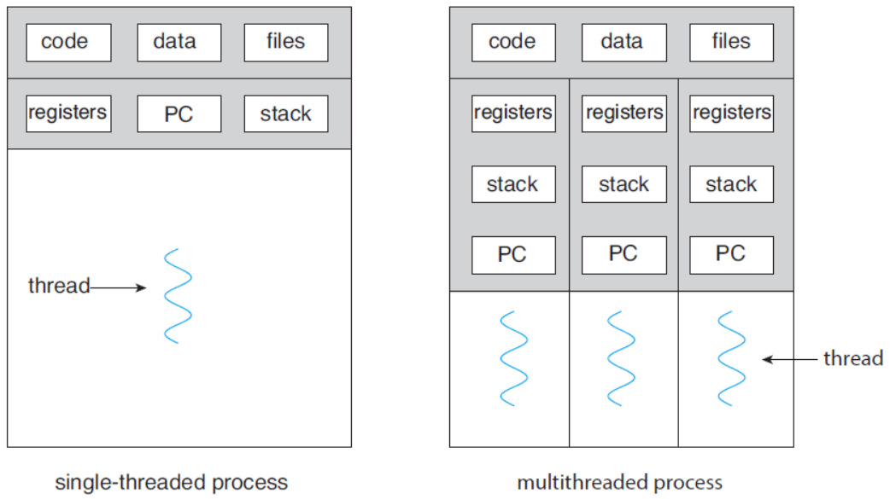
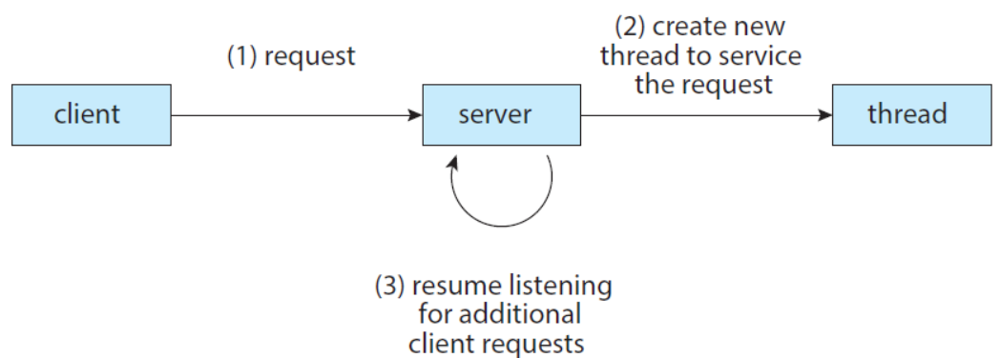
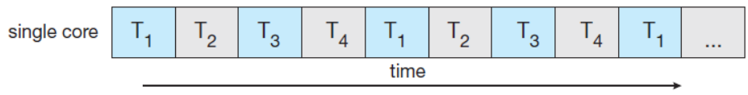
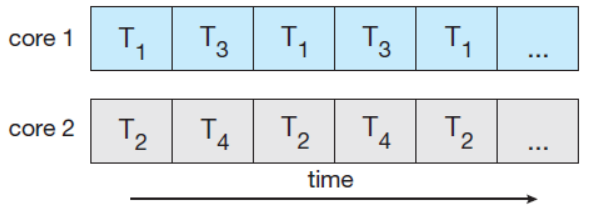
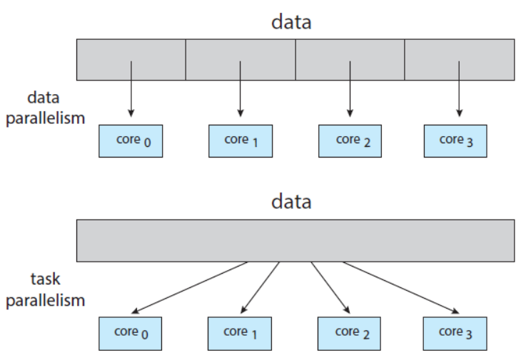
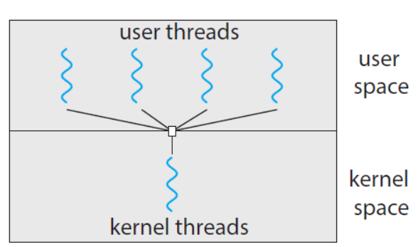
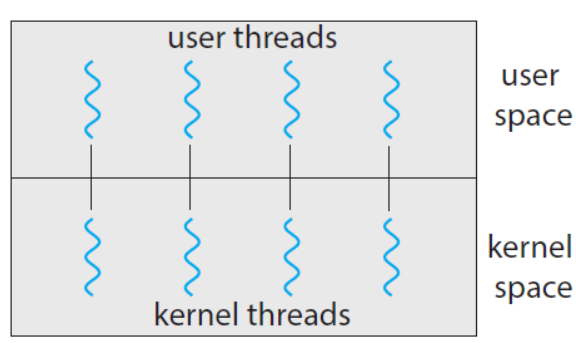
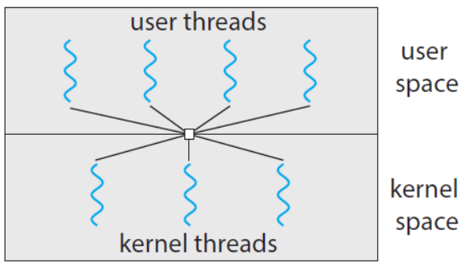

# Thread & Concurrency
## Overview
* *A process* is able to contain *multiple threads of control*.
* A **thread** is 
    * a lightweight process.
    * a basic unit of CPU utilization.
    * comprises a *thread ID*, a *program counter*, a *register set*, and a *stack*.

{: w="38.33%"}
*Single-threaded and multithreaded processes*

## Multithreading
* Let us consider the case of client-server system, e.g., a web server.

{: w="35%"}
*Multithread server architecture*

* The benefits of multithreaded programming:
    * **Responsiveness**: may allow continued execution if part of process is blocked, especially important for user interfaces.
    * **Resource Sharing**: threads share resources of process, easier than shared-memory or message-passing.
    * **Economy**: cheaper than process creation, thread switching lower overhead than context switching.
    * **Scalability**: process can take advantage of multiprocessor architectures

### Thread Library in Java
* In a Java program, threads are the fundamental model of program execution.
* Java provides a rich set of features for the creation and management of threads
* Three techniques for explicitly creating threads in Java.

* *Inheritance* from the Thread class
    * create a new class that is derived from the *Thread* class.
    * and override its *public void run()* method.

```java
class MyThread1 extends Thread {
    public void run() {
        try {
            while (true) {
                 System.out.println("Hello, Thread!");
                Thread.sleep(500);
            }
        }
        catch(InterruptedException ie) {
            System.out.println("I'm interrupted");
        }
    }
}

public class ThreadExample1 {
    public static final void main(String[] args) {
        MyThread1 thread = new MyThread1();
        thread.start();
        System.out.println("Hello, My Child!");
    }
}
```

* *Implementing* the Runnable interface.
    * define a new class that implements the *Runnable* interface.
    * and override its *public void run()* method.

```java
class MyThread2 implements Runnable {
    public void run() {
        try {
        while (true) {
            System.out.println("Hello, Runnable!");
            Thread.sleep(500);
            }
        }
        catch (InterruptedException ie) {
            System.out.println("I'm interrupted");
        }
    }
}

public class ThreadExample2 {
    public static final void main(String[] args) {
        Thread thread = new Thread(new MyThread2());
        thread.start();
        System.out.println("Hello, My Runnable Child!");
    }
}
```

* Using the *Lambda* expression (beginning with Java Version 1.8)
    * rather than defining a new class, 
    * use a *lambda expression of Runnable* instead.

```java
public class ThreadExample3 {
    public static final void main(String[] args) {
        Runnable task = () -> {
            try {
                while (true) {
                    System.out.println("Hello, Lambda Runnable!");
                    Thread.sleep(500);
                }
            }
            catch (InterruptedException ie) {
                System.out.println("I'm interrupted");
            }
        };
        Thread thread = new Thread(task);
        thread.start();
        System.out.println("Hello, My Lambda Child!");
    }
}
```

* Process의 wait에 대응되는 개념으로 join 사용 
* stop은 동기화 문제로 인해 사용하지 않고 대신 interrupt 사용

## Multicore Programming
* Multithreading in a multicore system is more efficient use of multiple cores for improved concurrency.
* Consider an application with four threads.
    * single-core: threads will be interleaved over time.
    * multiple-cores: some threads can run in parallel.

{: w="40%"}
*Concurrent execution on a single-core system*

{: w="33.33%"}
*Parallel execution on a multicore system*

* Programming Challenges in Multicore systems.
    * *Identifying tasks*: find areas can be divided into separate tasks.
    * *Balance*: ensure the tasks to perform equal work of equal value.
    * *Data splitting*: data also must be divided to run on separate cores.
    * *Data dependency*: ensure that the execution of tasks is synchronized to accommodate the data dependency
    * *Testing and debugging*: more difficult than single-thread.

### Types of parallelism
* 최근에는 분산 시스템의 발전으로 아래처럼 단순한 예시가 덜 의미있음

{: w="31.67%"}
*Data parallelism and task parallelism*

### [Amdahl’s Law](https://en.wikipedia.org/wiki/Amdahl%27s_law)
* $speedup <= \frac{1}{S +\frac{1 - S}{N}}$
    * S: the portion that must be performed serially on a system
    * N: the number of processing cores

## Multithreading Models
* Two types of threads: **user** threads and **kernel** threads
    * User threads are supported above the kernel, and are managed *without kernel support*. 
    * Kernel threads are supported and managed directly *by the operating system*.

* Three relationships between user and kernel threads
* Many-to-One Model

{: w="30.83%"}
*Many-to-one model*

* One-to-One Model

{: w="30.83%"}
*One-to-one model*

* Many-to-Many Model

{: w="30.83%"}
*Many-to-Many model*

## Thread Libraries
* A thread library provides an API for creating and managing threads.
* Three main thread libraries are in use today:
    * POSIX Pthreads
    * Windows thread
    * Java thread

### Pthreads
* Refers to the POSIX standard (IEEE 1003.1c)
* Just a *specification* for thread behavior, not an implementation

```
#include <stdio.h>
#include <stdlib.h>
#include <pthread.h>

/* the data shared by the threads */
int sum;
/* thread call this function */
void * runner(void *param);

int main(int argc, char *argv[])
{
    pthread_t tid; // thread identifier
    pthread_attr_t attr; // thread attributes

    pthread_attr_init(&attr);
    pthread_create(&tid, &attr, runner, argv[1]);
    pthread_join(tid, NULL);

    printf("sum = %d\n", sum);
}
void *runner(void *param)
{
    int i, upper = atoi(param);
    sum = 0;
    for (i = 0; i <= upper; i++)
        sum += i;
    pthread_exit(0);
}
```

```
#include <stdio.h>
#include <unistd.h>
#include <wait.h>
#include <pthread.h>

int value = 0;
void * runner(void *param);

int main(int argc, char *argv[])
{
    pid_t pid;
    pthread_t tid;
    pthread_attr_t attr;

    pid = fork();

    if (pid == 0) { // child process
        pthread_attr_init(&attr);
        pthread_create(&tid, &attr, runner, NULL);
        pthread_join(tid, NULL);
        printf("CHILD: value = %d\n", value); // LINE C
    }
    else if (pid > 0) { // parent process
        wait(NULL);
        printf("PARENT: value = %d\n", value); // LINE P
    }
}
void *runner(void *param)
{
    value = 5;
    pthread_exit(0);
}
```

## Implicit Threading
* The Strategy of **Implicit Threading**
    * The design of *concurrent* and *parallel* applications, i.e., the design of multithreading in multicore systems, is too difficult for application developers.
    * So, *transfer the difficulty* to compiler and run-time libraries.

* Four alternative approaches using implicit threading:
    * **Thread Pools**
        * create a number of threads in a pool where they await work.
    * **Fork & Join**
        * *explicit* threading, but an excellent candidate for *implicit* threading.
    * **OpenMP**
        * a set of compiler directives and an API for programs written in C/C++.
    * **Grand Central Dispatch (GCD)**
        * developed by Apple for its macOS and iOS operating system.

### OpenMP
* Identifies parallel regions as blocks of code that may run in parallel.
* Insert compiler directives into source code at parallel regions.
* these directives instruct OpenMP runtime library to execute the region in parallel.

```
#include <stdio.h>
#include <omp.h>

int main(int argc, char *argv[])
{
    #pragma omp parallel // compiler directive
    {
        printf("I am a parallel region.\n");
    }

    return 0;
}
```

```
#include <stdio.h>
#include <omp.h>

int main(int argc, char *argv[])
{
    omp_set_num_threads(4);

    #pragma omp parallel
    {
        printf("OpenMP thread: %d\n", omp_get_thread_num());
    }

    return 0;
}
```

```
#include <stdio.h>
#include <omp.h>

#define SIZE 100000000

int a[SIZE], b[SIZE], c[SIZE];

int main(int argc, char *argv[])
{
    int i;
    for (i = 0; i < SIZE; ++i)
        a[i] = b[i] = i;
    
    #pragma omp parallel for
    for (i = 0; i < SIZE; ++i) {
        c[i] = a[i] + b[i];
    }
        
    return 0;
}
```

