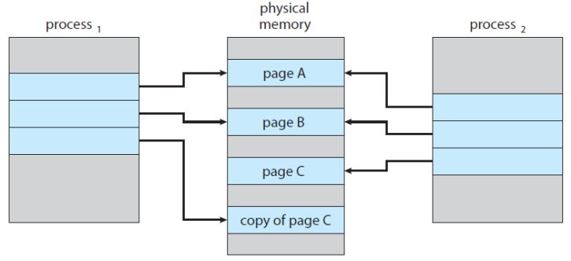

# Virtual Memory
## Background
* **Virtual Memory** is a technique to allow the execution of processes that are not completely in memory so, programs can be larger than physical memory.
* Abstracts main memory into an extremely large array of storage, separating logical memory from physical memory.
* Provides an efficient mechanism for sharing files and libraries and process creation.

{: w="30.83%"}
*Diagram showing virtual memory that is larger than physical memory*

* **Virtual Address Space** is the logical (or virtual) view of how a process is stored in memory.
* Typically, begins a certain logical address, to say, address 0, and exists in contiguous memory.

{: w="21.67%"}
*Virtual address space of a process in memory*

* Virtual Memory allows *files* and *memory* to be shared by two or more processes through **page sharing**.

{: w="29.17%"}
*Shared library using virtual memory*

## Demand Paging
* Consider how an executable program might be loaded from secondary storage into memory.
* One option is to load the entire program in physical memory.
* The **demand paging** is an alternative strategy to load pages only as they are needed.
    * commonly used in virtual memory systems.
* With *demand-paged virtual memory*, pages are loaded only when they are *demanded* during execution.

* Basic Concepts of the Demand Paging
    * While a process is executing, some pages will be *in memory* and some will be *in secondary storage*.
    * To distinguish between these two situations, the *valid-invalid bit* scheme can be used.
        * *valid*: the page is both legal and in memory.
        * *invalid*: the either is not valid or currently in secondary storage.

{: w="30.83%"}
*Page table when some pages are not in main memory*

* The procedure for handling the **Page Fault**:
    1. *Check an internal table* for the process to determine whether the reference was *valid or invalid* memory access.
    2. If the reference was valid, terminate the process, or valid but page fault, we now *page it in*.
    3. Find a *free frame* (by taking one from the free-frame list)
    4. Schedule a secondary storage operation to *read the desired page* into the newly allocated frame.
    5. When the storage read is complete, *modify the internal table* and the page table to indicate that the page is now in memory.
    6. *Restart the instruction* that was interrupted by the trap.

{: w="30%"}
*Steps in handling a page fault*

### Pure Demand Paging
* *Never bring a page* into memory until it is required.
* With the scheme of pure demand paging, we can start executing a process with *no pages* in memory.
* When the OS sets the instruction pointer to the *first instruction* of the process with a *page fault*, the page of the process would be paged in.

### Locality of Reference
* If a program accesses several new pages with each instruction, to say, one page for the instruction and many pages for data,  possibly causes multiple page faults per instruction.
* Fortunately, analysis running processes show that this behavior is exceedingly unlikely.
* Programs tend to have the **locality of reference**, which results in *reasonable performance* from demand paging.

* An Example of Program Structure
    * Let the page size to be 128 and an array to be 128 × 128, then compare the following two codes.
    * Careful selection of data structures and programming structures can increase the **locality of code or data** hence, *lower the page-fault rate* and *enhance the system performance*.
    * 이론상, 2의 pagefault가 훨씬 적게 일어남

```
// 1
int i, j;
int[128][128] data;

for (j = 0; j < 128; ++j)
    for (i = 0; i < 128; ++i)
        data[i][j] = 0;

// 2
int i, j;
int[128][128] data;

for (i = 0; i < 128; ++i)
    for (j = 0; j < 128; ++j)
        data[i][j] = 0;
```

### Hardware Support to Demand Paging
* *Page table*  has the ability to mark valid or invalid. (with a valid-invalid bit)
* *Secondary memory* (=**swap space**) holds those pages that are not present in main memory.
    * usually a high-speed disk or NVM device

### Instruction Restart
* A crucial requirement for demand paging.
    * The ability to restart any instruction after page fault.
* When the page fault occurs, the state of interrupted process (registers, condition code, instruction counter, etc.) is saved.
* Therefore, *restart* the process in *exactly the same place and state*.
* If a page fault occurs *on the instruction fetch*, restart by fetching the instruction again.
* If a page fault occurs while we are *fetching an operand*, fetch and decode the instruction again and then fetch the operand.

* As a worst-case example
    * ADD A, B, C; three address instruction, adding A and B into C.
        1. Fetch and decode the instruction (ADD)
        2. Fetch A
        3. Fetch B
        4. ADD A and B
        5. Store the sum in C

### Free Frame List
* When a page fault occurs, OS must bring the desired page from secondary storage into memory.
* To resolve page faults, OS maintains the **free frame list**: a pool of free frames for satisfying such requests.
* Free frames must also be allocated when the stack or heap segments from a process expand.

{: w="26.67%"}
*List of free frames*

### Performance of Demand Paging
* How to compute the *effective access time* for a *demand-paged* memory?
* Let *ma* to denote the *memory-access time*.
* Let *p* be the *probability of a page fault*.
    * EAT = 1 − 𝑝 × 𝑚𝑎 + 𝑝 ∗ (𝑝𝑎𝑔𝑒 𝑓𝑎𝑢𝑙𝑡 𝑡𝑖𝑚𝑒).
* How much time is needed to service a page fault?
    * three major activities:
        * Service the page-fault interrupt.
        * Read in the page.
        * Restart the process

* Consider a system with an average page-fault service time of 8 milliseconds
    * and a memory access time of 200 nanoseconds, 
    * EAT = (1 − 𝑝) × 200 + 𝑝 × 8,000,000 = 200 + 7,999,800 × 𝑝
* If one access out of 1,000 causes a page fault (𝑝 = 0.001), 
    * EAT = 200 + 7999.8 = 8199.8 nanoseconds ≅ 8.2 microseconds

## Copy-on-Write
* *Copy* a shared page *only when* a process *writes* to a shared page.
* Recall the process creation with **fork()** and **exec()**.

{: w="29.17%"}
*Before process 1 modifies page C*

{: w="29.17%"}
*After process 1 modifies page C*

## Page Replacement
* What happens if there is *no free frames*?
    * If we increase our degree of multiprogramming, we are over-allocating memory.
    * If we have 40 frames and run 6 processes, each of which is 10 pages in size, but actually uses only 5 pages.
        * Then, we manage to demand-paged system with 10 frames spared.
    * However, what if the processes suddenly want to use all 10 pages, or need a huge buffer consuming more pages than available ones?

{: w="35%"}
*Need for page replacement*

* **Page Replacement**
    * If no frame is free, find one that is not currently being used and free it.
    * Free a frame by writing its contents to swap space and changing the page table to indicate that the page is no longer in memory (invalid or dirty).
    * Now, use the freed frame to hold page for which the process faulted.

{: w="30%"}
*Page replacement*

* Page Fault Service Routine includes Page Replacement
    1. Find the location of the desired page on secondary storage.
    2. Find *a free frame*.
        * If there is a free frame, use it.
        * If there is no free frame, use a *page-replacement algorithm* to select *a victim frame*.
        * Write the victim frame to secondary storage; change the page and frame tables accordingly.
    * Read the desired page into the *newly freed frame* change the page and frame tables.
    * Continue the process from where the *page fault occurred*.

* Two major problems to implement demand paging
    * **Frame-allocation algorithm**: how many frames to allocated to each process?
    * **Page-replacement algorithm**: select the frames that are to be replaced.
    * Since the secondary storage I/O is *so expensive*, even *slight improvements* in demand-paging methods can yield *large gains* in system performance.

### Evaluation of Page Replacement Algorithms
* *reference string*: a string of memory references.
* Evaluate an algorithm by running it on a reference string and computes *the number of page faults*. (**minimize it!**)
* What about the number of page frames?
    * Obviously, the more frames, the less page faults.

{: w="27.5%"}
*Graph of page faults versus number of frames*

* An example to evaluate algorithms:
    * reference string: 7 0 1 2 0 3 0 4 2 3 0 3 0 3 2 1 2 0 1 7 0 1 in a memory with *three* frames.
    * 2가 도착했을 때, 7 0 1 중에 누구와 교체할 것 인가?

{: w="27.5%"}

### FIFO Page Replacement
* FIFO: First-In-First-Out: the simplest algorithm.
* Choose **the oldest page** when a page must be replaced.
* There are 15 page faults with our example.

{: w="29.17%"}
*FIFO page-replacement algorithm*

### Belady’s Anomaly
* The page-fault rate **may increase** as *the number of allocated frames* **increases**.
    * e.g. • reference string: 1 2 3 4 1 2 5 1 2 3 4 5

{: w="28.33%"}
*Page-fault curve of FIFO replacement on a reference string*

### Optimal Page Replacement
* Seeking for an optimal algorithm that has the *lowest page-fault rate, and *never suffers from* Belady’s anomaly.
* **OPT** or MIN: replace the page that *will not be used* for the *longest period of time*.
* OPT will guarantee the lowest possible page-fault rate.

* The difficulty of implementing OPT
    * There are 9 page faults with our example.
    * OPT requires *future knowledge* of the reference string.
        * used mainly for comparison studies.

{: w="29.17%"}
*Optimal page-replacement algorithm*

### LRU Page Replacement
* Recall the Shortest-Job-First CPU scheduler.
    * The key distinction between the FIFO and the OPT: 
        * looking *backward*: when a page was brought in?
        * looking *forward*: when a page to be used?
    * If we use the recent past as an *approximation* of the *near future*, then we can replace the page that has *not been used* for the *longest period of time*.

* **LRU**: Least Recently Used
* Associates with each page the time of that page’s *last use*, and choose the page that has *not been used* for the *longest period* of time.
* Locality of reference 관점에서 보면, 합리적일 수 있는 방법.
* There are 12 page faults with our example.

{: w="29.17%"}
*LRU page-replacement algorithm*

* LRU policy is considered to be good and is often used.
* However, the problem to solve for the implementation of LRU is to determine an order for the frames defined by the time of last use?
* It may require substantial hardware assistance.
    * Two implementations are possible: *counter* and *stack*.
* LRU does not suffer from Belady’s anomaly like OPT.

* Two implementation methods for the LRU
    * **Counter** implementation
        * Whenever a page is referenced, copy the counter (or the clock).
        * Replace the page with the smallest value.
    * **Stack** implementation:
        * Keep a stack of page numbers.
        * Note that entries must be removed from the middle of the stack.

{: w="26.67%"}
*Use of a stack to record the most recent page reference*

* LRU-Approximation
    * LRU needs hardware support, however, many systems provide some help with a reference bit.
    * **reference bit**: initially 0, a bit associated with each page.
        * when a page is referenced, set to 1.
        * replace any with reference bit = 0 (if any).

###  Second-Chance Algorithm
* Use a FIFO replacement algorithm.
* However, inspect its reference bit, when a page has been selected.
    * If the value is 0, proceed to replace it.
    * If the value is 1, give the page a second change and move on to select the next FIFO page.
* When a page gets a second chance, its reference bit is cleared, and its arrival time is reset to the current time.

{: w="27.5%"}
*Second-chance (clock) page-replacement algorithm*

## Allocation of Frames
* The Issues for Frame Allocation
    * Consider a simple case of a system with 128 frames.
        * OS may take 35, leaving 93 frames for the user process.
    * Using the *pure-demand-paging*, 93 frames would be put on the free-frame list.
    * The first 93 page faults would get free frames.
        * 94th page faults would cause a page replacement.
    * Then, if we have two processes, how do we allocate 93 frames to these two processes?
* The strategies for frame allocation
    * Equal .vs. Proportional
        * **equal allocation**: give every process an equal share.
        * **proportional allocation**: allocate according to the size of process.
    * Global .vs. Local:
        * **local replacement**: selects from only its own set of allocated frames.
        * **global replacement**: selects a replacement frame from the set of all the frames in the system.

## Thrashing
* **Thrashing** is a situation that a process is busy swapping pages in and out.
* If a process *does not have enough pages*, the page-fault rate is very high.

{: w="27.5%"}
*Thrashing*

### Working-Set Model
* Based on the assumption of locality.
* Define the **working-set window** with a parameter $\Delta$.
* The idea is to examine the most recent $\Delta$ page references.
    * **working-set**: the set of pages in the most recent $\Delta$ page references.
* If a page is in active use, it will be in the working set.
* If it is no longer being used, it will drop from the working set time units after its last reference.

{: w="25.83%"}
*Locality in a memory-reference pattern*

{: w="28.33%"}
*Working-set model*

