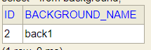
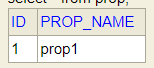
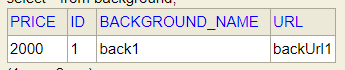
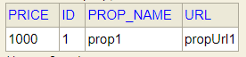

# Annotation @Inheritance와 @MappedSuperClass
## Overview
### ERD
{: w="380" h = "300"}

### 의문점
* @Inheritance(strategy=JOINED)와 @MappedSuperClass를 사용했을 때, 각각에 대해
    * 물리적인 테이블이 어떻게 생성되는가?
    * Member 엔티티에서 연관관계에 있는 Background, Prop 엔티티 객체를 어떻게 가져올 수 있는가?

## @Inheritance(strategy=JOINED)의 테이블 생성
### Entity Code

```java
package com.example.jpatest.entity;

import jakarta.persistence.*;

import static jakarta.persistence.DiscriminatorType.STRING;
import static jakarta.persistence.InheritanceType.JOINED;

@Entity
@Inheritance(strategy=JOINED) // 디폴트는 SINGLE_TABLE.
@DiscriminatorColumn(discriminatorType=STRING, name="item_type") // 디폴트는 DTYPE
public class Item {
  @Id
  @GeneratedValue
  private Long id;
  private String url;
  private Integer price;
}
```

```java
package com.example.jpatest.entity;

import jakarta.persistence.DiscriminatorValue;
import jakarta.persistence.Entity;

@Entity
@DiscriminatorValue("prop")
public class Prop extends Item{
  private String propName;
}
```

```java
package com.example.jpatest.entity;

import jakarta.persistence.DiscriminatorValue;
import jakarta.persistence.Entity;

@Entity
@DiscriminatorValue("Background")
public class Background extends Item{
  private String backgroundName;
}
```

### 생성된 테이블 및 데이터
* 테이블

    {: w="280" h = "320"}

    * 자식 엔티티 타입을 구분하기 위한 컬럼(이 경우 ITEM_TYPE)이 부모 테이블에 생성됨
    * 자식 엔티티가 개별적으로 가지는 컬럼은, 각 자식 테이블에 별도로 생성됨
    * 디폴트 상속 전략(SINGLE_TABLE)일 경우, ITEM 테이블 하나만 생성됨
        * ITEM 테이블에 PROP_NAME, BACKGROUND_NAME 컬럼이 추가됨

* 테이블 별 데이터
    * ITEM 테이블
    
    {: w="310" h = "270"}
    
    * BACKGROUND 테이블
    
    {: w="300" h = "250"}
    
    * PROP 테이블
    
    {: w="300" h = "250"}
    
    * 자식 테이블은 부모 테이블의 PK를 FK로 들고 있음

## @MappedSuperClass의 테이블 생성
### Entity Code
```java
package com.example.jpatest.entity;

import jakarta.persistence.GeneratedValue;
import jakarta.persistence.Id;
import jakarta.persistence.MappedSuperclass;
import lombok.Data;

@MappedSuperclass
@Data
public class Item {
  @Id
  @GeneratedValue
  private Long id;
  private String url;
  private Integer price;
}
```

```java
package com.example.jpatest.entity;

import jakarta.persistence.Entity;
import lombok.Data;

@Entity
@Data
public class Background extends Item{
  private String backgroundName;
}
```

```java
package com.example.jpatest.entity;

import jakarta.persistence.Entity;
import lombok.Data;

@Entity
@Data
public class Prop extends Item{
  private String propName;
}
```

### 생성된 테이블 및 데이터
* 테이블

    {: w="280" h = "320"}

    * 부모 클래스의 모든 컬럼을 가지고 자식 테이블이 각각 생성 됨

* 테이블 별 데이터
    * BACKGROUND 테이블
    
    {: w="340" h = "250"}

    * PROP 테이블
    
    {: w="330" h = "250"}
    
    * 데이터가 각각 생성돼서 들어감

## @Inheritance(strategy=JOINED)에서 연관 관계인 엔티티 객체 가져오기
### Example Code
```java
package com.example.jpatest.entity;

import jakarta.persistence.*;
import lombok.Data;

import java.util.ArrayList;
import java.util.List;

@Entity
@Data
public class Member {
  @Id
  @GeneratedValue
  private Long id;
  private String nickName;
  private int point;

  @OneToMany(fetch = FetchType.LAZY)
  List<Item> items = new ArrayList<>();

  public void addItem(Item item) {
    this.items.add(item);
  }
}
```

### entityManager
```java
  public void getProps(){
    Member member = entityManager.find(Member.class, 1L);

    List<Item> items = member.getItems(); // Background 엔티티와 Prop 엔티티를 전부 가져옴
    List<?> result = items.stream().filter(item -> item instanceof Prop).toList(); // Prop 엔티티만 필터링 가능
  }
```

### JpaRepository
```java
// Item.java
@Entity
@Inheritance(strategy=JOINED) // 디폴트는 JOINED
@DiscriminatorColumn(discriminatorType=STRING, name="item_type") // 디폴트는 DTYPE
@Data
public class Item {
  @Id
  @GeneratedValue
  private Long id;
  private String url;
  private Integer price;

  @ManyToOne(fetch = FetchType.LAZY)
  Member member; // Member가 Item과 연관관계가 걸려 있으므로, 부모 엔티티에서 연관관계를 설정해줘야 함
}

...

  public void getgetProps(){
    Member member = memberRepository.findById(1L).get();
    
    List<?> result1 = member.getItems().stream().filter(item -> item instanceof Prop).toList(); // Prop 타입으로 캐스팅하면 자식 엔티티의 필드에 접근 가능
    
    List<Prop> result2 = propRepository.findAllByMember(member); // 양방향 연관 관계여야 함

    List<Item> result3 = itemRepository.findAllByMember(member); // 부모 엔티티 객체로 가져와 자식 엔티티의 필드를 직접 가져올 수 없음
  }
```

## @MappedSuperClass에서 연관 관계인 엔티티 객체 가져오기
### Example Code
```java
package com.example.jpatest.entity;

import jakarta.persistence.*;

import java.util.ArrayList;
import java.util.List;

@Entity
public class Member {
  @Id
  @GeneratedValue
  private Long id;
  private String nickName;
  private int point;

//  @OneToMany(fetch = FetchType.LAZY)
//  List<Item> items = new ArrayList<>();  // 에러발생 'One To Many' attribute value type should not be 'Mapped Superclass'

  @OneToMany(fetch = FetchType.LAZY)
  List<Background> backgrounds = new ArrayList<>();

  @OneToMany(fetch = FetchType.LAZY)
  List<Prop> props = new ArrayList<>();
}
```

### entityManager
```java
  public void getgetProps(){
    Member member = entityManager.find(Member.class, 1L);

    List<Prop> props = member.getProps();
  }
```

### JpaRepository
```java
  public void getProps(){
    Member member = memberRepository.findById(1L).get();

    List<Prop> props = member.getProps();

    // 양방향 연관 관계를 설정하면, 위의 예시와 비슷한 방법으로 객체를 불러올 수 있음
}  
```

## See Also
* [Mapping entity inheritance hierarchies](https://docs.jboss.org/hibernate/orm/6.4/introduction/html_single/Hibernate_Introduction.html#mapping-inheritance)
* [Types and typecasts](https://docs.jboss.org/hibernate/orm/6.4/querylanguage/html_single/Hibernate_Query_Language.html#function-treat)