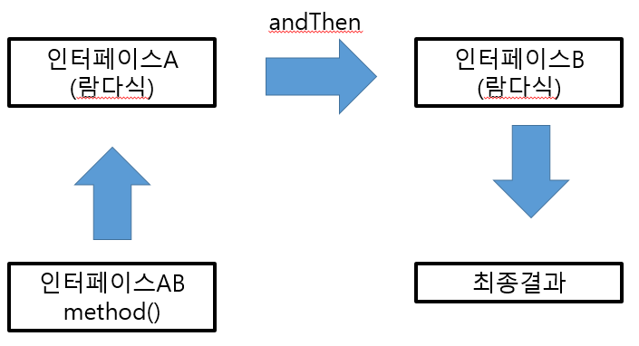
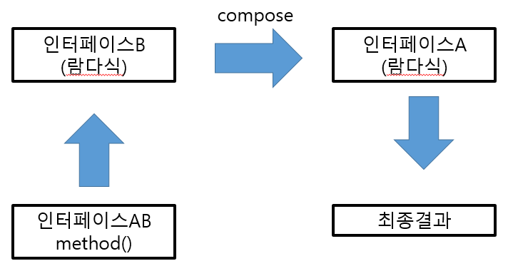

# Functional Interface
## 표준 API의 함수형 인터페이스
- 자바에서 제공하는 표준 API에서 한 개의 추상 메소드를 가지는 인터페이스들은 모두 람다식을 이용 가능
- 빈번하게 사용되는 함수형 인터페이스는 java.util.funtion 표준 API 패키지로 제공
- [JavaDoc](https://docs.oracle.com/en/java/javase/17/docs/api/java.base/java/util/function/package-summary.htmlS)

<table>
  <tr>
    <th>종류</th>
    <th>추상 메소드의 특징</th>
  </tr>
  <tr>
    <td>Consumer</td>
    <td>매개값은 있고, 리턴값은 없음</td>
  </tr>
  <tr>
    <td>Supplier</td>
    <td>매개값은 없고, 리턴값은 있음</td>
  </tr>
  <tr>
    <td>Function</td>
    <td>
      <p>매개값도 있고, 리턴값도 있음</p>
      <p>주로 매개값을 리턴값으로 매핑(타입 변환)</p>
    </td>
  </tr>
  <tr>
    <td>Operator</td>
    <td>
      <p>매개값도 있고, 리턴값도 있음</p>
      <p>주로 매개값을 연산하고 결과를 리턴</p>
    </td>
  </tr>
  <tr>
    <td>Predicate</td>
    <td>
      <p>매개값도 있고, 리턴타입은 boolean</p>
      <p>매개값을 조사하고 true/false를 리턴</p>
    </td>
  </tr>
</table>

## Consumer

- 리턴값이 없는 accept() 메소드만 존재
  - 매개값을 사용할 뿐 리턴이 없음: 소비라고 표현하기도 함
- Consumer&lt;T&gt;, BiConsumer<T, U>, DoubleConsumer, IntConsumer, LongConsumer, ObjDoubleConsumer&lt;T&gt;, ObjIntConsumer&lt;T&gt;, ObjLongConsumer&lt;T&gt; 가 있음

```java
public class Example {
  public static void main(String[] args) {
    Consumer<String> consumer = t -> System.out.println(t);
    consumer.accept("test");

    BiConsumer<String, String> biConsumer = (t, u) -> System.out.println(t + u);
    biConsumer.accept("te", "st");

    DoubleConsumer doubleConsumer = d -> System.out.println(d);
    doubleConsumer(3.2);

    ObjIntConsumer<String> objIntConsumer = (t, i) -> System.out.println(t + i);
    objIntConsumer("test", 1);
  }
}
```

## Supplier

- 매개 변수가 없고 리턴값이 있는 getXXX() 메소드가 존재
- Supplier&lt;div&gt;, BooleanSupplier, DoubleSupplier, IntSupplier, LongSupplier 가 있음

```java
public class Example {
  public static void main(String[] args) {
    IntSupplier intSupplier = () -> {
      return (int) (Math.random * 100) + 1;
    };

    System.out.println(intSupplier.getAsInt());
  }
}
```

## Function

- 매개값과 리턴값이 있는 applyXXX() 메소드가 존재
  - 매개값을 리턴값으로 매핑하는 역할
- Function<T, R>, BiFunction<T, U, R>, DoubleFunction&lt;R&gt;, IntFunction<&lt;R&gt;, IntToDoubleFunction, IntToLongFunction, LongToDoubleFunction, LongToIntFunction, ToDoubleBiFunction<T, U>, ToDoubleFunction&lt;T&gt;, ToIntBiFunction<T, U>, ToIntFunction&lt;T&gt;, ToLongBiFunction<T, U>, ToLongFunction&lt;T&gt; 가 있음

```java
public class Member {
  private int id;
  private String name;

  public Member(int id, String name) {
    this.id = id;
    this.name = name;
  }

  public int getId() { return id };
  public String getName() { return name };
}

public class Example1 {
  private static List<Member> members = Arrays.asList(new Member(1, "m1"), new Member(2, "m2"));

  public static void printString( Function<Member, String> function ) {
    for(Member member : members) {
      System.out.println(function.apply(member));
    }
  }

  public static int printInt( ToIntFunction<Member> function ) {
    for(Member member : members) {
      System.out.println(fuction.applyAsInt(member));
    }
  }

  public static void main(String[] args) {
    printString(t -> t.getName());
    printInt(t -> t.getId());
  }
}
```

```java
public class Member {
  private int id;
  private String name;

  public Member(int id, String name) {
    this.id = id;
    this.name = name;
  }

  public int getId() { return id };
  public String getName() { return name };
}

public class Example2 {
  private static List<Member> members = Arrays.asList(new Member(1, "m1"), new Member(2, "m2"));

  public static int sum(ToIntFunction<Member> function) {
    int sum = 0;

    for(Member member : members) {
      sum += funtion.applyAsInt(member);
    }

    return sum;
  }

  public static void main(String[] args) {
    printString(t -> t.getId());
  }
}
```

## Operator

- 매개값과 리턴값이 있는 applyXXX() 메소드가 존재
  - 매개값을 이용해 연산을 수행한 후, 동일한 타입으로 리턴
- BinaryOperator&lt;T&gt;, UnaryOperator&lt;T&gt;, DoubleBinaryOperator, DoubleUnaryOperator, IntBinaryOperator, IntUnaryOperator, LongBinaryOperator, LongUnaryOperator 가 있음

```java
public class Example {
  private static int[] list = { 10, 20, 30 };

  public static int maxOrMin( IntBinaryOperator operator ) {
    int result = list[0];
    for(int i : list) {
      result = operator.applyAsInt(result, i);
    }

    return result;
  }

  public static void main(String[] args) {
    System.out.println(maxOrMin((a, b) -> Math.max(a, b)));
    System.out.println(maxOrMin((a, b) -> Math.min(a, b)));
  }

}
```

## Predicate

- 매개값과 boolean 리턴값이 있는 testXXX() 메소드가 존재
  - 매개값을 조사해 true/false 리턴
- Predicate&lt;T&gt;, BiPredicate<T, U>, DoublePredicate, IntPredicate, LongPredicate 가 있음

```java
public class Member {
  private String name;
  private int score;
  private String gender;

  public Member(String name, int score, String gender) {
    this.name = name;
    this.score = score;
    this.gender = gender;
  }

  public String getName() {
    return name;
  }

  public int score() {
    return score
  }

  public String getGender() {
    return gender;
  }
}

public class Example {
  private static List<Member> members = Arrays.asList(
    new Member("m1", 20, "male"),
    new Member("m2", 16, "female"),
    new Member("m3", 47, "male"),
    new Member("m4", 61, "female")
  );

  public static double avg( Predicate<Membber> predicate) {
    int count = 0, sum = 0;

    for(Member member : members) {
      if(predicate.test(member)) {
        ++count;
        sum += member.getScore();
      }
    }

    return (double) sum / count;
  }

  public static void main(String[] args) {
    System.out.println(avg(t -> t.getGender().eqauls("male")));
    System.out.println(avg(t -> t.getGender().eqauls("female")));
  }
}
```

## andThen()과 compose() 디폴트 메소드
* 디폴트 및 static 메소드는 추상 메소드가 아님
  * 함수형 인터페이스에 선언되어도 함수형 인터페이스의 성질을 유지함
* andThen과 compose는 두 개의 함수형 인터페이스를 순차적으로 연결
  * 첫 번째 처리 결과를 두 번째 매개값으로 제공해 최종 결과값을 얻음
* andThen과 compose의 차이점은 어떤 함수형 인터페이스부터 처리하느냐

```java
InterfaceAB interfaceAB = interfaceA.andThen(interfaceB);
intrefaceAB.method();
```
{: w="330" h = "300"}
*andThen*

* andThen의 경우 interfaceAB의 method를 호출하면
  * interfaceA를 처리하고 그 결과를 interfaceB의 매개값으로 제공
  * interfaceB에서 최종 결과를 리턴

```java
InterfaceAB interfaceAB = interfaceA.compose(interfaceB);
intrefaceAB.method();
```

{: w="330" h = "300"}
*compose*


* compose의 경우 interfaceAB의 method를 호출하면
  * interfaceB를 처리하고 그 결과를 interfaceA의 매개값으로 제공
  * interfaceA에서 최종 결과를 리턴

### Consumer의 순차적 연결
* Consumer는 처리 결과를 리턴하지 않음
  * andThen()은 함수형 인터페이스의 호출 순서만 정함

```java
public class Member {
  private int id;
  private String name;
  private Address address;

  public Member(int id, String name, Address address) {
    this.id = id;
    this.name = name;
    this.address = address;
  }

  public int getId() { return id; }
  public String getName() { return name; }
  public Address getAddress() { return addresss };
}

public class Address {
  private String country;
  private String city;

  public Address(String country, String) {
    this.country = country;
    this.city = city;
  }

  public String getCountry() { return country; }
  public String getCity() { return city; }
}

public class Example {
  public static void main(String[] args) {
    Consumer<Member> consumerA = m -> System.out.println(m.getName());
    Consumer<Member> consumerB = m -> System.out.println(m.getId());

    Consumer<Member> consumerAB = consumerA.andThen(consumerB);
    consumerAB.accept(new Member(1, "member", null));
  }
}
```

### Function의 순차적 연결
* Function과 Operator 종류의 함수형 인터페이스는 먼저 실행한 함수형 인터페이스의 결과를 다음 함수형 인터페이스의 매개값으로 넘겨줌

```java
public class Example {
  public static void main(String[] args) {
    Function<Member, Address> functionA;
    Function<Address, String> functionB;
    Function<Member, String> functionAB;

    functionA = m -> m.getAddress();
    functionB = a -> a.getCity();

    functionAB = functionA.andThen(functionB);
    System.out.println(functionAB.apply(new Member(1, "member", new Address("korea", "seoul"))));

    functionAB = functionB.compose(functionA);
    System.out.println(functionAB.apply(new Member(1, "member", new Address("korea", "seoul"))));
  }
}
```

## and(), or(), negate() 디폴트 메소드와 isEqual() static 메소드
* Predicate 종류의 함수형 인터페이스는 and(), or(), negate() 디폴트 메소드를 가지고 있음
  * 논리연산자 &&, ||, ! 과 대응

```java
public class Example {
  public static void main(String[] args) {
    IntPredicate predicateA = a -> a & 2 == 0;
    IntPredicate predicateB = b -> b & 3 == 0;

    IntPredicate predicateAB;
    predicateAB = predicateA.and(predicateB);
    System.out.println(predicateAB.test(9));

    predicateAB = predicateA.or(predicateB);
    System.out.println(predicateAB.test(9));

    predicateAB = predicateA.negate();
    System.out.println(predicateAB.test(9));
  }
}
```

* Predicate&lt;T&gt;는 isEqual() static 메소드도 제공
  * test() 매개값인 sourceObject와 isEqual()의 매개값인 targetObject를 java.util.Objects 클래스의 equals()의 매개값으로 제공
  * Objects.equals(sourceObject, targetObject)의 리턴값을 얻어 새로운 Predicate&lt;T&gt;를 생성

  ```java
  public class Example {
    Predicate<String> predicate;

    predicate = Predicate.isEqual(null);
    System.out.println(predicate.test(null)); // true

    predicate = Predicate.isEqual("test");
    System.out.println(predicate.test(null)); // false

    predicate = Predicate.isEqual(null);
    System.out.println(predicate.test("test")); // false

    predicate = Predicate.isEqual("test");
    System.out.println(predicate.test("test")); // true

    predicate = Predicate.isEqual("not test");
    System.out.println(predicate.test("test")); // false
  }
  ```

  ## minBy(), maxBy() static 메소드
  * BinaryOperator&lt;T&gt; 함수형 인터페이스는 minBy(), maxBy() static 메소드 제공
    * 매개값으로 제공되는 Comparator를 이용해서 최대, 최소 T를 얻는 BinaryOperator&lt;T&gt;를 제공
  
  ```java
  public class Item {
    private String name;
    private int price;

    public Item(String name, int price) {
      this.name = name;
      this.price = price;
    }

    public String getName() {
      return name;
    }
    public int getPrice() {
      return price;
    }
  }

  public class Example {
    public static void main(String[] args) {
      BinaryOperator<Item> binaryOperator;

      binaryOperator = BinaryOperator.minBy((i1, i2) -> Integer.compare(i1.price, i2.price));
      System.out.println(binaryOperator.apply(new Item("i1", 100), new Item("i2", 200)).getPrice());

      binaryOperator = BinaryOperator.maxBy((i1, i2) -> Integer.compare(i1.price, i2.price));
      System.out.println(binaryOperator.apply(new Item("i1", 100), new Item("i2", 200)).getPrice());
    }
  }
  ```

## 메소드 참조(Method Reference)
* 메소드를 참조해 매개 변수의 정보 및 리턴 타입을 알아내어, 람다에서 불필요한 매개 변수를 제거할 수 있음

### 예시
* 두 개의 수를 받아 큰 수를 반환하는 람다식의 경우, 단순히 두 개의 값을 받아 Math.max()에 전달하는 역할
  * 참조를 활용해 개선할 수 있음
* 메소드 참조도 인터페이스의 익명 구현 객체로 생성
  * 타겟 타입인 인터페이스의 추상 메소드가 어떤 매개 변수를 가지고 리턴 타입이 무엇인가에 따라 달라짐

```java
(n1, n2) -> Math.max(n1, n2);

// 위와 같음
Math::max

// IntBinaryOperator 는 두 개의 int 값을 받아 int를 리턴하므로 Math::max 메소드 참조 대입 가능
IntBinaryOperator operator = (n1, n2) -> Math.max(n1, n2);

IntBinaryOperator operator = Math::max // 위와 같음
```

### static 메소드와 인스턴스 메소드 참조
* static 메소드를 참조할 경우, 클래스 이름 뒤에 :: 기호를 붙이고 static 메소드 이름을 적음
* 인스턴스 메소드를 참조할 경우, 객체를 생성한 다음 참조 변수 뒤에 :: 기호를 붙이고 인스턴스 메소드 이름을 기술

```java
public class Calculator {
  public static int sum(int x, int y) {
    return x + y;
  }

  public int multiply(int x, int y) {
    return x * y;
  }
}

public class Example {
  public static void main(String[] args) {
    IntBinaryOperator operator;

    operator = (x, y) -> Calculrator.sum(x, y);
    System.out.println(operator.applyAsInt(2, 4));

    operator = Calculator::sum;
    System.out.println(operator.applyAsInt(3, 4));

    Calculator calculator = new Calculator();

    operator = (x, y) -> calculator.multiply(x, y);
    System.out.println(operator.applyAsInt(2, 4));

    operator = calculator::multiply;
    System.out.println(operator.applyAsInt(2, 4));
  }
}
```

### 매개 변수의 메소드 참조
* a 매개 변수의 메소드를 호출해 b를 메소드의 인자로 넘겨주는 경우
  * a의 클래스 이름 뒤에 :: 기호를 붙이고 메소드 이름을 기술

```java
public class Example {
  public static void main(String[] args) {
    ToIntBinaryFunction<String, String> function;

    function = (a, b) -> a.compareToIgnoreCase(b);
    System.out.println(function.applyAsInt("test", "TEST")); // 0

    function = String::compareToIgnoreCase;
    System.out.println(function.applyAsInt("test", "TEST")); // 0
  }
}
```

### 생성자 참조
* 메소드 참조에는 생성자 참조도 포함됨
  * 클래스 이름 뒤에 :: 기호를 붙이고 new 연산자를 기술
  * 생성자가 오버로딩되어 여러 개 있을 경우, 컴파일러는 함수형 인터페이스의 추상 메소드와 동일한 매개 변수 타입과 개수를 가지고 있는 생성자를 찾아 실행
    * 없으면, 컴파일 오류

```java
public class Member {
  private String id;
  private String name;

  public Member() {
    System.out.println("Member()");
  }

  public Member(String id) {
    System.out.println("Member(String)");
    
    this.id = id;
  }

  public Member(String id, String name) {
    System.out.println("Member(String, String)");

    this.id = id;
    this.name = name;
  }

  public String getId() {
    return id;
  }
}

public class Example {
  public static void main(String[] args) {
    Function<String, Member> function1 = Member::new;
    Member member1 = function1.apply("m1");

    BiFunction<String, String, Member> function2 = Member::new;
    Member member2 = function2.apply("m2", "test");
  }
}
```
