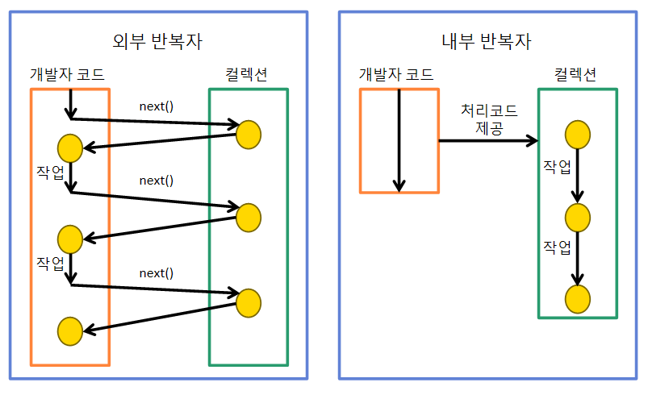
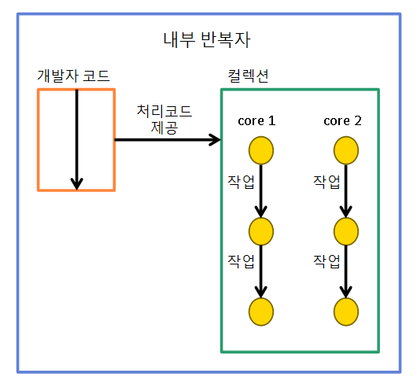
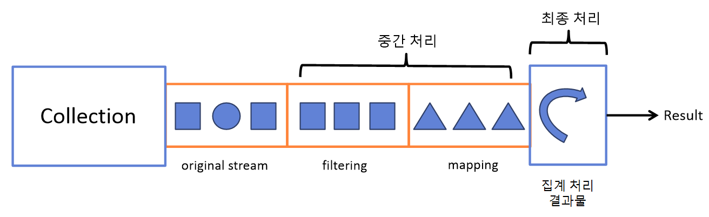

# 스트림 소개와 파이프라인
## 스트림 소개
- 자바 8에서 추가된 컬렉션의 저장 요소를 하나씩 참조해 람다식으로 처리할 수 있도록 해주는 반복자
- [Java Doc](https://docs.oracle.com/javase/8/docs/api/java/util/stream/Stream.html)

### 반복자 스트림

```java
List<String> list = Arrays.asList("a", "b", "c", "d", "e");

Iterator<String> iter = list.iterator();
while(iter.hasNext()) {
  System.out.println(iterator.next());
}

// same result
list.stream().forEach(System.out::println); // void forEach(Consumer<T> action)
```

- java.util.Collection의 stream() 메소드로 스트림 객체를 획득
- stream.forEach() 메소드로 컬렉션의 요소를 하나씩 출력

## 스트림의 특징

### 람다식으로 요소 처리 코드를 제공

- Stream이 제공하는 대부분의 요소 처리 메소드는 함수적 인터페이스 매개 타입을 가짐

```java
public class Item {
  private String name;
  private int cost;

  public Item (String name, int cost) {
    this.name = name;
    this.cost = cost;
  }

  public String getName() {return name;}
  public int getCost() {return cost;}
}

public class Example {
  public static void main(String[] args) {
    List<Item> list = Arrays.asList(new Item("car", 5000), new Item("computer", 1000));

    Stream<Item> stream = list.stream();
    stream.forEach(i -> {
      String name = i.getName();
      int cost = i.getCost();
      System.out.println(name + " " + cost);
    })
  }
}
```

### 내부 반복자를 사용해 병렬 처리가 쉬움

{: w="27.5%"}
*External & Internal Iterator*

- 외부 반복자(External Iterator): 개발자가 코드로 직접 컬렉션의 요소를 반복해서 가져오는 코드 패턴
  - e.g. index를 사용하는 for, Iterator를 사용하는 while
- **내부 반복자(Internal Iterator)**: 컬렉션 내부에서 요소들을 반복시키고, 개발자는 요소당 처리해야 할 코드만 제공하는 코드 패턴
  - 개발자는 요소 처리 코드에만 집중하고, 컬렉션 내부 요소를 어떻게 반복시킬지는 컬렉션에게 맡김
  - 내부 반복자는 요소들의 반복 순서를 변경하거나, 멀티 코어 CPU 활용을 위해 요소를 분배, 병렬 작업을 수행하게 도와주기에 순차적 외부 반복자보다 효율적

{: w="25%"}
*Parallel in Internal Iterator*

- 병렬 처리 스트림을 사용하면 main 스레드를 포함해 ForkJoinPool(스레드풀)의 작업 스레드들이 병렬적으로 요소를 처리

```java
public class Example {
  public static void main(String[] args) {
    List<String> list = Arrays.asList("a", "b", "c", "d", "e");

    // Sequential
    Stream<String> stream = list.stream();
    stream.forEach(Example::print);

    // Parallel
    Stream<String> pStream = list.parallelStream();
    pStream.forEach(Example::print);
  }

  public static void print(String str) {
    System.out.println(str + " " + Thread.currentThread().getName());
  }
}
```

### 중간 처리와 최종 처리를 할 수 있음

- 컬렉션 요소에 대해 중간 처리와 최종 처리를 수행할 수 있음
  - 중간 처리는 매핑, 필터링, 정렬을 수행
  - 최종 처리는 반복, 카운팅, 평균, 총합 등을 수행

{: w="30%"}
*중간 처리와 최종 처리*

```java
public class Example {
  public static void main(String[] args) {
    List<item> items = Arrays.asList(new Item("computer", 1000), new Item("car", 5000), new Item("cell phone", 300));

    double avg = items.stream()
      .mapToInt(Item::getCost) // 중간 처리 - 아이템 객체를 가격(int)으로 매핑
      .average() // 최종 처리 - 평균
      .getAsDouble();
  }
}
```

## 스트림의 종류

- BaseStream 인터페이스를 부모로 아래 자식 인터페이스들이 상속 관계를 구성
  - Stream, IntStream, LongStream, DoubleStream

```java
Stream<Object> stream = objecsList.stream(); // 컬렉션으로부터 스트림 획득

Stream<String> stream = Arrays.stream(strArray); // 배열(String[])으로부터 스트림 획득

IntStream stream = IntStream.rangeClosed(1, 100); // 숫자 범위(1 ~ 100까지의 정수)로부터 스트림 획득

// 파일로부터 스트림 획득
Path path = Paths.get("file path");
Files.lines(path, Charset.defaultCharSet())
  .forEach(System.out::println);

File file = path.toFile();
BufferedReader br = new BufferedReader(new FileReader(file));
br.lines().forEach(System.out::println);

// 디렉토리로부터 스트림 획득
Path path = Path.get("directory path");
Files.list(path)
  .forEach(p -> System.out.println(p.getFileName()));
```

## 스트림 파이프라인

- 리덕션(Reduction): 대량의 데이터를 가공해서 축소하는 것
  - 합계, 평균, 카운팅, 최대값, 최솟값 등이 대표적인 리덕션의 결과
- 컬렉션의 요소를 리덕션의 결과물로 바로 집계할 수 없는 경우, 집계하기 좋도록 필터링, 매핑, 정렬, 그룹핑 등의 중간 처리 필요

### 중간 처리와 최종 처리

- 스트림은 중간 처리와 최종 처리를 **파이프라인(pipelines)**으로 해결
  - 파이프라인 = 여러 개의 스트림이 연결된 구조
  - 파이프라인에서 최종 처리를 제외하고는 모두 중간 처리 스트림
- 중간 스트림이 생성될 때, 요소들이 바로 중간 처리 되는 것이 아니라 최종 처리가 시작되기 전까지 중간 처리는 **지연(lazy)**됨
- 최종 처리가 시작되면, 컬렉션의 요소가 하나씩 중간 스트림에서 처리되고 최종 처리에 도달

```java
Stream<Member> maleFemaleStream = list.stream();
Stream<Member> maleStream = maleFemaleStream.filter(m -> m.getSex() == Member.MALE);
IntStream ageStream = maleStream.mapToInt(Member::getAge);
OptionalDouble optionalDouble = ageStream.average();
double ageAvg = optionalDouble.getAsDouble();

// same result
double ageAvg = list.stream() // 오리지널 스트림
  .filter(m -> m.getSex() == Member.MALE) // 중간 처리 스트림
  .mapToInt(Member::getAge) // 중간 처리 스트림
  .average() // 최종 처리
  .getAsDouble();
```

- 중간 처리 역할을 하는 메소드와 최종 처리 역할을 하는 메소드는 리턴 타입을 통해 구분할 수 있음
  - 중간 처리 역할은 리턴 타입이 스트림
  - 최종 처리 역할은 리턴 타입이 기본 타입이거나, Optional
  - 자세한 내용은 Stream 자바 문서를 볼 것

